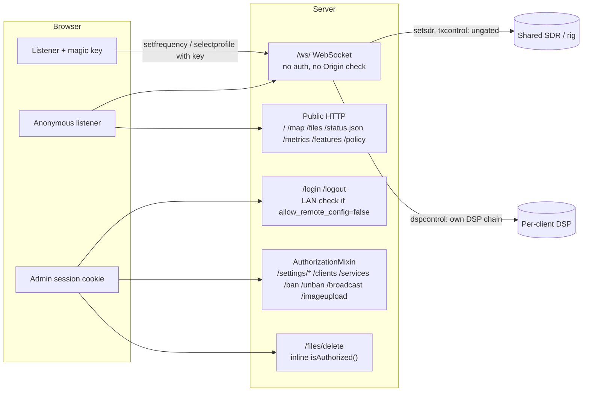
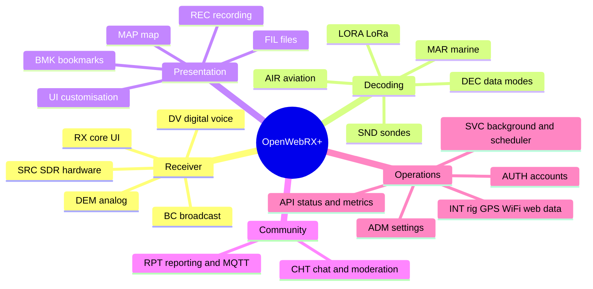
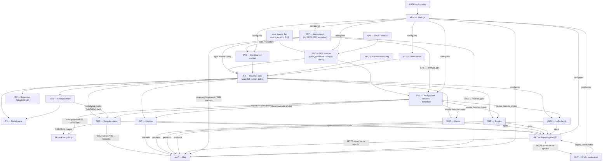

> **Archive: background research.** This is a reverse-engineering analysis of OpenWebRX+ v1.2.126 (commit `f2a8feca`), made on 2026-10-06 before the Product specification was written. It is not part of the specification (see `FEATURE_SPEC.md` and `TECHNICAL_SPEC.md`). Cross-references to `TECHNICAL_AUDIT.md` point to the companion file in this folder.

# OpenWebRX+ — Feature Audit

> **Subject:** OpenWebRX+ `v1.2.126` (luarvique fork of jketterl/openwebrx), repository at commit `f2a8feca` ("Preparing for release", 2026-10-04).
> **Companion document:** [`TECHNICAL_AUDIT.md`](openwebrxplus-technical-audit.md) covers how it works, the architecture, the wire protocol, dependencies, security and technical warnings.
> **Purpose:** list every feature the application exposes, down to the smallest one, with who can use it, where access is enforced, and what each feature depends on. The inventory is meant to support a possible re-implementation (target stack not yet chosen).
> **Method:** static reverse-engineering of the whole repository (Python backend `owrx/`, `csdr/`, frontend `htdocs/`, packaging) plus the luarvique/jketterl support libraries. Nothing was run against a live receiver. Every row carries `path:line` references. Statements that could not be confirmed statically are marked *(unverified)*.

## Table of contents

1. [Executive summary](#1-executive-summary)
2. [Legend and conventions](#2-legend-and-conventions)
3. [Roles and access model](#3-roles-and-access-model)
4. [Big Feature map](#4-big-feature-map)
5. [Feature catalogue (by Big Feature)](#5-feature-catalogue-by-big-feature)
6. [Rights matrix](#6-rights-matrix)
7. [Feature dependencies](#7-feature-dependencies)
8. [Configuration gate index](#8-configuration-gate-index)
9. [Gaps, inconsistencies and dead features](#9-gaps-inconsistencies-and-dead-features)

---

## 1. Executive summary

OpenWebRX+ is a **multi-user web software-defined-radio (SDR) receiver**. A Linux server drives one or more SDR devices. Any number of browsers then get their own:

- live **waterfall and spectrum**;
- independently tuned **demodulator**, with audio streamed over WebSocket;
- **decoders** for about 70 analog and digital modes, from AM/FM/SSB to FT8, DMR, ADS-B, AIS, APRS, radiosondes, LoRa/Meshtastic, DAB, DRM and HD Radio.

The same server can also run **headless background decoders** on a schedule. Their results go to a live **map**, a **file gallery** and external networks: PSKReporter, WSPRnet, APRS-IS, SondeHub, AIS aggregators and MQTT.

Key facts for the audit:

| Topic | Finding |
|---|---|
| Size of the feature surface | **≈ 385 atomic features** in 22 groups, plus 72 mode definitions in `owrx/modes.py` |
| Roles | Only **two real roles**: *anonymous listener* and *logged-in user* (= full admin). **No RBAC**: every account is an administrator. One *pseudo-role* exists: a listener who knows the **magic key** can retune shared hardware. |
| Anonymous power | Anonymous users can tune their own demodulator, pick any of the 72 modes (even service-only ones, see §9), switch the **shared** SDR profile (unless it is key-locked), chat, and use the map and gallery. If `rig_tx_enabled` is on, they can also key a **transmitter**. |
| Where access is enforced | The server enforces only the admin pages, center-frequency/profile locking, chat on/off and file deletion. Many "permissions" are **client-only**: audio recording, `session_timeout`, `allow_center_freq_changes` in the UI, and bookmark validation. |
| Feature availability | Each feature is **auto-detected at runtime** (`owrx/feature.py`) by probing ~45 external binaries and Python libraries. The feature set therefore varies from one installation to the next. |
| External dependence | Most decoding is delegated to **external programs** (≈ 40 binaries) or to the luarvique C++ libraries (`csdr`, `digiham`, …). OpenWebRX+ itself is an orchestrator, DSP plumbing and a UI. |

## 2. Legend and conventions

**Feature IDs:** `<PREFIX>-<NNN>`. The prefix identifies the Big Feature (§4). IDs are stable within this document and are used in `TECHNICAL_AUDIT.md`.

**Rights columns:**

| Column | Actor |
|---|---|
| **Anon** | Anonymous web listener (no login) |
| **Key** | Anonymous listener who supplies the `magic_key` (URL `#key=` or Key plugin). Default key is `"memagic"` (public) |
| **Admin** | Any logged-in user. All accounts are administrators. If `allow_remote_config=false`, only the *login* must come from a private-network address (see AUTH rows) |

The **CLI/OS operator** (shell access: `openwebrx admin …`, editing `/etc/openwebrx/*`, `settings.json`, `config_webrx.py`) can do everything an admin can do, and more. **System** rows are background behaviours with no user.

**Cell values:**

| Value | Meaning |
|---|---|
| ✅ | allowed |
| ❌ | denied |
| ⚙️ `key` | allowed only when the config key / feature flag allows it |
| 👁 | read-only |
| `CLI` | only via files or command line |
| `n/a` | not applicable |

**Enforced:** `server` means checked by the backend. `client-only` means the browser hides or blocks the feature but a crafted client can bypass it. `both` means checked in both places.

**Columns of the catalogue tables:** `ID | Feature | Description | Entry point (UI element / HTTP route / WS message / shortcut) | Gate (config key / feature flag) | Anon | Key | Admin | Enforced | Depends on | Refs`.

Paths in *Refs* are relative to the repository root, unless they are prefixed `ext/`, which means a support-library repository (see TECHNICAL_AUDIT §6.10). Some references use short forms: `openwebrx.js` stands for `htdocs/openwebrx.js` and `lib/X.js` for `htdocs/lib/X.js`. A bare module name (`dsp.py:…`, `selector.py:…`, `chain/…`, `module/…`) refers to the unique file of that name under `owrx/` or `csdr/`.

## 3. Roles and access model

### 3.1 Actors

| Actor | How identified | What it can do (summary) | Source |
|---|---|---|---|
| **Anonymous listener** | Nothing. A WebSocket connection is counted per IP (`max_clients`, `max_clients_per_ip`). The IP comes from `X-Forwarded-For` when the peer is private or a trusted proxy. | <ul><li>Receiver UI and its own DSP chain: tune, mode, bandpass, squelch, NR</li><li>Waterfall</li><li>Switch **shared** SDR/profile (unless `key_locked`)</li><li>Chat (if `allow_chat`)</li><li>Map, files gallery and download</li><li>Public endpoints: `/status.json`, `/metrics`, `/features`</li><li>PTT if `rig_tx_enabled`</li></ul> | `owrx/connection.py:319-416`, `owrx/client.py:48-73,165-174` |
| **Magic-key holder** | `key` parameter in `selectprofile`/`setfrequency` WS messages, equal to `magic_key` | Everything Anon can do, plus: <ul><li>change the **center frequency** of the shared SDR (if `allow_center_freq_changes`)</li><li>select `key_locked` profiles</li></ul> | `owrx/connection.py:345-355,386-416` |
| **Admin (logged-in user)** | `owrx-session` cookie (uuid4, in-memory, 6 h sliding). `users.json` with PBKDF2. No roles or permissions. | Everything, plus: <ul><li>all `/settings/*` pages</li><li>client list, ban/unban, broadcast</li><li>services page</li><li>image upload</li><li>file deletion</li></ul> | `owrx/controllers/admin.py:32-56`, `owrx/users.py` |
| **LAN-only modifier** | `allow_remote_config=false` → `/login` and `/logout` return 403 unless `request.local` (`ipaddress.is_private` of the socket peer) | Restricts **only the login form**. An existing session cookie works from anywhere (see AUTH rows and SEC-01/02 in TECHNICAL_AUDIT). | `owrx/controllers/session.py:57,63,91` |
| **CLI / OS operator** | Shell on the host | <ul><li>`openwebrx admin adduser/removeuser/resetpassword/listusers/disableuser/enableuser/hasuser`</li><li>`openwebrx config migrate`</li><li>edit `openwebrx.conf`, `config_webrx.py` (executed as Python), `settings.json`, `bookmarks.d`, `markers.d`, bandplans</li><li>install binaries, which enables features</li></ul> | `owrx/admin/*`, `owrx/config/*` |
| **System** | — | <ul><li>Background services and scheduler</li><li>Reporting to external networks</li><li>Web data refresh (EIBi, RepeaterBook, receiver lists)</li><li>GPS</li><li>WiFi hotspot fallback</li></ul> | `owrx/service/*`, `owrx/reporting/*`, `owrx/web/*` |

### 3.2 Access-control architecture at a glance

### 3.3 Role-level summary matrix

| Capability family | Anon | Key | Admin | CLI | Enforced |
|---|---|---|---|---|---|
| Listen, tune own demodulator, change mode, bandpass, squelch, NR | ✅ | ✅ | ✅ | — | server (own chain only) |
| Change **shared** profile (not key-locked) | ✅ | ✅ | ✅ | — | server |
| Change **shared** profile (key-locked) | ❌ | ✅ | ✅ (needs key too: the admin session is not consulted on WS) | — | server |
| Change **shared** center frequency | ❌ | ⚙️ `allow_center_freq_changes` | same as Key | — | server (UI never reads the flag) |
| Attach own connection to any SDR device (`setsdr`), including a key-locked one, at its current profile. Starts an on-demand device. | ✅ | ✅ | ✅ | — | **ungated** (lock checked only on profile change, `owrx/connection.py:386-439`) |
| Transmit (PTT via `txcontrol`) | ⚙️ `rig_tx_enabled` | ⚙️ | ⚙️ | — | **server flag only, no auth** |
| Chat | ⚙️ `allow_chat` | ⚙️ | ⚙️ | — | server |
| Record audio in browser | ⚙️ `allow_audio_recording` | ⚙️ | ⚙️ | — | **client-only** |
| View map / files / status / metrics / features | ✅ | ✅ | ✅ | — | public |
| Delete stored files | ❌ | ❌ | ✅ | ✅ (fs) | server |
| Settings pages (all) | ❌ | ❌ | ✅ | ✅ (files) | server |
| Client list, ban/unban, broadcast | ❌ | ❌ | ✅ | — | server |
| User management | ❌ | ❌ | own password only | ✅ | server / CLI |
| Install decoders / enable features | ❌ | ❌ | ❌ | ✅ | OS |

> **Note.** The WebSocket never looks at the admin session. On the receiver page an admin has exactly the same powers as an anonymous listener, plus whatever the magic key gives. Admin powers exist only on HTTP pages.

## 4. Big Feature map

| # | Big Feature | Prefix(es) | Rows | Scope |
|---|---|---|---|---|
| 1 | **Receiver core** | `RX` | 42 | Profile/SDR selection, tuning, frequency display, zoom, waterfall/spectrum, colours, bandplan, S-meter and status bars, volume/mute, squelch, NR, bandpass, URL state |
| 2 | **SDR sources & hardware** | `SRC` | 21 (+27-type matrix) | Supported SDR types, device options (PPM, gain/AGC, LFO, IQ swap, rtl_tcp compat, bias-tee…), lifecycle |
| 3 | **Analog demodulation** | `DEM` | 19 | AM, SAM, NFM, WFM (+RDS), LSB/USB/CW, data USB/LSB, empty |
| 4 | **Digital voice** | `DV` | 16 | DMR, D-Star, NXDN, YSF, P25, M17, FreeDV, RADE, TETRA, codecserver/AMBE, RadioID lookup |
| 5 | **Digital broadcast** | `BC` | 11 | DRM (Dream), DAB (csdr-eti + dablin), HD Radio (nrsc5) |
| 6 | **Data decoders** | `DEC` | 49 | WSJT family, JS8, MSK144, packet/APRS, PSK31/63, RTTY, CW, SITOR-B, NAVTEX, paging, SelCall/ZVEI, EAS/SAME, SSTV, FAX, skimmers, ISM/wM-Bus, speech-to-text… |
| 7 | **Aviation** | `AIR` | 9 | ADS-B, UAT, HFDL, VDL2, ACARS, aircraft manager |
| 8 | **Marine** | `MAR` | 3 | AIS, DSC, NAVTEX parsing |
| 9 | **Radiosondes** | `SND` | 7 | RS41, DFM09/17, MTS01, M10, M20 |
| 10 | **LoRa family** | `LORA` | 7 | LoRaWAN, LoRa-APRS, FANET, Meshtastic, MeshCore, MeshCom |
| 11 | **Bookmarks & scanner** | `BMK` | 11 | Server/regional/country bookmarks, EIBi & repeater auto-bookmarks, local bookmarks, search, scanner |
| 12 | **Map** | `MAP` | 19 | Leaflet/Google, tile providers, overlays, marker types, locators, filters, popups |
| 13 | **Files gallery** | `FIL` | 6 | SSTV/FAX/recordings gallery, download, delete, retention |
| 14 | **Recording** | `REC` | 2 | In-browser MP3 recording (server-side recording is in SVC) |
| 15 | **Chat, clients & moderation** | `CHT` | 8 | Chat, client list, ban/unban, broadcast, bot detection, limits |
| 16 | **Background services & scheduler** | `SVC` | 22 | Headless decoders, static/daylight schedules, always-on, resamplers, background recording, speech-to-text |
| 17 | **Reporting & spotting** | `RPT` | 23 | PSKReporter, WSPRnet, APRS-IS iGate, SondeHub, AIS UDP, MQTT pub/sub, ReceiverId listing |
| 18 | **Integrations** | `INT` | 15 | Rig control (hamlib), GPS, WiFi, EIBi, RepeaterBook, receiver directories, markers, CPU/temp/battery |
| 19 | **Public API endpoints** | `API` | 5 | `status.json`, `/features`, `/api/features`, `/metrics`, services page |
| 20 | **Administration settings** | `ADM` | 56 | Every settings page, field group, SDR/profile CRUD, scheduler editor, bookmarks editor, WiFi, `config migrate` |
| 21 | **Authentication & accounts** | `AUTH` | 19 | Login, logout, sessions, password change, CLI user commands, LAN-only login |
| 22 | **UI customisation & help** | `UI` | 15 | Themes, waterfall themes, opacity, keyboard shortcuts, help, plugins API, policy page, session timeout |

---

## 5. Feature catalogue (by Big Feature)

The sections below follow the order of §4. Each section starts with the atomic features table. Some sections then add supporting tables: the mode catalogue, the SDR-type matrix, keyboard shortcuts and localStorage keys.

### 5.1 Receiver core (RX)

| ID | Feature | Description | Entry point | Gate | Anon | Key | Admin | Enforced | Depends on | Refs |
|---|---|---|---|---|---|---|---|---|---|---|
| RX-001 | Page bootstrap & WS connect | On `body onload`, `openwebrx_init()` names the window `openwebrx-rx` (map links target it). It builds AudioEngine, progress bars, the WS (`ws(s)://<page dir>/ws/`), secondary waterfall, spectrum, panels, demod panel, BookmarkBar, Scanner, Bandplan and Clock. Handshake `SERVER DE CLIENT client=openwebrx.js type=receiver`, then `connectionproperties{output_rate,hd_output_rate}`. | `index.html:45`, `/` | — | ✅ | ✅ | ✅ | n/a | WS `/ws/` | `openwebrx.js:1429-1468`, `1197-1217`, `1281-1309` |
| RX-002 | Auto-reconnect with exponential backoff | On WS close: stop the demodulator and reconnect after 1 s, doubling up to 512 s. A `backoff` message forces 16 s. | automatic | — | ✅ | ✅ | ✅ | client-only | RX-001 | `openwebrx.js:1259-1273`, `1119-1126` |
| RX-003 | Audio autoplay overlay ("Start OpenWebRX+") | If the AudioContext is not running, a full-screen overlay asks for a click (browser autoplay policy). On Android it also shows a Google Play link to the OWRX Android app (`com.fms.owrx`). | click overlay | — | ✅ | ✅ | ✅ | n/a | AudioEngine | `index.html:395-405`, `openwebrx.js:1433-1447`, `1519-1525` |
| RX-004 | Error overlay | Shows "receiver unavailable" with a message on `sdr_error` (e.g. "No SDR Devices available") or `backoff` (e.g. "Too many clients", "Client address banned"). It hides when a non-empty `profiles` list arrives. | WS `sdr_error`, `backoff` | `max_clients`, bans | ✅ | ✅ | ✅ | server | — | `index.html:386-392`, `openwebrx.js:1089-1095`, `1119-1126`, `1060-1062`; `owrx/connection.py:176-180` |
| RX-005 | Profile select | A dropdown filled from WS `profiles` (`id`="sdr_id\|profile_id"). On change it sends `selectprofile{profile,key}`. If the profile is locked, the server refuses unless `magic_key` is empty or matches. Robot detection: a fast profile switch adds to a score, and at ≥30 the client is banned for 12 h (`bot_ban_enabled`). | `#openwebrx-sdr-profiles-listbox`, shortcut `P` | locked profile + `magic_key`; `bot_ban_enabled` | ✅ (unlocked) | ✅ (incl. locked) | same as Anon (no session check on WS) | server | WS | `index.html:239`, `openwebrx.js:1051-1063`, `1814-1820`; `owrx/connection.py:338-343`, `386-416` |
| RX-006 | Mode buttons & DIG selector | Analog modes show as a button grid. Digital modes show in a `<select>` next to "DIG", sorted by name. Clicking an analog button while a digimode is active only switches the underlying demod if it is compatible (highlighted `same-mod`). Modes come from WS `modes` and are filtered by `features`. | `.openwebrx-modes`, shortcuts `0..9`, `Ctrl+0..9` | feature flags (server) | ✅ | ✅ | ✅ | server (mode list) | Modes.js | `lib/DemodulatorPanel.js:20-40`, `54-91`, `93-171`; `lib/Modes.js:1-52` |
| RX-007 | Click/drag tuning on waterfall & spectrum | Left-click tunes to the pointer frequency, snapped to the tuning step, and stops the scanner. Left-drag pans the zoomed waterfall. Touch events become mouse events. Two-finger pinch zooms. | waterfall/spectrum canvas | — | ✅ | ✅ | ✅ | client-only (DSP param range-checked server-side) | RX-010 | `openwebrx.js:684-791`, `551-682`, `1605-1619` |
| RX-008 | Tune buttons & tuning by steps | `<`/`>` round buttons tune ±1 step. Right-click on them does a center-frequency jump (RX-009). The 8.33 kHz step uses airband 25 kHz triplets (0/8330/16670). | `.openwebrx-tune-button`, `←/→` keys, wheel | — | ✅ | ✅ | ✅ | client-only | RX-011 | `index.html:55-60`, `openwebrx.js:61-84`; `lib/Utils.js:203-223` |
| RX-009 | Center-frequency jump (side-step profile) | Sends `setfrequency{frequency=center±bw/4,key}`. The server accepts only if `allow_center_freq_changes` is set **and** (`magic_key`=="" or key matches). The UI is **not** hidden when disallowed; the request is just ignored silently. | right-click tune buttons, `PageUp/PageDown` | `allow_center_freq_changes` (default False), `magic_key` | ❌ (⚙️ if magic_key empty) | ⚙️ `allow_center_freq_changes` | same as Anon/Key | server | — | `openwebrx.js:125-137`; `owrx/connection.py:345-355`; `owrx/config/defaults.py:359-360` |
| RX-010 | Frequency display & direct input | Shows the tuned frequency with an auto unit (Hz/kHz/MHz/GHz/THz). `tuning_precision` sets how many decimals. Mouse wheel over a digit changes that digit. A click opens a numeric input plus a unit `<select>`. Enter submits, Esc cancels, and typing k/M/G/T sets the unit and submits. The second line shows the frequency under the mouse pointer. | `.webrx-actual-freq`, `.webrx-mouse-freq`, shortcut `T` | `tuning_precision` (server config) | ✅ | ✅ | ✅ | client-only | — | `lib/FrequencyDisplay.js:1-184`; `lib/DemodulatorPanel.js:9-17`, `412-415`; `openwebrx.js:965-966` |
| RX-011 | Tuning step selector | Steps: 1, 10, 20, 50, 100, 500 Hz, 1, 2.5, 3, 5, 6, 6.25, 8.33 (airband), 9, 10, 12, 12.5, 25, 50 kHz. The profile default comes from config `tuning_step`. The reset button and any profile change restore the default. | `#openwebrx-tuning-step-listbox`, `Ctrl+←/→` | `tuning_step` per profile | ✅ | ✅ | ✅ | client-only | — | `index.html:254-277`; `openwebrx.js:968-971`, `1822-1829` |
| RX-012 | CW offset handling | In CW the displayed frequency is the carrier frequency plus the CW tone offset. The offset is the center of the saved (or default) CW bandpass, else 800 Hz. `Utils.offsetFreq` also shifts bookmarks for fax (−1900 Hz), cwdecoder, rtty*, bpsk*, sitorb, navtex and dsc (−1000 Hz). | implicit | — | ✅ | ✅ | ✅ | client-only | RX-020 | `lib/UI.js:137-191`; `lib/Utils.js:69-88` |
| RX-013 | Zoom | 14 logarithmic levels, up to 33 Hz/pixel. Zoom in/out one step, fully in, fully out. Wheel zoom with button held or Shift (inverted by RX-031). Pinch zoom. A profile change resets zoom to 0. | Display section buttons, `↑/↓`, wheel | — | ✅ | ✅ | ✅ | client-only | — | `index.html:368-371`; `openwebrx.js:45-59`, `794-856`, `955-958` |
| RX-014 | Waterfall | Canvas strips 200 px tall, each FFT line drawn with the current color map, using `fft_size` bins. FFT frames arrive as binary type 1, float32 or ADPCM per `fft_compression` (the first 10 samples are padding, values /100). | main area | `fft_size`, `fft_fps`, `fft_compression` | ✅ | ✅ | ✅ | n/a | WS binary | `openwebrx.js:1138-1169`, `1311-1399`; `lib/Waterfall.js:166-196` |
| RX-015 | Spectrum display (toggle) | A canvas above the scale, redrawn every 150 ms. Peak-hold with decay (/10). The range follows the waterfall levels ±5 dB. Hidden by default. | Display button, shortcut `V` | — | ✅ | ✅ | ✅ | client-only (LS `ui_spectrum`) | RX-014 | `lib/Spectrum.js:1-141`; `lib/UI.js:420-427` |
| RX-016 | Waterfall color levels (manual) | Min/max sliders from −200 to +100 dB. min is forced below max. | sliders, keys `,` `.` (min) `<` `>` (max), wheel on slider | — | ✅ | ✅ | ✅ | client-only | — | `index.html:289,299`; `lib/Waterfall.js:66-92` |
| RX-017 | Waterfall auto-levels (once / continuous) & default | AUTO button: measure min/max once over the visible range, trimming 10 % at each edge, then apply margins from `waterfall_auto_levels`, with at least `waterfall_auto_min_range`. Right-click (or `X`) toggles continuous tracking, which disables the sliders. `waterfall_auto_level_default_mode` sets the initial state. DEFAULT button (or `C`) restores `waterfall_levels`. Levels reset on profile change. | AUTO / DEFAULT buttons; `Z`, `X`, `C` | `waterfall_levels`, `waterfall_auto_levels`, `waterfall_auto_min_range`, `waterfall_auto_level_default_mode` | ✅ | ✅ | ✅ | client-only | — | `lib/Waterfall.js:29-164`; `openwebrx.js:961-963`, `1483-1488` |
| RX-018 | Frequency scale & filter envelope | A scale canvas with MHz labels (adaptive spacing) and the demod passband envelope (yellow) showing low/high cut numbers. When the bandpass is unknown, a dashed ±3 kHz (or ifRate/2) indicator is drawn. | scale canvas | — | ✅ | ✅ | ✅ | n/a | — | `openwebrx.js:229-535`; `lib/Demodulator.js:43-144` |
| RX-019 | Bandpass drag / BFO / PBS / wheel | Drag the envelope edges to change low/high cut. Drag the body to retune. Shift+drag the center line = BFO (move offset, keep passband). Shift+drag the body = PBS (passband shift). Wheel over the envelope shifts it ±50 Hz. Shift-wheel or wheel with button held widens/narrows. Limits are per mode (e.g. 6.25 kHz for DMR/D-Star/NXDN/YSF/M17, 100 kHz for WFM, 50 kHz for DRM, 600 kHz for ISM, 24 kHz for LSBD/USBD, else output_rate/2), with a 100 Hz minimum passband. | scale canvas; `Shift+←/→/↑/↓` (±50 Hz) | — | ✅ | ✅ | ✅ | client-only (server applies values; server-side clamping not verified) | RX-020 | `lib/Demodulator.js:1-36`, `146-242`, `412-439`; `openwebrx.js:252-322`; `lib/Shortcuts.js:194-270` |
| RX-020 | Saved bandpasses per modulation | Analog-mode bandpass changes are saved to LS `bp-<mod>` and restored for each new demodulator. `\|` (or `UI.resetAllBandpasses`) clears them all and resets the current one. | automatic; key `\|` | — | ✅ | ✅ | ✅ | client-only (LS) | — | `lib/UI.js:266-309`; `lib/Demodulator.js:264-274`, `431-433` |
| RX-021 | S-meter & dB readout | Bar with green/yellow (>0.7)/red (>0.9) zones, scaled to the waterfall range ±20 dB, plus a numeric "x.x dB". Fed by WS `smeter` (linear, converted to 10·log10). | `#openwebrx-smeter` | — | ✅ | ✅ | ✅ | n/a | — | `openwebrx.js:139-182`, `1026-1029`; `index.html:376-380` |
| RX-022 | Squelch slider | −150..0 dB, sent as `squelch_level` in `dspcontrol`. The slider track is colored by the current S-meter level (bright green when open). Disabled for modes without `squelch`. Initial value from `initial_squelch_level`. Present in URL hash `sql=`. | `.openwebrx-squelch-slider`; `{` `}`; `D` = off | `initial_squelch_level` | ✅ | ✅ | ✅ | client-only UI, DSP applies | — | `index.html:284`; `openwebrx.js:157-168`, `905-906`; `lib/DemodulatorPanel.js:46-48`, `393-397`, `308-311` |
| RX-023 | Auto squelch | Sets squelch = current S-meter dB + `squelch_auto_margin` (default 10). Right-click the same button for the scanner (BMK-010). | `.openwebrx-squelch-auto`, key `A` | `squelch_auto_margin` | ✅ | ✅ | ✅ | client-only | RX-021 | `lib/DemodulatorPanel.js:41-45`; `openwebrx.js:945-946` |
| RX-024 | Tune-by-squelch (signal seek) | `[` / `]` walks the peak-hold copy of the last FFT (`wf_data`, decaying /5) one tuning step at a time. It stops at the first bin ≥ squelch−13 dB. | keys `[` `]` | — | ✅ | ✅ | ✅ | client-only | RX-014 | `openwebrx.js:86-123` |
| RX-025 | Volume & mute | Volume slider 0..150 mapped to −55..+5 dB gain. Mute keeps the previous value. Stored in LS `volume`/`volumeMuted` and restored once audio starts. Wheel on the slider works. | slider, mute button, `Space`, `Ctrl/Alt+↑/↓` | — | ✅ | ✅ | ✅ | client-only | AudioEngine | `index.html:249-253`; `lib/UI.js:57-79`, `219-259` |
| RX-026 | Noise reduction toggle & level | Toggle plus level slider (−20..+20 dB). Sent as `connectionproperties{nr_enabled,nr_threshold}`. Server config `initial_nr_level` (integer → enabled at that level). Stored in LS. | NR button/slider, key `N` | `initial_nr_level` | ✅ | ✅ | ✅ | client-only UI; server DSP applies | — | `index.html:292-295`; `lib/UI.js:316-347`; `openwebrx.js:908-916` |
| RX-027 | URL hash state (deep link) | `#freq=<Hz>,mod=<m>,secondary_mod=<m>,sql=<dB>,key=<magic>`. It is rewritten on every tune, mode or squelch change. `hashchange` re-applies it. freq/mod/secondary_mod/sql are applied only if freq lies inside the current profile bandwidth; it never switches profile. The `key` param sets the magic key used by RX-005/RX-009. | `window.location.hash` | — | ✅ | ✅ (via `key=`) | ✅ | client-only | — | `lib/DemodulatorPanel.js:49-51`, `212-225`, `267-280`, `327-391` |
| RX-028 | Bandplan ribbon | Optional ribbon above the scale. Bands come from WS `bands` (server `Bandplan.findBandsInRange`, file `bands[-r<region>].json` per `bandplan_region`). Colored by first tag: hamradio `#006000`, broadcast `#000080`, public `#400040`, service `#800000`, else gray. The label is truncated word by word to fit. | checkbox "Show band plan ribbon", key `B` | `bandplan_region` | ✅ | ✅ | ✅ | client-only (LS `ui_bandplan`) | — | `lib/Bandplan.js:1-131`; `openwebrx.js:1047-1050`; `owrx/connection.py:244-254`; `owrx/bands.py:86-153` |
| RX-029 | Dial frequencies (green bookmarks) | Mode dial frequencies from the bandplan (e.g. FT8) are shown as green bookmarks named in upper case. Clicking tunes mode + frequency. | bookmark bar | `bandplan_region` | ✅ | ✅ | ✅ | n/a | RX-028 | `openwebrx.js:1075-1085`; `owrx/bands.py:151-153`; `owrx/connection.py:231` |
| RX-030 | Cross-hair pointer frequency | An optional floating label next to the mouse showing the frequency under the pointer. Hidden while dragging. | checkbox "Show pointer frequency" | — | ✅ | ✅ | ✅ | client-only (LS `ui_crossfreq`) | — | `lib/UI.js:463-498` |
| RX-031 | Wheel swap | "Hold mouse wheel down to tune". Inverts the default wheel behavior (tune ↔ zoom). Shift or a held button gives the other action. | checkbox | — | ✅ | ✅ | ✅ | client-only (LS `ui_wheel`) | — | `lib/UI.js:500-515`; `openwebrx.js:773-791` |
| RX-032 | Slider wheel control | The mouse wheel over any enabled range slider in the receiver panel moves it by one step. | wheel | — | ✅ | ✅ | ✅ | client-only | — | `openwebrx.js:1470-1481` |
| RX-033 | UTC clock | Shows `HH:MM UTC`, refreshed at each minute boundary. Also used on the map legend. | `#openwebrx-clock-utc` | — | ✅ | ✅ | ✅ | n/a | — | `lib/Clock.js:1-21`; `openwebrx.js:1466-1467` |
| RX-034 | Status bars panel | Bars for audio buffer (ScriptProcessor only, over/underrun), audio output (ksps, red if outside 0.25–1.25× sample rate), audio stream (kbps), network usage (60 s window, full scale 2000 kbps), server CPU % (+°C from `temperature`), and clients (n/max, red >85 %). Battery bar (WS `battery`: charge/voltage/current/charger) replaces the audio-speed bar once received. | Status button, `#openwebrx-panel-status` | `max_clients` | ✅ | ✅ | ✅ | n/a | — | `index.html:216-224`; `lib/ProgressBar.js:1-195`; `openwebrx.js:1030-1046`, `1406-1427`; `lib/Measurement.js` |
| RX-035 | Receiver header & photo | Header shows receiver name, location, locator, ASL, avatar and top photo (`receiver_avatar`/`receiver_top_photo` in the data dir override the static files). Click toggles the photo/description. Window title becomes "OpenWebRX+ \| name". Values come from server template substitution **and** WS `receiver_details`, inserted as raw HTML. | header | `receiver_name`, `receiver_location`, `receiver_asl`, `receiver_gps`, `photo_title`, `photo_desc` | 👁 | 👁 | 👁 | n/a | — | `htdocs/include/header.include.html`; `lib/Header.js:16-64`; `owrx/controllers/template.py:22-35`; `owrx/details.py:10-34`; `owrx/controllers/assets.py:91-103` |
| RX-036 | Header navigation buttons | Help (`receiver_help` URL, target `openwebrx-help`), Status, Log/Chat, Receiver (panel toggles), Map (`map` or `map?type=…`), Files, Settings. Each external page opens in a named window. | header | `receiver_help`, `map_type` | ✅ (Settings → login) | ✅ | ✅ | server for Settings | — | `htdocs/include/header.include.html:9-17`; `lib/Header.js:1-14` |
| RX-037 | Collapsible panels & sections | Panels flip in and out with a CSS 3D transition. Receiver-panel sections (Modes, Controls, Settings, Display) collapse. Section state is stored in LS under each section's element id. | header toggles, section dividers, `Enter` toggles the receiver panel | — | ✅ | ✅ | ✅ | client-only | — | `openwebrx.js:1537-1603`; `lib/UI.js:24-30`, `401-417` |
| RX-038 | Log / message panel | `divlog()` appends HTML messages (WS `log_message`, errors in red, connection info). The panel auto-opens on error and auto-hides 2 s after audio start unless an error happened. Includes author/doc/support links. | Log panel | — | ✅ | ✅ | ✅ | n/a | — | `openwebrx.js:1221-1232`, `1240-1255`, `1113-1115`; `index.html:193-215` |
| RX-039 | Bookmark/tune info bubble | Floating bubble showing bookmark name and description for 3 s after tuning to a bookmark. | auto | — | ✅ | ✅ | ✅ | n/a | BMK | `lib/UI.js:85-101`, `193-212` |
| RX-040 | Secondary (digimode) waterfall & channel pick | For digimodes with `secondaryFft`: a mini waterfall over the passband (binary type 3). Clicking or dragging selects the secondary offset (`secondary_offset_freq`, sent at most every 50 ms). Plain-text decoders print to a scrolling console (ASCII filtered). | `#openwebrx-panel-digimodes` | `digimodes_fft_size` | ✅ | ✅ | ✅ | n/a | DEC | `openwebrx.js:1632-1812`, `1016-1022` |
| RX-041 | Decoder & metadata panels (routing only) | Routes WS `secondary_demod` to the matching message panel (wsjt, packet, pocsag, page, sstv, fax, ism, hfdl, adsb, dsc, skimmer, meshtastic, js8) and `metadata` to the meta panels (dmr, ysf, dstar, nxdn, m17, p25, tetra, wfm(RDS), hdr, dab, drm). Each panel has a Clear button. SSTV/FAX images can be saved as PNG. DMR timeslots can be muted by click (`dmr_filter`). Details belong to DEC/DV/BC. | panels | feature flags | ✅ | ✅ | ✅ | n/a | DEC/DV/BC | `openwebrx.js:1099-1112`, `1497-1517`; `lib/DemodulatorPanel.js:177-206`; `lib/MessagePanel.js:1-58`, `798`, `867`; `lib/Utils.js:291-312` |
| RX-042 | HD audio path | Binary type 4 = HD audio (36–48 kHz output) for WFM/DAB etc. The rate is negotiated via `hd_output_rate`. | automatic | — | ✅ | ✅ | ✅ | n/a | AudioEngine | `openwebrx.js:1187-1190`; `lib/AudioEngine.js:236-321` |

### 5.2 SDR sources & hardware (SRC)

#### Feature rows

| ID | Feature | Description | Entry point | Gate | Anon | Key | Admin | Enforced | Depends on | Refs |
|---|---|---|---|---|---|---|---|---|---|---|
| SRC-001 | SDR type registry | The device type is a module name under `owrx/source/`. The class is resolved by `title()`-casing (`rtl_sdr`→`RtlSdrSource` / `RtlSdrDeviceDescription`). The settings UI lists only types with a description **and** an available feature flag. | `/settings/newsdr` | feature flag = type name | ❌ | ❌ | ✅ | server | FeatureDetector | `owrx/sdr.py:65-70`, `owrx/source/__init__.py:652-677` |
| SRC-002 | Device validity | A device is instantiated only if its type is available and it has at least one profile; otherwise it is logged and skipped. | automatic | – | – | – | – | server | – | `owrx/sdr.py:30-63` |
| SRC-003 | Enable / disable device | Disabling stops the source, clears the failed flag and removes it from active sources (clients are switched away). | `/settings/sdr/<id>` | `enabled` | ❌ | ❌ | ✅ | server | – | `owrx/source/__init__.py:174-208,710` |
| SRC-004 | Start retry & failure | Startup polls the TCP port up to 1000×. A failed start is retried every 15 s up to 10 times, then the source is marked **failed** (removed until disabled and re-enabled or restart). An unexpected exit while RUNNING also marks it failed. | automatic | – | – | – | 👁 device log | server | – | `owrx/source/__init__.py:178-181,340-448` |
| SRC-005 | Device log view | The last 200 log records of each source (including connector stdout/stderr through LogPipe) are shown on the device page. | `/settings/sdr/<id>` | – | ❌ | ❌ | ✅ | server | – | `owrx/log/__init__.py:30-52`, `owrx/controllers/settings/sdr.py:286`, `owrx/source/__init__.py:121,359-360` |
| SRC-006 | Profiles | Named profiles (center_freq, samp_rate, start_freq, start_mod, tuning_step mandatory) stacked over device props. Validation warns on missing center/samp_rate or out-of-range start_freq. Profile name may not override device name. | `/settings/sdr/<id>/profile/<pid>`, new/delete/move up/down | – | ❌ | ❌ | ✅ | server | – | `owrx/source/__init__.py:80-111,125-160,229-245,821-822`, `owrx/http.py:126-155` |
| SRC-007 | Profile switching by listener | A listener switches the shared source to another profile (affects all users of that SDR). | WS `selectprofile` | `key_locked` (device or profile) needs `magic_key` | ✅ unless locked | ✅ | ✅ | server | – | `owrx/source/__init__.py:274-281,465-472,720-724`, `owrx/connection.py:338-343,391-392` |
| SRC-008 | Center frequency change by listener | Moves the SDR center frequency (all users). | WS `setfrequency` | `allow_center_freq_changes` + `magic_key` (empty key = open) | ⚙️ | ⚙️ | ⚙️ | server | – | `owrx/connection.py:344-354`, `owrx/source/__init__.py:283-284` |
| SRC-009 | RF gain / AGC / gain stages | `GainInput`: "auto" (hardware AGC, if `hasAgc`), manual number, or per-stage string (Soapy gain stages, e.g. Airspy LNA/MIX/VGA). Sent live over the connector control socket. | device/profile form | `rf_gain` | ❌ | ❌ | ✅ | server | connector | `owrx/form/input/device.py:7-139`, `owrx/source/__init__.py:725,799-801`, `owrx/source/soapy.py:101-106` |
| SRC-010 | PPM correction | `ppm` → connector `-P`. Hidden for types with `supportsPpm()=False` (airspy, airspyhf, hydrasdr, hackrf, afedri, fifi, perseus, runds, sxceiver). | device/profile form | `ppm` | ❌ | ❌ | ✅ | server | – | `owrx/source/__init__.py:687-693,726-730,817-818`, `owrx/source/connector.py:31` |
| SRC-011 | Oscillator offset (LO offset) | `tuner_freq = center_freq + lfo_offset` for up/down-converters. Applied at start (`-f`) and on live change. | device/profile form | `lfo_offset` | ❌ | ❌ | ✅ | server | – | `owrx/source/__init__.py:332-338,731-737`, `owrx/source/connector.py:46-56` |
| SRC-012 | IQ swap | Swaps I/Q (spectrum inversion) → connector `-i`. | device/profile form (connector types except hpsdr) | `iqswap` | ❌ | ❌ | ✅ | server | – | `owrx/source/connector.py:29,91-102`, `owrx/source/hpsdr.py:87-91` |
| SRC-013 | rtl_tcp compatibility port | Connector exposes an rtl_tcp-compatible 8-bit stream on the given port (`-r`), "local machine only" according to the UI text (unverified at connector level). | device form (connector types except hpsdr) | `rtltcp_compat` | ❌ | ❌ | ✅ | server | owrx_connector | `owrx/source/connector.py:30,84-90` |
| SRC-014 | Bias-tee | Powers an LNA over coax. rtl/rtl_tcp `-b`; Soapy setting `biastee` (rtl_soapy, airspy, hydrasdr), `bias_tx` (hackrf), `biasT_ctrl` (sdrplay, mirics); sddc_soapy `UpdBiasT_HF`/`UpdBiasT_VHF`; malahit `biasT`. | device/profile form | `bias_tee` (+ variants) | ❌ | ❌ | ✅ | server | – | `owrx/form/input/device.py:141-143`, per-type refs in 4b |
| SRC-015 | Direct sampling | RTL direct sampling Off/I/Q (`-e` or Soapy `direct_samp`). | device/profile form | `direct_sampling` | ❌ | ❌ | ✅ | server | – | `owrx/form/input/device.py:146-168`, `owrx/source/rtl_sdr.py:15`, `owrx/source/rtl_sdr_soapy.py:11` |
| SRC-016 | Soapy device selector & settings | `device` string (`k=v,…`) gets `driver=<type driver>` injected. Type-specific settings are sent as `-t k=v,…` at start and as `settings:` over the control socket on change. `antenna` (`-a`), `channel` (`-n`, multi-channel only). | device form | `device`, `antenna`, `channel`, type keys | ❌ | ❌ | ✅ | server | soapy_connector | `owrx/source/soapy.py:11-133`, `owrx/soapy.py:1-21` |
| SRC-017 | Live retune without restart | Connector sources send `prop:value\n` over the TCP control socket. Direct sources (perseus, fifi) **restart the process** on any change (fifi only re-runs `rockprog` on center_freq change). | automatic | – | – | – | – | server | – | `owrx/source/connector.py:37-62`, `owrx/source/direct.py:14-18`, `owrx/source/fifi_sdr.py:49-51` |
| SRC-018 | Sample-rate validation | Per-type `RangeListValidator` on `samp_rate` in the form (see 4b). | form | – | ❌ | ❌ | ✅ | server (form only) | – | `owrx/source/__init__.py:746-751,855-857` |
| SRC-019 | Waterfall levels per device/profile | Manual min/max levels and the default auto-level mode. | device/profile form | `waterfall_levels`, `waterfall_auto_level_default_mode` | ✅ (consumed by UI) | – | ✅ | client-only use | RX core | `owrx/source/__init__.py:738-743` |
| SRC-020 | Profile startup defaults | `start_freq`, `start_mod`, `initial_squelch_level` (dBFS), `initial_nr_level` (−20..20 dB), `tuning_step` (1 Hz…50 kHz list). | profile form | same | ✅ (consumed) | – | ✅ | client-only use | RX core | `owrx/source/__init__.py:752-770` |
| SRC-021 | Profile-sorted SDR list / first source | The default source for new listeners is the first active **unlocked** source. | automatic | `key_locked` | ✅ | ✅ | ✅ | server | – | `owrx/sdr.py:228-240` |

#### SDR type matrix

| Type key | UI name | Base | Binary / driver (Soapy `driver=`) | Feature flag requirements | Device-specific options (→ CLI flag or Soapy setting) | Sample rates (form) | PPM | AGC | Refs |
|---|---|---|---|---|---|---|---|---|---|
| `rtl_sdr` | RTL-SDR device | Connector | `rtl_connector` | rtl_connector ≥0.5 | device (serial/index) `-d`, bias_tee `-b`, direct_sampling `-e` | 250 k–3.2 M | ✅ | ✅ | `owrx/source/rtl_sdr.py:9-41` |
| `rtl_sdr_soapy` | RTL-SDR (SoapySDR) | Soapy | `soapy_connector` / `rtlsdr` | soapy_connector, soapy_rtl_sdr | bias_tee→`biastee`, direct_sampling→`direct_samp` | 250 k–3.2 M | ✅ | ✅ | `owrx/source/rtl_sdr_soapy.py` |
| `rtl_tcp` | RTL-SDR via rtl_tcp | Connector | `rtl_tcp_connector <remote>` | rtl_tcp_connector ≥0.5 | **remote** (host:port, mandatory, positional), bias_tee, direct_sampling | 250 k–3.2 M | ✅ | ✅ | `owrx/source/rtl_tcp.py` |
| `sdrplay` | SDRPlay RSP1/2/duo/dx | Soapy | `sdrplay` | soapy_sdrplay | bias_tee→`biasT_ctrl`, rf_notch→`rfnotch_ctrl`, dab_notch→`dabnotch_ctrl`, external_reference→`extref_ctrl`, hdr_ctrl, if_mode (Zero-IF/450k/1620k/2048k), rfgain_sel (0–27), agc_setpoint (−60..0 dBFS); rf_gain is "IF gain reduction" | 62.5 k…1.536 M discrete, 2–10.66 M | ✅ | ✅ | `owrx/source/sdrplay.py` |
| `sxceiver` | OH2EAT SXceiver / M17 SX1255 HAT | Soapy | `sx` | soapy_sx | clk_freq (38.4/32 MHz, mandatory), **clk_prescaler** replaces samp_rate (1536…64), rfgain_sel (0–78); samp_rate = TCXO/prescaler | 12 discrete | ❌ | ❌ | `owrx/source/sxceiver.py` |
| `elad` | ELAD FDM-S2 | Soapy | `elad` | soapy_elad | – | default 48 k–30 M | ✅ | ✅ | `owrx/source/elad.py` |
| `mirics` | Mirics MSi2500 | Soapy | `soapyMiri` | soapy_mirics | bias_tee→`biasT_ctrl`, offset_tune, bufflen, buffers, asyncbuffers→`asyncBuffs`; gain stages Automatic/LNA/Baseband/Mixer/Mixbuffer | default | ✅ | ✅ | `owrx/source/mirics.py` |
| `malahit_rr` | Malahit Remote Radio | Soapy | `malahitrr` | soapy_malahit_rr | biasT, highZ, lna, attenuator (0–30) | 650 k, 744.192 k, 912 k | ✅ | ❌ | `owrx/source/malahit_rr.py` |
| `hackrf` | HackRF | Soapy | `hackrf` | soapy_hackrf | bias_tee→`bias_tx`; stages LNA/AMP/VGA | 500 k–28 M | ❌ | ✅ | `owrx/source/hackrf.py` |
| `perseussdr` | Perseus SDR | Direct (+nmux, shell pipe) | `perseustest -p -d -1 -a -t 0 -o -` \| `nmux` | perseustest, nmux | attenuator (0/−10/−20/−30 dB `-u`), adc_preamp `-m`, adc_dither `-x`, wideband `-w`; no rf_gain | 48 k…2 M discrete | ❌ | – | `owrx/source/perseussdr.py` |
| `airspy` | Airspy R2 / Mini | Soapy | `airspy` | soapy_airspy | bias_tee→`biastee`, bitpack; stages LNA/MIX/VGA | 2.5/3/6/10 M | ❌ | ✅ | `owrx/source/airspy.py` |
| `airspyhf` | Airspy HF+ / Discovery | Soapy | `airspyhf` | soapy_airspyhf | – | 192…912 k discrete | ❌ | ✅ | `owrx/source/airspyhf.py` |
| `hydrasdr` | HydraSDR RFone | Soapy | `hydrasdr` | soapy_hydrasdr | bias_tee→`biastee`, bitpack; LNA/MIX/VGA | 2.5/5/10 M | ❌ | ✅ | `owrx/source/hydrasdr.py` |
| `afedri` | Afedri | Soapy | `afedri` | soapy_afedri | afedri_adress_port (IPv4:port, mandatory → `address=,port=`), rx_mode (0–5), r820t_lna_agc, r820t_mixer_agc; 4 channels; stages RF/FE/R820T_* | 48 k–2.4 M | ❌ | ❌ | `owrx/source/afedri.py` |
| `lime_sdr` | LimeSDR | Soapy | `lime` | soapy_lime_sdr | stages TIA/LNA/PGA | 100 k–65 M | ✅ | ✅ | `owrx/source/lime_sdr.py` |
| `fifi_sdr` | FiFi SDR | Direct (+nmux, shell pipe) | `arecord -D <dev> -r <sr> -t raw -f S16_LE -c2 -` \| `nmux`; `rockprog --vco -w --freq=<MHz>` for tuning | alsa (arecord), rockprog, nmux | device (ALSA, regex-validated); s16→float conversion and gain ×5 | 48/96/192 k | ❌ | ✅ (no effect, unverified) | `owrx/source/fifi_sdr.py` |
| `pluto_sdr` | PlutoSDR | Soapy | `plutosdr` | soapy_pluto_sdr | hostname | 520.833 k–61.44 M | ✅ | ✅ | `owrx/source/pluto_sdr.py` |
| `soapy_remote` | SoapyRemote device | Soapy | `remote` | soapy_remote | **remote** (mandatory), remote_driver → `remote:driver=` | 500 k–20 M | ✅ | ✅ | `owrx/source/soapy_remote.py` |
| `uhd` | Ettus USRP | Soapy | `uhd` | soapy_uhd | – | 0–64 M | ✅ | ✅ | `owrx/source/uhd.py` |
| `radioberry` | RadioBerry | Soapy | `radioberry` | soapy_radioberry | – | 48/96/192/384 k | ✅ | ✅ | `owrx/source/radioberry.py` |
| `fcdpp` | FunCube Dongle Pro+ | Soapy | `fcdpp` | soapy_fcdpp | – | 96/192 k | ✅ | ✅ | `owrx/source/fcdpp.py` |
| `bladerf` | BladeRF | Soapy | `bladerf` | soapy_bladerf | – | 160 k–40 M | ✅ | ✅ | `owrx/source/bladerf.py` |
| `iqfile` | IQ File / FIFO (SoapyIQFile) | Soapy | `iqfile` | soapy_iqfile | – | 525 k–1.775 M | ✅ | ✅ | `owrx/source/iqfile.py` — **broken**: class names `IQFileSource`/`IQFileDeviceDescription` do not match the `IqfileSource`/`IqfileDeviceDescription` derived by `owrx/sdr.py:67` and `owrx/source/__init__.py:656`, so the type is never listed or instantiable |
| `sddc` | BBRF103/RX666/RX888 (libsddc) | Connector | `sddc_connector` | sddc_connector ≥0.1 | – | 0–64 M | ✅ | ❌ | `owrx/source/sddc.py` |
| `sddc_soapy` | SDDC via SoapySDR | Soapy | `SDDC` | soapy_sddc | bias_tee_hf→`UpdBiasT_HF`, bias_tee_vhf→`UpdBiasT_VHF`, adc_frequency; stages RF/IF | 2/4/8/16/32/64 M | ✅ | ❌ | `owrx/source/sddc_soapy.py` |
| `hpsdr` | HPSDR (Hermes, HL2, Red Pitaya) | Connector (own CLI) | `hpsdrconnector --frequency --samplerate --radio --gain --serverPort [--debug]` | hpsdr_connector (`hpsdrconnector -h`) | remote (radio IP, optional, else discovery), rf_gain LNA 0–60, server_port (7300+), debug; no iqswap/rtltcp | 48/96/192/384 k | ✅ | ✅ | `owrx/source/hpsdr.py` |
| `runds` | R&S EB200 / Ammos | Connector | `runds_connector <remote> [-l] [-m eb200\|ammos]` | runds_connector ≥0.2 | **remote** (mandatory), protocol, long (32-bit) | 0–20 M | ❌ | ✅ | `owrx/source/runds.py` |
| (internal) `Resampler` | – | SdrSource | in-process pycsdr | – | used by services only; no profiles | – | – | – | `owrx/source/resampler.py` |

Common connector CLI (`owrx/source/connector.py:24-33`): `-s samp_rate -f tuner_freq -p <iq port> -c <control port> -d device -i (iqswap) -r rtltcp_compat -P ppm -g rf_gain`. Soapy adds `-a antenna -t soapy_settings -n channel` (`owrx/source/soapy.py:16-23`).

#### Bugs spotted in source modules (feature-impacting)
- `owrx/source/mirics.py:98`: `"bufflen" "buffers"` is missing a comma. The strings concatenate to `"bufflenbuffers"`, so `bufflen` and `buffers` are not profile-overridable.
- `owrx/source/soapy_remote.py:18`: `[v for v in params if "remote" not in params]` tests the list, not `v`, so a `remote=` already in `device` is not removed and is duplicated.
- `owrx/source/iqfile.py:5,9`: class naming mismatch (see matrix). The IQ-file source is unusable.
- `owrx/source/__init__.py:772-777` vs `:834-835`: input `rig_tx_enabled`, but key `rig_rx_enabled` in the profile optional keys (INT-004).
- `SdrSourceState.STARTING` / `TUNING` are defined but never set (`owrx/source/__init__.py:35-40`). The UI never sees a "starting" state.

### 5.3 Demodulation & decoding: shared rules and mode catalogue

The rules below apply to every mode-related table in §5.4–§5.12. The mode catalogue lists all 72 entries of `owrx/modes.py`.

#### Shared rules

- **How modes are listed.** `Modes.mappings` (`owrx/modes.py:137-520`) is the only catalogue. When a client connects, the server sends the `modes` WS message with `Modes.getAvailableClientModes()`: the modes whose `requirements` feature flags are all available, minus `ServiceOnlyMode` (`owrx/modes.py:526-532`, `owrx/connection.py:192,567-585`). Each JSON entry holds `modulation, name, type (analog|digimode), squelch, bandpass, ifRate, underlying, secondaryFft`.
- **Who can select a mode.** Any WebSocket client can select one, anonymous or not, by sending `{"type":"dspcontrol","params":{"mod":…,"secondary_mod":…}}` (`owrx/connection.py:323-332`). The server checks only the *syntax*, with `^[a-z0-9\-]+$` or a bool (`owrx/dsp.py:433-439,455-471`). It does **not** check feature availability, `ServiceOnlyMode`, or whether the client mode list contains the value (`owrx/dsp.py:601-662,691-851`). So the "Enforced" value for mode gating is **client-only**: the UI only shows what the server listed. See TECHNICAL_AUDIT §8.2.1, W-01 and W-17.
- **magic_key** does not affect demodulation. The Key column is therefore always the same as Anon.
- **Admin** means the settings pages (`owrx/controllers/settings/decoding.py`, etc.), which hold the config keys named in the "Gate" column. **Sys** means background services, which `services_enabled` and `services_decoders` gate (`owrx/config/defaults.py:393-394`). A "service-capable" mode can run without any user through `ServiceHandler.setupService` (`owrx/service/__init__.py:263-300`).
- **Squelch.** There are two independent flags. `Mode.squelch` enables or disables the squelch slider in the UI (client-only, `htdocs/lib/DemodulatorPanel.js:282-310`). `chain.supportsSquelch()` forces the server selector squelch to −150 dB when false (server, `owrx/dsp.py:238-242`). Service chains build their `Selector` with `withSquelch=False` (`owrx/service/chain.py:12`).
- **Bandpass.** The default comes from `Mode.bandpass`. A `DigitalMode` without its own bandpass inherits the bandpass of its first underlying mode (`owrx/modes.py:75-78`). On the client, the order of precedence is: bandpass saved in localStorage (`bp-<mod>`, `htdocs/lib/UI.js:288-309`), then the CW tone-based bandpass, then the mode default (`htdocs/lib/Demodulator.js:264-274`). The bandpass is persisted only for analog (non-digimode) use (`Demodulator.js:431-433`). Per-mode drag limits are hard-coded in `Filter()` (`Demodulator.js:1-36`).

#### Mode catalogue (one row per `modes.py` entry)

| modes.py name (`modulation`) | Display name | Class | Underlying modes | Bandpass Hz (ifRate) | Requirement → feature flags (`owrx/feature.py:83-119`) | Mode.squelch / chain.supportsSquelch | Service-capable | Client panel | Ref |
|---|---|---|---|---|---|---|---|---|---|
| nfm | FM | AnalogMode | – | −4000..4000 | – | ✅ / ✅ | as underlying only | none (audio) | modes.py:138 |
| wfm | WFM | AnalogMode | – | −75000..75000 | – (RDS needs `rds`) | ✅ / ✅ | no | metadata-wfm (RDS) | modes.py:139 |
| am | AM | AnalogMode | – | −4000..4000 | – | ✅ / ✅ | underlying | none | modes.py:140 |
| lsb | LSB | AnalogMode | – | −2750..−150 | – | ✅ / ✅ | underlying | none | modes.py:141 |
| usb | USB | AnalogMode | – | 150..2750 | – | ✅ / ✅ | underlying | none | modes.py:142 |
| cw | CW | AnalogMode | – | 700..900 (client: tone±100) | – | ✅ / ✅ | underlying | none | modes.py:143, UI.js:155-158 |
| sam | SAM | AnalogMode | – | −4000..4000 | – | ✅ / ✅ | underlying (broken, see W-27) | none | modes.py:144 |
| usbd | DATA | AnalogMode | – | 0..24000 | – | ✅ / ✅ | no | none | modes.py:145 |
| dmr | DMR | AnalogMode | – | −6250..6250 | digital_voice_digiham (digiham, codecserver_ambe) | ❌ / ❌ | no | metadata-dmr | modes.py:146 |
| dstar | D-Star | AnalogMode | – | −3250..3250 | digital_voice_digiham | ❌ / ❌ | no | metadata-dstar | modes.py:147-149 |
| nxdn | NXDN | AnalogMode | – | −3250..3250 | digital_voice_digiham | ❌ / ❌ | no | metadata-nxdn | modes.py:150 |
| ysf | YSF | AnalogMode | – | −6250..6250 | digital_voice_digiham | ❌ / ❌ | no | metadata-ysf | modes.py:151 |
| p25 | P25 | AnalogMode | – | −6250..6250 | digital_voice_digiham | ❌ / ❌ | no | metadata-p25 | modes.py:152 |
| m17 | M17 | AnalogMode | – | −6250..6250 | digital_voice_m17 (m17_demod) | ❌ / ❌ | no | metadata-m17 | modes.py:153 |
| freedv | FreeDV | AnalogMode | – | 300..3000 | digital_voice_freedv (freedv_rx) | ❌ / ❌ | no | none | modes.py:154 |
| tetra | TETRA | AnalogMode | – | −12500..12500 | tetra (tetrarx) | ❌ / ❌ | no | metadata-tetra | modes.py:155 |
| radel | RADEL | AnalogMode | – | −3000..−300 | digital_voice_rade (webrx_rade_decode) | ❌ / ❌ | no | none | modes.py:156 |
| radeu | RADEU | AnalogMode | – | 300..3000 | digital_voice_rade | ❌ / ❌ | no | none | modes.py:157 |
| drm | DRM | AnalogMode | – | −5000..5000 | drm (dream) | ❌ / ❌ | no | metadata-drm | modes.py:158 |
| dab | DAB | AnalogMode | – | none (ifRate 2048000) | dab (csdreti, dablin) | ❌ / ❌ | no | metadata-dab | modes.py:159 |
| hdr | HDR | AnalogMode | – | −200000..200000 | hdradio (nrsc5) | ❌ / ❌ | no | metadata-hdr | modes.py:160 |
| bpsk31 | BPSK31 | DigitalMode | usb | (usb) | – | ✅ / ✅ | no | digimodes text + secondary FFT | modes.py:161 |
| bpsk63 | BPSK63 | DigitalMode | usb | (usb) | – | ✅ / ✅ | no | digimodes | modes.py:162 |
| rtty170 | RTTY-170 (45) | DigitalMode | usb, lsb | (usb) | – | ✅ / ✅ | no | digimodes | modes.py:163 |
| rtty450 | RTTY-450 (50N) | DigitalMode | usb, lsb | (usb) | – | ✅ / ✅ | no | digimodes | modes.py:164 |
| rtty85 | RTTY-85 (50N) | DigitalMode | usb, lsb | (usb) | – | ✅ / ✅ | no | digimodes | modes.py:165 |
| sitorb | SITOR-B | DigitalMode | usb | (usb) | – | ✅ / ✅ | no | digimodes | modes.py:166 |
| navtex | NAVTEX | DigitalMode | usb | (usb) | – | ✅ / ✅ | **yes** | digimodes | modes.py:167 |
| dsc | DSC | DigitalMode | usb | (usb) | – | ✅ / ✅ | **yes** | dsc-message | modes.py:168 |
| ft8 | FT8 | WsjtMode | usb | 0..3000 | wsjt-x (wsjtx) | ✅ / ✅ | **yes** | wsjt-message | modes.py:169 |
| ft4 | FT4 | WsjtMode | usb | 0..3000 | wsjt-x | ✅ / ✅ | **yes** | wsjt-message | modes.py:170 |
| jt65 | JT65 | WsjtMode | usb | 0..3000 | wsjt-x | ✅ / ✅ | **yes** | wsjt-message | modes.py:171 |
| jt9 | JT9 | WsjtMode | usb | 0..3000 | wsjt-x | ✅ / ✅ | **yes** | wsjt-message | modes.py:172 |
| wspr | WSPR | WsjtMode | usb | 1350..1650 | wsjt-x | ✅ / ✅ | **yes** | wsjt-message | modes.py:173 |
| fst4 | FST4 | WsjtMode | usb | 0..3000 | wsjt-x-2-3 | ✅ / ✅ | **yes** | wsjt-message | modes.py:174 |
| fst4w | FST4W | WsjtMode | usb | 1350..1650 | wsjt-x-2-3 | ✅ / ✅ | **yes** | wsjt-message | modes.py:175 |
| q65 | Q65 | WsjtMode | usb | 0..3000 | wsjt-x-2-4 | ✅ / ✅ | **yes** | wsjt-message | modes.py:176 |
| msk144 | MSK144 | DigitalMode | usb | (usb) | msk144 (msk144decoder) | ✅ / ✅ | **yes** | wsjt-message | modes.py:177 |
| js8 | JS8Call | Js8Mode | usb | 0..3000 | js8call (js8, js8py) | ✅ / ✅ | **yes** | js8-message (threads) | modes.py:178 |
| packet | Packet | DigitalMode | nfm | −6250..6250 | packet (direwolf, aprs_symbols) | ❌ / ❌ | **yes** | packet-message | modes.py:179-187 |
| ais | AIS | DigitalMode | nfm | −6250..6250 | packet | ❌ / ❌ | **yes** | packet-message | modes.py:188-196 |
| page | Page | DigitalMode | nfm | −6000..6000 | page (multimon) | ✅ / ✅ | **yes** | page-message | modes.py:210-218 |
| cwdecoder | CW Decoder | DigitalMode | usb, lsb | (usb) | – | ✅ / ✅ | no | digimodes | modes.py:219 |
| cwskimmer | CW Skimmer | DigitalMode | empty | 0..48000 | skimmer (csdr_skimmer) | ❌ / ❌ | **yes** | skimmer-message | modes.py:220-228 |
| rttyskimmer | RTTY Skimmer | DigitalMode | empty | 0..48000 | skimmer | ❌ / ❌ | **yes** | skimmer-message | modes.py:229-237 |
| sstv | SSTV | DigitalMode | usb, lsb, nfm | (underlying) | – | ✅ / ✅ | **yes** | sstv-message | modes.py:238-244 |
| fax | Fax | DigitalMode | usb | (usb) | – | ✅ / ✅ | **yes** | fax-message | modes.py:245-251 |
| selcall | SelCall | DigitalMode | nfm | (nfm) | selcall (multimon) | ✅ / ✅ | no | digimodes text | modes.py:252-258 |
| zvei | Zvei | DigitalMode | nfm | (nfm) | selcall | ✅ / ✅ | no | digimodes text | modes.py:259-265 |
| eas | EAS | DigitalMode | nfm | (nfm) | eas (multimon) | ✅ / ✅ | **yes** | digimodes text | modes.py:266-273 |
| ism | ISM | DigitalMode | empty | none (ifRate 250000) | ism (rtl_433) | ❌ / ❌ | **yes** | ism-message | modes.py:274-283 |
| wmbus | WMBus | DigitalMode | empty | −125000..125000 | ism | ❌ / ❌ | **yes** | ism-message | modes.py:284-292 |
| hfdl | HFDL | DigitalMode | usb | 0..3000 | hfdl (dumphfdl) | ❌ / ❌ | **yes** | hfdl-message | modes.py:293-301 |
| vdl2 | VDL2 | DigitalMode | nfm | −12500..12500 | vdl2 (dumpvdl2) | ❌ / ❌ | **yes** | hfdl-message | modes.py:302-310 |
| acars | ACARS | DigitalMode | am | −6000..6000 | acars (acarsdec) | ❌ / ❌ | **yes** | hfdl-message | modes.py:311-319 |
| adsb | ADSB | DigitalMode (secondaryFft=False) | empty | none (ifRate 2400000) | adsb (dump1090) | ❌ / ❌ | **yes** | adsb-message | modes.py:320-330 |
| uat | UAT | DigitalMode (secondaryFft=False) | empty | none (ifRate 2083334) | uat (dump978) | ❌ / ❌ | **yes** | hfdl-message | modes.py:331-341 |
| speech | Speech Transcriber | DigitalMode | am, sam, nfm, wfm, lsb, usb | (underlying) | speech (`speech_url` non-empty) | ✅ / ✅ (+SNR squelch) | **yes** | digimodes text | modes.py:342-349 |
| lora-wan | LoRa WAN | DigitalMode | empty | none (ifRate 1000000) | lora (lorarx) | ✅ / ✅ | **yes** | digimodes text (JSON not displayed, W-14) | modes.py:351-360 |
| lora-aprs | LoRa APRS | DigitalMode | empty | none (1 MHz) | lora | ✅ / ✅ | **yes** | packet-message | modes.py:361-370 |
| lora-fanet | LoRa FANET | DigitalMode | empty | none (1 MHz) | lora | ✅ / ✅ | **yes** | digimodes text | modes.py:371-380 |
| meshtastic | Meshtastic | DigitalMode | empty | none (1 MHz) | meshtastic (lorarx, py_meshtastic) | ✅ / ✅ | **yes** | meshtastic-message | modes.py:381-390 |
| meshcore | Meshcore | DigitalMode | empty | none (1 MHz) | lora | ✅ / ✅ | **yes** | digimodes text | modes.py:391-400 |
| meshcom | MeshCom | DigitalMode | empty | none (1 MHz) | lora | ✅ / ✅ | **yes** | digimodes text | modes.py:401-410 |
| sonde-rs41 | Sonde RS41 | DigitalMode | nfm | −6250..6250 | sonde (sonde_rs) | ❌ / ❌ | **yes** | packet-message | modes.py:412-420 |
| sonde-dfm9 | Sonde DFM9 | DigitalMode | nfm | −6250..6250 | sonde | ❌ / ❌ | **yes** | packet-message | modes.py:421-429 |
| sonde-dfm17 | Sonde DFM17 | DigitalMode | nfm | −6250..6250 | sonde | ❌ / ❌ | **yes** | packet-message | modes.py:430-438 |
| sonde-mts01 | Sonde MTS01 | DigitalMode | nfm | −6250..6250 | sonde | ❌ / ❌ | **yes** | packet-message | modes.py:439-447 |
| sonde-m10 | Sonde M10 | DigitalMode | nfm | −12500..12500 | sonde | ❌ / ❌ | **yes** | packet-message | modes.py:448-456 |
| sonde-m20 | Sonde M20 | DigitalMode | nfm | −12500..12500 | sonde | ❌ / ❌ | **yes** | packet-message | modes.py:457-465 |
| audio | Audio Recorder | **ServiceOnlyMode** | am, usb, lsb, nfm, sam, cw | (underlying) | mp3 (lame) | ✅ / ✅ (+SNR squelch) | **service only** | – | modes.py:468-475 |
| meteor-lrpt | Meteor-M2 LRPT | **ServiceOnlyMode** (secondaryFft=False) | empty | −75000..75000 | wxsat (satdump) | ❌ / ❌ | **service only** | – | modes.py:478-487 |
| elektro-lrit | Elektro-L LRIT | **ServiceOnlyMode** (secondaryFft=False) | empty | −200000..200000 | wxsat | ❌ / ❌ | **service only** | – | modes.py:488-497 |
| *(commented)* noaa-apt-15/-19 | NOAA APT | ServiceOnlyMode (disabled) | empty | −25000..25000 | wxsat | – | disabled | – | modes.py:498-519; dsp.py:836-843 still constructs it |
| *(commented)* pocsag | Pocsag (digiham) | DigitalMode (disabled) | nfm | −6000..6000 | pocsag (digiham) | – | – | pocsag-message (still in JS) | modes.py:200-209; dsp.py:711-713 |
| *(commented)* mfrtty170/450 | RTTY (multi-filter) | DigitalMode (disabled) | usb | – | – | – | – | – | modes.py:197-199; dsp.py:759-764 |
| *(not in modes.py)* lsbd | – | – | – | – | – | – | – | – | dsp.py:659-661, Demodulator.js:13 |

The "Class" column comes from `owrx/modes.py:7-133`. `WsjtMode` and `Js8Mode` are `AudioChopperMode` subclasses, which always have `underlying=["usb"]`, a 0..3000 bandpass unless overridden, and `service=True`.

---

### 5.4 Analog demodulation (DEM)

| ID | Feature | Description | Entry point (UI/route/WS msg/shortcut) | Gate (config key / feature flag) | Anon | Key | Admin | Enforced | Depends on | Refs |
|---|---|---|---|---|---|---|---|---|---|---|
| DEM-001 | NFM demodulation | FmDemod → Limit → NfmDeemphasis(rate) → AGC (FLOAT, profile `nfm_agc_profile`, max gain 3). Output runs at the client `output_rate` (default 12 kHz). | Mode button "FM"; WS `dspcontrol.params.mod="nfm"` | `nfm_agc_profile` (Slow) | ✅ | ✅ | ✅ | server (the chain) / client-only (listing) | pycsdr | modes.py:138; dsp.py:605-607; csdr/chain/analog.py:24-42; defaults.py:457 |
| DEM-002 | WFM demodulation (mono) | Selector IF is fixed at 200 kHz. FmDemod → Limit → FractionalDecimator(200k→`hd_output_rate`, prefilter) → WfmDeemphasis(tau). Audio goes through the **HD audio** path (WS binary type 0x04). No stereo decoding (pycsdr has no FmStereo binding in use). | Mode "WFM" | – | ✅ | ✅ | ✅ | server | pycsdr | modes.py:139; dsp.py:608-610; analog.py:45-107; dsp.py:673-680 |
| DEM-003 | WFM de-emphasis time constant | 50 µs (EU) or 75 µs (US), applied live to the WfmDeemphasis block. | Settings → per-source/profile property `wfm_deemphasis_tau` | `wfm_deemphasis_tau` (50e-6) | ❌ | ❌ | ✅ | server | DEM-002 | dsp.py:485,562; analog.py:71-75; defaults.py:22 |
| DEM-004 | RDS decoding | A tap buffer after Limit (MPX at 200 kHz) feeds `RdsDemodulator`: Convert FLOAT→SHORT → `redsea --input mpx --samplerate 200000 [--rbds]` (ExecModule, stdin/stdout) → JSON lines → `RdsParser`, which accumulates fields, resets on PI change and on frequency change, and emits a full dict with `mode:"WFM"` through the meta channel. | Automatic when WFM is active and the feature is available | feature `rds` (redsea) | ✅ | ✅ | ✅ | server | DEM-002 | analog.py:84-106; csdr/chain/toolbox.py:104-123; csdr/module/toolbox.py:79-84; owrx/toolbox.py:88-119 |
| DEM-005 | RBDS (US variant of RDS) | Adds `--rbds` to redsea and restarts the RDS sub-chain when toggled. | Profile property `wfm_rds_rbds` | `wfm_rds_rbds` (False) | ❌ | ❌ | ✅ | server | DEM-004 | dsp.py:486,563; analog.py:100-106; defaults.py:23 |
| DEM-006 | RDS metadata panel | Shows callsign/PS, PI, radiotext, RT+ (item, programme, news, weather, homepage link), programme type and clock time. Auto-clears after 10 s without data. The panel is enabled only if the `features.rds` flag is true. | Panel `#openwebrx-panel-metadata-wfm` | feature `rds` | ✅ | ✅ | ✅ | client-only (display) | DEM-004 | MetaPanel.js:362-558; openwebrx.js:1064-1068 |
| DEM-007 | AM demodulation | AmDemod → DcBlock → AGC (profile `am_agc_profile`, initial gain 200). | Mode "AM" | `am_agc_profile` (Slow) | ✅ | ✅ | ✅ | server | pycsdr | modes.py:140; dsp.py:611-613; analog.py:11-21 |
| DEM-008 | Synchronous AM (SAM) | Afc (carrier PLL) → RealPart → DcBlock → AGC (am profile). | Mode "SAM" | `am_agc_profile` | ✅ | ✅ | ✅ | server | pycsdr | modes.py:144; dsp.py:614-616; analog.py:131-142 |
| DEM-009 | SSB (USB/LSB) | RealPart → AGC (`ssb_agc_profile`, Fast). The sideband is selected **only by the bandpass sign**: the same `Ssb` chain is used for usb, lsb and cw. | Modes "USB" and "LSB" | `ssb_agc_profile` | ✅ | ✅ | ✅ | server | pycsdr | modes.py:141-142; dsp.py:617-619; analog.py:109-117 |
| DEM-010 | CW | Same chain as SSB. The default bandpass is 700..900 Hz; on the client it becomes `cwOffset±100` Hz (the CW tone offset is a UI setting). | Mode "CW"; CW offset in the UI | `ssb_agc_profile` | ✅ | ✅ | ✅ | server (chain) / client (bandpass) | DEM-009 | modes.py:143; UI.js:141-158; Demodulator.js:267-268 |
| DEM-011 | DATA (USB digital, 48 kHz) | `SsbDigital`: RealPart → AGC with a fixed 48 kHz audio rate, sent as HD audio. Intended for feeding external digital-mode software. `lsbd` exists in the server and client code but has no `modes.py` entry. | Mode "DATA" (`usbd`) | – | ✅ | ✅ | ✅ | server | – | modes.py:145; dsp.py:659-661; analog.py:145-155; Demodulator.js:13-15 |
| DEM-012 | Mode-default bandpass and persistence | The default filter comes from `Mode.bandpass`. The client stores edited bandpasses in localStorage (`bp-<mod>`) for analog demodulators only. The server applies `low_cut`/`high_cut` as an FFT bandpass in the Selector, and removes it when either value is `null` (modes with only ifRate, such as DAB/ISM/ADSB/LoRa). | Drag the filter envelope; mouse wheel; WS `low_cut`/`high_cut` | – | ✅ | ✅ | ✅ | both | Selector | Demodulator.js:264-274,400-439; UI.js:288-309; selector.py:149-174; dsp.py:880-884 |
| DEM-013 | Passband tuning gestures | Drag an edge to change one cutoff. Shift+drag the centre line acts as a BFO (offset moves, passband stays fixed). Shift+drag the envelope acts as PBS. The wheel shifts the passband, or widens/narrows it with a modifier. The maximum width per mode comes from `Filter()`: 12.5 kHz for pocsag/page/packet/ais/acars/sondes, 25 kHz for vdl2/M10/M20, 6.25 kHz for DV, 24 kHz for usbd/lsbd, 100 kHz for wfm, 50 kHz for drm, 4 kHz for freedv, 600 kHz for ism, otherwise output_rate/2. The minimum passband is 100 Hz. | Mouse on the scale canvas | – | ✅ | ✅ | ✅ | client-only | DEM-012 | Demodulator.js:1-36,146-242,412-439 |
| DEM-014 | Squelch support per mode | The slider is disabled in the UI when `Mode.squelch` is false. The server forces −150 dB whenever the primary or secondary chain reports `supportsSquelch()==False`. The squelch runs on complex IQ after the bandpass (`Squelch` with 1/16 s blocks, hang 2 blocks, flush 5 blocks). The level is converted from dB to linear (10^(dB/10)). | Squelch slider and auto button; WS `squelch_level` | `squelch_auto_margin` (UI margin) | ✅ | ✅ | ✅ | both | Selector | dsp.py:238-242,286-290; selector.py:119-130,145-147; DemodulatorPanel.js:41-47,282-310 |
| DEM-015 | AGC profile per analog family | The `AgcProfile` enum (pycsdr) is set from settings for SSB, AM and NFM chains. Not applied to services (they use the chain defaults). | Settings | `ssb_agc_profile`, `am_agc_profile`, `nfm_agc_profile` | ❌ | ❌ | ✅ | server | – | dsp.py:491-493,605-619; service/__init__.py:302-320; defaults.py:455-457 |
| DEM-016 | Audio output path (12 kHz ADPCM) | The ClientAudioChain converts to SHORT, optionally resamples (AudioResampler + Limit), optionally applies NR, and optionally ADPCM-encodes with sync markers. Sent as binary 0x02. | Automatic; `audio_compression` per source | `audio_compression` (adpcm) | ✅ | ✅ | ✅ | server | – | clientaudio.py:6-89; connection.py:491-492; defaults.py:20 |
| DEM-017 | HD audio path (48 kHz) | Used by demodulators flagged `HdAudio` (WFM, DATA, DAB, HDR). Output rate is `hd_output_rate` (default 48 kHz, client-settable). Sent as binary 0x04 on a separately wired output. | Automatic | – | ✅ | ✅ | ✅ | server | – | dsp.py:57-58,143-144,298-310,673-680; connection.py:494-495 |
| DEM-018 | Noise reduction (audio) | A `NoiseFilter(threshold)` is inserted in ClientAudioChain (after conversion to FLOAT). It applies to every mode's audio output. | UI NR toggle and threshold; WS `nr_enabled`/`nr_threshold` | – (client property) | ✅ | ✅ | ✅ | server | DEM-016 | dsp.py:467-468,566-567; clientaudio.py:13-14,79-89 |
| DEM-019 | Demodulator error reporting | `DemodulatorError` (for example a codecserver failure) is sent to the client as `demodulator_error` and shown in the log. Other exceptions (such as an unsupported mod) are not reported. | WS `demodulator_error` | – | ✅ | ✅ | ✅ | server | – | dsp.py:688-689; connection.py:553; openwebrx.js:1096-1098 |

### 5.5 Digital voice (DV)

| ID | Feature | Description | Entry point | Gate | Anon | Key | Admin | Enforced | Depends on | Refs |
|---|---|---|---|---|---|---|---|---|---|---|
| DV-001 | DMR | `DigihamChain` at a fixed 48 kHz IF and 8 kHz audio: FmDemod → DcBlock → WideRrcFilter → GfskDemodulator(10 sps) → DmrDecoder → MbeSynthesizer(AMBE through codecserver) → DigitalVoiceFilter → AGC(SHORT). Squelch is disabled. | Mode "DMR" | feature `digital_voice_digiham` | ✅ | ✅ | ✅ | client-only listing; server chain | digiham, codecserver | modes.py:146; dsp.py:620-622; csdr/chain/digiham.py:14-110 |
| DV-002 | DMR timeslot filter | `dmr_filter` int: 1 = TS1, 2 = TS2, 3 = both (client default 3). It is forwarded to `DmrDecoder.setSlotFilter`. In the UI, clicking a slot in the DMR panel toggles muting. | DMR meta panel slot click; WS `dmr_filter` | – | ✅ | ✅ | ✅ | server | DV-001 | dsp.py:465,560,352-355; digiham.py:98-109; Demodulator.js:255,390-393; MetaPanel.js:93-119 |
| DV-003 | DMR/NXDN radioid.net lookup | `RadioIDEnricher` calls `https://www.radioid.net/api/{dmr\|nxdn}/user/?id=…` (30 s timeout) asynchronously in one thread per ID. Results are cached for 24 h in a process-wide dict. The enriched meta (`additional`: callsign, fname, …) is re-emitted when the lookup finishes. | Automatic on voice frames | `digital_voice_dmr_id_lookup`, `digital_voice_nxdn_id_lookup` (True) | ✅ | ✅ | ✅ | server | Internet | meta.py:29-121,296-327; defaults.py:25-26; settings/decoding.py:91-96 |
| DV-004 | DMR talker alias, GPS and map | The callsign comes from the radioid lookup, or else from a talker alias matching `^[A-Z0-9]+`. lat/lon go to `Map.updateLocation(callsign, …, "DMR")`. The UI shows a map-pin link. | Automatic | – | ✅ | ✅ | ✅ | server | DV-001, MAP | meta.py:124-165; MetaPanel.js:22-81 |
| DV-005 | DMR meta panel | Two slots. Each shows sync/voice state, ID (callsign, alias or source), name, group/direct type, target and location pin. | `#openwebrx-panel-metadata-dmr` | – | ✅ | ✅ | ✅ | client | DV-001 | MetaPanel.js:17-119 |
| DV-006 | D-Star | FskDemodulator(10 sps) + WideRrc + DstarDecoder + AMBE. | Mode "D-Star" | `digital_voice_digiham` | ✅ | ✅ | ✅ | server | digiham, codecserver | modes.py:147-149; dsp.py:623-625; digiham.py:76-84 |
| DV-007 | D-Star metadata and DPRS | The panel shows ourcall, yourcall, departure, destination and message. A DPRS sentence goes through `AprsParser.parseThirdpartyAprsData`; its lat/lon are plotted on the map as mode "DPRS" with the APRS symbol. | Panel `metadata-dstar` | – | ✅ | ✅ | ✅ | server + client | DV-006, DEC-029 | meta.py:262-293; MetaPanel.js:190-262 |
| DV-008 | YSF (System Fusion) | GfskDemodulator(10) + WideRrc + YsfDecoder + AMBE. The meta includes mode (V/D, data), source, destination, up/down and lat/lon; positions are plotted as "YSF". | Mode "YSF"; panel `metadata-ysf` | `digital_voice_digiham` | ✅ | ✅ | ✅ | server | digiham | dsp.py:626-628; digiham.py:112-120; meta.py:168-175; MetaPanel.js:121-188 |
| DV-009 | NXDN | GfskDemodulator(20) + NarrowRrc + NxdnDecoder + AMBE. Radioid enrichment (no map). | Mode "NXDN"; panel `metadata-nxdn` | `digital_voice_digiham` | ✅ | ✅ | ✅ | server | digiham | dsp.py:629-631; digiham.py:87-95; meta.py:303; MetaPanel.js:265-322 |
| DV-010 | P25 (phase 1) | GfskDemodulator(10) + WideRrc + P25Decoder + AMBE. The meta adds `algorithm` (from algid: AES/DES/ADP…) and `manufacturer` (from mfid); the panel shows the encryption state. Positions are plotted as "P25". | Mode "P25"; panel `metadata-p25` | `digital_voice_digiham` | ✅ | ✅ | ✅ | server | digiham | dsp.py:632-634; digiham.py:123-131; meta.py:178-259; MetaPanel.js:998-1062 |
| DV-011 | Codecserver endpoint | `digital_voice_codecserver` (per source; empty means the default local socket) is passed to `MbeSynthesizer`. A connection failure raises `DemodulatorError`, which is shown to the user. | Settings (source) | `digital_voice_codecserver` | ❌ | ❌ | ✅ | server | codecserver | dsp.py:487,503,620-634; digiham.py:25-33 |
| DV-012 | M17 | IF 48 kHz: FmDemod → DcBlock → Limit → Convert SHORT → `m17-demod -l` (PopenModule: stdin SHORT, stdout 8 kHz SHORT audio). stderr lines matching `SRC: x, DEST: y` become meta `{protocol:"M17", sync:"voice", source, destination}`; `EOS` clears. | Mode "M17"; panel `metadata-m17` | feature `digital_voice_m17` | ✅ | ✅ | ✅ | server | m17-demod | modes.py:153; csdr/chain/m17.py; csdr/module/m17.py; MetaPanel.js:324-360 |
| DV-013 | FreeDV (1600) | IF 8 kHz: RealPart → AGC → SHORT → `freedv_rx 1600 - -` → AGC(SHORT). Only mode 1600 is supported. No metadata. | Mode "FreeDV" | `digital_voice_freedv` | ✅ | ✅ | ✅ | server | freedv_rx | modes.py:154; chain/freedv.py:7-28; module/freedv.py:5-11 |
| DV-014 | RADE (FreeDV RADE, upper and lower) | Same chain as FreeDV, using `webrx_rade_decode`. LSB versus USB is chosen only by the bandpass sign (radel −3000..−300, radeu 300..3000). | Modes "RADEL"/"RADEU" | `digital_voice_rade` | ✅ | ✅ | ✅ | server | webrx_rade_decode | modes.py:156-157; dsp.py:650-652; chain/freedv.py:31-52 |
| DV-015 | TETRA | IF 96 kHz: `tetrarx -i /dev/stdin -f f32 -w /dev/stdout -c 1 -r 96000 -d 18000,20000 -t 0,5000 -j <fifo>` (PopenModule) → AGC(SHORT), 8 kHz audio. A JSON status stream on a FIFO is read by `FileMonitor` → `TetraParser`, which emits only when `AUDIO==1` → pickled meta. | Mode "TETRA" | feature `tetra` | ✅ | ✅ | ✅ | server | tetrarx | modes.py:155; chain/tetra.py; module/tetra.py; owrx/tetra.py |
| DV-016 | TETRA metadata panel | Shows timeslot/frame type, MCC/MNC/BCC, TX/RX MHz, signal dB, AFC offset and SSI list. The `network` and `ussi` fields that the panel reads are never produced by the parser. | `metadata-tetra` | – | ✅ | ✅ | ✅ | client | DV-015 | MetaPanel.js:934-996; tetra.py:25-89 |

### 5.6 Digital broadcast (BC)

| ID | Feature | Description | Entry point | Gate | Anon | Key | Admin | Enforced | Depends on | Refs |
|---|---|---|---|---|---|---|---|---|---|---|
| BC-001 | DRM (Digital Radio Mondiale) | IF 48 kHz: Convert COMPLEX_SHORT → `dream -c 6 --sigsrate 48000 --audsrate 48000 -I - -O - [--status-socket <path>]` (ExecModule) → Downmix(stereo→mono SHORT), 48 kHz audio on the normal (non-HD) path. | Mode "DRM" | feature `drm` (dream) | ✅ | ✅ | ✅ | server | dream | modes.py:158; chain/drm.py; module/drm.py |
| BC-002 | DRM status panel | Only with Dream ≥ 2.2 (`dream-2-2` flag). `SocketMonitor` connects to Dream's unix status socket and reads newline-delimited JSON. `mode` is renamed `drm_mode`, `mode="DRM"` is set, and the result is pickled into meta. The panel shows IO/time/frame/FAC/SDC/MSC indicators, robustness mode, QAM, coding, programme list (label, text, country, language) and signal. | `metadata-drm` | feature `dream-2-2` | ✅ | ✅ | ✅ | server + client | BC-001 | chain/drm.py:18-27,61-70; owrx/monitor.py:136-148; MetaPanel.js:731-932 |
| BC-003 | DAB / DAB+ | IF 2.048 MHz: Shift (AFC) → `EtiDecoder` (csdreti native, 2 MiB input buffer) → `dablin -p -s <SID>` (ExecModule, ETI on stdin → float PCM on stdout) → Downmix(FLOAT), sent as HD audio at `dab_output_rate`. | Mode "DAB" | feature `dab` (csdreti + dablin) | ✅ | ✅ | ✅ | server | csdr-eti, dablin | modes.py:159; dsp.py:653-655; chain/dablin.py:61-109; module/toolbox.py:87-102 |
| BC-004 | DAB programme (service) selection | `audio_service_id` sets the EtiDecoder service filter and restarts dablin with `-s 0x%04x`. The panel lists `programmes` from meta and auto-selects the first one after 1 s if the user has not chosen. | `#dab-service-id` select; WS `audio_service_id` | – | ✅ | ✅ | ✅ | server | BC-003 | dsp.py:357-360,466,561; dablin.py:104-106; MetaPanel.js:657-729 |
| BC-005 | DAB AFC / frequency correction | `MetaProcessor` consumes `coarse_frequency_shift`/`fine_frequency_shift` from EtiDecoder meta and nudges the Shift rate (bounded to ±1 kHz). It resets on dial-frequency change. Other keys pass through with `mode="DAB"` (ensemble id, label, timestamp, programmes). | Automatic | – | ✅ | ✅ | ✅ | server | BC-003 | dablin.py:16-58,108-109 |
| BC-006 | DAB output rate | The `dab_output_rate` property sets the dablin/Downmix fixed audio rate. | Source/profile settings | `dab_output_rate` (48000) | ❌ | ❌ | ✅ | server | BC-003 | dsp.py:490,655; defaults.py:458 |
| BC-007 | HD Radio (NRSC-5, FM) | IF 744 188 Hz: AGC(complex) → COMPLEX_SHORT → `HdRadioModule`, which feeds libnrsc5 (ctypes, `pipe_samples_cs16`) and receives audio by C callback → Throttle(SHORT, 88 200/s) on a 2.6 MiB buffer → Downmix → 44.1 kHz HD audio. AM HD is not supported (`set_mode` is commented out as "Crashes things?"). | Mode "HDR" | feature `hdradio` (libnrsc5) | ✅ | ✅ | ✅ | server | libnrsc5 | modes.py:160; chain/hdradio.py; module/hdradio.py:32-173; module/nrsc5.py:623-640 |
| BC-008 | HD Radio programme selection | `audio_service_id` is a 0-based programme number (shown as P1..). Changing it clears title/artist/album/genre and restores the cached station logo. A frequency change resets the programme to 0 and clears the logos. | `#hdr-program-id` select; WS `audio_service_id` | – | ✅ | ✅ | ✅ | server | BC-007 | hdradio.py:67-101; MetaPanel.js:592-650 |
| BC-009 | HD Radio metadata | SIS gives country, FCC id, station, slogan, message, alert, lat/lon/alt, and the audio/data service lists. ID3 gives title, artist, album and genre. Only changes are written (pickled dict `mode:"HDR"`). | `metadata-hdr` | – | ✅ | ✅ | ✅ | server + client | BC-007 | hdradio.py:103-151,196-298; MetaPanel.js:560-655 |
| BC-010 | HD Radio images (LOT) | LOT files (station logos, album art) are sent base64-encoded inside meta (`image`, `file`, `data`). Logos are cached per programme. The client always renders them as `data:image/png`. | `#hdr-logo` | – | ✅ | ✅ | ✅ | both | BC-009 | hdradio.py:114-123,234-251; MetaPanel.js:612-618 |
| BC-011 | HD Radio station on map | A SIS location creates a `StationLocation` with the APRS "r/" (antenna) symbol on the shared map, mode "HDR". | Map | – | ✅ | ✅ | ✅ | server | MAP | hdradio.py:15-29,136-140 |

### 5.7 Data decoders (DEC)

| ID | Feature | Description | Entry point | Gate | Anon | Key | Admin | Enforced | Depends on | Refs |
|---|---|---|---|---|---|---|---|---|---|---|
| DEC-001 | Secondary demodulator framework | A digimode = primary (underlying) demodulator + `secondary_mod` chain. The secondary reads one of three things: (a) the complex selector output (when its input format is COMPLEX_FLOAT), (b) the primary's audio buffer, or (c) its own `SecondarySelector` (shift + narrow FFT bandpass) for `SecondarySelectorChain` modes. A `ServiceDemodulator` (FixedAudioRateChain) forces the selector/primary sample rate. Output is text or pickled dicts → WS `secondary_demod`. | Mode selector "DIG" listbox; WS `secondary_mod` | per-mode feature flags | ✅ | ✅ | ✅ | client-only (gating) | – | dsp.py:179-229,691-859; demodulator.py:72-84; openwebrx.js:1099-1112 |
| DEC-002 | Underlying-mode switching | Each DigitalMode declares allowed underlying modes (for example RTTY usb/lsb, SSTV usb/lsb/nfm, speech am/sam/nfm/wfm/lsb/usb). Changing the primary demodulator re-creates the secondary only if the new primary is in `underlying`. Bookmarks and service dials can carry an `underlying` field (`Mode.for_underlying`). Buttons for other allowed underlying modes are highlighted with `same-mod`. | Mode buttons while DIG is active; bookmarks | – | ✅ | ✅ | ✅ | both | DEC-001 | modes.py:52-94; dsp.py:682-686; DemodulatorPanel.js:296-305; service/__init__.py:272-273 |
| DEC-003 | Secondary FFT (digimode waterfall) | An `FftChain` on the selector output (size `digimodes_fft_size`, default 2048; overlap 0.3; 9 fps; ADPCM or none per `fft_compression`) → binary 0x03. The client draws it in the digimodes panel and lets the user click to set `secondary_offset_freq`. Hidden in the UI for modes with `secondaryFft=False`, but **still computed on the server**. | `#openwebrx-panel-digimodes`; WS `secondary_config` (`secondary_fft_size`, `if_samp_rate`, `secondary_bw`) | `digimodes_fft_size`, `fft_compression` | ✅ | ✅ | ✅ | client-only (hide) | DEC-001 | dsp.py:59-63,220-236,362-416,597-599; DemodulatorPanel.js:179-181; openwebrx.js:1016-1022,1632-1740 |
| DEC-004 | Secondary offset (narrow-band digimodes) | For PSK/RTTY/SITOR/NAVTEX/DSC/CW-decoder, a `SecondarySelector` shifts by `-offset/rate` and band-passes ±bandwidth. The bandwidth is sent to the client as `secondary_bw`. The dial frequency given to parsers includes the secondary offset. | Click in the secondary waterfall; WS `secondary_offset_freq` | – | ✅ | ✅ | ✅ | server | DEC-003 | selector.py:217-244; dsp.py:199-217,266-275,370-376 |
| DEC-005 | BPSK31 | SecondarySelector bw 31.25 Hz → AGC → TimingRecovery(sps = rate/baud & ~3) → DBPskDecoder → VaricodeDecoder → raw text. | DIG→BPSK31 | – | ✅ | ✅ | ✅ | server | pycsdr | modes.py:161; dsp.py:726-728; digimodes.py:69-91 |
| DEC-006 | BPSK63 | Same as BPSK31 at 62.5 baud. | DIG→BPSK63 | – | ✅ | ✅ | ✅ | server | pycsdr | modes.py:162; dsp.py:729-731 |
| DEC-007 | RTTY 170 Hz / 45.45 Bd | SecondarySelector bw 170 → AGC → FmDemod → Lowpass(baud/rate) → TimingRecovery → RttyDecoder → BaudotDecoder → text. | DIG→RTTY-170 | – | ✅ | ✅ | ✅ | server | pycsdr | modes.py:163; dsp.py:732-734; digimodes.py:94-125 |
| DEC-008 | RTTY 450 Hz / 50 Bd (inverted) | `RttyDemodulator(50, 450, invert=True)`. | DIG→RTTY-450 | – | ✅ | ✅ | ✅ | server | DEC-007 | dsp.py:735-737 |
| DEC-009 | RTTY 85 Hz / 50 Bd (inverted) | `RttyDemodulator(50, 85, invert=True)`. | DIG→RTTY-85 | – | ✅ | ✅ | ✅ | server | DEC-007 | dsp.py:738-740 |
| DEC-010 | SITOR-B | 100 Bd, bw 210: AGC → FmDemod → Lowpass → TimingRecovery → SitorBDecoder → Ccir476Decoder → text. | DIG→SITOR-B | – | ✅ | ✅ | ✅ | server | pycsdr | modes.py:166; dsp.py:741-743; digimodes.py:230-260 |
| DEC-011 | CW decoder | SecondarySelector bw 75 Hz → AGC → native CwDecoder(rate, showCw). Reset on dial change. `cw_showcw` also prints dots and dashes. | DIG→CW Decoder | `cw_showcw` (False) | ✅ | ✅ | ✅ | server | pycsdr | modes.py:219; dsp.py:750-752; digimodes.py:128-152; defaults.py:443 |
| DEC-012 | CW Skimmer | Underlying "empty" with a 0..48 kHz bandpass. The selector runs at 96 kHz complex → RealPart → `csdr-cwskimmer -f -r 96000 -n 4` (ExecModule) → lines `freq[:snr]:text` → `CwSkimmerParser`. Interactive mode returns `{mode:"CW", text, freq, db, changed}`. | DIG→CW Skimmer; skimmer-message panel | feature `skimmer` | ✅ | ✅ | ✅ | server | csdr-skimmer | modes.py:220-228; chain/toolbox.py:126-145; module/toolbox.py:67-70; skimmer.py |
| DEC-013 | RTTY Skimmer | Same as DEC-012 using `csdr-rttyskimmer`, mode "RTTY". | DIG→RTTY Skimmer | feature `skimmer` | ✅ | ✅ | ✅ | server | csdr-skimmer | modes.py:229-237; chain/toolbox.py:148-167; module/toolbox.py:73-76 |
| DEC-014 | Skimmer callsign extraction and spotting | A per-frequency 32-char rolling text is matched against patterns (`X DE Y`, `TU X Y`, `X X`, `CQ .. X`, `DE/TEST/POTA.. X`), validated with `HamCallsign.getCountry`. Matches produce a spot `{mode, callsign, callee, freq, db, msg, ccode, country}` → ReportingEngine (PSKReporter accepts CW/RTTY) and metrics `skimmer.decodes.<band>.<mode>`. | Automatic | reporting keys (RPT) | ✅ | ✅ | ✅ | server | DEC-012/013 | skimmer.py:15-143; reporting/pskreporter.py:28-35 |
| DEC-015 | FT8 | AudioChopper: 12 kHz SHORT is written to a WAV per 15 s slot → `jt9 --ft8 -d <depth> file` (via DecoderQueue) → `WsjtParser`. | DIG→FT8 | feature `wsjt-x` | ✅ | ✅ | ✅ | server | wsjtx | modes.py:169; wsjt.py:110-118 |
| DEC-016 | FT4 | 7.5 s slots, `jt9 --ft4`. | DIG→FT4 | `wsjt-x` | ✅ | ✅ | ✅ | server | wsjtx | wsjt.py:158-166 |
| DEC-017 | JT65 | 60 s, `jt9 --jt65` (default depth 1 via `wsjt_decoding_depths.jt65`). | DIG→JT65 | `wsjt-x` | ✅ | ✅ | ✅ | server | wsjtx | wsjt.py:136-144; defaults.py:387 |
| DEC-018 | JT9 | 60 s, `jt9 --jt9`. | DIG→JT9 | `wsjt-x` | ✅ | ✅ | ✅ | server | wsjtx | wsjt.py:147-155 |
| DEC-019 | WSPR | 120 s, `wsprd [-d] file` (`-d` when depth > 1). Bandpass 1350..1650. Beacon parser (callsign, locator, dBm, drift). | DIG→WSPR | `wsjt-x` | ✅ | ✅ | ✅ | server | wsprd | wsjt.py:121-133,382-389,417-433 |
| DEC-020 | FST4 (selectable T/R periods) | Profiles from `fst4_enabled_intervals` ⊂ {15,30,60,120,300,900,1800}, `jt9 --fst4 -p <T>`. Live-reconfigured on config change. | DIG→FST4 | `wsjt-x-2-3`; `fst4_enabled_intervals` ([15,30]) | ✅ | ✅ | ✅ | server | wsjtx ≥ 2.3 | wsjt.py:46-53,169-182; defaults.py:388 |
| DEC-021 | FST4W | `fst4w_enabled_intervals` ⊂ {120,300,900,1800}, `jt9 --fst4w`, beacon parser; reported to WSPRnet. | DIG→FST4W | `wsjt-x-2-3`; `fst4w_enabled_intervals` ([120,300]) | ✅ | ✅ | ✅ | server | wsjtx ≥ 2.3 | wsjt.py:56-63,185-198; reporting/wsprnet.py:96-97 |
| DEC-022 | Q65 | `q65_enabled_combinations`, for example "A30": submode A-E × interval 15-300, filtered so that occupied bw × multiplier < 2700 Hz. `jt9 --q65 -p T -b M`. Decodes with an empty message are dropped. | DIG→Q65 | `wsjt-x-2-4`; `q65_enabled_combinations` (["A30","E120","C60"]) | ✅ | ✅ | ✅ | server | wsjtx ≥ 2.4 | wsjt.py:66-86,201-246,285-287; defaults.py:390 |
| DEC-023 | WSJT decoding depth | `-d` comes from the per-mode `wsjt_decoding_depths[mode]`, else the global `wsjt_decoding_depth` (3). | Settings → Decoding | `wsjt_decoding_depth`, `wsjt_decoding_depths` | ❌ | ❌ | ✅ | server | DEC-015..022 | wsjt.py:20-31; defaults.py:386-387 |
| DEC-024 | Decoder queue (shared) | A process-wide bounded `DecoderQueue`. `decoding_queue_workers` (2) threads run `nice -n 10 <decoder> file` with cwd set to the temp directory. When the queue is full (`decoding_queue_length`, 10), files are dropped. Metrics: `decoding.queue.{length,in,out,overflow,error}`. | – | `decoding_queue_workers`, `decoding_queue_length` | ❌ | ❌ | ✅ | server | – | audio/queue.py:95-184; audio/wav.py:115-120; defaults.py:384-385 |
| DEC-025 | WSJT/JS8 slot timing | One `AudioWriter` per distinct interval. Each writes a 12 kHz mono 16-bit WAV in the temp dir, switches files on a `threading.Timer` aligned to UTC multiples of the interval (+1 s guard), hard-links the master WAV once per profile, then enqueues the jobs. | Automatic | – | ✅ | ✅ | ✅ | server | DEC-024 | audio/chopper.py:24-91; audio/wav.py:17-151 |
| DEC-026 | WSJT result parsing, map and spotting | `Jt9Decoder`/`WsprDecoder` parse the fixed-column output (timestamp, dB, dt, audio offset + dial → freq, msg). `QsoMessageParser` extracts callsign + locator (ignoring RR73/73/RRR) or callsign + callee. Results: `Map.updateLocation(callsign, LocatorLocation, mode, band)`, `Map.updateCall(...)` for QSO lines, `ReportingEngine.spot` (PSKReporter, WSPRnet, MQTT), country lookup (ccode/country), metric `wsjt.decodes.<band>.<mode>`. | wsjt-message panel; map | reporting keys | ✅ | ✅ | ✅ | server | DEC-015..022 | wsjt.py:260-433; MessagePanel.js:59-127 |
| DEC-027 | MSK144 | Meteor-scatter mode with streaming decode: 12 kHz SHORT → `msk144decoder` (ExecModule stdin/stdout) → `ParserAdapter` (lines starting `*** `) → `WsjtParser` with `Msk144Profile` (15 s). No WAV files and no queue. | DIG→MSK144 | feature `msk144` | ✅ | ✅ | ✅ | server | msk144decoder | modes.py:177; dsp.py:698-700; digimodes.py:28-42; module/msk144.py |
| DEC-028 | JS8Call | AudioChopper with profiles from `js8_enabled_profiles` (normal = A/15 s, slow = E/30 s, fast = B/10 s, turbo = C/6 s) → `js8 --js8 -b  -d <depth> file` → `Js8Parser` (js8py frame parsing). Heartbeat/compound frames with a grid → map + spot. Output: `{mode:"JS8", msg, timestamp, db, dt, freq, thread_type, js8mode}`; metric `js8call.decodes.<band>.JS8`. | DIG→JS8Call | feature `js8call`; `js8_enabled_profiles` (normal, slow); `js8_decoding_depth` (3) | ✅ | ✅ | ✅ | server | js8, js8py | modes.py:178; js8.py:1-148; defaults.py:391-392 |
| DEC-029 | JS8 thread view | `Js8Threader` groups messages into threads by frequency (±5 Hz), submode and `thread_type` bits (1 = start, 2 = end), renders "[ … ]" continuation markers and linkifies callsigns. | `#openwebrx-panel-js8-message` | – | ✅ | ✅ | ✅ | client-only | DEC-028 | Js8Threads.js:1-175; openwebrx.js:1104 |
| DEC-030 | Packet / APRS (AX.25 1200 Bd) | Own FmDemod at 48 kHz → SHORT → `direwolf -c <tmp conf> -r 48000 -t 0 -q d -q h` (stdin audio, KISS output on a random localhost TCP port read by pycsdr `TcpSource`) → `KissDeframer` → `Ax25Parser` → `AprsParser`. | DIG→Packet | feature `packet` (direwolf, aprs_symbols) | ✅ | ✅ | ✅ | server | direwolf | modes.py:179-187; dsp.py:705-707; digimodes.py:45-66; aprs/direwolf.py:205-279; aprs/kiss.py |
| DEC-031 | APRS parsing and map plotting | Handles position with/without timestamp (uncompressed/compressed), Mic-E (with device identification), status, message/ack/rej, object, item, third-party, NMEA (`DA!AIVDM` → hex), weather (symbol `_`), PHG/RNG/DFS/course-speed/altitude extensions. Map entry: `AprsLocation` keyed by source/object/item, with digipeater hops (asterisk path entries excluding WIDE/RELAY/…). Spot → ReportingEngine (APRS-IS iGate, MQTT). Metrics `aprs.decodes.<band>.aprs.{total,direct}`. | packet-message panel; map | – | ✅ | ✅ | ✅ | server | DEC-030 | aprs/__init__.py:162-686; MessagePanel.js:135-283 |
| DEC-032 | APRS iGate via Direwolf (legacy) | When the service runs, is not AIS, and `aprs_igate_enabled` and `aprs_igate_legacy` are set, Direwolf's config gets IGSERVER/IGLOGIN and an optional PBEACON (lat/lon from `receiver_gps`, symbol, comment, height ft, gain, dir). Direwolf restarts on change of any related config key. | Settings → APRS | `aprs_callsign`, `aprs_igate_*`, `receiver_gps` | ❌ | ❌ | ✅ | server | DEC-030, SVC | aprs/direwolf.py:81-202,277-279; defaults.py:395-405 |
| DEC-033 | Paging (POCSAG 512/1200/2400 and FLEX) | Own FmDemod at 22 050 Hz → SHORT → `multimon-ng - -v0 -C <charset> -c -a FLEX -a POCSAG512 -a POCSAG1200 -a POCSAG2400` → `PageParser`. Regex parse; FLEX fragment reassembly per capcode (buffer capped at 1024 entries); readability filter; per-address colour; spot → reporting/MQTT. | DIG→Page; page-message panel | feature `page`; `paging_filter` (True), `paging_charset` ("US") | ✅ | ✅ | ✅ | server | multimon-ng | modes.py:210-218; chain/toolbox.py:37-77; module/toolbox.py:21-27; owrx/toolbox.py:150-302 |
| DEC-034 | Legacy POCSAG (digiham) | `PocsagDemodulator` (FmDemod, DcBlock, Lowpass, FskDemodulator(40 sps, inverted), digiham PocsagDecoder → `PocsagParser`, mode "Pocsag"). The mode is commented out in modes.py, but the server still accepts `secondary_mod=pocsag` and the JS panel still exists. | WS only | feature `pocsag` (digiham) | ✅ (WS) | ✅ | ✅ | none (unlisted) | digiham | modes.py:200-209; dsp.py:711-713; digiham.py:134-154; owrx/pocsag.py; MessagePanel.js:285-320 |
| DEC-035 | SelCall (DTMF/EEA/EIA/CCIR) | multimon-ng with `-a DTMF -a EEA -a EIA -a CCIR` → `SelCallParser`, which prints "[DECODER] digits" text. No output in service mode. | DIG→SelCall | feature `selcall` | ✅ | ✅ | ✅ | server | multimon-ng | modes.py:252-258; chain/toolbox.py:80-85; owrx/toolbox.py:305-333 |
| DEC-036 | ZVEI (1/2/3, DZVEI, PZVEI) | multimon-ng with the ZVEI decoders → `SelCallParser`. | DIG→Zvei | feature `selcall` | ✅ | ✅ | ✅ | server | multimon-ng | modes.py:259-265; chain/toolbox.py:96-101 |
| DEC-037 | EAS / SAME alerts | multimon-ng `-a EAS` → `EasParser` → vendored `dsame3.same_decode_string` (US/CA/MX location codes, event, start/end). Emits text (raw + decoded) and spots `{mode:"EAS", message, raw, start_time, end_time, …}`. | DIG→EAS | feature `eas` | ✅ | ✅ | ✅ | server | multimon-ng | modes.py:266-273; chain/toolbox.py:88-93; owrx/toolbox.py:336-374; dsame3/dsame.py |
| DEC-038 | SSTV | 24 kHz FLOAT audio → native `SstvDecoder` (outputs a BMP header with the mode in reserved byte 6, then scanlines, plus " [msg]" comments) → `SstvParser`. Interactive mode streams `{mode:"SSTV", width, height, sstvMode, filename}` and then per-line base64 RGB `pixels`. Service mode writes a BMP file, patches its height on close, deletes images < height/2 lines, and converts to PNG. Mode-name table covers Robot, Martin, Scottie, SC2, PD, AVT and others. | DIG→SSTV; sstv-message canvas | – (png needs `imagemagick`) | ✅ | ✅ | ✅ | server | pycsdr, Storage | modes.py:238-244; digimodes.py:180-195; sstv.py; storage.py:145-225; MessagePanel.js:760-834 |
| DEC-039 | HF weather fax | 12 kHz FLOAT → native `FaxDecoder(lpm, max_length, postProcess, color, am)` → `FaxParser` (BMP header detection with IOC/LPM in reserved bytes, 8-bit palette, `END-PAGE!` marker). Interactive mode streams lines in base64 (RLE helper present but unused). Service mode writes BMP → PNG and deletes images shorter than `fax_min_length`. | DIG→Fax; fax-message canvas | `fax_lpm`(120), `fax_max_length`(1500), `fax_min_length`(200), `fax_postprocess`, `fax_color`, `fax_am` | ✅ | ✅ | ✅ | server | pycsdr | modes.py:245-251; digimodes.py:198-227; fax.py; defaults.py:433-438 |
| DEC-040 | ISM sensors (rtl_433) | 250 kHz complex → `rtl_433 -r cf32:- -s 250000 -M time:unix -F json -A -Y autolevel [-M level]` → `IsmParser` (JSON; timestamp in ms, freq, per-id colour) → spot. | DIG→ISM; ism-message panel | feature `ism`; `ism_report_levels` | ✅ | ✅ | ✅ | server | rtl_433 | modes.py:274-283; chain/toolbox.py:16-34; module/toolbox.py:7-18; owrx/toolbox.py:122-147 |
| DEC-041 | Wireless M-Bus | Same chain as ISM at 1.2 MS/s (the bandpass ±125 kHz). The panel accepts mode "WMBUS", but the parser always sets mode "ISM". | DIG→WMBus | feature `ism` | ✅ | ✅ | ✅ | server | rtl_433 | modes.py:284-292; dsp.py:774-777; MessagePanel.js:693-695 |
| DEC-042 | Speech transcriber | Audio from the underlying demodulator at 12 kHz → SnrSquelch (`speech_squelch`, `speech_hang_time`) → SHORT → `WhisperTranscriber`: collects chunks of at least 20 s and POSTs a multipart WAV to `speech_url` (whisper.cpp server). Returned text goes to the client as plain text (or to a "SPEECH" txt file in service mode) and is spotted `{mode:"SPEECH", text, freq, timestamp}`. Backlog over 2× the chunk is truncated with "[skipping n sec]". | DIG→Speech Transcriber | feature `speech` (= `speech_url` set); `speech_squelch`(20), `speech_hang_time`(5000) | ✅ | ✅ | ✅ | server | external HTTP whisper | modes.py:342-349; chain/toolbox.py:206-235; transcribe.py; feature.py:973-980; defaults.py:489-491 |
| DEC-043 | Server audio recorder (MP3) | **Service only.** Underlying audio at 24 kHz → SnrSquelch(`rec_squelch`, `rec_hang_time`, `rec_produce_silence`) → SHORT → `lame -r -m m … -b 128 - -` → `Mp3Recorder` writes `REC-<freq>-….mp3` (32 MiB per file) into Storage. | services_decoders "audio" | feature `mp3` (lame); `rec_squelch`(20), `rec_hang_time`(1000), `rec_produce_silence` | ❌ (UI) / ⚠ WS (W-01) | ❌ | ⚙️ services | server (but see W-01) | FIL | modes.py:468-475; chain/toolbox.py:170-203; module/toolbox.py:105-111; owrx/toolbox.py:18-37 |
| DEC-044 | Meteor-M2 LRPT | **Service only.** 150 kHz complex → `satdump live meteor_m2-x_lrpt <tmp>/satdump/METEOR-<ts> --source file --file_path /dev/stdin --samplerate 150000 --frequency 137100000 --baseband_format f32 --start_timestamp …` (`doNotKill`). Output is CADU only; no image products (`--finish_processing` is commented out). | services | feature `wxsat` (satdump) | ❌ | ❌ | ⚙️ | server | satdump | modes.py:478-487; chain/satellite.py:40-63; module/satellite.py |
| DEC-045 | Elektro-L LRIT | **Service only.** 400 kHz complex → `satdump live elektro_lrit … --frequency 1691000000`. | services | `wxsat` | ❌ | ❌ | ⚙️ | server | satdump | modes.py:488-497; chain/satellite.py:66-90 |
| DEC-046 | NOAA APT (disabled) | Satellites retired; the mode entries and the service mapping are commented out, but `dsp.py` still maps `noaa-apt-15/19`. | – | `wxsat` | – | – | – | – | satdump | modes.py:498-519; dsp.py:836-843; chain/satellite.py:11-37 |
| DEC-047 | Multi-filter RTTY (dead) | `MFRttyDemodulator` (pycsdr MFRttyDecoder) has been replaced by DEC-007, but is still reachable through WS `secondary_mod=mfrtty170/450`. | WS only | – | ✅ (WS) | ✅ | ✅ | none | pycsdr | dsp.py:759-764; digimodes.py:155-177 |
| DEC-048 | Decoder output recording (service text logs) | Service-mode `TextParser`s (NAVTEX, DSC, PAGE, SELCALL, EAS, ISM, SONDE, LORA, MHTC, aircraft, SPEECH) write parsed output or raw lines into `PREFIX-<freq>-<ts>.txt` in Storage (8 MiB per file default). Storage cleanup runs on close. | Files gallery (FIL) | Storage keys (FIL) | ❌ | ❌ | ⚙️ | server | Storage | owrx/toolbox.py:40-85; storage.py:145-195 |
| DEC-049 | Decoder metrics | Per-decoder counters (`wsjt.decodes.*`, `js8call.decodes.*`, `aprs.decodes.*`, `digiham.decodes.*.pocsag`, `skimmer.decodes.*`, `decoding.queue.*`) are exposed through the metrics endpoint (API). | `/metrics` (API) | – | (see API) | | | server | – | wsjt.py:315-330; js8.py:136-148; aprs/__init__.py:173-184; queue.py:122-131 |

### 5.8 Aviation (AIR)

| ID | Feature | Description | Entry point | Gate | Anon | Key | Admin | Enforced | Depends on | Refs |
|---|---|---|---|---|---|---|---|---|---|---|
| AIR-001 | HFDL | Underlying USB 0..3 kHz; a 12 kHz complex selector → AGC → `dumphfdl --iq-file - --sample-format CF32 --sample-rate 12000 --output decoded:json:file:path=- --utc --centerfreq 0 0` → `HfdlParser` (SPDU/MPDU/LPDU/HFNPDU, ACARS, ADS-C/CPDLC sub-parsing). | DIG→HFDL; hfdl-message panel | feature `hfdl`; `hfdl_ttl` (1800) | ✅ | ✅ | ✅ | server | dumphfdl | modes.py:293-301; chain/aircraft.py:13-32; module/aircraft.py:8-16; aircraft/__init__.py:469-556 |
| AIR-002 | VDL Mode 2 | Underlying NFM ±12.5 kHz; 105 kHz complex → AGC → S16 → `dumpvdl2 --iq-file - --sample-format S16_LE --oversample 1 --output decoded:json:file:path=- --decode-fragments --utc` → `Vdl2Parser` (AVLC, XID, ACARS). Can ignore AVLC ACKs. | DIG→VDL2 | feature `vdl2`; `vdl2_ttl` (1800), `vdl2_ignore_acks` | ✅ | ✅ | ✅ | server | dumpvdl2 | modes.py:302-310; chain/aircraft.py:35-55; module/aircraft.py:19-27; aircraft/__init__.py:559-654 |
| AIR-003 | ACARS (VHF) | Underlying AM ±6 kHz; 12 kHz FLOAT audio → `acarsdec --sndfile /dev/stdin,subtype=6 --output json:file` → `AcarsParser`. | DIG→ACARS | feature `acars`; `acars_ttl` (1800), `acars_ignore_acks` | ✅ | ✅ | ✅ | server | acarsdec | modes.py:311-319; chain/aircraft.py:102-120; module/aircraft.py:67-75; aircraft/__init__.py:866-891 |
| AIR-004 | ADS-B (1090 MHz Mode S) | 2.4 MS/s complex → SC16 → `dump1090 --ifile - --iformat SC16 --lat/--lon (receiver_gps) --modeac --metric --quiet --write-json /tmp/dump1090`. `AdsbParser` polls `/tmp/dump1090/aircraft.json` every 1 s and feeds AircraftManager. Interactive clients receive `{mode:"ADSB-LIST", aircraft:[…]}` snapshots. The secondary FFT is hidden. | DIG→ADSB; adsb-message panel | feature `adsb`; `adsb_ttl` (900) | ✅ | ✅ | ✅ | server | dump1090 | modes.py:320-330; chain/aircraft.py:58-78; module/aircraft.py:30-51; aircraft/__init__.py:657-802; MessagePanel.js:480-590 |
| AIR-005 | UAT (978 MHz) | 2.083 MS/s complex → `dump978 --stdin --format CF32H --json-stdout` → `UatParser`. | DIG→UAT; hfdl-message panel | feature `uat` | ✅ | ✅ | ✅ | server | dump978 | modes.py:331-341; chain/aircraft.py:81-99; module/aircraft.py:54-64; aircraft/__init__.py:805-863 |
| AIR-006 | Aircraft database and merging | A singleton `AircraftManager` keys aircraft by ICAO → tail → flight and merges records across modes. TTL per mode (`acars_ttl`/`vdl2_ttl`/`hfdl_ttl`/`adsb_ttl`). Course is computed from consecutive positions. Message log is capped at 20. Per-aircraft colour. Cleanup every 60 s. Map updates use `AircraftLocation`. | Map, panels | `*_ttl` | ✅ | ✅ | ✅ | server | MAP | aircraft/manager.py:94-295 |
| AIR-007 | ICAO country and registration lookup | ICAO 24-bit address → country (range table) and registration (N-number, JA, HL, stride and numeric mappings). | Automatic | – | ✅ | ✅ | ✅ | server | – | aircraft/icao.py; aircraft/__init__.py:200-214 |
| AIR-008 | ACARS / ARINC-622 / CPDLC / ADS-C sub-decoding | Common parsers fill flight, origin/destination, ETA, position reports, waypoints and environment (wind/temperature) from ACARS labels and the libacars output produced by dumphfdl/dumpvdl2. | Automatic | – | ✅ | ✅ | ✅ | server | AIR-001..003 | aircraft/__init__.py:217-466 |
| AIR-009 | Aviation reporting | Each parsed message → `ReportingEngine.spot` (MQTT topic per mode when `mqtt_aircraft` is set). | – | `mqtt_aircraft` | ❌ | ❌ | ⚙️ | server | RPT | aircraft/__init__.py:186-187,793; defaults.py:465 |

### 5.9 Marine (MAR)

| ID | Feature | Description | Entry point | Gate | Anon | Key | Admin | Enforced | Depends on | Refs |
|---|---|---|---|---|---|---|---|---|---|---|
| MAR-001 | AIS (VHF 9600 Bd GMSK) | Same chain as Packet, but Direwolf runs with `-B AIS -A`. AIS reports arrive as APRS-like objects with `source="AIS"`, `mode="AIS"`, and MMSI → country (`MmsiNumber`). Map plotting is the same as APRS (no hops). Never sent to the APRS iGate. Spotted to the AIS reporter (VesselFinder UDP) and MQTT. | DIG→AIS; packet-message panel | feature `packet`; `aisreporter_*`, `mqtt_ais` | ✅ | ✅ | ✅ | server | direwolf | modes.py:188-196; dsp.py:708-710; aprs/direwolf.py:152-153,238-240; aprs/__init__.py:195,341-347; reporting/aisreporter.py:18-19 |
| MAR-002 | NAVTEX (518/490 kHz) | SITOR-B chain + native `NavtexDecoder` → `NavtexParser` (TextParser, prefix "NAVTEX"). Interactive mode shows text in the digimodes panel; service mode writes txt files. | DIG→NAVTEX | – | ✅ | ✅ | ✅ | server | pycsdr | modes.py:167; dsp.py:744-746; digimodes.py:306-347; marine.py:12-16 |
| MAR-003 | DSC (HF/MF digital selective calling) | 100 Bd FSK → Ccir493Decoder → DscDecoder (JSON) → `DscParser`: optionally hides errors, adds mode/freq, timestamp in ms, colour per `src`, spot → reporting. | DIG→DSC; dsc-message panel | `dsc_show_errors` (True) | ✅ | ✅ | ✅ | server | pycsdr | modes.py:168; dsp.py:747-749; digimodes.py:263-303; marine.py:19-47; MessagePanel.js:595-680 |

### 5.10 Radiosondes (SND)

| ID | Feature | Description | Entry point | Gate | Anon | Key | Admin | Enforced | Depends on | Refs |
|---|---|---|---|---|---|---|---|---|---|---|
| SND-001 | Vaisala RS41 | 48 kHz complex → `rs41mod - 48000 32 --IQ 0 --ptu2 --json` (ExecModule) → `SondeParser`. | DIG→Sonde RS41; packet-message panel | feature `sonde` (rs1729 tools) | ✅ | ✅ | ✅ | server | rs41mod | modes.py:412-420; chain/sonde.py:29-32; module/sonde.py:18-20 |
| SND-002 | Graw DFM-09 | `dfm09mod … --ptu --json`. | DIG→Sonde DFM9 | `sonde` | ✅ | ✅ | ✅ | server | dfm09mod | modes.py:421-429; module/sonde.py:23-25 |
| SND-003 | Graw DFM-17 | `dfm09mod … -i --ptu --json` (inverted). | DIG→Sonde DFM17 | `sonde` | ✅ | ✅ | ✅ | server | dfm09mod | modes.py:430-438; module/sonde.py:28-30 |
| SND-004 | Meteomodem MTS01 | `mts01mod … --json` at 48 kHz. | DIG→Sonde MTS01 | `sonde` | ✅ | ✅ | ✅ | server | mts01mod | modes.py:439-447; module/sonde.py:13-15 |
| SND-005 | Meteomodem M10 | `m10mod … --ptu --json` at 76.8 kHz, ±12.5 kHz bandpass. | DIG→Sonde M10 | `sonde` | ✅ | ✅ | ✅ | server | m10mod | modes.py:448-456; module/sonde.py:33-35 |
| SND-006 | Meteomodem M20 | `m20mod … --ptu --json` at 76.8 kHz. | DIG→Sonde M20 | `sonde` | ✅ | ✅ | ✅ | server | m20mod | modes.py:457-465; module/sonde.py:38-40 |
| SND-007 | Sonde parsing and map plotting | JSON → `{mode:"SONDE", source:id, lat, lon, altitude, course, speed(km/h), vspeed, battery, sats, device(type/subtype), weather(temp/pressure/humidity), comment(mainboard/aux), freq, symbol "O/"}` → `SondeLocation` on the map (keyed by serial). Spot → SondeHub, MQTT. Non-JSON lines are dropped. | Map; packet-message panel | `sondehub_*`, `mqtt_sonde`, `sonde_url` (UI link) | ✅ | ✅ | ✅ | server | SND-001..006 | owrx/sonde.py:13-184; reporting/sondehub.py:700-701; defaults.py:376 |

### 5.11 LoRa family (LORA)

All LoRa modes share `LoraModule`: `lorarx -i /dev/stdin -r 1000000 -f f32 -v -N -Q <opts> -j /dev/stdout` (PopenModule, Python pump threads) on 1 MS/s complex IQ. Squelch is enabled. The `-b` argument is a bandwidth code (unverified semantics; for example `"7"` = 125 kHz in lorarx).

| ID | Feature | Description | Entry point | Gate | Anon | Key | Admin | Enforced | Depends on | Refs |
|---|---|---|---|---|---|---|---|---|---|---|
| LORA-001 | LoRaWAN sniffing | Options `-H 5 -b <lorawan_bw> -s 12..7 -s -12..-7` (both chirp polarities, SF7-12) → `LoraParser`: JSON with `mode:"LORA"`, freq, spot. Non-JSON lines are passed through as text. | DIG→LoRa WAN | feature `lora` (lorarx); `lorawan_bw` ("7") | ✅ | ✅ | ✅ | server | lorarx | modes.py:351-360; chain/lora.py:36-45; owrx/lora.py:13-51 |
| LORA-002 | LoRa APRS | `-H 5 -W 50 -b 7 -s 9 -s 12`. A payload with the `3C FF 01` prefix is parsed as TNC2 text → `AprsParser.process` (mode "APRS", map, iGate/MQTT spot). | DIG→LoRa APRS; packet-message panel | `lora` | ✅ | ✅ | ✅ | server | LORA-001, DEC-031 | chain/lora.py:48-52; owrx/lora.py:53-77; DemodulatorPanel.js:187 |
| LORA-003 | FANET (paragliding) | `-H 5 -b 8 -s 7` → generic LoraParser (no FANET payload decoding). | DIG→LoRa FANET | `lora` | ✅ | ✅ | ✅ | server | lorarx | chain/lora.py:55-59 |
| LORA-004 | Meshtastic | `-H 5 -W 50 -b <meshtastic_bw> -s 7..11` → `MeshtasticParser`: parses the 16-byte header (dst, src, id, flags, hop, channel hash), deduplicates for 60 s (max 4096), AES-CTR decrypts with the **default public key only** ("AQ==", expanded PSK), protobuf-decodes the `Data` portnum (text, position, nodeinfo, routing, waypoint, telemetry, neighbour info, …). Uses a persistent node cache `meshtastic.json` (7-day TTL, saved hourly) for names, role, hardware and position. Map marker `!xxxxxxxx`. Spot → reporting/MQTT (`mqtt_meshtastic`). | DIG→Meshtastic; meshtastic-message panel | feature `meshtastic` (lorarx + python meshtastic + pycryptodome optional); `meshtastic_bw` ("8") | ✅ | ✅ | ✅ | server | lorarx, protobuf | modes.py:381-390; chain/lora.py:62-69; meshtastic.py:108-407; MessagePanel.js:1050-1183 |
| LORA-005 | MeshCore | `-H 5 -W 50 -b <meshcore_bw> -s 7 -s 8` → generic LoraParser (no MeshCore payload decoding). | DIG→Meshcore | `lora`; `meshcore_bw` ("6") | ✅ | ✅ | ✅ | server | lorarx | modes.py:391-400; chain/lora.py:72-78 |
| LORA-006 | MeshCom | `-H 1 -W 50 -b <meshcom_bw> -s 10 -s 11` → generic LoraParser. | DIG→MeshCom | `lora`; `meshcom_bw` ("8") | ✅ | ✅ | ✅ | server | lorarx | modes.py:401-410; chain/lora.py:81-87 |
| LORA-007 | LoRa raw frame display | Generic LoRa JSON objects (`mode:"LORA"`) have no dedicated panel. They fall through to `secondary_demod_push_data`, which only renders strings, so JSON frames are probably invisible in the UI (unverified at runtime). Only non-JSON text lines are shown. | digimodes panel | – | ✅ | ✅ | ✅ | client | LORA-001/003/005/006 | openwebrx.js:1099-1112,1706-1724 |

### 5.12 Bookmarks & scanner (BMK)

| ID | Feature | Description | Entry point | Gate | Anon | Key | Admin | Enforced | Depends on | Refs |
|---|---|---|---|---|---|---|---|---|---|---|
| BMK-001 | Server bookmarks in bar | Bookmarks in the current profile's [center±samp_rate/2] arrive as WS `bookmarks` (source `server`, shown yellow). Clicking tunes modulation (+underlying) and the exact frequency (not snapped), shows the bubble and stops the scanner. Hover shows the description. Re-sent when center/samp_rate change or a bookmark is added or removed. | bookmark bar | — | 👁 | 👁 | 👁 (edit via Settings) | server (content) | RX-039 | `lib/BookmarkBar.js:8-15`, `88-133`; `openwebrx.js:1086-1088`; `owrx/connection.py:224-268` |
| BMK-002 | Bookmark sources merged server-side | Later files override earlier ones **by exact frequency**. Order: `/etc/openwebrx/bookmarks.d/*.json` (general), then `…/bookmarks.d/r<bandplan_region>/*.json` (regional), then `…/bookmarks.d/<receiver_country lowercase>/*.json` (country), then `<data_dir>/bookmarks.json` (admin-editable). The list reloads when the max mtime changes or region/country changes. | — | `bandplan_region`, `receiver_country` | 👁 | 👁 | ✅ edit main file only (`srcFile is None`) | server | ADM bookmark editor | `owrx/bookmarks.py:78-200` |
| BMK-003 | EIBi auto-bookmarks | When `eibi_bookmarks_range` > 0 km, currently-on-air shortwave broadcasts (EIBi schedule) within range are appended to the server bookmarks list. | bookmark bar | `eibi_bookmarks_range` (default 0 = off) | 👁 | 👁 | 👁 | server | INT web data (EIBi download) | `owrx/connection.py:233-236`; `owrx/config/defaults.py:423` |
| BMK-004 | Repeater auto-bookmarks | When `repeater_range` > 0 km, RepeaterBook repeaters within range are appended to the bookmarks. | bookmark bar | `repeater_range` (default 0), `repeaterbook_api_key` | 👁 | 👁 | 👁 | server | INT RepeaterBook | `owrx/connection.py:237-240`; `owrx/config/defaults.py:424` |
| BMK-005 | Local (browser) bookmarks | Personal bookmarks are stored in LS `bookmarks` (JSON array with id, name, frequency, modulation, underlying, description, scannable). Only those inside the current band are shown, as `local` (blue) with edit/delete actions. Hidden when `Storage` is unsupported. | bookmark button, bar actions | — | ✅ | ✅ | ✅ | client-only | — | `lib/BookmarkLocalStorage.js:1-17`; `lib/BookmarkBar.js:17-42`, `78-86`; `openwebrx.js:948` |
| BMK-006 | Add/Edit bookmark dialog | Fields: Name (required), Frequency, Modulation, Underlying, Description, Scannable. The dialog is pre-filled from the current tuning. Scannable defaults on for lsb/usb/cw/am/sam/nfm. Validation is client-only: non-empty name, frequency > 0, known modulation, valid underlying. The id is max+1. | bookmark button (click) | — | ✅ | ✅ | ✅ | client-only | BMK-005 | `index.html:408-443`; `lib/BookmarkBar.js:145-221`; `lib/BookmarkDialog.js:1-48`; `lib/Modes.js:5-11` |
| BMK-007 | Bookmark search dialog | Case-insensitive substring search over **server + local** bookmark names (not dial frequencies), sorted by name then frequency. Results are links `/#freq=…,mod=…` targeting `openwebrx-rx` (they set the hash, which tunes). | right-click bookmark button, key `Y` | — | ✅ | ✅ | ✅ | client-only | RX-027 | `index.html:444-460`; `lib/BookmarkBar.js:135-143`, `223-254`; `lib/Utils.js:154-157` |
| BMK-008 | Import local bookmarks to server | In the Settings bookmark editor, an "import" modal lists this browser's LS `bookmarks` and POSTs the selected ones to `/settings/bookmarks`. | Settings → Bookmark editor | Admin session | ❌ | ❌ | ✅ | server (AuthorizationMixin) | BMK-005 | `lib/settings/BookmarkTable.js:400-478` |
| BMK-009 | Admin bookmark table editing | Double-click a cell to edit it (name, frequency with unit, modulation, underlying, description, scannable). The change POSTs to `/settings/bookmarks/<id>`. DELETE with a confirm modal. "Add" row POST. | `/settings/bookmarks` | Admin | ❌ | ❌ | ✅ | server | ADM | `lib/settings/BookmarkTable.js:251-398`; `owrx/http.py` routes `/settings/bookmarks*` |
| BMK-010 | Bookmark scanner | Every 1 s, checks all scannable bookmarks (server + local, frequency and modulation set) currently in band. Each bookmark's FFT level is smoothed (/3). It stays on the current bookmark while its level is above squelch−13 dB, else tunes the next one above threshold (round robin). Stopped by manual tune, bookmark click, center jump or profile change. The button animates while running. | right-click Auto-squelch button, key `S` | — | ✅ | ✅ | ✅ | client-only | RX-022, BMK-001/105 | `lib/Scanner.js:1-110`; `lib/UI.js:374-395`; `openwebrx.js:1461`, `1490-1494`, `1166` |
| BMK-011 | Bookmark rendering order/colors | Sorted by frequency. On ties: dial_frequencies (green) first/bottom, then server (yellow), then local (blue). CSS uses `data-source`. | bar | — | 👁 | 👁 | 👁 | n/a | — | `lib/BookmarkBar.js:99-133` |

### 5.13 Map (MAP)

| ID | Feature | Description | Entry point | Gate | Anon | Key | Admin | Enforced | Depends on | Refs |
|---|---|---|---|---|---|---|---|---|---|---|
| MAP-001 | Map engine selection (Google vs Leaflet) | `/map` serves `map-<map_type>.html`. `?type=google\|leaflet` overrides it; the header Map button links to the other engine. Bundles `compiled/map-google.js` / `compiled/map-leaflet.js`. | header Map, key `M` | `map_type` (default `google`) | ✅ | ✅ | ✅ | server (template) | — | `owrx/controllers/template.py:43-66`; `owrx/controllers/assets.py:152-179`; `owrx/config/defaults.py:369` |
| MAP-002 | Map WebSocket feed | Handshake `type=map`. Server sends `config` (google_maps_api_key, openweathermap_api_key, receiver_gps, map_type, map_position_retention_time, map_ignore_indirect_reports, map_prefer_recent_reports, map_call_retention_time, map_max_calls, callsign_url, vessel_url, flight_url, modes_url, receiver_name), `receiver_details`, then all current positions + calls, then incremental `update`s. Reconnect backoff 1 s→512 s; the map is cleared on close. | WS `/ws/` | — | ✅ | ✅ | ✅ | server | owrx/map.py | `lib/MapManager.js:5-189`; `owrx/connection.py:588-625`; `owrx/map.py:25-82` |
| MAP-003 | Google Maps engine | Loads `maps.googleapis.com/maps/api/js?key=<google_maps_api_key>`. Map/satellite type control, street view, fullscreen, scale. Legend is placed as a LEFT_BOTTOM control. Receiver marker uses `google.maps.Marker`. Day/night via `static/lib/nite-overlay.js` (refreshed every 10 s). **No** Maidenhead grid layer, tile selector or weather overlays. | `map-google.html` | `google_maps_api_key` | ✅ | ✅ | ✅ | n/a | external Google | `htdocs/map-google.js:85-147`; `lib/GoogleMaps.js` |
| MAP-004 | Leaflet engine & tile providers | Leaflet 1.9.4 from unpkg. Base layers (selector, remembered in LS `leaflet_map_idx`): OpenStreetMap, OpenTopoMap, Esri WorldTopo, Esri WorldStreet, Esri WorldImagery, Esri NatGeoWorld, Esri WorldGray, CartoDB Positron, CartoDB DarkMatter, CartoDB Voyager, Stadia Alidade, Stadia AlidadeDark (Stadia needs domain registration). Zoom control at the bottom right; layer control at the bottom left, uncollapsed, holding the legend. | `#openwebrx-map-source` | — | ✅ | ✅ | ✅ | client-only | external tiles | `htdocs/map-leaflet.js:1-102`, `247-332`, `382-396` |
| MAP-005 | Leaflet overlay layers | Checkboxes, each saved in LS `leaflet-layer-<name>`. OpenWeatherMap clouds and precipitation (both only if `openweathermap_api_key` is set). **WeatherRadar-USA** (Iowa State NEXRAD over plain http, only when there is no OWM key). OpenSeaMap seamarks. **Maidenhead-QTH** grid (fetches `ha8tks.github.io/Leaflet.Maidenhead`). | `#openwebrx-map-extralayers` | `openweathermap_api_key` | ✅ | ✅ | ✅ | client-only | external | `htdocs/map-leaflet.js:104-145`, `334-419` |
| MAP-006 | Day/night terminator | Leaflet: `@joergdietrich/leaflet.terminator@1.1.0` in its own pane, refreshed every 60 s and on zoom/move/popup. Google: nite-overlay, every 10 s. | always on | — | ✅ | ✅ | ✅ | n/a | external | `htdocs/map-leaflet.js:269-279`; `htdocs/map-google.js:112-116` |
| MAP-007 | Receiver marker | Placed at `receiver_gps`. Popup shows `receiver_name` and "Receiver location". It is also the origin for "at N km" distances. | map | `receiver_gps`, `receiver_name` | 👁 | 👁 | 👁 | n/a | — | `htdocs/map-leaflet.js:307-318`; `htdocs/map-google.js:63-71`, `130-145`; `lib/Utils.js:227-247` |
| MAP-008 | Marker types (features legend) | Per `update.mode`: Aircraft markers for HFDL/VDL2/ADSB/ACARS/UAT (sprite `gfx/adsb-72.png`, rotation by course, shadow by altitude). APRS-style markers for APRS/AIS/HDR/SONDE/Meshtastic (APRS symbol sprites `aprs-symbols/…`, overlay table, rotation). Feature markers for KiwiSDR/WebSDR/OpenWebRX (receivers), Stations (EIBi), Repeaters (Unicode symbol + color). The default is APRS (Leaflet) or Simple (Google). Each type appears in the "Features" legend with symbol/color and can be toggled by click (LS `marker-<type>`). Receivers, Stations and Repeaters are **hidden by default**. | legend "Features" | — | ✅ | ✅ | ✅ | client-only | owrx/markers.py | `lib/MapMarkers.js:5-114`, `186-926`; `htdocs/map-leaflet.js:443-511`; `htdocs/map-google.js:166-231`; `lib/Leaflet.js:5-75` |
| MAP-009 | Locator squares (grid reports) | Maidenhead 4-char squares (FT8/FT4/WSPR/JS8… reports) drawn as rectangles. Color is a weighted average of the callsigns in the square, colored by band or mode, with opacity by age. Click opens a popup "Locator XXnn at N km", last report, and a table of active callsigns (callsign link, age, mode, band; relayed reports in gray). | map | — | ✅ | ✅ | ✅ | n/a | DEC WSJT | `lib/MapLocators.js:1-325`; `htdocs/map-leaflet.js:513-537`; `lib/Leaflet.js:77-112` |
| MAP-010 | Color mode & band/mode legend filter | "Colors" select: By Band / By Mode / Off (LS `mapColorMode`). The legend lists bands or modes with colors (chroma HSL scale). Clicking an entry isolates that band/mode (others disabled); clicking again restores all. Applies to locators and calls. | `#openwebrx-map-colormode`, legend | — | ✅ | ✅ | ✅ | client-only | — | `lib/MapManager.js:44-60`, `194-226`; `lib/MapLocators.js:121-168`; `lib/MapCalls.js:282-335` |
| MAP-011 | Calls (QSO lines) | Caller→callee great-circle lines between locator squares (Leaflet geodesic + textpath from jsDelivr; Google polyline). At most `map_max_calls` lines (0 disables). Removed after `map_call_retention_time`. | map | `map_max_calls` (5), `map_call_retention_time` (300 s) | ✅ | ✅ | ✅ | server (count) + client | DEC WSJT | `lib/MapCalls.js:1-106`; `lib/Leaflet.js:115-177`; `owrx/map.py:104-138` |
| MAP-012 | Position retention & fading | Client: every 15 s, markers, locators and calls are aged. Opacity fades in the second half of `map_position_retention_time`, then the item is removed. A per-marker `ttl` (aircraft, EIBi) also removes it. Server: drops positions older than their TTL every 60 s. | automatic | `map_position_retention_time` (7200 s), `adsb_ttl`/`vdl2_ttl`/`hfdl_ttl`/`acars_ttl` | 👁 | 👁 | 👁 | both | — | `lib/MapManager.js:27-32`; `lib/MapMarkers.js:131-168`; `lib/Utils.js:282-288`; `owrx/map.py:14-17`, `182-190` |
| MAP-013 | Report filtering (server) | `map_ignore_indirect_reports` drops relayed (hops) positions. `map_prefer_recent_reports` lets a newer report win over one with fewer hops. | — | those keys | 👁 | 👁 | 👁 | server | — | `owrx/map.py:140-166` |
| MAP-014 | Marker detail popups | APRS/AIS/SONDE/Meshtastic popup: title link by mode, "N km", time ago "using MODE on BAND", comment, weather (temperature, humidity, pressure, wind, gusts, rain, snow), details (device, height, power, gain, direction, battery, course/speed, altitude/vspeed, country flag, Meshtastic name/nick/role/uptime/channel/airtime), and "via" hops as callsign links. Aircraft popup: ICAO, aircraft, country, squawk, origin, destination, course/speed (kt), altitude/vspeed (ft), temperature, wind, route, RSSI, message log. Feature popup: receiver logo, device, antenna, altitude, frequency link, bands, max users, modulation, status/updated, EIBi schedule table (time, name, frequency link, hint target/language). | marker click | — | ✅ | ✅ | ✅ | n/a | — | `lib/MapMarkers.js:260-388`, `524-685`, `805-926` |
| MAP-015 | Lookup links | `callsign_url` (default qrzcq.com), `vessel_url` (vesselfinder), `flight_url`/`modes_url` (flightaware), FM station = Google search, `sonde_url` (sondehub). `{}` is replaced with the ID (not URL-encoded). Callsign tooltip = country from the prefix table, MMSI → country from the MID table. Links open in window `callsign_info`. **`sonde_url` is never sent by the server to receiver or map clients**, so sonde links stay plain text. | popups, decoder panels | `callsign_url`, `vessel_url`, `flight_url`, `modes_url`, `sonde_url` | ✅ | ✅ | ✅ | n/a | — | `lib/Utils.js:7-151`; `lib/Lookup.js`; `owrx/connection.py:135-154`, `592-607` |
| MAP-016 | Cross-page linking | Decoder panels link to `map?callsign=<id>` / `map?locator=<loc>` (target `openwebrx-map`): the map centers on the item and opens its popup when it arrives. Map popups link back to `/#freq=…,mod=…` (target `openwebrx-rx`). | links | — | ✅ | ✅ | ✅ | n/a | RX-027 | `lib/Utils.js:154-177`; `htdocs/map-leaflet.js:168-178`, `502-532`; `htdocs/map-google.js:21-31` |
| MAP-017 | Static/online markers source | Server `Markers` thread loads `markers.json` (cwd), `/etc/openwebrx/markers.json`, `/etc/openwebrx/markers.d/*.json`, the online receivers DB (KiwiSDR/WebSDR/OpenWebRX), EIBi current transmitters ("Stations", url = Google search, ttl), and RepeaterBook repeaters (200 km). | — | `repeaterbook_api_key` etc. (INT) | 👁 | 👁 | 👁 | server | INT web | `owrx/markers.py:46-321` |
| MAP-018 | Legend toggle & clock | Clicking the UTC clock hides or shows the legend (LS `openwebrx-map-selectors`). | `#openwebrx-clock-utc` on map | — | ✅ | ✅ | ✅ | client-only | — | `lib/MapManager.js:34-61`, `231-238` |
| MAP-019 | Map in receiver window (plugin) | Built-in `MapPlugin` adds a "MAP" button that opens `/map` in a floating iframe window with the top bar hidden. Enabled by `init.js`. | plugin button | plugins `init.js` | ✅ | ✅ | ✅ | client-only | UI-020 | `lib/Plugins.js:145-167` |

### 5.14 Files gallery (FIL)

| ID | Feature | Description | Entry point | Gate | Anon | Key | Admin | Enforced | Depends on | Refs |
|---|---|---|---|---|---|---|---|---|---|---|
| FIL-001 | Files gallery page | A server-rendered 3-column grid of stored files in the temporary directory matching `[A-Z0-9]+-\d+-\d+(-\d+)?(-\d+)?\.(bmp\|png\|txt\|mp3)`, newest first (ctime). Images show a thumbnail; mp3 shows an audio icon; others show a text icon. Size in bytes/kB/MB. | header Files, key `F` | — | ✅ | ✅ | ✅ | server (no auth) | SSTV/FAX/REC/skimmer/speech recorders | `owrx/controllers/file.py:19-87`; `htdocs/files.html`; `owrx/storage.py:17`, `60-65`; `owrx/http.py` `/files` |
| FIL-002 | File download | `GET /files/<name>` (route regex = same anchored pattern), served with mtime / 304 / max-age 3600. Tiles are `<a download>`. | tile click | — | ✅ | ✅ | ✅ | server (no auth) | — | `owrx/controllers/file.py:14-16`; `owrx/controllers/assets.py:57-88` |
| FIL-003 | File delete | The "delete" button is rendered only for a valid logged-in user. It POSTs `files/delete {name}`, then reloads. The server re-checks auth and `Storage.deleteFile` (regex `re.match`, **not end-anchored**). Silently returns 200 when unauthorized. | tile button | Admin | ❌ | ❌ | ✅ | both | — | `htdocs/files.js:1-18`; `owrx/controllers/file.py:27-29`, `50-56`, `89-99`; `owrx/storage.py:47-56` |
| FIL-004 | Retention (keep_files) | After every recorder file closes, all but the newest `keep_files` (default 20) matching files are deleted. There is no age-based expiry. | automatic | `keep_files` | — | — | ⚙️ (Settings→General) | server | DataRecorder | `owrx/storage.py:67-82`, `158-169`; `owrx/config/defaults.py:383`; `owrx/controllers/settings/general.py:108` |
| FIL-005 | File producers (for reference) | SSTV-/FAX- (bmp → png via ImageMagick `convert`, short images <64 lines deleted), REC-*.mp3 (server recorder, `toolbox.py`), CW-/RTTY- skimmer txt, SPEECH- txt. Max size 8 MiB (FAX 16 MiB), then a new file. | — | per decoder | — | — | — | server | DEC/REC | `owrx/storage.py:103-230`; `owrx/fax.py:25`; `owrx/sstv.py:73`; `owrx/toolbox.py:21`, `43`; `owrx/transcribe.py:27` |
| FIL-006 | Save decoder canvas locally | SSTV/FAX panel images can be clicked to download `<filename>.png` from the browser canvas. | panel image click | — | ✅ | ✅ | ✅ | client-only | DEC | `lib/Utils.js:291-312`; `lib/MessagePanel.js:798`, `867` |

### 5.15 Recording (REC)

| ID | Feature | Description | Entry point | Gate | Anon | Key | Admin | Enforced | Depends on | Refs |
|---|---|---|---|---|---|---|---|---|---|---|
| REC-001 | MP3 recording in browser | REC button / `R` toggles recording. Decoded int16 audio (before client resampling) is encoded by lamejs, mono, 128 kbps, at output rate (normal) or HD rate. Separate recorders exist for normal and HD; on stop, only the **last-used** stream is saved. Downloaded as `REC-yymmdd-HHMMSS-<kHz>.mp3`. The button pulses while recording. | `.openwebrx-record-button`, key `R` | `allow_audio_recording` (default True) only **hides** the button | ⚙️ | ⚙️ | ⚙️ | **client-only** (the server streams audio regardless) | AudioEngine, lamejs | `index.html:373`; `lib/UI.js:353-368`; `lib/AudioEngine.js:33-35`, `298-300`, `337-408`; `openwebrx.js:973-976` |
| REC-002 | Server background recording (cross-ref) | REC-*.mp3 produced server-side (squelch-gated, `rec_squelch`, `rec_hang_time`, `rec_produce_silence`) appears in the Files gallery. Belongs to SVC/REC server docs. | — | — | 👁 | 👁 | ⚙️ | server | FIL-001 | `owrx/toolbox.py:21`; `owrx/config/defaults.py:452-454` |

### 5.16 Chat, clients & moderation (CHT)

| ID | Feature | Description | Entry point | Gate | Anon | Key | Admin | Enforced | Depends on | Refs |
|---|---|---|---|---|---|---|---|---|---|---|
| CHT-001 | Chat send | Name + message inputs in the Log panel. Enter or Send sends WS `sendmessage{name,text}`. The nickname is saved in LS `chatname`. Server: ignored if `allow_chat` is false. Name stripped to `\w` characters, must be unique (else the previous name or `User<N>` is kept). A color is assigned per name. Text length is unlimited. Also reported to ReportingEngine (MQTT `mqtt_chat`). | `#openwebrx-chat-*`, key `L` (panel) | `allow_chat` (default True) | ⚙️ | ⚙️ | ⚙️ | both (UI hidden + server drop) | WS | `index.html:207-213`; `lib/Chat.js:11-58`; `owrx/client.py:104-152`; `owrx/connection.py:363-369` |
| CHT-002 | Chat receive | WS `chat_message{name,text,color}`. Opens the log panel and prints `HH:MM:SS [name]: text` (local time, name/text HTML-escaped, color unescaped in `style`). External relayed chat (MQTT) uses color `#ccc`. When chat is disabled, the panel label reads "Log" and the inputs are hidden. | Log panel | `allow_chat` | ✅ | ✅ | ✅ | n/a | — | `lib/Chat.js:24-35`; `openwebrx.js:978-982`, `1116-1118`; `owrx/client.py:154-157` |
| CHT-003 | Connected clients list | `/clients` (and embedded in `/settings`): IP (link to `geoip_url`), chat name, SDR profile+band or "banned", since/until time, ban/unban button. "ban for" select: 15 min, 30 min, 1 h, 3 h, 6 h, 12 h, 1 day. | `/clients`, `/settings` | Admin | ❌ (→ login) | ❌ | ✅ | server (AuthorizationMixin) | ClientRegistry | `htdocs/clients.html`; `owrx/controllers/clients.py:14-81`; `owrx/client.py:177-203`; `owrx/controllers/admin.py:32-56` |
| CHT-004 | Ban / unban IP | `POST /ban {ip,mins}` / `POST /unban {ip}` (JSON). In-memory bans; banned IPs get a `backoff` "Client address banned" on connect. The IP is taken from X-Forwarded-For when the peer is private or a trusted proxy. JS posts to **absolute** `/ban`, `/unban`, `/broadcast`. | buttons | Admin | ❌ | ❌ | ✅ | server | — | `lib/settings/ClientList.js:1-40`; `owrx/controllers/clients.py:83-104`; `owrx/client.py:165-175`, `205-240` |
| CHT-005 | Broadcast admin message | `POST /broadcast {text}` sends `log_message` to all receiver clients. Shown via `divlog` (raw HTML, not escaped). | `#broadcast-text` + send | Admin | ❌ | ❌ | ✅ | server | — | `lib/settings/ClientList.js:27-39`; `owrx/controllers/clients.py:106-116`; `owrx/client.py:159-163`; `openwebrx.js:1113-1115`, `1221-1232` |
| CHT-006 | Automatic bot ban | On connect, `robotScore` (recent connections) ≥30 → 12 h ban. Rapid profile switching also accumulates score (RX-005). | — | `bot_ban_enabled` (True) | ❌ if flagged | ❌ | ❌ (no exemption) | server | — | `owrx/connection.py:165-171`, `400-416`; `owrx/client.py:67-73` |
| CHT-007 | Clients/CPU status bars | See RX-034 (clients count vs `max_clients`, CPU). | Status panel | `max_clients` | 👁 | 👁 | 👁 | n/a | — | `lib/ProgressBar.js:109-153` |
| CHT-008 | Services list page | `/services` (and in `/settings`): active background services (mode, SDR profile, frequency) plus status lines: system boot time, server start, EIBi / Repeaters / Receivers DB download times (red if never). | `/services` | Admin | ❌ | ❌ | ✅ | server | SVC | `owrx/controllers/services.py:20-121`; `htdocs/services.html` |

### 5.17 Background services & scheduler (SVC)

| ID | Feature | Description | Entry point | Gate | Anon | Key | Admin | Enforced | Depends on | Refs |
|---|---|---|---|---|---|---|---|---|---|---|
| SVC-001 | Background decoding master switch | Global on/off for headless "services". When it turns on, one `ServiceHandler` is created per active SDR source; when it turns off, all handlers shut down. | `/settings/backgrounddecoding` (checkbox "Enable background decoding services") | `services_enabled` (default `False`) | ❌ | ❌ | ✅ | server | SdrService active sources | `owrx/service/__init__.py:452-469`, `owrx/controllers/settings/backgrounddecoding.py:15-25`, `owrx/config/defaults.py:393` |
| SVC-002 | Per-mode service selection | Admin picks which modes run as services. A mode runs only if it is both configured and available, which means its feature flags pass (`Modes.getAvailableServices()`). | `/settings/backgrounddecoding` (`ServicesCheckboxInput`) | `services_decoders` (default `["ft8","ft4","wspr","packet"]`) + per-mode feature flag | ❌ | ❌ | ✅ | server | FeatureDetector, `owrx/modes.py` `service=True` | `owrx/service/__init__.py:91-94`, `owrx/modes.py:535-536`, `owrx/config/defaults.py:394` |
| SVC-003 | Per-device service opt-out | Device checkbox "Run background services on this device". A missing value counts as `True`, so the handler starts. | `/settings/sdr/<id>` | device key `services` | ❌ | ❌ | ✅ | server | SVC-001 | `owrx/source/__init__.py:716-719,809`, `owrx/service/__init__.py:31-47` |
| SVC-004 | Service placement from bandplan | After the source is RUNNING plus a **10 s** delay, the handler collects bandplan dial frequencies inside `center_freq ± samp_rate/2`, filters them by SVC-002 and starts one demodulator chain per dial. | automatic | SVC-001..003 | ❌ | ❌ | 👁 (`/services`) | server | `Bandplan.collectDialFrequencies` (bands*.json) | `owrx/service/__init__.py:130-185` |
| SVC-005 | Resampler optimisation | Neighbouring dials are grouped. Each group of 2 or more gets a `Resampler` (Shift + FirDecimate) with bandwidth `max(1.15×span, 25 kHz)`. The grouping with the lowest total bandwidth wins, and "no resampling" is also a candidate. | automatic | – | ❌ | ❌ | ❌ | server | pycsdr `Shift`,`FirDecimate` | `owrx/service/__init__.py:186-262`, `owrx/source/resampler.py:7-46` |
| SVC-006 | Service demodulator chain | `Selector` (no squelch) → primary demod (only when the secondary demod does not take IQ) → secondary `ServiceDemodulator`. Output goes to a dummy Buffer. | automatic | – | ❌ | ❌ | ❌ | server | csdr chains | `owrx/service/chain.py:7-38`, `owrx/service/__init__.py:264-299` |
| SVC-007 | Service decoders catalogue | Modes that can run headless (see table 1a), mapped modulation → chain class. | automatic | `services_decoders` + feature flag | ❌ | ❌ | ✅ | server | external binaries per mode | `owrx/service/__init__.py:323-445`, `owrx/modes.py:167-494` |
| SVC-008 | Service restart on retune | Any change of `center_freq`/`samp_rate` or of `services_decoders` stops all services and reschedules them (10 s). | automatic | – | ❌ | ⚙️ (`setfrequency` with key retunes the source and so restarts services) | ✅ | server | SVC-004 | `owrx/service/__init__.py:53-54,119-123`, `owrx/connection.py:344-354` |
| SVC-009 | Static scheduler | Per-device schedule `{"HHMM-HHMM": profile_id}` in **UTC**, overnight wrap allowed. The current entry's profile is activated and the source is started as a BACKGROUND client. The next selection is timed at the entry end or next start. | `/settings/sdr/<id>` (`SchedulerInput`, "Static scheduler") | device key `scheduler` `{type:"static",schedule:{…}}` | ❌ | ❌ | ✅ | server | SVC-012 | `owrx/service/schedule.py:38-58,115-128,208-315`, `owrx/form/input/device.py:182-366` |
| SVC-010 | Daylight scheduler | Day, night and optional greyline profiles. Sunrise and sunset come from `receiver_gps` (simplified solar formula). Greyline = ±1 h around each event; day/night slots shrink accordingly; slot "off" allowed. | same, "Daylight scheduler" | `scheduler.type="daylight"`, `schedule.{day,night,greyline}` | ❌ | ❌ | ✅ | server | `receiver_gps` (INT-005 may move it) | `owrx/service/schedule.py:131-205`, `owrx/form/input/device.py:288,320-364` |
| SVC-011 | Legacy schedule key | A top-level `schedule` dict (pre-`scheduler`) is still parsed as a static schedule. | config file only | device key `schedule` | ❌ | ❌ | CLI | server | – | `owrx/service/schedule.py:84-86` |
| SVC-012 | Scheduler yields to listeners | No profile switch while a USER client (web listener) is attached. Re-evaluates when the source goes IDLE, stops, is re-enabled or is retuned. Retries 10 s after state events. | automatic | – | (implicit) | – | – | server | SdrSource client classes | `owrx/service/schedule.py:233-275,295-315` |
| SVC-013 | Always-on source | The device starts at boot and never stops for lack of clients. `checkStatus()` skips the idle stop. | `/settings/sdr/<id>` "Keep device running at all times" | device key `always-on` | ❌ | ❌ | ✅ | server | – | `owrx/source/__init__.py:185-188,210-214,247-248,543-545,711-715` |
| SVC-014 | On-demand source lifecycle | A source starts when a USER or BACKGROUND client attaches and stops when none are left. Busy state = USER present. | automatic | – | (triggers by connecting) | – | – | server | – | `owrx/source/__init__.py:520-549` |
| SVC-015 | Background audio recording | Service-only mode `audio`: SNR squelch → s16 → `lame` MP3 128 kbps → `REC-<yymmdd-HHMMSS>-<kHz>.mp3`, max 32 MB per file. | `services_decoders` contains `audio` | feature `mp3` (`lame`); `rec_squelch` (20), `rec_hang_time` (1000 ms), `rec_produce_silence` (False) | ❌ (files listed publicly, see FIL) | ❌ | ✅ | server | `lame`, Storage | `owrx/modes.py:468-474`, `csdr/chain/toolbox.py:170-205`, `owrx/toolbox.py:18-37`, `csdr/module/toolbox.py:105-111`, `owrx/config/defaults.py:452-454` |
| SVC-016 | Speech-to-text service | Service mode `speech`: SNR squelch → s16 PCM chunks posted as multipart WAV to a whisper.cpp HTTP server. Text is written to `SPEECH-*.txt` and reported as a `SPEECH` spot. | `services_decoders` contains `speech` | feature `speech` = non-empty `speech_url`; `speech_squelch` (20), `speech_hang_time` (5000 ms) | ❌ | ❌ | ✅ | server | external whisper server | `owrx/transcribe.py:18-160`, `csdr/chain/toolbox.py:206-235`, `owrx/feature.py:973-980`, `owrx/config/defaults.py:489-491` |
| SVC-017 | Service text logs | In service mode, text decoders append parsed lines (or the raw line) to `<PFX>-<date>-<kHz>.txt`, max 8 MB per file. PFX ∈ HFDL, VDL2, ACARS, UAT, NAVTEX, DSC, ISM, PAGE, SELCALL, EAS, SONDE, LORA, MHTC, WFM, SPEECH. | automatic | – | 👁 via `/files` (FIL) | – | – | server | Storage | `owrx/toolbox.py:40-80,93,127,172,311,340`, `owrx/aircraft/__init__.py:471,561,807,868`, `owrx/marine.py:15,23`, `owrx/sonde.py:38`, `owrx/lora.py:16`, `owrx/meshtastic.py:208` |
| SVC-018 | Image capture (SSTV/FAX) | Service SSTV/FAX decoders write BMP files. Images under 64 lines are deleted, the rest are converted to PNG with ImageMagick `convert` (optional quantize/compress). | automatic | feature `png` (convert); `image_compress*`, `image_quantize*` | 👁 via `/files` | – | ✅ (settings/decoding) | server | `convert` | `owrx/sstv.py:65-73,195`, `owrx/fax.py:14-25,179`, `owrx/storage.py:103-142,197-224` |
| SVC-019 | Weather-satellite capture | Service-only `meteor-lrpt`, `elektro-lrit`: `satdump live …` writes products to `{tmp}/satdump/<SAT>-<date>/`. NOAA APT is commented out (satellites retired). | `services_decoders` | feature `wxsat` (`satdump`) | ❌ | ❌ | ✅ | server | `satdump` | `owrx/modes.py:478-494`, `csdr/chain/satellite.py:11-80`, `csdr/module/satellite.py:7-30`, `owrx/service/__init__.py:412-443` |
| SVC-020 | Stored file retention | After each recorder file closes, all matching stored files except the newest `keep_files` are deleted. | automatic | `keep_files` (20) | – | – | ✅ | server | – | `owrx/storage.py:67-82,158-169`, `owrx/config/defaults.py:383` |
| SVC-021 | Services status page | HTML table of running services (mode, SDR + profile, frequency), plus boot time, server start time and the last download of EIBI, repeaters and receivers. | `GET /services` | – | ❌ (redirect to login) | ❌ | ✅ | server | Services.listAll | `owrx/controllers/services.py:20-120`, `owrx/service/__init__.py:497-514`, `owrx/http.py:193` |
| SVC-022 | Decoder queue (WSJT/JS8) | File-based decoding jobs (WAV chunks) run by N workers through `nice -n 10 <decoder>`. A bounded queue drops jobs when full (overflow metric). | `/settings/decoding` | `decoding_queue_workers` (2), `decoding_queue_length` (10) | ❌ | ❌ | ✅ | server | `jt9`, `wsprd`, `js8` | `owrx/audio/queue.py:22-184`, `owrx/controllers/settings/decoding.py:289-290`, `owrx/config/defaults.py:384-385` |

#### Service-capable modes (SVC-007)

| Modulation | Chain (`_getSecondaryDemodulator`) | Feature flag | Binary / lib | Refs |
|---|---|---|---|---|
| ft8, ft4, jt65, jt9, wspr, fst4, fst4w, q65 | `AudioChopperDemodulator(mod, WsjtParser)` | `wsjt-x` (fst4/fst4w: `wsjt-x-2-3`, q65: `wsjt-x-2-4`) | `jt9`, `wsprd` via DecoderQueue | `owrx/service/__init__.py:326-329`, `owrx/wsjt.py:115-246` |
| msk144 | `Msk144Demodulator` | `msk144` | `msk144decoder` | `:330-332` |
| js8 | `AudioChopperDemodulator(js8, Js8Parser)` | `js8call` | `js8`, js8py | `:333-336`, `owrx/js8.py:32` |
| packet | `PacketDemodulator(service=True)` | `packet` | `direwolf` | `:337-339` |
| ais | `PacketDemodulator(service=True, ais=True)` | `packet` | `direwolf -B AIS -A` | `:340-342` |
| sstv / fax | `SstvDemodulator` / `FaxDemodulator` | – (png optional) | python | `:343-348` |
| navtex / dsc | `NavtexDemodulator`/`DscDemodulator(100, 210)` | – | python/pycsdr | `:349-354` |
| page | `PageDemodulator` | `page` | `multimon-ng` | `:355-357` |
| eas | `EasDemodulator` | `eas` | `multimon-ng` (+dsame3) | `:358-360` |
| ism / wmbus | `IsmDemodulator(250 k / 1.2 M)` | `ism` | `rtl_433` | `:361-366` |
| hfdl / vdl2 / acars | aircraft chains | `hfdl`/`vdl2`/`acars` | `dumphfdl`/`dumpvdl2`/`acarsdec` | `:367-375` |
| adsb / uat | `AdsbDemodulator` / `UatDemodulator` | `adsb`/`uat` | `dump1090` / `dump978` | `:376-381` |
| audio | `AudioRecorder` | `mp3` | `lame` | `:382-384` |
| speech | `AudioTranscriber` | `speech` | whisper HTTP | `:385-387` |
| cwskimmer / rttyskimmer | skimmer chains | `skimmer` | `csdr-cwskimmer` / `csdr-rttyskimmer` | `:388-393` |
| sonde-rs41/dfm9/dfm17/mts01/m10/m20 | sonde chains | `sonde` | `rs41mod`, `dfm09mod`, `mts01mod`, `m10mod`, `m20mod` | `:394-411`, `csdr/module/sonde.py` |
| meteor-lrpt / elektro-lrit | satellite chains | `wxsat` | `satdump` | `:412-417` |
| lora-wan / lora-aprs / lora-fanet / meshcore / meshcom | lora chains | `lora` | `lorarx` | `:418-435` |
| meshtastic | `MeshtasticDemodulator` | `meshtastic` | `lorarx` + python meshtastic | `:427-429` |

Selcall/Zvei are not services. The `mfrtty*` and `pocsag` modes are commented out (`owrx/modes.py:198-208`).

---

### 5.18 Reporting & spotting (RPT)

| ID | Feature | Description | Entry point | Gate | Anon | Key | Admin | Enforced | Depends on | Refs |
|---|---|---|---|---|---|---|---|---|---|---|
| RPT-001 | Reporting engine | Singleton fan-out of "spots" (dicts with `mode`) to the enabled reporters. Reporters are (re)built when any `<name>_enabled` key changes. `FilteredReporter`s only get the modes they declare. | automatic | `pskreporter_enabled`, `wsprnet_enabled`, `sondehub_enabled`, `aisreporter_enabled`, `aprs_igate_enabled`, `mqtt_enabled` | ❌ | ❌ | ✅ (`/settings/reporting`) | server | – | `owrx/reporting/__init__.py:15-80`, `owrx/reporting/reporter.py` |
| RPT-002 | PSKReporter | Batches spots of FT8, FT4, JT9, JT65, FST4, JS8, Q65, WSPR, FST4W, MSK144, CW, RTTY and drops duplicates (callsign+timestamp+mode+msg). A spot needs a callsign matching `^[A-Z0-9]+(/[A-Z0-9]+){0,3}$`; locator `RR73` is dropped. Upload runs every 300 s plus 0–30 s jitter as IPFIX over **UDP** to `report.pskreporter.info:4739`. Full and short records (with/without locator) are sent; optional antenna and rig info fields. | `/settings/reporting` | `pskreporter_enabled`, `pskreporter_callsign`, `pskreporter_antenna_information`, `pskreporter_rig_information`, `receiver_gps` (locator) | ❌ | ❌ | ✅ | server | WSJT/JS8/skimmer decoders | `owrx/reporting/pskreporter.py:18-310` |
| RPT-003 | WSPRnet | WSPR and FST4W spots are queued (max 100, overflow drops) and one worker sends an HTTP **POST** form to `http://wsprnet.org/post/` (60 s timeout). FST4W intervals 2/15 min are mapped to modes 3/16. | `/settings/reporting` | `wsprnet_enabled`, `wsprnet_callsign` | ❌ | ❌ | ✅ | server | WSJT decoders | `owrx/reporting/wsprnet.py:15-97` |
| RPT-004 | APRS-IS iGate (native) | Forwards APRS packets as TNC2 lines `src>dst,path,qAO,<callsign>:info` over a TCP connection to the APRS-IS server (default port 14580). Login is `user <call> pass <pass> vers OpenWebRX <ver>`. The 2nd server line is checked for `# logresp <call> verified,`. Packets whose path contains TCPIP/RFONLY/NOGATE are skipped and third-party envelopes are unwrapped. Queue holds 500. Reconnects on demand. | `/settings/reporting` | `aprs_igate_enabled`=True **and** `aprs_igate_legacy`=False **and** `aprs_igate_password`≠"" **and** `aprs_callsign`∉{"","N0CALL"}; `aprs_igate_server` (`euro.aprs2.net`) | ❌ | ❌ | ✅ | server | packet decoder (direwolf) | `owrx/reporting/aprsigate.py:16-299`, `owrx/config/defaults.py:395-405` |
| RPT-005 | APRS-IS beacon (native) | Sends a position beacon to APRS-IS: first after 30 s, then every 1800 s, and again right after `receiver_gps` changes. Fields: symbol table/char (default `R&`), comment, HEIGHT (m→ft), GAIN, DIR. | `/settings/reporting` | `aprs_igate_beacon` + RPT-004 gates; `aprs_igate_symbol`, `aprs_igate_comment`, `aprs_igate_height`, `aprs_igate_gain`, `aprs_igate_dir` | ❌ | ❌ | ✅ | server | RPT-004 | `owrx/reporting/aprsigate.py:81-212` |
| RPT-006 | APRS iGate (legacy, direwolf) | When `aprs_igate_legacy` is set, each **service** (non-AIS) packet decoder writes `IGSERVER`/`IGLOGIN`/`PBEACON` into its direwolf config, so direwolf itself gates to APRS-IS (one connection per packet service). | `/settings/reporting` | `aprs_igate_enabled` + `aprs_igate_legacy` | ❌ | ❌ | ✅ | server | direwolf | `owrx/aprs/direwolf.py:81-145` |
| RPT-007 | SondeHub telemetry | SONDE spots with supported data are batched and sent with gzip JSON **PUT** to `https://api.v2.sondehub.org/sondes/telemetry`. Standard batches flush every 15 s; DFM batches every 30 s and only once 10 or more packets are buffered. Duplicate serial+frame pairs are dropped; up to 5 retries on HTTP 5xx; queue 500. | `/settings/reporting` | `sondehub_enabled`, `sondehub_callsign` (fallback chain: aprs/psk/wsprnet callsign → `receiver_name` → `N0CALL`) | ❌ | ❌ | ✅ | server | sonde decoders | `owrx/reporting/sondehub.py:40-490,612-701` |
| RPT-008 | SondeHub listener position | Every 6 h, PUTs `https://api.v2.sondehub.org/listeners` with callsign, `[lat,lon,receiver_asl]`, antenna and `mobile:false`. | same | `sondehub_enabled`, `sondehub_antenna`, `receiver_asl` | ❌ | ❌ | ✅ | server | – | `owrx/reporting/sondehub.py:30,492-609` |
| RPT-009 | AIS UDP forwarding | Extracts `!AIVDM/!AIVDO` from the raw AX.25 hex of `type="nmea"` AIS spots. Multi-fragment messages are rejected; checksum is checked or recomputed; max 100 bytes. Each sentence is sent as UDP to every `host:port` pair (lists zipped). Live reconfiguration. | `/settings/reporting` | `aisreporter_enabled`, `aisreporter_udp_hosts` (`ais.vesselfinder.com`), `aisreporter_udp_ports` (`5482`) | ❌ | ❌ | ✅ | server | AIS decoder | `owrx/reporting/aisreporter.py:16-329`, `owrx/config/defaults.py:406-408` |
| RPT-010 | MQTT publish | **Every** spot (unfiltered `Reporter`) is published as JSON to `<mqtt_topic>/<spot.mode>` (or just `<mqtt_topic>` when there is no mode). MQTT v5; TLS via `tls_set()` with default port 8883 (1883 plain), `host[:port]`; user, password and client id optional. Reconnects when connection settings change. | `/settings/reporting` | feature `mqtt` (paho), `mqtt_enabled`, `mqtt_host`, `mqtt_use_ssl`, `mqtt_user`, `mqtt_password`, `mqtt_client_id`, `mqtt_topic` (default `openwebrx`) | ❌ | ❌ | ✅ | server | paho-mqtt | `owrx/reporting/mqtt.py:23-158`, `owrx/reporting/__init__.py:27,53-60` |
| RPT-011 | MQTT publish categories | Spot `mode` values that reach MQTT include: FT8, FT4, JT9, JT65, FST4, FST4W, Q65, WSPR, MSK144, JS8, CW, RTTY (skimmers), APRS, AIS, ACARS/ADSB/HFDL/VDL2/UAT, SONDE, Meshtastic, LoRa modes, ISM, PAGE/EAS/SELCALL-type toolbox modes, NAVTEX/DSC, SPEECH, **RX** (server/source events) and **CLIENT** (connect, disconnect, chat). Exact strings per decoder: (unverified for toolbox/lora). | – | RPT-012, RPT-013 | ❌ | ❌ | ✅ | server | decoders | `grep ReportingEngine…spot` sites: `owrx/wsjt.py:304`, `owrx/js8.py:108`, `owrx/aprs/__init__.py:207`, `owrx/aircraft/__init__.py:187,793`, `owrx/sonde.py:173`, `owrx/meshtastic.py:331`, `owrx/lora.py:48`, `owrx/marine.py:40`, `owrx/skimmer.py:142`, `owrx/toolbox.py:142,189,371`, `owrx/transcribe.py:147`, `owrx/client.py:91-102`, `owrx/source/__init__.py:598-619`, `owrx/__main__.py:51-61`, `owrx/web/__init__.py:149-159` |
| RPT-012 | Radio event reporting | `mode:"RX"` spots: ServerStarted/ServerStopped (with version and gps), source state changes (Stopped/Running/Stopping), profile changes (profile, freq, samplerate) and web-data downloads (`DataDownloaded`, source URL, entry count). | `/settings/reporting` | `report_radio` (default **True**) | ❌ | ❌ | ✅ | server | RPT-010 (only MQTT accepts them) | `owrx/__main__.py:51-61,164,199`, `owrx/source/__init__.py:598-619`, `owrx/web/__init__.py:149-159`, `owrx/config/defaults.py:462` |
| RPT-013 | Client event reporting | `mode:"CLIENT"` spots on connect, disconnect and chat message. They include the **client IP**, banned flag and client count; chat adds name and message. | `/settings/reporting` | `report_clients` (default **True**) | ❌ | ❌ | ✅ | server | RPT-010 | `owrx/client.py:83-110`, `owrx/config/defaults.py:461` |
| RPT-014 | MQTT subscribe — chat relay | Subscribes `+/+/CLIENT` and `+/CLIENT` (noLocal). Remote `ChatMessage` events are relayed to all local users as `name@<topic-prefix>`. | `/settings/reporting` | `mqtt_chat` | 👁 (receives) | – | ✅ | server | RPT-010 | `owrx/mqtt.py:18-19,45-50`, `owrx/reporting/mqtt.py:101-138` |
| RPT-015 | MQTT subscribe — WSJT | JT9/Q65/FT8/FT4/FST4/WSPR/JT65/FST4W/MSK144 from other receivers are put on the local map (locator markers and calls), with band derived from freq and hop = source topic. | same | `mqtt_wsjt` | 👁 map | – | ✅ | server | MAP | `owrx/mqtt.py:20-29,59-79` |
| RPT-016 | MQTT subscribe — aircraft | ACARS/ADSB/HFDL/VDL2/UAT go into `AircraftManager.update()` (the raw `data` field is removed first). | same | `mqtt_aircraft` | 👁 map | – | ✅ | server | AIR | `owrx/mqtt.py:30-35,52-57` |
| RPT-017 | MQTT subscribe — APRS / AIS | APRS and AIS go to `AprsParser.updateMap`. | same | `mqtt_aprs`, `mqtt_ais` | 👁 map | – | ✅ | server | MAP | `owrx/mqtt.py:36-39,81-91` |
| RPT-018 | MQTT subscribe — sondes | SONDE goes to `SondeParser.updateMap`. | same | `mqtt_sonde` | 👁 map | – | ✅ | server | SND | `owrx/mqtt.py:40-41,93-103` |
| RPT-019 | MQTT subscribe — Meshtastic | Meshtastic goes to `MeshtasticParser.updateMap`. | same | `mqtt_meshtastic` | 👁 map | – | ✅ | server | LORA | `owrx/mqtt.py:42-43,105-115` |
| RPT-020 | MQTT loop guard | Messages whose topic prefix equals our own `mqtt_topic` are ignored; a leading `openwebrx/` is stripped from the hop name. | automatic | – | – | – | – | server | – | `owrx/reporting/mqtt.py:115-127` |
| RPT-021 | ReceiverId (receiverbook listing proof) | Any request with `Authorization: ReceiverId <src>-<id32>-<challenge32>[,…]` gets an `Authorization` response header `<src>-<id>-<time8hex>-HMAC_SHA256(secret, challenge‖time)` for each matching configured key. Applies to every `ReceiverIdController` route (status, index). | `GET /status.json` (and index) | `receiver_keys` (list of `<src>-<id32>-<secret64>`), `/settings/general` | ✅ (oracle) | ✅ | ✅ | server | – | `owrx/receiverid.py:11-98`, `owrx/controllers/receiverid.py:6-26`, `owrx/controllers/status.py:13-47`, `owrx/controllers/settings/general.py:155` |
| RPT-022 | Public status JSON | Receiver name, **admin e-mail**, gps, asl, location, max_clients, version, and active SDRs with profile names, center frequencies and sample rates. Used by receiver directories. | `GET /status.json` | – | ✅ | ✅ | ✅ | none | – | `owrx/controllers/status.py:29-47`, `owrx/http.py:100` |
| RPT-023 | Reporter metrics | Counters `pskreporter.spots/duplicates`, `wsprnet.spots`, `sondehub.spots/uploads/errors/listener_uploads/listener_errors`, `aisreporter.ais_sentences/errors`, `decoding.queue.*`, `openwebrx.users`. Exposed by the API metrics endpoints. | `/metrics`, `/metrics.json` | – | ✅ | ✅ | ✅ | none | – | `owrx/metrics.py:1-70`, `owrx/http.py:109-110` |

---

### 5.19 Integrations (INT)

| ID | Feature | Description | Entry point | Gate | Anon | Key | Admin | Enforced | Depends on | Refs |
|---|---|---|---|---|---|---|---|---|---|---|
| INT-001 | RigControl RX follow | Each client DSP session owns a `RigControl`, which spawns `rigctl -m <model> -r <device> [-c <addr>] -` and pipes `F <center+offset>` on tuning changes and `M <mode> 0` on mode changes. Mode map: nfm→FM, wfm→WFM, am→AM, sam→SAM, lsb/usb, lsbd→PKTLSB, usbd→PKTUSB, cw→**CWR**. | automatic per listener | feature `rigcontrol` (`rigctl`), `rig_enabled` (global or per profile) | ✅ (each listener's tuning drives the rig) | ✅ | ✅ | server (config only) | hamlib | `owrx/rigcontrol.py:304-460`, `owrx/dsp.py:488-489,594,949` |
| INT-002 | Rig PTT / TX | WS message `{"type":"txcontrol","action":"start"\|"stop"}` sets DSP prop `rig_transmit`, which sends `T 1`/`T 0` when `rig_tx_enabled` is set. Called from the plugin API (`Plugins.js`). **No auth check**: any connected client can key the transmitter when enabled. | WS `txcontrol`; `htdocs/lib/Plugins.js:252,261` | `rig_tx_enabled` (global/profile) + INT-001 | ⚙️ `rig_tx_enabled` | ⚙️ | ⚙️ | server (config only) | INT-001 | `owrx/connection.py:371-377`, `owrx/rigcontrol.py:356-377`, `owrx/dsp.py:469` |
| INT-003 | Rig configuration | Rig model dropdown (≈250 hamlib models, `RigControl.RIGS`), device (`/dev/...` or `host:port`, regex-validated), CI-V address 1..255. | `/settings/reporting` "RigControl settings" | `rig_model` (2 = NET rigctl), `rig_device` (`127.0.0.1:4533`), `rig_address` (0) | ❌ | ❌ | ✅ | server | INT-001 | `owrx/controllers/settings/reporting.py:218-235`, `owrx/form/input/validator.py:92-95`, `owrx/rigcontrol.py:16-301`, `owrx/config/defaults.py:447-451` |
| INT-004 | Per-profile rig override | Device and profile forms offer `rig_enabled`/`rig_tx_enabled`. **Bug:** the optional-keys list has `rig_rx_enabled`, so the `rig_tx_enabled` input is never shown and `rig_rx_enabled` has no input. | `/settings/sdr/<id>/profile/<pid>` | `rig_enabled`, `rig_tx_enabled` (profile) | ❌ | ❌ | ✅ (partly broken) | server | INT-001 | `owrx/source/__init__.py:771-778,834-835` |
| INT-005 | GPS location updates | Thread connects to gpsd `127.0.0.1:2947` (`?WATCH`) and polls `?POLL;` every 5 min. With a 2D or better fix, it overwrites `receiver_gps` (in-memory config layer) when the position changed, which in turn moves map, beacons, repeaters and daylight schedule. | `/settings/general` | `gps_updates` (False) | ❌ | ❌ | ✅ | server | gpsd | `owrx/gps.py:29-190`, `owrx/config/defaults.py:445` |
| INT-006 | WiFi client networks | Up to 4 SSID/PSK pairs. On save, every NetworkManager connection named `owrx-hotspot` or `owrx.*` is deleted, then `nmcli con add con-name owrx.<ssid> … wifi-sec.psk <pw> autoconnect yes` is run per enabled slot, then the radio is enabled and a 60 s connectivity check is scheduled. | `/settings/wifi` (POST) | `wifi_enable_1..4`, `wifi_name_1..4`, `wifi_pass_1..4` | ❌ | ❌ | ✅ | server | `nmcli` (NetworkManager), root-equivalent polkit rights (unverified) | `owrx/wifi.py:111-168`, `owrx/controllers/settings/wifi.py:25-60` |
| INT-007 | WiFi hotspot fallback | 15 s after boot (and 60 s after WiFi settings are saved), if `wlan0` is not connected and AP mode is enabled: `nmcli device wifi hotspot con-name owrx-hotspot ifname wlan0 ssid <ssid> password <pw>`, set IPv4 `192.168.10.1/24`, bring it up. | automatic; `/settings/wifi` | `wifi_enable_ap` (False), `wifi_name_ap` (`openwebrx`), `wifi_pass_ap` (**`openwebrx`**) | ❌ | ❌ | ✅ | server | `nmcli` | `owrx/wifi.py:28-64,170-187`, `owrx/__main__.py:137`, `owrx/config/defaults.py:470-472` |
| INT-008 | EIBI shortwave schedule | Downloads `http://www.eibispace.de/dx/sked-{a\|b}YY.csv` (cp1252) and caches it as `eibi.json`. Used for (a) automatic bookmarks of stations on air within range when a profile/frequency changes, (b) map "Stations" markers refreshed hourly. Modulation is guessed from name and language (hfdl, rtty450, cw, usb/lsb, drm, fax, am…). | automatic | `eibi_bookmarks_range` (global/profile, km, 0 = off, ≤25000) | ✅ (bookmarks and markers visible) | ✅ | ✅ | server | INT-013 | `owrx/web/eibi.py:19-440`, `owrx/connection.py:233-236`, `owrx/markers.py:279-321`, `owrx/source/__init__.py:779-787` |
| INT-009 | Repeater directory | RepeaterBook API (`export.php` / `exportROW.php`, prox query, 200 km; Bearer key and contact UA when `repeaterbook_api_key` and `receiver_admin` are set). Falls back to the ARD GitHub master list (Americas only). Cached in `repeaters.json` (7-day refresh; deleted when the receiver moves more than 10 km). Gives auto bookmarks (nearest repeater per frequency within `repeater_range` ≤100 km) and "Repeaters" map markers (200 km). | automatic | `repeater_range` (0 = off), `repeaterbook_api_key`, `bandplan_region`, `receiver_country` | ✅ | ✅ | ✅ | server | INT-013 | `owrx/web/repeaters.py:19-325`, `owrx/connection.py:237-240`, `owrx/markers.py:251-275` |
| INT-010 | Online receivers markers | Scrapes receiverbook.de (`var receivers = …`), KiwiSDR public list (HTML comments) and the WebSDR list (JSON) into `receivers.json` (24 h). Markers per receiver type, with URL, users, bands and avatar. | automatic (map) | – (always on) | ✅ | ✅ | ✅ | none | INT-013 | `owrx/web/receivers.py:10-195`, `owrx/markers.py:234-247` |
| INT-011 | Static marker files | Loads JSON marker dictionaries from `./markers.json` (CWD-relative!), `/etc/openwebrx/markers.json` and `/etc/openwebrx/markers.d/*.json`, shown on the map as permanent (500-week TTL). | files | CLI | ✅ | ✅ | CLI | – | MAP | `owrx/markers.py:76-95,111-139,184-201` |
| INT-012 | Web data scheduler | Each WebAgent (Receivers, Repeaters, EIBI) checks hourly at a random minute (5–49) and downloads when the cache is older than its period. It gives up after 5 consecutive failures until restart. A fake Firefox UA is used (except RepeaterBook). | automatic | – | – | – | 👁 `/services` | server | – | `owrx/web/__init__.py:17-193` |
| INT-013 | Data freshness display | `/services` shows the last-download timestamps of EIBI, repeaters and receivers. | `/services` | – | ❌ | ❌ | ✅ | server | INT-012 | `owrx/controllers/services.py:73-98` |
| INT-014 | CPU / temperature / battery telemetry | Shared thread (started on first client) pushes CPU usage (`/proc/stat`), temperature (core `temperature_sensor` or first `/sys/class/thermal/thermal_zone*/temp` or `/sys/class/hwmon/hwmon*/device/temp`) and battery (`/tmp/battery`, format `12.3V[!] 0.5A 80%`) to every connected client every 3 s. | automatic (WS) | core `[core] temperature_sensor` | ✅ | ✅ | ✅ | none | – | `owrx/cpu.py:13-169`, `owrx/connection.py:199,464`, `owrx/config/core.py:16` |
| INT-015 | HTTPS | If both `/etc/openwebrx/key.pem` and `/etc/openwebrx/cert.pem` exist, the listening socket is TLS-wrapped (path hard-coded). | files | CLI | – | – | CLI | server | – | `owrx/__main__.py:170-184` |

---

### 5.20 Public API endpoints (API)

| ID | Feature | Description | Entry point | Gate | Anon | Key | Admin | Enforced | Depends on | Refs |
|---|---|---|---|---|---|---|---|---|---|---|
| API-001 | `/status.json` | JSON: receiver {name, admin (email), gps, asl, location}, max_clients, version, sdrs [{name, type (Python class), profiles [{name, center_freq, sample_rate}]}]. Supports the ReceiverId `Authorization` challenge/response header (receiverbook). | `GET /status.json` | — | ✅ | ✅ | ✅ | none (public) | — | `owrx/controllers/status.py:1-44`; `owrx/controllers/receiverid.py:1-26` |
| API-002 | `/api/features` | JSON feature report from `FeatureDetector().feature_report()`: per feature {available, requirements {name: {available, description (markdown)}}}. | `GET /api/features` | — | ✅ | ✅ | ✅ | none (public) | owrx/feature.py | `owrx/controllers/api.py`; `owrx/http.py:107` |
| API-003 | Feature report page | `/features`: table of features and requirements with YES/NO. Descriptions are rendered from markdown by **showdown 1.9.0 from cdnjs** (no SRI). Has a settings breadcrumb but **no auth**. | `/features`, Settings → Feature report | — | ✅ | ✅ | ✅ | none (public) | API-002 | `htdocs/features.html`; `htdocs/features.js:1-29`; `owrx/controllers/feature.py` |
| API-004 | Services page | See CHT-008 (`/services`, admin only). | `/services` | Admin | ❌ | ❌ | ✅ | server | — | `owrx/controllers/services.py` |
| API-005 | `/metrics`, `/metrics.json` (cross-ref) | Prometheus/JSON metrics, public. Owned by the API/technical section. | GET | — | ✅ | ✅ | ✅ | none | — | `owrx/http.py:108-109` |

---

### 5.21 Administration settings (ADM)

#### ADM: landing page and form framework

| ID | Feature | Description | Entry point (UI/route/WS msg/shortcut) | Gate (config key / feature flag) | Anon | Key | Admin | Enforced | Depends on | Refs |
|---|---|---|---|---|---|---|---|---|---|---|
| ADM-001 | Settings landing page | Grid of links to General, SDR devices and profiles, Bookmark editor, Demodulation and decoding, Background decoding, Spotting and reporting, WiFi setup, and Feature report. The same page embeds the connected-client list (with ban/broadcast controls, see CHT) and the running-services list (see SVC). | `GET /settings`; "Settings" button in the receiver header (`htdocs/include/header.include.html:16`) | session required; ⚙️ allow_remote_config (login only) | ❌ | ❌ | ✅ | server | AUTH-004 | `owrx/http.py:111`, `owrx/controllers/settings/__init__.py:16-24`, `htdocs/settings.html:17-55` |
| ADM-002 | Generic settings form save cycle | Parses the urlencoded body section by section with input converters and validators. Per-field errors are merged and the form is re-rendered. Any exception from processing or storing shows a red "global error" card. On success it applies the data to the config layer (a value of `None` deletes the key and falls back to the lower layer), calls `store()` and redirects with 303. The button label is "Apply and save". | `POST` on each settings page | session | ❌ | ❌ | ✅ | server (no CSRF token, no SameSite cookie) | AUTH-004, form framework (TECHNICAL_AUDIT §4.2.7) | `owrx/controllers/settings/__init__.py:89-146` |
| ADM-003 | Feature report (linked from settings) | Lists feature flags and missing requirements. Linked from the settings page but **not** protected by a login. | `GET /features` | none | ✅ | ✅ | ✅ | n/a (public) | `owrx/feature.py` | `owrx/controllers/feature.py:6`, `htdocs/settings.html:40` |

#### ADM: General settings (`/settings/general`)

Controller `GeneralSettingsController` (`owrx/controllers/settings/general.py:35-463`). Routes: `GET`/`POST /settings/general` (`owrx/http.py:112-115`).

| ID | Feature | Description | Entry point | Gate | Anon | Key | Admin | Enforced | Depends on | Refs |
|---|---|---|---|---|---|---|---|---|---|---|
| ADM-010 | Receiver information | Fields: `receiver_name`, `receiver_location`, `receiver_asl` (m), `receiver_admin` (e-mail, published in `/status.json` and in the RepeaterBook User-Agent), `bandplan_region` (0 = generic, 1–3 = ITU regions; drives the band-plan ribbons and region bookmarks), `receiver_country` (ISO 2-letter code from `CCODE2COUNTRY`; drives the country bookmarks), `receiver_gps` (lat/lon with a map picker that uses `google_maps_api_key`; lat in (-90,90), lon in (-180,180), bounds excluded), `gps_updates` (follow a gpsd fix), `photo_title`, `photo_desc` ("HTML supported", rendered unescaped in the header). | Section "Receiver information" | — | ❌ | ❌ | ✅ | server | MAP, BMK (region/country bookmarks), INT (GPS) | `owrx/controllers/settings/general.py:44-79`, `owrx/form/input/location.py:11-62`, `owrx/form/input/country.py:5-12`, `htdocs/lib/Header.js:19-28` |
| ADM-011 | Receiver images (avatar / panorama) | Uploads replace `receiver_avatar` (max 250 KiB) and `receiver_top_photo` (max 2 MiB). The browser reads the file and POSTs it as raw `application/octet-stream` to `/imageupload?id=<id>`. The server checks the magic bytes (PNG, JPEG or WebP), writes `${temporary_directory}/<id>-<uuid>.<ext>` and returns `{file}`. On form save, the temp file is copied to `${data_directory}/<id>.<ext>`, all `<id>*` temp files are deleted, and the old images are removed. "Restore original image" sends `restore`, which deletes the custom files. The images are served in place of `static/gfx/openwebrx-avatar.png` and `static/gfx/openwebrx-top-photo.jpg`, with a 1 h cache. | Section "Receiver images"; `POST /imageupload?id=`; preview `GET /imageupload?file=` | session | ❌ | ❌ | ✅ | server (size checked server-side via Content-Length; client also pre-checks) | AUTH-004 | `owrx/controllers/settings/general.py:80-94,408-446`, `owrx/controllers/imageupload.py:10-79`, `owrx/form/input/gfx.py:6-67`, `owrx/controllers/assets.py:90-102`, `htdocs/lib/settings/ImageUpload.js:1-86` |
| ADM-012 | Receiver limits: client caps & files | `max_clients` (global cap, enforced on WS connect and re-checked live), `max_clients_per_ip`, `keep_files` (number of decoded image and recording files to retain). | Section "Receiver limits" | — | ❌ | ❌ | ✅ | server | CHT, FIL | `owrx/controllers/settings/general.py:95-111`, `owrx/client.py:40,48-58`, `owrx/storage.py:67-75` |
| ADM-013 | Session timeout & usage policy | `session_timeout` (seconds, 0 = off) and `usage_policy_url` (default `policy`). The timeout is a client-side `<meta http-equiv=refresh>` injected into the receiver page only, which redirects to the policy URL. The server enforces nothing. | Section "Receiver limits" | — | ❌ | ❌ | ✅ | **client-only** | UI | `owrx/controllers/settings/general.py:112-123`, `htdocs/include/header.include.html:19-26`, `owrx/details.py:22-23` |
| ADM-014 | Access toggles | `bot_ban_enabled` (robot-score auto-ban for 12 min), `allow_remote_config` ("Allow settings access outside local network"; gates **login/logout only**), `allow_chat` (server drops chat messages when false), `allow_audio_recording` (sent to the client, which hides its recorder; client-only), `allow_center_freq_changes` (server rejects `setfrequency` when false). | Section "Receiver limits" | — | ❌ | ❌ | ✅ | server (bot ban, chat, centre frequency, login); client-only (recording) | CHT, REC, RX, AUTH-016 | `owrx/controllers/settings/general.py:124-143`, `owrx/connection.py:145-147,170,351,411`, `owrx/client.py:117`, `owrx/controllers/session.py:57,63,91` |
| ADM-015 | Magic key | `magic_key` (default `memagic`; empty = no key). When centre-frequency changes are enabled, it protects `setfrequency`. It always protects switching to or from `key_locked` profiles and devices (unless empty). Users pass it in the receiver URL as `#key=…`. | Section "Receiver limits" | `allow_center_freq_changes`, `key_locked` | ❌ | ❌ (uses, cannot set) | ✅ | server | RX (profile switching), ADM-034 | `owrx/controllers/settings/general.py:144-152`, `owrx/connection.py:351-355,391-395`, `htdocs/lib/DemodulatorPanel.js:224-264` |
| ADM-016 | Receiver listings keys | `receiver_keys` textarea, one key per line (blank lines dropped), for listing sites such as Receiverbook. Used to answer `/status` ReceiverId challenges. | Section "Receiver listings" | — | ❌ | ❌ | ✅ | server | RPT (ReceiverId) | `owrx/controllers/settings/general.py:153-159`, `owrx/form/input/receiverid.py:5-33`, `owrx/receiverid.py:81-89` |
| ADM-017 | Waterfall settings | `waterfall_scheme` (enum `WaterfallOptions`: GoogleTurbo, Teejeez, Ha7ilm, Ocean/Zoran, Eclipse, EveningWave, Custom), `waterfall_colors` (custom palette, one `#RRGGBB`/`0xRRGGBB` per line; dropped automatically unless the scheme is Custom), `fft_fps`, `fft_size` (256..16384), `fft_voverlap_factor` (0.0..0.9), `waterfall_levels` {min,max} dBFS, `waterfall_auto_levels` {min,max} dB margins, `waterfall_auto_level_default_mode`, `waterfall_auto_min_range` (dB). The levels and the auto-default mode can be overridden per device and per profile (ADM-031). | Section "Waterfall settings"; JS `WaterfallDropdown` shows or hides the custom colours | — | ❌ | ❌ | ✅ | server | RX (waterfall/FFT) | `owrx/controllers/settings/general.py:160-215,458-462`, `owrx/waterfall.py:319-348`, `owrx/form/input/converter.py:105-123`, `owrx/form/input/device.py:369-434` |
| ADM-018 | Compression | `audio_compression` and `fft_compression`: `adpcm` or `none`. | Section "Compression" | — | ❌ | ❌ | ✅ | server | RX audio/FFT protocol | `owrx/controllers/settings/general.py:216-234`, `owrx/dsp.py:478-479,546-547`, `owrx/fft.py:26` |
| ADM-019 | Display settings | `ui_theme` (default, brown, red, green, khaki, blue, navy, black, night), `tuning_precision` (0..5 → 1 Hz..100 kHz), `eibi_bookmarks_range` (km, 0..25000, 0 = off), `repeater_range` (km, 0..200, 0 = off). Both ranges can be overridden per device and per profile (0..100 km at profile level). | Section "Display settings" | — | ❌ | ❌ | ✅ | server | UI, BMK (EIBi/RepeaterBook auto bookmarks) | `owrx/controllers/settings/general.py:235-276`, `owrx/connection.py:234-240` |
| ADM-020 | Map settings | `map_type` (google or leaflet), `google_maps_api_key`, `openweathermap_api_key` (both pushed to every map client over the WS), `map_position_retention_time` (s), `map_call_retention_time` (15..3600 s), `map_max_calls` (0..50), `map_ignore_indirect_reports`, `map_prefer_recent_reports`. The `repeaterbook_api_key` input is commented out ("Will enable once this works"). | Section "Map settings" | — | ❌ | ❌ | ✅ | server | MAP | `owrx/controllers/settings/general.py:277-336`, `owrx/connection.py:585-610`, `owrx/map.py:17,111,148-149` |
| ADM-021 | External links | URL templates with `{}` placeholders: `callsign_url`, `vessel_url`, `flight_url`, `modes_url`, `sonde_url`, `geoip_url`. `UrlValidator` requires an http(s) scheme and a host. `sonde_url` is never pushed to clients because it is missing from `global_config_keys`, so editing it has no effect. | Section "External links" | — | ❌ | ❌ | ✅ | server (validation) | MAP, DEC, CHT (geoip in client list) | `owrx/controllers/settings/general.py:337-387`, `owrx/form/input/validator.py:76-83` |
| ADM-022 | Change own password (form group) | Three password inputs: `admin_pass_0` (current), `admin_pass_1`, `admin_pass_2`. Pseudo-keys that are removed before the config is saved. See AUTH-007. | Section "Change password for '<user>'" | — | ❌ | ❌ | ✅ | server | AUTH-007 | `owrx/controllers/settings/general.py:388-406,447-457` |

#### ADM: SDR devices and profiles (`/settings/sdr…`)

Controllers are in `owrx/controllers/settings/sdr.py`. The form definitions come from `SdrDeviceDescription` subclasses (`owrx/source/__init__.py:652-857` and `owrx/source/<type>.py`).

| ID | Feature | Description | Entry point | Gate | Anon | Key | Admin | Enforced | Depends on | Refs |
|---|---|---|---|---|---|---|---|---|---|---|
| ADM-030 | SDR device list | One row per configured device in `sdrs`, in insertion order. Each row shows the name (link), state (`SdrSourceState`, plus "Disabled" and "Failed"), number of profiles, current profile, client counts per `SdrClientClass`, and receiver connection count. Has an "Add new device…" button. | `GET /settings/sdr` | session | ❌ | ❌ | ✅ | server | `SdrService` | `owrx/http.py:116`, `owrx/controllers/settings/sdr.py:28-109` |
| ADM-031 | Edit SDR device (common fields) | Tabs: the device, then one tab per profile, then "New profile". Mandatory fields: `name` (required), `type` (read-only display; the type cannot be changed after creation), `enabled` (checked = key removed, since absent means enabled). Optional fields, added and removed with an "Additional optional settings" selector: `always-on`, `services`, `rf_gain` (AGC/manual/stages), `lfo_offset` (Hz with an exponent selector), `waterfall_levels`, `waterfall_auto_level_default_mode`, `scheduler`, `key_locked`, `ppm` (only if `supportsPpm()`). Removing an optional field deletes the key, so it falls back to global. | `GET`/`POST /settings/sdr/<device_id>` | session | ❌ | ❌ | ✅ | server | ADM-032 per-type fields, SVC (scheduler/services) | `owrx/http.py:121-124`, `owrx/controllers/settings/sdr.py:231-298`, `owrx/source/__init__.py:695-819,842-845`, `owrx/form/section.py:49-128` |
| ADM-032 | Per-source-type device and profile fields | Extra fields per device type. See the table "Per-source-type fields" below. | same as ADM-031 / ADM-035 | feature flag of the type (`FeatureDetector.is_available(type)`) | ❌ | ❌ | ✅ | server | INT/RX sources | `owrx/source/*.py` |
| ADM-033 | Recent device log messages | Shows the formatted history of the `owrx.source.<id>` logger, refreshed client-side by `LogMessages.js`. | Card on the device page | session | ❌ | ❌ | ✅ | server | `owrx/log.py` HistoryHandler | `owrx/controllers/settings/sdr.py:285-298` |
| ADM-034 | Key-locked device/profile | `key_locked` checkbox at device or profile level ("Require magic key to switch profile"). The global `key_locked` default (False) is reachable only via config files. `SdrService.getFirstSource()` prefers an unlocked source for new clients. | Optional field on device/profile | `magic_key` non-empty | ❌ | ✅ (may switch with key) | ✅ (configures) | server | ADM-015 | `owrx/source/__init__.py:465-472,720-724`, `owrx/connection.py:387-395`, `owrx/sdr.py:232-243` |
| ADM-035 | New SDR device | Form with `name` (required) and `type` (dropdown of every `owrx/source/*` module that has a `DeviceDescription` and whose feature flag is available). The server assigns a UUIDv4 device id. On save it inserts `{name,type,profiles:{}}` into `sdrs` and redirects to the device page. The device stays inactive until it has at least one profile. | `GET`/`POST /settings/newsdr` | session; type must be available | ❌ | ❌ | ✅ | server | `SdrDeviceDescription.getTypes()` | `owrx/http.py:117-120`, `owrx/controllers/settings/sdr.py:301-344`, `owrx/source/__init__.py:663-677`, `owrx/sdr.py:41-46` |
| ADM-036 | Delete SDR device | A confirmation modal links to a **GET** route that removes `sdrs[<id>]`, stores the config and redirects to the list. The running source is shut down by the `MappedSdrSources` listener. | `GET /settings/deletesdr/<device_id>` | session | ❌ | ❌ | ✅ | server (state-changing GET, no CSRF) | `MappedSdrSources` | `owrx/http.py:125`, `owrx/controllers/settings/sdr.py:268-283`, `owrx/sdr.py:20-27,90-95` |
| ADM-037 | Edit profile | Mandatory fields: `name`, `center_freq` (Hz, exponent selector), `samp_rate` (validated against the type's `getSampleRateRanges()`), `start_freq`, `start_mod` (client-available modes), `tuning_step` (1 Hz..50 kHz list). Optional fields: `initial_squelch_level` (dBFS), `initial_nr_level` (-20..20 dB), `rf_gain`, `lfo_offset`, `waterfall_levels`, `waterfall_auto_level_default_mode`, `eibi_bookmarks_range` (0..25000), `repeater_range` (0..100), `rig_enabled`, `key_locked`, `ppm` (if supported), plus the per-type profile fields. A listed optional key `rig_rx_enabled` has no matching input, so the profile-level `rig_tx_enabled` cannot be edited (bug). | `GET`/`POST /settings/sdr/<dev>/profile/<profile_id>` | session | ❌ | ❌ | ✅ | server | ADM-032 | `owrx/http.py:134-140`, `owrx/controllers/settings/sdr.py:347-398`, `owrx/source/__init__.py:701-705,745-797,821-853` |
| ADM-038 | New profile | Empty profile form. The id is a UUIDv4. On save it is inserted into `device.profiles` and the page redirects to the profile tab. A new profile becomes selectable live: the carousel and `AvailableProfiles` subscribe to the profile layer. | `GET`/`POST /settings/sdr/<dev>/newprofile` | session | ❌ | ❌ | ✅ | server | ADM-037 | `owrx/http.py:126-133`, `owrx/controllers/settings/sdr.py:462-500`, `owrx/source/__init__.py:80-109`, `owrx/sdr.py:151-223` |
| ADM-039 | Clone profile | The "Clone" button on a profile tab navigates to `newprofile/<source_profile_id>`. The new form is pre-filled with every key of the source profile, and saving creates a new UUID profile. | `GET /settings/sdr/<dev>/newprofile/<profile_id>`; JS `Profiles.js` | session | ❌ | ❌ | ✅ | server | ADM-038 | `owrx/http.py:127`, `owrx/controllers/settings/sdr.py:463-471`, `htdocs/lib/settings/Profiles.js:13-16` |
| ADM-040 | Delete profile | A confirmation modal links to a **GET** route. Under a class-level lock it deletes the profile from `device.profiles` and stores the config. | `GET /settings/sdr/<dev>/deleteprofile/<profile_id>` | session | ❌ | ❌ | ✅ | server (state-changing GET) | carousel removal | `owrx/http.py:141-145`, `owrx/controllers/settings/sdr.py:418-430` |
| ADM-041 | Reorder profiles | "Move up" and "Move down" buttons call **GET** routes. Under a lock, the profiles are re-inserted into the layer in the new order (delete then re-add for every key), then the config is stored. The order is the dict insertion order, which is used by the profile dropdown and `getAvailableProfileNames()`. Side effect inferred from the code (unverified at runtime): deleting and re-adding the **active** profile makes the carousel switch to the first profile, which can retune connected listeners. | `GET /settings/sdr/<dev>/moveprofileup/<id>`, `…/moveprofiledown/<id>`; JS `Profiles.js` | session | ❌ | ❌ | ✅ | server (state-changing GET) | `PropertyCarousel` | `owrx/http.py:146-155`, `owrx/controllers/settings/sdr.py:432-459`, `htdocs/lib/settings/Profiles.js:1-12`, `owrx/property/__init__.py:404-407` |
| ADM-042 | Scheduler input | Device-level `scheduler` (used by background services when the device is idle). Types: **static**, a list of `HHMM-HHMM → profile_id` slots (rows added and removed in the UI), and **daylight**, with `day` / `night` / `greyline` → profile_id or Off. Stored as `{"type": "static"\|"daylight", "schedule": {...}}`. If no slots are filled, nothing is stored. The legacy top-level `schedule` key is still read as static. | Optional field on device page; JS `SchedulerInput.js` | `services_enabled` (services must run for schedules to matter) | ❌ | ❌ | ✅ | server | SVC scheduler | `owrx/form/input/device.py:182-366`, `owrx/service/schedule.py:73-86,218` |
| ADM-043 | Background services per device | The device-level `services` checkbox ("Run background services on this device"). Absent means **True**. There is no per-profile `services` key. `always-on` keeps the device running when idle. | Optional fields on device page | global `services_enabled` | ❌ | ❌ | ✅ | server | SVC | `owrx/source/__init__.py:711-719`, `owrx/service/__init__.py:29-47`, `owrx/source/__init__.py:186-189,247-248` |

##### Per-source-type fields (ADM-032)

Base fields come from `SdrDeviceDescription.getInputs()` (`owrx/source/__init__.py:707-797`). Connector-based types (`ConnectorDeviceDescription`, `owrx/source/connector.py:81-102`) add `rtltcp_compat` (device; local rtl_tcp-compatible port) and `iqswap` (device and profile). Soapy-based types (`SoapyConnectorDeviceDescription`, `owrx/source/soapy.py:93-133`) add `device` (Soapy identifier string), `rf_gain` with optional gain stages, `antenna` (device and profile), and `channel` (only if there is more than one channel).

| Type id (`type`) | UI name | Base | Device extra keys | Profile extra keys | PPM | AGC | Sample-rate ranges | Ref |
|---|---|---|---|---|---|---|---|---|
| `rtl_sdr` | RTL-SDR device | Connector | `device` (serial/index), `bias_tee`, `direct_sampling` (0 off, 1 I, 2 Q) | `bias_tee`, `direct_sampling` | yes | yes | 250k–3.2M | `owrx/source/rtl_sdr.py:19-41` |
| `rtl_tcp` | RTL-SDR via rtl_tcp | Connector | **`remote` (mandatory)**, `direct_sampling`, `bias_tee` | `direct_sampling`, `bias_tee` | yes | yes | 250k–3.2M | `owrx/source/rtl_tcp.py` |
| `rtl_sdr_soapy` | RTL-SDR via SoapySDR | Soapy | `bias_tee`, `direct_sampling` | same | yes | yes | 250k–3.2M | `owrx/source/rtl_sdr_soapy.py` |
| `sddc` | BBRF103/RX666/RX888 (libsddc) | Connector | — | — | yes | no | 0–64M | `owrx/source/sddc.py` |
| `sddc_soapy` | SDDC via SoapySDR | Soapy | `bias_tee_hf`, `bias_tee_vhf`, `adc_frequency` (Hz) | — | yes | no (stages RF, IF) | 2,4,8,16,32,64 M | `owrx/source/sddc_soapy.py:23-63` |
| `hpsdr` | Hermes / HL2 / Red Pitaya | Connector (no `rtltcp_compat`/`iqswap`) | `remote`, `rf_gain` (LNA 0..60), `debug`, `server_port` (default 7300) | (no `iqswap`) | yes | n/a | 48k, 96k, 192k, 384k | `owrx/source/hpsdr.py:62-99` |
| `runds` | R&S EB200/Ammos | Connector | **`remote` (mandatory)**, `protocol` (eb200/ammos), `long` (32-bit) | — | no | yes | 0–20M | `owrx/source/runds.py:25-63` |
| `airspy` | Airspy R2/Mini | Soapy | `bias_tee`, `bitpack` | `bias_tee` | no | yes (stages LNA, MIX, VGA) | 2.5, 3, 6, 10 M | `owrx/source/airspy.py:23-62` |
| `airspyhf` | Airspy HF+/Discovery | Soapy | — | — | no | yes | 192k…912k list | `owrx/source/airspyhf.py` |
| `hydrasdr` | HydraSDR RFone | Soapy | `bias_tee`, `bitpack` | `bias_tee` | no | yes (LNA, MIX, VGA) | 2.5, 5, 10 M | `owrx/source/hydrasdr.py` |
| `sdrplay` | SDRPlay RSP1/2/duo/dx | Soapy | `bias_tee`, `rf_notch`, `dab_notch`, `external_reference`, `hdr_ctrl`, `if_mode` (Zero-IF/450k/1620k/2048k), `rfgain_sel` (0..27), `agc_setpoint` (-60..0 dBFS); `rf_gain` relabelled "IF gain reduction" | same list | yes | yes | 62.5k…1.536M list, 2–10.66M | `owrx/source/sdrplay.py:29-118` |
| `hackrf` | HackRF | Soapy | `bias_tee` | `bias_tee` | no | yes (LNA, AMP, VGA) | 0.5–28M | `owrx/source/hackrf.py` |
| `lime_sdr` | LimeSDR | Soapy | — | — | yes | yes (TIA, LNA, PGA) | 0.1–65M | `owrx/source/lime_sdr.py` |
| `pluto_sdr` | PlutoSDR | Soapy | `hostname` | — | yes | yes | 520833–61.44M | `owrx/source/pluto_sdr.py:22-39` |
| `soapy_remote` | SoapyRemote server | Soapy | **`remote` (mandatory)**, `remote_driver` | — | yes | yes | 0.5–20M | `owrx/source/soapy_remote.py:25-47` |
| `uhd` | Ettus USRP | Soapy | — | — | yes | yes | 0–64M | `owrx/source/uhd.py` |
| `bladerf` | Blade RF | Soapy | — | — | yes | yes | 160k–40M | `owrx/source/bladerf.py` |
| `fcdpp` | FunCube Dongle Pro+ | Soapy | — | — | yes | yes | 96k, 192k | `owrx/source/fcdpp.py` |
| `radioberry` | RadioBerry | Soapy | — | — | yes | yes | 48k–384k list | `owrx/source/radioberry.py` |
| `elad` | ELAD FDM-S2 | Soapy | — | — | yes | yes | default 48k–30M | `owrx/source/elad.py` |
| `iqfile` | IQ File / FIFO (SoapyIQFile) | Soapy | — | — | yes | yes | 525k–1.775M | `owrx/source/iqfile.py` |
| `afedri` | Afedri | Soapy (4 channels → `channel` 0..3) | **`afedri_adress_port` (mandatory, IPv4:port)**, `rx_mode` (0..5) | `r820t_lna_agc`, `r820t_mixer_agc` | no | no (stages RF, FE, R820T_LNA/MIXER/VGA_GAIN) | 48k–2.4M | `owrx/source/afedri.py:9-127` |
| `mirics` | Mirics MSi2500 (soapyMiri) | Soapy | `bias_tee`, `offset_tune`, `bufflen`, `buffers`, `asyncbuffers` | `bias_tee`, `offset_tune`, **`bufflenbuffers`** (string-concatenation bug, so `bufflen`/`buffers` are not offered at profile level), `asyncbuffers` | yes | yes (stages Automatic, LNA, Baseband, Mixer, Mixbuffer) | default | `owrx/source/mirics.py:42-107` (bug at :98) |
| `malahit_rr` | Malahit Remote Radio | Soapy | `biasT`, `highZ`, `lna`, `attenuator` (0..30) | same | yes | no | 650k, 744.192k, 912k | `owrx/source/malahit_rr.py:24-59` |
| `sxceiver` | OH2EAT SXceiver / M17 SX1255 HAT | Soapy | **`clk_freq` (mandatory; 38.4 or 32 MHz)**, `rfgain_sel` (0..78) | `samp_rate` replaced by **`clk_prescaler` (mandatory; 1536/768/512/256/128/64)**, `rfgain_sel` | no | no | TCXO/prescaler list | `owrx/source/sxceiver.py:87-177` |
| `perseussdr` | Perseus SDR | Direct (nmux) | no `rf_gain`; `attenuator` (0/-10/-20/-30 dB), `adc_preamp`, `adc_dither`, `wideband` | same | no | — | 48k…2M list | `owrx/source/perseussdr.py:43-98` |
| `fifi_sdr` | FiFi SDR | Direct (arecord) | `device` (ALSA name, `AlsaDeviceValidator`) | — | no | yes | 48k, 96k, 192k | `owrx/source/fifi_sdr.py:54-80` |

#### ADM: Bookmark editor (`/settings/bookmarks`)

Only the bookmarks in `${data_directory}/bookmarks.json` (those with no `srcFile`) can be edited. The files in `/etc/openwebrx/bookmarks.d` (generic, `r<region>/`, `<country>/`) are read-only (`owrx/bookmarks.py:116-132,173-176`).

| ID | Feature | Description | Entry point | Gate | Anon | Key | Admin | Enforced | Depends on | Refs |
|---|---|---|---|---|---|---|---|---|---|---|
| ADM-050 | Bookmark list | Table with name, frequency (SI-formatted), modulation, underlying mode, description, scan flag, and actions. The row id is the Python `id()` of the in-memory object, so ids change on every reload or restart. A `data-modes` JSON of the client-available modes drives the editors. | `GET /settings/bookmarks` | session | ❌ | ❌ | ✅ | server | BMK | `owrx/http.py:156`, `owrx/controllers/settings/bookmarks.py:15-104` |
| ADM-051 | Inline edit bookmark | Double-click a cell to edit it (Name, Frequency with exponent, Modulation, Underlying, Description, Scannable). The browser POSTs a JSON partial. The server merges it with the current values, sanitises it (non-empty name, integer frequency > 0, known modulation, underlying must belong to `mode.underlying`), stores the file and notifies live subscribers. Returns 200, 400 or 404 with `{}`. | `POST /settings/bookmarks/<id>` (JSON); JS `BookmarkTable.js` | session; XHR gets 403 JSON when unauthenticated | ❌ | ❌ | ✅ | server | ADM-050 | `owrx/http.py:158`, `owrx/controllers/settings/bookmarks.py:113-179`, `htdocs/lib/settings/BookmarkTable.js:264-297` |
| ADM-052 | Add bookmark | "Add a new bookmark" adds an editable row and POSTs a JSON **array** of bookmark objects. Returns `[{bookmark_id}]`. | `POST /settings/bookmarks` (JSON array) | session | ❌ | ❌ | ✅ | server | ADM-050 | `owrx/http.py:157`, `owrx/controllers/settings/bookmarks.py:181-204`, `htdocs/lib/settings/BookmarkTable.js:328-398` |
| ADM-053 | Delete bookmark | The delete button opens a confirmation modal, then the browser sends HTTP DELETE. | `DELETE /settings/bookmarks/<id>` | session | ❌ | ❌ | ✅ | server | ADM-050 | `owrx/http.py:159-161`, `owrx/controllers/settings/bookmarks.py:206-215`, `htdocs/lib/settings/BookmarkTable.js:299-326` |
| ADM-054 | Import personal bookmarks | Reads the listener's browser-local bookmarks (localStorage, see BMK) and shows them in a modal. The selected bookmarks are POSTed to the add endpoint. | "Import personal bookmarks…" button | session | ❌ | ❌ | ✅ | server (add) / client (source data) | ADM-052, BMK local bookmarks | `htdocs/lib/settings/BookmarkTable.js:400-476`, `htdocs/settings/bookmarks.html:24` |

#### ADM: Demodulation and decoding (`/settings/decoding`)

Controller `DecodingSettingsController` (`owrx/controllers/settings/decoding.py:13-318`). Routes: `owrx/http.py:173-176`. All rows: Anon ❌ / Key ❌ / Admin ✅, enforced server.

| ID | Feature | Description | Entry point | Gate | Anon | Key | Admin | Enforced | Depends on | Refs |
|---|---|---|---|---|---|---|---|---|---|---|
| ADM-060 | Miscellaneous demod settings | `squelch_auto_margin` (dB), `digimodes_fft_size` (secondary FFT bins), `ssb_agc_profile`, `am_agc_profile`, `nfm_agc_profile` (pycsdr `AgcProfile` values), `dab_output_rate` (48000/32000), `wfm_deemphasis_tau` (50 µs/75 µs), `wfm_rds_rbds` (US RBDS), `cw_showcw`, `dsc_show_errors`, `ism_report_levels`. | Section "Miscellaneous" | — | ❌ | ❌ | ✅ | server | DEM, BC, MAR, DEC | `owrx/controllers/settings/decoding.py:22-80` |
| ADM-061 | Digital voice | `digital_voice_codecserver` (`name[:port]`, empty = local; also used by the codecserver feature probe), `digital_voice_dmr_id_lookup`, `digital_voice_nxdn_id_lookup` (radioid.net lookups). | Section "Digital voice" | feature `digital_voice_*` | ❌ | ❌ | ✅ | server | DV | `owrx/controllers/settings/decoding.py:81-100`, `owrx/meta.py:96-99`, `owrx/feature.py:730-731` |
| ADM-062 | Background audio recording | `rec_squelch` (0..70 dB SNR), `rec_hang_time` (0..15000 ms), `rec_produce_silence`. | Section "Background audio recording" | — | ❌ | ❌ | ✅ | server | REC | `owrx/controllers/settings/decoding.py:101-121`, `csdr/chain/toolbox.py:174-176` |
| ADM-063 | Speech-to-text | `speech_url` (Whisper server URL, http(s) validated), `speech_squelch` (0..70), `speech_hang_time` (0..15000 ms). | Section "Speech to text transcription" | feature probe on `speech_url` | ❌ | ❌ | ✅ | server | DEC (transcription) | `owrx/controllers/settings/decoding.py:122-144`, `owrx/feature.py:979`, `owrx/transcribe.py:81` |
| ADM-064 | Aircraft messages | `adsb_ttl`, `hfdl_ttl`, `vdl2_ttl`, `acars_ttl` (30..100000 s), `vdl2_ignore_acks`, `acars_ignore_acks`. | Section "Aircraft messages" | — | ❌ | ❌ | ✅ | server | AIR | `owrx/controllers/settings/decoding.py:145-179`, `owrx/aircraft/manager.py:166-173` |
| ADM-065 | LoRa bandwidths | `lorawan_bw`, `meshtastic_bw`, `meshcore_bw`, `meshcom_bw`: index "0".."9" for 7.8..500 kHz. The labels say "kbps", but these are bandwidths. | Section "LoRa messages" | — | ❌ | ❌ | ✅ | server | LORA | `owrx/controllers/settings/decoding.py:180-198`, `owrx/form/input/__init__.py:350-364`, `csdr/chain/lora.py:39-84` |
| ADM-066 | Paging | `paging_charset` (US, FR, DE, SE, SI), `paging_filter`. | Section "Paging messages" | — | ❌ | ❌ | ✅ | server | DEC (POCSAG/FLEX) | `owrx/controllers/settings/decoding.py:199-216` |
| ADM-067 | Fax | `fax_lpm` (30..480), `fax_min_length` (50..450 lines), `fax_max_length` (500..10000 lines), `fax_postprocess`, `fax_color`, `fax_am`. | Section "Fax transmissions" | — | ❌ | ❌ | ✅ | server | DEC (FAX), FIL | `owrx/controllers/settings/decoding.py:217-240`, `csdr/chain/digimodes.py:203-208`, `owrx/fax.py:76` |
| ADM-068 | Image compression | `image_compress`, `image_compress_level` ("0".."9"), `image_compress_filter` ("0".."5"), `image_quantize`, `image_quantize_colors` (256..4). Applied to stored PNG images. | Section "Image compression" | — | ❌ | ❌ | ✅ | server | FIL | `owrx/controllers/settings/decoding.py:241-286`, `owrx/storage.py:107-111` |
| ADM-069 | WSJT / JS8 decoders | `decoding_queue_workers`, `decoding_queue_length` (resized live), `wsjt_decoding_depth`, `wsjt_decoding_depths` (per-mode JSON map edited with a JS widget), `js8_decoding_depth`, `js8_enabled_profiles` (normal, slow, fast, turbo), `fst4_enabled_intervals`, `fst4w_enabled_intervals`, `q65_enabled_combinations` (mode × interval matrix; unavailable combinations disabled). | Section "WSJT decoders" | features `wsjt-x`, `js8call` | ❌ | ❌ | ✅ | server | DEC (WSJT/JS8) | `owrx/controllers/settings/decoding.py:287-317`, `owrx/form/input/wsjt.py:8-93`, `owrx/audio/queue.py:113-122`, `owrx/wsjt.py:25-72`, `owrx/js8.py:23-45` |

#### ADM: Background decoding (`/settings/backgrounddecoding`)

| ID | Feature | Description | Entry point | Gate | Anon | Key | Admin | Enforced | Depends on | Refs |
|---|---|---|---|---|---|---|---|---|---|---|
| ADM-070 | Enable background decoding & service list | `services_enabled` (master switch; toggles `ServiceHandler` on every active source live) and `services_decoders` (checkbox list of `Modes.getAvailableServices()`, sorted by name). Per-device opt-out uses the `services` key (ADM-043). | `GET`/`POST /settings/backgrounddecoding` | — | ❌ | ❌ | ✅ | server | SVC | `owrx/http.py:166-172`, `owrx/controllers/settings/backgrounddecoding.py:8-25`, `owrx/form/input/__init__.py:276-282`, `owrx/service/__init__.py:51-53,91-94,453-485` |

#### ADM: Spotting and reporting (`/settings/reporting`)

Controller `ReportingController` (`owrx/controllers/settings/reporting.py:10-245`). Routes: `owrx/http.py:162-165`. The `<reporter>_enabled` keys start and stop reporters live through `ReportingEngine` (`owrx/reporting/__init__.py:44-67`).

| ID | Feature | Description | Entry point | Gate | Anon | Key | Admin | Enforced | Depends on | Refs |
|---|---|---|---|---|---|---|---|---|---|---|
| ADM-080 | APRS-IS iGate | `aprs_igate_enabled`, `aprs_callsign`, `aprs_igate_server`, `aprs_igate_password` (password input, but stored in cleartext in settings.json), `aprs_igate_legacy` (use Direwolf), `aprs_igate_beacon`, `aprs_igate_symbol` (R&, /&, I&, P&, T&, W&, 2&), `aprs_igate_comment`, `aprs_igate_height` (m), `aprs_igate_gain` (dBi), `aprs_igate_dir` (omni/N…NW). Optional fields: an empty value deletes the key. | Section "APRS-IS settings" | — | ❌ | ❌ | ✅ | server | RPT, DEC (packet) | `owrx/controllers/settings/reporting.py:19-67`, `owrx/form/input/aprs.py:4-36`, `owrx/reporting/aprsigate.py:36-43,90`, `owrx/aprs/direwolf.py:29-40` |
| ADM-081 | PSKReporter | `pskreporter_enabled`, `pskreporter_callsign`, `pskreporter_antenna_information`, `pskreporter_rig_information` (optional). | Section "PSKReporter settings" | — | ❌ | ❌ | ✅ | server | RPT | `owrx/controllers/settings/reporting.py:68-91`, `owrx/reporting/pskreporter.py:208-251` |
| ADM-082 | WSPRnet | `wsprnet_enabled`, `wsprnet_callsign`. | Section "WSPRnet settings" | — | ❌ | ❌ | ✅ | server | RPT | `owrx/controllers/settings/reporting.py:92-103`, `owrx/reporting/wsprnet.py:62-64` |
| ADM-083 | Sondehub | `sondehub_enabled`, `sondehub_callsign` (optional; falls back to the APRS, PSKReporter or WSPRnet callsign, then the receiver name), `sondehub_antenna`. | Section "Sondehub settings" | — | ❌ | ❌ | ✅ | server | SND, RPT | `owrx/controllers/settings/reporting.py:104-125`, `owrx/reporting/sondehub.py:42-75,635` |
| ADM-084 | AIS reporter | `aisreporter_enabled`, `aisreporter_udp_hosts` (comma list), `aisreporter_udp_ports` (comma list). | Section "AIS reporter settings" | — | ❌ | ❌ | ✅ | server | MAR, RPT | `owrx/controllers/settings/reporting.py:126-142`, `owrx/reporting/aisreporter.py:39-40,255-256` |
| ADM-085 | MQTT | `mqtt_enabled`, `report_clients`, `report_radio`, `mqtt_host` (`addr[:port]` validated), `mqtt_client_id`, `mqtt_user`, `mqtt_password` (stored in cleartext), `mqtt_use_ssl`, `mqtt_topic` (default `openwebrx`), and the subscriptions `mqtt_chat`, `mqtt_aircraft`, `mqtt_ais`, `mqtt_aprs`, `mqtt_wsjt`, `mqtt_sonde`, `mqtt_meshtastic` (receive data from the broker). Reconnects and resubscribes live. | Section "MQTT settings" | feature `mqtt` (paho) | ❌ | ❌ | ✅ | server | RPT, CHT, AIR, MAR, LORA | `owrx/controllers/settings/reporting.py:143-216`, `owrx/reporting/mqtt.py:25-68`, `owrx/mqtt.py:18-42` |
| ADM-086 | Rig control (hamlib) | `rig_enabled`, `rig_tx_enabled` (PTT), `rig_model` (dropdown from `RigControl.RIGS`), `rig_device` (`/dev/...` or `host[:port]`, regex-validated), `rig_address` (CI-V, 1..255 used). `rig_enabled` and `rig_tx_enabled` can be overridden per device and per profile. | Section "RigControl settings" | feature `rigcontrol` (rigctl) | ❌ | ❌ | ✅ | server | INT (rig/TX) | `owrx/controllers/settings/reporting.py:217-244`, `owrx/form/input/validator.py:92-95`, `owrx/rigcontrol.py:313-331,395-405` |

#### ADM: WiFi setup (`/settings/wifi`)

| ID | Feature | Description | Entry point | Gate | Anon | Key | Admin | Enforced | Depends on | Refs |
|---|---|---|---|---|---|---|---|---|---|---|
| ADM-090 | Self-hosted access point | `wifi_enable_ap`, `wifi_name_ap` (SSID; default `openwebrx`), `wifi_pass_ap` (default `openwebrx`). When enabled and no client connection is up after the check delay, `nmcli device wifi hotspot` runs with the fixed IP 192.168.10.1 on `wlan0`. | Section "Self-Hosted Access Point" | NetworkManager `nmcli` present (no feature flag) | ❌ | ❌ | ✅ | server | INT (wifi) | `owrx/controllers/settings/wifi.py:23-28`, `owrx/wifi.py:40-60,172-189`, `owrx/__main__.py:137` |
| ADM-091 | Client WiFi connections 1–4 | For each of 4 slots: `wifi_enable_N`, `wifi_name_N` (SSID 1..32 chars from a restricted ASCII set), `wifi_pass_N` (8..63 printable). On save the page **stores first**, then deletes every NetworkManager connection named `owrx-hotspot` or `owrx.*`, adds the enabled ones, enables the radio, and schedules a hotspot fallback check after 60 s. These are system-level changes made through `nmcli`. | Sections "Connection 1..4"; `POST /settings/wifi` | — | ❌ | ❌ | ✅ | server | INT (wifi) | `owrx/http.py:177-180`, `owrx/controllers/settings/wifi.py:29-60`, `owrx/form/input/wifi.py:10-30`, `owrx/wifi.py:144-170` |

#### ADM: CLI configuration command

| ID | Feature | Description | Entry point | Gate | Anon | Key | Admin | Enforced | Depends on | Refs |
|---|---|---|---|---|---|---|---|---|---|---|
| ADM-095 | `openwebrx config migrate` | Copies **every** key visible in the merged config (defaults included) into `settings.json`, except `temporary_directory`, `web_port` and `aprs_symbols_path` (moved to `openwebrx.conf`). It then re-saves the bookmarks to `bookmarks.json`. As a side effect, the current defaults become fixed in `settings.json`. CLI only (✅ CLI). | shell: `openwebrx [-c conf] config migrate` | OS access to the data directory | ❌ | ❌ | ❌ | n/a (CLI) | TECHNICAL_AUDIT §4.2.5 | `owrx/__main__.py:84-88,104-105`, `owrx/config/commands.py:6-30` |

---

### 5.22 Authentication & accounts (AUTH)

There are no roles. A user record is `{user, enabled, must_change_password, password{encoding,...}}` in `${data_directory}/users.json` (`owrx/users.py:94-113,148-150`).

| ID | Feature | Description | Entry point | Gate | Anon | Key | Admin | Enforced | Depends on | Refs |
|---|---|---|---|---|---|---|---|---|---|---|
| AUTH-001 | Login page | Static form with `user` and `password` fields (POSTs to the same URL, keeping `?ref=`). Returns 403 "access forbidden" when the request comes from a non-private address and `allow_remote_config=false`. | `GET /login[?ref=…]` | ⚙️ allow_remote_config (+ `request.local`) | ✅ (page) | ✅ | ✅ | server | AUTH-016 | `owrx/http.py:181`, `owrx/controllers/session.py:56-60`, `htdocs/login.html:16-26` |
| AUTH-002 | Login (credential check) | Parses the urlencoded body. If the user exists, is enabled and the password verifies, it creates a session (`{"user": name}`) and sets the cookie `owrx-session=<uuid4>` with no attributes. It redirects with 303 to `ref` (default `/settings`), or to `/pwchange?ref=…` when `must_change_password` is set. When `ref` does not start with `/` it is replaced by `/settings`; `//host` passes this check. On failure it redirects back to `login?ref=…`, which raises `KeyError` (HTTP 500) when no `ref` is present. No rate limiting or lockout. The response time differs between unknown and known users (PBKDF2 runs only for existing users). | `POST /login` | ⚙️ allow_remote_config | ✅ (attempt) | ✅ | ✅ | server | AUTH-003, AUTH-017 | `owrx/http.py:182`, `owrx/controllers/session.py:62-88` |
| AUTH-003 | Session management | In-memory dict `key → (expires, data)`. Lifetime is 6 h and **sliding**: it is prolonged on every authorised request. Expired entries are removed only when looked up. Sessions are lost on restart, are not invalidated on password change, and are not bound to an IP or user agent. The cookie has no `HttpOnly`, `Secure`, `SameSite` or explicit `Path`. | cookie `owrx-session` | — | n/a | n/a | ✅ | server | — | `owrx/controllers/session.py:14-52`, `owrx/controllers/admin.py:11-29` |
| AUTH-004 | Authorization gate for admin pages | `AuthorizationMixin` resolves the user from the cookie. It is authorised if the user exists, is enabled and has no pending password change. Otherwise it clears the cookie (expires 1970) and returns 403 `{}` for XHR (`X-Requested-With: XMLHttpRequest`), or a 303 redirect to `login?ref=<path>` for any other request. Used by `/settings*`, `/imageupload`, `/clients`, `/services`, `/ban`, `/unban`, `/broadcast`. **It does not check `allow_remote_config` or `request.local`.** | all protected routes | session | ❌ | ❌ | ✅ | server | AUTH-003 | `owrx/controllers/admin.py:32-56`, `owrx/controllers/clients.py:14`, `owrx/controllers/services.py:20` |
| AUTH-005 | Logout | **Not implemented.** `GET /logout` (allowed from LAN, or from any network when `allow_remote_config=true`) sends a 303 to the literal location `logout happening here`. The session is neither deleted nor cleared. No UI link exists, and `robots.txt` disallows `/logout`. | `GET /logout` | ⚙️ allow_remote_config | ✅ (reach) | ✅ | ✅ (no effect) | n/a (broken) | — | `owrx/http.py:183`, `owrx/controllers/session.py:90-94`, `owrx/controllers/robots.py:10` |
| AUTH-006 | Forced password change | Users created with a generated password, or reset non-interactively without `OWRX_PASSWORD`, get `must_change_password=true`. After login they are sent to `/pwchange`, which is the only page `ProfileController` authorises for them. The form takes `password` and `confirm`, which must match; there is **no minimum length** and an empty password is accepted. The old password is not asked for. After saving, the user is redirected to the unvalidated `ref` (open redirect). | `GET`/`POST /pwchange[?ref=]` | session with `must_change_password` | ❌ | ❌ | ✅ (only that user) | server | AUTH-002, AUTH-017 | `owrx/http.py:184-185`, `owrx/controllers/profile.py:7-24`, `htdocs/pwchange.html:19-29` |
| AUTH-007 | Voluntary password change | In General settings (ADM-022): when either new-password field is non-empty, the current password must verify and the two new values must match. It then stores a new PBKDF2 hash and saves `users.json`. Errors appear as the global form error. Other sessions are not invalidated. | `POST /settings/general` fields `admin_pass_0/1/2` | session | ❌ | ❌ | ✅ (own account only) | server | ADM-002 | `owrx/controllers/settings/general.py:388-406,447-457` |
| AUTH-008 | CLI: `admin adduser <user>` | Fails if the user exists. Interactive mode asks for the password twice (`getpass`). `--noninteractive` uses `$OWRX_PASSWORD` if set; otherwise it generates and prints a 10-character alphanumeric password (`random.choices`, not a CSPRNG) and sets `must_change_password`. Creates an enabled user with a hashed password. CLI only (✅ CLI). | `openwebrx admin [--noninteractive] [--silent] adduser <user>` | OS access | ❌ | ❌ | ❌ | n/a (CLI) | AUTH-017 | `owrx/admin/__init__.py:9-11`, `owrx/admin/commands.py:16-54` |
| AUTH-009 | CLI: `admin removeuser <user>` | Deletes the user; `KeyError` if missing. Live sessions of that user stop authorising on the next request, after the mtime-based reload. | `openwebrx admin removeuser <user>` | OS | ❌ | ❌ | ❌ | n/a | AUTH-019 | `owrx/admin/__init__.py:13-15`, `owrx/admin/commands.py:57-62`, `owrx/users.py:210-218` |
| AUTH-010 | CLI: `admin resetpassword <user>` | Sets a new password, interactive or non-interactive (same rules as adduser). `must_change_password` becomes true only for a generated password. | `openwebrx admin [--noninteractive] resetpassword <user>` | OS | ❌ | ❌ | ❌ | n/a | AUTH-017 | `owrx/admin/__init__.py:17-19`, `owrx/admin/commands.py:65-73` |
| AUTH-011 | CLI: `admin listusers [-a]` | Prints enabled users, or all users with `-a`. | `openwebrx admin listusers [-a]` | OS | ❌ | ❌ | ❌ | n/a | — | `owrx/admin/__init__.py:21-23`, `owrx/admin/commands.py:92-98` |
| AUTH-012 | CLI: `admin disableuser <user>` | Sets `enabled=false`. Login is refused and existing sessions stop authorising. | `openwebrx admin disableuser <user>` | OS | ❌ | ❌ | ❌ | n/a | AUTH-004 | `owrx/admin/__init__.py:25-27`, `owrx/admin/commands.py:76-81` |
| AUTH-013 | CLI: `admin enableuser <user>` | Sets `enabled=true`. | `openwebrx admin enableuser <user>` | OS | ❌ | ❌ | ❌ | n/a | — | `owrx/admin/__init__.py:29-31`, `owrx/admin/commands.py:84-89` |
| AUTH-014 | CLI: `admin hasuser <user>` | Internal command for the Debian scripts. Exit code 0 if the user exists, 1 if not. | `openwebrx admin [--silent] hasuser <user>` | OS | ❌ | ❌ | ❌ | n/a | AUTH-018 | `owrx/admin/__init__.py:33-35`, `owrx/admin/commands.py:101-115` |
| AUTH-015 | CLI global flags | `--noninteractive` (no prompts) and `--silent` (suppress errors, exit 0). With no subcommand, it prints the help and exits 1 (exit 0 with `--silent`). Exceptions print a traceback and exit 1. `-c/--config` selects the core config file. | `openwebrx [-c file] admin …` | OS | ❌ | ❌ | ❌ | n/a | — | `owrx/admin/__init__.py:37-59`, `owrx/__main__.py:64-102` |
| AUTH-016 | LAN-only login restriction | `allow_remote_config` (default **true**). When false, `/login` and `/logout` return 403 unless `ipaddress.ip_address(peer).is_private`. The check uses the socket peer and ignores `X-Forwarded-For` and `trusted_proxies`. Loopback counts as private, so behind a local reverse proxy every request is "local". Settings pages themselves do **not** re-check this, so an existing session works from anywhere. The handling of IPv4-mapped IPv6 peers on the dual-stack `::` socket depends on the Python version: `::ffff:a.b.c.d` is not private on 3.13 (verified locally) but may have been treated as private on older versions (unverified). | Settings → General → "Allow settings access outside local network" | `allow_remote_config` | ✅ (subject) | ✅ | ✅ | server (login/logout only) | AUTH-001/002/005 | `owrx/http.py:235-240`, `owrx/controllers/session.py:57,63,91`, `owrx/config/defaults.py:362`, `owrx/__main__.py:35-41` |
| AUTH-017 | Password storage | `HashedPassword`: PBKDF2-HMAC-SHA256, 100 000 iterations, 32-byte random salt, hex encoded, compared with `==` (not constant-time). `CleartextPassword` (`encoding: "string"`) is still accepted when loading. An invalid encoding raises `KeyError` instead of `PasswordException` (`d["type"]`). | `users.json` | — | n/a | n/a | n/a | server | — | `owrx/users.py:14-91` |
| AUTH-018 | Debian admin bootstrap | debconf asks for the "admin" password at install time. postinst runs `hasuser admin`, then `adduser` or `resetpassword` with `OWRX_PASSWORD`, and records the marker `admin_user_configured`. | package install | — | n/a | n/a | n/a | n/a (OS) | AUTH-008/010/014 | `debian/openwebrx.config:4-7`, `debian/openwebrx.postinst:44-57`, `debian/openwebrx.templates:1-22` |
| AUTH-019 | users.json storage & hot reload | `UserList` reloads `users.json` whenever its mtime is newer than the last load (checked on every access), so CLI changes apply without a restart. Writes use plain `open("w")` (not atomic, despite the comment), followed by `chmod 600`, which leaves a window with umask permissions. On a parse error the user list becomes empty, so nobody can log in. | file `${data_directory}/users.json` | — | n/a | n/a | n/a | server | — | `owrx/users.py:130-237` |

---

### 5.23 UI customisation, shortcuts, plugins & help (UI)

| ID | Feature | Description | Entry point | Gate | Anon | Key | Admin | Enforced | Depends on | Refs |
|---|---|---|---|---|---|---|---|---|---|---|
| UI-001 | UI color themes | Selector values → labels (exact): `""` → **Default** (= server `ui_theme`), `default` → **Gray**, `brown` → **Brown**, `red` → **Red**, `green` → **Green**, `khaki` → **Khaki**, `blue` → **Blue**, `navy` → **Navy**, `black` → **Black**, `night` → **Night**. Applied as `body.theme-<name>` + `has-theme` (CSS vars in `css/themes.css`). The reset button sets `default` (Gray), **not** the server default. Saved in LS `ui_theme`. Server `ui_theme` options: default (Gray), brown, red, green, khaki, blue, navy, black, night. | `#openwebrx-themes-listbox` | `ui_theme` (server default) | ✅ | ✅ | ✅ | client-only | — | `index.html:305-319`; `lib/UI.js:563-596`; `htdocs/css/themes.css`; `owrx/controllers/settings/general.py:238-251`; `openwebrx.js:897-898` |
| UI-002 | Waterfall color themes | Selector values → labels (exact): `default` → **Default** (= server `waterfall_scheme` colors), `turbo` → **Turbo**, `ha7ilm` → **Legacy**, `teejeez` → **Teejeez**, `ocean` → **Ocean**, `eclipse` → **Eclipse**, `wave` → **Wave**. Interpolated to 256 colors via chroma.js. Saved in LS `wf_theme`. Server schemes (`waterfall_scheme`): GoogleTurboWaterfall "Google Turbo Theme (OpenWebRX default)", TeejeezWaterfall, Ha7ilmWaterfall "Legacy Theme by Andras (HA7ILM)", ZoranWaterfall "Blue Ocean Theme by Zoran (9A6NDZ)", EclipseWaterfall, EveningWaveWaterfall, CustomWaterfall (`waterfall_colors`). | `#openwebrx-wf-themes-listbox` | `waterfall_scheme`, `waterfall_colors` | ✅ | ✅ | ✅ | client-only | — | `index.html:327-338`; `lib/UI.js:598-676`; `lib/Waterfall.js:7`, `23-25`; `owrx/waterfall.py:319-351`; `owrx/connection.py:274-282` |
| UI-003 | Panel opacity & opacity bump | Opacity slider 10–100 % for panels and plugin windows (LS `ui_opacity`). "Bump" toggle (LS `ui_opacityBump`): any mouse move or press on the page raises opacity to 100 % for 3 s. | slider, bump button | — | ✅ | ✅ | ✅ | client-only | — | `index.html:47`, `320-324`; `lib/UI.js:517-561` |
| UI-004 | White frame around panels | Checkbox adds a 2 px white border to the receiver panel and the bookmark dialogs (LS `ui_frame`). | checkbox | — | ✅ | ✅ | ✅ | client-only | — | `index.html:341-345`; `lib/UI.js:442-460` |
| UI-005 | Keyboard shortcuts | Full list in §"Keyboard shortcuts". Ignored while focus is in INPUT/TEXTAREA. Ctrl+letter is left to the browser. Initialised after the first `config` message. | `document.body` keydown | — | ✅ | ✅ | ✅ | client-only | — | `lib/Shortcuts.js:184-451`; `openwebrx.js:1012-1013` |
| UI-006 | Shortcuts help overlay | `?` or `/` slide-toggles `#ks-overlay` "Keyboard Shortcuts" with keycap rendering. | key `?` `/` | — | ✅ | ✅ | ✅ | client-only | — | `lib/Shortcuts.js:7-165`, `439-442`, `453-486`; `htdocs/css/shortcuts.css`, `keyboard.min.css` |
| UI-007 | Help / documentation link | Header "Help" opens `receiver_help` (default `https://fms.komkon.org/OWRX/`). Key `H`. | header | `receiver_help` | ✅ | ✅ | ✅ | n/a | — | `htdocs/include/header.include.html:10`; `owrx/config/defaults.py:14` |
| UI-008 | Usage policy page | `/policy`: static "do not leave receiver unattended" text with links to rx.linkfanel.net and receiverbook.de/map. | `/policy` | — | ✅ | ✅ | ✅ | n/a | — | `htdocs/policy.html`; `owrx/controllers/template.py:69-71` |
| UI-009 | Session timeout redirect | The header script, **only on the root page**, injects `<meta http-equiv=refresh content="<session_timeout>; url=<usage_policy_url>">` when `session_timeout` > 0. After N seconds the listener is redirected (default url `policy`). | automatic | `session_timeout` (default 0 = off), `usage_policy_url` | ⚙️ | ⚙️ | ⚙️ | **client-only** (no server session/WS limit; trivially bypassed) | UI-008 | `htdocs/include/header.include.html:18-26`; `owrx/details.py:22-23`; `owrx/config/defaults.py:381-382` |
| UI-010 | Icons / PWA-ish metadata | favicon.ico + favicon 32/44/64/96/128 PNG, `apple-touch-icon.png`, `msapplication-TileImage mstile-144x144.png`, `theme-color #222`. Fixed viewport scale 0.9, user-scalable=no. **No web app manifest, no service worker.** `apple-touch-icon.png` and `mstile-144x144.png` are linked relative to the page root, but no route serves them (only `/static/…` and `/favicon.ico`), so they return 404 (unverified at runtime). | `<head>` | — | — | — | — | n/a | — | `index.html:27-42`; `owrx/http.py:97-106` |
| UI-011 | Robots.txt | Disallows /login, /logout, /pwchange, /settings, /imageupload. | `/robots.txt` | — | ✅ | ✅ | ✅ | n/a | — | `owrx/controllers/robots.py` |
| UI-020 | Plugin loader | `static/plugins.js` loads on the receiver and both map pages and runs `static/plugins/<receiver\|map>/init.js` (the operator creates it from `init.js.sample`). `Plugins.load(name\|url)` loads `static/plugins/<type>/<name>/<name>.js` or **any remote http(s) URL**, awaits optional `init()` (must return truthy), then loads `<name>.css` unless `no_css`. `Plugins.isLoaded(name, version)`. `Plugins._enable_debug`. Plugin API version 0.1. | `init.js` (filesystem) | CLI only (files in htdocs) | — | — | — | CLI-controlled; runs in all visitors' browsers | — | `htdocs/plugins.js:1-143`; `htdocs/plugins/receiver/init.js.sample` |
| UI-021 | Plugin UI API | `Plugins.addButton(id,title,handler,color)` adds to the receiver panel plugin stack. `Plugins.addWindow(id,title,html)` / `toggleWindow(id,on)` give a draggable, resizable floating window whose geometry is saved in LS `plugin_<id>_{x,y,w,h}`. `Plugins.addSection(id,title,html)` / `toggleSection(id,on)` give a collapsible section before Settings (LS `plugin-section-<id>`). | JS | — | ✅ | ✅ | ✅ | client-only | UI-020 | `lib/Plugins.js:1-139` |
| UI-022 | Built-in sample plugins (in bundle) | `MapPlugin` ("MAP" button → floating `/map` iframe). `SunPlugin` ("SUN" → hamqsl.com solar image, refreshed every 15 min). `KeyPlugin` (adds a "Key" text field to Settings that sets the magic key, LS `magic-key`). `RigPlugin` ("Rig" section with a TRANSMIT push-to-talk button; holding Backspace = PTT; sends WS `txcontrol start/stop`). Activated only from `init.js` (sample enables Map+Sun; Key/Rig commented). | init.js | `rig_enabled`/`rig_tx_enabled` (server) for Rig | ✅ | ✅ | ✅ | Rig: **server does not check auth or magic key** for `txcontrol` (only DSP/rig config) | INT rig | `lib/Plugins.js:141-306`; `owrx/connection.py:371-378` |
| UI-023 | Filesystem plugins shipped | `receiver/utils` (v0.1: `Plugins.utils.wrap_func(name,before,after,obj)` Proxy wrapper; emits jQuery events `event:profile_changed`, `event:owrx_initialized`, `server:<type>:before/after` for every WS JSON message). `receiver/example` (demo: block a profile, rename bookmarks). `receiver/example_theme` (adds theme "Eye-Piercer" `eye-piercer` via CSS vars). `receiver/sort_profiles` (sorts the profile list alphabetically on `server:profiles:after`). The sample `init.js` loads remote plugins from `0xaf.github.io/openwebrxplus-plugins` (utils, notify, colorful_spectrum, connect_notify). | `htdocs/plugins/receiver/*` | CLI | — | — | — | client-only | UI-020 | `htdocs/plugins/receiver/utils/utils.js:1-137`; `…/example/example.js`; `…/example_theme/*`; `…/sort_profiles/sort_profiles.js`; `…/init.js.sample` |

##### Keyboard shortcuts (exhaustive, `htdocs/lib/Shortcuts.js:184-451`)

Shortcuts are inactive while an INPUT/TEXTAREA has focus. `Ctrl+<letter>` is passed to the browser. A handled key calls `preventDefault()`. Shortcuts are bound once, after the first WS `config`.

| Key | Action | Ref |
|---|---|---|
| `←` / `→` | Tune down/up one tuning step | :194-230 |
| `Ctrl+←` / `Ctrl+→` | Previous/next tuning step (wraps) | :195-197, :214-216 |
| `Shift+←` / `Shift+→` | Shift bandpass −/+50 Hz | :198-206, :217-225 |
| `↑` / `↓` | Zoom in/out one step | :246-249, :266-269 |
| `Ctrl+↑`/`Ctrl+↓` or `Alt+↑`/`Alt+↓` | Volume +1/−1 | :234-236, :254-256 |
| `Shift+↑` / `Shift+↓` | Bandpass wider/narrower (±50 Hz each side) | :237-245, :257-265 |
| `PageUp` / `PageDown` | Center-frequency jump ±¼ bandwidth (server-gated, RX-009) | :272-280 |
| `[` / `]` | Tune to previous/next signal above squelch | :282-290 |
| `{` / `}` | Squelch −1/+1 dB | :292-300 |
| `1`…`9`, `0` | Select modulation button 1…10 | :302-310 |
| `Ctrl+1`…`Ctrl+0` | Select modulation button 11…20 | :302-310 |
| `A` | Auto-set squelch | :312-315 |
| `S` | Toggle scanner | :317-320 |
| `D` | Disable squelch (slider to min) | :322-328 |
| `Z` | Auto-set waterfall colors once | :330-333 |
| `X` | Toggle continuous auto colors | :335-338 |
| `C` | Default waterfall colors | :340-343 |
| `V` | Toggle spectrum | :345-348 |
| `B` | Toggle bandplan | :350-353 |
| `Space` | Mute/unmute | :355-358 |
| `N` | Toggle noise reduction | :360-363 |
| `R` | Toggle recorder (only if button visible) | :365-368 |
| `<` / `>` | Waterfall max level −1/+1 | :370-383 |
| `,` / `.` | Waterfall min level −1/+1 | :375-388 |
| `F` | Open files browser | :390-393 |
| `H` | Open documentation | :395-398 |
| `M` | Open map | :400-403 |
| `L` | Toggle log/chat panel | :405-408 |
| `T` | Open frequency input (focus+select) | :410-415 |
| `Y` | Search bookmarks | :417-420 |
| `P` | Open profile selector (`showPicker()`) | :422-427 |
| `Enter` | Toggle receiver panel | :429-432 |
| `\|` | Clear all saved bandpasses | :434-437 |
| `?` or `/` | Toggle shortcuts help | :439-442 |
| `Backspace` (hold) | PTT transmit, only if `RigPlugin.init()` is enabled; any key release stops | `lib/Plugins.js:281-305` |

Mouse and touch equivalents: wheel = tune (or zoom with Shift/held button; inverted by wheel-swap). Right-click on tune arrows = center jump. Right-click on AUTO colors = continuous. Right-click on auto-squelch = scanner. Right-click on bookmark button = search. Pinch = zoom. Wheel on a frequency digit = change that digit. Wheel on a slider = step.

Note: the help overlay omits `Alt+↑/↓`, `Ctrl+0..9` detail, the `/` alias and Backspace PTT.

---

##### localStorage keys

All keys are per-origin and **unprefixed**. Any other app on the same origin shares them (see warnings).

| Key | Type / values | Written by | Purpose |
|---|---|---|---|
| `ui_theme` | string (`""`, `default`, `brown`, …) | `lib/UI.js:575` | UI theme |
| `ui_opacity` | int 10–100 | `lib/UI.js:524` | panel opacity |
| `ui_opacityBump` | `"true"/"false"` | `lib/UI.js:538` | opacity bump |
| `ui_crossfreq` | bool | `lib/UI.js:473` | pointer frequency label |
| `ui_frame` | bool | `lib/UI.js:449` | white frame |
| `ui_wheel` | bool | `lib/UI.js:512` | wheel swap |
| `ui_spectrum` | bool | `lib/UI.js:425` | spectrum shown |
| `ui_bandplan` | bool | `lib/UI.js:436` | bandplan shown |
| `wf_theme` | string | `lib/UI.js:608` | waterfall theme |
| `nr_threshold` | int | `lib/UI.js:320` | NR level |
| `nr_enabled` | bool | `lib/UI.js:333` | NR on/off |
| `volume` | int 0–150 | `lib/UI.js:226` | volume |
| `volumeMuted` | int (−1 = not muted, else saved volume) | `lib/UI.js:251,257` | mute state |
| `bp-<modulation>` | JSON `{low_cut,high_cut}` | `lib/UI.js:294` (deleted :272) | saved bandpass per analog mode |
| `openwebrx-section-modes` / `-controls` / `-settings` / `-display` | bool | `lib/UI.js:410,414` | section open state (element id) |
| `plugin-section-<id>` | bool | `lib/UI.js:410` via `lib/Plugins.js:137` | plugin section open state |
| `plugin_<id>_x` / `_y` / `_w` / `_h` | CSS length strings | `lib/Plugins.js:72-78` | plugin window geometry |
| `magic-key` | string | `lib/Plugins.js:233` (KeyPlugin) | stored magic key (cleartext) |
| `chatname` | string | `lib/Chat.js:19` | chat nickname |
| `bookmarks` | JSON array `[{id,name,frequency,modulation,underlying,description,scannable}]` | `lib/BookmarkLocalStorage.js:8-10` | personal bookmarks (also read by the Settings import) |
| `leaflet_map_idx` | int | `htdocs/map-leaflet.js:390` | base tile layer |
| `leaflet-layer-<name>` | bool | `htdocs/map-leaflet.js:411` | overlay on/off (`OpenWeatherMap`, `WeatherRadar-USA`, `OpenSeaMap`, `Maidenhead-QTH`) |
| `mapColorMode` | `band`/`mode`/`off` | `lib/MapManager.js:49`, `lib/MapLocators.js:164` | map coloring |
| `openwebrx-map-selectors` | bool | `lib/MapManager.js:236` | map legend visible |
| `marker-<type>` | bool | `lib/MapMarkers.js:80` | feature type visible (APRS, AIS, KiwiSDR, …) |

No cookies are set by the frontend JS. The only cookie is the server `owrx-session` for admins.

---

---

## 6. Rights matrix

This matrix is generated from the catalogue in §5 (385 features). Columns follow §2. **Gate** is shortened; the full text is in §5.

Most receiver-page features are per-browser display preferences (`client-only`), so there is nothing to enforce. The server enforces only the rows marked `server` or `both`. §6.2 lists the rows where a **permission** is enforced only in the browser.

### 6.1 Matrix by Big Feature

#### 6.1.1 Receiver core (RX)

| ID | Feature | Anon | Key | Admin | Enforced | Gate |
|---|---|---|---|---|---|---|
| RX-001 | Page bootstrap & WS connect | ✅ | ✅ | ✅ | n/a | — |
| RX-002 | Auto-reconnect with exponential backoff | ✅ | ✅ | ✅ | client-only | — |
| RX-003 | Audio autoplay overlay ("Start OpenWebRX+") | ✅ | ✅ | ✅ | n/a | — |
| RX-004 | Error overlay | ✅ | ✅ | ✅ | server | `max_clients`, bans |
| RX-005 | Profile select | ✅ (unlocked) | ✅ (incl. locked) | same as Anon (no session check on WS) | server | locked profile + `magic_key`; `bot_ban_enabled` |
| RX-006 | Mode buttons & DIG selector | ✅ | ✅ | ✅ | server (mode list) | feature flags (server) |
| RX-007 | Click/drag tuning on waterfall & spectrum | ✅ | ✅ | ✅ | client-only (DSP param range-checked server-side) | — |
| RX-008 | Tune buttons & tuning by steps | ✅ | ✅ | ✅ | client-only | — |
| RX-009 | Center-frequency jump (side-step profile) | ❌ (⚙️ if magic_key empty) | ⚙️ `allow_center_freq_changes` | same as Anon/Key | server | `allow_center_freq_changes` (default False), `magic_key` |
| RX-010 | Frequency display & direct input | ✅ | ✅ | ✅ | client-only | `tuning_precision` (server config) |
| RX-011 | Tuning step selector | ✅ | ✅ | ✅ | client-only | `tuning_step` per profile |
| RX-012 | CW offset handling | ✅ | ✅ | ✅ | client-only | — |
| RX-013 | Zoom | ✅ | ✅ | ✅ | client-only | — |
| RX-014 | Waterfall | ✅ | ✅ | ✅ | n/a | `fft_size`, `fft_fps`, `fft_compression` |
| RX-015 | Spectrum display (toggle) | ✅ | ✅ | ✅ | client-only (LS `ui_spectrum`) | — |
| RX-016 | Waterfall color levels (manual) | ✅ | ✅ | ✅ | client-only | — |
| RX-017 | Waterfall auto-levels (once / continuous) & default | ✅ | ✅ | ✅ | client-only | `waterfall_levels`, `waterfall_auto_levels`, `waterfall_auto_min_range`, … |
| RX-018 | Frequency scale & filter envelope | ✅ | ✅ | ✅ | n/a | — |
| RX-019 | Bandpass drag / BFO / PBS / wheel | ✅ | ✅ | ✅ | client-only (server applies values; server-side clamping not verified) | — |
| RX-020 | Saved bandpasses per modulation | ✅ | ✅ | ✅ | client-only (LS) | — |
| RX-021 | S-meter & dB readout | ✅ | ✅ | ✅ | n/a | — |
| RX-022 | Squelch slider | ✅ | ✅ | ✅ | client-only UI, DSP applies | `initial_squelch_level` |
| RX-023 | Auto squelch | ✅ | ✅ | ✅ | client-only | `squelch_auto_margin` |
| RX-024 | Tune-by-squelch (signal seek) | ✅ | ✅ | ✅ | client-only | — |
| RX-025 | Volume & mute | ✅ | ✅ | ✅ | client-only | — |
| RX-026 | Noise reduction toggle & level | ✅ | ✅ | ✅ | client-only UI; server DSP applies | `initial_nr_level` |
| RX-027 | URL hash state (deep link) | ✅ | ✅ (via `key=`) | ✅ | client-only | — |
| RX-028 | Bandplan ribbon | ✅ | ✅ | ✅ | client-only (LS `ui_bandplan`) | `bandplan_region` |
| RX-029 | Dial frequencies (green bookmarks) | ✅ | ✅ | ✅ | n/a | `bandplan_region` |
| RX-030 | Cross-hair pointer frequency | ✅ | ✅ | ✅ | client-only (LS `ui_crossfreq`) | — |
| RX-031 | Wheel swap | ✅ | ✅ | ✅ | client-only (LS `ui_wheel`) | — |
| RX-032 | Slider wheel control | ✅ | ✅ | ✅ | client-only | — |
| RX-033 | UTC clock | ✅ | ✅ | ✅ | n/a | — |
| RX-034 | Status bars panel | ✅ | ✅ | ✅ | n/a | `max_clients` |
| RX-035 | Receiver header & photo | 👁 | 👁 | 👁 | n/a | `receiver_name`, `receiver_location`, `receiver_asl`, `receiver_gps`, `photo_title`, … |
| RX-036 | Header navigation buttons | ✅ (Settings → login) | ✅ | ✅ | server for Settings | `receiver_help`, `map_type` |
| RX-037 | Collapsible panels & sections | ✅ | ✅ | ✅ | client-only | — |
| RX-038 | Log / message panel | ✅ | ✅ | ✅ | n/a | — |
| RX-039 | Bookmark/tune info bubble | ✅ | ✅ | ✅ | n/a | — |
| RX-040 | Secondary (digimode) waterfall & channel pick | ✅ | ✅ | ✅ | n/a | `digimodes_fft_size` |
| RX-041 | Decoder & metadata panels (routing only) | ✅ | ✅ | ✅ | n/a | feature flags |
| RX-042 | HD audio path | ✅ | ✅ | ✅ | n/a | — |

#### 6.1.2 SDR sources & hardware (SRC)

| ID | Feature | Anon | Key | Admin | Enforced | Gate |
|---|---|---|---|---|---|---|
| SRC-001 | SDR type registry | ❌ | ❌ | ✅ | server | feature flag = type name |
| SRC-002 | Device validity | – | – | – | server | – |
| SRC-003 | Enable / disable device | ❌ | ❌ | ✅ | server | `enabled` |
| SRC-004 | Start retry & failure | – | – | 👁 device log | server | – |
| SRC-005 | Device log view | ❌ | ❌ | ✅ | server | – |
| SRC-006 | Profiles | ❌ | ❌ | ✅ | server | – |
| SRC-007 | Profile switching by listener | ✅ unless locked | ✅ | ✅ | server | `key_locked` (device or profile) needs `magic_key` |
| SRC-008 | Center frequency change by listener | ⚙️ | ⚙️ | ⚙️ | server | `allow_center_freq_changes` + `magic_key` (empty key = open) |
| SRC-009 | RF gain / AGC / gain stages | ❌ | ❌ | ✅ | server | `rf_gain` |
| SRC-010 | PPM correction | ❌ | ❌ | ✅ | server | `ppm` |
| SRC-011 | Oscillator offset (LO offset) | ❌ | ❌ | ✅ | server | `lfo_offset` |
| SRC-012 | IQ swap | ❌ | ❌ | ✅ | server | `iqswap` |
| SRC-013 | rtl_tcp compatibility port | ❌ | ❌ | ✅ | server | `rtltcp_compat` |
| SRC-014 | Bias-tee | ❌ | ❌ | ✅ | server | `bias_tee` (+ variants) |
| SRC-015 | Direct sampling | ❌ | ❌ | ✅ | server | `direct_sampling` |
| SRC-016 | Soapy device selector & settings | ❌ | ❌ | ✅ | server | `device`, `antenna`, `channel`, type keys |
| SRC-017 | Live retune without restart | – | – | – | server | – |
| SRC-018 | Sample-rate validation | ❌ | ❌ | ✅ | server (form only) | – |
| SRC-019 | Waterfall levels per device/profile | ✅ (consumed by UI) | – | ✅ | client-only use | `waterfall_levels`, `waterfall_auto_level_default_mode` |
| SRC-020 | Profile startup defaults | ✅ (consumed) | – | ✅ | client-only use | same |
| SRC-021 | Profile-sorted SDR list / first source | ✅ | ✅ | ✅ | server | `key_locked` |

#### 6.1.3 Analog demodulation (DEM)

| ID | Feature | Anon | Key | Admin | Enforced | Gate |
|---|---|---|---|---|---|---|
| DEM-001 | NFM demodulation | ✅ | ✅ | ✅ | server (the chain) / client-only (listing) | `nfm_agc_profile` (Slow) |
| DEM-002 | WFM demodulation (mono) | ✅ | ✅ | ✅ | server | – |
| DEM-003 | WFM de-emphasis time constant | ❌ | ❌ | ✅ | server | `wfm_deemphasis_tau` (50e-6) |
| DEM-004 | RDS decoding | ✅ | ✅ | ✅ | server | feature `rds` (redsea) |
| DEM-005 | RBDS (US variant of RDS) | ❌ | ❌ | ✅ | server | `wfm_rds_rbds` (False) |
| DEM-006 | RDS metadata panel | ✅ | ✅ | ✅ | client-only (display) | feature `rds` |
| DEM-007 | AM demodulation | ✅ | ✅ | ✅ | server | `am_agc_profile` (Slow) |
| DEM-008 | Synchronous AM (SAM) | ✅ | ✅ | ✅ | server | `am_agc_profile` |
| DEM-009 | SSB (USB/LSB) | ✅ | ✅ | ✅ | server | `ssb_agc_profile` |
| DEM-010 | CW | ✅ | ✅ | ✅ | server (chain) / client (bandpass) | `ssb_agc_profile` |
| DEM-011 | DATA (USB digital, 48 kHz) | ✅ | ✅ | ✅ | server | – |
| DEM-012 | Mode-default bandpass and persistence | ✅ | ✅ | ✅ | both | – |
| DEM-013 | Passband tuning gestures | ✅ | ✅ | ✅ | client-only | – |
| DEM-014 | Squelch support per mode | ✅ | ✅ | ✅ | both | `squelch_auto_margin` (UI margin) |
| DEM-015 | AGC profile per analog family | ❌ | ❌ | ✅ | server | `ssb_agc_profile`, `am_agc_profile`, `nfm_agc_profile` |
| DEM-016 | Audio output path (12 kHz ADPCM) | ✅ | ✅ | ✅ | server | `audio_compression` (adpcm) |
| DEM-017 | HD audio path (48 kHz) | ✅ | ✅ | ✅ | server | – |
| DEM-018 | Noise reduction (audio) | ✅ | ✅ | ✅ | server | – (client property) |
| DEM-019 | Demodulator error reporting | ✅ | ✅ | ✅ | server | – |

#### 6.1.4 Digital voice (DV)

| ID | Feature | Anon | Key | Admin | Enforced | Gate |
|---|---|---|---|---|---|---|
| DV-001 | DMR | ✅ | ✅ | ✅ | client-only listing; server chain | feature `digital_voice_digiham` |
| DV-002 | DMR timeslot filter | ✅ | ✅ | ✅ | server | – |
| DV-003 | DMR/NXDN radioid.net lookup | ✅ | ✅ | ✅ | server | `digital_voice_dmr_id_lookup`, `digital_voice_nxdn_id_lookup` (True) |
| DV-004 | DMR talker alias, GPS and map | ✅ | ✅ | ✅ | server | – |
| DV-005 | DMR meta panel | ✅ | ✅ | ✅ | client | – |
| DV-006 | D-Star | ✅ | ✅ | ✅ | server | `digital_voice_digiham` |
| DV-007 | D-Star metadata and DPRS | ✅ | ✅ | ✅ | server + client | – |
| DV-008 | YSF (System Fusion) | ✅ | ✅ | ✅ | server | `digital_voice_digiham` |
| DV-009 | NXDN | ✅ | ✅ | ✅ | server | `digital_voice_digiham` |
| DV-010 | P25 (phase 1) | ✅ | ✅ | ✅ | server | `digital_voice_digiham` |
| DV-011 | Codecserver endpoint | ❌ | ❌ | ✅ | server | `digital_voice_codecserver` |
| DV-012 | M17 | ✅ | ✅ | ✅ | server | feature `digital_voice_m17` |
| DV-013 | FreeDV (1600) | ✅ | ✅ | ✅ | server | `digital_voice_freedv` |
| DV-014 | RADE (FreeDV RADE, upper and lower) | ✅ | ✅ | ✅ | server | `digital_voice_rade` |
| DV-015 | TETRA | ✅ | ✅ | ✅ | server | feature `tetra` |
| DV-016 | TETRA metadata panel | ✅ | ✅ | ✅ | client | – |

#### 6.1.5 Digital broadcast (BC)

| ID | Feature | Anon | Key | Admin | Enforced | Gate |
|---|---|---|---|---|---|---|
| BC-001 | DRM (Digital Radio Mondiale) | ✅ | ✅ | ✅ | server | feature `drm` (dream) |
| BC-002 | DRM status panel | ✅ | ✅ | ✅ | server + client | feature `dream-2-2` |
| BC-003 | DAB / DAB+ | ✅ | ✅ | ✅ | server | feature `dab` (csdreti + dablin) |
| BC-004 | DAB programme (service) selection | ✅ | ✅ | ✅ | server | – |
| BC-005 | DAB AFC / frequency correction | ✅ | ✅ | ✅ | server | – |
| BC-006 | DAB output rate | ❌ | ❌ | ✅ | server | `dab_output_rate` (48000) |
| BC-007 | HD Radio (NRSC-5, FM) | ✅ | ✅ | ✅ | server | feature `hdradio` (libnrsc5) |
| BC-008 | HD Radio programme selection | ✅ | ✅ | ✅ | server | – |
| BC-009 | HD Radio metadata | ✅ | ✅ | ✅ | server + client | – |
| BC-010 | HD Radio images (LOT) | ✅ | ✅ | ✅ | both | – |
| BC-011 | HD Radio station on map | ✅ | ✅ | ✅ | server | – |

#### 6.1.6 Data decoders (DEC)

| ID | Feature | Anon | Key | Admin | Enforced | Gate |
|---|---|---|---|---|---|---|
| DEC-001 | Secondary demodulator framework | ✅ | ✅ | ✅ | client-only (gating) | per-mode feature flags |
| DEC-002 | Underlying-mode switching | ✅ | ✅ | ✅ | both | – |
| DEC-003 | Secondary FFT (digimode waterfall) | ✅ | ✅ | ✅ | client-only (hide) | `digimodes_fft_size`, `fft_compression` |
| DEC-004 | Secondary offset (narrow-band digimodes) | ✅ | ✅ | ✅ | server | – |
| DEC-005 | BPSK31 | ✅ | ✅ | ✅ | server | – |
| DEC-006 | BPSK63 | ✅ | ✅ | ✅ | server | – |
| DEC-007 | RTTY 170 Hz / 45.45 Bd | ✅ | ✅ | ✅ | server | – |
| DEC-008 | RTTY 450 Hz / 50 Bd (inverted) | ✅ | ✅ | ✅ | server | – |
| DEC-009 | RTTY 85 Hz / 50 Bd (inverted) | ✅ | ✅ | ✅ | server | – |
| DEC-010 | SITOR-B | ✅ | ✅ | ✅ | server | – |
| DEC-011 | CW decoder | ✅ | ✅ | ✅ | server | `cw_showcw` (False) |
| DEC-012 | CW Skimmer | ✅ | ✅ | ✅ | server | feature `skimmer` |
| DEC-013 | RTTY Skimmer | ✅ | ✅ | ✅ | server | feature `skimmer` |
| DEC-014 | Skimmer callsign extraction and spotting | ✅ | ✅ | ✅ | server | reporting keys (RPT) |
| DEC-015 | FT8 | ✅ | ✅ | ✅ | server | feature `wsjt-x` |
| DEC-016 | FT4 | ✅ | ✅ | ✅ | server | `wsjt-x` |
| DEC-017 | JT65 | ✅ | ✅ | ✅ | server | `wsjt-x` |
| DEC-018 | JT9 | ✅ | ✅ | ✅ | server | `wsjt-x` |
| DEC-019 | WSPR | ✅ | ✅ | ✅ | server | `wsjt-x` |
| DEC-020 | FST4 (selectable T/R periods) | ✅ | ✅ | ✅ | server | `wsjt-x-2-3`; `fst4_enabled_intervals` ([15,30]) |
| DEC-021 | FST4W | ✅ | ✅ | ✅ | server | `wsjt-x-2-3`; `fst4w_enabled_intervals` ([120,300]) |
| DEC-022 | Q65 | ✅ | ✅ | ✅ | server | `wsjt-x-2-4`; `q65_enabled_combinations` (["A30","E120","C60"]) |
| DEC-023 | WSJT decoding depth | ❌ | ❌ | ✅ | server | `wsjt_decoding_depth`, `wsjt_decoding_depths` |
| DEC-024 | Decoder queue (shared) | ❌ | ❌ | ✅ | server | `decoding_queue_workers`, `decoding_queue_length` |
| DEC-025 | WSJT/JS8 slot timing | ✅ | ✅ | ✅ | server | – |
| DEC-026 | WSJT result parsing, map and spotting | ✅ | ✅ | ✅ | server | reporting keys |
| DEC-027 | MSK144 | ✅ | ✅ | ✅ | server | feature `msk144` |
| DEC-028 | JS8Call | ✅ | ✅ | ✅ | server | feature `js8call`; `js8_enabled_profiles` (normal, slow); `js8_decoding_depth` (3) |
| DEC-029 | JS8 thread view | ✅ | ✅ | ✅ | client-only | – |
| DEC-030 | Packet / APRS (AX.25 1200 Bd) | ✅ | ✅ | ✅ | server | feature `packet` (direwolf, aprs_symbols) |
| DEC-031 | APRS parsing and map plotting | ✅ | ✅ | ✅ | server | – |
| DEC-032 | APRS iGate via Direwolf (legacy) | ❌ | ❌ | ✅ | server | `aprs_callsign`, `aprs_igate_*`, `receiver_gps` |
| DEC-033 | Paging (POCSAG 512/1200/2400 and FLEX) | ✅ | ✅ | ✅ | server | feature `page`; `paging_filter` (True), `paging_charset` ("US") |
| DEC-034 | Legacy POCSAG (digiham) | ✅ (WS) | ✅ | ✅ | none (unlisted) | feature `pocsag` (digiham) |
| DEC-035 | SelCall (DTMF/EEA/EIA/CCIR) | ✅ | ✅ | ✅ | server | feature `selcall` |
| DEC-036 | ZVEI (1/2/3, DZVEI, PZVEI) | ✅ | ✅ | ✅ | server | feature `selcall` |
| DEC-037 | EAS / SAME alerts | ✅ | ✅ | ✅ | server | feature `eas` |
| DEC-038 | SSTV | ✅ | ✅ | ✅ | server | – (png needs `imagemagick`) |
| DEC-039 | HF weather fax | ✅ | ✅ | ✅ | server | `fax_lpm`(120), `fax_max_length`(1500), `fax_min_length`(200), `fax_postprocess`, … |
| DEC-040 | ISM sensors (rtl_433) | ✅ | ✅ | ✅ | server | feature `ism`; `ism_report_levels` |
| DEC-041 | Wireless M-Bus | ✅ | ✅ | ✅ | server | feature `ism` |
| DEC-042 | Speech transcriber | ✅ | ✅ | ✅ | server | feature `speech` (= `speech_url` set); `speech_squelch`(20), `speech_hang_time`(5000) |
| DEC-043 | Server audio recorder (MP3) | ❌ (UI) / ⚠ WS (W-01) | ❌ | ⚙️ services | server (but see W-01) | feature `mp3` (lame); `rec_squelch`(20), `rec_hang_time`(1000), `rec_produce_silence` |
| DEC-044 | Meteor-M2 LRPT | ❌ | ❌ | ⚙️ | server | feature `wxsat` (satdump) |
| DEC-045 | Elektro-L LRIT | ❌ | ❌ | ⚙️ | server | `wxsat` |
| DEC-046 | NOAA APT (disabled) | – | – | – | – | `wxsat` |
| DEC-047 | Multi-filter RTTY (dead) | ✅ (WS) | ✅ | ✅ | none | – |
| DEC-048 | Decoder output recording (service text logs) | ❌ | ❌ | ⚙️ | server | Storage keys (FIL) |
| DEC-049 | Decoder metrics | (see API) |  |  | server | – |

#### 6.1.7 Aviation (AIR)

| ID | Feature | Anon | Key | Admin | Enforced | Gate |
|---|---|---|---|---|---|---|
| AIR-001 | HFDL | ✅ | ✅ | ✅ | server | feature `hfdl`; `hfdl_ttl` (1800) |
| AIR-002 | VDL Mode 2 | ✅ | ✅ | ✅ | server | feature `vdl2`; `vdl2_ttl` (1800), `vdl2_ignore_acks` |
| AIR-003 | ACARS (VHF) | ✅ | ✅ | ✅ | server | feature `acars`; `acars_ttl` (1800), `acars_ignore_acks` |
| AIR-004 | ADS-B (1090 MHz Mode S) | ✅ | ✅ | ✅ | server | feature `adsb`; `adsb_ttl` (900) |
| AIR-005 | UAT (978 MHz) | ✅ | ✅ | ✅ | server | feature `uat` |
| AIR-006 | Aircraft database and merging | ✅ | ✅ | ✅ | server | `*_ttl` |
| AIR-007 | ICAO country and registration lookup | ✅ | ✅ | ✅ | server | – |
| AIR-008 | ACARS / ARINC-622 / CPDLC / ADS-C sub-decoding | ✅ | ✅ | ✅ | server | – |
| AIR-009 | Aviation reporting | ❌ | ❌ | ⚙️ | server | `mqtt_aircraft` |

#### 6.1.8 Marine (MAR)

| ID | Feature | Anon | Key | Admin | Enforced | Gate |
|---|---|---|---|---|---|---|
| MAR-001 | AIS (VHF 9600 Bd GMSK) | ✅ | ✅ | ✅ | server | feature `packet`; `aisreporter_*`, `mqtt_ais` |
| MAR-002 | NAVTEX (518/490 kHz) | ✅ | ✅ | ✅ | server | – |
| MAR-003 | DSC (HF/MF digital selective calling) | ✅ | ✅ | ✅ | server | `dsc_show_errors` (True) |

#### 6.1.9 Radiosondes (SND)

| ID | Feature | Anon | Key | Admin | Enforced | Gate |
|---|---|---|---|---|---|---|
| SND-001 | Vaisala RS41 | ✅ | ✅ | ✅ | server | feature `sonde` (rs1729 tools) |
| SND-002 | Graw DFM-09 | ✅ | ✅ | ✅ | server | `sonde` |
| SND-003 | Graw DFM-17 | ✅ | ✅ | ✅ | server | `sonde` |
| SND-004 | Meteomodem MTS01 | ✅ | ✅ | ✅ | server | `sonde` |
| SND-005 | Meteomodem M10 | ✅ | ✅ | ✅ | server | `sonde` |
| SND-006 | Meteomodem M20 | ✅ | ✅ | ✅ | server | `sonde` |
| SND-007 | Sonde parsing and map plotting | ✅ | ✅ | ✅ | server | `sondehub_*`, `mqtt_sonde`, `sonde_url` (UI link) |

#### 6.1.10 LoRa family (LORA)

| ID | Feature | Anon | Key | Admin | Enforced | Gate |
|---|---|---|---|---|---|---|
| LORA-001 | LoRaWAN sniffing | ✅ | ✅ | ✅ | server | feature `lora` (lorarx); `lorawan_bw` ("7") |
| LORA-002 | LoRa APRS | ✅ | ✅ | ✅ | server | `lora` |
| LORA-003 | FANET (paragliding) | ✅ | ✅ | ✅ | server | `lora` |
| LORA-004 | Meshtastic | ✅ | ✅ | ✅ | server | feature `meshtastic` (lorarx + python meshtastic + pycryptodome optional); … |
| LORA-005 | MeshCore | ✅ | ✅ | ✅ | server | `lora`; `meshcore_bw` ("6") |
| LORA-006 | MeshCom | ✅ | ✅ | ✅ | server | `lora`; `meshcom_bw` ("8") |
| LORA-007 | LoRa raw frame display | ✅ | ✅ | ✅ | client | – |

#### 6.1.11 Bookmarks & scanner (BMK)

| ID | Feature | Anon | Key | Admin | Enforced | Gate |
|---|---|---|---|---|---|---|
| BMK-001 | Server bookmarks in bar | 👁 | 👁 | 👁 (edit via Settings) | server (content) | — |
| BMK-002 | Bookmark sources merged server-side | 👁 | 👁 | ✅ edit main file only (`srcFile is None`) | server | `bandplan_region`, `receiver_country` |
| BMK-003 | EIBi auto-bookmarks | 👁 | 👁 | 👁 | server | `eibi_bookmarks_range` (default 0 = off) |
| BMK-004 | Repeater auto-bookmarks | 👁 | 👁 | 👁 | server | `repeater_range` (default 0), `repeaterbook_api_key` |
| BMK-005 | Local (browser) bookmarks | ✅ | ✅ | ✅ | client-only | — |
| BMK-006 | Add/Edit bookmark dialog | ✅ | ✅ | ✅ | client-only | — |
| BMK-007 | Bookmark search dialog | ✅ | ✅ | ✅ | client-only | — |
| BMK-008 | Import local bookmarks to server | ❌ | ❌ | ✅ | server (AuthorizationMixin) | Admin session |
| BMK-009 | Admin bookmark table editing | ❌ | ❌ | ✅ | server | Admin |
| BMK-010 | Bookmark scanner | ✅ | ✅ | ✅ | client-only | — |
| BMK-011 | Bookmark rendering order/colors | 👁 | 👁 | 👁 | n/a | — |

#### 6.1.12 Map (MAP)

| ID | Feature | Anon | Key | Admin | Enforced | Gate |
|---|---|---|---|---|---|---|
| MAP-001 | Map engine selection (Google vs Leaflet) | ✅ | ✅ | ✅ | server (template) | `map_type` (default `google`) |
| MAP-002 | Map WebSocket feed | ✅ | ✅ | ✅ | server | — |
| MAP-003 | Google Maps engine | ✅ | ✅ | ✅ | n/a | `google_maps_api_key` |
| MAP-004 | Leaflet engine & tile providers | ✅ | ✅ | ✅ | client-only | — |
| MAP-005 | Leaflet overlay layers | ✅ | ✅ | ✅ | client-only | `openweathermap_api_key` |
| MAP-006 | Day/night terminator | ✅ | ✅ | ✅ | n/a | — |
| MAP-007 | Receiver marker | 👁 | 👁 | 👁 | n/a | `receiver_gps`, `receiver_name` |
| MAP-008 | Marker types (features legend) | ✅ | ✅ | ✅ | client-only | — |
| MAP-009 | Locator squares (grid reports) | ✅ | ✅ | ✅ | n/a | — |
| MAP-010 | Color mode & band/mode legend filter | ✅ | ✅ | ✅ | client-only | — |
| MAP-011 | Calls (QSO lines) | ✅ | ✅ | ✅ | server (count) + client | `map_max_calls` (5), `map_call_retention_time` (300 s) |
| MAP-012 | Position retention & fading | 👁 | 👁 | 👁 | both | `map_position_retention_time` (7200 s), `adsb_ttl`/`vdl2_ttl`/`hfdl_ttl`/`acars_ttl` |
| MAP-013 | Report filtering (server) | 👁 | 👁 | 👁 | server | those keys |
| MAP-014 | Marker detail popups | ✅ | ✅ | ✅ | n/a | — |
| MAP-015 | Lookup links | ✅ | ✅ | ✅ | n/a | `callsign_url`, `vessel_url`, `flight_url`, `modes_url`, `sonde_url` |
| MAP-016 | Cross-page linking | ✅ | ✅ | ✅ | n/a | — |
| MAP-017 | Static/online markers source | 👁 | 👁 | 👁 | server | `repeaterbook_api_key` etc. (INT) |
| MAP-018 | Legend toggle & clock | ✅ | ✅ | ✅ | client-only | — |
| MAP-019 | Map in receiver window (plugin) | ✅ | ✅ | ✅ | client-only | plugins `init.js` |

#### 6.1.13 Files gallery (FIL)

| ID | Feature | Anon | Key | Admin | Enforced | Gate |
|---|---|---|---|---|---|---|
| FIL-001 | Files gallery page | ✅ | ✅ | ✅ | server (no auth) | — |
| FIL-002 | File download | ✅ | ✅ | ✅ | server (no auth) | — |
| FIL-003 | File delete | ❌ | ❌ | ✅ | both | Admin |
| FIL-004 | Retention (keep_files) | — | — | ⚙️ (Settings→General) | server | `keep_files` |
| FIL-005 | File producers (for reference) | — | — | — | server | per decoder |
| FIL-006 | Save decoder canvas locally | ✅ | ✅ | ✅ | client-only | — |

#### 6.1.14 Recording (REC)

| ID | Feature | Anon | Key | Admin | Enforced | Gate |
|---|---|---|---|---|---|---|
| REC-001 | MP3 recording in browser | ⚙️ | ⚙️ | ⚙️ | **client-only** (the server streams audio regardless) | `allow_audio_recording` (default True) only **hides** the button |
| REC-002 | Server background recording (cross-ref) | 👁 | 👁 | ⚙️ | server | — |

#### 6.1.15 Chat, clients & moderation (CHT)

| ID | Feature | Anon | Key | Admin | Enforced | Gate |
|---|---|---|---|---|---|---|
| CHT-001 | Chat send | ⚙️ | ⚙️ | ⚙️ | both (UI hidden + server drop) | `allow_chat` (default True) |
| CHT-002 | Chat receive | ✅ | ✅ | ✅ | n/a | `allow_chat` |
| CHT-003 | Connected clients list | ❌ (→ login) | ❌ | ✅ | server (AuthorizationMixin) | Admin |
| CHT-004 | Ban / unban IP | ❌ | ❌ | ✅ | server | Admin |
| CHT-005 | Broadcast admin message | ❌ | ❌ | ✅ | server | Admin |
| CHT-006 | Automatic bot ban | ❌ if flagged | ❌ | ❌ (no exemption) | server | `bot_ban_enabled` (True) |
| CHT-007 | Clients/CPU status bars | 👁 | 👁 | 👁 | n/a | `max_clients` |
| CHT-008 | Services list page | ❌ | ❌ | ✅ | server | Admin |

#### 6.1.16 Background services & scheduler (SVC)

| ID | Feature | Anon | Key | Admin | Enforced | Gate |
|---|---|---|---|---|---|---|
| SVC-001 | Background decoding master switch | ❌ | ❌ | ✅ | server | `services_enabled` (default `False`) |
| SVC-002 | Per-mode service selection | ❌ | ❌ | ✅ | server | `services_decoders` (default `["ft8","ft4","wspr","packet"]`) + per-mode feature flag |
| SVC-003 | Per-device service opt-out | ❌ | ❌ | ✅ | server | device key `services` |
| SVC-004 | Service placement from bandplan | ❌ | ❌ | 👁 (`/services`) | server | SVC-001..003 |
| SVC-005 | Resampler optimisation | ❌ | ❌ | ❌ | server | – |
| SVC-006 | Service demodulator chain | ❌ | ❌ | ❌ | server | – |
| SVC-007 | Service decoders catalogue | ❌ | ❌ | ✅ | server | `services_decoders` + feature flag |
| SVC-008 | Service restart on retune | ❌ | ⚙️ (`setfrequency` with key retunes the source and so restarts services) | ✅ | server | – |
| SVC-009 | Static scheduler | ❌ | ❌ | ✅ | server | device key `scheduler` `{type:"static",schedule:{…}}` |
| SVC-010 | Daylight scheduler | ❌ | ❌ | ✅ | server | `scheduler.type="daylight"`, `schedule.{day,night,greyline}` |
| SVC-011 | Legacy schedule key | ❌ | ❌ | CLI | server | device key `schedule` |
| SVC-012 | Scheduler yields to listeners | (implicit) | – | – | server | – |
| SVC-013 | Always-on source | ❌ | ❌ | ✅ | server | device key `always-on` |
| SVC-014 | On-demand source lifecycle | (triggers by connecting) | – | – | server | – |
| SVC-015 | Background audio recording | ❌ (files listed publicly, see FIL) | ❌ | ✅ | server | feature `mp3` (`lame`); `rec_squelch` (20), `rec_hang_time` (1000 ms), … |
| SVC-016 | Speech-to-text service | ❌ | ❌ | ✅ | server | feature `speech` = non-empty `speech_url`; `speech_squelch` (20), `speech_hang_time` … |
| SVC-017 | Service text logs | 👁 via `/files` (FIL) | – | – | server | – |
| SVC-018 | Image capture (SSTV/FAX) | 👁 via `/files` | – | ✅ (settings/decoding) | server | feature `png` (convert); `image_compress*`, `image_quantize*` |
| SVC-019 | Weather-satellite capture | ❌ | ❌ | ✅ | server | feature `wxsat` (`satdump`) |
| SVC-020 | Stored file retention | – | – | ✅ | server | `keep_files` (20) |
| SVC-021 | Services status page | ❌ (redirect to login) | ❌ | ✅ | server | – |
| SVC-022 | Decoder queue (WSJT/JS8) | ❌ | ❌ | ✅ | server | `decoding_queue_workers` (2), `decoding_queue_length` (10) |

#### 6.1.17 Reporting & spotting (RPT)

| ID | Feature | Anon | Key | Admin | Enforced | Gate |
|---|---|---|---|---|---|---|
| RPT-001 | Reporting engine | ❌ | ❌ | ✅ (`/settings/reporting`) | server | `pskreporter_enabled`, `wsprnet_enabled`, `sondehub_enabled`, `aisreporter_enabled`, … |
| RPT-002 | PSKReporter | ❌ | ❌ | ✅ | server | `pskreporter_enabled`, `pskreporter_callsign`, `pskreporter_antenna_information`, … |
| RPT-003 | WSPRnet | ❌ | ❌ | ✅ | server | `wsprnet_enabled`, `wsprnet_callsign` |
| RPT-004 | APRS-IS iGate (native) | ❌ | ❌ | ✅ | server | `aprs_igate_enabled`=True **and** `aprs_igate_legacy`=False **and** … |
| RPT-005 | APRS-IS beacon (native) | ❌ | ❌ | ✅ | server | `aprs_igate_beacon` + RPT-004 gates; `aprs_igate_symbol`, `aprs_igate_comment`, … |
| RPT-006 | APRS iGate (legacy, direwolf) | ❌ | ❌ | ✅ | server | `aprs_igate_enabled` + `aprs_igate_legacy` |
| RPT-007 | SondeHub telemetry | ❌ | ❌ | ✅ | server | `sondehub_enabled`, `sondehub_callsign` (fallback chain: aprs/psk/wsprnet callsign → … |
| RPT-008 | SondeHub listener position | ❌ | ❌ | ✅ | server | `sondehub_enabled`, `sondehub_antenna`, `receiver_asl` |
| RPT-009 | AIS UDP forwarding | ❌ | ❌ | ✅ | server | `aisreporter_enabled`, `aisreporter_udp_hosts` (`ais.vesselfinder.com`), … |
| RPT-010 | MQTT publish | ❌ | ❌ | ✅ | server | feature `mqtt` (paho), `mqtt_enabled`, `mqtt_host`, `mqtt_use_ssl`, `mqtt_user`, … |
| RPT-011 | MQTT publish categories | ❌ | ❌ | ✅ | server | RPT-012, RPT-013 |
| RPT-012 | Radio event reporting | ❌ | ❌ | ✅ | server | `report_radio` (default **True**) |
| RPT-013 | Client event reporting | ❌ | ❌ | ✅ | server | `report_clients` (default **True**) |
| RPT-014 | MQTT subscribe — chat relay | 👁 (receives) | – | ✅ | server | `mqtt_chat` |
| RPT-015 | MQTT subscribe — WSJT | 👁 map | – | ✅ | server | `mqtt_wsjt` |
| RPT-016 | MQTT subscribe — aircraft | 👁 map | – | ✅ | server | `mqtt_aircraft` |
| RPT-017 | MQTT subscribe — APRS / AIS | 👁 map | – | ✅ | server | `mqtt_aprs`, `mqtt_ais` |
| RPT-018 | MQTT subscribe — sondes | 👁 map | – | ✅ | server | `mqtt_sonde` |
| RPT-019 | MQTT subscribe — Meshtastic | 👁 map | – | ✅ | server | `mqtt_meshtastic` |
| RPT-020 | MQTT loop guard | – | – | – | server | – |
| RPT-021 | ReceiverId (receiverbook listing proof) | ✅ (oracle) | ✅ | ✅ | server | `receiver_keys` (list of `<src>-<id32>-<secret64>`), `/settings/general` |
| RPT-022 | Public status JSON | ✅ | ✅ | ✅ | none | – |
| RPT-023 | Reporter metrics | ✅ | ✅ | ✅ | none | – |

#### 6.1.18 Integrations (INT)

| ID | Feature | Anon | Key | Admin | Enforced | Gate |
|---|---|---|---|---|---|---|
| INT-001 | RigControl RX follow | ✅ (each listener's tuning drives the rig) | ✅ | ✅ | server (config only) | feature `rigcontrol` (`rigctl`), `rig_enabled` (global or per profile) |
| INT-002 | Rig PTT / TX | ⚙️ `rig_tx_enabled` | ⚙️ | ⚙️ | server (config only) | `rig_tx_enabled` (global/profile) + INT-001 |
| INT-003 | Rig configuration | ❌ | ❌ | ✅ | server | `rig_model` (2 = NET rigctl), `rig_device` (`127.0.0.1:4533`), `rig_address` (0) |
| INT-004 | Per-profile rig override | ❌ | ❌ | ✅ (partly broken) | server | `rig_enabled`, `rig_tx_enabled` (profile) |
| INT-005 | GPS location updates | ❌ | ❌ | ✅ | server | `gps_updates` (False) |
| INT-006 | WiFi client networks | ❌ | ❌ | ✅ | server | `wifi_enable_1..4`, `wifi_name_1..4`, `wifi_pass_1..4` |
| INT-007 | WiFi hotspot fallback | ❌ | ❌ | ✅ | server | `wifi_enable_ap` (False), `wifi_name_ap` (`openwebrx`), `wifi_pass_ap` (**`openwebrx`**) |
| INT-008 | EIBI shortwave schedule | ✅ (bookmarks and markers visible) | ✅ | ✅ | server | `eibi_bookmarks_range` (global/profile, km, 0 = off, ≤25000) |
| INT-009 | Repeater directory | ✅ | ✅ | ✅ | server | `repeater_range` (0 = off), `repeaterbook_api_key`, `bandplan_region`, `receiver_country` |
| INT-010 | Online receivers markers | ✅ | ✅ | ✅ | none | – (always on) |
| INT-011 | Static marker files | ✅ | ✅ | CLI | – | CLI |
| INT-012 | Web data scheduler | – | – | 👁 `/services` | server | – |
| INT-013 | Data freshness display | ❌ | ❌ | ✅ | server | – |
| INT-014 | CPU / temperature / battery telemetry | ✅ | ✅ | ✅ | none | core `[core] temperature_sensor` |
| INT-015 | HTTPS | – | – | CLI | server | CLI |

#### 6.1.19 Public API endpoints (API)

| ID | Feature | Anon | Key | Admin | Enforced | Gate |
|---|---|---|---|---|---|---|
| API-001 | `/status.json` | ✅ | ✅ | ✅ | none (public) | — |
| API-002 | `/api/features` | ✅ | ✅ | ✅ | none (public) | — |
| API-003 | Feature report page | ✅ | ✅ | ✅ | none (public) | — |
| API-004 | Services page | ❌ | ❌ | ✅ | server | Admin |
| API-005 | `/metrics`, `/metrics.json` (cross-ref) | ✅ | ✅ | ✅ | none | — |

#### 6.1.20 Administration settings (ADM)

| ID | Feature | Anon | Key | Admin | Enforced | Gate |
|---|---|---|---|---|---|---|
| ADM-001 | Settings landing page | ❌ | ❌ | ✅ | server | session required; ⚙️ allow_remote_config (login only) |
| ADM-002 | Generic settings form save cycle | ❌ | ❌ | ✅ | server (no CSRF token, no SameSite cookie) | session |
| ADM-003 | Feature report (linked from settings) | ✅ | ✅ | ✅ | n/a (public) | none |
| ADM-010 | Receiver information | ❌ | ❌ | ✅ | server | — |
| ADM-011 | Receiver images (avatar / panorama) | ❌ | ❌ | ✅ | server (size checked server-side via Content-Length; client also pre-checks) | session |
| ADM-012 | Receiver limits: client caps & files | ❌ | ❌ | ✅ | server | — |
| ADM-013 | Session timeout & usage policy | ❌ | ❌ | ✅ | **client-only** | — |
| ADM-014 | Access toggles | ❌ | ❌ | ✅ | server (bot ban, chat, centre frequency, login); client-only (recording) | — |
| ADM-015 | Magic key | ❌ | ❌ (uses, cannot set) | ✅ | server | `allow_center_freq_changes`, `key_locked` |
| ADM-016 | Receiver listings keys | ❌ | ❌ | ✅ | server | — |
| ADM-017 | Waterfall settings | ❌ | ❌ | ✅ | server | — |
| ADM-018 | Compression | ❌ | ❌ | ✅ | server | — |
| ADM-019 | Display settings | ❌ | ❌ | ✅ | server | — |
| ADM-020 | Map settings | ❌ | ❌ | ✅ | server | — |
| ADM-021 | External links | ❌ | ❌ | ✅ | server (validation) | — |
| ADM-022 | Change own password (form group) | ❌ | ❌ | ✅ | server | — |
| ADM-030 | SDR device list | ❌ | ❌ | ✅ | server | session |
| ADM-031 | Edit SDR device (common fields) | ❌ | ❌ | ✅ | server | session |
| ADM-032 | Per-source-type device and profile fields | ❌ | ❌ | ✅ | server | feature flag of the type (`FeatureDetector.is_available(type)`) |
| ADM-033 | Recent device log messages | ❌ | ❌ | ✅ | server | session |
| ADM-034 | Key-locked device/profile | ❌ | ✅ (may switch with key) | ✅ (configures) | server | `magic_key` non-empty |
| ADM-035 | New SDR device | ❌ | ❌ | ✅ | server | session; type must be available |
| ADM-036 | Delete SDR device | ❌ | ❌ | ✅ | server (state-changing GET, no CSRF) | session |
| ADM-037 | Edit profile | ❌ | ❌ | ✅ | server | session |
| ADM-038 | New profile | ❌ | ❌ | ✅ | server | session |
| ADM-039 | Clone profile | ❌ | ❌ | ✅ | server | session |
| ADM-040 | Delete profile | ❌ | ❌ | ✅ | server (state-changing GET) | session |
| ADM-041 | Reorder profiles | ❌ | ❌ | ✅ | server (state-changing GET) | session |
| ADM-042 | Scheduler input | ❌ | ❌ | ✅ | server | `services_enabled` (services must run for schedules to matter) |
| ADM-043 | Background services per device | ❌ | ❌ | ✅ | server | global `services_enabled` |
| ADM-050 | Bookmark list | ❌ | ❌ | ✅ | server | session |
| ADM-051 | Inline edit bookmark | ❌ | ❌ | ✅ | server | session; XHR gets 403 JSON when unauthenticated |
| ADM-052 | Add bookmark | ❌ | ❌ | ✅ | server | session |
| ADM-053 | Delete bookmark | ❌ | ❌ | ✅ | server | session |
| ADM-054 | Import personal bookmarks | ❌ | ❌ | ✅ | server (add) / client (source data) | session |
| ADM-060 | Miscellaneous demod settings | ❌ | ❌ | ✅ | server | — |
| ADM-061 | Digital voice | ❌ | ❌ | ✅ | server | feature `digital_voice_*` |
| ADM-062 | Background audio recording | ❌ | ❌ | ✅ | server | — |
| ADM-063 | Speech-to-text | ❌ | ❌ | ✅ | server | feature probe on `speech_url` |
| ADM-064 | Aircraft messages | ❌ | ❌ | ✅ | server | — |
| ADM-065 | LoRa bandwidths | ❌ | ❌ | ✅ | server | — |
| ADM-066 | Paging | ❌ | ❌ | ✅ | server | — |
| ADM-067 | Fax | ❌ | ❌ | ✅ | server | — |
| ADM-068 | Image compression | ❌ | ❌ | ✅ | server | — |
| ADM-069 | WSJT / JS8 decoders | ❌ | ❌ | ✅ | server | features `wsjt-x`, `js8call` |
| ADM-070 | Enable background decoding & service list | ❌ | ❌ | ✅ | server | — |
| ADM-080 | APRS-IS iGate | ❌ | ❌ | ✅ | server | — |
| ADM-081 | PSKReporter | ❌ | ❌ | ✅ | server | — |
| ADM-082 | WSPRnet | ❌ | ❌ | ✅ | server | — |
| ADM-083 | Sondehub | ❌ | ❌ | ✅ | server | — |
| ADM-084 | AIS reporter | ❌ | ❌ | ✅ | server | — |
| ADM-085 | MQTT | ❌ | ❌ | ✅ | server | feature `mqtt` (paho) |
| ADM-086 | Rig control (hamlib) | ❌ | ❌ | ✅ | server | feature `rigcontrol` (rigctl) |
| ADM-090 | Self-hosted access point | ❌ | ❌ | ✅ | server | NetworkManager `nmcli` present (no feature flag) |
| ADM-091 | Client WiFi connections 1–4 | ❌ | ❌ | ✅ | server | — |
| ADM-095 | `openwebrx config migrate` | ❌ | ❌ | ❌ | n/a (CLI) | OS access to the data directory |

#### 6.1.21 Authentication & accounts (AUTH)

| ID | Feature | Anon | Key | Admin | Enforced | Gate |
|---|---|---|---|---|---|---|
| AUTH-001 | Login page | ✅ (page) | ✅ | ✅ | server | ⚙️ allow_remote_config (+ `request.local`) |
| AUTH-002 | Login (credential check) | ✅ (attempt) | ✅ | ✅ | server | ⚙️ allow_remote_config |
| AUTH-003 | Session management | n/a | n/a | ✅ | server | — |
| AUTH-004 | Authorization gate for admin pages | ❌ | ❌ | ✅ | server | session |
| AUTH-005 | Logout | ✅ (reach) | ✅ | ✅ (no effect) | n/a (broken) | ⚙️ allow_remote_config |
| AUTH-006 | Forced password change | ❌ | ❌ | ✅ (only that user) | server | session with `must_change_password` |
| AUTH-007 | Voluntary password change | ❌ | ❌ | ✅ (own account only) | server | session |
| AUTH-008 | CLI: `admin adduser <user>` | ❌ | ❌ | ❌ | n/a (CLI) | OS access |
| AUTH-009 | CLI: `admin removeuser <user>` | ❌ | ❌ | ❌ | n/a | OS |
| AUTH-010 | CLI: `admin resetpassword <user>` | ❌ | ❌ | ❌ | n/a | OS |
| AUTH-011 | CLI: `admin listusers [-a]` | ❌ | ❌ | ❌ | n/a | OS |
| AUTH-012 | CLI: `admin disableuser <user>` | ❌ | ❌ | ❌ | n/a | OS |
| AUTH-013 | CLI: `admin enableuser <user>` | ❌ | ❌ | ❌ | n/a | OS |
| AUTH-014 | CLI: `admin hasuser <user>` | ❌ | ❌ | ❌ | n/a | OS |
| AUTH-015 | CLI global flags | ❌ | ❌ | ❌ | n/a | OS |
| AUTH-016 | LAN-only login restriction | ✅ (subject) | ✅ | ✅ | server (login/logout only) | `allow_remote_config` |
| AUTH-017 | Password storage | n/a | n/a | n/a | server | — |
| AUTH-018 | Debian admin bootstrap | n/a | n/a | n/a | n/a (OS) | — |
| AUTH-019 | users.json storage & hot reload | n/a | n/a | n/a | server | — |

#### 6.1.22 UI customisation & help (UI)

| ID | Feature | Anon | Key | Admin | Enforced | Gate |
|---|---|---|---|---|---|---|
| UI-001 | UI color themes | ✅ | ✅ | ✅ | client-only | `ui_theme` (server default) |
| UI-002 | Waterfall color themes | ✅ | ✅ | ✅ | client-only | `waterfall_scheme`, `waterfall_colors` |
| UI-003 | Panel opacity & opacity bump | ✅ | ✅ | ✅ | client-only | — |
| UI-004 | White frame around panels | ✅ | ✅ | ✅ | client-only | — |
| UI-005 | Keyboard shortcuts | ✅ | ✅ | ✅ | client-only | — |
| UI-006 | Shortcuts help overlay | ✅ | ✅ | ✅ | client-only | — |
| UI-007 | Help / documentation link | ✅ | ✅ | ✅ | n/a | `receiver_help` |
| UI-008 | Usage policy page | ✅ | ✅ | ✅ | n/a | — |
| UI-009 | Session timeout redirect | ⚙️ | ⚙️ | ⚙️ | **client-only** (no server session/WS limit; trivially bypassed) | `session_timeout` (default 0 = off), `usage_policy_url` |
| UI-010 | Icons / PWA-ish metadata | — | — | — | n/a | — |
| UI-011 | Robots.txt | ✅ | ✅ | ✅ | n/a | — |
| UI-020 | Plugin loader | — | — | — | CLI-controlled; runs in all visitors' browsers | CLI only (files in htdocs) |
| UI-021 | Plugin UI API | ✅ | ✅ | ✅ | client-only | — |
| UI-022 | Built-in sample plugins (in bundle) | ✅ | ✅ | ✅ | Rig: **server does not check auth or magic key** for `txcontrol` (only DSP/rig config) | `rig_enabled`/`rig_tx_enabled` (server) for Rig |
| UI-023 | Filesystem plugins shipped | — | — | — | client-only | CLI |

### 6.2 Permissions enforced only client-side

These rows depend on a role or a config gate, but the server does **not** enforce them. A crafted client can bypass them.

| ID | Feature | Gate | Enforced |
|---|---|---|---|
| REC-001 | MP3 recording in browser | `allow_audio_recording` (default True) only **hides** the button | **client-only** (the server streams audio regardless) |
| ADM-013 | Session timeout & usage policy | — | **client-only** |
| UI-009 | Session timeout redirect | `session_timeout` (default 0 = off), `usage_policy_url` | **client-only** (no server session/WS limit; trivially bypassed) |
| DEM/DV/BC/DEC/AIR/MAR/SND/LORA (all modes) | Mode availability: only modes advertised in the `modes` message are offered | feature flags, `ServiceOnlyMode` | **client-only**. The server accepts any syntactically valid `mod` (FEATURE_AUDIT G-01) |
| RX (center-frequency jump UI) | PgUp/PgDn and right-click centre-frequency change | `allow_center_freq_changes` | The server enforces it, but the UI never reads the flag, so the actions fail silently (G-05) |
| ADM-050…ADM-054 (bookmarks) | Bookmark field validation (name, frequency, modulation) | — | The table editor validates in the browser. The server checks only partially (see ADM rows). |
| RX (magic key) | Magic-key entry and persistence | `magic_key` | The server checks the key, but the client stores it in the URL hash and localStorage (G-08) |

---

## 7. Feature dependencies

Dependencies come in four kinds:

1. **Feature → feature:** for example, the map needs a decoder that produces positions.
2. **Feature → configuration key:** these are the gates in §8.
3. **Feature → feature flag:** runtime detection in `owrx/feature.py`.
4. **Feature flag → external binary or library:** the full probe table is in TECHNICAL_AUDIT §4.1.6.

### 7.1 Big Feature dependency graph

### 7.2 Feature flag → requirement graph (runtime detection)

Each mode, source type or optional subsystem declares a **feature flag** name. Each flag needs one or more **requirements**, and each requirement is a probe: it runs a binary, imports a Python module or checks a file. A feature is visible in the UI only when every requirement passes. Probe results are cached for 2 hours. The live result is shown at `/features`.

```mermaid
flowchart LR
    subgraph Flags["Feature flags (owrx/feature.py)"]
      core; dvd[digital_voice_digiham]; fdv[digital_voice_freedv]; rade[digital_voice_rade]; m17[digital_voice_m17]
      wsjt[wsjt-x / -2-3 / -2-4]; msk[msk144]; pkt[packet]; js8[js8call]; drm; drm22[dream-2-2]
      adsb; uat; ism; hfdl; vdl2; acars; tetra; page[page / selcall / eas]; wxsat; png; rds; dab; mqtt; hd[hdradio]
      rig[rigcontrol]; skim[skimmer]; sonde; mp3; lora; mesh[meshtastic]; speech
      sdrs["SDR types (28): rtl_sdr, rtl_tcp, sddc, hpsdr, runds, perseussdr, fifi_sdr, soapy_*"]
    end
    subgraph Req["Requirements → probes"]
      csdr["csdr: pycsdr ≥ 0.18"]; digiham["digiham lib ≥ 0.6"]; ambe["codecserver_ambe: MbeSynthesizer"]
      freedv["freedv_rx"]; radebin["webrx_rade_decode"]; m17b["m17-demod"]
      jt9["jt9 + wsprd"]; wsjtv["wsjtx_app_version"]; mskb["msk144decoder"]
      dw["direwolf"]; sym["/usr/share/aprs-symbols"]; js8b["js8"]; js8py["js8py lib"]
      dream["dream"]; d1090["dump1090"]; d978["dump978"]; r433["rtl_433"]; dhfdl["dumphfdl"]; dvdl2["dumpvdl2"]; acd["acarsdec ≥ 4"]
      trx["tetrarx"]; mm["multimon-ng"]; sat["satdump"]; im["convert (ImageMagick)"]; rs["redsea"]
      eti["csdreti lib"]; dab2["dablin"]; paho["paho.mqtt"]; nrsc["nrsc5"]; hl["rigctl (hamlib)"]
      cs["csdr-rttyskimmer"]; rs41["rs41mod"]; lame["lame"]; lrx["lorarx"]; pym["meshtastic lib"]; wh["speech_url set"]
      conn["rtl/soapy/sddc/runds/hpsdr connectors ≥ 0.5"]; soapyd["soapy_connector --listdrivers"]; nmux["nmux"]; perseus["perseustest"]; alsa["arecord"]; rock["rockprog"]
    end
    core-->csdr; dvd-->digiham & ambe; fdv-->freedv; rade-->radebin; m17-->m17b
    wsjt-->jt9 & wsjtv; msk-->mskb; pkt-->dw & sym; js8-->js8b & js8py; drm-->dream; drm22-->dream
    adsb-->d1090; uat-->d978; ism-->r433; hfdl-->dhfdl; vdl2-->dvdl2; acars-->acd; tetra-->trx; page-->mm
    wxsat-->sat; png-->im; rds-->rs; dab-->eti & dab2; mqtt-->paho; hd-->nrsc; rig-->hl; skim-->cs
    sonde-->rs41; mp3-->lame; lora-->lrx; mesh-->lrx & pym; speech-->wh
    sdrs-->conn & soapyd & nmux & perseus & alsa & rock
```

> **Cross-cutting dependencies that are not feature flags:**
> - **SSTV and FAX** need `png` (ImageMagick) for the PNG conversion of stored images.
> - **All map positions** need `receiver_gps` to compute distances.
> - **EIBi, repeater and receiver-list features** need outbound Internet access.
> - **Every background service** needs `services_enabled` plus the per-mode toggle in `services_decoders`.
> - **The `speech` service** needs an external Whisper HTTP server at `speech_url`.

### 7.3 Per-feature dependency table

The table below is generated from the catalogue in §5. It lists every feature with its gate and its declared dependencies, so that the dependency closure of a subset (for example, an MVP cut) can be computed.

#### Receiver core (RX)

| ID | Feature | Gate (config / feature flag) | Depends on |
|---|---|---|---|
| RX-001 | Page bootstrap & WS connect | — | WS `/ws/` |
| RX-002 | Auto-reconnect with exponential backoff | — | RX-001 |
| RX-003 | Audio autoplay overlay ("Start OpenWebRX+") | — | AudioEngine |
| RX-004 | Error overlay | `max_clients`, bans | — |
| RX-005 | Profile select | locked profile + `magic_key`; `bot_ban_enabled` | WS |
| RX-006 | Mode buttons & DIG selector | feature flags (server) | Modes.js |
| RX-007 | Click/drag tuning on waterfall & spectrum | — | RX-010 |
| RX-008 | Tune buttons & tuning by steps | — | RX-011 |
| RX-009 | Center-frequency jump (side-step profile) | `allow_center_freq_changes` (default False), `magic_key` | — |
| RX-010 | Frequency display & direct input | `tuning_precision` (server config) | — |
| RX-011 | Tuning step selector | `tuning_step` per profile | — |
| RX-012 | CW offset handling | — | RX-020 |
| RX-013 | Zoom | — | — |
| RX-014 | Waterfall | `fft_size`, `fft_fps`, `fft_compression` | WS binary |
| RX-015 | Spectrum display (toggle) | — | RX-014 |
| RX-016 | Waterfall color levels (manual) | — | — |
| RX-017 | Waterfall auto-levels (once / continuous) & default | `waterfall_levels`, `waterfall_auto_levels`, `waterfall_auto_min_range`, `waterfall_auto_level_default_mode` | — |
| RX-018 | Frequency scale & filter envelope | — | — |
| RX-019 | Bandpass drag / BFO / PBS / wheel | — | RX-020 |
| RX-020 | Saved bandpasses per modulation | — | — |
| RX-021 | S-meter & dB readout | — | — |
| RX-022 | Squelch slider | `initial_squelch_level` | — |
| RX-023 | Auto squelch | `squelch_auto_margin` | RX-021 |
| RX-024 | Tune-by-squelch (signal seek) | — | RX-014 |
| RX-025 | Volume & mute | — | AudioEngine |
| RX-026 | Noise reduction toggle & level | `initial_nr_level` | — |
| RX-027 | URL hash state (deep link) | — | — |
| RX-028 | Bandplan ribbon | `bandplan_region` | — |
| RX-029 | Dial frequencies (green bookmarks) | `bandplan_region` | RX-028 |
| RX-030 | Cross-hair pointer frequency | — | — |
| RX-031 | Wheel swap | — | — |
| RX-032 | Slider wheel control | — | — |
| RX-033 | UTC clock | — | — |
| RX-034 | Status bars panel | `max_clients` | — |
| RX-035 | Receiver header & photo | `receiver_name`, `receiver_location`, `receiver_asl`, `receiver_gps`, `photo_title`, `photo_desc` | — |
| RX-036 | Header navigation buttons | `receiver_help`, `map_type` | — |
| RX-037 | Collapsible panels & sections | — | — |
| RX-038 | Log / message panel | — | — |
| RX-039 | Bookmark/tune info bubble | — | BMK |
| RX-040 | Secondary (digimode) waterfall & channel pick | `digimodes_fft_size` | DEC |
| RX-041 | Decoder & metadata panels (routing only) | feature flags | DEC/DV/BC |
| RX-042 | HD audio path | — | AudioEngine |

#### SDR sources & hardware (SRC)

| ID | Feature | Gate (config / feature flag) | Depends on |
|---|---|---|---|
| SRC-001 | SDR type registry | feature flag = type name | FeatureDetector |
| SRC-002 | Device validity | – | – |
| SRC-003 | Enable / disable device | `enabled` | – |
| SRC-004 | Start retry & failure | – | – |
| SRC-005 | Device log view | – | – |
| SRC-006 | Profiles | – | – |
| SRC-007 | Profile switching by listener | `key_locked` (device or profile) needs `magic_key` | – |
| SRC-008 | Center frequency change by listener | `allow_center_freq_changes` + `magic_key` (empty key = open) | – |
| SRC-009 | RF gain / AGC / gain stages | `rf_gain` | connector |
| SRC-010 | PPM correction | `ppm` | – |
| SRC-011 | Oscillator offset (LO offset) | `lfo_offset` | – |
| SRC-012 | IQ swap | `iqswap` | – |
| SRC-013 | rtl_tcp compatibility port | `rtltcp_compat` | owrx_connector |
| SRC-014 | Bias-tee | `bias_tee` (+ variants) | – |
| SRC-015 | Direct sampling | `direct_sampling` | – |
| SRC-016 | Soapy device selector & settings | `device`, `antenna`, `channel`, type keys | soapy_connector |
| SRC-017 | Live retune without restart | – | – |
| SRC-018 | Sample-rate validation | – | – |
| SRC-019 | Waterfall levels per device/profile | `waterfall_levels`, `waterfall_auto_level_default_mode` | RX core |
| SRC-020 | Profile startup defaults | same | RX core |
| SRC-021 | Profile-sorted SDR list / first source | `key_locked` | – |

#### Analog demodulation (DEM)

| ID | Feature | Gate (config / feature flag) | Depends on |
|---|---|---|---|
| DEM-001 | NFM demodulation | `nfm_agc_profile` (Slow) | pycsdr |
| DEM-002 | WFM demodulation (mono) | – | pycsdr |
| DEM-003 | WFM de-emphasis time constant | `wfm_deemphasis_tau` (50e-6) | DEM-002 |
| DEM-004 | RDS decoding | feature `rds` (redsea) | DEM-002 |
| DEM-005 | RBDS (US variant of RDS) | `wfm_rds_rbds` (False) | DEM-004 |
| DEM-006 | RDS metadata panel | feature `rds` | DEM-004 |
| DEM-007 | AM demodulation | `am_agc_profile` (Slow) | pycsdr |
| DEM-008 | Synchronous AM (SAM) | `am_agc_profile` | pycsdr |
| DEM-009 | SSB (USB/LSB) | `ssb_agc_profile` | pycsdr |
| DEM-010 | CW | `ssb_agc_profile` | DEM-009 |
| DEM-011 | DATA (USB digital, 48 kHz) | – | – |
| DEM-012 | Mode-default bandpass and persistence | – | Selector |
| DEM-013 | Passband tuning gestures | – | DEM-012 |
| DEM-014 | Squelch support per mode | `squelch_auto_margin` (UI margin) | Selector |
| DEM-015 | AGC profile per analog family | `ssb_agc_profile`, `am_agc_profile`, `nfm_agc_profile` | – |
| DEM-016 | Audio output path (12 kHz ADPCM) | `audio_compression` (adpcm) | – |
| DEM-017 | HD audio path (48 kHz) | – | – |
| DEM-018 | Noise reduction (audio) | – (client property) | DEM-016 |
| DEM-019 | Demodulator error reporting | – | – |

#### Digital voice (DV)

| ID | Feature | Gate (config / feature flag) | Depends on |
|---|---|---|---|
| DV-001 | DMR | feature `digital_voice_digiham` | digiham, codecserver |
| DV-002 | DMR timeslot filter | – | DV-001 |
| DV-003 | DMR/NXDN radioid.net lookup | `digital_voice_dmr_id_lookup`, `digital_voice_nxdn_id_lookup` (True) | Internet |
| DV-004 | DMR talker alias, GPS and map | – | DV-001, MAP |
| DV-005 | DMR meta panel | – | DV-001 |
| DV-006 | D-Star | `digital_voice_digiham` | digiham, codecserver |
| DV-007 | D-Star metadata and DPRS | – | DV-006, DEC-029 |
| DV-008 | YSF (System Fusion) | `digital_voice_digiham` | digiham |
| DV-009 | NXDN | `digital_voice_digiham` | digiham |
| DV-010 | P25 (phase 1) | `digital_voice_digiham` | digiham |
| DV-011 | Codecserver endpoint | `digital_voice_codecserver` | codecserver |
| DV-012 | M17 | feature `digital_voice_m17` | m17-demod |
| DV-013 | FreeDV (1600) | `digital_voice_freedv` | freedv_rx |
| DV-014 | RADE (FreeDV RADE, upper and lower) | `digital_voice_rade` | webrx_rade_decode |
| DV-015 | TETRA | feature `tetra` | tetrarx |
| DV-016 | TETRA metadata panel | – | DV-015 |

#### Digital broadcast (BC)

| ID | Feature | Gate (config / feature flag) | Depends on |
|---|---|---|---|
| BC-001 | DRM (Digital Radio Mondiale) | feature `drm` (dream) | dream |
| BC-002 | DRM status panel | feature `dream-2-2` | BC-001 |
| BC-003 | DAB / DAB+ | feature `dab` (csdreti + dablin) | csdr-eti, dablin |
| BC-004 | DAB programme (service) selection | – | BC-003 |
| BC-005 | DAB AFC / frequency correction | – | BC-003 |
| BC-006 | DAB output rate | `dab_output_rate` (48000) | BC-003 |
| BC-007 | HD Radio (NRSC-5, FM) | feature `hdradio` (libnrsc5) | libnrsc5 |
| BC-008 | HD Radio programme selection | – | BC-007 |
| BC-009 | HD Radio metadata | – | BC-007 |
| BC-010 | HD Radio images (LOT) | – | BC-009 |
| BC-011 | HD Radio station on map | – | MAP |

#### Data decoders (DEC)

| ID | Feature | Gate (config / feature flag) | Depends on |
|---|---|---|---|
| DEC-001 | Secondary demodulator framework | per-mode feature flags | – |
| DEC-002 | Underlying-mode switching | – | DEC-001 |
| DEC-003 | Secondary FFT (digimode waterfall) | `digimodes_fft_size`, `fft_compression` | DEC-001 |
| DEC-004 | Secondary offset (narrow-band digimodes) | – | DEC-003 |
| DEC-005 | BPSK31 | – | pycsdr |
| DEC-006 | BPSK63 | – | pycsdr |
| DEC-007 | RTTY 170 Hz / 45.45 Bd | – | pycsdr |
| DEC-008 | RTTY 450 Hz / 50 Bd (inverted) | – | DEC-007 |
| DEC-009 | RTTY 85 Hz / 50 Bd (inverted) | – | DEC-007 |
| DEC-010 | SITOR-B | – | pycsdr |
| DEC-011 | CW decoder | `cw_showcw` (False) | pycsdr |
| DEC-012 | CW Skimmer | feature `skimmer` | csdr-skimmer |
| DEC-013 | RTTY Skimmer | feature `skimmer` | csdr-skimmer |
| DEC-014 | Skimmer callsign extraction and spotting | reporting keys (RPT) | DEC-012/013 |
| DEC-015 | FT8 | feature `wsjt-x` | wsjtx |
| DEC-016 | FT4 | `wsjt-x` | wsjtx |
| DEC-017 | JT65 | `wsjt-x` | wsjtx |
| DEC-018 | JT9 | `wsjt-x` | wsjtx |
| DEC-019 | WSPR | `wsjt-x` | wsprd |
| DEC-020 | FST4 (selectable T/R periods) | `wsjt-x-2-3`; `fst4_enabled_intervals` ([15,30]) | wsjtx ≥ 2.3 |
| DEC-021 | FST4W | `wsjt-x-2-3`; `fst4w_enabled_intervals` ([120,300]) | wsjtx ≥ 2.3 |
| DEC-022 | Q65 | `wsjt-x-2-4`; `q65_enabled_combinations` (["A30","E120","C60"]) | wsjtx ≥ 2.4 |
| DEC-023 | WSJT decoding depth | `wsjt_decoding_depth`, `wsjt_decoding_depths` | DEC-015..022 |
| DEC-024 | Decoder queue (shared) | `decoding_queue_workers`, `decoding_queue_length` | – |
| DEC-025 | WSJT/JS8 slot timing | – | DEC-024 |
| DEC-026 | WSJT result parsing, map and spotting | reporting keys | DEC-015..022 |
| DEC-027 | MSK144 | feature `msk144` | msk144decoder |
| DEC-028 | JS8Call | feature `js8call`; `js8_enabled_profiles` (normal, slow); `js8_decoding_depth` (3) | js8, js8py |
| DEC-029 | JS8 thread view | – | DEC-028 |
| DEC-030 | Packet / APRS (AX.25 1200 Bd) | feature `packet` (direwolf, aprs_symbols) | direwolf |
| DEC-031 | APRS parsing and map plotting | – | DEC-030 |
| DEC-032 | APRS iGate via Direwolf (legacy) | `aprs_callsign`, `aprs_igate_*`, `receiver_gps` | DEC-030, SVC |
| DEC-033 | Paging (POCSAG 512/1200/2400 and FLEX) | feature `page`; `paging_filter` (True), `paging_charset` ("US") | multimon-ng |
| DEC-034 | Legacy POCSAG (digiham) | feature `pocsag` (digiham) | digiham |
| DEC-035 | SelCall (DTMF/EEA/EIA/CCIR) | feature `selcall` | multimon-ng |
| DEC-036 | ZVEI (1/2/3, DZVEI, PZVEI) | feature `selcall` | multimon-ng |
| DEC-037 | EAS / SAME alerts | feature `eas` | multimon-ng |
| DEC-038 | SSTV | – (png needs `imagemagick`) | pycsdr, Storage |
| DEC-039 | HF weather fax | `fax_lpm`(120), `fax_max_length`(1500), `fax_min_length`(200), `fax_postprocess`, `fax_color`, `fax_am` | pycsdr |
| DEC-040 | ISM sensors (rtl_433) | feature `ism`; `ism_report_levels` | rtl_433 |
| DEC-041 | Wireless M-Bus | feature `ism` | rtl_433 |
| DEC-042 | Speech transcriber | feature `speech` (= `speech_url` set); `speech_squelch`(20), `speech_hang_time`(5000) | external HTTP whisper |
| DEC-043 | Server audio recorder (MP3) | feature `mp3` (lame); `rec_squelch`(20), `rec_hang_time`(1000), `rec_produce_silence` | FIL |
| DEC-044 | Meteor-M2 LRPT | feature `wxsat` (satdump) | satdump |
| DEC-045 | Elektro-L LRIT | `wxsat` | satdump |
| DEC-046 | NOAA APT (disabled) | `wxsat` | satdump |
| DEC-047 | Multi-filter RTTY (dead) | – | pycsdr |
| DEC-048 | Decoder output recording (service text logs) | Storage keys (FIL) | Storage |
| DEC-049 | Decoder metrics | – | – |

#### Aviation (AIR)

| ID | Feature | Gate (config / feature flag) | Depends on |
|---|---|---|---|
| AIR-001 | HFDL | feature `hfdl`; `hfdl_ttl` (1800) | dumphfdl |
| AIR-002 | VDL Mode 2 | feature `vdl2`; `vdl2_ttl` (1800), `vdl2_ignore_acks` | dumpvdl2 |
| AIR-003 | ACARS (VHF) | feature `acars`; `acars_ttl` (1800), `acars_ignore_acks` | acarsdec |
| AIR-004 | ADS-B (1090 MHz Mode S) | feature `adsb`; `adsb_ttl` (900) | dump1090 |
| AIR-005 | UAT (978 MHz) | feature `uat` | dump978 |
| AIR-006 | Aircraft database and merging | `*_ttl` | MAP |
| AIR-007 | ICAO country and registration lookup | – | – |
| AIR-008 | ACARS / ARINC-622 / CPDLC / ADS-C sub-decoding | – | AIR-001..003 |
| AIR-009 | Aviation reporting | `mqtt_aircraft` | RPT |

#### Marine (MAR)

| ID | Feature | Gate (config / feature flag) | Depends on |
|---|---|---|---|
| MAR-001 | AIS (VHF 9600 Bd GMSK) | feature `packet`; `aisreporter_*`, `mqtt_ais` | direwolf |
| MAR-002 | NAVTEX (518/490 kHz) | – | pycsdr |
| MAR-003 | DSC (HF/MF digital selective calling) | `dsc_show_errors` (True) | pycsdr |

#### Radiosondes (SND)

| ID | Feature | Gate (config / feature flag) | Depends on |
|---|---|---|---|
| SND-001 | Vaisala RS41 | feature `sonde` (rs1729 tools) | rs41mod |
| SND-002 | Graw DFM-09 | `sonde` | dfm09mod |
| SND-003 | Graw DFM-17 | `sonde` | dfm09mod |
| SND-004 | Meteomodem MTS01 | `sonde` | mts01mod |
| SND-005 | Meteomodem M10 | `sonde` | m10mod |
| SND-006 | Meteomodem M20 | `sonde` | m20mod |
| SND-007 | Sonde parsing and map plotting | `sondehub_*`, `mqtt_sonde`, `sonde_url` (UI link) | SND-001..006 |

#### LoRa family (LORA)

| ID | Feature | Gate (config / feature flag) | Depends on |
|---|---|---|---|
| LORA-001 | LoRaWAN sniffing | feature `lora` (lorarx); `lorawan_bw` ("7") | lorarx |
| LORA-002 | LoRa APRS | `lora` | LORA-001, DEC-031 |
| LORA-003 | FANET (paragliding) | `lora` | lorarx |
| LORA-004 | Meshtastic | feature `meshtastic` (lorarx + python meshtastic + pycryptodome optional); `meshtastic_bw` ("8") | lorarx, protobuf |
| LORA-005 | MeshCore | `lora`; `meshcore_bw` ("6") | lorarx |
| LORA-006 | MeshCom | `lora`; `meshcom_bw` ("8") | lorarx |
| LORA-007 | LoRa raw frame display | – | LORA-001/003/005/006 |

#### Bookmarks & scanner (BMK)

| ID | Feature | Gate (config / feature flag) | Depends on |
|---|---|---|---|
| BMK-001 | Server bookmarks in bar | — | RX-039 |
| BMK-002 | Bookmark sources merged server-side | `bandplan_region`, `receiver_country` | ADM bookmark editor |
| BMK-003 | EIBi auto-bookmarks | `eibi_bookmarks_range` (default 0 = off) | INT web data (EIBi download) |
| BMK-004 | Repeater auto-bookmarks | `repeater_range` (default 0), `repeaterbook_api_key` | INT RepeaterBook |
| BMK-005 | Local (browser) bookmarks | — | — |
| BMK-006 | Add/Edit bookmark dialog | — | BMK-005 |
| BMK-007 | Bookmark search dialog | — | RX-027 |
| BMK-008 | Import local bookmarks to server | Admin session | BMK-005 |
| BMK-009 | Admin bookmark table editing | Admin | ADM |
| BMK-010 | Bookmark scanner | — | RX-022, BMK-001/105 |
| BMK-011 | Bookmark rendering order/colors | — | — |

#### Map (MAP)

| ID | Feature | Gate (config / feature flag) | Depends on |
|---|---|---|---|
| MAP-001 | Map engine selection (Google vs Leaflet) | `map_type` (default `google`) | — |
| MAP-002 | Map WebSocket feed | — | owrx/map.py |
| MAP-003 | Google Maps engine | `google_maps_api_key` | external Google |
| MAP-004 | Leaflet engine & tile providers | — | external tiles |
| MAP-005 | Leaflet overlay layers | `openweathermap_api_key` | external |
| MAP-006 | Day/night terminator | — | external |
| MAP-007 | Receiver marker | `receiver_gps`, `receiver_name` | — |
| MAP-008 | Marker types (features legend) | — | owrx/markers.py |
| MAP-009 | Locator squares (grid reports) | — | DEC WSJT |
| MAP-010 | Color mode & band/mode legend filter | — | — |
| MAP-011 | Calls (QSO lines) | `map_max_calls` (5), `map_call_retention_time` (300 s) | DEC WSJT |
| MAP-012 | Position retention & fading | `map_position_retention_time` (7200 s), `adsb_ttl`/`vdl2_ttl`/`hfdl_ttl`/`acars_ttl` | — |
| MAP-013 | Report filtering (server) | those keys | — |
| MAP-014 | Marker detail popups | — | — |
| MAP-015 | Lookup links | `callsign_url`, `vessel_url`, `flight_url`, `modes_url`, `sonde_url` | — |
| MAP-016 | Cross-page linking | — | RX-027 |
| MAP-017 | Static/online markers source | `repeaterbook_api_key` etc. (INT) | INT web |
| MAP-018 | Legend toggle & clock | — | — |
| MAP-019 | Map in receiver window (plugin) | plugins `init.js` | UI-020 |

#### Files gallery (FIL)

| ID | Feature | Gate (config / feature flag) | Depends on |
|---|---|---|---|
| FIL-001 | Files gallery page | — | SSTV/FAX/REC/skimmer/speech recorders |
| FIL-002 | File download | — | — |
| FIL-003 | File delete | Admin | — |
| FIL-004 | Retention (keep_files) | `keep_files` | DataRecorder |
| FIL-005 | File producers (for reference) | per decoder | DEC/REC |
| FIL-006 | Save decoder canvas locally | — | DEC |

#### Recording (REC)

| ID | Feature | Gate (config / feature flag) | Depends on |
|---|---|---|---|
| REC-001 | MP3 recording in browser | `allow_audio_recording` (default True) only **hides** the button | AudioEngine, lamejs |
| REC-002 | Server background recording (cross-ref) | — | FIL-001 |

#### Chat, clients & moderation (CHT)

| ID | Feature | Gate (config / feature flag) | Depends on |
|---|---|---|---|
| CHT-001 | Chat send | `allow_chat` (default True) | WS |
| CHT-002 | Chat receive | `allow_chat` | — |
| CHT-003 | Connected clients list | Admin | ClientRegistry |
| CHT-004 | Ban / unban IP | Admin | — |
| CHT-005 | Broadcast admin message | Admin | — |
| CHT-006 | Automatic bot ban | `bot_ban_enabled` (True) | — |
| CHT-007 | Clients/CPU status bars | `max_clients` | — |
| CHT-008 | Services list page | Admin | SVC |

#### Background services & scheduler (SVC)

| ID | Feature | Gate (config / feature flag) | Depends on |
|---|---|---|---|
| SVC-001 | Background decoding master switch | `services_enabled` (default `False`) | SdrService active sources |
| SVC-002 | Per-mode service selection | `services_decoders` (default `["ft8","ft4","wspr","packet"]`) + per-mode feature flag | FeatureDetector, `owrx/modes.py` `service=True` |
| SVC-003 | Per-device service opt-out | device key `services` | SVC-001 |
| SVC-004 | Service placement from bandplan | SVC-001..003 | `Bandplan.collectDialFrequencies` (bands*.json) |
| SVC-005 | Resampler optimisation | – | pycsdr `Shift`,`FirDecimate` |
| SVC-006 | Service demodulator chain | – | csdr chains |
| SVC-007 | Service decoders catalogue | `services_decoders` + feature flag | external binaries per mode |
| SVC-008 | Service restart on retune | – | SVC-004 |
| SVC-009 | Static scheduler | device key `scheduler` `{type:"static",schedule:{…}}` | SVC-012 |
| SVC-010 | Daylight scheduler | `scheduler.type="daylight"`, `schedule.{day,night,greyline}` | `receiver_gps` (INT-005 may move it) |
| SVC-011 | Legacy schedule key | device key `schedule` | – |
| SVC-012 | Scheduler yields to listeners | – | SdrSource client classes |
| SVC-013 | Always-on source | device key `always-on` | – |
| SVC-014 | On-demand source lifecycle | – | – |
| SVC-015 | Background audio recording | feature `mp3` (`lame`); `rec_squelch` (20), `rec_hang_time` (1000 ms), `rec_produce_silence` (False) | `lame`, Storage |
| SVC-016 | Speech-to-text service | feature `speech` = non-empty `speech_url`; `speech_squelch` (20), `speech_hang_time` (5000 ms) | external whisper server |
| SVC-017 | Service text logs | – | Storage |
| SVC-018 | Image capture (SSTV/FAX) | feature `png` (convert); `image_compress*`, `image_quantize*` | `convert` |
| SVC-019 | Weather-satellite capture | feature `wxsat` (`satdump`) | `satdump` |
| SVC-020 | Stored file retention | `keep_files` (20) | – |
| SVC-021 | Services status page | – | Services.listAll |
| SVC-022 | Decoder queue (WSJT/JS8) | `decoding_queue_workers` (2), `decoding_queue_length` (10) | `jt9`, `wsprd`, `js8` |

#### Reporting & spotting (RPT)

| ID | Feature | Gate (config / feature flag) | Depends on |
|---|---|---|---|
| RPT-001 | Reporting engine | `pskreporter_enabled`, `wsprnet_enabled`, `sondehub_enabled`, `aisreporter_enabled`, `aprs_igate_enabled`, `mqtt_enabled` | – |
| RPT-002 | PSKReporter | `pskreporter_enabled`, `pskreporter_callsign`, `pskreporter_antenna_information`, `pskreporter_rig_information`, `receiver_gps` (locator) | WSJT/JS8/skimmer decoders |
| RPT-003 | WSPRnet | `wsprnet_enabled`, `wsprnet_callsign` | WSJT decoders |
| RPT-004 | APRS-IS iGate (native) | `aprs_igate_enabled`=True **and** `aprs_igate_legacy`=False **and** `aprs_igate_password`≠"" **and** `aprs_callsign`∉{"","N0CALL"}; `aprs_igate_server` (`euro.aprs2.net`) | packet decoder (direwolf) |
| RPT-005 | APRS-IS beacon (native) | `aprs_igate_beacon` + RPT-004 gates; `aprs_igate_symbol`, `aprs_igate_comment`, `aprs_igate_height`, `aprs_igate_gain`, `aprs_igate_dir` | RPT-004 |
| RPT-006 | APRS iGate (legacy, direwolf) | `aprs_igate_enabled` + `aprs_igate_legacy` | direwolf |
| RPT-007 | SondeHub telemetry | `sondehub_enabled`, `sondehub_callsign` (fallback chain: aprs/psk/wsprnet callsign → `receiver_name` → `N0CALL`) | sonde decoders |
| RPT-008 | SondeHub listener position | `sondehub_enabled`, `sondehub_antenna`, `receiver_asl` | – |
| RPT-009 | AIS UDP forwarding | `aisreporter_enabled`, `aisreporter_udp_hosts` (`ais.vesselfinder.com`), `aisreporter_udp_ports` (`5482`) | AIS decoder |
| RPT-010 | MQTT publish | feature `mqtt` (paho), `mqtt_enabled`, `mqtt_host`, `mqtt_use_ssl`, `mqtt_user`, `mqtt_password`, `mqtt_client_id`, `mqtt_topic` (default `openwebrx`) | paho-mqtt |
| RPT-011 | MQTT publish categories | RPT-012, RPT-013 | decoders |
| RPT-012 | Radio event reporting | `report_radio` (default **True**) | RPT-010 (only MQTT accepts them) |
| RPT-013 | Client event reporting | `report_clients` (default **True**) | RPT-010 |
| RPT-014 | MQTT subscribe — chat relay | `mqtt_chat` | RPT-010 |
| RPT-015 | MQTT subscribe — WSJT | `mqtt_wsjt` | MAP |
| RPT-016 | MQTT subscribe — aircraft | `mqtt_aircraft` | AIR |
| RPT-017 | MQTT subscribe — APRS / AIS | `mqtt_aprs`, `mqtt_ais` | MAP |
| RPT-018 | MQTT subscribe — sondes | `mqtt_sonde` | SND |
| RPT-019 | MQTT subscribe — Meshtastic | `mqtt_meshtastic` | LORA |
| RPT-020 | MQTT loop guard | – | – |
| RPT-021 | ReceiverId (receiverbook listing proof) | `receiver_keys` (list of `<src>-<id32>-<secret64>`), `/settings/general` | – |
| RPT-022 | Public status JSON | – | – |
| RPT-023 | Reporter metrics | – | – |

#### Integrations (INT)

| ID | Feature | Gate (config / feature flag) | Depends on |
|---|---|---|---|
| INT-001 | RigControl RX follow | feature `rigcontrol` (`rigctl`), `rig_enabled` (global or per profile) | hamlib |
| INT-002 | Rig PTT / TX | `rig_tx_enabled` (global/profile) + INT-001 | INT-001 |
| INT-003 | Rig configuration | `rig_model` (2 = NET rigctl), `rig_device` (`127.0.0.1:4533`), `rig_address` (0) | INT-001 |
| INT-004 | Per-profile rig override | `rig_enabled`, `rig_tx_enabled` (profile) | INT-001 |
| INT-005 | GPS location updates | `gps_updates` (False) | gpsd |
| INT-006 | WiFi client networks | `wifi_enable_1..4`, `wifi_name_1..4`, `wifi_pass_1..4` | `nmcli` (NetworkManager), root-equivalent polkit rights (unverified) |
| INT-007 | WiFi hotspot fallback | `wifi_enable_ap` (False), `wifi_name_ap` (`openwebrx`), `wifi_pass_ap` (**`openwebrx`**) | `nmcli` |
| INT-008 | EIBI shortwave schedule | `eibi_bookmarks_range` (global/profile, km, 0 = off, ≤25000) | INT-013 |
| INT-009 | Repeater directory | `repeater_range` (0 = off), `repeaterbook_api_key`, `bandplan_region`, `receiver_country` | INT-013 |
| INT-010 | Online receivers markers | – (always on) | INT-013 |
| INT-011 | Static marker files | CLI | MAP |
| INT-012 | Web data scheduler | – | – |
| INT-013 | Data freshness display | – | INT-012 |
| INT-014 | CPU / temperature / battery telemetry | core `[core] temperature_sensor` | – |
| INT-015 | HTTPS | CLI | – |

#### Public API endpoints (API)

| ID | Feature | Gate (config / feature flag) | Depends on |
|---|---|---|---|
| API-001 | `/status.json` | — | — |
| API-002 | `/api/features` | — | owrx/feature.py |
| API-003 | Feature report page | — | API-002 |
| API-004 | Services page | Admin | — |
| API-005 | `/metrics`, `/metrics.json` (cross-ref) | — | — |

#### Administration settings (ADM)

| ID | Feature | Gate (config / feature flag) | Depends on |
|---|---|---|---|
| ADM-001 | Settings landing page | session required; ⚙️ allow_remote_config (login only) | AUTH-004 |
| ADM-002 | Generic settings form save cycle | session | AUTH-004, form framework (TECHNICAL_AUDIT §4.2.7) |
| ADM-003 | Feature report (linked from settings) | none | `owrx/feature.py` |
| ADM-010 | Receiver information | — | MAP, BMK (region/country bookmarks), INT (GPS) |
| ADM-011 | Receiver images (avatar / panorama) | session | AUTH-004 |
| ADM-012 | Receiver limits: client caps & files | — | CHT, FIL |
| ADM-013 | Session timeout & usage policy | — | UI |
| ADM-014 | Access toggles | — | CHT, REC, RX, AUTH-016 |
| ADM-015 | Magic key | `allow_center_freq_changes`, `key_locked` | RX (profile switching), ADM-034 |
| ADM-016 | Receiver listings keys | — | RPT (ReceiverId) |
| ADM-017 | Waterfall settings | — | RX (waterfall/FFT) |
| ADM-018 | Compression | — | RX audio/FFT protocol |
| ADM-019 | Display settings | — | UI, BMK (EIBi/RepeaterBook auto bookmarks) |
| ADM-020 | Map settings | — | MAP |
| ADM-021 | External links | — | MAP, DEC, CHT (geoip in client list) |
| ADM-022 | Change own password (form group) | — | AUTH-007 |
| ADM-030 | SDR device list | session | `SdrService` |
| ADM-031 | Edit SDR device (common fields) | session | ADM-032 per-type fields, SVC (scheduler/services) |
| ADM-032 | Per-source-type device and profile fields | feature flag of the type (`FeatureDetector.is_available(type)`) | INT/RX sources |
| ADM-033 | Recent device log messages | session | `owrx/log.py` HistoryHandler |
| ADM-034 | Key-locked device/profile | `magic_key` non-empty | ADM-015 |
| ADM-035 | New SDR device | session; type must be available | `SdrDeviceDescription.getTypes()` |
| ADM-036 | Delete SDR device | session | `MappedSdrSources` |
| ADM-037 | Edit profile | session | ADM-032 |
| ADM-038 | New profile | session | ADM-037 |
| ADM-039 | Clone profile | session | ADM-038 |
| ADM-040 | Delete profile | session | carousel removal |
| ADM-041 | Reorder profiles | session | `PropertyCarousel` |
| ADM-042 | Scheduler input | `services_enabled` (services must run for schedules to matter) | SVC scheduler |
| ADM-043 | Background services per device | global `services_enabled` | SVC |
| ADM-050 | Bookmark list | session | BMK |
| ADM-051 | Inline edit bookmark | session; XHR gets 403 JSON when unauthenticated | ADM-050 |
| ADM-052 | Add bookmark | session | ADM-050 |
| ADM-053 | Delete bookmark | session | ADM-050 |
| ADM-054 | Import personal bookmarks | session | ADM-052, BMK local bookmarks |
| ADM-060 | Miscellaneous demod settings | — | DEM, BC, MAR, DEC |
| ADM-061 | Digital voice | feature `digital_voice_*` | DV |
| ADM-062 | Background audio recording | — | REC |
| ADM-063 | Speech-to-text | feature probe on `speech_url` | DEC (transcription) |
| ADM-064 | Aircraft messages | — | AIR |
| ADM-065 | LoRa bandwidths | — | LORA |
| ADM-066 | Paging | — | DEC (POCSAG/FLEX) |
| ADM-067 | Fax | — | DEC (FAX), FIL |
| ADM-068 | Image compression | — | FIL |
| ADM-069 | WSJT / JS8 decoders | features `wsjt-x`, `js8call` | DEC (WSJT/JS8) |
| ADM-070 | Enable background decoding & service list | — | SVC |
| ADM-080 | APRS-IS iGate | — | RPT, DEC (packet) |
| ADM-081 | PSKReporter | — | RPT |
| ADM-082 | WSPRnet | — | RPT |
| ADM-083 | Sondehub | — | SND, RPT |
| ADM-084 | AIS reporter | — | MAR, RPT |
| ADM-085 | MQTT | feature `mqtt` (paho) | RPT, CHT, AIR, MAR, LORA |
| ADM-086 | Rig control (hamlib) | feature `rigcontrol` (rigctl) | INT (rig/TX) |
| ADM-090 | Self-hosted access point | NetworkManager `nmcli` present (no feature flag) | INT (wifi) |
| ADM-091 | Client WiFi connections 1–4 | — | INT (wifi) |
| ADM-095 | `openwebrx config migrate` | OS access to the data directory | TECHNICAL_AUDIT §4.2.5 |

#### Authentication & accounts (AUTH)

| ID | Feature | Gate (config / feature flag) | Depends on |
|---|---|---|---|
| AUTH-001 | Login page | ⚙️ allow_remote_config (+ `request.local`) | AUTH-016 |
| AUTH-002 | Login (credential check) | ⚙️ allow_remote_config | AUTH-003, AUTH-017 |
| AUTH-003 | Session management | — | — |
| AUTH-004 | Authorization gate for admin pages | session | AUTH-003 |
| AUTH-005 | Logout | ⚙️ allow_remote_config | — |
| AUTH-006 | Forced password change | session with `must_change_password` | AUTH-002, AUTH-017 |
| AUTH-007 | Voluntary password change | session | ADM-002 |
| AUTH-008 | CLI: `admin adduser <user>` | OS access | AUTH-017 |
| AUTH-009 | CLI: `admin removeuser <user>` | OS | AUTH-019 |
| AUTH-010 | CLI: `admin resetpassword <user>` | OS | AUTH-017 |
| AUTH-011 | CLI: `admin listusers [-a]` | OS | — |
| AUTH-012 | CLI: `admin disableuser <user>` | OS | AUTH-004 |
| AUTH-013 | CLI: `admin enableuser <user>` | OS | — |
| AUTH-014 | CLI: `admin hasuser <user>` | OS | AUTH-018 |
| AUTH-015 | CLI global flags | OS | — |
| AUTH-016 | LAN-only login restriction | `allow_remote_config` | AUTH-001/002/005 |
| AUTH-017 | Password storage | — | — |
| AUTH-018 | Debian admin bootstrap | — | AUTH-008/010/014 |
| AUTH-019 | users.json storage & hot reload | — | — |

#### UI customisation & help (UI)

| ID | Feature | Gate (config / feature flag) | Depends on |
|---|---|---|---|
| UI-001 | UI color themes | `ui_theme` (server default) | — |
| UI-002 | Waterfall color themes | `waterfall_scheme`, `waterfall_colors` | — |
| UI-003 | Panel opacity & opacity bump | — | — |
| UI-004 | White frame around panels | — | — |
| UI-005 | Keyboard shortcuts | — | — |
| UI-006 | Shortcuts help overlay | — | — |
| UI-007 | Help / documentation link | `receiver_help` | — |
| UI-008 | Usage policy page | — | — |
| UI-009 | Session timeout redirect | `session_timeout` (default 0 = off), `usage_policy_url` | UI-008 |
| UI-010 | Icons / PWA-ish metadata | — | — |
| UI-011 | Robots.txt | — | — |
| UI-020 | Plugin loader | CLI only (files in htdocs) | — |
| UI-021 | Plugin UI API | — | UI-020 |
| UI-022 | Built-in sample plugins (in bundle) | `rig_enabled`/`rig_tx_enabled` (server) for Rig | INT rig |
| UI-023 | Filesystem plugins shipped | CLI | UI-020 |

---

## 8. Configuration gate index

Generated from the *Gate* column of §5. It shows which configuration keys and feature flags switch which features on or off. Defaults, types and the consuming modules of every key are in TECHNICAL_AUDIT §4.2.8 (full key reference).

### 8.1 Configuration keys → features

| Config key | Features gated |
|---|---|
| `acars_ignore_acks` | AIR-003 |
| `acars_ttl` | AIR-003, MAP-012 |
| `adsb_ttl` | AIR-004, MAP-012 |
| `aisreporter_enabled` | RPT-001, RPT-009 |
| `aisreporter_udp_hosts` | RPT-009 |
| `aisreporter_udp_ports` | RPT-009 |
| `allow_audio_recording` | REC-001 |
| `allow_center_freq_changes` | ADM-015, RX-009, SRC-008 |
| `allow_chat` | CHT-001, CHT-002 |
| `allow_remote_config` | AUTH-016 |
| `am_agc_profile` | DEM-007, DEM-008, DEM-015 |
| `antenna` | SRC-016 |
| `aprs_callsign` | DEC-032, RPT-004 |
| `aprs_igate_beacon` | RPT-005 |
| `aprs_igate_comment` | RPT-005 |
| `aprs_igate_dir` | RPT-005 |
| `aprs_igate_enabled` | RPT-001, RPT-004, RPT-006 |
| `aprs_igate_gain` | RPT-005 |
| `aprs_igate_height` | RPT-005 |
| `aprs_igate_legacy` | RPT-004, RPT-006 |
| `aprs_igate_password` | RPT-004 |
| `aprs_igate_server` | RPT-004 |
| `aprs_igate_symbol` | RPT-005 |
| `audio_compression` | DEM-016 |
| `bandplan_region` | BMK-002, INT-009, RX-028, RX-029 |
| `bot_ban_enabled` | CHT-006, RX-005 |
| `callsign_url` | MAP-015 |
| `channel` | SRC-016 |
| `cw_showcw` | DEC-011 |
| `dab_output_rate` | BC-006 |
| `decoding_queue_length` | DEC-024, SVC-022 |
| `decoding_queue_workers` | DEC-024, SVC-022 |
| `device` | SRC-016 |
| `digimodes_fft_size` | DEC-003, RX-040 |
| `digital_voice_codecserver` | DV-011 |
| `digital_voice_dmr_id_lookup` | DV-003 |
| `digital_voice_nxdn_id_lookup` | DV-003 |
| `dsc_show_errors` | MAR-003 |
| `eibi_bookmarks_range` | BMK-003, INT-008 |
| `enabled` | SRC-003 |
| `fax_am` | DEC-039 |
| `fax_color` | DEC-039 |
| `fax_lpm` | DEC-039 |
| `fax_max_length` | DEC-039 |
| `fax_min_length` | DEC-039 |
| `fax_postprocess` | DEC-039 |
| `fft_compression` | DEC-003, RX-014 |
| `fft_fps` | RX-014 |
| `fft_size` | RX-014 |
| `flight_url` | MAP-015 |
| `fst4_enabled_intervals` | DEC-020 |
| `fst4w_enabled_intervals` | DEC-021 |
| `google_maps_api_key` | MAP-003 |
| `gps_updates` | INT-005 |
| `hfdl_ttl` | AIR-001, MAP-012 |
| `initial_nr_level` | RX-026 |
| `initial_squelch_level` | RX-022 |
| `iqswap` | SRC-012 |
| `ism_report_levels` | DEC-040 |
| `js8_decoding_depth` | DEC-028 |
| `js8_enabled_profiles` | DEC-028 |
| `keep_files` | FIL-004, SVC-020 |
| `key_locked` | ADM-015, SRC-007, SRC-021 |
| `lfo_offset` | SRC-011 |
| `lorawan_bw` | LORA-001 |
| `magic_key` | ADM-034, RX-005, RX-009, SRC-007, SRC-008 |
| `map_call_retention_time` | MAP-011 |
| `map_max_calls` | MAP-011 |
| `map_position_retention_time` | MAP-012 |
| `map_type` | MAP-001, RX-036 |
| `max_clients` | CHT-007, RX-004, RX-034 |
| `meshcom_bw` | LORA-006 |
| `meshcore_bw` | LORA-005 |
| `meshtastic_bw` | LORA-004 |
| `modes_url` | MAP-015 |
| `mqtt_client_id` | RPT-010 |
| `mqtt_enabled` | RPT-001, RPT-010 |
| `mqtt_host` | RPT-010 |
| `mqtt_password` | RPT-010 |
| `mqtt_topic` | RPT-010 |
| `mqtt_use_ssl` | RPT-010 |
| `mqtt_user` | RPT-010 |
| `nfm_agc_profile` | DEM-001, DEM-015 |
| `openweathermap_api_key` | MAP-005 |
| `paging_charset` | DEC-033 |
| `paging_filter` | DEC-033 |
| `photo_desc` | RX-035 |
| `photo_title` | RX-035 |
| `ppm` | SRC-010 |
| `pskreporter_antenna_information` | RPT-002 |
| `pskreporter_callsign` | RPT-002 |
| `pskreporter_enabled` | RPT-001, RPT-002 |
| `pskreporter_rig_information` | RPT-002 |
| `q65_enabled_combinations` | DEC-022 |
| `rec_hang_time` | DEC-043, SVC-015 |
| `rec_produce_silence` | DEC-043, SVC-015 |
| `rec_squelch` | DEC-043, SVC-015 |
| `receiver_asl` | RPT-008, RX-035 |
| `receiver_country` | BMK-002, INT-009 |
| `receiver_gps` | DEC-032, MAP-007, RPT-002, RX-035 |
| `receiver_help` | RX-036, UI-007 |
| `receiver_keys` | RPT-021 |
| `receiver_location` | RX-035 |
| `receiver_name` | MAP-007, RPT-007, RX-035 |
| `repeater_range` | BMK-004, INT-009 |
| `repeaterbook_api_key` | BMK-004, INT-009, MAP-017 |
| `report_clients` | RPT-013 |
| `report_radio` | RPT-012 |
| `rf_gain` | SRC-009 |
| `rig_address` | INT-003 |
| `rig_device` | INT-003 |
| `rig_enabled` | INT-001, INT-004, UI-022 |
| `rig_model` | INT-003 |
| `rig_tx_enabled` | INT-002, INT-004, UI-022 |
| `rtltcp_compat` | SRC-013 |
| `schedule` | SVC-011 |
| `scheduler` | SVC-009 |
| `services` | SVC-003 |
| `services_decoders` | SVC-002, SVC-007 |
| `services_enabled` | ADM-042, ADM-043, SVC-001 |
| `session_timeout` | UI-009 |
| `sonde_url` | MAP-015, SND-007 |
| `sondehub_antenna` | RPT-008 |
| `sondehub_callsign` | RPT-007 |
| `sondehub_enabled` | RPT-001, RPT-007, RPT-008 |
| `speech_hang_time` | DEC-042, SVC-016 |
| `speech_squelch` | DEC-042, SVC-016 |
| `speech_url` | ADM-063, DEC-042, SVC-016 |
| `squelch_auto_margin` | DEM-014, RX-023 |
| `ssb_agc_profile` | DEM-009, DEM-010, DEM-015 |
| `tuning_precision` | RX-010 |
| `tuning_step` | RX-011 |
| `ui_theme` | UI-001 |
| `usage_policy_url` | UI-009 |
| `vdl2_ignore_acks` | AIR-002 |
| `vdl2_ttl` | AIR-002, MAP-012 |
| `vessel_url` | MAP-015 |
| `waterfall_auto_level_default_mode` | RX-017, SRC-019 |
| `waterfall_auto_levels` | RX-017 |
| `waterfall_auto_min_range` | RX-017 |
| `waterfall_colors` | UI-002 |
| `waterfall_levels` | RX-017, SRC-019 |
| `waterfall_scheme` | UI-002 |
| `wfm_deemphasis_tau` | DEM-003 |
| `wfm_rds_rbds` | DEM-005 |
| `wifi_enable_ap` | INT-007 |
| `wifi_name_ap` | INT-007 |
| `wifi_pass_ap` | INT-007 |
| `wsjt_decoding_depth` | DEC-023 |
| `wsjt_decoding_depths` | DEC-023 |
| `wsprnet_callsign` | RPT-003 |
| `wsprnet_enabled` | RPT-001, RPT-003 |

### 8.2 Feature flags → features

A feature flag is available when its requirements pass (see §7.2 and TECHNICAL_AUDIT §4.1.6, feature detection).

| Feature flag | Features gated |
|---|---|
| `acars` | AIR-003 |
| `adsb` | AIR-004 |
| `dab` | BC-003 |
| `digital_voice_digiham` | DV-001, DV-006, DV-008, DV-009, DV-010 |
| `digital_voice_freedv` | DV-013 |
| `digital_voice_m17` | DV-012 |
| `digital_voice_rade` | DV-014 |
| `dream-2-2` | BC-002 |
| `drm` | BC-001 |
| `eas` | DEC-037 |
| `hdradio` | BC-007 |
| `hfdl` | AIR-001 |
| `ism` | DEC-040, DEC-041 |
| `js8call` | ADM-069, DEC-028 |
| `lora` | LORA-001, LORA-002, LORA-003, LORA-005, LORA-006 |
| `meshtastic` | LORA-004 |
| `mp3` | DEC-043, SVC-015 |
| `mqtt` | ADM-085, RPT-010 |
| `msk144` | DEC-027 |
| `packet` | DEC-030, MAR-001 |
| `page` | DEC-033 |
| `png` | SVC-018 |
| `pocsag` | DEC-034 |
| `rds` | DEM-004, DEM-006 |
| `rigcontrol` | ADM-086, INT-001 |
| `selcall` | DEC-035, DEC-036 |
| `skimmer` | DEC-012, DEC-013 |
| `sonde` | SND-001, SND-002, SND-003, SND-004, SND-005, SND-006 |
| `speech` | DEC-042, SVC-016 |
| `tetra` | DV-015 |
| `uat` | AIR-005 |
| `vdl2` | AIR-002 |
| `wsjt-x` | ADM-069, DEC-015, DEC-016, DEC-017, DEC-018, DEC-019 |
| `wsjt-x-2-3` | DEC-020, DEC-021 |
| `wsjt-x-2-4` | DEC-022 |
| `wxsat` | DEC-044, DEC-045, DEC-046, SVC-019 |

---

## 9. Gaps, inconsistencies and dead features

This section lists functional findings: places where what the user sees does not match what the server does. The security consequences are analysed in TECHNICAL_AUDIT §7. Code-quality warnings are in TECHNICAL_AUDIT §8.

### 9.1 Access-control mismatches

| # | Finding | Features | Refs |
|---|---|---|---|
| G-01 | **Any mode can be started by any client, including service-only and hidden modes.** The server only regex-checks `mod`/`secondary_mod`. It does not check `ServiceOnlyMode`, feature availability or the advertised list. A client can start `audio`, which writes MP3 files into the gallery, or the `satdump` modes. | DEM/DEC/SVC, REC | `owrx/dsp.py:433-471,601-662,691-851` |
| G-02 | **`txcontrol` (PTT) has no authentication.** Only the global `rig_tx_enabled` gates it. Every listener also spawns its own `rigctl` process, and that process follows the listener's tuning. | INT-001/002 | `owrx/connection.py:371-378`, `owrx/rigcontrol.py:356-362` |
| G-03 | **`setsdr` ignores the key lock.** It attaches the caller to any device and starts it on demand. The lock is checked only when the profile changes. | RX, SRC | `owrx/connection.py:334-336,386-439` |
| G-04 | **`allow_remote_config` restricts only `/login` and `/logout`.** A session cookie obtained on the LAN works from anywhere. Behind a reverse proxy, every request looks local. | AUTH | `owrx/controllers/session.py:57,63,91`, `owrx/controllers/admin.py:41-56` |
| G-05 | **Client-only permissions:** `allow_audio_recording` only hides the button; `session_timeout` is a `<meta refresh>`; bookmark validation runs only in the browser. `allow_center_freq_changes` is sent to the client but never read by the JS, so PgUp/PgDn and right-click fail silently. | REC-001, UI, BMK, RX | `htdocs/openwebrx.js:973-976`, `htdocs/include/header.include.html:18-26`, `owrx/connection.py:145` |
| G-06 | **The admin session is ignored on the receiver page.** Admins need the magic key like everyone else to retune or select locked profiles. | RX, AUTH | `owrx/connection.py` (no session lookup) |
| G-07 | **The map WebSocket bypasses `max_clients`, `max_clients_per_ip` and bans,** and it sends the Google Maps and OpenWeatherMap API keys to anonymous visitors. | MAP, CHT | `owrx/connection.py:588-615` |
| G-08 | **The magic key leaks through the URL.** It is written into the URL hash (`#key=`) on every tune and copied into map back-links. | RX, UI | `htdocs/lib/DemodulatorPanel.js:373-391` |

### 9.2 Broken or non-functional features

| # | Finding | Features | Refs |
|---|---|---|---|
| G-10 | **Logout is a stub.** It redirects to the literal text `logout happening here` and never destroys the session. | AUTH-005 | `owrx/controllers/session.py:90-94` |
| G-11 | **The IQ-file SDR type is unusable.** Its class names do not match what the dynamic loader expects. | SRC (iqfile) | `owrx/source/iqfile.py:5,9`, `owrx/sdr.py:65-70` |
| G-12 | **The Mirics profile keys `bufflen` and `buffers` are merged** into `bufflenbuffers` because a comma is missing. | SRC (mirics) | `owrx/source/mirics.py:98` |
| G-13 | **The "TX enabled" profile option never shows.** The key list says `rig_rx_enabled`, but the input is `rig_tx_enabled`. | INT-004, ADM | `owrx/source/__init__.py:772-777,834-835` |
| G-14 | **`soapy_remote` duplicates `remote=`** in the device string, because a list comprehension tests the wrong variable. | SRC | `owrx/source/soapy_remote.py:18` |
| G-15 | **A background service on a SAM-based dial crashes** (`SAm()` is called without `sampleRate`). Services also ignore AGC profiles. | SVC | `owrx/service/__init__.py:302-320`, `csdr/chain/analog.py:131` |
| G-16 | **ADS-B instances share `/tmp/dump1090/aircraft.json`**, so concurrent listeners and the service corrupt each other's data. | AIR-001 | `csdr/chain/aircraft.py:58-69` |
| G-17 | **The map breaks with two or more query parameters** (`a.assign` is not a function). | MAP | `htdocs/map-leaflet.js:168-175`, `htdocs/map-google.js:21-28` |
| G-18 | **Expired map markers are never removed** from the in-memory dictionary (wrong `this` inside `$.each`). | MAP | `htdocs/lib/MapMarkers.js:131-140` |
| G-19 | **The two OpenWeatherMap overlays share one checkbox and one localStorage key.** Toggling one toggles both. | MAP | `htdocs/map-leaflet.js:104-122,355-373` |
| G-20 | **`sonde_url` can be edited in Settings but is never sent to clients,** so the sonde lookup link stays at the default. | ADM, SND, MAP | `owrx/connection.py:135-154` |
| G-21 | **Migration v7→8 deletes the live `callsign_url` key.** Customised callsign lookup URLs are lost on upgrade. | ADM | `owrx/config/migration.py:114-124` |
| G-22 | **The bot check at connect time reads `self.stack` before it is assigned.** When the score reaches 30 or more, this raises `AttributeError`, which aborts that connection. The 12 h ban is never recorded, so the bot can simply reconnect. The profile-hopping ban does work. | CHT | `owrx/connection.py:167-185` |
| G-23 | **Once a WiFi connection check has been cancelled, the hotspot fallback never fires again.** | INT (WiFi) | `owrx/wifi.py:28-38,170-176` |
| G-24 | **GPS updates cannot be re-enabled at runtime** after being disabled. | INT (GPS) | `owrx/gps.py:62-102` |
| G-25 | **`fft_voverlap_factor`/`fft_fps` do not reach the secondary FFT,** which stays at 0.3 overlap and 9 fps. | RX, DEC | `owrx/dsp.py:477-494,548-549` |
| G-26 | **The secondary FFT is always computed on the server,** even for modes whose UI hides it (ADS-B, UAT, satdump). | DEC, AIR | `owrx/dsp.py:220-236` |
| G-27 | **WSJT decodes just after midnight get tomorrow's date.** APRS "h" timestamps use the month as the day. | DEC, MAP | `owrx/wsjt.py:338-347`, `owrx/aprs/__init__.py:269` |
| G-28 | **Unknown profile or device ids return HTTP 500** instead of 404. A failed login without `ref` crashes. | ADM, AUTH | `owrx/controllers/settings/sdr.py:353,369-375`, `owrx/controllers/session.py:87` |
| G-29 | **`markers.json` in the data directory is never read** (only `./`, `/etc/openwebrx/markers.json` and `markers.d/` are). | INT-011 | `owrx/markers.py` |
| G-30 | **Two linked icons have no route:** `apple-touch-icon.png` and `mstile-144x144.png` at the page root. | UI | `htdocs/index.html` |

### 9.3 Dead, hidden or legacy features

| # | Item | Status | Refs |
|---|---|---|---|
| G-40 | Legacy `pocsag` mode (digiham PocsagDecoder) | Commented out in `modes.py`. The `pocsag` feature flag is still probed. | `owrx/modes.py`, `owrx/feature.py` |
| G-41 | `mfrtty*`, `lsbd`, `noaa-apt-*` and similar hidden modes | Not advertised, but still reachable over the WebSocket (G-01) | `owrx/dsp.py:759-764,836-843` |
| G-42 | `owrx/drm.py` (`DrmStatusMonitor`), `WavFileModule`, `JsonParser`, `lib/AprsMarker.js` | Dead code | see TECHNICAL_AUDIT §8 |
| G-43 | `repeaterbook_api_key` input | Commented out in the General settings | `owrx/controllers/settings/general.py:301-308` |
| G-44 | `callsign_service`, global `key_locked`, `has_airspy_rx` | Written, wired or probed but never used | `owrx/config/migration.py`, `owrx/feature.py` |
| G-45 | `SdrSourceState.STARTING` / `TUNING` | Defined but never set, so the UI never shows "starting" | `owrx/source/__init__.py:35-40` |
| G-46 | `setsdr` WS message | Implemented on the server but never sent by the bundled UI (plugins or third-party clients could use it) | `owrx/connection.py:334` |
| G-47 | Docker build | `docker.sh` references `docker/Dockerfiles/*`, which is missing from this checkout | `docker.sh` |

### 9.4 Functional limits worth knowing for a re-implementation

- **WFM** is mono only. **FreeDV** is limited to mode 1600. **AM HD Radio** is disabled.
- **LoRa FANET, MeshCore and MeshCom** have no payload decoding. **Meshtastic** supports only the default channel key.
- **`satdump` modes** produce no imagery in the gallery.
- **Bookmarks** are keyed by frequency on load, so only one bookmark per frequency survives across all files. Bookmark ids are CPython `id()` values and change on every restart.
- **The feature cache lasts 2 h:** a newly installed decoder appears only after that delay or a restart.
- **`settings.json` is read once at startup.** Manual edits need a restart, and the next web save overwrites them.
