> **Archive: background research.** This is a reverse-engineering analysis of OpenWebRX+ v1.2.126 (commit `f2a8feca`), made on 2026-10-06 before the Product specification was written. It is not part of the specification (see `FEATURE_SPEC.md` and `TECHNICAL_SPEC.md`). Cross-references to `FEATURE_AUDIT.md` point to the companion file in this folder.

# OpenWebRX+ — Technical Audit

> **Subject:** OpenWebRX+ `v1.2.126` (luarvique fork of jketterl/openwebrx), commit `f2a8feca` (2026-10-04).
> **Companion document:** [`FEATURE_AUDIT.md`](openwebrxplus-feature-audit.md) is the feature catalogue, with feature IDs such as `RX-001` and `DEC-012`, the rights matrix and the feature dependencies.
> **Purpose:** explain how the system works, give the architecture (as mermaid diagrams), specify the wire protocol, inventory every reused piece of software, and list the technical and security warnings for the current implementation and for a possible re-implementation (target stack not yet chosen).
> **Method:** static reading of the whole repository, plus shallow clones of the support libraries (luarvique `owrx_connector`, `csdr`, `pycsdr`, `digiham`, `pydigiham`, `csdr-eti`, `pycsdr-eti`, `csdr-skimmer`; jketterl `codecserver`, `js8py`, and upstream `openwebrx`), taken on 2026-10-06. No live instance was run. Statements that could not be confirmed statically are marked *(unverified)*. Two behaviours were checked against the local interpreter (Python 3.13.5): `distutils` is absent, and IPv4-mapped `is_private` is fixed.
>
> **References** are `path:line`, relative to the repository root. `ext/<repo>/…` points to a support-library clone (§6.10). Some references use short forms: `openwebrx.js` stands for `htdocs/openwebrx.js` and `lib/X.js` for `htdocs/lib/X.js`. A bare module name (`dsp.py:…`, `selector.py:…`, `chain/…`, `module/…`) refers to the unique file of that name under `owrx/` or `csdr/`.

## Table of contents

1. [Executive summary](#1-executive-summary)
2. [Repository, size and lineage](#2-repository-size-and-lineage)
3. [Architecture](#3-architecture)
4. [How it works](#4-how-it-works)
   - 4.1 [Runtime: startup, threads, processes, sources, services, feature detection, reporting, storage, packaging](#41-runtime)
   - 4.2 [Configuration system](#42-configuration-system)
   - 4.3 [DSP and decoding pipeline](#43-dsp-and-decoding-pipeline)
   - 4.4 [Frontend architecture](#44-frontend-architecture)
5. [Protocol specification (HTTP + WebSocket + binary frames)](#5-protocol-specification)
6. [Dependencies and reused software](#6-dependencies-and-reused-software)
7. [Security and threat model](#7-security-and-threat-model)
8. [Technical warnings](#8-technical-warnings)
9. [Appendices: glossary, module index, open questions](#9-appendices)

---

## 1. Executive summary

**What it is.** OpenWebRX+ is a **Python 3 monolith** with a **vanilla-JavaScript single-page frontend**. Its job is to orchestrate SDR hardware and signal-processing engines and stream the results to browsers.

- **Hand-written web stack.** It has its own HTTP router and WebSocket implementation, built on the standard library `http.server` with one thread per connection. It uses no web framework.
- **Native DSP.** The heavy DSP runs in **native C++ threads** of `libcsdr++`, reached through the `pycsdr` CPython extension.
- **Hardware access.** Hardware is reached through **separate connector processes** (`rtl_connector`, `soapy_connector`, …) that stream IQ samples over localhost TCP.
- **External decoders.** Around **40 third-party decoder programs** are spawned as subprocesses and parsed from stdout, FIFOs, UNIX sockets or temporary WAV files. Examples: `jt9`, `direwolf`, `dump1090`, `dream`, `multimon-ng`, `rtl_433`, `satdump`, `lorarx`.

**How a listener is served.** Each listener gets their **own DSP chain**: shift, decimate, demodulate, resample, ADPCM-compress. That chain is fed from the shared SDR stream. Each SDR also has a **shared FFT thread** that feeds every waterfall. Results are streamed over **one WebSocket per browser**, as JSON control messages plus binary FFT and audio frames.

**State.** All persistent state is in **JSON files**: `settings.json`, `users.json`, `bookmarks.json` and web-data caches. Sessions, bans and the client registry live **in memory**. There is no database.

**Headline findings:**

| Area | Headline | Where |
|---|---|---|
| Architecture | Clean layering (source → DSP chain → connection) with an elegant reactive **property system**, but **thread explosion**: about 20+ threads per active listener, no locking in the property system, and module-level singletons everywhere | §4, §8 |
| Protocol | De-facto binary protocol with **no versioning**. Host-endian frames. IMA-ADPCM with in-band `SYNC` markers. A non-compliant WebSocket implementation (no `Origin` check, no 64-bit lengths, no fragmentation) | §5 |
| Dependencies | Hard runtime dependency on **luarvique-maintained GPLv3 C++ libraries** (single maintainer) and many optional binaries. **`distutils` import breaks startup on Python ≥ 3.12** without the setuptools shim (verified absent on Python 3.13.5) | §6, §8 |
| Security | 39 findings (SEC-01 … SEC-39): 5 High, 15 Medium, 14 Low and 5 Info. The 5 **High** are: IPv4-mapped trust (SEC-01) and `X-Forwarded-For` trust (SEC-02), both Python-version and deployment dependent; stored XSS in the admin `/clients` page via a spoofed IP (SEC-03); **DOM XSS from over-the-air decoded data** (SEC-04); and **unauthenticated transmitter keying** when TX is enabled (SEC-12). Also: no CSRF protection, a logout that does nothing, `config_webrx.py` executed as code, and secrets stored in cleartext | §7 |
| Quality | Tests cover only the property system. There is no CI. Several features are broken or dead (IQ-file source, ADS-B shared file, SAM services). Non-atomic writes to the JSON state files | §8, FEATURE_AUDIT §9 |
| Re-implementation | The hard parts are real-time DSP throughput per listener, the browser audio pipeline (AudioWorklet + ADPCM), orchestration of about 40 external decoders with per-tool parsers, the hardware driver matrix (28 SDR types), and GPL licensing of the DSP libraries | §8.3 |

## 2. Repository, size and lineage

### 2.1 Layout

| Path | Content | Size |
|---|---|---|
| `openwebrx.py` | Launcher that calls `owrx.__main__.main()` | 4 lines |
| `owrx/` | Backend application: HTTP/WS server, controllers, config, property system, SDR sources, DSP orchestration, decoders' parsers, services, reporting, web data agents, map, storage, users | ~40.3 k Python LOC, of which 8.7 k is the vendored `dsame3` EAS tables |
| `owrx/controllers/` | HTTP controllers (pages, settings, API, assets, session, files, clients) | 3.1 k |
| `owrx/source/` | ~30 SDR source drivers (connector / Soapy / direct) | 2.7 k |
| `owrx/web/` | EIBi, RepeaterBook and receiver-list agents (`eibi.py` alone is 3 k lines, mostly tables) | 3.7 k |
| `owrx/reporting/` | PSKReporter, WSPRnet, APRS-IS, SondeHub, AIS, MQTT | 2.0 k |
| `owrx/aircraft/` | ADS-B/UAT/HFDL/VDL2/ACARS parsing and the aircraft manager | 1.7 k |
| `owrx/form/` | Server-rendered settings form framework | 1.6 k |
| `owrx/config/`, `owrx/property/` | Config layering, migrations, reactive properties | 0.9 k + 0.5 k |
| `csdr/` | Python DSP chain definitions (`csdr/chain/*`) and module wrappers for external programs (`csdr/module/*`) | 4.3 k |
| `htdocs/` | Static frontend: `index.html`, `openwebrx.js` (1.8 k), `lib/*.js` (~30 first-party modules), map pages, settings JS, CSS themes, plugins | ~14.7 k JS + 3.2 k CSS + 0.9 k HTML |
| `test/` | `unittest` suite for `owrx.property` only | 0.8 k |
| `bands*.json`, `bookmarks.d/`, `bookmarks.txt` | Bandplans (default + ITU regions 1-3) and bookmark sets (aviation, marine, CB, per region and per country) | data |
| `config_webrx.py`, `openwebrx.conf` | Legacy Python config sample (executed!) and core INI | config |
| `debian/`, `systemd/`, `buildall.sh`, `docker.sh`, `setup.py` | Packaging: Debian package, systemd unit, script that builds all dependency `.deb`s, Docker buildx script (Dockerfiles absent) | build |

### 2.2 Lineage

- **Upstream.** OpenWebRX was created by András Retzler: `htdocs/openwebrx.js` carries "Copyright (c) 2013-2015 by Andras Retzler", and the first commit in this history dates from 2014-11-28. Jakob Ketterl then took it over as `jketterl/openwebrx`, whose last commit was 2024-12-11. That repository is effectively frozen.
- **Fork.** **OpenWebRX+** is Marat Fayzullin's (luarvique) fork. It adds a large feature set: about 40 extra decoders, map overlays, chat, scanner, recorder, moderation, MQTT, EIBi/repeater bookmarks, background services and more. §6.11 holds the README diff.
- **Distribution.** The fork is distributed as Debian/Ubuntu packages (`luarvique.github.io/ppa`), disk images and Docker images (`slechev/openwebrxplus`).
- **License.** **AGPLv3** (`LICENSE.txt`). `setup.py` declares `"GAGPL"`, which is a typo.

---

## 3. Architecture

This section gives the overall picture. Detailed diagrams sit next to the text they illustrate:

| Diagram | Section |
|---|---|
| Source and scheduler state machines | §4.1 |
| Config layering | §4.2 |
| DSP data flow | §4.3 |
| Protocol sequence diagrams | §5 |
| How the native libraries plug in | §6 |
| Trust boundaries | §7 |

### 3.1 System context

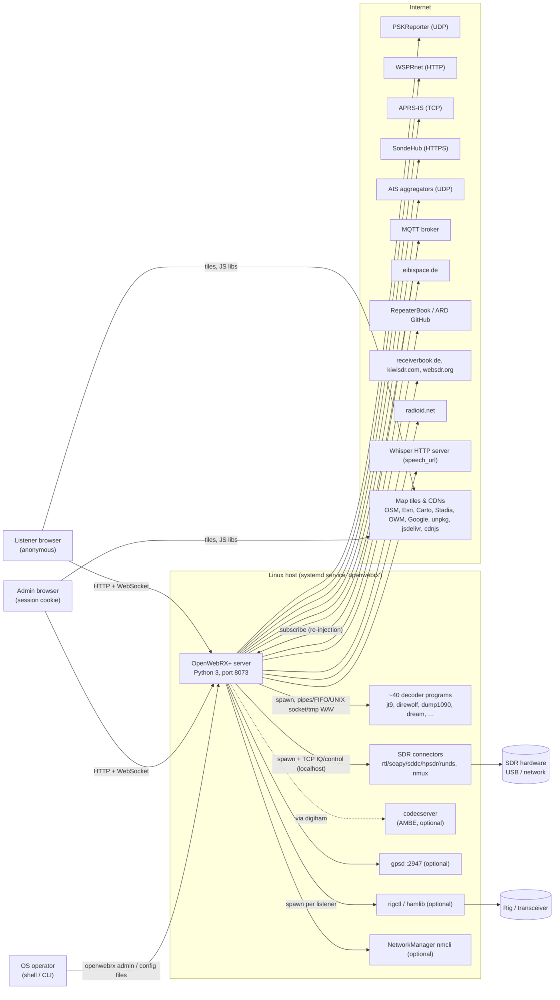

### 3.2 Component view (inside the Python process)

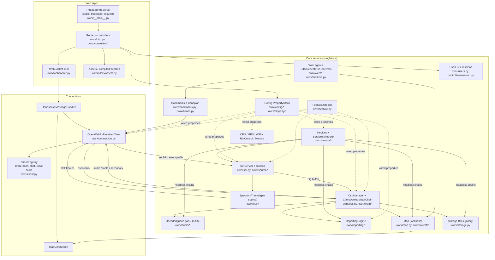

### 3.3 Process and port view (one SDR, one listener, some services)

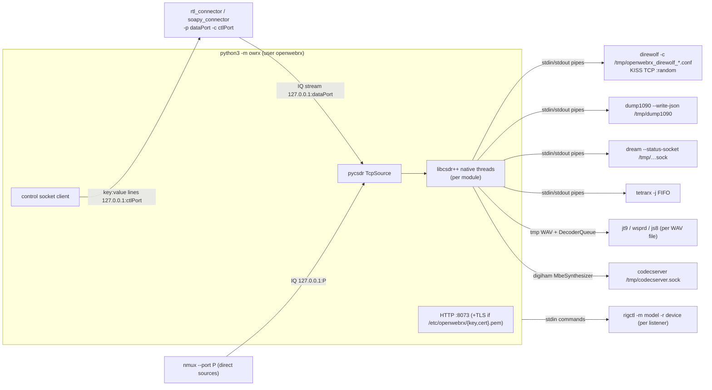

### 3.4 Key architectural patterns

| Pattern | Where | Notes for a re-implementation |
|---|---|---|
| **Reactive property graph.** `PropertyManager`/`PropertyStack`/`PropertyCarousel` with `wire()` callbacks. Every config change propagates live to sources, DSP chains and clients. | `owrx/property/*` | Core of the "live reconfiguration" behaviour. It has no locking and callbacks run on the writer's thread (see §8). |
| **Layered configuration:** defaults → `config_webrx.py` → `settings.json` → device → profile → per-client overrides | `owrx/config/*`, `owrx/source/__init__.py:125-155`, `owrx/connection.py` | Keep the layering, add a schema |
| **Singletons via `getSharedInstance()`/class dicts** | ClientRegistry, SdrService, Services, ReportingEngine, Map, CpuUsageThread, FeatureDetector… | Replace with dependency injection |
| **Chain of native DSP modules** connected by ring buffers. Each module is a native thread, and Python "pump" threads read the outputs. | `csdr/chain/*`, pycsdr | Real-time core. A rewrite needs an equivalent streaming graph. |
| **External process adapter.** `PopenModule`/`ExecModule` wrap a binary: stdin samples in, stdout text or JSON out, then a Python parser. | `csdr/module/*`, owrx parsers | About 40 tool-specific parsers. They are brittle against tool version changes. |
| **Feature flags by probing binaries** | `owrx/feature.py` | Gives graceful degradation, but cached for 2 h and slow at startup |
| **Event-client model for sources.** `SdrSourceEventClient` gets `onStateChange`/`onFail`/`onBusyStateChange`; client types USER, BACKGROUND and INACTIVE decide on-demand start/stop. | `owrx/source/__init__.py:512-576` | Keep the semantics. Make them explicit as a state machine. |
| **Server-rendered settings forms** with a custom form framework, plus a few JS widgets | `owrx/form/*`, `owrx/controllers/settings/*` | Can be replaced by an API plus an SPA |
| **Concatenated JS bundles** with no build tool and no modules. Global objects are coupled through jQuery. | `owrx/controllers/assets.py` | De-facto plugin API: global names are a compatibility surface |

---

## 4. How it works

The four subsections follow the order of operation: the process and its runtime (4.1), the configuration that drives it (4.2), the real-time DSP and decoding pipeline (4.3), and the browser application (4.4).

### 4.1 Runtime

#### 4.1.1 Startup and shutdown sequence

##### 4.1.1.1 Entry points
- `openwebrx.py` → `owrx.__main__.main()` (`openwebrx.py`, `setup.py` `console_scripts: openwebrx=owrx.__main__:main`).
- `main()` (`owrx/__main__.py:64-105`):
  1. `logging.basicConfig(INFO)` runs **before** the other imports (`:1-7`).
  2. argparse: `-c/--config <file>` (core INI), `-v/--version`, `--debug`, and sub-modules `admin …` (user management) and `config migrate`.
  3. `CoreConfig.load(path)`: reads INI defaults, then `./openwebrx.conf`, `/etc/openwebrx/openwebrx.conf` and every `*.conf` in the matching `.d/` directory (`owrx/config/core.py:31-60`).
  4. The `admin`/`config` sub-commands run and exit. Otherwise `start_receiver()`.

##### 4.1.1.2 `start_receiver()` (`owrx/__main__.py:108-204`)

| # | Step | Ref | Side effects / threads |
|---|---|---|---|
| 1 | Print banner and set SIGINT/SIGTERM handlers. A handler **raises `SignalException`** in the main thread. | `:108-130` | – |
| 2 | `CoreConfig()` checks that `data_directory` and `temporary_directory` exist and are writable (raises `ConfigError` otherwise). Sets log level. | `:132-135`, `owrx/config/core.py:62-87` | – |
| 3 | `Config.validateConfig()` → `Config.get()` builds the PropertyStack `DynamicConfig(settings.json)+migrations` > `ClassicConfig(config_webrx.py exec)` > `defaults`. | `:137`, `owrx/config/__init__.py:8-35` | file reads, `exec` of python config |
| 4 | `WiFi.startConnectionCheck(15)` | `:140`, `owrx/wifi.py:28-38` | thread `WiFi.Check` (runs `nmcli` after 15 s) |
| 5 | Feature check `core` (csdr/pycsdr ≥ 0.18.0). Returns rc 1 when missing. | `:142-154` | imports pycsdr |
| 6 | `SdrService.getAllSources()` builds a `MappedSdrSources` that instantiates every valid source. **Always-on sources start synchronously** (spawn connector, wait for port). | `:158`, `owrx/sdr.py:243-247`, `owrx/source/__init__.py:185-186` | feature probes (subprocesses), source processes, monitor threads, LogPipe threads |
| 7 | `Services.start()` creates one `ServiceScheduler` per active source. It wires `services_enabled`: the wire callback fires immediately and creates a `ServiceHandler` per source when that key is True. | `:160`, `owrx/service/__init__.py:452-469` | timers |
| 8 | `GpsUpdater.init()` wires `gps_updates` and starts the GPS thread when True. | `:163`, `owrx/gps.py:48-67` | thread `GpsUpdater` |
| 9 | `Markers.start()` starts the Markers thread plus the Receivers, Repeaters and EIBI WebAgent threads. | `:166`, `owrx/markers.py:57-62` | 4 threads |
| 10 | `reportServerState("ServerStarted")` creates the `ReportingEngine` singleton and its reporters when `report_radio` is set (default True). | `:169`, `:51-61` | reporter threads |
| 11 | `ThreadedHttpServer(port, RequestHandler, ipv6, bind)`: `ThreadingMixIn+HTTPServer`. Default `::` (IPv6 dual-stack) or `0.0.0.0`, port 8073. | `:35-41,172` | thread per request/WS |
| 12 | Optional TLS: if `/etc/openwebrx/key.pem` and `cert.pem` both exist, `server.socket = ctx.wrap_socket(…, server_side=True)`. | `:174-189` | – |
| 13 | `server.serve_forever()` until a `SignalException`. | `:191-193` | main thread |

##### 4.1.1.3 Shutdown (`owrx/__main__.py:195-204`), in order

1. `WebSocketConnection.closeAll()` (`owrx/websocket.py:53-58`)
2. `Markers.stop()`: sets the stop events of Markers and the 3 WebAgents. It does **not join** them (`owrx/markers.py:64-69,104-108`, `owrx/web/__init__.py:71-75`).
3. `GpsUpdater.stop()`: sets the event and **joins** the thread. The join can hang while the thread is blocked in `readline()` on gpsd, since the socket has no timeout (`owrx/gps.py:76-81,133-168`).
4. `Services.stop()`: handler and scheduler shutdown.
5. `SdrService.stopAllSources()`: sequential `stop()`. Each sends SIGTERM to the process group and waits up to 10 s before SIGKILL (`owrx/source/__init__.py:474-505`).
6. `DecoderQueue.stopAll()`: purges jobs, sends one PoisonPill per live worker, then `join()` (waits for running decodes) (`owrx/audio/queue.py:106-162`).
7. `reportServerState("ServerStopped")`, then `ReportingEngine.stopAll()`.
8. `return 0`. The interpreter then waits for all **non-daemon** threads (see the thread table). Several never terminate (e.g. `AircraftManager.Cleanup`, `owrx/aircraft/manager.py:135-141`), so process exit can depend on systemd's SIGKILL (unverified).

`server.server_close()` is never called, and a signal received before the `try:` at `:171` (i.e. during steps 3–10) is not caught, so none of the cleanup above runs.

---

#### 4.1.2 Thread inventory

| Thread (name) | Owner / creator | Count | Lifetime | Daemon | Refs |
|---|---|---|---|---|---|
| `MainThread` | `serve_forever()` accept loop (and TLS handshake when wrapped) | 1 | process | – | `owrx/__main__.py:191` |
| HTTP request threads | `ThreadingMixIn` | 1 per HTTP request / per WebSocket (long-lived) | request or WS connection | False (`daemon_threads` not set) | `owrx/__main__.py:35` |
| `connection_mp_passthru` | `OpenWebRxReceiverClient` multiprocessing queue pump | 1 per WS client | connection | False | `owrx/connection.py:40-56` |
| WS ping `Timer` | `WebSocketConnection.resetPing` | 1 per WS, re-armed every 30 s | connection | False | `owrx/websocket.py:288-299` |
| `dsp_pump_<type>` | `DspManager.wireOutput` | ~1 per DSP output (audio, hd audio, smeter, secondary, meta…) per client | DSP lifetime | False | `owrx/dsp.py:914` |
| Spectrum pump | `SpectrumThread._setCompression` → `FftChain.pump` | 1 per source with spectrum clients (+1 per compression change) | while spectrum clients exist | False | `owrx/fft.py:62-73`, `owrx/source/__init__.py:551-572` |
| `source_monitor` | `SdrSource.start` (waits for the process to exit) | 1 per running source | source process | False | `owrx/source/__init__.py:389-406` |
| LogPipe (STDOUT/STDERR) | `SdrSource.start`, `FifiSdrSource.sendRockProgFrequency` | 2 per source process (+2 per rockprog call) | until the pipe write end closes | **False** | `owrx/log/__init__.py:6-27`, `owrx/source/__init__.py:359-360`, `owrx/source/fifi_sdr.py:31-43` |
| Restart `Timer` | `SdrSource._scheduleRestart` (15 s) | ≤1 per source | until it fires or is cancelled | False | `owrx/source/__init__.py:321-324` |
| ServiceHandler startup `Timer` | `_scheduleServiceStartup` (10 s) | ≤1 per source | one-shot | False | `owrx/service/__init__.py:130-133` |
| ServiceScheduler selection `Timer` | `scheduleSelection` (10 s or until the next entry, can be hours) | ≤1 per source | one-shot | False | `owrx/service/schedule.py:233-246` |
| Service chain pumps | csdr `Chain`/`ThreadModule`/`PopenModule`/`ExecModule` internals | several per service/decoder | service lifetime | mostly False | `csdr/module/__init__.py:78-200` |
| `QueueWorker` | `DecoderQueue` (WSJT/JS8) | `decoding_queue_workers` (2) | until PoisonPill | False | `owrx/audio/queue.py:69-93,178-181` |
| WAV chopper `Timer` | `AudioChopper`/`WaveFile` switch at slot boundaries | 1 per chopper | service/client | False | `owrx/audio/wav.py:79-90` |
| `WiFi.Check` | `WiFi.startConnectionCheck` | 1 | 15 s/60 s delay, then one `nmcli` round | False | `owrx/wifi.py:28-38,170-187` |
| `GpsUpdater` | `GpsUpdater.startThread` | 0–1 | while `gps_updates` | False | `owrx/gps.py:69-102` |
| `Markers` | `Markers.startThread` (wakes at the top of each hour) | 1 | process | False | `owrx/markers.py:97-181` |
| `Receivers` / `Repeaters` / `EIBI` | `WebAgent.startThread` (hourly at a random minute) | 3 | process | False | `owrx/web/__init__.py:63-92` |
| `CpuUsageThread` | first WS client (`add_client`) | 0–1 | until the last client leaves | False | `owrx/cpu.py:13-169`, `owrx/connection.py:199,464` |
| `map_removeloop` | `Map` singleton (60 s cleanup) | 1 | process | True | `owrx/map.py:40-59` |
| `AircraftManager.Cleanup` | first aircraft use (60 s) | 1 | **never stops** (`self.thread` is never cleared) | **False** | `owrx/aircraft/manager.py:128-141` |
| `AdsbParser.Refresh` | per ADS-B chain (1 s poll of `/tmp/dump1090/aircraft.json`) | 1 per ADS-B chain | chain | False | `owrx/aircraft/__init__.py:658-697` |
| RadioID cache fill | `meta.py` per unknown DMR/YSF id | per lookup | one-shot | True | `owrx/meta.py:106-107` |
| `RigControl` reader | `RigControl.rigStart` (select loop on rigctl stdout/stderr) | 1 per client DSP when rig enabled | rigctl process | False | `owrx/rigcontrol.py:391-476` |
| `DrmStatus`/Tetra `Monitor` | `SocketMonitor`/`FileMonitor` (status JSON lines) | 1 per DRM/TETRA chain | chain | True | `owrx/monitor.py:15-173`, `csdr/chain/drm.py:21-22`, `csdr/chain/tetra.py:16-24` |
| `WhisperWorker` | `WhisperTranscriber` (HTTP POST loop) | 1 per speech service | chain | False | `owrx/transcribe.py:52,80-115` |
| `AprsIsIgate` | `AprsIgate` send loop | 1 | until PoisonPill | True | `owrx/reporting/aprsigate.py:33-34,215-225` |
| `AprsIsBeacon` | `AprsIgate.enableBeacon` | 0–1 | while beacon enabled | True | `owrx/reporting/aprsigate.py:184-212` |
| WSPRnet `Worker` | `WsprnetReporter` | 1 | until PoisonPill | True | `owrx/reporting/wsprnet.py:18-37,71-87` |
| PSKReporter upload `Timer` | `scheduleNextUpload` (300–330 s) | 0–1 | one-shot | False | `owrx/reporting/pskreporter.py:53-59` |
| `sondehub-uploader` / `sondehub-listener` | `SondehubReporter._applyConfig` | 0–2 | while enabled | True | `owrx/reporting/sondehub.py:78-123,492-524,638-674` |
| `MqttReporter` (paho `loop_forever`) | `MqttReporter._getClient` (a **new thread on each reconnect**) | ≥1 | until `disconnect()` | **False** | `owrx/reporting/mqtt.py:46-79,87-91` |
| Direwolf stdin pump | `DirewolfModule.start` | 1 per packet chain | chain | False | `owrx/aprs/direwolf.py:193` |
| PopenModule pumps | `PopenModule.start` (stdin + stdout) | 2 per Popen decoder (lora, m17, tetra, wav) | chain | False | `csdr/module/__init__.py:190-196`, `csdr/module/m17.py:32` |

Threads use no shared executor. Every periodic job is its own `threading.Thread`/`Timer`, and liveness relies on Python's GIL plus ad-hoc locks.

---

#### 4.1.3 Process inventory (every subprocess spawned)

| Process | Command template | When | IPC / ports | Refs |
|---|---|---|---|---|
| Feature probes | `<cmd> --help/-h/--version/-V` per requirement (see §4.1.6) with `stdin/out/err=DEVNULL`, `cwd=tmp`, `DISPLAY` removed, 10 s wait then kill | first `is_available()`, then every 2 h (cache expiry) | exit code (32512 = not found) | `owrx/feature.py:185-213` |
| Connector probes | `<connector> --version` (first line `^<cmd> version X$`), `soapy_connector --listdrivers`, `wsjtx_app_version --version`, `acarsdec` (stderr), `dream --help` (stderr) | same | stdout/stderr parsing | `owrx/feature.py:287-340,538-550,656-683,845-861` |
| rtl_connector / rtl_tcp_connector / sddc_connector / soapy_connector / runds_connector | `<base> -s <sr> -f <tuner_freq> -p <iqport> -c <ctlport> [-d dev] [-i] [-r port] [-P ppm] [-g gain] [type flags]` via `shlex.split`, `start_new_session=True` | source start (on-demand, always-on, scheduler) | IQ: TCP `127.0.0.1:<port>` (complex float) read by pycsdr `TcpSource`. Control: TCP `localhost:<ctlport>`, text lines `prop:value\n`. `rtltcp_compat` extra port. | `owrx/source/__init__.py:340-448`, `owrx/source/connector.py:18-78` |
| hpsdrconnector | `hpsdrconnector --frequency F --samplerate S --radio IP --gain G --serverPort P [--debug] -p … -c …` | same | IQ TCP + control TCP (same mapping); HPSDR UDP to the radio | `owrx/source/hpsdr.py:31-47` |
| Perseus | **shell=True**: `perseustest -p -d -1 -a -t 0 -o - -s SR -f F [-u att] [-m] [-x] [-w] \| nmux --bufsize B --bufcnt N --port P --address 127.0.0.1` | source start; **restarted on any property change** | nmux TCP 127.0.0.1:P (≈50 MB ring) | `owrx/source/direct.py:14-45`, `owrx/source/perseussdr.py:24-40` |
| FiFi SDR | **shell=True**: `arecord -D dev -r SR -t raw -f S16_LE -c2 - \| nmux …`, plus `rockprog --vco -w --freq=<MHz>` at preStart and on center_freq change | same | nmux TCP; ALSA | `owrx/source/fifi_sdr.py:14-51` |
| rigctl | `rigctl -m <model> -r <device> [-c <addr>] -` (stdin commands `F`, `M`, `T`) | per client DSP when `rig_enabled` | stdin/stdout pipes; serial device or TCP `rig_device` | `owrx/rigcontrol.py:391-423` |
| nmcli | `nmcli device wifi hotspot …`, `nmcli con modify owrx-hotspot ipv4.addresses …`, `nmcli con up …`, `nmcli radio wifi on/off`, `nmcli -t -c no device status`, `nmcli -t -c no con show`, `nmcli con add …`, `nmcli con delete <uuid>` | boot+15 s, settings save, +60 s | D-Bus via nmcli | `owrx/wifi.py:40-142` |
| ImageMagick | `convert in.bmp [-colors N] [-define png:compression-level=L -define png:compression-filter=F] out.png` | each SSTV/FAX image ≥64 lines | files in tmp | `owrx/storage.py:103-142` |
| WSJT/JS8 decoders | `nice -n 10 jt9 --ft8/--ft4/--jt65/--jt9/--fst4 -p I/--fst4w -p I/--q65 -p I -b M -d D <wav>`, `nice -n 10 wsprd [-d] <wav>`, `nice -n 10 js8 --js8 -b <sub> -d D <wav>` | each slot (DecoderQueue) | WAV files in tmp, stdout lines | `owrx/audio/queue.py:29-57`, `owrx/wsjt.py:115-246`, `owrx/js8.py:32` |
| direwolf | `direwolf -c {tmp}/openwebrx_direwolf_<id>.conf -r 48000 -t 0 -q d -q h [-B AIS -A]` | packet/AIS chain start; **restarted on any config change** | audio on stdin; KISS TCP on a random localhost port 1024–49150 read by `TcpSource`; legacy iGate opens its own APRS-IS TCP | `owrx/aprs/direwolf.py:66-79,150-219` |
| ExecModule decoders (pycsdr, stdin→stdout) | `dumphfdl --iq-file - …`, `dumpvdl2 --iq-file - …`, `dump1090 --ifile - --iformat SC16 --lat --lon --modeac --metric [--quiet --write-json /tmp/dump1090] [--raw]`, `dump978 --stdin --format CF32H …`, `acarsdec --sndfile /dev/stdin,subtype=6 --output json:file`, `msk144decoder`, `dream -c 6 --sigsrate 48000 --audsrate 48000 -I - -O - [--status-socket <tmp>/dream_status_<uid>]`, `freedv_rx 1600 - -`, `webrx_rade_decode`, `rtl_433 -r cf32:- -s SR -M time:… -F json\|kv -A -Y autolevel [-M level]`, `multimon-ng - -v0 -C <charset> -c -a …`, `csdr-cwskimmer`/`csdr-rttyskimmer -f -r SR -n N`, `redsea --input mpx --samplerate SR [--rbds]`, `dablin -p -s 0x…`, `lame -r -m m --signed --bitwidth 16 -s kHz -b 128 - -`, `rs41mod/dfm09mod/m10mod/m20mod/mts01mod - SR 32 --IQ 0 [opts] [--json]`, `satdump live <mode> <tmp>/satdump/<SAT>-<date> --source file --file_path /dev/stdin …` | per client or service chain | pipes (pycsdr), files in tmp | `csdr/module/{aircraft,msk144,drm,freedv,toolbox,sonde,satellite}.py` |
| PopenModule decoders | `lorarx -i /dev/stdin -r SR -f f32 -v -N -Q [-j /dev/stdout]`, `m17-demod -l`, `tetrarx -i /dev/stdin -f f32 -w /dev/stdout -c 1 -r SR -d … -t 0,5000 -j <tmp>/tetra_<uid>` | per chain | pipes; TETRA status file (FileMonitor) | `csdr/module/{lora,m17,tetra}.py`, `csdr/module/__init__.py:178-207` |
| dsame3 callback | `subprocess.call([call] + l_cmd)`, only when the dsame3 CLI `--call` option is used (library path in EAS decoding does not set it, unverified) | EAS | – | `owrx/dsame3/dsame.py:495-509` |
| nrsc5 (HD Radio) | in-process via ctypes/ThreadModule (no subprocess, unverified) | – | – | `csdr/module/hdradio.py:32` |

**Ports.** `getAvailablePort()` binds `("", 0)` (all interfaces), reads the port number and closes the socket (`owrx/socket.py:4-10`). The connector later binds that port, which is a TOCTOU race. Whether connectors bind to 127.0.0.1 depends on the binaries (unverified). Each connector source reserves 2 ports at construction (IQ + control), even if it never starts (`owrx/source/__init__.py:165`, `owrx/source/connector.py:12-16`).

---

#### 4.1.4 SDR source lifecycle

##### 4.1.4.1 State machine (`owrx/source/__init__.py`)

```mermaid
stateDiagram-v2
    [*] --> Stopped : __init__ (state=STOPPED)
    Stopped --> Spawning : start() [enabled, !failed, monitor==None]\n(addClient USER/BACKGROUND, always-on, scheduler, restart timer)
    note right of Spawning
      not a real enum value: state stays STOPPED
      while the process starts and the port is polled
      (STARTING is never set)
    end note
    Spawning --> Running : port reachable && postStart OK\n(setState RUNNING, retryCount=0)
    Spawning --> RetryWait : process died / port never open / postStart error\n(retryCount < 10)
    RetryWait --> Spawning : Timer 15 s → start()
    Spawning --> Failed : retryCount >= 10 → fail()
    Running --> Stopping : stop() (no clients & !always-on, disable, shutdown, DirectSource prop change)
    Stopping --> Stopped : SIGTERM pgid, wait 10 s, SIGKILL; monitor sets STOPPED
    Running --> Failed : process exits unexpectedly while RUNNING → fail()
    Failed --> Stopped : enabled=false (clears failed)\n(then enabled=true)
    Stopped --> [*] : shutdown() (device deleted / type unavailable)
```

- Client classes decide whether the source runs: `INACTIVE` (ServiceHandler, SourceStateHandler), `BACKGROUND` (ServiceScheduler with a current entry), `USER` (web listener DSP, SpectrumThread). Busy = USER present (`owrx/source/__init__.py:51-55,520-549`).
- `TUNING` is defined but unused. Center-frequency changes on connector sources are live (control socket); on direct sources they cause stop and start (`owrx/source/direct.py:14-18`).
- Property layering per source: L0 `center_freq` (mutable), L1 active profile minus `name`, L2 device config, L3 `sdr_id`, L4 global config (`owrx/source/__init__.py:139-155`).
- Registry layers: `MappedSdrSources` (all configured and valid) → `ActiveSdrSources` (enabled and not failed) → `AvailableProfiles` (`"<sdr>|<profile>"` → label) (`owrx/sdr.py:12-225`).

##### 4.1.4.2 Data path
Connector process → TCP IQ (CF32) → pycsdr `TcpSource` → `Buffer` (single writer, many readers) → consumers: FFT chain (spectrum), per-client DSP chains, service chains, resamplers (`owrx/source/__init__.py:310-330`). Direct sources may insert a format conversion chain (FiFi: S16→CF32 ×5 gain) (`owrx/source/direct.py:48-71`).

---

#### 4.1.5 Service scheduler and service handler state machines

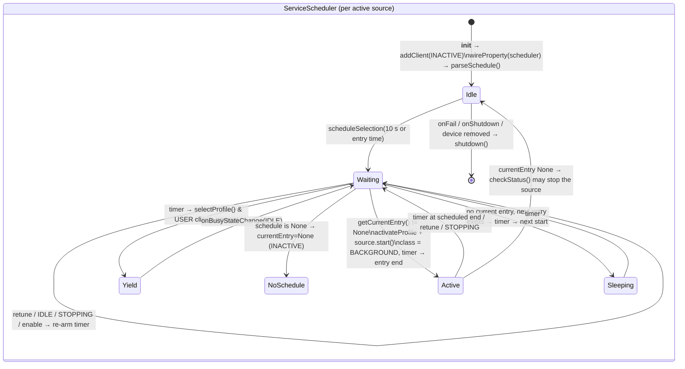

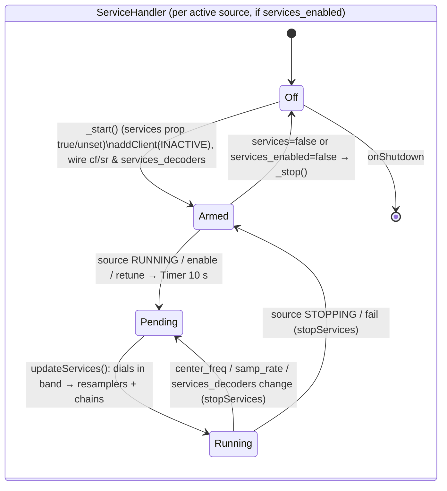

Notes:
- The ServiceHandler is `INACTIVE` and never keeps a source running by itself. Background decoding needs an always-on source, a scheduler entry, or a listener (`owrx/service/__init__.py:70-71`).
- Schedules are evaluated in **UTC** (`datetime.utcnow()`), `owrx/service/schedule.py:47,55,103,173`.
- The daylight math (`math.acos(-tan(lat)·tan(decl))`) raises `ValueError` above the polar circles (midnight sun / polar night); nothing catches it, so the selection timer thread dies (`owrx/service/schedule.py:162-163`).

---

#### 4.1.6 Feature detection

##### 4.1.6.1 Mechanism (`owrx/feature.py`)
- `FeatureDetector.features`: feature → list of requirement names (`:52-120`).
- A requirement `X` maps to method `has_X()` (reflection, `:161-165`). A missing method is logged as an error and yields False.
- Results are cached per requirement in the process-wide `FeatureCache` with a **2 h TTL** (`:22-48,167-180`). There is no lock, so concurrent first calls run the same probe in parallel (harmless duplication).
- `command_is_runnable(cmd, expected)`: `shlex.split`, run in `temporary_directory` with `DISPLAY` unset. The result is `rc != 32512` (127<<8, i.e. "not found" from older shell semantics), or `rc == expected` when an expected code is given (`:185-213`).
- Requirement docstrings are shown as help text in the feature report (`/features`, `/api/features`) (`:125-141,182-183`).
- Consumers: the SDR type list (`owrx/source/__init__.py:676-677`), source validity (`owrx/sdr.py:49-63`), mode availability (`owrx/modes.py`), reporters (mqtt) (`owrx/reporting/__init__.py:53-60`), rigcontrol (`owrx/rigcontrol.py:396`).

##### 4.1.6.2 Feature → requirements table

| Feature | Requirements |
|---|---|
| core | csdr |
| rtl_sdr | rtl_connector |
| rtl_sdr_soapy | soapy_connector, soapy_rtl_sdr |
| rtl_tcp | rtl_tcp_connector |
| sdrplay | soapy_connector, soapy_sdrplay |
| sxceiver | soapy_connector, soapy_sx |
| elad | soapy_connector, soapy_elad |
| mirics | soapy_connector, soapy_mirics |
| malahit_rr | soapy_connector, soapy_malahit_rr |
| hackrf | soapy_connector, soapy_hackrf |
| perseussdr | perseustest, nmux |
| airspy | soapy_connector, soapy_airspy |
| airspyhf | soapy_connector, soapy_airspyhf |
| hydrasdr | soapy_connector, soapy_hydrasdr |
| afedri | soapy_connector, soapy_afedri |
| lime_sdr | soapy_connector, soapy_lime_sdr |
| fifi_sdr | alsa, rockprog, nmux |
| pluto_sdr | soapy_connector, soapy_pluto_sdr |
| soapy_remote | soapy_connector, soapy_remote |
| uhd | soapy_connector, soapy_uhd |
| radioberry | soapy_connector, soapy_radioberry |
| fcdpp | soapy_connector, soapy_fcdpp |
| bladerf | soapy_connector, soapy_bladerf |
| iqfile | soapy_connector, soapy_iqfile |
| sddc | sddc_connector |
| sddc_soapy | soapy_connector, soapy_sddc |
| hpsdr | hpsdr_connector |
| runds | runds_connector |
| digital_voice_digiham | digiham, codecserver_ambe |
| digital_voice_freedv | freedv_rx |
| digital_voice_rade | webrx_rade_decode |
| digital_voice_m17 | m17_demod |
| wsjt-x | wsjtx |
| wsjt-x-2-3 | wsjtx_2_3 |
| wsjt-x-2-4 | wsjtx_2_4 |
| msk144 | msk144decoder |
| packet | direwolf, aprs_symbols |
| pocsag | digiham (no mode uses it; POCSAG mode commented out) |
| js8call | js8, js8py |
| drm | dream |
| dream-2-2 | dream_2_2 |
| adsb | dump1090 |
| uat | dump978 |
| ism | rtl_433 |
| hfdl | dumphfdl |
| vdl2 | dumpvdl2 |
| acars | acarsdec |
| tetra | tetrarx |
| page / selcall / eas | multimon |
| wxsat | satdump |
| png | imagemagick |
| rds | redsea |
| dab | csdreti, dablin |
| mqtt | paho_mqtt |
| hdradio | nrsc5 |
| rigcontrol | hamlib |
| skimmer | csdr_skimmer |
| sonde | sonde_rs |
| mp3 | lame |
| lora | lorarx |
| meshtastic | lorarx, py_meshtastic |
| speech | whisper |

##### 4.1.6.3 Requirement → probe → minimum version

| Requirement | Probe | Min version / success criterion | Ref |
|---|---|---|---|
| csdr | `from pycsdr.modules import csdr_version, version` | both ≥ 0.18.0 (LooseVersion) | `owrx/feature.py:215-235` |
| nmux | `nmux --help` | rc≠32512 | `:237-244` |
| perseustest | `perseustest -h` | rc≠32512 | `:246-262` |
| digiham | `from digiham.modules import digiham_version, version` | both ≥ 0.6 | `:264-285` |
| rtl_connector | `rtl_connector --version` → `^rtl_connector version (.*)$` | ≥ 0.5 | `:287-311` |
| rtl_tcp_connector | `rtl_tcp_connector --version` | ≥ 0.5 | `:313-320` |
| soapy_connector | `soapy_connector --version` | ≥ 0.5 | `:322-329` |
| soapy_rtl_sdr / sdrplay / sx / elad / mirics / malahit_rr / airspy / airspyhf / hydrasdr / afedri / lime_sdr / pluto_sdr / remote / uhd / radioberry / hackrf / fcdpp / bladerf / iqfile / sddc | `soapy_connector --listdrivers` contains the driver: `rtlsdr`, `sdrplay`, `sx`, `elad`, `soapyMiri`, `malahitrr`, `airspy`, `airspyhf`, `hydrasdr`, `afedri`, `lime`, `plutosdr`, `remote`, `uhd`, `radioberry`, `hackrf`, `fcdpp`, `bladerf`, `iqfile`, `SDDC` | presence | `:331-503,693-703` |
| m17_demod | `m17-demod` | rc == 0 | `:504-510` |
| direwolf | `direwolf --help` | rc≠32512 | `:512-519` |
| airspy_rx | `airspy_rx --help` (**not referenced by any feature, dead**) | – | `:521-528` |
| wsjtx | `jt9` **and** `wsprd` (no args) | rc≠32512 | `:530-536` |
| wsjtx_2_3 / wsjtx_2_4 | wsjtx + `wsjtx_app_version --version` → `^WSJT-X (.*)$` | ≥ 2.3 / ≥ 2.4 | `:538-566` |
| msk144decoder | `msk144decoder` | rc≠32512 | `:568-575` |
| js8 | `js8` | rc≠32512 | `:577-588` |
| js8py | `from js8py.version import strictversion` | ≥ 0.1 (StrictVersion) | `:590-604` |
| alsa | `arecord --help` | rc≠32512 | `:606-612` |
| rockprog | `rockprog` | rc≠32512 | `:614-620` |
| freedv_rx | `freedv_rx` | rc≠32512 | `:622-633` |
| webrx_rade_decode | `webrx_rade_decode` | rc≠32512 | `:635-644` |
| dream | `dream --help` | rc == 0 | `:646-654` |
| dream_2_2 | `dream --help` stderr contains `--status-socket` | presence | `:656-683` |
| sddc_connector | `sddc_connector --version` | ≥ 0.1 | `:685-691` |
| hpsdr_connector | `hpsdrconnector -h` | rc≠32512 | `:705-712` |
| runds_connector | `runds_connector --version` | ≥ 0.2 | `:714-719` |
| codecserver_ambe | `digiham.modules.MbeSynthesizer.hasAmbe(digital_voice_codecserver)` (connects to codecserver) | AMBE codec present | `:721-742` |
| dump1090 | `dump1090 --version` | rc≠32512 | `:744-758` |
| dump978 | `dump978 --version` | rc≠32512 | `:760-766` |
| rtl_433 | `rtl_433 -h` | rc≠32512 | `:768-775` |
| dumphfdl | `dumphfdl --version` | rc≠32512 | `:777-783` |
| dumpvdl2 | `dumpvdl2 --version` | rc≠32512 | `:785-791` |
| redsea | `redsea --version` | rc≠32512 | `:793-799` |
| csdreti | `from csdreti.modules import csdreti_version, version` | both ≥ 0.0.11 | `:801-821` |
| dablin | `dablin -h` | rc≠32512 | `:823-829` |
| paho_mqtt | `from paho.mqtt import __version__` | import OK | `:831-843` |
| acarsdec | `acarsdec` stderr, first 3 lines `^Acarsdec\S*\s+v?(\S+)\s+Copyright` | ≥ 4 | `:845-869` |
| imagemagick | `convert -version` | rc≠32512 | `:871-877` |
| multimon | `multimon-ng --help` | rc≠32512 | `:879-886` |
| satdump | `satdump --help` | rc≠32512 | `:888-895` |
| nrsc5 | `nrsc5 -v` | rc≠32512 | `:897-903` |
| hamlib | `rigctl -V` | rc≠32512 | `:905-911` |
| csdr_skimmer | `csdr-rttyskimmer -h` | rc≠32512 | `:913-919` |
| sonde_rs | `rs41mod -h` (only rs41mod checked; dfm09mod/m10mod/m20mod/mts01mod assumed) | rc≠32512 | `:921-927` |
| lorarx | `lorarx -h` | rc≠32512 | `:929-935` |
| py_meshtastic | `from meshtastic import OUR_APP_VERSION` | import OK | `:937-947` |
| lame | `lame --help` | rc≠32512 | `:949-955` |
| aprs_symbols | `os.path.isdir("/usr/share/aprs-symbols")` (ignores the core `aprs.symbols_path` setting) | dir exists | `:957-963` |
| tetrarx | `tetrarx -h` | rc≠32512 | `:965-971` |
| whisper | `Config.get()["speech_url"]` non-empty (returns the **string**, cached 2 h, so a URL change is not seen until the cache expires) | truthy | `:973-980` |

---

#### 4.1.7 Reporting engine architecture

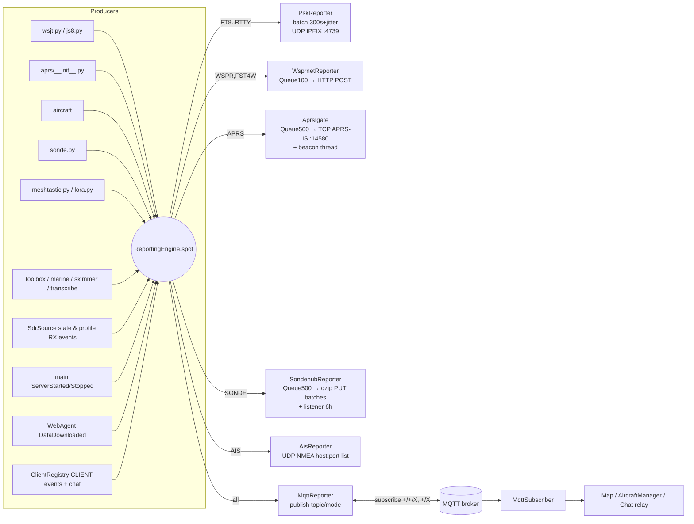

- Singleton with a creation lock (`owrx/reporting/__init__.py:15-41`). `reporterClasses` maps a config prefix to a class, or to a lazy `(module, class)` tuple guarded by a feature flag (mqtt) (`:21-28,49-67`).
- `spot()` is called **synchronously from decoder threads** and iterates `self.reporters` with no lock, while `setupReporters()` can mutate that list from a config-change thread (`:49-80`).
- Exceptions inside a reporter's `spot()` are logged and swallowed (`:74-80`).
- Back-pressure: bounded queues drop spots on overflow (WSPRnet 100, APRS 500 with a **blocking** `put` (`aprsigate.py:77`), SondeHub 500 non-blocking). PSKReporter keeps an unbounded list between uploads. The MQTT publish is paho-buffered.
- Reporters register metrics in `Metrics` (`owrx/metrics.py`). A reporter rebuilt by a config toggle re-registers and overwrites the previous metric object (`owrx/metrics.py:44-45`).
- `stop()` on WSPRnet/APRS/SondeHub drains the queue and posts a PoisonPill. On PSKReporter it cancels the timer and **drops unsent spots** (`owrx/reporting/pskreporter.py:37-40`).

---

#### 4.1.8 Web data agents (`owrx/web/*`, `owrx/markers.py`)

| Agent | Source URL(s) | Protocol | Cache file (data dir) | Refresh period | Check cadence | Consumers | Refs |
|---|---|---|---|---|---|---|---|
| Receivers | `https://www.receiverbook.de/map` (regex `var receivers = […]`), `http://kiwisdr.com/.public/` (HTML comment scraping), `http://websdr.ewi.utwente.nl/~~websdrlistk?v=1&fmt=2&chseq=0` (JSON with `//` comments) | HTTPS + **plain HTTP**, fake Firefox UA, **no timeout** | `receivers.json` | 24 h | hourly at random minute 5–49; ≤5 consecutive errors, then stops | Map markers (Markers thread) | `owrx/web/receivers.py:46-195`, `owrx/web/__init__.py:17-92` |
| Repeaters | `https://www.repeaterbook.com/api/{export.php\|exportROW.php}?qtype=prox&dunit=km&lat=…&lng=…&dist=200`; fallback `https://raw.githubusercontent.com/Amateur-Repeater-Directory/ARD-RepeaterList/refs/heads/main/MasterList/MasterRepeater.json` | HTTPS. RepeaterBook UA: `OpenWebRX/<ver> (https://fms.komkon.org/OWRX/; <receiver_admin>)` + `Authorization: Bearer <repeaterbook_api_key>`, else `(OpenWebRX+ <ver>, luarvique@gmail.com)` | `repeaters.json` (sorted by freq); **deleted** when `receiver_gps` moves >10 km | 7 days | same | auto bookmarks (per WS client, `repeater_range`), Repeaters map markers (200 km) | `owrx/web/repeaters.py:94-325`, `owrx/connection.py:237-240` |
| EIBI | `http://www.eibispace.de/dx/sked-{a\|b}{YY}.csv` (a = Apr–Oct) | **plain HTTP**, cp1252 | `eibi.json` (sorted by freq) | 24 h | same | auto bookmarks (`eibi_bookmarks_range`), Stations map markers (current hour) | `owrx/web/eibi.py:99-440`, `owrx/connection.py:233-236` |
| Markers | local files + the three agents above | – | no own cache (`_getCachedMarkersFile()` → `markers.json` is defined but **unused**) | top of every hour | hourly | Map | `owrx/markers.py:46-321` |

Behaviour details:
- `hasFreshData()` is a read-and-clear flag consumed only by Markers (`owrx/web/__init__.py:45-49`).
- On first install (no cache) nothing is downloaded until the first refresh minute (up to ~60 min after start) (`owrx/web/__init__.py:78-92`).
- Bisection over the frequency-sorted list for bookmark lookup (`owrx/web/__init__.py:172-193`).
- Other outbound services used by this scope: `report.pskreporter.info:4739/udp`, `http://wsprnet.org/post/`, APRS-IS `euro.aprs2.net:14580`, SondeHub `https://api.v2.sondehub.org/{sondes/telemetry,listeners}`, AIS `ais.vesselfinder.com:5482/udp`, MQTT broker `mqtt_host` (1883/8883), whisper `speech_url`, gpsd `127.0.0.1:2947`.

---

#### 4.1.9 Storage and file layout

##### 4.1.9.1 `/etc/openwebrx` (package-installed or operator-provided)

| Path | Purpose | Ref |
|---|---|---|
| `/etc/openwebrx/openwebrx.conf` (+ `openwebrx.conf.d/*.conf`) | Core INI: `[core] data_directory, temporary_directory, log_level, temperature_sensor`; `[web] port, ipv6, bind_address, trusted_proxies`; `[aprs] symbols_path` | `owrx/config/core.py:9-78`, `openwebrx.conf` |
| `/etc/openwebrx/config_webrx.py` (or `./config_webrx.py`) | Classic python config, **exec'd** as a module | `owrx/config/classic.py:14-35` |
| `/etc/openwebrx/bands.json`, `bands-r1/r2/r3.json` | Bandplans (region-specific) | `owrx/bands.py:89`, `debian/openwebrx.install` |
| `/etc/openwebrx/bookmarks.d/*.json` | Shipped bookmarks | `owrx/bookmarks.py:79` |
| `/etc/openwebrx/markers.json`, `/etc/openwebrx/markers.d/*.json` | Static map markers | `owrx/markers.py:83-94`, `debian/openwebrx.dirs` |
| `/etc/openwebrx/key.pem`, `/etc/openwebrx/cert.pem` | TLS (hard-coded) | `owrx/__main__.py:172-173` |

##### 4.1.9.2 Data directory (default `/var/lib/openwebrx`)

| File | Content | Written by | Permissions | Ref |
|---|---|---|---|---|
| `settings.json` | All web-edited settings, including **secrets** (APRS passcode, MQTT password, RepeaterBook key, WiFi PSKs, receiver keys, magic key) | `DynamicConfig.store()`: truncate+write, **not atomic** despite the comment | created by postinst with default umask (typically 0644) | `owrx/config/dynamic.py:32-41`, `debian/openwebrx.postinst:38-41` |
| `users.json` | Users and password hashes | `UserList.store()` then `chmod 0600` | 0600 | `owrx/users.py:150,185-194`, postinst `:31-35` |
| `bookmarks.json` | User bookmarks | `Bookmarks.store()` | default | `owrx/bookmarks.py:189-200` |
| `receivers.json`, `repeaters.json`, `eibi.json` | Web-agent caches | `WebAgent.saveData()` (non-atomic) | default | `owrx/web/__init__.py:120-127` |
| `receiver_avatar.{png,jpg,webp}`, `receiver_top_photo.{png,jpg,webp}` | Uploaded images (served instead of the defaults) | settings/general image upload | default | `owrx/controllers/assets.py:90-103`, `owrx/controllers/settings/general.py:405-441` |
| `markers.json` | **Not read** (the Markers loader reads CWD `markers.json`, not the data dir) | – | – | `owrx/markers.py:71-86` |

##### 4.1.9.3 Temporary directory (default `/tmp`) and hard-coded tmp paths

| Path | Purpose | Ref |
|---|---|---|
| `{tmp}/<PFX>-<yymmdd>-<HHMMSS>[-<kHz>][-n].{bmp,png,txt,mp3}` (PFX `[A-Z0-9]+`) | Stored files (SSTV, FAX, REC, SPEECH, logs). Served by `/files`, retention `keep_files`. Naming regex `Storage.filePattern`. | `owrx/storage.py:17,32-101` |
| `{tmp}/openwebrx-audiochopper-master-<id>-<ts>.wav`, `…-<profile>-<ts>.wav` (hard links) | WSJT/JS8 slot WAVs for the decoder queue; unlinked after decoding | `owrx/audio/wav.py:15-30,95-117`, `owrx/audio/queue.py:59-63` |
| `{tmp}/openwebrx_direwolf_<id(self)>.conf` | Direwolf config, including the **APRS-IS passcode** in legacy mode; deleted on stop | `owrx/aprs/direwolf.py:157-159,171-174,205-210` |
| `{tmp}/dream_status_<uuid8>` | Dream status UNIX socket | `owrx/monitor.py:18-31`, `csdr/chain/drm.py:21` |
| `{tmp}/tetra_<uuid8>` | tetrarx status JSON stream (FileMonitor) | `csdr/chain/tetra.py:16-24` |
| `{tmp}/satdump/<SAT>-<yymmdd-HHMMSS>/` | SatDump products; fallback `/tmp` when mkdir fails; never cleaned | `csdr/chain/satellite.py:14,43,69`, `csdr/module/satellite.py:8-13` |
| `{tmp}/<image_id>-*` | Pending uploaded images before settings save | `owrx/controllers/imageupload.py:20-30`, `owrx/controllers/settings/general.py:436-441` |
| `/tmp/dump1090/aircraft.json`, `/tmp/dump978/…` | **Hard-coded** (ignores `temporary_directory`), shared by every ADS-B/UAT chain | `csdr/chain/aircraft.py:59,82`, `owrx/aircraft/__init__.py:658` |
| `/tmp/battery` | Optional battery status read by the CPU thread | `owrx/cpu.py:138` |
| `/tmp/dream_status.sock`, `/tmp/tetra_status.sock` | Default arguments only (`DrmStatusMonitor` in `owrx/drm.py` is dead code) | `owrx/drm.py:12`, `csdr/module/tetra.py:11` |
| `/usr/share/aprs-symbols/png` | APRS symbol images (core `aprs.symbols_path`) | `owrx/config/core.py:25`, `owrx/feature.py:963` |

---

#### 4.1.10 Packaging and deployment

- **Python package**: `setup.py` (setuptools, `find_namespace_packages(owrx*, csdr*, htdocs)`, htdocs as package data, `python_requires=">=3.5"`, license string "GAGPL"). The code itself needs ≥3.9 (`importlib.resources.files` in `owrx/controllers/assets.py:103`, walrus operator in `owrx/reporting/aisreporter.py:258-261`).
- **Debian** (`debian/`):
  - `control`: arch `all`. Depends `adduser, python3 (>=3.5), python3-pkg-resources, python3-distutils-extra, owrx-connector (>=0.6.5), python3-csdr (>=0.18.40)`.
  - Recommends: python3-digiham ≥0.6.11, direwolf ≥1.4, wsjtx, js8call (listed twice), runds-connector ≥0.2, hpsdrconnector, aprs-symbols, m17-demod, python3-js8py ≥0.1, nmux ≥0.18, codecserver ≥0.1, msk144decoder, dump1090-fa-minimal, dump978-fa-minimal, dumphfdl, dumpvdl2, acarsdec ≥4.0, rtl-433, extra-sdr-drivers, perseus-tools, dream-headless, codec2, redsea, python3-csdr-eti, python3-paho-mqtt, python3-meshtastic, python3-pycryptodome, dablin, multimon-ng, imagemagick, nrsc5, libhamlib-utils, csdr-skimmer, sonde-decoders, dxlaprs-lora, lame, dream.
  - Not packaged or recommended although feature-checked: satdump, tetrarx, webrx_rade_decode, freedv_rx (codec2 does not ship it), whisper server, most Soapy modules.
  - `rules`: `dh --with python3 --buildsystem=pybuild --with systemd`, xz compression.
  - `openwebrx.install`: bands*.json, bookmarks.d, openwebrx.conf → `/etc/openwebrx/`; unit → `/lib/systemd/system/`; icon and desktop entry (`xdg-open http://localhost:8073/`).
  - `openwebrx.dirs`: `/etc/openwebrx/openwebrx.conf.d`, `/etc/openwebrx/markers.d`.
  - `postinst`: creates system user `openwebrx` (groups `plugdev`, `perseususb`) and `/var/lib/openwebrx`; seeds `users.json` (0600), `settings.json` (`{}`), empty `bookmarks.json`; creates or resets the `admin` user from the debconf password (`OWRX_PASSWORD` env, `openwebrx admin --noninteractive adduser|resetpassword admin`), then unregisters the secret.
  - `config`/`templates`: debconf prompt `openwebrx/admin_user_password` (shown once or on `dpkg-reconfigure`).
  - `postrm`: `db_purge` on purge.
  - Changelog targets `bullseye jammy`.
- **systemd** (`systemd/openwebrx.service`): `Type=simple`, `User/Group=openwebrx`, `ExecStart=/usr/bin/openwebrx`, `Restart=always`, `Environment=HOME=/tmp`. No hardening (`ProtectSystem`, `PrivateTmp`, `NoNewPrivileges`…), no `After=network-online.target`, no stop timeout tuning. WiFi management via `nmcli` therefore depends on polkit rules for this user (unverified).
- **buildall.sh**: clones and builds `.deb`s into `./owrx-build/<arch>` → `./owrx-output/<arch>`, running `sudo dpkg -i` on intermediate deps. `--ask` selects components interactively. Repos (all `master`/default branch, unpinned):
  - luarvique/csdr, luarvique/pycsdr, luarvique/owrx_connector, jketterl/codecserver, luarvique/digiham, luarvique/pydigiham, luarvique/csdr-eti, luarvique/pycsdr-eti, jketterl/js8py, luarvique/csdr-skimmer, luarvique/SoapySDRPlay3 (arm: tag 0.8.7; Debian/Ubuntu control variants), luarvique/openwebrx, windytan/redsea, luarvique/dump978, luarvique/nrsc5, luarvique/multimon-ng, luarvique/libacars, luarvique/acarsdec, luarvique/dumpvdl2, luarvique/dumphfdl (`buildall.sh:11-30`).
  - Build order: csdr → pycsdr → owrx_connector → codecserver → digiham → pydigiham → csdr-eti → pycsdr-eti → js8py → redsea → libacars → acarsdec → dumpvdl2 → dumphfdl → dump978 → nrsc5 → multimon-ng → csdr-skimmer → SoapySDRPlay3 → openwebrx (`buildall.sh:106-392`).
- **docker.sh**: wraps `docker buildx` for images `slechev/openwebrxplus[-full|-nightly]`, platforms amd64/arm64/arm/v7, using a local registry `registry:2` on host network. It references `docker/Dockerfiles/Dockerfile-{base,full,…}` and `docker/deb_based/Dockerfile`, **which are absent from this checkout**. `run`/`dev` map `-p 8073:8073 --device /dev/bus/usb` (`docker.sh:1-203`).

---

#### 4.1.11 Logging

- Root logger set up by `basicConfig(INFO, "%(asctime)s - %(name)s - %(levelname)s - %(message)s")` to stderr (`owrx/__main__.py:6`). Level comes from `[core] log_level` or `--debug` (`:134-135`). No file handler and no rotation; under systemd the output goes to journald.
- `owrx.audio.queue` is forced to INFO (`owrx/audio/queue.py:12`).
- Source subprocess stdout is logged at INFO and stderr at WARNING through `LogPipe` threads, prefixed `STDOUT:`/`STDERR:`, under logger `owrx.source.<id>` (`owrx/source/__init__.py:120-121,359-360`, `owrx/log/__init__.py:6-27`).
- `HistoryHandler` keeps the last 200 records per source logger in memory for the device settings page (`owrx/log/__init__.py:30-52`).
- ExecModule/PopenModule children inherit the parent's stderr (not captured) (unverified; pycsdr C side). rigctl output is logged at DEBUG.
- Sensitive data in logs: the MQTT chat payload and SondeHub payloads at DEBUG; `Started sdr source: <full cmd>` at INFO (`owrx/source/__init__.py:384`); direwolf `PBEACON` string at INFO (`owrx/aprs/direwolf.py:135`); the APRS-IS login is not logged.

---

### 4.2 Configuration system

#### 4.2.1 Overview

There are **two independent configuration systems**, plus several data files:

| Layer | Format / location | Loader | Mutable at runtime? | Reload |
|---|---|---|---|---|
| **Core config** (bootstrap) | INI. Default search path: `./openwebrx.conf`, then `/etc/openwebrx/openwebrx.conf`. Each existing base file `X` also loads `X.d/*.conf`. `-c/--config FILE` replaces the search list. | `CoreConfig.load()` uses `configparser` with built-in defaults (`owrx/config/core.py:8-60`) | No | Restart only |
| **User config, layer 0** "dynamic" | JSON `${data_directory}/settings.json` | `DynamicConfig` (`owrx/config/dynamic.py:8-62`) | **Yes**: every write from the web UI lands here | Read **once** at startup. External edits need a restart. |
| **User config, layer 1** "classic" (deprecated) | Python module `/etc/openwebrx/config_webrx.py`, else `./config_webrx.py` (CWD-relative). The first file found wins. | `ClassicConfig` **executes** the file with `importlib` and takes every global not starting with `__` (`owrx/config/classic.py:6-36`) | No (read-only wrapper) | Startup. Also re-executed whenever code calls `Config()` instead of `Config.get()` (see W-5). |
| **User config, layer 2** defaults | Python literal `owrx/config/defaults.py` | `defaultConfig` (`PropertyLayer(...).readonly()`, `owrx/config/defaults.py:4-492`) | No (only the outer layer is read-only; nested layers are mutable) | n/a |
| Users | JSON `${data_directory}/users.json` | `UserList` (`owrx/users.py:130-237`) | Yes (web pwchange, CLI) | mtime-polled on every access |
| Bookmarks | JSON `${data_directory}/bookmarks.json` (editable), plus the read-only `/etc/openwebrx/bookmarks.d/{*.json, r<region>/*.json, <cc>/*.json}` | `Bookmarks` (`owrx/bookmarks.py:79-230`) | Yes (editor) | mtime-polled |
| Receiver images | `${data_directory}/receiver_avatar.{png,jpg,webp}`, `${data_directory}/receiver_top_photo.{png,jpg,webp}` | `OwrxAssetsController.getFilePath` (`owrx/controllers/assets.py:90-102`) | Yes (upload) | on request |
| TLS | fixed paths `/etc/openwebrx/key.pem` and `/etc/openwebrx/cert.pem` (not configurable) | `start_receiver` (`owrx/__main__.py:171-178`) | No | Restart |

##### 4.2.1.1 Configuration layering (mermaid)

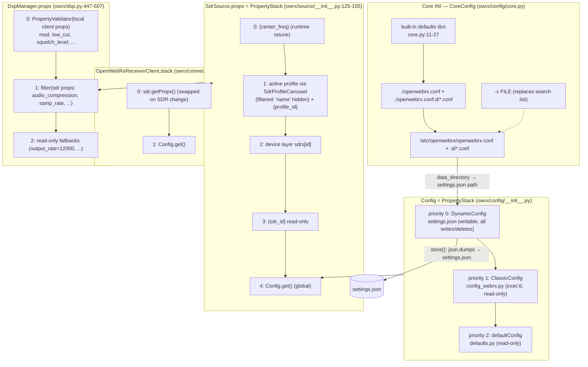

##### 4.2.1.2 Precedence rules

1. **Global keys** resolve to the first layer containing the key, checked in this order: settings.json, then config_webrx.py, then defaults (`PropertyStack._getTopLayer`, `owrx/property/__init__.py:345-352`). There is **no deep merge**. A layer that defines `sdrs` or `receiver_gps` replaces the whole lower value. For example, a `sdrs` entry in settings.json hides every default device.
2. **Device-scoped keys** resolve in this order: the runtime `center_freq` override, then the active profile, then the device, then the global config (`owrx/source/__init__.py:139-155`). A profile can therefore override any global key the consumer reads through the source props, including `waterfall_levels`, `waterfall_auto_level_default_mode`, `eibi_bookmarks_range`, `repeater_range`, `rig_enabled`, `rig_tx_enabled`, `key_locked`, `squelch_auto_margin`, `audio_compression` and `fft_size`. The profile `name` is filtered out so that it cannot hide the device name (`owrx/source/__init__.py:143-145`).
3. **Writes**: `Config.__setitem__` and `Config.__delitem__` always target the DynamicConfig layer (`owrx/config/__init__.py:37-43`). A delete stores the tombstone `PropertyDeleted`, which hides the key from layer 0 so that it falls back to the classic or default value (`owrx/config/dynamic.py:43-62`). Nested device and profile edits mutate nested `PropertyLayer` objects in place. Afterwards the controller re-assigns `config["sdrs"] = sdrs` so that the subtree becomes part of the dynamic layer and is serialised (`owrx/controllers/settings/sdr.py:173-179,277-282,332-341`).
4. **Client-settable DSP keys** sit at the top of the DSP stack, behind a `PropertyValidator`. They can never reach `Config`, because they are stored in a private filtered layer (`owrx/dsp.py:454-473`).

#### 4.2.2 Core INI configuration (`openwebrx.conf`)

Built-in defaults are at `owrx/config/core.py:11-27`. The shipped file is `openwebrx.conf:1-16`. Values are read in `CoreConfig.__init__` (`owrx/config/core.py:62-78`), which runs on **every** `CoreConfig()` instantiation (dozens of call sites). Each instantiation repeats `checkDirectory` (exists, is a directory, is writable) for the data and temp directories and raises `ConfigError` on failure.

| Section.key | Default | Type | Consumed by | Effect |
|---|---|---|---|---|
| `core.data_directory` | `/var/lib/openwebrx` | path (must exist and be writable) | `owrx/config/dynamic.py:35`, `owrx/users.py:150`, `owrx/bookmarks.py:189`, `owrx/controllers/assets.py:100`, `owrx/controllers/settings/general.py:413,435`, `owrx/web/__init__.py:31`, `owrx/markers.py:74`, `owrx/feature.py:186` (and others) | Location of `settings.json`, `users.json`, `bookmarks.json`, receiver images, and the web caches (EIBi, repeaters, markers) |
| `core.temporary_directory` | `/tmp` | path (must exist and be writable) | `owrx/storage.py:61,71,93`, `owrx/controllers/imageupload.py:26`, `owrx/audio/queue.py:31`, `owrx/audio/wav.py:21,100`, `owrx/aprs/direwolf.py:158`, `csdr/chain/satellite.py:15-70`, `owrx/controllers/settings/general.py:436,440` | Decoder WAV slices, stored files (FAX/SSTV/recordings, also served by `/files`), image-upload staging, Direwolf configuration |
| `core.log_level` | `INFO` | logging level name | `owrx/__main__.py:131` | Root logger level. `--debug` overrides it. |
| `core.temperature_sensor` | `/sys/class/thermal/thermal_zone0/temp` | path | `owrx/cpu.py:31` | Source of the CPU temperature sent to clients |
| `web.port` | `8073` | int | `owrx/__main__.py:170` | HTTP(S) listen port |
| `web.ipv6` | `true` | bool | `owrx/__main__.py:36-41,170` | Binds `::` (dual-stack, AF_INET6) instead of `0.0.0.0` |
| `web.bind_address` | unset (all interfaces) | string | `owrx/__main__.py:37-38,170` | Restricts the listen address |
| `web.trusted_proxies` | unset | comma-separated IP list | `owrx/client.py:164-174` | `X-Forwarded-For` is honoured when the peer is private **or** listed. Used for client IP display, per-IP limits and bans. **Not** used for `request.local` (login restriction). |
| `aprs.symbols_path` | `/usr/share/aprs-symbols/png` | path | `owrx/controllers/assets.py:106-116` | Directory served at `/aprs-symbols/*` (simple string concatenation) |

#### 4.2.3 User configuration stack (`Config`)

* Singleton: `Config.get()` creates `Config()` once (`owrx/config/__init__.py:22-26`). `Config.validateConfig()` only forces this load (`owrx/config/__init__.py:31-35`, called from `owrx/__main__.py:134`).
* Construction loads `DynamicConfig()`, which reads settings.json and migrates it, then `ClassicConfig()`, which executes config_webrx.py and migrates it, and finally `defaultConfig` (`owrx/config/__init__.py:11-20`).
* `Config.store()` delegates to `DynamicConfig.store()`, which runs `json.dumps(indent=4, cls=owrx.jsons.Encoder)` and then `open(…, "w").write(...)` (`owrx/config/dynamic.py:37-41`). Despite the comment, the write is **not** atomic. It is a plain truncate and write, with no fsync, rename or chmod.
* The JSON → layer conversion turns nested dicts into nested `PropertyLayer`s recursively (`owrx/config/dynamic.py:22-30`). Lists stay plain Python lists.
* Values written at runtime by forms can be plain `dict`s, for example `waterfall_levels`, `receiver_gps` or `scheduler`, until the next restart turns them into `PropertyLayer`s. Consumers index them with `[...]`, so both types work, but there is no type stability (see W-9).

#### 4.2.4 `settings.json` format

The top level is a JSON object whose keys are the global keys of §4.2.8. All keys are optional except `version`, which is written by migration. Skeleton:

```json
{
    "version": 8,
    "receiver_name": "My SDR",
    "receiver_gps": {"lat": 47.0, "lon": 19.0},
    "waterfall_levels": {"min": -88, "max": -20},
    "sdrs": {
        "<device_id (uuid4 for UI-created, free text for legacy)>": {
            "name": "RTL-SDR",
            "type": "rtl_sdr",
            "enabled": false,
            "always-on": false,
            "services": true,
            "rf_gain": "auto | 29.0 | \"LNA=10,MIX=5\"",
            "ppm": 0,
            "scheduler": {"type": "static", "schedule": {"0600-1200": "<profile_id>"}},
            "profiles": {
                "<profile_id>": {
                    "name": "2m",
                    "center_freq": 145000000,
                    "samp_rate": 2048000,
                    "start_freq": 145725000,
                    "start_mod": "nfm",
                    "tuning_step": 5000
                }
            }
        }
    },
    "receiver_keys": ["..."],
    "aprs_igate_password": "cleartext",
    "mqtt_password": "cleartext",
    "wifi_pass_1": "cleartext"
}
```

* Profile order is significant: it is the JSON object order, preserved through Python dict insertion order, and it drives the UI dropdowns (`owrx/sdr.py:280-290`).
* Gain format: `"auto"`, a number, or a Soapy settings string `"STAGE=val,STAGE=val"` for stage gains (`owrx/form/input/device.py:111-138`, `owrx/soapy.py`).
* Scheduler format: `{"type": "static", "schedule": {"HHMM-HHMM": profile_id}}` or `{"type": "daylight", "schedule": {"day"|"night"|"greyline": profile_id}}`. The legacy top-level `schedule` key (static) is still accepted (`owrx/service/schedule.py:73-86`).
* A key set to `None` by a form is deleted, never written as `null`. The tombstone `PropertyDeleted` is filtered out by `DynamicConfig.__dict__` (`owrx/config/dynamic.py:58-59`).

#### 4.2.5 Migrations (`owrx/config/migration.py`)

`Migrator.currentVersion = 8` (`owrx/config/migration.py:127-152`). A missing `version` counts as 1. Migrators run sequentially from `version` to 7. **A version above 8 raises `ValueError` and stops startup.** Migration is applied **separately** to the dynamic layer (`owrx/config/dynamic.py:20`) and to the classic layer before it is made read-only (`owrx/config/classic.py:8-10`). The migrated data is only in memory until the next `store()`. The shipped `config_webrx.py` declares `version = 7` (`config_webrx.py:50`).

| From → To | Class | What it changes | Ref |
|---|---|---|---|
| 1 → 2 | `ConfigMigratorVersion1` | `receiver_gps` `[lat, lon]` becomes `{"lat","lon"}`. `waterfall_auto_level_margin` `[min, max]` becomes `{"min","max"}`. Renames `wsjt_queue_workers` → `decoding_queue_workers` and `wsjt_queue_length` → `decoding_queue_length`. | `owrx/config/migration.py:20-33` |
| 2 → 3 | `ConfigMigratorVersion2` | If any entry of `waterfall_colors` is above `0xFFFFFF` (old RGBA format), shifts every colour right by 8 bits, giving RGB. | `owrx/config/migration.py:36-41` |
| 3 → 4 | `ConfigMigratorVersion3` | Introduces `waterfall_scheme`. If a scheme is set and is not CUSTOM, it drops `waterfall_colors`. Otherwise it detects the scheme from the colour list (`WaterfallOptions.findByColors`), drops the colours unless the result is CUSTOM, and stores `waterfall_scheme`. | `owrx/config/migration.py:44-61` |
| 4 → 5 | `ConfigMigratorVersion4` | `waterfall_min_level` + `waterfall_max_level` become `waterfall_levels {min,max}` at the root, in every `sdrs.*` device and in every profile. | `owrx/config/migration.py:64-90` |
| 5 → 6 | `ConfigMigratorVersion5` | `frequency_display_precision` (digits after MHz) becomes `tuning_precision = 6 - value` (log10 of Hz). | `owrx/config/migration.py:93-99` |
| 6 → 7 | `ConfigMigratorVersion6` | `waterfall_auto_level_margin {min, max, min_range}` becomes `waterfall_auto_levels {min,max}` plus `waterfall_auto_min_range`. | `owrx/config/migration.py:102-111` |
| 7 → 8 | `ConfigMigratorVersion7` | `callsign_url` containing `qrzcq.com` sets `callsign_service = "qrzcq"`; containing `qrz.com` sets `"qrz"`; anything else logs a warning. **It then deletes `callsign_url` in every case.** `callsign_service` is never read anywhere. Because `callsign_url` is still a live key (default `https://www.qrzcq.com/call/{}`), migrating a v7 config silently discards a custom `callsign_url` (see W-6). | `owrx/config/migration.py:114-124` |

**`openwebrx config migrate`** (`owrx/config/commands.py:6-30`) is a different operation. It copies every key of the merged stack, defaults included, into the dynamic layer, except the blacklist `temporary_directory`, `web_port` and `aprs_symbols_path`. It then stores the config, and loads and re-stores the bookmarks. This turns a `config_webrx.py` setup into `settings.json`, but it also fixes all current defaults in place.

#### 4.2.6 Property system internals (`owrx/property/`)

##### 4.2.6.1 Classes

| Class | Role | Key behaviour | Ref |
|---|---|---|---|
| `PropertyManager` (ABC) | Dict-like base class with subscribers | `wire(cb)` registers a subscriber for **all** changes, called with a `{key: value}` dict. `wireProperty(name, cb)` registers a per-key subscriber and **calls it immediately** with the current value if the key exists. `filter(*names)` returns a `PropertyFilter`. `readonly()` returns a `PropertyReadOnly`. `_fireCallbacks` copies the subscriber list, calls the "all" subscribers first and then the per-key ones, and logs and swallows exceptions. | `owrx/property/__init__.py:39-120` |
| `Subscription` | Handle returned by `wire`/`wireProperty` | `cancel()` calls `unwire` (idempotent) | `owrx/property/__init__.py:23-36` |
| `PropertyDeleted` | Sentinel instance of `PropertyDeletion` (falsy) | Sent as the value in change events for deletions. Also used as the tombstone in DynamicConfig. | `owrx/property/__init__.py:13-20` |
| `PropertyLayer` | Concrete store (`self.properties` dict) | `__setitem__` is skipped when the stored value `==` the new one, which suppresses no-op events. For nested `PropertyLayer`s this comparison is identity. `__delitem__` fires `{key: PropertyDeleted}`. | `owrx/property/__init__.py:123-155` |
| `PropertyFilter` | View limited by a `Filter` | Forwards only events that match the filter. Get, set and delete on a non-matching key raise `KeyError`. `__contains__` returns False for non-matching keys. | `owrx/property/__init__.py:158-199` |
| `PropertyDelegator` | Transparent proxy | Wires itself to the inner manager and re-fires its events. | `owrx/property/__init__.py:202-230` |
| `PropertyValidator` | Delegator that validates on set | `validators` maps key → `Validator.of(spec)`. A failing value raises `PropertyValidationError`. Keys without a validator are accepted. | `owrx/property/__init__.py:233-257` |
| `PropertyReadOnly` | Delegator that rejects writes | Set and delete raise `PropertyWriteError`. **Shallow**: nested layers that come out of it stay writable. | `owrx/property/__init__.py:260-270` |
| `PropertyStack` | Ordered overlay of layers | `addLayer(priority, pm)`: 0 is the highest priority. It fires the keys whose effective value changed. `_getTopLayer(key)` sorts the layers on **every call** and returns the first layer containing the key, or the highest-priority layer as a fallback. `__setitem__` writes to the top layer that holds the key (or to the highest layer). `__delitem__` deletes from **all** layers. `keys()` is the union of all layers. `receiveEvent` forwards a layer's change only if that layer is now the top layer for the key. For deletions it forwards the lower layer's value, or `PropertyDeleted` if no layer has the key. `replaceLayer` computes a diff against the previous state and fires only real changes. `removeLayer`/`removeLayerByPriority` fire the uncovered values. | `owrx/property/__init__.py:273-383` |
| `PropertyCarousel` | Delegator that switches between named layers | Starts on an empty read-only layer. `addLayer(key, pm)` registers a layer and switches only if it replaces the active one. `switch(key=None)` re-wires to the new layer and fires the diff (deleted, changed and new keys). `removeLayer` of the active layer switches to the default layer. | `owrx/property/__init__.py:386-421` |
| `SdrProfileCarousel` | Carousel of one device's profiles | Each profile is wrapped in a stack `[{profile_id}, profile]`. The default layer is the **first** profile. It subscribes to the `profiles` layer, so adding, removing or replacing profiles is reflected live. | `owrx/source/__init__.py:80-109` |
| `Filter`, `ByPropertyName`, `ByLambda` | Filter predicates | membership / lambda | `owrx/property/filter.py:1-23` |
| `Validator.of`, `TypeValidator` (`Integer`, `Float`, `String`, `Bool`), `OrValidator`, `NumberValidator`, `RegexValidator`, `LambdaValidator` | Value validators | String aliases: `string`/`str`, `integer`/`int`, `number`/`num`, `bool`. A callable becomes a `LambdaValidator`. Note: `bool` is a subclass of `int` in Python, so `IntegerValidator` accepts `True`. | `owrx/property/validators.py:1-98` |

Tests cover only this package (`test/property/test_property_{layer,stack,filter,carousel,deletion,readonly,validator}.py` and `test/property/{filter,validators}/`).

##### 4.2.6.2 Wiring map: who subscribes to what

| Subscriber | Subscribed to | Reaction | Ref |
|---|---|---|---|
| `OpenWebRxReceiverClient.setupGlobalConfig` | `Config.filter(global_config_keys)` (waterfall_scheme, waterfall_colors, waterfall_auto_levels, waterfall_auto_min_range, fft_size, audio_compression, fft_compression, max_clients, tuning_precision, allow_center_freq_changes, allow_audio_recording, allow_chat, callsign_url, vessel_url, flight_url, modes_url, receiver_gps, ui_theme) | Sends a WS `{"type":"config"}` message. The scheme is expanded into `waterfall_colors`. | `owrx/connection.py:135-154,275-286` |
| `OpenWebRxReceiverClient.setupStack` | client stack `.filter(sdr_config_keys)` (waterfall_levels, waterfall_auto_level_default_mode, samp_rate, start_mod, start_freq, center_freq, tuning_step, initial_squelch_level, initial_nr_level, sdr_id, profile_id, squelch_auto_margin) | WS `config` message, plus the computed `start_offset_freq` | `owrx/connection.py:120-133,201-273` |
| same | `stack.filter("center_freq","samp_rate")` | Recomputes bookmarks (static + EIBi + RepeaterBook within `*_range`), dial frequencies and band plan; WS `bookmarks`/`dial_frequencies`/`bands` | `owrx/connection.py:224-269` |
| `ReceiverDetails` | `Config` filter of receiver_name, receiver_help, receiver_location, receiver_asl, receiver_gps, photo_title, photo_desc, usage_policy_url, session_timeout, keep_files | WS `receiver_details` (plus Maidenhead `locator`); also the HTML header template variables | `owrx/details.py:10-34`, `owrx/connection.py:102-112`, `owrx/controllers/template.py:28-31` |
| `MapConnection` | `Config` filter of google_maps_api_key, openweathermap_api_key, receiver_gps, map_type, map_position_retention_time, map_ignore_indirect_reports, map_prefer_recent_reports, map_call_retention_time, map_max_calls, callsign_url, vessel_url, flight_url, modes_url, receiver_name | WS `config` to map pages (API keys included) | `owrx/connection.py:588-610` |
| `MappedSdrSources` | the `sdrs` layer object, and each device's `.filter("type","profiles")` and `["profiles"]` | Creates or destroys `SdrSource` objects. A device is valid only if its type feature is available **and** it has at least one profile. | `owrx/sdr.py:12-95` |
| `ActiveSdrSources` / `AvailableProfiles` | `MappedSdrSources`, source state, profile layers, `name` keys | Maintain the enabled/non-failed source list and the `"sdr\|profile" → "Device Profile"` map that is pushed to clients | `owrx/sdr.py:119-223`, `owrx/connection.py:195-197` |
| `SdrSource` | `props.filter("enabled")`, `props.filter("always-on")`, `profileCarousel.filter("center_freq")`, `sdrProps = props.filter(getEventNames())` | Enable/disable, keep-alive, retune. Changes to command-mapped keys are sent live over the connector control socket, or trigger a restart. | `owrx/source/__init__.py:157-189,250-257`, `owrx/source/connector.py:37-62` |
| `SpectrumThread` | source props + Config, filtered to samp_rate, fft_size, fft_fps, fft_voverlap_factor, fft_compression | `fft_size` triggers an FFT chain restart; the others are applied live | `owrx/fft.py:14-60` |
| `DspManager` | DSP stack (see §4.2.1.1) | Calls the chain setters: compression, samp_rate, centre and offset frequency, squelch, bandpass, mod, deemphasis, RDS, NR, codecserver, AGC profiles, DAB rate | `owrx/dsp.py:442-575` |
| `RigControl` | DSP props `offset_freq`, `center_freq`, `rig_enabled`, `rig_tx_enabled`, `rig_transmit`, `mod`; `Config` `rig_model`/`rig_device`/`rig_address` read at start | Starts or stops `rigctl`, retunes, PTT | `owrx/rigcontrol.py:313-331,395-410` |
| `ReportingEngine` | `Config.filter("<name>_enabled" for pskreporter, wsprnet, sondehub, aisreporter, aprs_igate, mqtt)` | Instantiates or stops reporters live | `owrx/reporting/__init__.py:21-67` |
| `MqttReporter` | `mqtt_topic`; the filter on host/user/password/client_id/use_ssl; the filter on the 7 `mqtt_*` subscription flags | Changes topic, reconnects, resubscribes | `owrx/reporting/mqtt.py:27-45` |
| `Services` / `ServiceHandler` | `Config.wireProperty("services_enabled")`; source `props.wireProperty("services")`; `Config.wireProperty("services_decoders")`; source `center_freq`/`samp_rate` | Starts and stops background decoders per device | `owrx/service/__init__.py:20-56,453-485` |
| `ServiceScheduler` | source `props.wireProperty("scheduler")` | Re-parses the schedule | `owrx/service/schedule.py:218` |
| `DecoderQueue` | `decoding_queue_length`, `decoding_queue_workers` | Resizes the queue and the worker pool live | `owrx/audio/queue.py:113-122` |
| `ClientRegistry` | `max_clients` | Disconnects clients above the new limit | `owrx/client.py:40` |
| `GpsUpdater` | `gps_updates` | Starts or stops the gpsd polling thread, which updates `receiver_gps` | `owrx/gps.py:55-66,94-96` |
| `Bookmarks`, `Bandplan` | `receiver_country`, `bandplan_region` | Rebuild the file lists and invalidate caches | `owrx/bookmarks.py:95-97`, `owrx/bands.py:90-94` |
| `SondehubReporter` | `sondehub_enabled` | Applies the configuration | `owrx/reporting/sondehub.py:635` |

##### 4.2.6.3 Change propagation: web save to running system

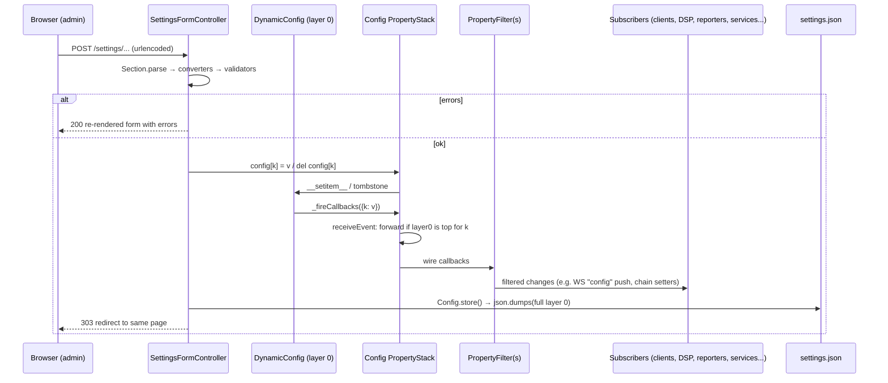

Notes:

* Device and profile edits fire events on the **nested** layers. Those are picked up directly by `MappedSdrSources`, `SdrSource` and the profile carousel. The top-level `config["sdrs"] = sdrs` assignment exists only to put the subtree into layer 0 for serialisation (`owrx/controllers/settings/sdr.py:173-179`).
* There is no locking anywhere in the property system. HTTP threads mutate layers while DSP, service and WebSocket threads read them and receive callbacks synchronously on the writer's thread (see W-8).
* Keys that are **read only once** at object construction, so a change applies only to new sessions or objects, include: `max_clients_per_ip` (checked at connect), the APRS/Direwolf keys (when the Direwolf config is written), `rig_model`/`rig_device`/`rig_address` (at `rigctl` start), `fax_*`, `cw_showcw`, `paging_*`, `ism_report_levels`, `rec_*`, `speech_*`, `lora *_bw`, `image_*` (when the chain or file is created), `bot_ban_enabled`, `magic_key` and `allow_center_freq_changes` (read on each message, so effectively live). Core INI, `config_webrx.py` and manual edits to `settings.json` all require a restart.

#### 4.2.7 Form framework (`owrx/form/`)

##### 4.2.7.1 Structure

* `Section(title, *inputs)` renders `<div class="col-12 settings-section"><h3>…` and its inputs. `parse(data)` calls `input.parse()` and then `input.validate()` for each input. `FormError` becomes a per-field error; `ValueError` becomes "Invalid value. Please, check and fix!"; any other exception becomes `"<Type>: <msg>"` (`owrx/form/section.py:6-46`).
* `OptionalSection(title, inputs, mandatory, optional)` is used for SDR devices and profiles. Optional inputs that are absent from the data are rendered disabled inside a hidden `.optional-inputs` block and listed in an "Additional optional settings" `<select>` with an Add button. Present optional inputs get a Remove button. On parse, any optional key missing from the POST is set to `None`, which deletes it (`owrx/form/section.py:49-128`). Client-side behaviour is in `htdocs/lib/settings/OptionalSection.js`.
* `Input(id, label, infotext, converter, validator, disabled, removable)`. `render()` takes `config[id]`, converts it with `converter.convert_to_form`, renders the control, and wraps it in a Bootstrap row `bootstrap_decorate`. `parse()` takes `data[id][0]` and runs `converter.convert_from_form`. `validate()` runs the form-level validator (`owrx/form/input/__init__.py:10-104`).
* `FormError(key, message)` / `ValidationError` (`owrx/form/error.py:1-15`).

##### 4.2.7.2 Input types

| Class | HTML | Default converter | Parse | Ref |
|---|---|---|---|---|
| `TextInput` | `<input type=text>` | `TextConverter` (strips; None → "") | `data[id][0]` | `owrx/form/input/__init__.py:107-114` |
| `PasswordInput` | `<input type=password>` (value pre-filled with the stored secret) | Text | same | `:117-121` |
| `NumberInput` | `<input type=number>` + unit append | `IntConverter` | `int()` | `:124-162` |
| `FloatInput` | number, `step=any` | `FloatConverter` | `float()` | `:165-171` |
| `TextAreaInput` | `<textarea>` (**value not HTML-escaped**) | Null | raw | `:174-188` |
| `CheckboxInput` | hidden `value=0` + checkbox `value=1` | Null | `"1" in values` → bool | `:191-225` |
| `MultiCheckboxInput` | one checkbox per `Option` (`id-<value>`) | Null | list of values whose box is `on` | `:235-273` |
| `ServicesCheckboxInput` | Multi; options from `Modes.getAvailableServices()` | — | — | `:276-281` |
| `Js8ProfileCheckboxInput` | Multi: normal, slow, fast, turbo | — | — | `:284-292` |
| `DropdownInput` | `<select>`; accepts a list of `Option` or a `DropdownEnum` class (then `EnumConverter`: form uses the enum **name**, storage the enum **value**) | Null / Enum | raw / `Enum[name].value` | `:295-335` |
| `ModesInput` | Dropdown of `Modes.getAvailableClientModes()` | — | — | `:338-341` |
| `AgcInput` | Dropdown of `pycsdr.types.AgcProfile` values | — | — | `:344-347` |
| `LoraBandwidthInput` | Dropdown "0".."9" | — | — | `:350-364` |
| `ExponentialInput` | number + `<select name=id-exponent>` (0, 3, 6, 9, 12; k selected by default) | Int | `int(float(v) * 10**exp)` | `:367-415` |
| `LocationInput` | `id-lat`, `id-lon` number inputs + `.map-input` (Google key in `data-key`) | Null | `{lat: float, lon: float}` | `owrx/form/input/location.py:20-62` |
| `CountryInput` | Dropdown of ISO-2 codes + "None" | — | — | `owrx/form/input/country.py:5-12` |
| `ReceiverKeysInput` | Textarea (no wrap) | `ReceiverKeysConverter` (lines ↔ list, blank lines dropped) | list | `owrx/form/input/receiverid.py:5-33` |
| `AvatarInput` / `TopPhotoInput` (`ImageInput`) | hidden input + preview `` + Upload/Restore buttons; `data-max-size` | Null | `"restore"`, `"<id>-<uuid>.<ext>"` or empty | `owrx/form/input/gfx.py:6-67` |
| `GainInput` | `<select id-select>` auto/manual/stages + `id-manual` + `id-<stage>` inputs | Null | `"auto"`, float, or Soapy settings string | `owrx/form/input/device.py:7-138` |
| `BiasTeeInput`, `DirectSamplingInput`, `RemoteInput` | presets (checkbox `bias_tee`; dropdown 0/1/2; text `remote` required, optional) | — | — | `owrx/form/input/device.py:141-179` |
| `SchedulerInput` | mode select + static rows (`id-time-start[]`, `id-time-end[]`, `id-profile[]`) + daylight selects | Null | `{"type","schedule"}` or nothing | `owrx/form/input/device.py:182-366` |
| `WaterfallLevelsInput` / `WaterfallAutoLevelsInput` | `id-min`, `id-max` | Null | `{min: float, max: float}` | `owrx/form/input/device.py:369-434` |
| `Q65ModeMatrix` | checkbox grid of modes × intervals (unavailable cells disabled) | Null | `["A30", ...]` | `owrx/form/input/wsjt.py:8-62` |
| `WsjtDecodingDepthsInput` | hidden JSON + JS editor | `JsonConverter` | `json.loads` | `owrx/form/input/wsjt.py:65-93` |
| `SdrDeviceTypeDisplay` | disabled display of the type name | `SdrDeviceTypeConverter` (→ None) | ignored (`{}`) | `owrx/source/__init__.py:626-649` |

##### 4.2.7.3 Converters (`owrx/form/input/converter.py`)

`NullConverter` (identity), `TextConverter` (None ↔ "", strip), `OptionalConverter(sub, defaultFormValue="")` (form default ↔ None, which deletes the key; used with `defaultFormValue=True` for the `enabled` checkbox, so "checked" means the key is absent), `IntConverter`, `FloatConverter`, `EnumConverter` (unknown stored value → None → the dropdown shows its first option), `JsonConverter`, and `WaterfallColorsConverter` (one colour per line, `#hex` or `int(s, 0)`; invalid lines silently dropped). Ref: `owrx/form/input/converter.py:6-123`.

##### 4.2.7.4 Form validators (`owrx/form/input/validator.py`, plus specialised ones)

`RequiredValidator`, `RangeValidator(min, max)` (empty values ignored, compared as float), `RangeListValidator([Range])` (sample rates), `AddressAndOptionalPortValidator`, `UrlValidator` (http/https + netloc), `AlsaDeviceValidator`, `RigCtlDeviceValidator`, `LocationValidator` (lat/lon open intervals), `WifiSsidValidator`, `WifiPassValidator` (`owrx/form/input/wifi.py:10-30`), and `IPv4AndPortValidator` (Afedri, `owrx/source/afedri.py:12-29`). These are **form-level only**. The property-level `PropertyValidator` is used only for client-settable DSP properties (`owrx/dsp.py:454-473`), so settings.json and config_webrx.py values are never type-checked.

##### 4.2.7.5 Client-side widgets

`htdocs/settings.js:1-14` binds: `mapInput`, `imageUpload`, `bookmarktable`, `wsjtDecodingDepthsInput`, `waterfallDropdown`, `gainInput` (`#rf_gain`), `optionalSection`, `schedulerInput` (`#scheduler`), `exponentialInput`, `logMessages`, `clientList`, `profiles` (move and clone buttons). Sources are in `htdocs/lib/settings/*.js`.

##### 4.2.7.6 Rendering and escaping

`render_input_properties` HTML-escapes attribute values (`owrx/form/input/__init__.py:70-71`). Labels, infotext, textarea bodies, dropdown option text and values, the error list, and the global error message are **not** escaped. Admin-controlled values (for example `photo_desc`) are rendered as raw HTML in the public header (`htdocs/lib/Header.js:28`). Templates use `string.Template.safe_substitute` with no escaping (`owrx/controllers/template.py:8-16`).

#### 4.2.8 Full configuration key reference

Legend:
* **Page/section**: where the key is edited in the web UI; "—" means it can only be set through config files.
* **Scope**: G = global, D = per device, P = per profile. A D or P value overrides G for consumers that read through source props (§4.2.1.2).
* Defaults come from `owrx/config/defaults.py` unless stated otherwise. A "(none)" default means the key is absent unless it is set.

##### 4.2.8.1 Global keys

| Key | Default | Type | Settings page / section (scope) | Consumed by | Effect |
|---|---|---|---|---|---|
| `version` | `8` | int | — (written by migration) | `owrx/config/migration.py:141` | Config schema version |
| `max_clients` | `20` | int | General › Receiver limits | `owrx/client.py:40,52`, `owrx/connection.py:143`, `owrx/controllers/status.py:40`, `htdocs/openwebrx.js:935` | Maximum simultaneous receiver clients; live disconnect when lowered |
| `max_clients_per_ip` | `20` | int | General › Receiver limits | `owrx/client.py:54` | Per-IP connection cap at connect time (IP is XFF-aware) |
| `receiver_name` | `"[Callsign]"` | str | General › Receiver information | `owrx/details.py:15`, `owrx/connection.py:607`, `owrx/controllers/status.py:34`, `owrx/reporting/sondehub.py:49-50`, `htdocs/lib/Header.js:19` | Header title, map title, status.json, Sondehub fallback uploader name |
| `receiver_location` | `"Budapest, Hungary"` | str | General › Receiver information | `owrx/details.py:17`, `owrx/controllers/status.py:38`, `htdocs/lib/Header.js:26` | Header text, status.json |
| `receiver_asl` | `200` | int (m) | General › Receiver information | `owrx/details.py:18`, `owrx/controllers/status.py:37`, `owrx/reporting/sondehub.py:64` | Header, status.json, Sondehub altitude |
| `receiver_admin` | `"example@example.com"` | str | General › Receiver information | `owrx/controllers/status.py:35`, `owrx/web/repeaters.py:145-149` | Public in `/status.json`; sent in the RepeaterBook User-Agent (when an API key is set) |
| `receiver_gps` | `{lat:47.0, lon:19.0}` | layer {lat,lon} | General › Receiver information (map picker) | `owrx/details.py:19,31`, `owrx/connection.py:152,596`, `owrx/aprs/direwolf.py:34,104`, `owrx/reporting/aprsigate.py:36,162`, `owrx/reporting/pskreporter.py:244`, `owrx/reporting/wsprnet.py:64`, `owrx/reporting/sondehub.py:57`, `owrx/service/schedule.py:139-140`, `owrx/web/eibi.py:88,216`, `owrx/web/repeaters.py:82-306`, `owrx/gps.py:94-96`, `csdr/module/aircraft.py:33-34`, `owrx/__main__.py:59-60` | Receiver position: locator, map centre, beacons and spot locators, daylight scheduler, EIBi/RepeaterBook distance search, aircraft decoder reference position. Overwritten by GPS when `gps_updates` is on. |
| `receiver_country` | `""` | str (ISO-2 or empty) | General › Receiver information | `owrx/bookmarks.py:96,126`, `owrx/web/repeaters.py:141,201` | Country bookmark directory; RepeaterBook country |
| `receiver_help` | `"https://fms.komkon.org/OWRX/"` | str URL | — | `owrx/details.py:16`, `htdocs/include/header.include.html:10` | Help button target |
| `photo_title` | `"Panorama of Budapest from Schönherz Zoltán Dormitory"` | str | General › Receiver information | `owrx/details.py:20`, `htdocs/lib/Header.js:27` | Header photo title (rendered as HTML) |
| `photo_desc` | `""` | str (HTML) | General › Receiver information | `owrx/details.py:21`, `htdocs/lib/Header.js:28` | Header photo description, raw HTML |
| `receiver_keys` | (none) | list[str] | General › Receiver listings | `owrx/receiverid.py:81-89` | ReceiverId challenge/response keys for listing sites |
| `receiver_avatar` / `receiver_top_photo` | (pseudo-keys, not stored) | upload token | General › Receiver images | `owrx/controllers/settings/general.py:417-446`, `owrx/controllers/assets.py:94-95` | Replace the avatar and panorama image files |
| `admin_pass_0/1/2` | (pseudo-keys, not stored) | str | General › Change password | `owrx/controllers/settings/general.py:447-457` | Voluntary password change (AUTH-007) |
| `fft_fps` | `9` | int | General › Waterfall (G; D/P via source props) | `owrx/fft.py:24,44,53`, `owrx/dsp.py:549` | Waterfall lines per second; live |
| `fft_size` | `4096` | int 256..16384 | General › Waterfall (G; D/P) | `owrx/fft.py:23,42,50`, `owrx/connection.py:140` | FFT bins; FFT chain restart on change |
| `fft_voverlap_factor` | `0.3` | float 0..0.9 | General › Waterfall (G; D/P) | `owrx/fft.py:25,43,54`, `owrx/dsp.py:548` | FFT vertical overlap; live |
| `audio_compression` | `"adpcm"` | enum adpcm/none | General › Compression (G; D/P) | `owrx/dsp.py:478,514,546`, `owrx/connection.py:141`, `htdocs/openwebrx.js:926` | Audio WS frame codec |
| `fft_compression` | `"adpcm"` | enum adpcm/none | General › Compression (G; D/P) | `owrx/fft.py:26,45,55`, `owrx/dsp.py:479,547`, `owrx/connection.py:142` | FFT WS frame codec |
| `wfm_deemphasis_tau` | `50e-6` | float (50e-6/75e-6) | Decoding › Miscellaneous | `owrx/dsp.py:485,562,610` | WFM de-emphasis time constant |
| `wfm_rds_rbds` | `False` | bool | Decoding › Miscellaneous | `owrx/dsp.py:486,563,610` | RBDS (US) instead of RDS decoding |
| `digimodes_fft_size` | `2048` | int | Decoding › Miscellaneous | `owrx/dsp.py:480,550` | Secondary (digimode) FFT size |
| `digital_voice_dmr_id_lookup` | `True` | bool | Decoding › Digital voice | `owrx/meta.py:97-99` (key built dynamically) | radioid.net lookup of DMR IDs |
| `digital_voice_nxdn_id_lookup` | `True` | bool | Decoding › Digital voice | `owrx/meta.py:97-99` | radioid.net lookup of NXDN IDs |
| `digital_voice_codecserver` | (none; DSP fallback `""`) | str `host[:port]` | Decoding › Digital voice | `owrx/dsp.py:487,622-634`, `owrx/feature.py:730-731` | Remote codecserver for AMBE codecs; also used by the feature probe |
| `sdrs` | 3 sample devices: `rtlsdr` (8 profiles), `airspy` (5), `sdrplay` (21) | layer of device layers | SDR devices and profiles | `owrx/sdr.py:256`, `owrx/controllers/status.py:42`, `owrx/controllers/settings/sdr.py` | Device and profile tree (§4.2.8.2–4.2.8.4) |
| `waterfall_scheme` | `"GoogleTurboWaterfall"` | enum (`WaterfallOptions` value = class name) | General › Waterfall | `owrx/connection.py:136,279-281` | Colour palette; expanded to `waterfall_colors` for clients |
| `waterfall_colors` | (none) | list[int RGB] | General › Waterfall (only kept with Custom) | `owrx/connection.py:137,279-281`, `owrx/waterfall.py:311-312` | Custom palette |
| `waterfall_levels` | `{min:-88, max:-20}` | layer {min,max} dBFS | General › Waterfall (G); device and profile optional | `owrx/connection.py:121`, `htdocs/lib/Waterfall.js:30-31`, `htdocs/openwebrx.js:961` | Manual waterfall range |
| `waterfall_auto_levels` | `{min:3, max:10}` | layer {min,max} dB | General › Waterfall | `owrx/connection.py:138`, `htdocs/lib/Waterfall.js:32-33` | Auto-range margins |
| `waterfall_auto_level_default_mode` | `False` | bool | General › Waterfall (G); D/P optional | `owrx/connection.py:122`, `htdocs/lib/Waterfall.js:36-37` | Auto-level enabled on page load |
| `waterfall_auto_min_range` | `50` | int dB | General › Waterfall | `owrx/connection.py:139`, `htdocs/lib/Waterfall.js:34-35` | Minimum auto range |
| `key_locked` | `False` | bool | — globally; device and profile optional checkbox | `owrx/source/__init__.py:465-472`, `owrx/sdr.py:239-241` | Profile switch requires `magic_key` (global true locks every device) |
| `magic_key` | `"memagic"` | str | General › Receiver limits | `owrx/connection.py:352,391`, `htdocs/lib/DemodulatorPanel.js:224` | Shared secret for centre-frequency changes and locked profiles; empty disables the check |
| `allow_center_freq_changes` | `False` | bool | General › Receiver limits | `owrx/connection.py:145,351` | Allows the `setfrequency` WS message (server-side) |
| `allow_audio_recording` | `True` | bool | General › Receiver limits | `owrx/connection.py:146`, `htdocs/openwebrx.js:973-974` | Shows the client-side recorder (**client-only**) |
| `allow_remote_config` | `True` | bool | General › Receiver limits | `owrx/controllers/session.py:57,63,91` | `/login` and `/logout` restricted to private peers when false (AUTH-016) |
| `allow_chat` | `True` | bool | General › Receiver limits | `owrx/client.py:117`, `owrx/connection.py:147`, `htdocs/openwebrx.js:978-979` | Chat accepted (server) and shown (client) |
| `tuning_precision` | `2` | int 0..5 | General › Display | `owrx/connection.py:144`, `htdocs/openwebrx.js:965-966` | Frequency display / tuning granularity, 10^n Hz |
| `squelch_auto_margin` | `10` | int dB | Decoding › Miscellaneous (G; D/P via source props) | `owrx/connection.py:132`, `htdocs/openwebrx.js:945-946` | Auto-squelch offset |
| `google_maps_api_key` | `""` | str | General › Map | `owrx/connection.py:594`, `owrx/form/input/location.py:40` | Google Maps; **sent to every map client** |
| `openweathermap_api_key` | `""` | str | General › Map | `owrx/connection.py:595` | Weather layer; **sent to every map client** |
| `repeaterbook_api_key` | `""` | str | — (input commented out, `general.py:301-308`) | `owrx/web/repeaters.py:145-148` | Bearer token for RepeaterBook; UA includes `receiver_admin` |
| `map_type` | `"google"` | enum google/leaflet | General › Map | `owrx/connection.py:597`, `owrx/controllers/template.py:53-65` | Default map implementation (`?type=` overrides) |
| `map_position_retention_time` | `7200` | int s | General › Map | `owrx/map.py:17`, `owrx/meshtastic.py:187`, `owrx/connection.py:598`, `htdocs/lib/MapManager.js:109` | Marker expiry |
| `map_call_retention_time` | `300` | int s 15..3600 | General › Map | `owrx/connection.py:601`, `htdocs/lib/MapManager.js:112` | Call-line expiry |
| `map_max_calls` | `5` | int 0..50 | General › Map | `owrx/map.py:111`, `owrx/connection.py:602` | Number of call lines shown |
| `map_prefer_recent_reports` | `True` | bool | General › Map | `owrx/map.py:149`, `owrx/connection.py:600` | Prefer newer over shorter-path position reports |
| `map_ignore_indirect_reports` | `False` | bool | General › Map | `owrx/map.py:148`, `owrx/connection.py:599` | Drop digipeated/indirect APRS positions |
| `callsign_url` | `"https://www.qrzcq.com/call/{}"` | str URL template | General › External links | `owrx/connection.py:148,603`, `htdocs/openwebrx.js:996`, `htdocs/lib/MapManager.js:118` | Callsign lookup links (**deleted by migration v7→8**, W-6) |
| `vessel_url` | `"https://www.vesselfinder.com/vessels/details/{}"` | str | General › External links | `owrx/connection.py:149,604` | MMSI lookup links |
| `flight_url` | `"https://flightaware.com/live/flight/{}"` | str | General › External links | `owrx/connection.py:150,605` | Flight lookup links |
| `modes_url` | `"https://flightaware.com/live/modes/{}/redirect"` | str | General › External links | `owrx/connection.py:151,606` | Mode-S lookup links |
| `sonde_url` | `"https://sondehub.org/{}"` | str | General › External links | `htdocs/openwebrx.js:1004-1005`, `htdocs/lib/Utils.js:32,134`. **The server never sends it**: the key is missing from `global_config_keys` (`owrx/connection.py:135-154`) and from the map filter. | Intended for sonde lookup links; in practice the setting has no effect (bug) |
| `geoip_url` | `"https://www.geolocation.com/?ip={}#ipresult"` | str | General › External links | `owrx/controllers/clients.py:74` | IP lookup links in the admin client list |
| `usage_policy_url` | `"policy"` | str | General › Receiver limits | `owrx/details.py:22`, `htdocs/include/header.include.html:25` | Redirect target when the session times out |
| `session_timeout` | `0` | int s | General › Receiver limits | `owrx/details.py:23`, `htdocs/include/header.include.html:24-25` | Client-side meta refresh (**client-only**) |
| `keep_files` | `20` | int | General › Receiver limits | `owrx/storage.py:70`, `owrx/details.py:24` | Retention count for stored files |
| `decoding_queue_workers` | `2` | int | Decoding › WSJT decoders | `owrx/audio/queue.py:117,120` | Decoder worker threads (live) |
| `decoding_queue_length` | `10` | int | Decoding › WSJT decoders | `owrx/audio/queue.py:115,119` | Queue size (live) |
| `wsjt_decoding_depth` | `3` | int | Decoding › WSJT decoders | `owrx/wsjt.py:28-29` | jt9 `-d` default |
| `wsjt_decoding_depths` | `{jt65: 1}` | layer mode→int | Decoding › WSJT decoders | `owrx/wsjt.py:25-26` | Per-mode depth |
| `fst4_enabled_intervals` | `[15, 30]` | list[int] | Decoding › WSJT decoders | `owrx/wsjt.py:48,52` | Active FST4 periods |
| `fst4w_enabled_intervals` | `[120, 300]` | list[int] | Decoding › WSJT decoders | `owrx/wsjt.py:58,62` | Active FST4W periods |
| `q65_enabled_combinations` | `["A30","E120","C60"]` | list[str] | Decoding › WSJT decoders | `owrx/wsjt.py:68,72` | Active Q65 mode/period pairs |
| `js8_enabled_profiles` | `["normal","slow"]` | list[str] | Decoding › WSJT decoders | `owrx/js8.py:41,45` | Active JS8 submodes |
| `js8_decoding_depth` | `3` | int | Decoding › WSJT decoders | `owrx/js8.py:23-24` | JS8 depth |
| `services_enabled` | `False` | bool | Background decoding | `owrx/service/__init__.py:455,485` | Master switch for background services |
| `services_decoders` | `["ft8","ft4","wspr","packet"]` | list[str] | Background decoding | `owrx/service/__init__.py:54,92` | Modes decoded in the background |
| `aprs_callsign` | `"N0CALL"` | str | Reporting › APRS-IS | `owrx/aprs/direwolf.py:29,95,143`, `owrx/reporting/aprsigate.py:41-271`, `owrx/reporting/sondehub.py:45` | iGate login/beacon callsign |
| `aprs_igate_enabled` | `False` | bool | Reporting › APRS-IS | `owrx/reporting/__init__.py:45-62`, `owrx/reporting/aprsigate.py:38,90`, `owrx/aprs/direwolf.py:30,99` | Enables the iGate |
| `aprs_igate_legacy` | `False` | bool | Reporting › APRS-IS | `owrx/reporting/aprsigate.py:39,90`, `owrx/aprs/direwolf.py:31,99` | Use Direwolf's iGate instead of the native one |
| `aprs_igate_server` | `"euro.aprs2.net"` | str | Reporting › APRS-IS | `owrx/reporting/aprsigate.py:40,259`, `owrx/aprs/direwolf.py:32,142` | APRS-IS server |
| `aprs_igate_password` | `""` | str (secret) | Reporting › APRS-IS | `owrx/reporting/aprsigate.py:42,90,272`, `owrx/aprs/direwolf.py:33,144` | APRS-IS passcode (cleartext in settings.json and the Direwolf temp config) |
| `aprs_igate_beacon` | `False` | bool | Reporting › APRS-IS | `owrx/reporting/aprsigate.py:43,107`, `owrx/aprs/direwolf.py:36,102` | Position beacon |
| `aprs_igate_symbol` | `"R&"` | enum | Reporting › APRS-IS | `owrx/reporting/aprsigate.py:163`, `owrx/aprs/direwolf.py:35,126` | Beacon symbol |
| `aprs_igate_comment` | `"OpenWebRX APRS gateway"` | str, optional | Reporting › APRS-IS | `owrx/reporting/aprsigate.py:165-166`, `owrx/aprs/direwolf.py:39,132` | Beacon comment |
| `aprs_igate_height` | (none) | int m, optional | Reporting › APRS-IS | `owrx/reporting/aprsigate.py:168-173`, `owrx/aprs/direwolf.py:40,115-122` | PHG height |
| `aprs_igate_gain` | (none) | int dBi, optional | Reporting › APRS-IS | `owrx/reporting/aprsigate.py:175-176`, `owrx/aprs/direwolf.py:37,130` | PHG gain |
| `aprs_igate_dir` | (none = omni) | enum N..NW | Reporting › APRS-IS | `owrx/reporting/aprsigate.py:178-179`, `owrx/aprs/direwolf.py:38,131` | PHG direction |
| `aisreporter_enabled` | `False` | bool | Reporting › AIS | `owrx/reporting/__init__.py:45-62` | Enables the AIS UDP forwarder |
| `aisreporter_udp_hosts` | `"ais.vesselfinder.com"` | str CSV | Reporting › AIS | `owrx/reporting/aisreporter.py:39,255` | Destination hosts |
| `aisreporter_udp_ports` | `"5482"` | str CSV | Reporting › AIS | `owrx/reporting/aisreporter.py:40,256` | Destination ports |
| `pskreporter_enabled` | `False` | bool | Reporting › PSKReporter | `owrx/reporting/__init__.py:45-62` | Enables PSKReporter |
| `pskreporter_callsign` | `"N0CALL"` | str | Reporting › PSKReporter | `owrx/reporting/pskreporter.py:242`, `owrx/reporting/sondehub.py:45` | Receiver callsign |
| `pskreporter_antenna_information` | (none) | str, optional | Reporting › PSKReporter | `owrx/reporting/pskreporter.py:208,248-249` | Antenna field |
| `pskreporter_rig_information` | (none) | str, optional | Reporting › PSKReporter | `owrx/reporting/pskreporter.py:209,250-251` | Rig field |
| `wsprnet_enabled` | `False` | bool | Reporting › WSPRnet | `owrx/reporting/__init__.py:45-62` | Enables WSPRnet (plain HTTP) |
| `wsprnet_callsign` | `"N0CALL"` | str | Reporting › WSPRnet | `owrx/reporting/wsprnet.py:63`, `owrx/reporting/sondehub.py:45` | Reporter callsign |
| `sondehub_enabled` | `False` | bool | Reporting › Sondehub | `owrx/reporting/sondehub.py:75,635`, `owrx/reporting/__init__.py:45-62` | Enables Sondehub upload and listener position |
| `sondehub_callsign` | (none) | str, optional | Reporting › Sondehub | `owrx/reporting/sondehub.py:42-43` | Uploader callsign (fallback chain) |
| `sondehub_antenna` | (none) | str | Reporting › Sondehub | `owrx/reporting/sondehub.py:70` | Antenna description |
| `mqtt_enabled` | `False` | bool | Reporting › MQTT | `owrx/reporting/__init__.py:21-62` (feature `mqtt`) | Enables the MQTT reporter |
| `mqtt_host` | `"localhost"` | str `host[:port]` | Reporting › MQTT | `owrx/reporting/mqtt.py:38,68` | Broker |
| `mqtt_use_ssl` | `False` | bool | Reporting › MQTT | `owrx/reporting/mqtt.py:39,64` | TLS to the broker |
| `mqtt_client_id` | (none) | str, optional | Reporting › MQTT | `owrx/reporting/mqtt.py:38,49` | Client id |
| `mqtt_user` | (none) | str, optional | Reporting › MQTT | `owrx/reporting/mqtt.py:38,60-61` | Username |
| `mqtt_password` | (none) | str (secret), optional | Reporting › MQTT | `owrx/reporting/mqtt.py:38,60-61` | Password (cleartext in settings.json) |
| `mqtt_topic` | (none → `"openwebrx"`) | str, optional | Reporting › MQTT | `owrx/reporting/mqtt.py:25,36` | Base topic |
| `mqtt_chat` / `mqtt_aircraft` / `mqtt_ais` / `mqtt_aprs` / `mqtt_wsjt` / `mqtt_sonde` / `mqtt_meshtastic` | `False` each | bool | Reporting › MQTT | `owrx/mqtt.py:18-42`, `owrx/reporting/mqtt.py:42-43` | Subscribe to and ingest these data types from the broker |
| `report_clients` | `True` | bool | Reporting › MQTT | `owrx/client.py:93` | Publish client connect/disconnect events (includes IP) |
| `report_radio` | `True` | bool | Reporting › MQTT | `owrx/__main__.py:54`, `owrx/source/__init__.py:600`, `owrx/web/__init__.py:151` | Publish server start/stop, SDR state and profile changes |
| `paging_filter` | `True` | bool | Decoding › Paging | `owrx/toolbox.py:154` | Drop empty, numeric or unreadable pager messages |
| `paging_charset` | `"US"` | enum US/FR/DE/SE/SI | Decoding › Paging | `csdr/module/toolbox.py:24` | multimon-ng charset |
| `eibi_bookmarks_range` | `0` | int km 0..25000 | General › Display (G); D/P optional | `owrx/connection.py:234` | EIBi auto-bookmarks radius (0 = off) |
| `repeater_range` | `0` | int km 0..200 (P: 0..100) | General › Display (G); D/P optional | `owrx/connection.py:238` | RepeaterBook auto-bookmarks radius (0 = off) |
| `adsb_ttl` | `900` | int s | Decoding › Aircraft | `owrx/aircraft/manager.py:173` | ADS-B/UAT expiry |
| `vdl2_ttl` | `1800` | int s | Decoding › Aircraft | `owrx/aircraft/manager.py:168` | VDL2 expiry |
| `hfdl_ttl` | `1800` | int s | Decoding › Aircraft | `owrx/aircraft/manager.py:170` | HFDL expiry |
| `acars_ttl` | `1800` | int s | Decoding › Aircraft | `owrx/aircraft/manager.py:166` | ACARS expiry |
| `vdl2_ignore_acks` | `False` | bool | Decoding › Aircraft | `owrx/aircraft/__init__.py:575` | Drop VDL2 ACKs |
| `acars_ignore_acks` | `False` | bool | Decoding › Aircraft | `owrx/aircraft/__init__.py:878` | Drop ACARS ACKs |
| `fax_lpm` | `120` | int 30..480 | Decoding › Fax | `csdr/chain/digimodes.py:203` | Lines per minute |
| `fax_min_length` | `200` | int 50..450 | Decoding › Fax | `owrx/fax.py:76` | Minimum page lines |
| `fax_max_length` | `1500` | int 500..10000 | Decoding › Fax | `csdr/chain/digimodes.py:204` | Maximum page lines |
| `fax_postprocess` | `True` | bool | Decoding › Fax | `csdr/chain/digimodes.py:206` | Noise reduction |
| `fax_color` | `False` | bool | Decoding › Fax | `csdr/chain/digimodes.py:207` | Colour fax |
| `fax_am` | `False` | bool | Decoding › Fax | `csdr/chain/digimodes.py:208` | AM instead of FM subcarrier |
| `image_compress` | `True` | bool | Decoding › Image compression | `owrx/storage.py:107` | PNG optimisation |
| `image_compress_level` | `"7"` | str "0".."9" | Decoding › Image compression | `owrx/storage.py:108` | zlib level |
| `image_compress_filter` | `"5"` | str "0".."5" | Decoding › Image compression | `owrx/storage.py:109` | PNG filter |
| `image_quantize` | `False` | bool | Decoding › Image compression | `owrx/storage.py:110` | Palette quantisation |
| `image_quantize_colors` | `"256"` | str | Decoding › Image compression | `owrx/storage.py:111` | Palette size |
| `cw_showcw` | `False` | bool | Decoding › Miscellaneous | `csdr/chain/digimodes.py:133` | Show dits/dahs |
| `dsc_show_errors` | `True` | bool | Decoding › Miscellaneous | `owrx/marine.py:30` | Show partial DSC messages |
| `ism_report_levels` | `False` | bool | Decoding › Miscellaneous | `csdr/module/toolbox.py:16` | `rtl_433 -M level` |
| `gps_updates` | `False` | bool | General › Receiver information | `owrx/gps.py:59` | gpsd-driven `receiver_gps` updates (every 5 min) |
| `bandplan_region` | `0` | int 0..3 | General › Receiver information | `owrx/bands.py:90,104`, `owrx/bookmarks.py:97,122`, `owrx/web/repeaters.py:140,200` | Band plan file `bands-r<n>.json` and region bookmarks |
| `rig_enabled` | `False` | bool | Reporting › RigControl (G); D/P optional | `owrx/dsp.py:488`, `owrx/rigcontrol.py:314,330` | Follow the receiver with a hamlib rig |
| `rig_tx_enabled` | `False` | bool | Reporting › RigControl (G); D optional (P broken, see W-12) | `owrx/dsp.py:489`, `owrx/rigcontrol.py:331,358` | Allow PTT (`txcontrol` WS message) |
| `rig_model` | `2` | int (hamlib id) | Reporting › RigControl | `owrx/rigcontrol.py:405` | `rigctl -m` |
| `rig_device` | `"127.0.0.1:4533"` | str | Reporting › RigControl | `owrx/rigcontrol.py:405` | `rigctl -r` |
| `rig_address` | `0` | int | Reporting › RigControl | `owrx/rigcontrol.py:403` | `rigctl -c` when 1..255 |
| `rec_squelch` | `20` | int dB 0..70 | Decoding › Background audio recording | `csdr/chain/toolbox.py:174` | Recording trigger SNR |
| `rec_hang_time` | `1000` | int ms | Decoding › Background audio recording | `csdr/chain/toolbox.py:175` | Recording hang time |
| `rec_produce_silence` | `False` | bool | Decoding › Background audio recording | `csdr/chain/toolbox.py:176` | Record silence |
| `ssb_agc_profile` | `"Fast"` | AgcProfile | Decoding › Miscellaneous | `owrx/dsp.py:491,619` | AGC for LSB/USB/CW |
| `am_agc_profile` | `"Slow"` | AgcProfile | Decoding › Miscellaneous | `owrx/dsp.py:493,613,616` | AGC for AM/SAM |
| `nfm_agc_profile` | `"Slow"` | AgcProfile | Decoding › Miscellaneous | `owrx/dsp.py:492,607` | AGC for NFM |
| `dab_output_rate` | `48000` | int 48000/32000 | Decoding › Miscellaneous | `owrx/dsp.py:490,655` | DAB audio rate |
| `ui_theme` | `"default"` | enum | General › Display | `owrx/connection.py:153`, `htdocs/openwebrx.js:897-898`, `htdocs/lib/UI.js:34,575` | Default UI colour theme |
| `bot_ban_enabled` | `True` | bool | General › Receiver limits | `owrx/connection.py:170,411` | 12-minute auto-ban when robot score ≥ 30 |
| `wifi_enable_ap` | `False` | bool | WiFi › Access point | `owrx/wifi.py:183` | Hotspot fallback |
| `wifi_name_ap` | `"openwebrx"` | str SSID | WiFi › Access point | `owrx/wifi.py:185` | Hotspot SSID |
| `wifi_pass_ap` | `"openwebrx"` | str (secret) | WiFi › Access point | `owrx/wifi.py:185` | Hotspot WPA key (**default is public**) |
| `wifi_enable_N` (N=1..4) | `False` | bool | WiFi › Connection N | `owrx/wifi.py:152-162` | Add NetworkManager connection `owrx.*` |
| `wifi_name_N` | `""` | str SSID | WiFi › Connection N | `owrx/wifi.py:153-162` | SSID |
| `wifi_pass_N` | `""` | str (secret) | WiFi › Connection N | `owrx/wifi.py:153-162` | Passphrase (cleartext) |
| `lorawan_bw` | `"7"` | str "0".."9" | Decoding › LoRa | `csdr/chain/lora.py:39` | LoRaWAN bandwidth index (125 kHz) |
| `meshtastic_bw` | `"8"` | str | Decoding › LoRa | `csdr/chain/lora.py:65` | Meshtastic bandwidth (250 kHz) |
| `meshcore_bw` | `"6"` | str | Decoding › LoRa | `csdr/chain/lora.py:75` | MeshCore bandwidth (62.5 kHz) |
| `meshcom_bw` | `"8"` | str | Decoding › LoRa | `csdr/chain/lora.py:84` | MeshCom bandwidth (250 kHz) |
| `speech_url` | `""` | str URL | Decoding › Speech to text | `owrx/feature.py:979`, `owrx/transcribe.py:81` | Whisper server (also the feature probe) |
| `speech_squelch` | `20` | int dB | Decoding › Speech to text | `csdr/chain/toolbox.py:210` | Transcription trigger |
| `speech_hang_time` | `5000` | int ms | Decoding › Speech to text | `csdr/chain/toolbox.py:211` | Transcription hang time |

##### 4.2.8.2 Device-level keys (`sdrs.<device_id>.*`, common to all types)

Defined in `SdrDeviceDescription` (`owrx/source/__init__.py:695-857`). Mandatory keys: `name`, `type`, `enabled`. Optional keys: `always-on`, `services`, `rf_gain`, `lfo_offset`, `waterfall_levels`, `waterfall_auto_level_default_mode`, `scheduler`, `key_locked`, `ppm` (if supported). Any global key can also be set in the device layer through the config files and will override the global value for consumers that read source props.

| Key | Default | Type | UI | Consumed by | Effect |
|---|---|---|---|---|---|
| `name` | required | str | Device page | `owrx/source/__init__.py:295-296`, `owrx/sdr.py:167-209` | Display name |
| `type` | required (immutable in UI) | str = module name in `owrx/source/` | New device | `owrx/sdr.py:65-70`, `owrx/source/__init__.py:652-677` | Selects the `<Type>Source` class and feature flag |
| `enabled` | absent ⇒ True | bool | Device page (checked = key removed) | `owrx/source/__init__.py:174-201` | Disabling stops the source and moves its clients |
| `always-on` | absent ⇒ False | bool | Device optional | `owrx/source/__init__.py:186-189,247-248` | Keep running when idle |
| `services` | absent ⇒ True | bool | Device optional | `owrx/service/__init__.py:29-47` | Run background services on this device |
| `scheduler` | (none) | `{type, schedule}` | Device optional | `owrx/service/schedule.py:73-86,218` | Profile schedule for idle-time services |
| `schedule` | (none) | legacy static schedule | — | `owrx/service/schedule.py:85-86` | Legacy form of `scheduler` |
| `profiles` | `{}` | layer of profile layers | tabs | `owrx/source/__init__.py:80-109`, `owrx/sdr.py:38-46` | A device with no profiles is ignored |
| `rf_gain` | per type | `"auto"` / float / stage string | Device and profile optional | connector `-g` (`owrx/source/connector.py:32`); Soapy settings | Gain |
| `ppm` | (none) | int | Device and profile optional (if supported) | `owrx/source/connector.py:31` | Frequency correction |
| `lfo_offset` | (none) | int Hz | Device and profile optional | `owrx/source/__init__.py:334-337` | `tuner_freq = center_freq + lfo_offset` (up/down converters) |
| `waterfall_levels`, `waterfall_auto_level_default_mode`, `key_locked` | (inherit) | as global | Device and profile optional | see §4.2.8.1 | Override global |
| `rtltcp_compat` | (none) | int port | Device optional (connector types except hpsdr) | `owrx/source/connector.py:30` | Local rtl_tcp-compatible output port |
| `iqswap` | (none) | bool | Device and profile optional (connector types except hpsdr) | `owrx/source/connector.py:29` | Swap I/Q |
| `device` | (none) | str | Device optional (rtl_sdr, Soapy types, fifi_sdr) | `owrx/source/connector.py:28`, `owrx/source/soapy.py:64`, `owrx/source/fifi_sdr.py:20` | Device selector / Soapy args / ALSA device |
| `antenna` | (none) | str | Device and profile optional (Soapy) | `owrx/source/soapy.py:19` | Soapy antenna |
| `channel` | (none) | int 0..n-1 | Device optional (multi-channel Soapy, e.g. afedri) | `owrx/source/soapy.py:21` | Soapy channel |
| per-type keys | — | — | see FEATURE_AUDIT §5.21, ADM-032 per-source-type fields | `owrx/source/<type>.py` command mappers and Soapy setting mappings | — |

##### 4.2.8.3 Profile-level keys (`sdrs.<dev>.profiles.<profile_id>.*`)

Mandatory keys: `name`, `center_freq`, `samp_rate` (sxceiver: `clk_prescaler`), `start_freq`, `start_mod`, `tuning_step`. Optional keys: `initial_squelch_level`, `initial_nr_level`, `rf_gain`, `lfo_offset`, `waterfall_levels`, `waterfall_auto_level_default_mode`, `eibi_bookmarks_range`, `repeater_range`, `rig_enabled`, `rig_rx_enabled` (no input; bug), `key_locked`, `ppm`, plus the per-type keys (`owrx/source/__init__.py:821-840`).

| Key | Type | Consumed by | Effect |
|---|---|---|---|
| `name` | str | `owrx/sdr.py:198-209`, `owrx/source/__init__.py:298-299` | Profile label; filtered out of the source stack |
| `center_freq` | int Hz | `owrx/source/__init__.py:128-141,159,215-219`, `owrx/connection.py:126`, `owrx/fft.py` | SDR tuning; runtime overrides live in source layer 0 |
| `samp_rate` | int S/s (validated against the type's ranges) | source command mapper, `owrx/fft.py`, `owrx/dsp.py:481`, `owrx/connection.py:123` | Bandwidth |
| `start_freq` | int Hz | `owrx/dsp.py:483,539-542`, `owrx/connection.py:125,219` | Initial tuned frequency (warning if outside ±samp_rate/2, `owrx/source/__init__.py:228-245`) |
| `start_mod` | str modulation | `owrx/dsp.py:482,523-537`, `owrx/connection.py:124` | Initial demodulator |
| `tuning_step` | int Hz (the defaults store it as a str, e.g. `"5000"`) | `owrx/connection.py:127` | UI step |
| `initial_squelch_level` | int dBFS | `owrx/connection.py:128` | Initial squelch |
| `initial_nr_level` | int dB -20..20 | `owrx/connection.py:129` | Initial noise-reduction level |
| `profile_id` | (injected, read-only) | `owrx/source/__init__.py:95`, `owrx/connection.py:131,220` | Active profile id |
| `sdr_id` | (injected in source layer 3) | `owrx/source/__init__.py:152`, `owrx/connection.py:130` | Device id sent to clients |

##### 4.2.8.4 Runtime-only (client-settable) DSP keys

These are not part of the config, but they share the property mechanism. All of them are validated by `PropertyValidator` (`owrx/dsp.py:454-473`): `output_rate` (int), `hd_output_rate` (int), `squelch_level` (num), `secondary_mod` and `mod` (`ModulationValidator`), `low_cut`/`high_cut` (num), `offset_freq` and `secondary_offset_freq` (int), `dmr_filter` (int), `audio_service_id` (int), `nr_enabled` (bool), `nr_threshold` (int), `rig_transmit` (bool). Fallback defaults: `output_rate=12000`, `hd_output_rate=48000`, `digital_voice_codecserver=""`, `nr_enabled=False`, `nr_threshold=0` (`owrx/dsp.py:497-507`).

##### 4.2.8.5 Legacy, migration-only and dead keys

| Key | Status | Ref |
|---|---|---|
| `receiver_gps` as list, `waterfall_auto_level_margin`, `wsjt_queue_workers`, `wsjt_queue_length`, `waterfall_min_level`, `waterfall_max_level`, `frequency_display_precision` | Migrated away (§4.2.5) | `owrx/config/migration.py` |
| `callsign_service` | Written by migration v7, **never read** | `owrx/config/migration.py:118-120` |
| `temporary_directory`, `web_port`, `aprs_symbols_path` | Old `config_webrx.py` keys moved to `openwebrx.conf`; skipped by `config migrate` | `owrx/config/commands.py:8-12` |
| `rig_rx_enabled` | Listed as a profile optional key, but no input and no consumer | `owrx/source/__init__.py:835` |
| `bufflenbuffers` | Accidental key from string concatenation | `owrx/source/mirics.py:98` |
| `repeaterbook_api_key` | Consumed, but its UI input is commented out | `owrx/controllers/settings/general.py:301-308`, `owrx/web/repeaters.py:145-148` |

### 4.3 DSP and decoding pipeline

#### 4.3.1 Building blocks: pycsdr modules, buffers and threads

| Concept | Implementation | Behaviour | Refs |
|---|---|---|---|
| `Buffer(format, size=262144)` | pycsdr → csdr `Ringbuffer<T>` (mirrored mmap, page-aligned) | One writer, N readers. Each `Reader` keeps its own `read_pos`. `writeable()` is always `size-1`, so the writer **never blocks** and slow readers are silently overrun. Default size is 262 144 elements (`DEFAULT_BUFFER_SIZE`). Some chains enlarge it: 2 MiB before EtiDecoder, 2.6 MiB before HDR Throttle. | ext/pycsdr/src/buffer.hpp:13, buffer.cpp:10-33; ext/csdr/src/lib/ringbuffer.cpp:28-48,97-125; chain/dablin.py:85-89; chain/hdradio.py:44-49 |
| `Reader.read()` | pycsdr BufferReader | Blocks until data is available and returns a memoryview. Returns `None` after `stop()`. `resume()` re-arms the reader. | csdr/module/__init__.py:40-57,193 |
| Native module (`pycsdr.modules.*`: FmDemod, Agc, Shift, FirDecimate, Bandpass, Squelch, Fft, AdpcmEncoder, Varicode, SstvDecoder…) | C++ `Csdr::Module` + `AsyncRunner` | **One `std::thread` per module instance**, started once both reader and writer are set. Loop: `canProcess()` → `process()`, otherwise `wait()`. Ends on `BufferError` (the buffer is gone). | ext/csdr/src/lib/async.cpp:53-76; ext/pycsdr/src/module.cpp:9-65 |
| `ExecModule(inFmt, outFmt, argv, doNotKill=False)` | csdr `ExecModule` | `fork()`+`exec()` with stdin/stdout pipes; **stderr is inherited** (it goes to the server log). The AsyncRunner thread writes reader data into stdin in chunks of at most 1024 samples, only when the pipe is writeable. A dedicated `readThread` reads stdout into the writer. Stop sends SIGTERM, flushes, waits up to 5 s, then SIGKILL unless `doNotKill`. `setArgs()` + `restart()` respawn the process (used by Dablin). | ext/csdr/src/lib/exec.cpp:60-160,174-290; module/toolbox.py:96-102 |
| `csdr.module.Module` (Python) | `pycsdr.modules.Module` subclass | Python-side reader/writer bookkeeping, plus `pump(read, write)`, which builds a copy-loop closure used for Python threads. | csdr/module/__init__.py:16-57 |
| `AutoStartModule` | Python | Calls `start()` once both reader and writer are set. | csdr/module/__init__.py:60-75 |
| `ThreadModule` | Python `Thread` | `run()` loops on `reader.read()`. `stop()` sets `doRun=False` and stops the reader. Used by AudioChopper, KissDeframer, HdRadioModule, SstvParser, FaxParser, Mp3Recorder, WhisperTranscriber and all PickleModule/LineBasedModule parsers. | csdr/module/__init__.py:78-98 |
| `PickleModule` | ThreadModule | CHAR in, CHAR out. Each read is unpickled in a loop (`pickle.load` until EOF), passed to `process()`, and the result is `pickle.dumps`-ed. Used by Ax25Parser, AprsParser, MetaParser, PocsagParser and DAB MetaProcessor. | csdr/module/__init__.py:101-125 |
| `LineBasedModule` | ThreadModule | Splits on `\n` and keeps the partial tail. Each line goes to `process()`, and non-None results are pickled. It is the base of `TextParser` (all JSON/text parsers). | csdr/module/__init__.py:128-161; owrx/toolbox.py:40-85 |
| `PopenModule` | AutoStartModule | `subprocess.Popen(cmd, stdin=PIPE, stdout=PIPE)` plus **two Python threads**: reader→stdin and `stdout.read1(1024)`→writer. Stop: terminate, wait 3 s, kill. Used by lorarx, tetrarx and m17-demod (the M17 version also pipes stderr and adds a third thread to parse it). | csdr/module/__init__.py:178-208; module/m17.py:27-39 |
| `Chain(workers)` | Python | Connects consecutive workers with a new `Buffer(w1.getOutputFormat())`. Also provides `replace`/`insert`/`append`/`remove` to hot-swap a worker and re-link the buffers. A format mismatch raises `ValueError`, which callers use to detect that re-wiring is needed. | csdr/chain/__init__.py:11-163 |

Python threads per interactive client, at minimum:

- one pump thread per wired output: `audio` or `hd_audio`, `smeter`, `meta`, `secondary_fft`, `secondary_demod`. That is 5 threads (`owrx/dsp.py:897-914`).
- one native thread per module (Selector alone has 3 to 5).
- the Python threads of any ThreadModule/PopenModule involved.

#### 4.3.2 Source fan-out

`SdrSource.getBuffer()` creates one `Buffer(COMPLEX_FLOAT)` fed by a pycsdr `TcpSource`, which connects to the owrx_connector or nmux TCP port (`owrx/source/__init__.py:307-330`). The following readers attach to that buffer independently:

- `SpectrumThread`: an `FftChain`, which produces the waterfall (binary 0x01 via `writeSpectrumData`) (`owrx/fft.py:13-80`).
- one `ClientDemodulatorChain` per connected user (`owrx/dsp.py:886-890,965-973`).
- one `ServiceDemodulatorChain` per background decoder (`owrx/service/__init__.py:263-300`).

#### 4.3.3 Per-client chain: `ClientDemodulatorChain` (`owrx/dsp.py:39-430`)

```
workers = [ Selector, <primary demodulator>, ClientAudioChain ]
selectorBuffer (COMPLEX_FLOAT) ──► optional SecondarySelector ─► SecondaryDemodulator
                                ├─► SecondaryDemodulator (IQ-input ones)
                                └─► secondary FftChain
audioBuffer (demod output fmt) ──► SecondaryDemodulator (audio-input ones)
```

##### 4.3.3.1 Selector (`csdr/chain/selector.py:89-214`)

1. `Shift(-offset/inputRate)` moves the tuned frequency to 0 Hz. Its rate is updated on `offset_freq` and on `samp_rate` changes.
2. `Decimator`: `FirDecimate(int(in/out), transition=0.15·out/in, cutoff=0.5·dec/(in/out))`, followed by `FractionalDecimator(COMPLEX_FLOAT, in/dInt/out)` when the ratio is not an integer. The cutoff of the integer stage is set so that the fractional stage needs no extra filter. If out > in, it logs an error and clamps instead of raising ("Avoid exceptions, since later GC may crash Python!", `selector.py:13-17,37-47`).
3. `Bandpass(transition=320/outRate, use_fft=True)`. It is inserted at index 2 only when both cutoffs are set. Cutoffs are normalised by the output rate.
4. `Squelch(COMPLEX_FLOAT, length=out/16, decimation=5, hang=2 blocks, flush=5 blocks, reportInterval=4)`. It also produces the **S-meter power** stream (`setPowerWriter`, 4 readings/s). The WS layer keeps only the last float of each read (`connection.py:497-503`). The level comes from `10^(dB/10)` (`selector.py:142-147`).

The selector output rate is chosen by `_getSelectorOutputRate()` (`dsp.py:161-169`), in this order:

1. the primary's `FixedIfSampleRateChain` rate (WFM 200 k, DMR/DStar/YSF/NXDN/P25/M17 48 k, DRM 48 k, FreeDV/RADE 8 k, TETRA 96 k, DAB 2.048 M, HDR 744 188),
2. otherwise the secondary's `FixedAudioRateChain` rate (WSJT/JS8/MSK144 12 k, packet/AIS 48 k, page/selcall 22 050, ISM 250 k/1.2 M, ADSB 2.4 M, UAT 2.083 M, HFDL 12 k, VDL2 105 k, ACARS 12 k, LoRa 1 M, sondes 48 k/76.8 k, skimmers 96 k, SSTV 24 k, Fax 12 k, speech 12 k). It is a `ValueError` if the secondary rate disagrees with a fixed primary audio rate.
3. otherwise `hd_output_rate` (HdAudio demodulators) or `output_rate`.

##### 4.3.3.2 Primary demodulators (`owrx/dsp.py:601-661`)

| mod | Chain | Input → output | Marker interfaces |
|---|---|---|---|
| nfm | FmDemod, Limit, NfmDeemphasis(rate), Agc(FLOAT, nfm profile, maxGain 3) | IQ → FLOAT | – |
| am | AmDemod, DcBlock, Agc(am profile, initGain 200) | IQ → FLOAT | – |
| sam | Afc(rate), RealPart, DcBlock, Agc | IQ → FLOAT | – |
| usb/lsb/cw | RealPart, Agc(ssb profile) | IQ → FLOAT | – |
| wfm | FmDemod, Limit (→ tap `metaTapBuffer`), FractionalDecimator(200k/hd), WfmDeemphasis(tau) | IQ@200k → FLOAT@hd | FixedIf, DeemphasisTau, HdAudio, MetaProvider, RdsChain |
| usbd/lsbd | RealPart, Agc | IQ → FLOAT@48k | FixedAudioRate, HdAudio |
| dmr/dstar/ysf/nxdn/p25 | FmDemod, DcBlock, RRC, (G)FskDemod, digiham decoder, MbeSynthesizer(codecserver), DigitalVoiceFilter, Agc(SHORT) | IQ@48k → SHORT@8k | FixedIf, FixedAudio, DialFreq, MetaProvider (+SlotFilter for DMR) |
| m17 | FmDemod, DcBlock, Limit, Convert→SHORT, M17Module(m17-demod) | IQ@48k → SHORT@8k | FixedIf, FixedAudio, MetaProvider |
| freedv/radel/radeu | RealPart, Agc, Convert→SHORT, freedv_rx or webrx_rade_decode, Agc(SHORT) | IQ@8k → SHORT@8k | FixedIf, FixedAudio |
| tetra | TetraModule(tetrarx), Agc(SHORT) | IQ@96k → SHORT@8k | FixedIf, FixedAudio, MetaProvider, DialFreq |
| drm | Convert→COMPLEX_SHORT, DrmModule(dream), Downmix(SHORT) | IQ@48k → SHORT@48k | FixedIf, FixedAudio, MetaProvider, DialFreq |
| dab | Shift(AFC), EtiDecoder, DablinModule(dablin), Downmix(FLOAT) | IQ@2.048M → FLOAT@dab_output_rate | FixedIf, FixedAudio, HdAudio, MetaProvider, AudioServiceSelector, DialFreq |
| hdr | Agc(complex), Convert→COMPLEX_SHORT, HdRadioModule(libnrsc5), Throttle(SHORT, 88200), Downmix | IQ@744188 → SHORT@44.1k | FixedIf, FixedAudio, HdAudio, MetaProvider, DialFreq, AudioServiceSelector |
| empty | (no workers; output FLOAT; `setWriter` is a no-op) | – | – |

The marker interfaces are declared in `csdr/chain/demodulator.py:6-88`.

##### 4.3.3.3 Audio chain (`csdr/chain/clientaudio.py`)

The audio chain (`Converter` followed by an optional ADPCM stage) is rebuilt whenever its format, input rate, client rate or NR settings change:

1. If resampling or NR is needed, `Convert(fmt→FLOAT)`.
2. `NoiseFilter(nr_threshold)` when `nr_enabled`.
3. When rates differ: `AudioResampler(in, out)`, `Limit`, `Convert(FLOAT→SHORT)`. Otherwise just `Convert(fmt→SHORT)`.
4. `AdpcmEncoder(sync=True)` when `audio_compression == "adpcm"` (`clientaudio.py:33-35,70-77`).

The output goes to `write_dsp_data` (binary 0x02) for normal audio or to `write_hd_audio` (0x04) for `HdAudio` demodulators. When the demodulator switches between the two classes, `DspManager.setDemodulator` re-wires the output to a new Buffer and pump thread (`dsp.py:673-680`). The rates involved are:

- `output_rate`: default 12 000, client-settable through `connectionproperties`.
- `hd_output_rate`: default 48 000.

Both come from local props validated as int only (`dsp.py:455-471,498-507`).

##### 4.3.3.4 Property wiring (`owrx/dsp.py:442-595`)

`DspManager.props` is a `PropertyStack` with three layers:

- **layer 0**: client-settable local props. These are validated: `output_rate`, `hd_output_rate`, `squelch_level`, `secondary_mod`, `low_cut`, `high_cut`, `offset_freq`, `mod`, `secondary_offset_freq`, `dmr_filter`, `audio_service_id`, `nr_enabled`, `nr_threshold`, `rig_transmit`.
- **layer 1**: a filtered view of the SDR/profile props: `audio_compression`, `fft_compression`, `digimodes_fft_size`, `samp_rate`, `center_freq`, `start_mod`, `start_freq`, `wfm_deemphasis_tau`, `wfm_rds_rbds`, `digital_voice_codecserver`, `rig_*`, `dab_output_rate`, and the three AGC profiles.
- **layer 2**: defaults.

`wireProperty` subscriptions map each property to a chain setter. A `dspcontrol.params` WS message ends up calling `DspManager.setProperties`, which writes layer 0 (`connection.py:323-332`, `dsp.py:951-960`). A `None` value deletes the property. The resulting `PropertyDeleted` disables that bandpass edge (`dsp.py:880-884`).

##### 4.3.3.5 Secondary demodulation flow

`setSecondaryDemodulator(mod)` (`dsp.py:179-229,853-858`) proceeds as follows:

1. Stop the old secondary.
2. Recompute the selector rate, the primary rate and the audio-chain input rate. A `FixedAudioRate` secondary may force the primary to a non-12 k rate.
3. For a `SecondarySelectorChain` (PSK, RTTY, SITOR-B, NAVTEX, DSC, CW decoder): create `SecondarySelector(rate, bw)` = `Shift(-secondaryOffset/rate)` + `Bandpass(±bw/rate, FFT)`, reading `selectorBuffer`. Notify the client with `secondary_config {secondary_bw}`.
4. Choose the reader:
   - the secondary selector's buffer, or
   - `selectorBuffer` when the secondary's input format is COMPLEX_FLOAT. These secondaries run their own FM demod, as Packet/AIS/Page/SelCall/EAS/Pocsag do, or consume raw IQ, as ISM/ADSB/UAT/HFDL/VDL2/LoRa/sondes/skimmers/satdump do.
   - otherwise `audioBuffer`, which carries the primary's output (WSJT/JS8/MSK144/SSTV/Fax/ACARS/speech/recorder).
5. The writer is the shared `secondaryWriter` Buffer(CHAR), pumped through `_unpickle(write_secondary_demod)`.
6. Secondary FFT: create or stop an `FftChain(rate, digimodes_fft_size, 0.3, 9, fft_compression)` reading `selectorBuffer`, writing to `secondaryFftWriter`, which goes to binary 0x03. Send `secondary_config {if_samp_rate}`.
7. Squelch is re-synced, so it is disabled if either chain does not support it.

When the primary demodulator changes, both demodulators are stopped first (`stopDemodulator` swaps in a `DummyDemodulator` with the same output format so that the audio chain stays linked: `dsp.py:146-159`). The secondary is then re-created only if the new primary is one of the secondary mode's `underlying` modes (`dsp.py:682-686`).

The dial frequency (center + offset, plus the secondary offset if one is set) goes to every `DialFrequencyReceiver`. Parsers use it for band lookup, absolute frequencies, map/spot data and output-file naming (`dsp.py:266-275`).

##### 4.3.3.6 Meta / pickle path

- **Producers.** Several sources write into `metaWriter` (Buffer CHAR), one per client (`dsp.py:575-578`):
  - DigihamChain: `decoder.setMetaWriter(buffer)` → `MetaParser` (PickleModule + enrichers) → `metaWriter` (`digiham.py:51-59`; `meta.py:296-327`).
  - WFm: `RdsDemodulator` (redsea → RdsParser) (`analog.py:84-91`).
  - M17Module (stderr regex), Tetra (FileMonitor callback), Drm (SocketMonitor callback), HdRadioModule (libnrsc5 callbacks), Dablin MetaProcessor. All of them call `metaWriter.write(pickle.dumps(dict))`.
- **Secondary demod output** (`secondaryWriter`) has two kinds of content:
  - pickled dicts from LineBased/Pickle/Thread parsers and from AudioChopper.`sendResult`.
  - raw text bytes from native text decoders (Varicode, Baudot, CCIR476, CW, Navtex) and from WhisperTranscriber.
- **Consumer.** `DspManager._unpickle` (`dsp.py:916-936`) treats a read as a pickle stream if the first byte is `0x80` and the protocol byte is between 3 and `HIGHEST_PROTOCOL`. It then calls `pickle.load` repeatedly and invokes `callback(obj)` for each object. Otherwise the bytes are decoded as ASCII with `errors=replace` and sent as a string. On `UnpicklingError` it falls back to ASCII text. The callbacks are `write_metadata` → WS `{"type":"metadata"}` and `write_secondary_demod` → WS `{"type":"secondary_demod"}`, sent as JSON (`connection.py:520-536`).
- **Client.** `metadata` goes to every `.openwebrx-meta-panel`, and each panel filters on `protocol` or `mode` (`openwebrx.js:1070-1074`; `MetaPanel.js:9-11,1064-1089`). `secondary_demod` goes to the first message panel whose `supportsMessage()` matches; anything else goes to `secondary_demod_push_data`, which appends printable ASCII to the digimodes text area (`openwebrx.js:1099-1112,1706-1724`).

#### 4.3.4 External process integration patterns

| Pattern | Used by | Data in | Data out | Side channel | Lifecycle notes | Refs |
|---|---|---|---|---|---|---|
| **ExecModule stdin/stdout (native)** | redsea, dablin, dream, freedv_rx, webrx_rade_decode, msk144decoder, multimon-ng, rtl_433, csdr-cwskimmer/rttyskimmer, lame, dumphfdl, dumpvdl2, dump1090, dump978, acarsdec, rs41mod/dfm09mod/m10mod/m20mod/mts01mod, satdump | raw samples (format given per module) | text/JSON lines, PCM, or MP3 bytes | stderr is inherited | SIGTERM + 5 s + SIGKILL. satdump uses `doNotKill`. dablin is restarted on service change. | module/*.py; ext/csdr/src/lib/exec.cpp |
| **Popen + Python pumps** | lorarx, tetrarx, m17-demod | stdin via a Python thread | `read1(1024)` via a Python thread | m17: stderr parsed by a 3rd thread | terminate, wait 3 s, kill | csdr/module/__init__.py:178-208 |
| **Popen + TCP (KISS)** | direwolf | stdin (SHORT 48 k) via a pump thread | KISS frames on `localhost:<random port>`, read by pycsdr `TcpSource` (20 retries × 0.5 s) | generated config file `<tmp>/openwebrx_direwolf_<id>.conf` | `start_new_session=True`. Restarted on igate config change. `wait()` without timeout. | aprs/direwolf.py:120-133,205-279 |
| **Unix domain socket (status JSON)** | dream ≥ 2.2 `--status-socket` | – | – | `SocketMonitor` (client) connects and reads newline-delimited JSON, retrying with back-off of 1 s ×1.5 up to 10 s | The socket file is unlinked on stop | chain/drm.py:18-27; module/drm.py:20-28; monitor.py:15-148 |
| **FIFO (status JSON)** | tetrarx `-j <fifo>` | – | – | `os.mkfifo` + `FileMonitor` (select + non-blocking read) | The FIFO is unlinked by `TetraModule.stop` | chain/tetra.py:16-26; module/tetra.py:23-43; monitor.py:151-175 |
| **File polling** | dump1090 `--write-json /tmp/dump1090` | – | `aircraft.json`, polled every 1 s by mtime | – | Hard-coded shared path | chain/aircraft.py:58-78; aircraft/__init__.py:658-700 |
| **Temporary WAV + DecoderQueue** | jt9 (FT8/FT4/JT65/JT9/FST4/FST4W/Q65), wsprd, js8 | WAV files in `CoreConfig.get_temporary_directory()` | stdout lines, collected after process exit | hard links per profile | `nice -n 10`; `close_fds`; `wait(10)` then kill | audio/*.py; wsjt.py; js8.py |
| **In-process C library (ctypes)** | libnrsc5 | `pipe_samples_cs16(bytes)` from a ThreadModule | callbacks on the libnrsc5 thread write audio to the writer and meta to the metaWriter | – | `open_pipe`/`start`; stop+close at the end of run and in `__del__` | module/hdradio.py:32-173; module/nrsc5.py:623-990 |
| **In-process native decoders (pycsdr / digiham / csdreti)** | PSK, RTTY, SITOR, NAVTEX, DSC, CW, SSTV, Fax, DMR/YSF/…/POCSAG, ETI | Buffers | Buffers | – | AsyncRunner threads | – |
| **HTTP** | whisper.cpp server (`speech_url`) | multipart/form-data WAV POST (`urllib`, no timeout) | JSON `{text}` | – | Worker thread per transcriber | transcribe.py:79-166 |
| **HTTP** | radioid.net | GET JSON, 30 s timeout | – | – | Thread per uncached ID | meta.py:68-94 |
| **Unix socket / TCP** | codecserver (AMBE) | via digiham `MbeSynthesizer` | – | – | Connection errors become `DemodulatorError` | digiham.py:25-33 |

##### 4.3.4.1 WSJT / JS8 slot pipeline (detail)

1. `AudioChopperDemodulator` = `Convert(FLOAT→SHORT)` + `AudioChopper` (ThreadModule) at a fixed 12 kHz (`digimodes.py:15-25`).
2. `AudioChopper.run` calls `setup_writers()`. It groups profiles by `getInterval()` and creates one `AudioWriter` per interval (`chopper.py:46-55`). It subscribes to the `ProfileSource`, so a config change (FST4/FST4W intervals, Q65 combinations, JS8 profiles) triggers `ConfigWiredProfileSource.wire` and the writers are rebuilt (`audio/__init__.py:56-77`).
3. `AudioWriter.start` opens `WaveFile` = `<tmp>/openwebrx-audiochopper-master-<id>-<yymmdd_HHMMSS>.wav` (mono, 16-bit, 12 kHz). It then schedules `threading.Timer` for the next UTC boundary: `ceil((t+1s)/interval)·interval` past the hour (`wav.py:68-88`).
4. `_switchFiles` runs under `switchingLock`. It swaps in a new file, closes the old one, creates a hard link `openwebrx-audiochopper-<id(profile)>-<ts in profile format>.wav` per profile, puts a `QueueJob` on the shared `DecoderQueue` (non-blocking; when full, the overflow metric is incremented and the link is deleted), unlinks the master, and reschedules (`wav.py:90-128`).
5. A `QueueWorker` runs `job.run()` (`queue.py:29-57,69-92`):
   - `Popen(["nice","-n","10"] + profile.decoder_commandline(file), stdout=PIPE, cwd=tmp)`;
   - reads **all** stdout lines;
   - calls `chopper.sendResult(QueueJobResult)`, which runs the parser per line and writes `pickle.dumps` to the chopper's writer;
   - `wait(timeout=10)`, a non-zero return code raises an error, and the file is always unlinked.
6. The decoder output timestamp (HHMMSS or HHMM) is merged with *today's* UTC date (`wsjt.py:338-347`). The frequency is dial + audio offset (`wsjt.py:403-433`).

MSK144 bypasses the chopper: it is a streaming `msk144decoder` ExecModule followed by `ParserAdapter` (`module/msk144.py`).

#### 4.3.5 Service chains (background decoders)

The selector is created at the secondary's fixed rate, without squelch. A primary demodulator is included only if the secondary does not take IQ. The bandpass comes from the mode (or the underlying mode). The output goes to a dummy Buffer, so results reach the outside world only through side effects in the parsers: Map, ReportingEngine/MQTT, Storage files, AircraftManager (`owrx/service/chain.py:7-38`; `owrx/service/__init__.py:263-445`).

Parsers built with `service=True` behave differently:

- they return `None` to the chain (`owrx/toolbox.py:84-85`; `sonde.py:184`; `aircraft/__init__.py:194-195`);
- they write files (TextParser log files; SSTV/Fax BMP→PNG; MP3);
- they enable the Direwolf iGate config.

The service primary demodulators use default AGC profiles (`service/__init__.py:302-320`).

#### 4.3.6 Data-flow diagram

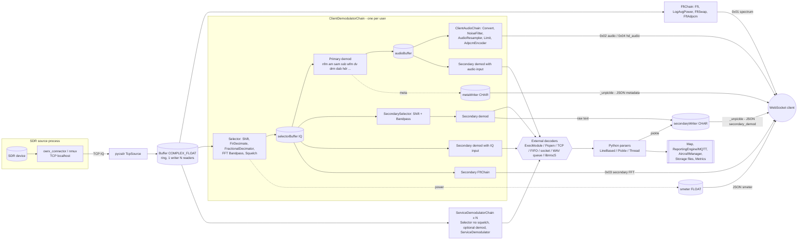

#### 4.3.7 Mode → implementation → IPC → parser → output

Legend for the Output column: **P** = client panel, **M** = map, **R** = ReportingEngine (PSKReporter/WSPRnet/APRS-IS/AIS/SondeHub/MQTT), **F** = Storage files (service mode), **A** = audio.

| Mode | Implementation (chain) | Backend | IPC | Parser | Output |
|---|---|---|---|---|---|
| nfm/am/sam/usb/lsb/cw | analog.py NFm/Am/SAm/Ssb | pycsdr | in-process | – | A |
| wfm (+RDS) | analog.WFm + toolbox.RdsDemodulator | pycsdr + redsea | ExecModule stdin/stdout | RdsParser (JSON lines) | A (HD), P meta-wfm |
| usbd | analog.SsbDigital | pycsdr | in-process | – | A (HD) |
| dmr/dstar/ysf/nxdn/p25 | digiham.DigihamChain subclasses | digiham + codecserver | in-process + codecserver socket | MetaParser + enrichers (radioid HTTP, DPRS → AprsParser) | A, P meta-*, M (DMR/YSF/P25/DPRS) |
| m17 | m17.M17 | m17-demod | Popen stdin/stdout + stderr regex | M17Module.parseOutput | A, P meta-m17 |
| freedv / radel / radeu | freedv.FreeDV / RADE | freedv_rx / webrx_rade_decode | ExecModule | – | A |
| tetra | tetra.Tetra | tetrarx | Popen stdin/stdout + FIFO JSON | TetraParser | A, P meta-tetra |
| drm | drm.Drm | dream | ExecModule + unix socket JSON | inline `_onDrmStatus` | A, P meta-drm |
| dab | dablin.Dablin | csdreti (native) + dablin | in-process + ExecModule | MetaProcessor (pickle) | A (HD), P meta-dab |
| hdr | hdradio.HdRadio | libnrsc5 | ctypes callbacks | HdRadioModule.callback | A (HD), P meta-hdr, M (station) |
| bpsk31/63 | digimodes.PskDemodulator | pycsdr | in-process | – (raw text) | P digimodes |
| rtty170/450/85 | digimodes.RttyDemodulator | pycsdr | in-process | – | P digimodes |
| sitorb | digimodes.SitorBDemodulator | pycsdr | in-process | – | P digimodes |
| navtex | digimodes.NavtexDemodulator | pycsdr | in-process | NavtexParser (TextParser) | P digimodes, F |
| dsc | digimodes.DscDemodulator | pycsdr | in-process | DscParser (JSON) | P dsc, R, F |
| cwdecoder | digimodes.CwDemodulator | pycsdr | in-process | – | P digimodes |
| ft8/ft4/jt65/jt9/fst4/q65 | digimodes.AudioChopperDemodulator | jt9 | tmp WAV + DecoderQueue, stdout | WsjtParser (Jt9Decoder, QsoMessageParser) | P wsjt, M (locator, calls), R (PSKReporter, MQTT) |
| wspr/fst4w | same | wsprd / jt9 | same | WsjtParser (WsprDecoder / BeaconMessageParser) | P wsjt, M, R (WSPRnet, PSKReporter) |
| msk144 | digimodes.Msk144Demodulator | msk144decoder | ExecModule stdin/stdout | ParserAdapter → WsjtParser | P wsjt, M, R |
| js8 | AudioChopperDemodulator | js8 | tmp WAV + DecoderQueue | Js8Parser (js8py) | P js8 threads, M, R |
| packet | digimodes.PacketDemodulator | direwolf | Popen stdin + KISS over TCP | KissDeframer → Ax25Parser → AprsParser | P packet, M, R (APRS-IS, MQTT), iGate via direwolf |
| ais | same (`-B AIS -A`) | direwolf | same | same (`source=AIS`) | P packet, M, R (AIS reporter, MQTT) |
| page | toolbox.PageDemodulator | multimon-ng | ExecModule | PageParser | P page, R, F |
| selcall / zvei | toolbox.SelCall/ZveiDemodulator | multimon-ng | ExecModule | SelCallParser (text) | P digimodes, F |
| eas | toolbox.EasDemodulator | multimon-ng + dsame3 | ExecModule | EasParser | P digimodes, R, F |
| sstv | digimodes.SstvDemodulator | pycsdr SstvDecoder | in-process | SstvParser | P sstv (canvas), F (BMP→PNG) |
| fax | digimodes.FaxDemodulator | pycsdr FaxDecoder | in-process | FaxParser | P fax (canvas), F (BMP→PNG) |
| ism / wmbus | toolbox.IsmDemodulator | rtl_433 | ExecModule | IsmParser (JSON) | P ism, R, F |
| cwskimmer / rttyskimmer | toolbox.*SkimmerDemodulator | csdr-cwskimmer / csdr-rttyskimmer | ExecModule | CwSkimmerParser / RttySkimmerParser | P skimmer, R (PSKReporter), F |
| hfdl | aircraft.HfdlDemodulator | dumphfdl | ExecModule | HfdlParser → AircraftManager | P hfdl, M, R (MQTT), F |
| vdl2 | aircraft.Vdl2Demodulator | dumpvdl2 | ExecModule | Vdl2Parser | P hfdl, M, R, F |
| acars | aircraft.AcarsDemodulator | acarsdec | ExecModule | AcarsParser | P hfdl, M, R, F |
| adsb | aircraft.AdsbDemodulator | dump1090 | ExecModule (stdin) + JSON file polling | AdsbParser.parseJson | P adsb (ADSB-LIST), M, R |
| uat | aircraft.UatDemodulator | dump978 | ExecModule | UatParser | P hfdl, M, R |
| sonde-* | sonde.*Demodulator | rs41mod / dfm09mod / m10mod / m20mod / mts01mod | ExecModule | SondeParser | P packet, M, R (SondeHub, MQTT), F |
| lora-wan / fanet / meshcore / meshcom | lora.*Demodulator | lorarx | Popen stdin/stdout | LoraParser | P digimodes (text only), R, F |
| lora-aprs | lora.LoraAprsDemodulator | lorarx | Popen | LoraParser → AprsParser | P packet, M, R |
| meshtastic | lora.MeshtasticDemodulator | lorarx + pycryptodome + meshtastic protobuf | Popen | MeshtasticParser | P meshtastic, M, R, node cache file |
| speech | toolbox.AudioTranscriber | whisper.cpp HTTP | HTTP POST | WhisperTranscriber (text) | P digimodes, R, F |
| audio (service) | toolbox.AudioRecorder | lame | ExecModule | Mp3Recorder | F (MP3) |
| meteor-lrpt / elektro-lrit (service) | satellite.*Demodulator | satdump | ExecModule (doNotKill) | none (stdout discarded) | `<tmp>/satdump/<SAT>-<ts>/` CADU files |
| pocsag (hidden) | digiham.PocsagDemodulator | digiham | in-process | PocsagParser | P pocsag |

### 4.4 Frontend architecture

- **No build tool.** Plain ES5/ES2015 scripts with globals. "Bundles" are concatenated at request time by `CompiledAssetsController` (`owrx/controllers/assets.py:118-228`): files are joined with `\n` and served gzip'ed when accepted, with `Last-Modified` = max mtime and `max-age=3600`. There is no minification, transpiling, hashing or SRI. Profiles:
  - `compiled/receiver.js`: chroma.min, **openwebrx.js**, jquery-3.7.1, jquery.nanoscroller, lame.min, Header, Demodulator, DemodulatorPanel, BookmarkLocalStorage, BookmarkBar, BookmarkDialog, AudioEngine, ProgressBar, Measurement, FrequencyDisplay, MessagePanel, Js8Threads, Modes, MetaPanel, Waterfall, Shortcuts, Bandplan, Spectrum, Scanner, Plugins, Lookup, Utils, Clock, Chat, UI (`assets.py:120-151`). Note: openwebrx.js comes **before** jQuery, which works only because it defines functions that are called later.
  - `compiled/map-google.js` / `compiled/map-leaflet.js`: jquery, chroma, Header, MapCalls, MapLocators, MapMarkers, MapManager, Plugins, Lookup, Utils, Clock, then map-google.js / map-leaflet.js (`assets.py:152-179`). The engine-specific `lib/GoogleMaps.js`, `lib/Leaflet.js` and `lib/nite-overlay.js` are fetched later via `$.getScript`.
  - `compiled/settings.js`: jquery, bootstrap.bundle, location-picker, Header, settings/* helpers, BookmarkLocalStorage, settings.js (`assets.py:180-199`). Also used by `/clients` and `/services`.
  - Not bundled: `static/lib/AudioProcessor.js` (AudioWorklet module, `lib/AudioEngine.js:104`), `static/plugins.js` (plugin loader, `<script>` after the bundle), `files.js`/`features.js` (plain `<script>`), `lib/AprsMarker.js` (**dead file**, referenced nowhere).
- **Server-side templating**: `string.Template.safe_substitute` with `${header}`, `${document_root}`, receiver details, `${rows}`/`${clients}`/`${services}`. Substitution is not HTML-escaped (`owrx/controllers/template.py:9-35`). `document_root` = `../` × path depth, so pages work under a reverse-proxy sub-path, but several JS URLs are absolute (`/ban`, `/unban`, `/broadcast`, `/#freq=`, `/map` in MapPlugin) and break there.
- **Global objects / singletons** (all on `window`): `UI`, `LS`, `Utils`, `Lookup`, `Waterfall`, `Shortcuts`, `Chat`, `Modes`, `Mode`, `Plugins` (+ `MapPlugin`, `SunPlugin`, `KeyPlugin`, `RigPlugin`), `ws`, `audioEngine`, `bookmarks` (BookmarkBar), `scanner`, `bandplan`, `spectrum`, `clock`, `currentprofile`, `center_freq`, `bandwidth`, `fft_size`, `zoom_*`, `canvas_*`, `secondary_demod_*`, `tuning_step`, `wf_data`. Map pages: `mapManager`, `map`, `receiverMarker`, `infoWindow`, `retention_time`, `call_retention_time`, `max_calls`, `mapSources`, `mapExtraLayers`. Plugins depend on these names (`utils.wrap_func('sdr_profile_changed')`, `'on_ws_recv'`, `bookmarks.replace_bookmarks`), so they are a de-facto public API.
- **jQuery widgets** via `$.fn.*` with `.data()` caching: `demodulatorPanel`, `frequencyDisplay`, `tuneableFrequencyDisplay`, `progressbar` (type from `data-type`), `metaPanel`, `<id>MessagePanel`, `js8`, `bookmarkDialog`, `header`, `fileTile`, `clientList`, `bookmarktable`, `mapInput`, `imageUpload`, `optionalSection`, `schedulerInput`, `gainInput`, `exponentialInput`, `waterfallDropdown`, `wsjtDecodingDepthsInput`, `logMessages`, `profiles`.
- **Event wiring**: inline `onclick`/`onchange`/`onload` attributes in `index.html` (e.g. `openwebrx_init()`, `UI.toggleMute()`, `sdr_profile_changed()`, `Waterfall.setAutoRange()`). jQuery delegated handlers (`el.on('click', '.openwebrx-demodulator-button', …)`). Raw `addEventListener` on canvases (mouse/touch/wheel). `window.hashchange` → `DemodulatorPanel.onHashChange`. `window.resize` → `openwebrx_resize`. A single `document.body` keydown handler for shortcuts. Tiny event emitter on `Demodulator` (`frequencychange`, `squelchchange`). Panels toggle through `data-toggle-panel` attributes in the header.
- **WS dispatch**: one `on_ws_recv` switch on text `json.type` (config, secondary_config, receiver_details, smeter, cpuusage, temperature, battery, clients, bands, profiles, features, metadata, dial_frequencies, bookmarks, sdr_error, demodulator_error, secondary_demod, log_message, chat_message, backoff, modes) and binary byte 0 (1 FFT, 2 audio, 3 secondary FFT, 4 HD audio) (`openwebrx.js:867-1195`). Client→server: `connectionproperties`, `dspcontrol` (start / params diff), `selectprofile`, `setfrequency`, `sendmessage`, `txcontrol`. `setsdr` exists server-side but no frontend sends it.
- **Rendering**: Canvas 2D for waterfall (stacked 200-line canvases translated by CSS transform, recycled), scale/envelope, spectrum, bandplan and secondary waterfall. Panels animate via CSS 3D transforms. nanoScroller for log/console scroll.
- **Audio**: AudioContext (48 k/44.1 k/96 k preferred). AudioWorklet (`openwebrx-audio-processor`) with a ScriptProcessorNode fallback. Client-side ADPCM decode with "SYNC" resync. Integer-factor interpolation with a 81-tap Hamming FIR. Output rate is chosen so that sampleRate/n ∈ [8,12] kHz (normal) or [36,48] kHz (HD) and reported to the server (`lib/AudioEngine.js:236-274`).
- **Third-party runtime loads** (CDN, unpinned or no SRI): Leaflet 1.9.4 (unpkg), `leaflet.geodesic` (jsDelivr, **no version**), leaflet-textpath 1.2.3 (jsDelivr), leaflet.terminator 1.1.0 (unpkg), L.Maidenhead (ha8tks.github.io, **no version**), moment 2.31.0 (cdnjs, map pages), showdown 1.9.0 (cdnjs, features page), Google Maps JS API, hamqsl.com image (SunPlugin), remote plugins from `0xaf.github.io` (sample init). Bundled vendored: jQuery 3.7.1, chroma.js, lamejs, jquery.nanoscroller, bootstrap bundle, location-picker.

---

The complete UI feature list, keyboard shortcuts and localStorage keys are in FEATURE_AUDIT §5.1 and §5.23.

---

## 5. Protocol specification

This is a complete description of the HTTP and WebSocket interfaces, as needed to build a compatible client or server. Protocol warnings are in §8.2.3 (P-xx).

### 5.0 Transport overview

| Aspect | Value | Ref |
|---|---|---|
| Server | Python stdlib `http.server.HTTPServer` + `socketserver.ThreadingMixIn` (one OS thread per TCP connection) | `owrx/__main__.py:35-41` |
| Bind | `[web] port` (default **8073**), `[web] ipv6=true` → binds `::` dual-stack (IPv4 clients appear as `::ffff:a.b.c.d`), optional `[web] bind_address` | `owrx/config/core.py:19-20,69-71`, `owrx/__main__.py:36-41,170` |
| TLS | Enabled only if **both** `/etc/openwebrx/key.pem` and `/etc/openwebrx/cert.pem` exist (hard-coded paths); then the listening socket is wrapped, same port, no HTTP→HTTPS redirect | `owrx/__main__.py:171-183` |
| HTTP version | `BaseHTTPRequestHandler` default `protocol_version="HTTP/1.0"` → one request per connection, no keep-alive; responses carry **no `Content-Length`** (body ends at socket close) | `owrx/http.py:219`, `owrx/controllers/__init__.py:15-41` |
| Socket timeout | `RequestHandler.timeout = 30` s (switched to non-blocking for WebSockets) | `owrx/http.py:220`, `owrx/websocket.py:63` |
| Methods | `GET`, `POST`, `DELETE` only (`do_GET/do_POST/do_DELETE`); anything else → stdlib `501 Unsupported method` | `owrx/http.py:226-233` |
| Path normalisation | `posixpath.normpath(path)` (collapses `..`, `//`), trailing `/` preserved; query string parsed with `parse_qs` (lists) | `owrx/http.py:204-209,46-50` |
| Unknown route | `handler.send_error(404, "Not Found", "The page you requested could not be found.")` (stdlib HTML error page) | `owrx/http.py:215-216` |
| Unhandled controller exception | Propagates to `socketserver` → traceback logged, connection closed **without any HTTP response** | `owrx/http.py:214` (no try) |
| "Local" flag | `request.local = ipaddress.ip_address(client_ip).is_private` (exception → False) | `owrx/http.py:235-240` |
| Client IP for bans/limits | `client_address[0]`, replaced by first `X-Forwarded-For` element when the peer is private **or** listed in `[web] trusted_proxies` | `owrx/client.py:165-174`, `owrx/config/core.py:72-78` |
| Versioning | None. Only the WS handshake reply carries `version=v1.2.126` (`openwebrx_version = "v" + LooseVersion("1.2.126")`) | `owrx/version.py:1-5`, `owrx/connection.py:654` |

#### Common response helpers
- `Controller.send_response(content, code=200, content_type="text/html", last_modified=None, max_age=None, headers=None)`: adds `; charset=utf-8` to `text/*`, `Last-Modified` (RFC 1123, UTC), `Cache-Control: max-age=N`, and one `Set-Cookie` if cookies were set (`owrx/controllers/__init__.py:15-41`).
- `send_redirect(location, code=303)` — **303 See Other** always, relative `Location` values are common (`owrx/controllers/__init__.py:43-48`).
- `get_body(max_size)` reads exactly `Content-Length` bytes; returns `None` when header absent (callers then crash on `.decode`) (`owrx/controllers/__init__.py:53-59`).
- `GzipMixin`: gzip only if `Accept-Encoding` contains `gzip` and type ∈ {`application/json`, `application/javascript`, `text/javascript`, `text/css`, `text/html`, `image/svg+xml`}; compares the *bare* content type, so for `text/*` it matches before `; charset` is appended (`owrx/controllers/assets.py:15-33`).
- `ModificationAwareController.wasModified`: honours `If-Modified-Since` (format `%a, %d %b %Y %H:%M:%S %Z`) → `304` with empty body (`owrx/controllers/assets.py:36-54`).
- `WebpageController.get_document_root()` = `"../" * (number_of_path_segments - 1)`; all templates use relative URLs so the app can live under a reverse-proxy sub-path (`owrx/controllers/template.py:22-26`). Templates are `string.Template.safe_substitute` (`$var`/`${var}`), no HTML escaping (`owrx/controllers/template.py:9-13`).

### 5.1 Authentication & session model

| Item | Behaviour | Ref |
|---|---|---|
| Users | `users.json` in data dir; any enabled user = full admin (no roles) | `owrx/users.py` |
| Session store | In-memory dict `{uuid4: (expires_utc, {"user": name})}`; lifetime **6 h, sliding** (each authenticated request calls `prolongSession`); expired entries deleted lazily on lookup; lost on restart | `owrx/controllers/session.py:14-52`, `owrx/controllers/admin.py:12-29` |
| Cookie | `Set-Cookie: owrx-session=<uuid4>` — no `Path`, `Domain`, `Max-Age`, `Expires`, `HttpOnly`, `Secure`, `SameSite` (browser default path = directory of `/login`) | `owrx/controllers/session.py:75-84` |
| Auth check (`AuthorizationMixin`) | `user is not None and user.is_enabled() and not user.must_change_password` | `owrx/controllers/admin.py:32-39` |
| Auth failure | Clears cookie (`owrx-session=""; expires=Thu, 01 Jan 1970 00:00:00 GMT`) then: if header `X-Requested-With: XMLHttpRequest` → **403**, body `{}` with `Content-Type: text/html`; else **303** → `{document_root}login?ref=<path without leading '/'>` | `owrx/controllers/admin.py:41-56` |
| "inline" auth | `FilesController` computes auth itself (no redirect): listing visible to all, delete button & delete action only for admins | `owrx/controllers/file.py:19-28,51-55,89-99` |
| "local" gate | `allow_remote_config=False` (default **True**, `owrx/config/defaults.py:362`) makes `GET/POST /login` and `GET /logout` return **403 `access forbidden`** for non-private peers. It does **not** gate any other admin route: an existing session cookie keeps working from anywhere. | `owrx/controllers/session.py:56-94` |
| Magic key | Not HTTP auth: a shared string (`magic_key`, default `"memagic"`) sent inside WS `selectprofile`/`setfrequency` messages; empty string disables checks | `owrx/connection.py:345-355,386-396`, `owrx/config/defaults.py:359` |
| ReceiverId | HMAC challenge/response on `/status.json` only, see §5.2.3 | `owrx/receiverid.py`, `owrx/controllers/receiverid.py` |

Auth legend for the route table: **none** = public; **session** = `AuthorizationMixin`; **session(mcp)** = session whose user *must* change password (`ProfileController.isAuthorized` inverted); **inline** = route public, privileged action checked in handler; **local** = `allow_remote_config` gate.

### 5.2 HTTP route table

Order matters: first match wins (`owrx/http.py:199-202`). Regex routes use `re.match` against the normalised path.

| # | Method | Path (static or regex) | Controller.action | Auth | Params / body | Response | Side effects / notes | Ref |
|---|---|---|---|---|---|---|---|---|
| 1 | GET | `/` | `IndexController.indexAction` | none | — | `text/html` `index.html` with `$header` (rendered `include/header.include.html`), `$document_root` | Header vars = `ReceiverDetails` (receiver_name, receiver_help, receiver_location, receiver_asl, receiver_gps, photo_title, photo_desc, usage_policy_url, session_timeout, keep_files, locator) + `map_type=""`. If `session_timeout>0` the header injects `<meta http-equiv=refresh content="N; url=usage_policy_url">` (client-only enforcement) | `owrx/http.py:98`, `owrx/controllers/template.py:28-40`, `owrx/details.py:9-33`, `htdocs/include/header.include.html:24-25` |
| 2 | GET | `/robots.txt` | `RobotsController` | none | — | `text/plain`: `User-agent: *` + `Disallow:` /login /logout /pwchange /settings /imageupload | — | `owrx/controllers/robots.py:4-15` |
| 3 | GET | `/status.json` | `StatusController` (extends `ReceiverIdController`) | none | optional `Authorization: ReceiverId …` | `application/json`, see §5.2.2; adds `Authorization` response header when challenge answered | Invalid `Authorization` format raises `KeyException` (uncaught → no response) | `owrx/http.py:100`, `owrx/controllers/status.py:13-44`, `owrx/controllers/receiverid.py:23-26` |
| 4 | GET | `^/static/(.+)$` | `OwrxAssetsController.indexAction` | none | `?mapped=false` disables override | File from package `htdocs/` (mimetypes guess), `Last-Modified`, `Cache-Control: max-age=3600`, gzip, 304; 404 `file not found` | `gfx/openwebrx-avatar.png` → `<data_dir>/receiver_avatar.{png,jpg,webp}`, `gfx/openwebrx-top-photo.jpg` → `<data_dir>/receiver_top_photo.*` if present (content-type guessed from *real* file) | `owrx/controllers/assets.py:57-103` |
| 5 | GET | `^/compiled/(.+)$` | `CompiledAssetsController` | none | name ∈ {`receiver.js`,`map-google.js`,`map-leaflet.js`,`settings.js`} | Concatenation of listed files joined by `"\n"`, type from `mimetypes.guess_type(name)`, `Last-Modified` = max mtime, 304, gzip; else 404 `profile not found` | Bundle composition in §5.2.1 | `owrx/controllers/assets.py:118-228` |
| 6 | GET | `^/aprs-symbols/(.+)$` | `AprsSymbolsController` | none | — | PNG from `[aprs] symbols_path` (default `/usr/share/aprs-symbols/png`) | — | `owrx/controllers/assets.py:106-115` |
| 7 | GET | `/ws/` | `WebSocketController` | none | Upgrade headers | `101` then WS protocol (§5.3) | Thread blocks in read loop for the connection lifetime | `owrx/http.py:104`, `owrx/controllers/websocket.py:6-10` |
| 8 | GET | `^(/favicon.ico)$` | `OwrxAssetsController` | none | — | Intended `htdocs/favicon.ico`; group(1) keeps the leading `/` so `files("htdocs").joinpath("/favicon.ico")` resolves to filesystem root → probably 404 **(unverified)**; templates use `static/favicon.ico` | — | `owrx/http.py:105` |
| 9 | GET | `/map` | `MapController` | none | `?type=google\|leaflet` (else config `map_type`) | `map-google.html` or `map-leaflet.html`; header `map_type` var = inverse link | Map page then uses WS `type=map` | `owrx/controllers/template.py:43-66` |
| 10 | GET | `/features` | `FeatureController` | none | — | `features.html` (JS fetches `api/features`, renders descriptions with showdown from CDN) | Public disclosure of installed software | `owrx/controllers/feature.py:6-11`, `htdocs/features.js:10` |
| 11 | GET | `/api/features` | `ApiController` | none | — | JSON `{feature: {"available": bool, "requirements": {req: {"available": bool, "enabled": bool(=available), "description": str\|null}}}}` | Triggers requirement probes (spawns binaries, 2 h cache) | `owrx/controllers/api.py:6-9`, `owrx/feature.py:125-141,182-183` |
| 12 | GET | `/metrics` | `MetricsController.prometheusAction` | none | — | `text/plain; version=0.0.4` (+`; charset=utf-8`): first line `# https://prometheus.io/docs/instrumenting/exposition_formats/`, then `name value` lines; name = dotted key with `[^a-zA-Z0-9:_]`→`_`; counters get `_total` suffix and value `count`. No `# TYPE`/`# HELP` | Unknown metric type → `ValueError` → no response | `owrx/controllers/metrics.py:13-32` |
| 13 | GET | `/metrics.json` | `MetricsController.indexAction` | none | — | JSON tree split on `.`; counters → `{"count": n}`, direct → raw value | — | `owrx/metrics.py:56-68` |
| 14 | GET | `/settings` | `SettingsController` | session | — | `settings.html` incl. server-rendered client table + services table | — | `owrx/controllers/settings/__init__.py:16-24` |
| 15 | GET | `/settings/general` | `GeneralSettingsController` | session | — | Bootstrap form (`settings/general.html`) | — | `owrx/controllers/settings/general.py` |
| 16 | POST | `/settings/general` | `…processFormData` | session | `application/x-www-form-urlencoded`; keys = config keys; checkboxes posted as hidden `0` + `1`; `admin_pass_0/1/2` | 303 → same page on success; re-rendered form (200) with field errors or global error box | Partial update (absent keys untouched); images `receiver_avatar`/`receiver_top_photo` = temp file name from `/imageupload` or `restore`; password change requires current pwd; `Config.store()` writes `settings.json` | `owrx/controllers/settings/__init__.py:89-146`, `owrx/controllers/settings/general.py:408-463`, `owrx/form/input/__init__.py:195-222` |
| 17 | GET | `/settings/sdr` | `SdrDeviceListController` | session | — | Device list with state/profile/client counts | — | `owrx/controllers/settings/sdr.py:28-109` |
| 18 | GET | `/settings/newsdr` | `NewSdrDeviceController` | session | — | form `name`, `type` | — | `sdr.py:301-344` |
| 19 | POST | `/settings/newsdr` | `…processFormData` | session | form `name`, `type` | 303 → `settings/sdr/<uuid4>` | Creates device with new uuid4 id | `sdr.py:301-344` |
| 20 | GET | `^/settings/sdr/([^/]+)$` | `SdrDeviceController` | session | id (URL-unquoted) | Device form + recent device log; 404 `device not found` | — | `sdr.py:231-298` |
| 21 | POST | `^/settings/sdr/([^/]+)$` | `…processFormData` | session | form (device section of `SdrDeviceDescription`) | 303 → same | Writes back whole `sdrs` key | `sdr.py:173-179,262-266` |
| 22 | GET | `^/settings/deletesdr/([^/]+)$` | `SdrDeviceController.deleteDevice` | session | — | 303 → `settings/sdr` | **State change via GET** (CSRF-able) | `owrx/http.py:125`, `sdr.py:274-283` |
| 23 | GET | `^/settings/sdr/([^/]+)/newprofile$` | `NewProfileController` | session | — | empty profile form | — | `sdr.py:462-500` |
| 24 | GET | `^/settings/sdr/([^/]+)/newprofile/([^/]+)$` | `NewProfileController` | session | source profile id | form pre-filled (clone) | — | `sdr.py:463-471` |
| 25 | POST | `^/settings/sdr/([^/]+)/newprofile(/[^/]+)?$` | `…processFormData` | session | form | 303 → `settings/sdr/<dev>/profile/<uuid4>` | On POST group(2) includes leading `/`, so clone lookup silently fails (form data still carries values) | `owrx/http.py:128-133`, `sdr.py:467-471,493-496` |
| 26 | GET | `^/settings/sdr/([^/]+)/profile/([^/]+)$` | `SdrProfileController` | session | — | profile form | Unknown device/profile → `_get_profile` returns `None` → tuple-unpack `TypeError` → no response (the 404 branches are unreachable) | `sdr.py:351-392` |
| 27 | POST | same | `…processFormData` | session | form | 303 → same | — | `sdr.py:394-398` |
| 28 | GET | `^/settings/sdr/([^/]+)/deleteprofile/([^/]+)$` | `SdrProfileController.deleteProfile` | session | — | 303 → device page | GET state change | `sdr.py:423-430` |
| 29 | GET | `^/settings/sdr/([^/]+)/moveprofileup/([^/]+)$` | `…moveProfileUp` | session | — | 303 → profile page | GET state change; reorders dict | `sdr.py:432-459` |
| 30 | GET | `^/settings/sdr/([^/]+)/moveprofiledown/([^/]+)$` | `…moveProfileDown` | session | — | idem | idem | idem |
| 31 | GET | `/settings/bookmarks` | `BookmarksController` | session | — | table; `<table data-modes='{modulation:{name,analog,underlying}}'>`; row `data-id` = Python `id(bookmark)` | — | `owrx/controllers/settings/bookmarks.py:19-104` |
| 32 | POST | `/settings/bookmarks` | `…new` | session | JSON **array** of `{name, frequency, modulation, underlying?, description?, scannable?}` | 200 `[{"bookmark_id": int}, …]`; 400 `{}` on JSON/validation error | Non-atomic: earlier items stay in memory if a later one fails (store not called) | `bookmarks.py:181-204` |
| 33 | POST | `^/settings/bookmarks/(.+)$` | `…update` | session | JSON object with any subset of the 6 fields | 200 `{}`; 404 `{}`; 400 `{}` | id must be `int()`-able else `ValueError` before try → no response | `bookmarks.py:152-179` |
| 34 | DELETE | `^/settings/bookmarks/(.+)$` | `…delete` | session | (body ignored; JS sends `{}`) | 200/404 `{}` | — | `bookmarks.py:206-215` |
| 35-36 | GET/POST | `/settings/reporting` | `ReportingController` | session | form | as #15/16 | — | `owrx/controllers/settings/reporting.py` |
| 37-38 | GET/POST | `/settings/backgrounddecoding` | `BackgroundDecodingController` | session | `services_enabled`, `services_decoders` | as #15/16 | — | `owrx/controllers/settings/backgrounddecoding.py:11-25` |
| 39-40 | GET/POST | `/settings/decoding` | `DecodingSettingsController` | session | form | as #15/16 | — | `owrx/controllers/settings/decoding.py` |
| 41-42 | GET/POST | `/settings/wifi` | `WifiSettingsController` | session | `wifi_enable_ap`, `wifi_name_ap`, `wifi_pass_ap`, `wifi_{enable,name,pass}_{1..4}` | as #15/16 | POST stores **twice** (`processData` stores, then `processFormData` stores) and calls `WiFi.applyNewSettings()` (system network changes) | `owrx/controllers/settings/wifi.py:14-60` |
| 43 | GET | `/login` | `SessionController.loginAction` | local | `?ref=` | `login.html` (form POSTs to same URL incl. query) / 403 | — | `owrx/controllers/session.py:56-60` |
| 44 | POST | `/login` | `…processLoginAction` | local | form `user`, `password`; query `ref` | success: `Set-Cookie owrx-session` + 303 → `ref` if it starts with `/` else `/settings`; `must_change_password` → `/pwchange?ref=<target>` (unvalidated). Failure: 303 → `login?ref=<ref>` | Failure path does `self.request.query["ref"][0]` → **KeyError if no `ref`** → no response. `ref` produced by #auth-redirect has no leading `/`, so it is always discarded → user lands on `/settings` | `session.py:62-88` |
| 45 | GET | `/logout` | `…logoutAction` | local | — | 303 `Location: logout happening here` (literal relative URL → 404 on follow) | **Session neither destroyed nor cookie cleared** | `session.py:90-94` |
| 46 | GET | `/pwchange` | `ProfileController` | session(mcp) | — | `pwchange.html` | Non-mcp users are redirected to login | `owrx/controllers/profile.py:7-12` |
| 47 | POST | `/pwchange` | `…processPwChange` | session(mcp) | form `password`, `confirm`; query `ref` | 303 → `ref` (unvalidated: open redirect) or `/settings`; mismatch → `/pwchange` | No old password, no policy | `profile.py:14-24` |
| 48 | GET | `/imageupload` | `ImageUploadController.indexAction` | session | `?file=<name>` | Serves `<temp_dir>/<file>` (no sanitisation of `file`; admin-only traversal) | — | `owrx/controllers/imageupload.py:18-31` |
| 49 | POST | `/imageupload` | `…processImage` | session | `?id=receiver_avatar\|receiver_top_photo`; raw body (`application/octet-stream`), max 250 KiB / 2 MiB | 200 `{"file": "<id>-<uuid4hex>.<png\|jpg\|webp>"}`; 400 `{"error": "missing id"\|"unexpected image id"\|"file size too large"\|"unsupported file type"}` | Magic-byte sniff PNG/JPEG/WEBP; writes temp file, committed on settings save | `imageupload.py:42-79`, `owrx/form/input/gfx.py:53-67` |
| 50 | GET | `/files` | `FilesController.indexAction` | inline | — | Gallery HTML (3 per row) of files in temp dir matching `Storage.filePattern` | Public | `owrx/controllers/file.py:30-87` |
| 51 | GET | `^/files/([A-Z0-9]+-[0-9]+-[0-9]+(-[0-9]+)?(-[0-9]+)?\.(bmp\|png\|txt\|mp3))$` | `FileController` | none | — | file bytes (AssetsController semantics) | Note pattern excludes `.wav`/`.jpg` although the listing regexes include them | `owrx/http.py:189`, `owrx/storage.py:17`, `file.py:14-16` |
| 52 | POST | `/files/delete` | `FilesController.delete` | inline | JSON `{"name": str}` | always 200 `{}` (400 on parse error) even if unauthorised | `deleteFile` uses unanchored-at-end `re.match` | `file.py:89-99`, `owrx/storage.py:48-56` |
| 53 | GET | `/policy` | `PolicyController` | none | — | `policy.html` | — | `template.py:69-71` |
| 54 | GET | `/clients` | `ClientController.indexAction` | session | — | client table: IP (link `geoip_url`), chat name, SDR+profile or `banned`, since/until, ban/unban button | — | `owrx/controllers/clients.py:14-81` |
| 55 | GET | `/services` | `ServiceController` | session | — | background services table + boot/start/EIBI/repeaters/receivers download times | — | `owrx/controllers/services.py:20-121` |
| 56 | POST | `/ban` | `ClientController.ban` | session | JSON `{"ip": str, "mins": int\|str}` | 200 `{}` / 400 `{}` | Bans IP (in-memory), closes its connections | `clients.py:83-93`, `owrx/client.py:209-220` |
| 57 | POST | `/unban` | `…unban` | session | JSON `{"ip": str}` | 200/400 `{}` | — | `clients.py:95-104` |
| 58 | POST | `/broadcast` | `…broadcast` | session | JSON `{"text": str}` | 200/400 `{}` | Sends WS `log_message` to every receiver client (rendered as raw HTML) | `clients.py:106-116`, `owrx/client.py:160-162` |

Absolute URLs used by the stock admin JS: `/ban`, `/unban`, `/broadcast` (`htdocs/lib/settings/ClientList.js:5,16,30`) — break when served under a sub-path; all others are relative. jQuery sets `X-Requested-With: XMLHttpRequest`, so expired sessions yield 403 instead of redirects on those calls.

#### 5.2.1 Compiled bundles (`/compiled/*`)
Exact order (`owrx/controllers/assets.py:119-200`):

- **receiver.js**: `lib/chroma.min.js`, `openwebrx.js`, `lib/jquery-3.7.1.min.js`, `lib/jquery.nanoscroller.min.js`, `lib/lame.min.js`, `lib/Header.js`, `lib/Demodulator.js`, `lib/DemodulatorPanel.js`, `lib/BookmarkLocalStorage.js`, `lib/BookmarkBar.js`, `lib/BookmarkDialog.js`, `lib/AudioEngine.js`, `lib/ProgressBar.js`, `lib/Measurement.js`, `lib/FrequencyDisplay.js`, `lib/MessagePanel.js`, `lib/Js8Threads.js`, `lib/Modes.js`, `lib/MetaPanel.js`, `lib/Waterfall.js`, `lib/Shortcuts.js`, `lib/Bandplan.js`, `lib/Spectrum.js`, `lib/Scanner.js`, `lib/Plugins.js`, `lib/Lookup.js`, `lib/Utils.js`, `lib/Clock.js`, `lib/Chat.js`, `lib/UI.js`.
- **map-google.js** / **map-leaflet.js**: `lib/jquery-3.7.1.min.js`, `lib/chroma.min.js`, `lib/Header.js`, `lib/MapCalls.js`, `lib/MapLocators.js`, `lib/MapMarkers.js`, `lib/MapManager.js`, `lib/Plugins.js`, `lib/Lookup.js`, `lib/Utils.js`, `lib/Clock.js`, then `map-google.js` resp. `map-leaflet.js`.
- **settings.js**: `lib/jquery-3.7.1.min.js`, `lib/bootstrap.bundle.min.js`, `lib/location-picker.min.js`, `lib/Header.js`, `lib/settings/MapInput.js`, `lib/settings/ImageUpload.js`, `lib/BookmarkLocalStorage.js`, `lib/settings/BookmarkTable.js`, `lib/settings/WsjtDecodingDepthsInput.js`, `lib/settings/WaterfallDropdown.js`, `lib/settings/GainInput.js`, `lib/settings/OptionalSection.js`, `lib/settings/SchedulerInput.js`, `lib/settings/ExponentialInput.js`, `lib/settings/LogMessages.js`, `lib/settings/ClientList.js`, `lib/settings/Profiles.js`, `settings.js`.

Loaded dynamically at runtime (not bundled): `static/lib/AudioProcessor.js` (AudioWorklet module, `htdocs/lib/AudioEngine.js:104`), `static/lib/Leaflet.js` (`htdocs/map-leaflet.js:302`), `static/lib/GoogleMaps.js` + `static/lib/nite-overlay.js` (`htdocs/map-google.js:113-119`), `static/plugins.js` (`htdocs/index.html:43`). Third-party CDN loads without SRI: Leaflet 1.9.4 + `leaflet.geodesic` (unversioned) + leaflet-textpath 1.2.3 + leaflet.terminator 1.1.0 (`htdocs/map-leaflet.js:256-270`), Google Maps `maps.googleapis.com/maps/api/js?key=<key>` (`htdocs/map-google.js:94`), moment.js 2.31.0 (map pages), showdown 1.9.0 (features page).

`mimetypes.guess_type("receiver.js")` returns `text/javascript` on Python ≥ 3.12 and `application/javascript` before (both gzip-able) **(unverified per distro)**.

#### 5.2.2 `/status.json` (exact fields)
```json
{
  "receiver": {
    "name":     "<receiver_name>",
    "admin":    "<receiver_admin>",          // admin e-mail, public
    "gps":      {"lat": 47.0, "lon": 19.0},  // receiver_gps PropertyLayer → dict via owrx.jsons.Encoder
    "asl":      <receiver_asl>,
    "location": "<receiver_location>"
  },
  "max_clients": <int>,
  "version": "v1.2.126",
  "sdrs": [
    {"name": "<sdr name>", "type": "<Python class name, e.g. RtlSdrSource>",
     "profiles": [{"name": "...", "center_freq": <int>, "sample_rate": <samp_rate>}]}
  ]
}
```
Only *active* sources (enabled and not failed) are listed (`owrx/sdr.py:135-136`). Ref `owrx/controllers/status.py:14-44`, `owrx/jsons.py`.

#### 5.2.3 ReceiverId `Authorization` scheme (receiverbook.de listing verification)
- Configured keys `receiver_keys`: list of `"<source>-<id:32 hex>-<secret:64 hex>"` (`owrx/receiverid.py:11,20-27`).
- Request header: `Authorization: ReceiverId <challenge>[,<challenge>…]`, each challenge `"<source:[a-zA-Z]+>-<id:32 hex>-<challenge:32 hex>"` (`owrx/receiverid.py:12-13,58-62`).
- For each challenge with a matching key (same source and id): `t = uint32_be(floor(utcnow))`, `sig = HMAC_SHA256(key = hex2bin(secret), msg = hex2bin(challenge) ‖ t)`; response token `"<source>-<id>-<hex(t):8>-<hex(sig):64>"` (`owrx/receiverid.py:91-98,40-53`).
- Response header (same name!): `Authorization: <token>[,<token>…]`, tokens for unmatched challenges omitted (`owrx/receiverid.py:71`, `owrx/controllers/receiverid.py:11-20`). Header is added to every response from `ReceiverIdController` subclasses (only `/status.json`).
- Malformed header → `KeyException` not caught → request dies without response.

#### 5.2.4 Metrics
Registry `name → metric` (`owrx/metrics.py:28-68`). Known names: `openwebrx.users` (direct, `ClientRegistry.clientCount`), `wsjt.decodes.<band>.<MODE>`, `skimmer.decodes.<band>.<mode>`, `js8call.decodes.<band>.JS8`, `digiham.decodes.<band>.pocsag`, `aprs.decodes.<band>.aprs.{total,direct}`, `wsprnet.spots`, `pskreporter.{spots,duplicates}`, `aisreporter.{ais_sentences,errors}` (`owrx/wsjt.py:324`, `owrx/skimmer.py:66`, `owrx/js8.py:142`, `owrx/pocsag.py:31`, `owrx/aprs/__init__.py:178`, `owrx/reporting/*.py`). Example Prometheus lines: `openwebrx_users 3`, `wsjt_decodes_20m_FT8_total 120`. Band names like `2m`/`70cm` start with digits only after the prefix, so names stay valid; label-less flat naming.

#### 5.2.5 Settings form protocol (all `/settings/*` POST)
- Body: urlencoded, parsed with `keep_blank_values=True`; each `Section`'s inputs pull their own keys; missing keys are left unchanged (partial update) except `OptionalSection` optional keys, which are set to `None` (= delete) when absent (`owrx/controllers/settings/__init__.py:89-97`, `owrx/form/section.py:32-46,122-128`).
- Checkbox: hidden `<id>=0` + checkbox `<id>=1`, value = `"1" in values` (`owrx/form/input/__init__.py:195-222`); multi-checkbox: `<id>-<option>=on`; exponential input: `<id>` + `<id>-exponent`.
- Validation errors → 200 re-render with `is-invalid` fields; exception during `processData`/`store` → 200 re-render with red "Error" card containing `str(e)` (unescaped).
- Success → 303 to the same page (`get_document_root() + path[1:]`) or a computed location.

### 5.3 WebSocket protocol

#### 5.3.1 Upgrade
- Endpoint: `GET /ws/` exactly (`owrx/http.py:104`). JS builds it as `<ws|wss>://<current dir>/ws/` (`htdocs/openwebrx.js:1281-1298`, `htdocs/lib/MapManager.js:9-12`).
- Server checks only: `Upgrade` header present and equal (case-insensitive) to `websocket`, `Sec-WebSocket-Key` present; otherwise raises `WebSocketException` (uncaught → connection dropped, no HTTP error) (`owrx/websocket.py:71-77`).
- **Not checked**: `Connection`, `Sec-WebSocket-Version`, `Origin` (no CSWSH protection), cookies, subprotocols; no extensions (no permessage-deflate).
- Response written raw (`owrx/websocket.py:83-87`):
  ```
  HTTP/1.1 101 Switching Protocols\r\n
  Upgrade: websocket\r\n
  Connection: Upgrade\r\n
  Sec-WebSocket-Accept: base64(sha1(key + "258EAFA5-E914-47DA-95CA-C5AB0DC85B11"))\r\n
  CQ-CQ-de: HA5KFU\r\n
  \r\n
  ```
- After upgrade the socket is non-blocking and a 30 s ping timer starts (`owrx/websocket.py:63,88-89`).

#### 5.3.2 Framing implementation & limitations
| Direction | Behaviour | Ref |
|---|---|---|
| S→C header | FIN=1 always, opcode text(1)/binary(2)/close(8)/ping(9)/pong(10), never masked; 7-bit len ≤125, 16-bit ext for 126..65535, 64-bit ext above | `owrx/websocket.py:94-118` |
| S→C text length bug | Length computed from `len(str)` (code points) while payload is UTF-8 bytes → any non-ASCII raw string corrupts the stream. Masked in practice because dict messages go through `json.dumps` (default `ensure_ascii=True`) and the only raw string sent is the ASCII handshake. | `owrx/websocket.py:127-129` |
| S→C writes | Serialised by `sendLock`; payload written in 1024-byte chunks, each after `select()` writable with **10 s timeout**; timeout/short write/OSError → `close(socketError=True)` | `owrx/websocket.py:137-166` |
| JSON | `json.dumps(allow_nan=False, cls=Encoder)` → NaN/Infinity raise `ValueError` in the sending thread (only caught for smeter) | `owrx/websocket.py:122-124`, `owrx/connection.py:497-503` |
| C→S read | `select([interruptPipe, rfile], 15 s)`; reads 2-byte header; supports 7-bit and **16-bit** lengths only — a client frame with 64-bit length (len code 127) is mis-parsed (treated as 127 bytes) → desync; mask honoured if present (unmasked frames accepted, contrary to RFC 6455) | `owrx/websocket.py:197-226` |
| Fragmentation | FIN bit ignored; continuation frames (opcode 0) logged as "unsupported opcode" and dropped; first fragment handled as a complete message | `owrx/websocket.py:215,246-247` |
| Text decoding | `data.decode("utf-8")` outside try → invalid UTF-8 raises out of the read loop → connection torn down | `owrx/websocket.py:227-228` |
| Handler errors | Exceptions inside `handleTextMessage`/`handleBinaryMessage` are logged and the connection continues | `owrx/websocket.py:229-237` |
| Ping | Server sends empty PING 30 s after the last *received* data (timer reset on every read); PONG ignored; no pong-timeout — dead peers are only detected by failed writes | `owrx/websocket.py:211,282-299,240-242` |
| Client PING | Answered with an **empty** PONG (payload not echoed, RFC violation) | `owrx/websocket.py:238-239,301-303` |
| Close | Client close frame → loop ends → server sends empty close frame (no status code) unless socket error; no closing handshake wait | `owrx/websocket.py:174-195,243-245` |
| Limits | No max message size, no rate limit, no per-IP connection limit for map clients | — |
| Outbound queues | Per client a `Queue(100)` + passthrough thread for "mp_send" traffic (FFT, cpu/temp/battery, clients, map updates). **Queue full → client disconnected** (`close(error=True)`). Audio, HD audio, secondary FFT, JSON from DSP are sent synchronously from DSP pump threads (a slow client blocks its own pump up to 10 s per chunk). | `owrx/connection.py:33-85,488-527` |

#### 5.3.3 Handshake (application level)
1. Client → server text: **`SERVER DE CLIENT client=<name> type=<receiver|map>`**. Stock strings: `"SERVER DE CLIENT client=openwebrx.js type=receiver"` (`htdocs/openwebrx.js:1199`), `"SERVER DE CLIENT client=map.js type=map"` (`htdocs/lib/MapManager.js:150`).
2. Parsing: `message[:16] == "SERVER DE CLIENT"`; `message[17:].split(" ")`, each `k=v` (`=` inside values preserved); only `type` is used; `client` ignored (`owrx/connection.py:635-649`).
3. Before a valid handshake every text message is ignored (logged), binary ignored (`owrx/connection.py:658-662`). Invalid `type` → warning, still in handshake state.
4. Server → client text: **`CLIENT DE SERVER server=openwebrx version=v1.2.126`** — sent *before* the client object is constructed (`owrx/connection.py:654`). JS parses `k=v` pairs and logs `OpenWebRX+ version: …` (`htdocs/openwebrx.js:872-883`); map JS ignores it (`htdocs/lib/MapManager.js:76-78`).
5. `conn.setMessageHandler(OpenWebRxReceiverClient(conn) | MapConnection(conn))`. If the constructor raises (too many clients / banned), a `backoff` message was already sent and the socket closed (`owrx/connection.py:173-182`).

#### 5.3.4 Receiver connection: server-side lifecycle (`OpenWebRxReceiverClient.__init__`, `owrx/connection.py:156-199`)
Order of initial messages:
1. `receiver_details` (from `OpenWebRxClient.__init__`, and again on every change of those config keys) (`connection.py:98-112`).
2. Robot score = Σ over existing clients from the same IP of `max(0, 10 - Δt_seconds)`; if ≥30 and `bot_ban_enabled` → ban 12 h (**bug**: reads `self.stack` before it is created → `AttributeError`, so the auto-ban at connect never works and the connection crashes instead) (`connection.py:166-171`, `owrx/client.py:67-73`).
3. `ClientRegistry.addClient`: banned → `backoff "Client address banned"`; `clientCount >= max_clients` or same-IP count `>= max_clients_per_ip` → `backoff "Too many clients"`; success → `clients` broadcast to all receivers (`owrx/client.py:48-58`).
4. `config` (global keys) (`connection.py:275-286`).
5. `config` (SDR keys currently known; initial stack only has the global config layer) (`connection.py:201-273`).
6. `setSdr()` → `sdr.addClient(self)` → `onStateChange(state)`; if the source is RUNNING immediately: `handleSdrAvailable` = create `DspManager` (emits `secondary_config {"secondary_fft_size": n}` on wiring), apply stored connection properties, replace stack layer 0 with SDR props (→ `config` delta incl. `start_offset_freq`, `sdr_id`; → `dial_frequencies`, `bookmarks`, `bands`), `addSpectrumClient` (→ FFT frames start) (`connection.py:288-290,418-455`). If not running, the source is started and this happens on RUNNING.
7. `features`, `modes`, `profiles` (`connection.py:189-197`).
8. CPU thread: every 3 s `cpuusage`, `temperature`, optional `battery` (`owrx/cpu.py:67-92`).
If no SDR is available: `sdr_error "No SDR Devices available"` (`connection.py:457-458`).

#### 5.3.5 Client → server messages (receiver connection)
All are JSON text frames with `type` (`owrx/connection.py:319-384`). Unknown `type` → silently ignored; no `type` → warning; invalid JSON → warning. No acknowledgements, no error replies (except indirect `log_message`/`demodulator_error`). **No authentication on any message.**

| `type` | Fields | Validation | Server effect | Sent by (JS) |
|---|---|---|---|---|
| `connectionproperties` | `params: {…}` | Merged into `self.connectionProperties` without validation; when applied to DSP each key must be in the DSP validator set (else `KeyError`, remaining keys skipped) | Stored per connection and (re)applied to every new `DspManager` (`connection.py:357-361,481-486`) | on open: `{output_rate, hd_output_rate}` (`openwebrx.js:1210-1216`); NR: `{nr_enabled: bool, nr_threshold: int}` (`htdocs/lib/UI.js:339-347`) |
| `dspcontrol` | `action?: "start"`, `params?: {…}` | DSP local props validators (`owrx/dsp.py:452-468`): `output_rate` int, `hd_output_rate` int, `squelch_level` num, `secondary_mod` bool or `^[a-z0-9\-]+$`, `low_cut` num, `high_cut` num, `offset_freq` int, `mod` `^[a-z0-9\-]+$`, `secondary_offset_freq` int, `dmr_filter` int, `audio_service_id` int, `nr_enabled` bool, `nr_threshold` int, `rig_transmit` bool. `null` value deletes the key. Other key → `KeyError`; type mismatch → `PropertyValidationError` (logged, partial application). Python `bool` passes `int` validators. | `action=start` → `dsp.start()` (attach to SDR buffer or start on availability); params → `DspManager.setProperties` → rewires chain (`owrx/dsp.py:886-960`). Discarded with warning if no DSP | `Demodulator.start` sends `set()` params then `{"type":"dspcontrol","action":"start"}` (`htdocs/lib/Demodulator.js:333-347`); `Demodulator.set` sends only changed keys among `low_cut, high_cut, offset_freq, mod, dmr_filter, audio_service_id, squelch_level, secondary_mod, secondary_offset_freq` (`Demodulator.js:349-375`) |
| `setsdr` | `params: {sdr: <sdr id>}` | none (unknown id → first available source) | Switch this client to another SDR device (stops DSP, re-adds) | not used by stock JS (plugins could) |
| `selectprofile` | `params: {profile: "<sdr_id>\|<profile_id>", key?: str}` | Splits on `\|` (missing `\|` → `IndexError`); unknown profile → `KeyError` in `isLocked` | `setSdr(sdr)`; if profile `key_locked` (or source `key_locked`) and `magic_key != ""` and key mismatch → `log_message "This profile is locked, keeping current profile."` + `resetSdr()`. Else robot score `+= max(0, 10 - seconds since last change)` (reset to 0 when negative); ≥30 with `bot_ban_enabled` → ban 12 h; else `sdr.activateProfile(profile)` — **changes the profile for every user of that SDR** (`connection.py:338-343,386-416`) | `sdr_profile_changed()` (`openwebrx.js:1814-1820`) |
| `setfrequency` | `params: {frequency: number, key?: str}` | `freq >= 0`, `allow_center_freq_changes` (default False) and (`magic_key == ""` or key match); no type/range check | `sdr.setCenterFreq(freq)` — retunes the SDR for all its users (`connection.py:345-355`) | `jumpBySteps()` (`openwebrx.js:125-137`), magic key from URL hash `key=` |
| `sendmessage` | `text: str`, `name?: str` | `allow_chat` must be true; name stripped to `\w`; name collisions → name dropped; no length limit | Broadcast `chat_message` to all receiver clients; optional reporting (`report_clients`) (`owrx/client.py:114-152`) | `Chat.sendMessage` (`htdocs/lib/Chat.js:37-41`) |
| `txcontrol` | `action: "start"\|other` | none | `dsp.setProperty("rig_transmit", action=="start")` → hamlib PTT if `rig_enabled` and `rig_tx_enabled` (`owrx/rigcontrol.py:328-358`) | `RigPlugin.start/stop` (`htdocs/lib/Plugins.js:247-263`) |

Binary client frames: logged "unsupported binary message, discarding" (`connection.py:91-92`).

#### 5.3.6 Server → client JSON messages (receiver connection)
Envelope: `{"type": <t>, "value": <payload>}` except `backoff` and `chat_message` (flat fields). Consumers are in `on_ws_recv` (`htdocs/openwebrx.js:867-1137`).

| `type` | Payload | When sent | JS consumer |
|---|---|---|---|
| `receiver_details` | `{receiver_name, receiver_help, receiver_location, receiver_asl, receiver_gps:{lat,lon}, photo_title, photo_desc, usage_policy_url, session_timeout, keep_files, locator}` | connect + on change | `Header.setDetails` — injects `receiver_name`, `receiver_location`, `photo_*` via `.html()` (`openwebrx.js:1023-1025`, `htdocs/lib/Header.js:16-29`) |
| `config` | Partial dict. Global keys: `waterfall_scheme` (enum value, e.g. `"GoogleTurboWaterfall"`), `waterfall_colors` (int `0xRRGGBB` list; replaced by the scheme's colors whenever scheme/colors change), `waterfall_auto_levels {min,max}`, `waterfall_auto_min_range`, `fft_size`, `audio_compression` (`"adpcm"\|"none"`), `fft_compression`, `max_clients`, `tuning_precision`, `allow_center_freq_changes`, `allow_audio_recording`, `allow_chat`, `callsign_url`, `vessel_url`, `flight_url`, `modes_url`, `receiver_gps`, `ui_theme`. SDR keys: `waterfall_levels {min,max}`, `waterfall_auto_level_default_mode`, `samp_rate`, `start_mod`, `start_freq`, `center_freq`, `tuning_step`, `initial_squelch_level`, `initial_nr_level`, `sdr_id`, `profile_id`, `squelch_auto_margin`; derived `start_offset_freq = start_freq - center_freq`; deleted keys → `null` | connect, profile/SDR switch, any change of those keys (`connection.py:120-154,208-222,276-286`) | big handler `openwebrx.js:888-1015` (waterfall init, audio/fft compression, demodulator restart, scanner reset, UI settings). `sonde_url` is consumed but never sent; `allow_center_freq_changes` is sent but unused by JS |
| `secondary_config` | one of `{"secondary_fft_size": int}`, `{"secondary_bw": num}`, `{"if_samp_rate": int}` | DSP creation / secondary demod change | `openwebrx.js:1016-1022` |
| `smeter` | float (linear power, last 4 bytes of power buffer) | per power block | `setSmeterAbsoluteValue` → `10*log10` (`openwebrx.js:170-182,1026-1029`) |
| `cpuusage` | float 0..1 | every 3 s | progress bar |
| `temperature` | int °C (0 if unknown) | every 3 s | progress bar |
| `battery` | `{voltage, current, charger: bool, charge: int%}` | every 3 s if `/tmp/battery` parses (`owrx/cpu.py:132-149`) | battery bar |
| `clients` | int (receiver clients count) | on any client add/remove | clients bar |
| `profiles` | `[{"id": "<sdr>\|<profile>", "name": "<sdr name> <profile name>"}]` (enabled, non-failed sources) | connect + on profile list change (`owrx/sdr.py:280-286`) | listbox built by string concatenation (unescaped) (`openwebrx.js:1051-1063`) |
| `features` | `{feature_name: bool}` | connect | `Modes.setFeatures`, RDS panel |
| `modes` | `[{modulation, name, type:"analog"\|"digimode", requirements:[…], squelch: bool, bandpass?:{low_cut,high_cut}, ifRate?, underlying?:[…], secondaryFft?: bool}]` | connect | `Modes.setModes` (`connection.py:567-585`) |
| `bands` | `[{name, low_bound, high_bound, tags}]` within `center±samp_rate/2` | on center/samp_rate change | `bandplan.update` |
| `dial_frequencies` | `[{frequency, mode, underlying?, …}]` (raw bands.json entries) | with bookmarks | converted to bookmarks (`openwebrx.js:1075-1085`) |
| `bookmarks` | `[{name, frequency, modulation, underlying, description, scannable}]` (stored + EIBI + RepeaterBook in range) | range change / bookmark edits | `bookmarks.replace_bookmarks(…, "server")` |
| `metadata` | dict from decoders; discriminated by `protocol` (`DMR`,`YSF`,`DSTAR`,`NXDN`,`M17`,`P25`) or `mode` (`WFM`,`HDR`,`DAB`,`DRM`,`TETRA`); may include `additional` (RadioID lookup), `lat/lon`; HD Radio also sends `{mode:"HDR", image, file, data: base64}` logos | demod meta pipe; unpickled (`owrx/dsp.py:916-936`) | every `.openwebrx-meta-panel` `update()` (`htdocs/lib/MetaPanel.js`) |
| `secondary_demod` | dict (`mode` ∈ FT8/JT65/JT9/FT4/FST4/Q65/MSK144/WSPR/FST4W, APRS/AIS/SONDE, Pocsag, FLEX/POCSAG (page), HFDL/VDL2/ADSB/ACARS/UAT, ADSB-LIST, DSC, ISM/WMBUS, SSTV, Fax, CW/RTTY (skimmer), Meshtastic, JS8) **or** plain ASCII text (non-pickled decoders) | each decode | first panel whose `supportsMessage()` matches, else `secondary_demod_push_data` (text, escaped) (`openwebrx.js:1099-1112`, `htdocs/lib/MessagePanel.js`) |
| `log_message` | string (may contain HTML) | admin broadcast, SDR fail/disable/shutdown notices, locked profile | `divlog(value, true)` → **innerHTML** (`openwebrx.js:1113-1115,1219-1229`) |
| `sdr_error` | string | no SDR available | overlay + stop demodulator |
| `demodulator_error` | string | `DemodulatorError` during mode set | `divlog` |
| `chat_message` | flat: `name`, `text`, `color` (`#rrggbb`/`white`; `#ccc` for MQTT relayed) | chat broadcast | `Chat.recvMessage` (escapes name & text) (`htdocs/lib/Chat.js:24-35`) |
| `backoff` | flat: `reason` (`"Too many clients"`/`"Client address banned"`) | connect rejection | overlay, sets reconnect timeout to 16 s |

#### 5.3.7 Map connection
- Server: `MapConnection` (`owrx/connection.py:588-627`) — sends `receiver_details`, then `config` (`google_maps_api_key`, `openweathermap_api_key`, `receiver_gps`, `map_type`, `map_position_retention_time`, `map_ignore_indirect_reports`, `map_prefer_recent_reports`, `map_call_retention_time`, `map_max_calls`, `callsign_url`, `vessel_url`, `flight_url`, `modes_url`, `receiver_name`) — **API keys leak to anonymous visitors**; config deltas on change. Then `Map.addClient` sends one `update` with **all** current positions and calls (`owrx/map.py:66-75`). All client messages are ignored (`handleTextMessage: pass`). Not counted in `ClientRegistry` (no max_clients / ban enforcement for map sockets).
- `update`: `{"type":"update","value":[record, …]}` via `mp_send` (queue of 100 → disconnect on overflow).
- Record shapes (`owrx/map.py:83-102,200-222`):
  - Position: `{callsign, location: {...}, lastseen: epoch_ms(float), mode, band: name|null, hops: [str]}`
  - Call: `{caller, callee, src: <location>, dst: <location>, lastseen, mode, band}`
  - Touch (unused by JS, never called): `{callsign, lastseen}`
- `location` base: `{ttl: map_position_retention_time*1000 (duration ms)}` + `type: "latlon", lat, lon` or `type: "locator", locator`.
- Per-source `location` extras and `mode` values:

| Source | Key (`callsign`) | `mode` | Location fields | Ref |
|---|---|---|---|---|
| APRS / AIS (incl. MQTT, items/objects, third-party) | source / item / object name | `APRS`, `AIS` | latlon + `comment, symbol, course, speed, altitude, weather, device, power, height, gain, directivity, country, ccode` | `owrx/aprs/__init__.py:149-158,215-227` |
| D-STAR DPRS | `ourcall` | `DPRS` | as APRS | `owrx/meta.py:275-290` |
| Digital voice GPS (DMR/YSF/…) | callsign | protocol mode | plain latlon | `owrx/meta.py:124-133` |
| WSJT family (+ MQTT relay with `hops=[source]`) | callsign | `FT8`, `FT4`, `WSPR`, … | `locator`; also Call records when `callee` present | `owrx/wsjt.py:300-310`, `owrx/mqtt.py:59-79` |
| JS8 | callsign | `JS8` | `locator` | `owrx/js8.py:104-107` |
| Aircraft | ICAO/flight id | `HFDL`,`VDL2`,`ADSB`,`ACARS`,`UAT` | latlon + `symbol {x,y}` (sprite cell), `icao, aircraft, flight, country, ccode, speed, altitude, course, destination, origin, vspeed, squawk, rssi, msglog, ttl (absolute epoch ms, overrides base), temperature, wind, route` | `owrx/aircraft/manager.py:59-87,166-173` |
| Radiosondes | sonde serial | `SONDE` | latlon + `symbol, comment, course, speed, vspeed, altitude, weather, device, battery, freq` | `owrx/sonde.py:22-45,61` |
| Meshtastic | `!%08x` node id | `Meshtastic` | latlon + `symbol, altitude, nickName, longName, device, role, weather, battery, uptime, channelUse, airtimeUse, ttl (absolute)` | `owrx/meshtastic.py:178-205` |
| HD Radio stations | station name | `HDR` | latlon + `symbol {symbol:'r', table:'/', index, tableindex}` + all station data | `csdr/module/hdradio.py:15-30,136-140` |
| Receivers (receiverbook / KiwiSDR / WebSDR lists) | hostname | `OpenWebRX`/`KiwiSDR`/`WebSDR`/listed type | `MarkerLocation` attrs as-is (**no base ttl**): `id, lat, lon, comment, url, device, logourl?, users?, maxusers?, loc?, altitude?, antenna?, freql?, freqh?, qth?, bands?` | `owrx/markers.py:27-44,236-247`, `owrx/web/receivers.py:55-180` |
| EIBI transmitters | site name | `Stations` | `comment, id, lat, lon, ttl (absolute ms), url (Google search), schedule` | `owrx/markers.py:277-326` |
| Repeaters | repeater name | `Repeaters` | `id, lat, lon, freq, mmode, status, updated, comment` | `owrx/markers.py:251-274` |
| Static markers files | per file | per file | arbitrary attrs (`markers.json`, `/etc/openwebrx/markers.json`, `/etc/openwebrx/markers.d/*.json`) | `owrx/markers.py:78-92,178-196` |

  Static/web markers are inserted with `timestamp = now + 500 weeks` so `lastseen` is in the far future (`owrx/markers.py:208-229`).
- Removals are **never broadcast** (`owrx/map.py:176-180`); clients expire markers locally (retention timers every 15 s, `htdocs/lib/MapManager.js:28-32`).
- JS dispatch: `'caller' in update` → Call; else by `location.type` → marker class by `mode` (aircraft / APRS-like / feature / default) or locator rectangle (`htdocs/map-leaflet.js:426-540`, `htdocs/map-google.js:149-260`). Updates arriving before the map library loaded are queued in `updateQueue`.

### 5.4 Binary frames (server → client)

First byte = type; remainder = payload (`owrx/connection.py:488-518`; JS `openwebrx.js:1138-1194`). All multi-byte values are host-endian from the C++ modules (little-endian on x86/ARM in practice; no endianness marker).

| Type byte | Name | Payload | Rate | Producer | JS decoding |
|---|---|---|---|---|---|
| `0x01` | Main FFT (waterfall/spectrum) | `fft_compression="none"`: `fft_size` × float32 dB values (`LogPower`/`LogAveragePower`, `add_db=-70`), bins already swapped so index 0 = lowest frequency. `"adpcm"`: `(10 + fft_size)/2` bytes IMA-ADPCM, see §5.4.2 | `fft_fps` frames/s (block size `samp_rate/fps[/averages]`, averages from `fft_voverlap_factor`) | `SpectrumThread` → `FftChain` (`owrx/fft.py`, `csdr/chain/fft.py:25-96`), sent via queued `mp_send` | `Float32Array(data)` or `fft_codec.reset(); decode(); drop first 10 samples; /100` → waterfall, spectrum, scanner, squelch monitor |
| `0x02` | Audio | int16 mono PCM at `output_rate` (raw) or IMA-ADPCM stream with SYNC blocks (§5.4.1) | continuous | `ClientAudioChain` (`csdr/chain/clientaudio.py:22-89`), sent synchronously | `audioEngine.pushAudio` → `decodeWithSync` or `Int16Array` → optional MP3 recorder → `Interpolator` (×factor, FIR lowpass) → AudioWorklet ring buffer |
| `0x03` | Secondary FFT (digimode waterfall) | same encodings as 0x01, using the **same** `fft_compression` setting; size `digimodes_fft_size`; computed on the selector (IF) output | `fft_fps` | `ClientDemodulatorChain._createSecondaryFftChain` (`owrx/dsp.py:231-236`) | as 0x01 → `secondary_demod_waterfall_add` |
| `0x04` | HD audio | as 0x02 but at `hd_output_rate` | continuous | demodulators flagged `HdAudio`: WFM, DAB (dablin), HD Radio (nrsc5), `usbd/lsbd` SsbDigital (`csdr/chain/analog.py:45,145`, `csdr/chain/dablin.py:61`, `csdr/chain/hdradio.py:12`) | `pushHdAudio` (separate resampler/recorder, **same** ADPCM codec instance) |

Only one of 0x02/0x04 is wired at a time (`owrx/dsp.py:663-678`).

#### 5.4.0 Audio sample rates negotiation
- Browser picks an `AudioContext` rate, preferring 48000/44100/96000 (`htdocs/lib/AudioEngine.js:39-69`).
- `findRate(low, high)`: smallest integer `i` with `floor(ctxRate/i)` in `[low, high]`; normal audio `[8000, 12000]`, HD `[36000, 48000]` (`AudioEngine.js:236-274`). E.g. 48 kHz → `output_rate=12000` (×4), `hd_output_rate=48000` (×1); 44.1 kHz → 11025 / 44100; 96 kHz → 12000 (×8) / 48000 (×2).
- Sent in `connectionproperties`; server defaults if absent: 12000 / 48000 (`owrx/dsp.py:498-506`). No server-side range check (any int).
- Server: demodulator output resampled (`AudioResampler`+`Limit`) to the client rate unless equal, converted to int16 (`csdr/chain/clientaudio.py:6-19`). Fixed-rate demodulators (e.g. FreeDV/DRM/DAB) are resampled to the requested rate.
- Client upsamples by the integer factor with a 81-tap Hamming-windowed sinc lowpass (`AudioEngine.js:511-584`), feeds AudioWorklet ring buffer of `maxBufferLength(=1 s) × ctxRate` samples, outputs silence on underrun (`htdocs/lib/AudioProcessor.js:1-60`). ScriptProcessorNode fallback with 4096/8192/16384 buffer.

#### 5.4.1 IMA-ADPCM audio codec (`audio_compression="adpcm"`, default)
Encoder `Csdr::AdpcmEncoder(sync=true)` (`ext/csdr/src/lib/adpcm.cpp`, `ext/csdr/include/adpcm.hpp`):
- Standard IMA step table (89 entries 7…32767) and index table `[-1,-1,-1,-1,2,4,6,8]×2`; codec state `index=0`, `previousValue=0` at creation, never reset for audio.
- Nibble packing: **low nibble = first sample, high nibble = second sample** (`output = enc(s[2i]) | enc(s[2i+1]) << 4`).
- Sync block: before the first byte and then before every **1001st** encoded byte: ASCII `"SYNC"` (4 bytes) + `int16 index` + `int16 predictor` (native endian) = 8 bytes, describing the codec state *before* the next byte. `process()` handles ≤1000 bytes per call, so at most one sync per call (this is why the `output + i` vs `output + i + offset` asymmetry in the memcpy is harmless).
- Sync blocks are positioned in the byte stream independently of WebSocket message boundaries; the decoder is stream-oriented across frames.

Decoder `ImaAdpcmCodec.decodeWithSync` (`htdocs/lib/AudioEngine.js:410-509`):
- phase 0: byte-wise search for `S,Y,N,C` (a mismatching byte resets the match and is not re-examined); phase 1: read 4 bytes → `stepIndex = int16[0]`, `predictor = int16[1]` (via `Int16Array` on a fresh buffer → platform endian), `syncCounter = 1000`; phase 2: decode 2 samples per byte; after 1001 bytes (`syncCounter-- === 0`) return to phase 0.
- `decodeNibble` updates `stepIndex` first but uses the **previous** `this.step` for the delta, then sets `step = table[stepIndex]` — equivalent to the C decoder except that `step` is not reloaded at SYNC and starts at **0** after `reset()` (C starts at 7): first sample after a fresh start decodes with a zero delta.
- No reset on compression switch, demodulator switch or reconnect of DSP; resynchronisation relies on the periodic SYNC.
- Raw mode: `new Int16Array(data)` — requires an even payload length (RangeError otherwise).

#### 5.4.2 FFT ADPCM compression (`fft_compression="adpcm"`, default)
`Csdr::FftAdpcmEncoder(fftSize)` (`ext/csdr/src/lib/adpcm.cpp`, `FftAdpcmEncoder::process`; Python wrapper `ext/pycsdr/src/fftadpcm.cpp`):
- Per FFT frame: `codec.reset()` (index 0, predictor 0), then `COMPRESS_FFT_PAD_N/2 = 5` bytes encoding `input[0]` ten times (warm-up padding), then `fftSize/2` bytes for the bins. Frame length = `(10 + fftSize) / 2` bytes. No SYNC words.
- Float → int16 by `(short)(dB * 100)` (fixed scale shared with JS) (`adpcm.cpp`, `AdpcmCodec::encodeSample(float)`).
- JS: `fft_codec.reset()` per frame, `decode()` → `Int16Array(len*2)`, discard first `COMPRESS_FFT_PAD_N = 10` samples, divide by 100 (`htdocs/openwebrx.js:865,1151-1159,1178-1184`). Precision ≈ 0.01 dB nominal, limited by ADPCM step adaptation.

#### 5.4.3 Other server pipes surfaced as JSON
- S-meter: float32 buffer from the selector power writer; only the last float of each read is sent (`owrx/connection.py:497-503`).
- `meta` and `secondary_demod`: byte buffers that carry either concatenated `pickle` protocol ≥3 objects (detected by `0x80` + version byte) or plain ASCII; each unpickled object becomes one JSON message (`owrx/dsp.py:916-936`). Pickles split across buffer reads would be lost or degraded to text **(unverified edge case)**.

### 5.5 Sequence diagrams

#### (a) Page load → handshake → config → dspcontrol start → streaming
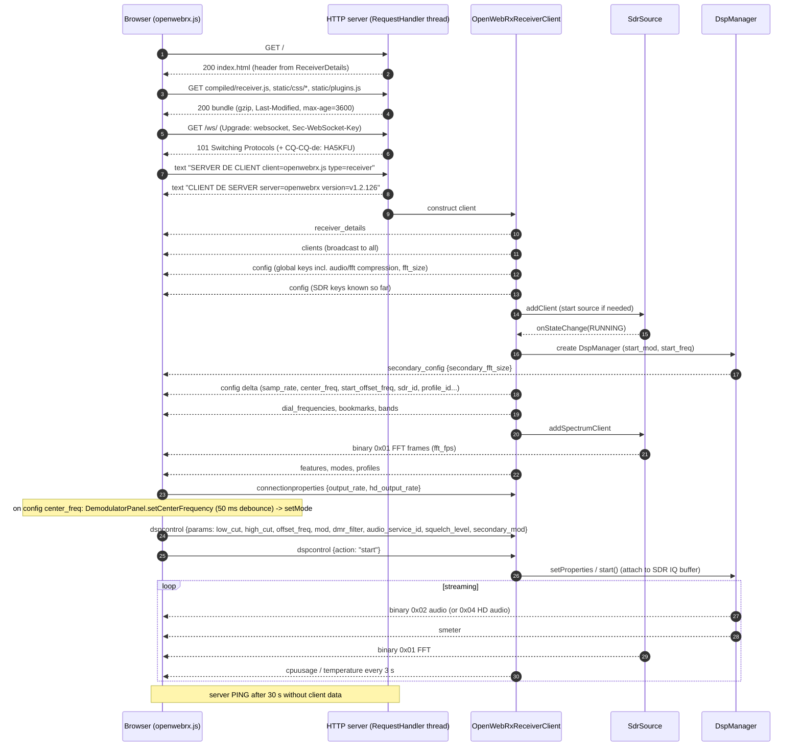

#### (b) Profile switch
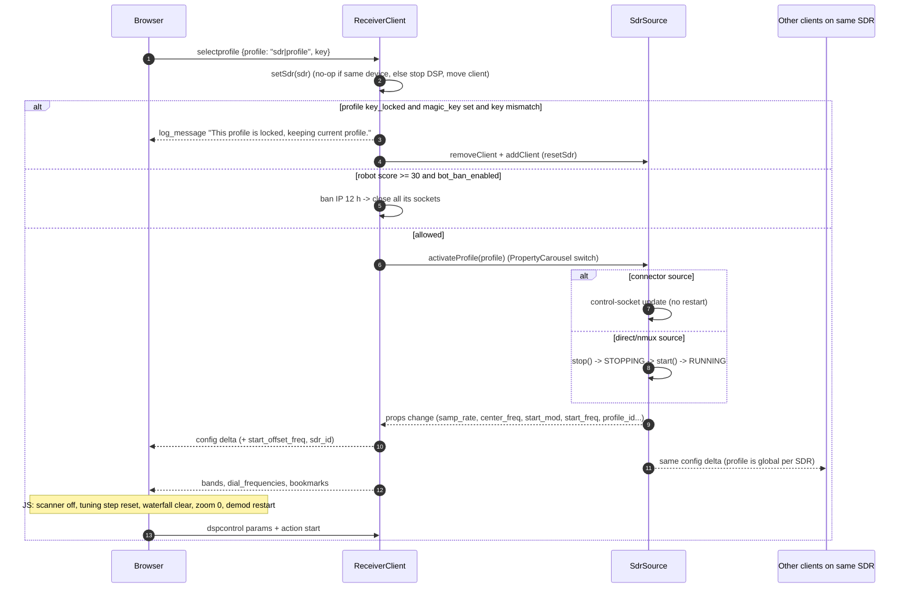

#### (c) Map page updates
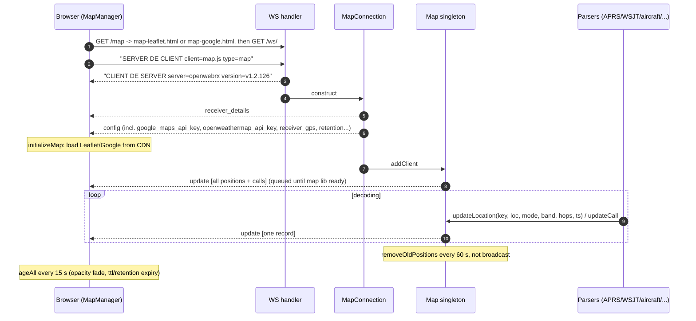

#### (d) Login → settings save
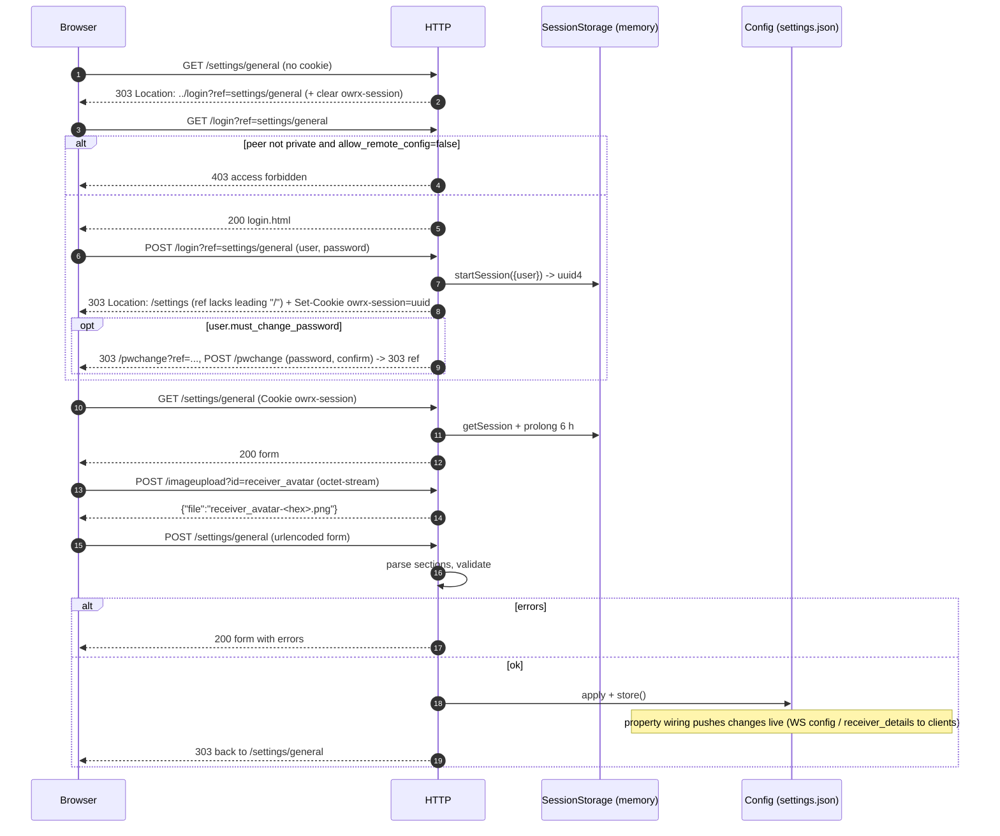

---

## 6. Dependencies and reused software

This section lists everything the application **does not implement itself**: libraries, programs, data sets, online services and packaging tools.

**License columns.** Licenses are **verified** for the support libraries cloned during this audit (§6.10, †). For all other components, the license given is the one commonly published by the upstream project. It was **not re-verified** here and is marked *(upstream, unverified)* where relevant. Check them before any redistribution decision.

### 6.1 Overview

| Category | Count | Hard requirement? |
|---|---|---|
| Python standard library only (no `install_requires`) | — | `setup.py` declares no dependencies; everything goes through Debian packages or runtime detection |
| Support libraries from the OpenWebRX ecosystem (C++/Python) | 10 repos | `csdr`/`pycsdr` + `owrx_connector` are **hard**; the rest are optional |
| Third-party Python libraries | 5 | optional (`paho-mqtt`, `meshtastic`, `protobuf`, `pycryptodome`) + `distutils` (stdlib, removed in Python 3.12) |
| External programs (decoders, connectors, tools) | ≈ 45 probed | optional, one feature each |
| SDR drivers (SoapySDR modules, vendor libs) | 20 Soapy drivers + 7 native | optional per device type |
| Frontend libraries bundled in `htdocs/lib` | 7 | bundled |
| Frontend libraries loaded from public CDNs at runtime | 7 (2 unpinned) | map/features pages only |
| Online services (server-side) | 12 | optional |
| Online services (browser-side: tiles, APIs, lookup links) | ≈ 20 | optional |
| Static data sets shipped or vendored | 6 families | bandplans and bookmarks are used by default |

### 6.2 Python packages

| Package | Used for | Imported in | Gate / detection | Debian package | License |
|---|---|---|---|---|---|
| **pycsdr** (`pycsdr.modules`, `pycsdr.types`) | All DSP modules, buffers, TcpSource, ADPCM, FFT | 47 files in `csdr/` and `owrx/` | feature `core`: `csdr_version` and `version` ≥ 0.18.0 | `python3-csdr (>= 0.18.40)` **Depends** | GPLv3 † |
| **digiham** (`digiham.modules`, `digiham.ambe`) | DMR/YSF/D-Star/NXDN/P25 decoding, MbeSynthesizer → codecserver | `csdr/chain/digiham.py`, `owrx/feature.py` | `digital_voice_digiham` (≥ 0.6) | `python3-digiham (>= 0.6.11)` Recommends | GPLv3 † |
| **csdreti** | DAB ETI decoding (`EtiDecoder`) | `csdr/chain/dablin.py` | `dab` (≥ 0.0.11) | `python3-csdr-eti` Recommends | GPLv3 † |
| **js8py** | JS8 frame parsing | `owrx/js8.py` | `js8call` (StrictVersion ≥ 0.1) | `python3-js8py (>= 0.1)` Recommends | GPLv3 † |
| **paho-mqtt** | MQTT publish and subscribe | `owrx/reporting/mqtt.py`, `owrx/mqtt.py` | `mqtt` (import) | `python3-paho-mqtt` Recommends | EPL-2.0 / EDL-1.0 *(upstream, unverified)* |
| **meshtastic** + **google.protobuf** | Meshtastic protobuf decoding | `owrx/meshtastic.py` | `meshtastic` (import) | `python3-meshtastic` Recommends | GPLv3 / BSD-3 *(upstream, unverified)* |
| **pycryptodome** (`Cryptodome`) | Meshtastic AES-CTR decryption | `owrx/meshtastic.py` | optional import | `python3-pycryptodome` Recommends | BSD/Public domain *(upstream, unverified)* |
| **distutils** (`LooseVersion`, `StrictVersion`) | Version comparison | `owrx/version.py:1`, `owrx/feature.py:5` | — (import at startup) | `python3-distutils-extra` (Depends). That package does **not** provide `distutils` on Python ≥ 3.12. | PSF |

### 6.3 External programs

Grouped by feature flag. The probe commands are in §4.1.6 (feature detection). The Debian package names are the ones listed in `debian/control` **Recommends**.

| Program(s) | Feature flag → features (FEATURE_AUDIT IDs) | Integration | Debian package | Upstream / license *(upstream, unverified unless †)* |
|---|---|---|---|---|
| `rtl_connector`, `rtl_tcp_connector`, `soapy_connector` | rtl_sdr, rtl_tcp, all `soapy_*` → SRC | subprocess, TCP IQ + control socket | `owrx-connector (>= 0.6.5)` **Depends** | luarvique/owrx_connector, GPLv3 † |
| `nmux` | perseussdr, fifi_sdr → SRC | `cmd \| nmux` shell pipeline, TCP | `nmux (>= 0.18)` (from csdr) | luarvique/csdr, BSD-3 † |
| `sddc_connector` | sddc → SRC | subprocess | (extra-sdr-drivers) | luarvique, GPL *(unverified)* |
| `hpsdrconnector` | hpsdr → SRC | subprocess | `hpsdrconnector` | jancona/hpsdrconnector, Go *(unverified)* |
| `runds_connector` | runds → SRC | subprocess | `runds-connector (>= 0.2)` | jketterl/runds_connector, GPLv3 *(unverified)* |
| `perseustest` | perseussdr → SRC | `perseustest … \| nmux` | `perseus-tools` | Microtelecom libperseus-sdr, GPL *(unverified)* |
| `arecord`, `rockprog` | fifi_sdr → SRC | ALSA capture + tuning tool | alsa-utils, (rockprog) | GPL *(unverified)* |
| `soapy_connector --listdrivers` drivers: rtlsdr, sdrplay, sx, elad, soapyMiri, malahit_rr, hackrf, airspy, airspyhf, hydrasdr, afedri, lime, plutosdr, remote, uhd, radioberry, fcdpp, bladerf, iqfile, SDDC | SRC (20 Soapy types) | in-process in the connector | SoapySDR modules, `extra-sdr-drivers`, luarvique/SoapySDRPlay3 | SoapySDR Boost-1.0; drivers vary. **SDRplay API is proprietary.** |
| `jt9`, `wsprd`, `wsjtx_app_version` | wsjt-x, wsjt-x-2-3/2-4 → DEC (FT8, FT4, JT65, JT9, WSPR, FST4, FST4W, Q65) | tmp WAV per slot + DecoderQueue | `wsjtx` | WSJT-X, GPLv3 |
| `msk144decoder` | msk144 → DEC | stdin/stdout | `msk144decoder` | luarvique, GPL *(unverified)* |
| `js8` | js8call → DEC (JS8) | tmp WAV per slot | `js8call` | JS8Call, GPLv3 |
| `direwolf` | packet → DEC (APRS packet), MAR (AIS), RPT (legacy iGate) | stdin audio, KISS over TCP, tmp conf file | `direwolf (>= 1.4)` | Dire Wolf, GPLv2 |
| `multimon-ng` | page, selcall, eas → DEC (POCSAG/FLEX, ZVEI/CCIR/EEA/EIA/DTMF, EAS/SAME) | stdin/stdout | `multimon-ng` (luarvique fork in `buildall.sh`) | GPLv2 |
| `rtl_433` | ism → DEC (ISM, wM-Bus) | `-r cf32:-` stdin, JSON stdout | `rtl-433` | GPLv2 |
| `dump1090` | adsb → AIR-001 | stdin IQ, JSON files in `/tmp/dump1090` | `dump1090-fa-minimal` | FlightAware dump1090, GPLv2+ |
| `dump978` | uat → AIR | stdin, JSON | `dump978-fa-minimal` (luarvique fork) | FlightAware dump978 *(unverified license)* |
| `dumphfdl` | hfdl → AIR | stdin, JSON | `dumphfdl` (luarvique fork) | GPLv3 |
| `dumpvdl2` | vdl2 → AIR | stdin, JSON | `dumpvdl2` (luarvique fork) | GPLv3 |
| `acarsdec` (≥ 4) | acars → AIR | stdin, JSON | `acarsdec (>= 4.0)` (luarvique fork) + `libacars` | GPLv2 |
| `dream` | drm, dream-2-2 → BC (DRM) | stdin/stdout + UNIX status socket | `dream-headless` / `dream` | Dream, GPLv2 |
| `dablin` | dab → BC (DAB audio) | ETI stdin, audio stdout | `dablin` | GPLv3 |
| `nrsc5` / libnrsc5 | hdradio → BC (HD Radio) | **ctypes in-process** (`csdr/module/nrsc5.py`); the binary is only probed | `nrsc5` (luarvique fork) | GPLv3 |
| `redsea` | rds → DEM (WFM RDS) | stdin MPX, JSON stdout | `redsea` (windytan) | MIT |
| `freedv_rx` | digital_voice_freedv → DV | stdin/stdout | `codec2` | codec2, LGPLv2.1 |
| `webrx_rade_decode` | digital_voice_rade → DV (RADE) | stdin/stdout | (unpackaged here) | *(unverified)* |
| `m17-demod` | digital_voice_m17 → DV (M17) | stdin/stdout | `m17-demod` | m17-cxx-demod, GPLv3 *(unverified)* |
| `tetrarx` | tetra → DV (TETRA) | stdin + JSON FIFO | (unpackaged here) | osmo-tetra derived *(unverified)* |
| `codecserver` | codecserver_ambe → DV (AMBE vocoder) | UNIX socket / TCP protobuf, via digiham | `codecserver (>= 0.1)` | jketterl/codecserver, GPLv3 †. **AMBE needs DVSI hardware or patent licence.** |
| `csdr-cwskimmer`, `csdr-rttyskimmer` | skimmer → DEC (CW/RTTY skimmers) | stdin/stdout | `csdr-skimmer` | luarvique, GPLv3 † |
| `rs41mod`, `dfm09mod`, `m10mod`, `m20mod`, `mts01mod` | sonde → SND (only `rs41mod` is probed) | stdin/stdout JSON | `sonde-decoders` | rs1729/RS *(unverified license)* |
| `lorarx` | lora, meshtastic → LORA | stdin, JSON stdout | `dxlaprs-lora` | dxlAPRS (OE5DXL), GPL *(unverified)* |
| `satdump` | wxsat → service-only satellite modes | stdin, output folder in tmp | (unpackaged here) | SatDump, GPLv3 |
| `lame` | mp3 → SVC (background audio recording) | stdin PCM → mp3 file | `lame` | LGPLv2 |
| `convert` (ImageMagick) | png → FIL (SSTV/FAX PNG conversion) | subprocess on stored BMP | `imagemagick` | ImageMagick License (Apache-2-like) |
| `rigctl` (hamlib) | rigcontrol → INT (rig follow, PTT) | interactive stdin, one process per listener | `libhamlib-utils` | Hamlib, LGPL/GPL |
| `nmcli` | WiFi → INT | argv subprocess | NetworkManager (not declared) | GPLv2+ |
| `gpsd` | GPS → INT | TCP 127.0.0.1:2947 JSON | (not declared) | BSD-2 |
| Whisper.cpp server | speech → SVC (speech-to-text) | HTTP POST WAV to `speech_url` | external | MIT |
| `airspy_rx` | probed but **unused** | — | — | — |

### 6.4 SDR hardware drivers (beyond the connector)

| Path | Drivers | Notes |
|---|---|---|
| Native connectors | librtlsdr (rtl_sdr, rtl_tcp), sddc, HPSDR protocol 1, R&S EB200/Ammos (runds), Perseus, FiFi-SDR (ALSA) | Each connector is a separate process |
| SoapySDR | RTL-SDR, SDRplay (API 3, proprietary), SX, ELAD, Mirics (SoapyMiri), Malahit, HackRF, Airspy, Airspy HF+, HydraSDR, Afedri, LimeSDR, PlutoSDR (+ libiio), SoapyRemote, UHD (Ettus), Radioberry, FunCube Dongle Pro+, bladeRF, IQ file, SDDC | `soapy_connector -t settings`; the driver list is detected from `--listdrivers` |
| Build helpers | `buildall.sh` builds luarvique/SoapySDRPlay3 | SDRplay reliability watchdog in the connector |

### 6.5 Frontend libraries

| Library | Version | Delivery | Used by | Pinned / SRI | License *(upstream, unverified)* |
|---|---|---|---|---|---|
| jQuery | 3.7.1 | bundled `htdocs/lib` | all pages | yes / n/a | MIT |
| Bootstrap bundle (+Popper) | 4.5.0 | bundled | settings pages | yes. 4.x is **EOL**, with known XSS CVEs in tooltip/popover sanitiser-related areas (fixed in 4.6.x / 5.x). | MIT |
| jquery.nanoscroller | 0.8.7 | bundled | receiver panels | yes | MIT |
| chroma.js | unknown (2011-2019 header) | bundled | waterfall colour scales | yes | BSD-3 / Apache-2 |
| lamejs (`lame.min.js`) | unknown | bundled | REC-001 browser MP3 | yes | LGPL |
| location-picker (cyphercodes) | patched | bundled | settings GPS picker | yes | GPLv3 (per header) |
| Nite overlay | 1.7 | bundled | Google map day/night | yes | MIT *(unverified)* |
| moment.js | 2.31.0 | **cdnjs** | map pages | pinned, **no SRI** | MIT |
| showdown | 1.9.0 | **cdnjs** | `/features` (markdown) | pinned, no SRI | MIT |
| Leaflet | 1.9.4 | **unpkg** | Leaflet map | pinned, no SRI | BSD-2 |
| leaflet.terminator | 1.1.0 | unpkg | day/night | pinned, no SRI | MIT |
| leaflet.geodesic | **unpinned** | jsdelivr | great-circle lines | **unpinned**, no SRI | GPLv3 *(unverified)* |
| leaflet-textpath | 1.2.3 | jsdelivr | APRS path labels | pinned, no SRI | MIT |
| Leaflet.Maidenhead | **unpinned** | ha8tks.github.io (personal site) | locator grid | **unpinned**, no SRI | *(unverified)* |
| Google Maps JS API | live | maps.googleapis.com | Google map (API key) | n/a | Google ToS |

### 6.6 Online services

**Server-side** (outbound from the receiver):

| Service | Endpoint | Protocol | Purpose | Feature | Notes |
|---|---|---|---|---|---|
| PSKReporter | `report.pskreporter.info:4739` | UDP IPFIX | Spot upload (WSJT, JS8, skimmers…) | RPT | |
| WSPRnet | `http://wsprnet.org/post/` | **plain HTTP** | WSPR spot upload | RPT | |
| APRS-IS | `euro.aprs2.net:14580` (default) | TCP, **cleartext passcode** | iGate | RPT | Native or legacy direwolf mode |
| SondeHub | `api.v2.sondehub.org` | HTTPS PUT | Telemetry + listener | RPT | |
| AIS aggregators | `ais.vesselfinder.com:5482` (default) | UDP NMEA | AIS feed | RPT | |
| MQTT broker | operator-defined | MQTT (TLS optional) | Publish all spots, chat, client IPs; **subscribe and re-inject** | RPT | `report_clients` default on |
| EIBi | `http://www.eibispace.de/dx/sked-*.csv` | **plain HTTP** | SW broadcast schedule → bookmarks + map | INT/BMK/MAP | 24 h refresh |
| RepeaterBook | API with token; fallback `raw.githubusercontent.com` ARD `MasterRepeater.json` | HTTPS | Repeaters → bookmarks + map | INT | User-Agent carries the **admin e-mail** |
| receiverbook.de, kiwisdr.com/.public, websdr.ewi.utwente.nl | HTTPS/HTTP scrape | mixed | Other public receivers on the map | MAP | 24 h refresh |
| radioid.net | `https://www.radioid.net/api/...` | HTTPS | DMR/YSF callsign lookup | DV | No timeout handling for URLError |
| Whisper server | `speech_url` | HTTP | Speech-to-text | SVC | No timeout |
| receiverbook.de verification | inbound `Authorization: ReceiverId` challenge | HTTP header | Listing ownership proof | RPT/API | |

**Browser-side:**

- **Map tiles:** OSM, OpenTopoMap, Esri ArcGIS (5 styles), Carto (3), Stadia, OpenWeatherMap (key), Iowa State NEXRAD (**plain http**), OpenSeaMap, Google.
- **Lookup links** (configurable): qrzcq.com, vesselfinder.com, flightaware.com, sondehub.org, geolocation.com (IP lookup on `/clients`), short-wave.info.
- **Other:** the hamqsl.com solar widget (sample plugin) and third-party plugins loaded from GitHub Pages by the sample `init.js`.

### 6.7 Data sets

| Data | Files | Origin | Update mechanism | Used by |
|---|---|---|---|---|
| Bandplans | `bands.json`, `bands-r1.json`, `bands-r2.json`, `bands-r3.json` → `/etc/openwebrx/` | project-maintained (ITU regions) | Manual. Reloaded when the file changes (mtime). | RX bandplan strip, SVC dial frequencies, DEC defaults |
| Bookmarks | `bookmarks.d/*.json` (aviation, CB, marine, misc, VHF marine, WFAX; per-region r1/r2/r3; per-country br/cn/de/no/se/us) | project-maintained | Selected by `receiver_country` and `bandplan_region`. Admin edits go to `{data}/bookmarks.json`. | BMK |
| SW curiosities list | `bookmarks.txt` + `makebookmarks.pl` | project-maintained | Manual Perl conversion, not installed | — |
| EAS/SAME tables | `owrx/dsame3/defs.py` (8 170 lines) | vendored dsame3_simple (© 2016 J. W. Metcalf, modified 2023) | none | DEC (EAS) |
| Callsign prefixes / MMSI MID tables | `owrx/lookup.py` (1 383 lines), `owrx/aircraft/icao.py` | vendored | none | MAP, MAR, AIR |
| EIBi language/country/target tables | `owrx/web/eibi.py` (3 031 lines) | vendored from EIBi docs | none | BMK, MAP |
| APRS symbols | `/usr/share/aprs-symbols/png` | `aprs-symbols` package (hessu/aprs-symbols) | package | MAP (APRS) |
| Meshtastic default PSK | `owrx/meshtastic.py` | Meshtastic public default key `AQ==` | none | LORA |

### 6.8 Build, packaging and deployment

| Artifact | Content |
|---|---|
| `setup.py` | Package `OpenWebRX` 1.2.126. Packages `owrx*`, `csdr*`, `htdocs`. Console script `openwebrx`. `python_requires>=3.5`, but the code actually needs ≥ 3.9 (§8). |
| `debian/` | `dh --with python3 --buildsystem=pybuild --with systemd`. Installs `bands*.json`, `bookmarks.d/` and `openwebrx.conf` into `/etc/openwebrx/`. postinst creates the `openwebrx` user and `settings.json`. **Depends:** owrx-connector, python3-csdr. **Recommends:** 37 unique packages (js8call is listed twice), mapped in §6.3. |
| `systemd/openwebrx.service` | `ExecStart=/usr/bin/openwebrx`, `User=openwebrx`, `Restart=always`, `HOME=/tmp`. **No sandboxing directives** (see SEC-26). |
| `buildall.sh` | Clones and builds `.deb`s for: luarvique csdr, pycsdr, owrx_connector, digiham, pydigiham, csdr-eti, pycsdr-eti, csdr-skimmer, SoapySDRPlay3, openwebrx, dump978, nrsc5, multimon-ng, libacars, acarsdec, dumpvdl2, dumphfdl; jketterl codecserver, js8py; windytan redsea. |
| `docker.sh` | buildx multi-arch (amd64, arm64, arm/v7), images `slechev/openwebrxplus`, local `registry:2`. **The `docker/Dockerfiles/*` it references are absent from this checkout.** |
| CI | None (`.github/` holds only issue templates) |
| Tests | `test/` uses `unittest`, `owrx.property` only (≈ 790 LOC) |

### 6.9 Things managed by external libraries or applications (responsibility map)

| Responsibility | Implemented by | OpenWebRX+ role |
|---|---|---|
| USB/network SDR access, sample-rate/gain control | owrx_connector, SoapySDR, vendor drivers | spawn, configure over the control socket, restart |
| IQ fan-out to many consumers | nmux (direct sources) or the connector TCP server | connect |
| DSP primitives (FIR, decimation, FFT, AGC, demodulators, squelch, NR, ADPCM) | libcsdr++ via pycsdr (+ FFTW3) | assemble chains, set parameters |
| Digital-voice framing and decoding | digiham (+ codecserver for AMBE) | wire modules, parse metadata |
| WSJT/JS8/MSK decoding | WSJT-X `jt9`/`wsprd`, JS8Call `js8`, msk144decoder | slot timing, WAV writing, output parsing |
| AX.25/APRS/AIS modem | direwolf | config generation, KISS parsing, APRS parsing (own code) |
| Paging, SelCall, EAS | multimon-ng (+ vendored dsame3) | parsing |
| Aviation | dump1090/dump978/dumphfdl/dumpvdl2/acarsdec (+ libacars) | JSON parsing, aircraft merging (own code) |
| Broadcast audio | dream, csdr-eti + dablin, libnrsc5 | metadata, programme selection |
| RDS | redsea | metadata relay |
| Sondes, LoRa, satellites | rs1729 decoders, lorarx, satdump | JSON parsing, map, SondeHub upload (own code) |
| Images | own SSTV/FAX decoders in csdr + ImageMagick for PNG | storage, gallery |
| Rig control | hamlib `rigctl` | command streaming |
| Speech-to-text | Whisper HTTP server | chunking, WAV upload |
| MP3 | lame (server), lamejs (browser) | piping |
| Maps | Leaflet/Google + tile providers | markers, layers (own code) |
| Spot networks | PSKReporter, WSPRnet, APRS-IS, SondeHub, AIS, MQTT | own client implementations |

### 6.10 Support libraries: deep dive

These are the luarvique and jketterl repositories that make up the native core. Each one was cloned and read for this audit.

Scope: the C/C++/Python companion projects that OpenWebRX+ (`/home/yohan/Sites/openwebrx`, luarvique fork, v1.2.126) depends on and that are maintained by the OpenWebRX / OpenWebRX+ authors. Third-party decoders invoked as plain executables (dump1090, direwolf, wsjtx, dream, nrsc5, multimon-ng, dablin, satdump, rtl_433, ...) are out of scope here.

Method: each repo was shallow-cloned (`git clone --depth 1`, default branch) on 2026-10-06 into `scratchpad/ext/`. Upstream `jketterl/*` repos for csdr, pycsdr, owrx_connector, digiham were also cloned into `scratchpad/ext/upstream/` for diffing. Line counts include `.c/.cpp/.h/.hpp/.py/.pyi/.proto/CMakeLists.txt/Makefile` and exclude the vendored `CLI11.hpp` (8 258 lines) in csdr. Paths of the form `ext/<repo>/...` refer to the clones. Paths without a prefix refer to the OpenWebRX+ repo.

Which forks are used: `buildall.sh:11-30` is the authoritative list. OpenWebRX+ builds **luarvique** forks of csdr, pycsdr, owrx_connector, digiham, pydigiham, csdr-eti, pycsdr-eti, csdr-skimmer, and the **jketterl** originals of codecserver and js8py. `github.com/luarvique/codecserver` and `github.com/luarvique/js8py` do **not exist** (`git ls-remote` returns "Repository not found").

---

#### 6.10.0 Summary table

| Repo (fork used) | Lang | Build | LOC | License | Version (debian/changelog) | Last commit | Used by owrx as | Hard dependency? |
|---|---|---|---|---|---|---|---|---|
| luarvique/owrx_connector | C++11 | CMake ≥3.10 | 2 094 | GPLv3+ | 0.6.5 | 2026-08-23 | separate processes `rtl_connector`, `soapy_connector`, `rtl_tcp_connector` | Yes (`debian/control` Depends `owrx-connector (>= 0.6.5)`) |
| luarvique/csdr | C++11 | CMake | 15 687 (+8 258 vendored CLI11) | mixed: 33 lib files GPLv3+, 23 files BSD-3-clause (per-file headers); repo LICENSE = GPLv3 | 0.18.41 | 2026-09-24 | `libcsdr++` (via pycsdr) + `nmux` executable | Yes (feature `core`) |
| luarvique/pycsdr | C++ CPython extension | setuptools | 4 737 | GPLv3 | 0.18.40 | 2026-09-01 | `pycsdr.modules`, `pycsdr.types` imported in 47 .py files | Yes (Depends `python3-csdr (>= 0.18.40)`) |
| luarvique/digiham | C/C++ | CMake | 13 492 | GPLv3 | 0.6.11 | 2026-08-23 | `libdigiham` (via pydigiham) | Optional (Recommends) |
| luarvique/pydigiham | C++ CPython ext + Python | setuptools | 1 375 | GPLv3 | 0.6.11 | 2026-08-05 | `digiham.modules`, `digiham.ambe` | Optional |
| luarvique/csdr-eti | C/C++ | CMake | 3 984 | GPLv3 (derived from dabtools/OpenDAB/rtl-dab/KA9Q FEC) | 0.0.11 | 2024-06-02 | `libcsdr-eti` (via pycsdr-eti) | Optional (DAB) |
| luarvique/pycsdr-eti | C++ CPython ext | setuptools | 509 | GPLv3 | 0.0.11 | 2024-02-21 | `csdreti.modules.EtiDecoder` | Optional (DAB) |
| luarvique/csdr-skimmer | C++ | plain Makefile | 857 | GPLv3 | 1.12 | 2026-08-11 | executables `csdr-cwskimmer`, `csdr-rttyskimmer` run via `ExecModule` | Optional |
| jketterl/codecserver | C++ | CMake + protoc | 3 262 | GPLv3 | 0.3.0 (UNRELEASED) | 2024-02-04 | separate daemon reached over Unix socket / TCP by digiham's `MbeSynthesizer` | Optional (AMBE voice) |
| jketterl/js8py | Python 3 | setuptools | 708 | GPLv3 | 0.2.0 (UNRELEASED) | 2022-11-30 | `js8py.Js8`, `js8py.frames` | Optional (JS8) |

Maintenance status: everything Marat Fayzullin (luarvique) forked is actively maintained (commits in Aug–Sep 2026). The jketterl upstreams are effectively frozen: last commits jketterl/openwebrx 2024-12-11, jketterl/csdr 2024-07-11, jketterl/pycsdr 2024-07-11, jketterl/owrx_connector 2024-03-03, jketterl/digiham 2024-02-04, codecserver 2024-02-04, js8py 2022-11-30. csdr-eti and pycsdr-eti forks have not changed since 2024.

---

#### 6.10.1 How the libraries plug into OpenWebRX+

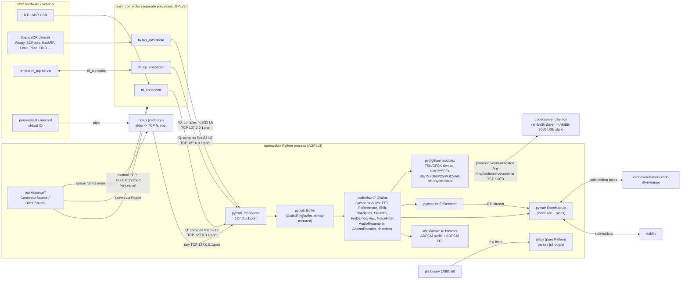

Key integration facts:
- Connector processes are started by `owrx/source/__init__.py:340-392` (`subprocess.Popen`, `start_new_session=True`), readiness is detected by polling a TCP connect to the IQ port up to 1000 × 0.1 s (`owrx/source/__init__.py:410-424`), then `ConnectorSource.postStart()` opens the control socket (`owrx/source/connector.py:58-62`).
- IQ is consumed in-process by `pycsdr.modules.TcpSource(port, Format.COMPLEX_FLOAT)` (`owrx/source/__init__.py:310-313`) writing into a `pycsdr.modules.Buffer` that every client's DSP chain reads from (`owrx/source/__init__.py:325-329`).
- Every pycsdr `Module` runs its own native thread (`Csdr::AsyncRunner`), and the GIL is released around blocking calls (`ext/pycsdr/src/module.cpp:17-21,65-67`, `ext/pycsdr/src/bufferreader.cpp:73`). The Python process is therefore multi-threaded native DSP, not GIL-bound.
- Decoder metadata from digiham/csdr-eti is serialized **as Python pickle** by native code calling `pickle.dumps` under `PyGILState_Ensure` (`ext/pydigiham/src/pickleserializer.cpp:9-39`, `ext/pycsdr-eti/src/pickleserializer.cpp`) and parsed by `owrx/meta.py:296` `MetaParser(PickleModule)` / `csdr/module/__init__.py:101-120` `PickleModule`.

---

#### 6.10.2 owrx_connector (luarvique/owrx_connector)

**Purpose.** Small per-device daemons that open the SDR, stream IQ samples to TCP clients, and accept runtime retuning over a separate control socket. They replace the older `rtl_sdr | csdr | nmux` shell pipelines.

**Language / build.** C++11, CMake ≥3.10 (`ext/owrx_connector/CMakeLists.txt`). Builds a shared library `libowrx-connector` (`src/lib`) plus up to three executables (`src/app/CMakeLists.txt`): `rtl_connector` (only if librtlsdr found), `soapy_connector` (only if SoapySDR ≥0.5 found), `rtl_tcp_connector` (always). Optional function multi-versioning (`OWRX_CONNECTOR_FMV`, `cmake/DetectIfunc.cmake`, `src/lib/fmv.h`) and NEON flags on ARM.

**LOC / license / status.** 2 094 LOC, GPLv3+. Package version 0.6.5 (`debian/changelog`; `CMakeLists.txt` still says `project(... VERSION 0.6.2)`). Last commit 2026-08-23. Fork differences from jketterl develop: only `soapy_connector.cpp/.hpp` (stream watchdog: if `readStream` times out for `SOAPY_RESTART_SECS`, the stream is deactivated and reactivated) and `src/lib/CMakeLists.txt`.

**Dependencies.** libcsdr ≥0.18 (only for `Csdr::Ringbuffer`/`RingbufferReader`, `include/owrx/connector.hpp:9`), pthreads, librtlsdr (optional), SoapySDR (optional).

**Key classes.**
- `Owrx::Connector` (`include/owrx/connector.hpp`, `src/lib/connector.cpp`): template-method base. Hardware subclasses implement `open/read/close/set_center_frequency/set_sample_rate/set_gain/set_ppm/get_buffer_size`.
- `GainSpec` → `AutoGainSpec` ("auto"/"none"), `SimpleGainSpec` (float), `MultiGainSpec` (`"LNA=10,VGA=5"` parsed by `Connector::parseSettings`) (`src/lib/gainspec.cpp`).
- `IQSocket<T>` / `IQConnection<T>` (`src/lib/iq_connection.cpp`), `RtlTcpSocket` / `RtlTcpConnection` (`src/lib/rtl_tcp_connection.cpp`), `ControlSocket` (`src/lib/control_connection.cpp`).
- Apps: `RtlConnector` (`rtlsdr_read_async`, uint8 samples), `SoapyConnector` (prefers native `CF32`, else `CS16`, `src/app/soapy_connector.cpp:145-149`), `RtlTcpConnector` (TCP client to a remote rtl_tcp server; sends 5-byte rtl_tcp commands 0x01 freq, 0x02 rate, 0x03 gain mode, 0x04 gain×10, 0x05 ppm, 0x09 direct sampling, `src/app/rtl_tcp_connector.cpp:175-213`).

**CLI (common, `src/lib/connector.cpp:102-197`).** `-d device`, `-p port` (default 4950; usage text wrongly says 4590), `-f freq`, `-s samplerate`, `-g gain`, `-c control port`, `-P ppm`, `-i iqswap`, `-r rtltcp port`, `-v`, `-h`. rtl: `-e directsampling`, `-b biastee`. soapy: `-a antenna`, `-t settings`, `-n channel`, `-l listdrivers`. `--version` prints `<prog> version X`, which owrx parses with a regex and requires ≥0.5 (`owrx/feature.py:287-302`). `soapy_connector --listdrivers` is used for Soapy driver detection (`owrx/feature.py:331-340`).

**owrx usage.** `owrx/source/connector.py:18-35` maps props to flags (`samp_rate→-s`, `tuner_freq→-f`, `port→-p`, `controlPort→-c`, `device→-d`, `iqswap→-i`, `rtltcp_compat→-r`, `ppm→-P`, `rf_gain→-g`). Subclasses set the binary: `rtl_sdr.py:14` `rtl_connector`, `soapy.py:16` `soapy_connector` (+ `antenna -a`, `soapy_settings -t`, `channel -n`), `rtl_tcp.py:14` `rtl_tcp_connector`; also third-party connectors with the same protocol: `sddc_connector` (`sddc.py:8`), `runds_connector` (`runds.py:14`), `hpsdrconnector` (`hpsdr.py:36`). 27 source modules derive from `ConnectorSource`.

**Process model.** One OS process per active SDR device, started on demand by owrx and restarted on failure. `Connector::main` loops `open→setup→read→close`, sleeping 5 s between device re-opens (`src/lib/connector.cpp:62-89`). SIGINT/SIGTERM/SIGQUIT set `run=false`.

**IPC.**
- *IQ stream*: TCP, bound to `127.0.0.1` only (`src/lib/iq_connection.cpp:15`), `listen(sock,1)`, no header, no framing, no auth. Payload is interleaved I/Q **float32, host byte order** (little-endian on all supported targets), normalized to [-1,1]: uint8 → `x/127.5-1`, int16 → `x/32767`, int32 → `x/INT32_MAX` (`src/lib/connector.cpp:372-400`). Optional I/Q swap before conversion. Each client gets its own `RingbufferReader` and a detached sender thread; slow clients are not throttled — the writer never waits, a lagging reader silently loses data when the ring wraps (`Ringbuffer::writeable()` returns `size-1`, `ext/csdr/src/lib/ringbuffer.cpp`).
- *Ring buffer*: `Csdr::Ringbuffer<float>` of `10 × get_buffer_size()` elements (`src/lib/connector.cpp:24-31`), allocated as a page-aligned **mirrored mmap** (the same pages mapped twice back-to-back via `mremap(MREMAP_FIXED)`) so readers always get a contiguous pointer (`ext/csdr/src/lib/ringbuffer.cpp:36-70`). This relies on Linux-specific `mremap`. A condition variable wakes readers.
- *Control socket*: TCP `127.0.0.1:<controlPort>`, `listen(1)`, **one controller at a time**, no auth. Line protocol `key:value\n` in UTF-8 (`src/lib/control_connection.cpp:38-66`). No response is sent back; errors only go to stderr. Base keys: `center_freq`, `samp_rate`, `rf_gain` (float / `auto` / `none` / `k=v,k=v`), `ppm` (`None`→0), `iqswap` (`1`/`true`). rtl and rtl_tcp add `direct_sampling`, `bias_tee`; soapy adds `antenna`, `settings` (`k=v,...`), `channel`. Unknown keys are logged and ignored (`src/lib/connector.cpp:300-332`). owrx sends **every** changed property, e.g. `profile` changes produce noisy "unknown key" messages (`owrx/source/connector.py:37-56`). `center_freq` is rewritten to `center_freq + lfo_offset` when an LO offset is configured (`owrx/source/connector.py:46-55`). Soapy translates its own props into a `settings` line (`owrx/source/soapy.py:75-90`).
- *rtl_tcp compatibility*: optional third socket (`-r port`, `127.0.0.1`), sends the 12-byte `dongle_info_t` header (`"RTL0"`, tuner_type=5 R820T, gain_count=0), then **uint8 offset-binary IQ** converted from the native format (`src/lib/rtl_tcp_connection.cpp`, `src/lib/connector.cpp:410-432`). Incoming rtl_tcp commands are ignored (read-only tap for third-party apps). Exposed in UI as `rtltcp_compat` (`owrx/source/connector.py:84-90`).

**Threading.** Main thread = device read loop (librtlsdr async callback thread for rtl). One accept thread per socket, one detached thread per IQ client, one thread for the control socket. `devMutex` guards device calls.

**Rewrite implications.** The control protocol and IQ format are trivial and fully documented above, so a new backend in any language can drive the existing binaries unchanged as separate processes (no GPL contamination through process boundaries/sockets). Rewriting the connectors themselves means rewriting thin wrappers over librtlsdr (GPLv2+) and SoapySDR (Boost license). Gaps to fix if reimplementing: no auth on control socket, single controller, no acknowledgement or error channel, no backpressure signalling, Linux-only mirrored ring buffer. Third-party connectors (sddc, runds, hpsdr) follow the same CLI contract, so the contract must be preserved to keep them.

---

#### 6.10.3 csdr (luarvique/csdr) — libcsdr++ and nmux

**Purpose.** The DSP library behind every OpenWebRX demodulator, plus the `csdr` CLI and the `nmux` TCP multiplexer. Originally Andras Retzler's (HA7ILM) C library (2014), rewritten by Jakob Ketterl as a C++ module/ringbuffer framework (0.18, 2021). The luarvique fork adds most "+" decoders.

**Language / build.** C++11 (+ some C), CMake (`ext/csdr/CMakeLists.txt`). Produces `libcsdr++` (shared), `csdr` CLI (`src/apps/csdr`, uses vendored CLI11), `nmux` (`src/apps/nmux`). Function multi-versioning via ifunc for SIMD (`src/lib/fmv.h`). Debian packages `libcsdr0`, `libcsdr-dev`, `csdr`, `nmux`.

**LOC / license / status.** 15 687 LOC excluding CLI11. Repo LICENSE is GPLv3, but licensing is **per file**: README §Licensing says "mixed license, with parts being provided under BSD and other parts under GPL". In `src/lib`, 33 files carry GPLv3+ headers (all of Ketterl's 2021+ framework: module, ringbuffer, async, fft, firdecimate, agc, amdemod, converter, exec, ... and luarvique's afc, ccir476, ccir493, dsc, fftafc, navtex, sitorb) and 23 carry BSD-3-clause headers (Retzler-era algorithms: adpcm, fir, fmdemod, shift, timingrecovery, varicode, window, logpower, fractionaldecimator, deemphasis, fftfilter, dbpsk, noise; and luarvique's cw, fax, mfrtty, noisefilter, snr, sstv; Csongor Dobre's fmstereo). `nmux.cpp` is BSD (Retzler 2014). Version 0.18.41, last commit 2026-09-24.

**Fork additions vs jketterl/csdr** (files only in luarvique `src/lib`): `afc`, `ccir476`, `ccir493`, `cw`, `dsc`, `fax`, `fftafc`, `fmstereo`, `mfrtty`, `navtex`, `noisefilter`, `sitorb`, `snr`, `sstv`.

**Dependencies.** fftw3f (single-precision FFTW, GPLv2+ — itself a copyleft constraint), libsamplerate (BSD-2 since 0.1.9), pthreads.

**Core framework (`include/`).**
- `Reader<T>`/`Writer<T>`, `Source<T>`/`Sink<T>`, `Module<T,U>` with `AnyLengthModule` and `FixedLengthModule` (`include/module.hpp`). Modules expose `canProcess()`/`process()`.
- `Ringbuffer<T>` / `RingbufferReader<T>` (`include/ringbuffer.hpp`): single writer, many readers, mirrored mmap, readers never block the writer.
- `AsyncRunner` (`include/async.hpp`): one `std::thread` per module that waits on its reader and calls `process()`.
- `TcpSource<T>` (`include/source.hpp:52`): TCP client feeding a writer (used for connector/nmux/direwolf).
- `ExecModule<T,U>` (`src/lib/exec.cpp`): `fork()`+`execvp()` a child with stdin/stdout pipes, non-blocking writes, reader thread, `reload()` = SIGHUP, `restart()`. Instantiated for many format pairs (`exec.cpp:301-311`). This is how every external decoder (dump1090, dumphfdl, multimon, csdr-skimmer, dablin, satdump, rtl_433, redsea, dream, ...) runs.

**DSP modules (classes in `include/`).** FFT (`Fft`, `LogPower`, `LogAveragePower`, `FftExchangeSides`), filters (`FirFilter`, `LowPassFilter`, `BandPassFilter`, `FftBandPassFilter`, `FirDecimate`, `FractionalDecimator`, `StereoFractionalDecimator`, `MultistageFilter`, windows Blackman/Hamming/Boxcar), mixing (`Shift` math/addfast), demodulators (`AmDemod`, `FmDemod`, `BCFmDemod` + `PilotPLL` stereo, `PhaseDemod`, `Realpart`), audio (`Agc` with attack/decay/hang, `Gain`, `Limit`, `DcBlock`, `NfmDeephasis`, `WfmDeemphasis`, `AudioResampler` (libsamplerate), `Downmix`, `Throttle`), squelch (`Power`/`Squelch` power-based, `Snr`/`SnrSquelch` FFT-SNR-based), noise reduction (`NoiseFilter`: FFT overlap-add spectral subtraction with threshold/attack/decay, `src/lib/noisefilter.cpp`), AFC (`Afc`, `FftAfc`), codecs (`AdpcmEncoder` IMA ADPCM with optional `"SYNC"` marker every 1000 samples `src/lib/adpcm.cpp:203-213`; `FftAdpcmEncoder` for waterfall compression), timing recovery (`GardnerTimingRecovery`, `EarlyLateTimingRecovery`), digital decoders (`DBPskDecoder`+`VaricodeDecoder` = PSK31, `RttyDecoder`+`BaudotDecoder`, `MFRttyDecoder`, `CwDecoder`, `SitorBDecoder`+`Ccir476Decoder`, `NavtexDecoder`, `DscDecoder`+`Ccir493Decoder`, `FaxDecoder`, `SstvDecoder` with Robot/Martin/Scottie/PD/SC2/AVT90 modes), `Converter` between CHAR/SHORT/FLOAT/COMPLEX_* formats, `NoiseSource`.

**nmux (`src/apps/nmux/nmux.cpp`, `tsmpool.cpp`).** "TCP stream multiplexer": reads stdin, writes every byte to all TCP clients. Options `--port/-p`, `--address/-a` (default 127.0.0.1), `--bufsize/-b`, `--bufcnt/-n`. Main thread `select()`s on listen socket + stdin; one `pthread` per client (`nmux.cpp:155-240`). Storage is `tsmpool` (thread-safe memory pool): a circular array of `bufcnt` buffers of `bufsize` bytes, one writer, many readers, readers left behind if too slow (`tsmpool.h`). owrx computes `bufsize` = multiple of 4096 ≥ samp_rate/4 and `bufcnt` so the pool is ~50 MB (`owrx/source/direct.py:20-42`). Used only by `DirectSource` subclasses `perseussdr.py` and `fifi_sdr.py`, run as a shell pipeline `cmd | nmux ...` (`owrx/source/__init__.py:362-371`). Feature checks: `owrx/feature.py:65,71,236-244`.

**csdr CLI.** Not invoked by OpenWebRX+ (no `"csdr ` command strings in `owrx/` or `csdr/`). Only the library and nmux are used.

**owrx usage.** Indirect, through pycsdr (§6.10.4). Version gate: `csdr_version` and pycsdr `version` must be ≥0.18.0 (`owrx/feature.py:221-234`).

**Rewrite implications.** This is the hardest piece to replace: ~15 kLOC of tuned DSP plus the decoders that differentiate OpenWebRX+ (SSTV, FAX, NAVTEX, DSC, SITOR-B, CW, RTTY, noise filter, SNR squelch). Options: (a) keep libcsdr++ and write new bindings (FFI from Rust/Go/Node/etc.) — then the new server links GPLv3 code and must be distributed under GPLv3-compatible terms (AGPLv3 is fine); (b) reimplement — the BSD-licensed files (FIR, FM demod, shift, ADPCM, timing recovery, varicode, CW, FAX, SSTV, MFRTTY, noise filter, SNR) can be ported into any license with attribution; GPL files (framework, AGC, NAVTEX/DSC/SITOR-B/CCIR decoders, AFC) must be clean-room reimplemented or kept GPL; fftw3f is GPLv2+ unless a commercial FFTW license or another FFT (pocketfft, KissFFT, RustFFT) is used. The wire formats the browser depends on (IMA ADPCM with `SYNC` markers for audio, ADPCM-compressed FFT rows) must be reproduced bit-exactly or the JS client must change too.

---

#### 6.10.4 pycsdr (luarvique/pycsdr)

**Purpose.** CPython C-API extension exposing libcsdr++ modules, buffers and readers to Python. It is the glue that lets `csdr/chain/*.py` assemble DSP graphs while all sample processing stays native.

**Language / build.** C++ against the raw CPython C API (no pybind11/Cython), `setup.py` building one extension `pycsdr.modules` from 56 source files, linking `csdr++` and `fftw3f` (`ext/pycsdr/setup.py`). Pure-Python `pycsdr/types.py` (enums) and type stubs `pycsdr/modules.pyi`. Debian package `python3-csdr`.

**LOC / license / status.** 4 737 LOC, GPLv3. 0.18.40, last commit 2026-09-01 (setup.py still says 0.18.2).

**Exports (`src/pycsdr.cpp`).** `Reader, Writer, Sink, Source, Module, TcpSource, Buffer, BufferReader, Fft, LogPower, LogAveragePower, FftSwap, FftAdpcm, FirDecimate, Bandpass, Shift, Squelch, FractionalDecimator, StereoFractionalDecimator, FmDemod, BCFmDemod, Limit, NfmDeemphasis, WfmDeemphasis, Agc, Convert, AmDemod, DcBlock, RealPart, AudioResampler, AdpcmEncoder, Downmix, Gain, TimingRecovery, DBPskDecoder, VaricodeDecoder, PhaseDemod, RttyDecoder, BaudotDecoder, Lowpass, ExecModule, Throttle, CwDecoder, MFRttyDecoder, SstvDecoder, FaxDecoder, NoiseFilter, Afc, FftAfc, SitorBDecoder, DscDecoder, NavtexDecoder, SnrSquelch, version`; plus `csdr_version`. `pycsdr.types.Format` = CHAR, SHORT, FLOAT, COMPLEX_FLOAT, COMPLEX_SHORT, COMPLEX_CHAR; `AgcProfile` = SLOW/LAG/MID/FAST with (attack, decay, hangTime) tuples.

**API surface actually used by owrx** (47 files import pycsdr; counts = number of import statements): `Format` 41, `Writer` 13, `Buffer` 11, `Convert` 9, `Agc` 8, `ExecModule` 7 direct imports + subclasses in `csdr/module/{aircraft,drm,toolbox,satellite,sonde,msk144,...}.py`, `FmDemod` 5, `Shift` 4, `Limit`/`Downmix`/`DcBlock`/`AgcProfile` 3, `TcpSource`/`RealPart`/`Lowpass`/`FirDecimate` 2, and once each: `VaricodeDecoder, TimingRecovery, Throttle, SstvDecoder, Squelch, SnrSquelch, SitorBDecoder, RttyDecoder, Reader, NoiseFilter, NfmDeemphasis, NavtexDecoder, Module, MFRttyDecoder, LogPower, LogAveragePower, Gain, FractionalDecimator, FftSwap, FftAdpcm, Fft, FaxDecoder, DscDecoder, DBPskDecoder, CwDecoder, Ccir493Decoder, Ccir476Decoder, BaudotDecoder, Bandpass, AudioResampler, AmDemod, Afc, AdpcmEncoder, version, csdr_version`. **Not used**: `StereoFractionalDecimator`, `BCFmDemod`, `PhaseDemod`, `FftAfc`, `BufferReader` (only obtained via `Buffer.getReader()`). `WfmDeemphasis` is used in `csdr/chain/analog.py`.

Representative call sites: waterfall FFT chain `csdr/chain/fft.py:2-94` (`Fft(size, every_n_samples)`, `LogPower/LogAveragePower(add_db=-70)`, `FftSwap`, `FftAdpcm`); client audio `csdr/chain/clientaudio.py:2-89` (`Convert`, `NoiseFilter(nrThreshold)`, `AudioResampler`, `Limit`, `AdpcmEncoder(sync=True)`); selector `csdr/chain/selector.py:2-117` (`FirDecimate`, `Shift`, `Bandpass(use_fft=True)`, `Squelch`, `FractionalDecimator`); SNR squelch `csdr/chain/toolbox.py:180,214`; IQ ingest `owrx/source/__init__.py:27,313`; direwolf KISS ingest `owrx/aprs/direwolf.py:199` (`TcpSource(port, Format.CHAR)`).

**Python-side framework.** `csdr/chain/__init__.py:11` `Chain(Module)` links workers by inserting `Buffer(w1.getOutputFormat())` between consecutive modules. `csdr/module/__init__.py` adds pure-Python modules (`ThreadModule`, `PickleModule`, popen-based modules) that subclass pycsdr `Module` so they can sit in the same graph.

**Threading.** Each native module gets an `AsyncRunner` thread when both reader and writer are set (`ext/pycsdr/src/module.cpp:24-34`); GIL released while stopping and while blocking in `BufferReader.read()`. A busy server therefore runs dozens to hundreds of native threads.

**Rewrite implications.** Only needed if the new stack keeps libcsdr++. Equivalent bindings in another language would be a mechanical port of ~50 thin wrappers. The pickle-over-byte-buffer convention for metadata (also used by pydigiham/pycsdr-eti) is Python-specific and must be replaced (e.g. JSON or a struct callback) in a non-Python rewrite.

---

#### 6.10.5 digiham (luarvique/digiham)

**Purpose.** Digital ham-radio decoders: FSK/GFSK symbol demodulation, protocol framing/FEC/metadata for DMR, YSF (System Fusion), D-Star, NXDN, P25 phase 1, POCSAG, and an `MbeSynthesizer` that sends AMBE/IMBE voice frames to codecserver and gets PCM back.

**Language / build.** C++ with C FEC helpers, CMake (`ext/digiham/CMakeLists.txt`). Library `libdigiham` plus one CLI per component (`src/*/..._cli.cpp`, e.g. `dmr_decoder`, `ysf_decoder`, `mbe_synthesizer`), shell examples in `examples/`.

**LOC / license / status.** 13 492 LOC, GPLv3. 0.6.11, last commit 2026-08-23. Fork additions vs jketterl develop: **`p25_decoder/`** and **`dc_block/`** directories, and changes to `mbe_synthesizer.cpp`/`cli.cpp` (upstream moved socket handling into codecserver's client library in its last commit "move connection handling into codecserver"; the fork keeps its own `connect()` implementation).

**Dependencies.** libcsdr ≥0.18 (module framework), libcodecserver + protobuf (client side), ICU ≥57 `uc` (charset conversion, e.g. DMR talker alias, `src/lib/charset.cpp`).

**Key components.**
- `fsk_demodulator`, `gfsk_demodulator`, `rrc_filter` (Wide/Narrow RRC), `digitalvoice_filter`, `dc_block`.
- `dmr_decoder`: CACH, slot type, EMB, embedded LC, BPTC(196,96), Golay(20,8), Hamming(7,4)/(13,9)/(15,11)/(16,11), quadratic residue, talker alias, GPS, slot filter (`setSlotFilter`).
- `ysf_decoder`: FICH, Golay(24,12), trellis, whitening, CRC16, GPS, radio types.
- `dstar_decoder`: header, scrambler, CRC, D-PRS/messages.
- `nxdn_decoder`: LICH, SACCH, FACCH1, trellis, scrambler.
- `p25_decoder` (fork-only): NID, header, link control.
- `pocsag_decoder`: BCH(31,21), codeword/message assembly.
- Metadata: `MetaWriter` / `PipelineMetaWriter` emit key/value maps (keys seen: `protocol, sync, slot, type, source, destination, lat, lon, ourcall, yourcall, departure, dprs, message, nac, algid, kid, mfid, encryption`...).
- `MbeSynthesizer` (`include/mbe_synthesizer.hpp`, `src/mbe_synthesizer/mbe_synthesizer.cpp`): `Csdr::Module<unsigned char, short>`; connects to codecserver, performs handshake, sends `Request{codec:"ambe", settings{directions:[DECODE], args{index|ratep}}}`, receives `Response{framing}`, then streams `ChannelData` frames of `framing.channelBytes` and receives `SpeechData` on a separate reader thread (`readLoop`, `select()` with 1 s timeout). Mode types: `TableMode(index)` (DMR/NXDN index 33), `ControlWordMode(6 × uint16 rate-p words)` (D-Star, P25), `DynamicMode` (YSF switches per frame among index 33, 34 and a control-word mode). `hasAmbeCodec()` sends a `Check{codec:"ambe"}`.

**Notable issues found.**
- Unix-socket path argument is ignored: `MbeSynthesizer::connect(const std::string& path)` hard-codes `"/tmp/codecserver.sock"` (`ext/digiham/src/mbe_synthesizer/mbe_synthesizer.cpp:78-79`). So `digital_voice_codecserver = "/some/other.sock"` would not work.
- Handshake calls `connection->isCompatible(handshake.serverversion())` (`mbe_synthesizer.cpp:155`) while codecserver develop declares `isCompatible(uint32_t protocolVersion)` and the proto field `serverVersion` is a string (`ext/codecserver/include/connection.hpp:20`, `handshake.proto`). This implies the fork is built against a different (packaged) codecserver revision (unverified).

**AMBE licensing.** AMBE/AMBE+2/IMBE are proprietary DVSI codecs, patent-encumbered. digiham contains **no** vocoder; it delegates to codecserver, whose only bundled driver talks to licensed DVSI AMBE-3000 hardware (USB-3000/ThumbDV/DV3000). Software decoding (mbelib-based third-party codecserver modules) is outside these repos and legally grey depending on jurisdiction. Without codecserver + AMBE support, owrx disables DMR/YSF/D-Star/NXDN/P25: feature `digital_voice_digiham` requires `digiham` + `codecserver_ambe` (`owrx/feature.py:84`, `721-742`). POCSAG needs only digiham (`owrx/feature.py:94`).

**Rewrite implications.** The protocol decoders (FEC, framing) are GPLv3 and ~13 kLOC of bit-level work; reusing them via FFI forces GPL-compatible licensing, reimplementing them is significant. Alternatives exist (DSD-FME, OP25 — also GPL). The vocoder boundary (codecserver socket protocol) is clean and should be kept.

---

#### 6.10.6 pydigiham (luarvique/pydigiham)

**Purpose.** CPython bindings for digiham, plus Python AMBE mode tables.

**Language / build.** C++ CPython extension `digiham.modules` linking `csdr++` and `digiham`, Python `digiham/ambe.py`, stubs `digiham/modules.pyi`; setuptools (`ext/pydigiham/setup.py`). Depends on pycsdr's headers (subclasses pycsdr `Module`).

**LOC / license / status.** 1 375 LOC, GPLv3, 0.6.11, last commit 2026-08-05.

**API used by owrx.** `csdr/chain/digiham.py:4-5`: `DstarDecoder, FskDemodulator(samplesPerSymbol, invert), GfskDemodulator(samplesPerSymbol), DigitalVoiceFilter, MbeSynthesizer(mode, server), NarrowRrcFilter, WideRrcFilter, NxdnDecoder, DmrDecoder (+setSlotFilter), YsfDecoder, P25Decoder, PocsagDecoder`, `decoder.setMetaWriter(buffer)`; `digiham.ambe.Modes` (DmrMode, DStarMode, NxdnMode, YsfMode, P25Mode) and `ServerError`. Feature checks: `digiham_version`, `version` ≥0.6 (`owrx/feature.py:264-285`), `MbeSynthesizer.hasAmbe(server)` (`owrx/feature.py:733-735`). Chains run at fixed 48 kHz IF, 8 kHz audio (`csdr/chain/digiham.py:45-49`).

**Codecserver address parsing** (`ext/pydigiham/src/mbesynthesizer.cpp:94-116`): empty → default Unix socket; leading `/` → Unix socket path (ignored downstream, see §6.10.5); otherwise `host[:port]`, default port **1073**, IPv4/IPv6 via `getaddrinfo`, 5 s send timeout. Config key: `digital_voice_codecserver` (`owrx/dsp.py:487,503,622`).

**Metadata.** Native `PickleSerializer` builds a Python dict and calls `pickle.dumps`, written to a CHAR buffer consumed by `owrx/meta.py:296` `MetaParser` with per-protocol enrichers (DMR, YSF, P25, ...).

**Rewrite implications.** Pure glue; goes away with Python. The metadata keys emitted by digiham are the de-facto contract for the frontend's digital-voice panels.

---

#### 6.10.7 csdr-eti (luarvique/csdr-eti)

**Purpose.** DAB Mode I OFDM demodulator producing an ETI(NI) stream from 2.048 MS/s complex float IQ, as a csdr `Module<complex<float>, unsigned char>` (`ext/csdr-eti/include/csdr-eti.hpp:16`). Port of `dab2eti` from Opendigitalradio/dabtools with the rtl-sdr bindings removed.

**Language / build.** C++/C, CMake; deps libcsdr, fftw3f.

**LOC / license / status.** 3 984 LOC, GPLv3. Heritage: dabtools (Dave Chapman), OpenDAB (David Crawley, `src/depuncture.cpp`), rtl-dab (David May), KA9Q Viterbi (`src/viterbi.c`) — all GPL. 0.0.11, last commit 2024-06-02 (fork only merges upstream).

**Internals.** FIC decoding (`src/fic.cpp`), depuncturing, Viterbi FEC, EBU Latin charset (`src/ebu_chars.hpp`), service list metadata. Emits `coarse_frequency_shift` / `fine_frequency_shift` metadata so the caller can steer a `Shift` to <1 ppm (README "I/O parameters"); owrx implements this feedback loop in `csdr/chain/dablin.py:16-58` (`MetaProcessor` nudging `Shift.setRate`, bounded to ±1 kHz). Service filtering via `setServiceIdFilter`.

**owrx usage.** `csdr/chain/dablin.py:4,65` `EtiDecoder()` → ETI bytes → `DablinModule` (`csdr/module/toolbox.py:87`, `ExecModule` running `dablin`) → audio. Feature `dab` requires `csdreti` + `dablin` (`owrx/feature.py:108`, `801-818`, version ≥0.0.11).

**Rewrite implications.** Reuse as subprocess (e.g. wrap in a tiny stdin→stdout CLI) to avoid linking; or use existing GPL alternatives (welle.io, dab-cmdline). Any reimplementation is GPL-derived if ported.

---

#### 6.10.8 pycsdr-eti (luarvique/pycsdr-eti)

**Purpose.** Python binding: `csdreti.modules.EtiDecoder(Module)` with `setMetaWriter(writer)` and `setServiceIdFilter(list[int])`, plus `version` / `csdreti_version` (`ext/pycsdr-eti/csdreti/modules.pyi`).

**Build / LOC / license / status.** setuptools C++ extension linking `csdr-eti` and **`fftw3`** (double precision — differs from csdr-eti's `fftw3f`, harmless but inconsistent, `ext/pycsdr-eti/setup.py:44`); 509 LOC; GPLv3; 0.0.11; last commit 2024-02-21. Metadata via the same native pickle serializer pattern.

---

#### 6.10.9 csdr-skimmer (luarvique/csdr-skimmer)

**Purpose.** Multi-channel CW and RTTY "skimmers": decode every signal across an audio passband simultaneously. Written by Marat Fayzullin; not a fork.

**Language / build.** C++, a 15-line plain `Makefile` (`g++ -O3`, links `-lcsdr++ -lfftw3f`). Files: `cw-skimmer.cpp` (367), `rtty-skimmer.cpp` (393), `bufmodule.cpp/.hpp` (`Csdr::BufferedModule` wrapper that runs a csdr module synchronously on an internal ring buffer). No README.

**LOC / license / status.** 857 LOC, GPLv3, version 1.12, last commit 2026-08-11.

**Algorithm.** Reads audio (float32 `-f` or int16 `-i`) at `-r` rate (8 000–384 000, default 48 000) from stdin. Every `sampleRate/100` samples it runs an FFT (100 Hz bins, `BANDWIDTH=100`), keeps a 3 s running average per bin, thresholds bins (`THRES_WEIGHT` 6.0 CW / 4.0 RTTY), and feeds per-bin on/off envelopes into one `Csdr::CwDecoder` per bin (CW) or `Csdr::RttyDecoder`+`Csdr::BaudotDecoder` per bin (RTTY, `rtty-skimmer.cpp:184-185`). Output lines on stdout: `<freqHz>:<snr_dB>:<chars>` once `-n` (1–32) printable characters accumulate.

**owrx usage.** `csdr/module/toolbox.py:67-77` (`CwSkimmerModule`, `RttySkimmerModule` = `ExecModule(Format.FLOAT, Format.CHAR, ["csdr-cwskimmer","-f","-r",rate,"-n",n])`), chains `csdr/chain/toolbox.py:126,148`, parsers `owrx/skimmer.py:15,146,152`, modes `owrx/modes.py:221,230`, feature `skimmer` (`owrx/feature.py:114,913-919`, checks `csdr-rttyskimmer -h`).

**Rewrite implications.** Small and self-contained, and it already sits behind a subprocess boundary, so it can be kept as-is. A port is ~850 lines but also needs csdr's decoders: `cw.cpp` is BSD-licensed, while `rtty.cpp`/`baudot.cpp` are GPLv3.

---

#### 6.10.10 codecserver (jketterl/codecserver)

**Purpose.** Network daemon that brokers access to (hardware) voice codecs, primarily AMBE via DVSI AMBE-3000 chips, so multiple OpenWebRX receivers/clients can share one dongle.

**Language / build.** C++, CMake, protobuf (`protoc`), libudev; `dlopen()`-loaded driver modules (`src/server/scanner.cpp:43`). Ships systemd unit, Dockerfile, sample config `conf/codecserver.conf`.

**LOC / license / status.** 3 262 LOC, GPLv3, 0.3.0 (UNRELEASED), last commit 2024-02-04. No luarvique fork exists; OpenWebRX+ uses upstream (`buildall.sh:14`). `debian/control` only *Recommends* `codecserver (>= 0.1)`.

**Process model.** Standalone system service (`systemd/codecserver.service`), independent from openwebrx. Servers configured as `[server:unixdomainsockets]` (default `/tmp/codecserver.sock`) and/or `[server:tcp]` / `tcp4` (default port 1073, bind `::`). Devices: `[device:name] driver=ambe3k tty=/dev/ttyUSB0 baudrate=921600`; the ambe3k driver also auto-detects via a udev monitor (`src/modules/ambe3k/udevmonitor.cpp`).

**Protocol.** Connection-oriented stream; each message is a protobuf `google.protobuf.Any` prefixed with a varint64 length (`src/lib/connection.cpp:46,90`). Messages (`src/lib/proto/*.proto`): server → `Handshake{serverName, serverVersion, protocolVersion}`; client → `Check{codec}` or `Request{codec, Settings{directions[ENCODE|DECODE], args map}}`; server → `Response{result OK|ERROR, message, FramingHint{channelBits, channelBytes, audioSamples, audioBytes}}`; then client `ChannelData{bytes}` ↔ server `SpeechData{bytes}`; `Renegotiation{Settings}` to change mode mid-stream (sent by digiham `mbe_synthesizer.cpp:327` for YSF dynamic mode). Protocol version compatibility via `Connection::isCompatible` (`connection.cpp:128-137`). No authentication or TLS on the TCP server.

**Threading.** One accept thread per server, one thread per client connection (`src/server/socketserver.cpp:31-40`, `clientconnection.cpp:46`); ambe3k driver has a `QueueWorker` and `BlockingQueue` per device and multiplexes channels of a multi-channel chip (`src/modules/ambe3k/`).

**Rewrite implications.** Keep it as an external service and speak its protobuf protocol (protobuf is available in every language; the schema is 6 tiny files). Licensing is not an issue across the socket boundary. Note the AMBE patent/licensing constraint applies to any software vocoder you might add.

---

#### 6.10.11 js8py (jketterl/js8py)

**Purpose.** Pure-Python decoder for the *text* output lines of JS8Call's `js8` command-line decoder: decodes the 12-character JS8 payload (custom alphabet, Huffman/JSC dictionary compression `jsc_map.pickle`) into typed frames.

**Language / build.** Python 3, setuptools; no native code. Modules: `__init__.py` (`Js8.parse_message`), `frames.py` (`Js8FrameDataCompressed`, `Js8FrameData`, `Js8FrameDirected`, `Js8FrameCompound`, `Js8FrameHeartbeat`, `Js8FrameCompoundDirected`), `huffman.py`, `jsc.py`, `constants.py`, `message.py`.

**LOC / license / status.** 708 LOC, GPLv3, 0.2.0 (UNRELEASED), last commit 2022-11-30 (stale but stable). No luarvique fork.

**owrx usage.** `owrx/js8.py:4-5,100` (`Js8().parse_message(msg)`, isinstance checks for heartbeat/compound frames to plot locators on the map and report). Feature `js8call` needs `js8` binary + `js8py` ≥0.1 (`owrx/feature.py:95,577-604`).

**Rewrite implications.** Small; straightforward to port (~600 lines of logic + the JSC dictionary data). Port of the dictionary/algorithm is derived from JS8Call (GPLv3), so ported code stays GPLv3.

---

### 6.11 OpenWebRX+ vs upstream jketterl/openwebrx

Upstream README (60 lines, `ext/openwebrx/README.md`) vs this repo (89 lines). The fork prepends an "OpenWebRX+" header and the following list; the rest of the upstream README is kept under "Original OpenWebRX". Additions claimed by OpenWebRX+ (`README.md:1-30`):

- Package repo `https://luarvique.github.io/ppa/`, disk images on GitHub Releases, docs `https://fms.komkon.org/OWRX/`, Telegram channel/chat.
- AIS, SSTV, FAX, FLEX, POCSAG, HFDL, VDL2, ADSB, ACARS, ISM, RDS, SAM, SITOR-B, RTTY, CW decoders.
- DTMF, EEA, EIA, CCIR and several ZVEI SELCALL decoders.
- Background SSTV/FAX decoding with received-images browser.
- Built-in chat; built-in audio recorder; built-in bookmark scanner.
- Admin view of user connections and banning.
- Spectral-subtraction noise filter (csdr `NoiseFilter`).
- Adjustable tuning step; improved CW tuning; scroll-wheel bandpass control; touchscreen waterfall pan/zoom.
- Auto bookmarks for shortwave broadcasts and nearby ham repeaters.
- More reliable SDRplay operation (soapy_connector restart watchdog + luarvique/SoapySDRPlay3 fork).
- Map: other public web SDRs, SW broadcasters, aircraft from ADSB/VDL2/HFDL, repeaters, distances, APRS paths, weather.
- Configurable session timeout with policy page; HTTPS support; foldable receiver panel with opacity; spectrum display.

(The README list is not exhaustive: the code also contains NAVTEX, DSC, DAB, HD Radio, LoRa/Meshtastic, sondes, MQTT, etc. — see FEATURE_AUDIT §5.)

Upstream jketterl/openwebrx last commit: 2024-12-11 (`640c5b0`, merge PR #390), debian/changelog `1.3.0 UNRELEASED`.

---

### 6.12 Rewrite implications of the support libraries

| Component | Boundary to owrx | Recommended strategy | License constraint |
|---|---|---|---|
| owrx_connector (+ sddc/runds/hpsdr connectors) | separate process, TCP IQ + text control | **Keep** binaries, reimplement only the ~70-line Python client side (spawn, wait for port, `key:value\n`) | None across process boundary |
| nmux | separate process | Keep, or replace with in-process fan-out of stdin | BSD |
| libcsdr++ DSP | in-process (C++ lib via pycsdr) | Keep + new bindings (fast path), or port BSD parts + reimplement GPL parts | GPLv3 if linked; fftw3f GPLv2+ |
| pycsdr | in-process CPython ext | Drop with Python; replace with FFI of target language | GPLv3 |
| digiham / pydigiham | in-process | Keep library via FFI, or wrap as subprocess (CLIs already exist: `dmr_decoder`, `ysf_decoder`, `mbe_synthesizer`, ...) | GPLv3 |
| csdr-eti / pycsdr-eti | in-process | Wrap as subprocess or FFI | GPLv3 (inherits dabtools/OpenDAB/KA9Q) |
| csdr-skimmer | subprocess (stdin/stdout) | Keep as-is | GPLv3, no constraint across pipe |
| codecserver | socket daemon (protobuf) | Keep; reimplement protobuf client (6 small .proto files) | None across socket; AMBE patents for any software vocoder |
| js8py | in-process Python | Port (~600 LOC) or keep if backend stays Python | GPLv3 |

Cross-cutting points:
1. **Everything is GPLv3 or AGPLv3.** A rewrite that links any of these libraries in-process must itself be GPLv3-compatible; AGPLv3 (current OpenWebRX license) is compatible. A permissive-licensed rewrite would have to keep these components behind process/socket boundaries or clean-room reimplement them (BSD-headed csdr files are the exception).
2. **The Python process is a native-thread DSP engine.** Throughput depends on pycsdr releasing the GIL and running one C++ thread per module; a rewrite must provide equivalent per-module concurrency (or a scheduler) to support many clients per SDR.
3. **Linux-specific assumptions**: mirrored ring buffer via `mremap` (csdr), `fork/execvp` pipes (ExecModule), `/tmp/codecserver.sock` hard-code, udev (codecserver).
4. **Security posture of the IPC**: all IQ/control/rtl_tcp sockets bind to 127.0.0.1 without authentication; any local user can retune the SDR or read IQ. codecserver TCP (`bind=::` when enabled) is unauthenticated.
5. **Wire formats the browser depends on** are produced by csdr (IMA ADPCM audio with `SYNC` markers, ADPCM-compressed FFT); these must be preserved or the JS client changed together with the backend.
6. **Maintenance risk**: the actively maintained forks are all single-maintainer (luarvique). codecserver and js8py have had no upstream activity since 2024/2022.

---

## 7. Security and threat model

> Scope: defensive review of the checkout at `/home/yohan/Sites/openwebrx` (OpenWebRX+ v1.2.126, HEAD `f2a8feca`). Static code reading only; nothing was executed against a live instance. Items marked **(unverified)** depend on runtime/OS/library versions or external binaries that were not inspected. No exploit code is given; only vulnerability classes, preconditions and impact.

### 7.1 Assets

| # | Asset | Where it lives | Why it matters |
|---|---|---|---|
| A1 | Admin session / admin account | in-memory `SessionStorage` (`owrx/controllers/session.py:14-52`), `users.json` (PBKDF2 hashes) | Any logged-in user is a full admin (no RBAC). Admin = control of SDRs, decoders, reporting credentials, WiFi, and the HTML that every listener's browser renders |
| A2 | Secrets in config | `settings.json` in data dir (`owrx/config/dynamic.py:34-42`): `aprs_igate_password`, `mqtt_password`, `google_maps_api_key`, `openweathermap_api_key`, `repeaterbook_api_key`, `wifi_pass_*`, `magic_key`, receiver-ID keys | Third-party account takeover / impersonation (APRS-IS passcode, MQTT broker, API quota) |
| A3 | Radio hardware & spectrum licence | SDR sources, optional Hamlib transmitter (`owrx/rigcontrol.py`) | Retuning for all users; **RF transmission** when `rig_tx_enabled` (licensing/legal exposure) |
| A4 | Host OS / service account `openwebrx` | systemd unit `systemd/openwebrx.service`, `/tmp`, `/var/lib/openwebrx` | Command execution boundary (subprocess orchestration of ~40 external binaries) |
| A5 | Listener browsers | every `/`, `/map` visitor | Stored/broadcast XSS fans out to all connected listeners |
| A6 | Service availability | single Python process, thread-per-connection | Public WebSDRs are popular DoS/abuse targets |
| A7 | Listener privacy | client IPs, chat, decoded traffic, recordings in `/files` | IPs shown to admin, optionally published to MQTT (`report_clients`) |
| A8 | Integrity of published reports | PSKReporter, WSPRnet, APRS-IS iGate, MQTT | Spoofed spots/position reports under the operator's callsign |

### 7.2 Actors

| Actor | Capability | Notes |
|---|---|---|
| Anon web user | HTTP + WebSocket to the public port | Default role; can retune shared receiver, chat, choose demodulators |
| Key holder | Anon + `magic_key` (default `"memagic"`, `owrx/config/defaults.py:359`) | Can switch locked profiles / center freq |
| Admin | Logged-in user | Everything in `/settings`, `/clients`, `/broadcast`, file deletion |
| LAN peer | Any client whose source IP is RFC1918/ULA/loopback | Treated as "local": may log in even if `allow_remote_config=false`; its `X-Forwarded-For` is trusted |
| RF transmitter | Anyone able to transmit on a monitored frequency | Controls decoded text (APRS, Meshtastic on licence-free ISM bands, RDS on FM, DRM, ACARS/VDL2, AIS, POCSAG…) |
| Third-party data publisher | Owners of entries in receiverbook.de / kiwisdr.com / WebSDR list / EIBi / RepeaterBook / ARD; MQTT peers | Content is rendered in map pop-ups and bookmark bar |
| Network attacker (MitM) | Between server and Internet, or client and server | Plain-HTTP fetches (EIBi, KiwiSDR, WebSDR, WSPRnet), plain HTTP UI by default |
| Local OS user | Shell on the same host | Shared `/tmp`, fixed socket/file paths, localhost connector ports |
| CDN / supply chain | cdnjs, unpkg, jsdelivr, github.io | Scripts loaded without SRI, one unpinned |

### 7.3 Trust boundaries

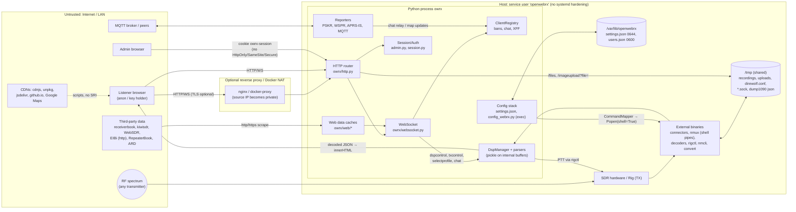

Boundary crossings that carry the most risk: (1) RF/third-party data → browser DOM (no output encoding at many sinks); (2) source-IP "privateness" → authorisation decisions; (3) admin web → OS commands/files; (4) shared `/tmp` ↔ local users.

### 7.4 Attack surface inventory

| Surface | Entry | Auth | Notes / refs |
|---|---|---|---|
| HTTP listener | `0.0.0.0`/`::` port 8073 (`openwebrx.conf`, `owrx/__main__.py:35-41`) | — | stdlib `ThreadingHTTPServer`, thread per connection, `timeout=30` (`owrx/http.py:219-221`); dual-stack when `ipv6=true` |
| TLS | `/etc/openwebrx/{key,cert}.pem` hardcoded (`owrx/__main__.py:172-178`) | — | listening socket wrapped; handshake happens in `accept()` |
| Public pages | `/`, `/map`, `/policy`, `/features`, `/files`, `/files/<name>`, `/robots.txt`, `/static/*`, `/compiled/*`, `/aprs-symbols/*` | none | `owrx/http.py:97-197` |
| Public JSON | `/status.json`, `/metrics`, `/metrics.json`, `/api/features` | none | admin e-mail, GPS, SDR types, version, counters |
| Login | `GET/POST /login`, `GET /logout` | IP-gated by `allow_remote_config` | `owrx/controllers/session.py:56-94` |
| Admin pages | `/settings/*`, `/clients`, `/services`, `/ban`, `/unban`, `/broadcast`, `/imageupload`, `/pwchange`, `POST /files/delete` | session cookie | `AuthorizationMixin` (`owrx/controllers/admin.py:32-56`); `/files/delete` checks after reading body |
| Receiver WS | `/ws/` handshake `SERVER DE CLIENT … type=receiver` | none | messages `dspcontrol`, `setsdr`, `selectprofile`, `setfrequency`, `connectionproperties`, `sendmessage`, `txcontrol` (`owrx/connection.py:319-384`) |
| Map WS | `/ws/` `type=map` | none | not counted in `max_clients`, no ban check (`owrx/connection.py:588-613`) |
| RF input | all decoders | none | parsers in `owrx/*.py`, `csdr/module/*` |
| Outbound fetches | receiverbook, kiwisdr (http), WebSDR (http), EIBi (http), RepeaterBook, ARD GitHub, radioid, whisper `speech_url`, wsprnet (http) | — | `owrx/web/*`, `owrx/reporting/*`, `owrx/transcribe.py:81-140` |
| MQTT | broker connection, inbound chat/map watches | broker creds | `owrx/mqtt.py:30-55`, TLS off by default (`defaults.py:420`) |
| Local IPC | connector IQ + control ports on localhost, nmux `127.0.0.1`, `/tmp/dream_status.sock`, `/tmp/tetra_status.sock`, `/tmp/dump1090/aircraft.json`, `/tmp/battery` | none | `owrx/source/connector.py:58-62`, `owrx/drm.py:12`, `csdr/module/tetra.py:11`, `owrx/aircraft/__init__.py:658`, `owrx/cpu.py:138` |
| CLI | `openwebrx admin …`, `config_webrx.py` (executed), `openwebrx.conf` | OS | `owrx/config/classic.py:33-35` |
| Packaging | `debian/openwebrx.postinst`, `systemd/openwebrx.service` | root at install | |

### 7.5 STRIDE summary

| Category | Threat | Main findings |
|---|---|---|
| **S**poofing | Client IP spoofing via `X-Forwarded-For`; "local" status spoofed by proxy/dual-stack; chat name impersonation via MQTT relay; ReceiverId signing oracle | SEC-01, SEC-02, SEC-36, SEC-38 |
| **T**ampering | CSRF on settings (incl. GET deletes); anon retune/profile change; RF-data injection into DOM; config-file shell injection; `/tmp` planting | SEC-04, SEC-07, SEC-14, SEC-22, SEC-25 |
| **R**epudiation | No audit log of admin actions/login failures; single shared role; logs only `logger.info` for ban/broadcast | SEC-11, SEC-33 |
| **I**nformation disclosure | Public status/metrics/files; secrets 0644 and echoed in HTML; admin file read via `?file=`; plain-HTTP UI by default | SEC-19, SEC-20, SEC-24, SEC-29 |
| **D**enial of service | Unbounded bodies, TLS accept blocking, unlimited map WS, no rate limits, thread-per-connection, expensive demodulators | SEC-15, SEC-16, SEC-17, SEC-35 |
| **E**levation of privilege | Anon → admin via XSS chains (SEC-03/04 + cookie without HttpOnly); admin → OS via shell pipes / file read; anon → transmitter | SEC-03, SEC-04, SEC-13, SEC-20, SEC-22, SEC-27 |

### 7.6 Findings

Severity scale: **Critical** (unauthenticated remote compromise of host or admin with no preconditions), **High** (unauthenticated → admin/all-users impact with realistic preconditions, or anonymous control of a transmitter), **Medium** (needs a victim action, non-default config, or admin/local access to cross a boundary), **Low** (defence-in-depth, limited impact), **Info** (design note). The "CVSS-ish" column gives the vector reasoning (AV/AC/PR/UI/Scope/Impact) rather than a computed score.

#### 7.6.1 Verification of the pre-listed findings

| Pre-listed claim | Verdict | Evidence |
|---|---|---|
| No CSRF + no SameSite | **Confirmed** | No token anywhere; cookie set as bare `SimpleCookie` (`session.py:75-76`, `controllers/__init__.py:31-32`) — no `HttpOnly`, `Secure`, `SameSite`, `Path` |
| State-changing GETs | **Confirmed** | `GET /settings/deletesdr/<id>`, `/settings/sdr/<id>/deleteprofile/<p>`, `moveprofileup/down` (`owrx/http.py:125,141-155`) |
| Logout doesn't destroy session | **Confirmed (worse)** | `logoutAction` redirects to the literal relative URL `"logout happening here"` and never touches `SessionStorage` (`session.py:90-94`) |
| `/pwchange` no old pwd + open `ref` | **Partly confirmed** | `/pwchange` is only reachable while `must_change_password` is true (`profile.py:8-9`), so "no old password" is by design for forced resets. The regular change path in General settings **does** require the current password (`settings/general.py:447-453`). Open redirect via `ref` is confirmed (`profile.py:21-24`) |
| `allow_remote_config` only gates login | **Confirmed** | Only `loginAction`/`processLoginAction`/`logoutAction` check `request.local` (`session.py:57,63,91`); an existing session cookie works from anywhere (`admin.py:38-56`) |
| XFF spoofing for bans/limits | **Confirmed** | `getIp` trusts the left-most XFF entry whenever the peer is private or in `trusted_proxies` (`owrx/client.py:165-174`) |
| Default magic key "memagic" | **Confirmed** | `defaults.py:359`; compared with `==` (`connection.py:352-354,391-392`) |
| Anonymous `txcontrol` | **Confirmed** (gated by `rig_enabled` + `rig_tx_enabled`, both default `False`, `defaults.py:447-448`) | `connection.py:371-378` → `rigcontrol.py:356-361` |
| Anonymous `setsdr` | **Confirmed** | `connection.py:334-336`; no lock/key check on source switch |
| No WS Origin check / frame size / rate limits | **Confirmed (nuanced)** | No `Origin`/`Sec-WebSocket-Version` check (`websocket.py:71-87`). Inbound frames are effectively capped at 65 535 bytes because the 64-bit length form (127) is not implemented (`websocket.py:216-220`); no rate limiting; no fragmentation support |
| Chat unbounded | **Confirmed** | No length/rate limit (`client.py:114-152`); names sanitised to `\w` only (`client.py:123`); text escaped client-side (`htdocs/lib/Chat.js:29-34`) |
| Public `/metrics`, `/status.json`, `/files` | **Confirmed** | `MetricsController`, `StatusController`, `FilesController`/`FileController` have no auth (`http.py:100,109-110,188-189`) |
| Map WS leaks Google/OWM keys | **Confirmed (Low)** | `connection.py:593-608`; Google Maps JS keys are inherently client-side (must be referrer-restricted); OWM key exposure is avoidable |
| Unescaped broadcast innerHTML | **Confirmed** | `/broadcast` → `write_log_message` → `divlog()` → `innerHTML +=` (`clients.py:106-116`, `htdocs/openwebrx.js:1113-1115,1221-1228`) |
| `random` for passwords | **Confirmed (Low)** | `random.choices` 10×[A-Za-z0-9] (`owrx/admin/commands.py:37-39`) |
| Non-constant-time hash compare | **Confirmed (Low)** | `dk.hex() == self._hash` (`users.py:80`), cleartext `==` (`users.py:48`) |
| Cleartext password class | **Confirmed** | `CleartextPassword` still loadable from `users.json` (`users.py:23-24,38-54`) |
| `storage.deleteFile` unanchored regex | **Confirmed (Low)** | `re.match` without `$` (`storage.py:49`); exploitation needs an existing directory whose name matches the pattern, because Linux path resolution requires `…/X-1-1.txt/..` to be a directory |
| Unpinned CDN scripts without SRI | **Confirmed** | see SEC-28 |
| Plain-HTTP fetches | **Confirmed** | EIBi `eibi.py:341`, KiwiSDR `receivers.py:134`, WebSDR `receivers.py:95`, WSPRnet `reporting/wsprnet.py:68` |
| Client-only enforcement of `session_timeout` / recording | **Confirmed** | `session_timeout` = `<meta http-equiv=refresh>` in `htdocs/include/header.include.html:24-25`; `allow_audio_recording` only toggles UI (`openwebrx.js:973-974`) |
| WiFi applies system changes, default AP pwd `openwebrx` | **Confirmed** | `wifi.py:40-64` (`nmcli` with argv lists — no shell); `defaults.py:470-472` (`wifi_enable_ap=False` by default) |
| `command.py` no escaping + `Popen(shell=True)` | **Confirmed, but web path mitigated** | `command.py:57-69`; `source/__init__.py:363-372` uses shell only for multi-command pipelines = `DirectSource` (Perseus, FiFi). FiFi `device` is validated by `AlsaDeviceValidator` (`form/input/validator.py:86-89`); Perseus maps numeric/flag fields only. Residual risk = config files / future sources (SEC-22) |
| Connector control-socket newline injection | **Confirmed (Low)** | `"{prop}:{value}\n"` (`source/connector.py:37-44`); values are admin/profile props or numeric WS input |
| `getAvailablePort` TOCTOU, all interfaces | **Confirmed (Low)** | binds `""`, closes, then hands the port number to a child (`owrx/socket.py:4-10`) |
| `config_webrx.py` exec'd | **Confirmed (Info)** | `config/classic.py:33-35` |
| `settings.json` secrets, non-atomic, no chmod | **Confirmed** | `config/dynamic.py:38-42` (direct `open("w")`, comment claims otherwise); postinst creates it without `chmod` (`debian/openwebrx.postinst:34-37`) |
| direwolf conf in predictable `/tmp` path with passcode + interpolation | **Confirmed** | `aprs/direwolf.py:139-144,157-177` (`openwebrx_direwolf_<id(self)>.conf`, `IGLOGIN {callsign} {password}`, `comment="{comment}"`) |
| `pickle.loads` internal | **Confirmed** | `dsp.py:916-935`, `csdr/module/__init__.py:101-121` — see SEC-27 |
| TLS only via hardcoded paths | **Confirmed** | `__main__.py:172-178` |
| Admin e-mail in RepeaterBook UA | **Confirmed** | `web/repeaters.py:149` |
| Fixed `/tmp/*` paths (tetra, dream, dump1090/978, battery, satdump) | **Confirmed** |  `/tmp/dream_status.sock` (`drm.py:12`), `/tmp/dump1090\|dump978/aircraft.json`, `/tmp/battery`, `/tmp/satdump` |
| `storage.convertImage` staticmethod `self` bug | **Confirmed (robustness)** | `storage.py:114-115` (only hit for relative paths) |
| `users.json` non-atomic write | **Confirmed** | `users.py:185-197`; also `chmod` after write → brief umask-permission window |
| `PasswordException` KeyError | **Confirmed (robustness)** | `users.py:27` uses `d["type"]` |

#### 7.6.2 Findings table

| ID | Title | Sev. | CVSS-ish rationale | Preconditions | Impact | Location | Fix (current code) | Requirement (rewrite) |
|---|---|---|---|---|---|---|---|---|
| SEC-01 | IPv4 clients on the dual-stack socket may be classified as "private" | **High** (unverified, Python-version dependent) | AV:N/AC:L/PR:N/UI:N; bypasses an access-control setting and enables SEC-02/03 for every Internet client | `ipv6 = true` (shipped default, `openwebrx.conf`), Linux `bindv6only=0`, CPython older than the CVE-2024-4032 fix (3.12.4 / 3.11.10 / 3.10.15 / 3.9.20 backports) whose `IPv6Address.is_private` lists `::ffff:0:0/96`. On the reviewed workstation (CPython 3.13.5) `ip_address('::ffff:8.8.8.8').is_private` is `False`. The target distro's Python was not checked | Every IPv4 peer appears as `::ffff:a.b.c.d` and `is_private` returns True: `allow_remote_config=false` is ineffective and every client's `X-Forwarded-For` is trusted | `owrx/http.py:236-239`, `owrx/client.py:167-172`, `owrx/controllers/clients.py:70` (strips `::ffff:` – shows such addresses occur) | Normalise with `ipaddress.ip_address(x).ipv4_mapped or …` before any check; decide "local" on an explicit allow-list (`127.0.0.0/8`, `::1`, configured CIDRs), not `is_private` | Network ACLs must be explicit CIDR lists, evaluated on canonicalised addresses; must be unit tested for v4-mapped, ULA and link-local |
| SEC-02 | Implicit trust of any private-IP peer and of left-most `X-Forwarded-For` | **High** | AV:N/AC:L/PR:N/UI:N in reverse-proxy / Docker deployments; Integrity of bans/limits/auth gating | Behind a reverse proxy on the same host or Docker port-mapping (source IP becomes `127.0.0.1`/`172.17.0.1`), or attacker on LAN/hotspot | (a) `allow_remote_config=false` bypassed for everyone (proxy peer is private). (b) Client chooses its own IP string via XFF (left-most value, never validated): ban evasion, `max_clients_per_ip` bypass, banning arbitrary IPs, spoofed IPs in MQTT client reports | `owrx/http.py:235-240`, `owrx/client.py:165-174`, `owrx/config/core.py:72-79` | Only honour XFF from `trusted_proxies`; take the right-most untrusted hop; validate it parses as an IP; compute `local` from the *resolved* client IP | Explicit trusted-proxy list; RFC 7239 `Forwarded` parsing; never derive authorisation from network location alone |
| SEC-03 | Stored XSS in admin `/clients` page via client-controlled IP and chat name sinks | **High** (chain) | AV:N/AC:L/PR:N/UI:R (admin opens /clients); S:C – admin session hijack because cookie lacks HttpOnly | SEC-01 or SEC-02 precondition so that XFF is honoured; any anonymous WS client | The XFF string is inserted unescaped into `<a href="geoip">…</a>` and `<button value="…">` and into `geoip_url.format(ip)`. Script in the admin origin can drive `/settings` (incl. SDR command settings, reporting credentials) | `owrx/controllers/clients.py:58-81`; IP from `client.py:172` | HTML-escape every interpolated value (`html.escape(..., quote=True)`), URL-encode for `href`; validate IP format at ingestion | Server-side templating with auto-escaping by default; IPs stored as typed values |
| SEC-04 | DOM XSS from RF-decoded data rendered with `innerHTML`/jQuery `.html()`/`$(string)` without encoding | **High** | AV:Adjacent-RF (anyone with a transmitter; Meshtastic/LoRa on licence-free ISM bands, low-power FM+RDS)/AC:L/PR:N/UI:N (panel open) or UI:R (map pop-up); S:C – runs in every listener's browser on the receiver origin; with an admin also browsing the receiver, cookie theft | Relevant decoder running (background service or a listener tuned to it) | Script execution in all connected browsers. Verified unescaped sinks: **Meshtastic** `longName`, `nickName`, `dstNickName`, all `msg.data` values (`htdocs/lib/MessagePanel.js:1129-1134,1142-1158,1170-1172`; parser passes names verbatim `owrx/meshtastic.py:161,182,312,322,360`). **DRM** programme `label` and `text` (`MetaPanel.js:853-856`). **RDS RadioText+ homepage** concatenated into an `href="…"` attribute → attribute break-out (`MetaPanel.js:495-501`). **HD Radio** `pgm.name` and **DAB** programme labels into `<option>` (`MetaPanel.js:641-645,704-706`; limited by option parsing and label length). **APRS** object/item names (≤9 chars, HTML injection) via `Utils.linkify*` (`MessagePanel.js:258`, `Utils.js:91-104,125-130`). **HFDL/VDL2/ACARS** non-ICAO `flight`, `origin`, `destination`, `msgtime` (`MessagePanel.js:413-438`; map `MapMarkers.js:838-848,893-897`). **ISM** `id`/`model`/attributes (`MessagePanel.js:719-751`). **JS8** message text (`Js8Threads.js:47-48`) (unverified: depends on JS8 alphabet). **TETRA** fields (`MetaPanel.js:947-990`). Escaped correctly: APRS comment, POCSAG/FLEX text, HFDL message, chat, Meshtastic message text, map Meshtastic names, raw CW/RTTY/PSK stream (`openwebrx.js:1706-1717`), DMR/YSF/D-Star/NXDN/M17/P25 meta (`.text()`), RDS PS/RT (`.text()`) | (listed in Impact) | Encode at every sink; replace `Utils.linkify` string building with DOM construction (`textContent`, `setAttribute`) and URL allow-listing (`https?:` only); add CSP (`script-src 'self'`) | All untrusted text must be rendered through an auto-escaping view layer; decoded data is untrusted by type; enforce strict CSP; fuzz parsers → UI with HTML metacharacters |
| SEC-05 | XSS from third-party web data (receiver lists, EIBi, repeaters) in map pop-ups and bookmark bar | **Medium** | AV:N (list entry owner or MitM on plain HTTP)/AC:L/PR:N/UI:R (click marker / view bookmarks) | Map receivers layer or `eibi_bookmarks_range`/`repeater_range` > 0 | KiwiSDR `antenna` (truncated to 24 chars – enough for a short event-handler payload) and band antenna rendered raw (`MapMarkers.js:283-285,303-319`); `url` used verbatim in `href` (allows `javascript:`) and as title via `Utils.linkify` (`MapMarkers.js:261`, `Utils.js:91-104`); `logourl` concatenated into `` attribute (`MapMarkers.js:273-275`); EIBi schedule names (`MapMarkers.js:354-363`); bookmark names (server bookmarks incl. EIBi/RepeaterBook) inserted raw (`BookmarkBar.js:120,244`). EIBi and KiwiSDR/WebSDR lists are fetched over **plain HTTP** (`eibi.py:341`, `receivers.py:95,134`) | (listed in Impact) | Escape, URL-scheme allow-list, fetch over HTTPS; validate/normalise scraped records server-side | Treat all external datasets as untrusted input with schema validation; HTTPS + certificate validation mandatory |
| SEC-06 | No CSRF protection; state-changing GET endpoints; JSON endpoints accept any Content-Type | **Medium** | AV:N/AC:L/PR:N/UI:R (logged-in admin visits attacker page); I:H | Admin logged in; for POST: browsers without Lax-by-default (Firefox, Safari) or Chrome within its 2-minute "Lax+POST" window; for GET: all browsers (top-level navigation sends Lax cookies) | Delete SDR devices/profiles, reorder profiles via GET; change any setting via form POST; `text/plain` form bodies can be valid JSON → `/broadcast` (→ SEC-07), `/ban`, `/unban`, `/files/delete`, bookmark `POST`/`DELETE` | `owrx/http.py:111-196`; JSON parsing without content-type check: `clients.py:85,97,108`, `file.py:91`, `settings/bookmarks.py` | Per-session CSRF token on all state-changing requests; convert deletes/moves to POST; require `Content-Type: application/json`; set `SameSite=Strict` | Synchronizer/double-submit tokens; safe methods never mutate; Origin/Referer check on mutating requests |
| SEC-07 | Admin broadcast and server log messages rendered as HTML in every client | **Medium** | AV:N/PR:H or PR:N via SEC-06 CSRF; S:C to all listeners | Admin (or CSRF against admin) | Arbitrary HTML/script pushed to all connected receivers via `log_message` → `divlog()` `innerHTML +=` | `clients.py:106-116`, `client.py:160-162`, `openwebrx.js:1089-1115,1221-1228` | Send as text; render with `textContent` | Typed message channel (text vs. trusted markup), escaped by default |
| SEC-08 | Open redirects after login and forced password change | **Low** | AV:N/UI:R; phishing aid | Victim follows crafted `/login?ref=` or `/pwchange?ref=` | `startswith("/")` accepts protocol-relative `//host` (and `/\host` in browsers); `/pwchange` `ref` not checked at all; login forwards `ref` into `/pwchange` | `session.py:77-85`, `profile.py:21-24` | Accept only same-origin relative paths (`^/(?![/\\])`) or a fixed allow-list | Redirect targets must be route names or validated same-origin paths |
| SEC-09 | Session management weaknesses | **Medium** | AV:N; session theft persists | Cookie stolen (XSS, plain HTTP sniffing) | Cookie lacks `HttpOnly`, `Secure`, `SameSite`; logout is a no-op (`session.py:90-92`); sessions not invalidated on password change or user disable (disable is checked per request, OK); 6 h sliding lifetime with no absolute cap (`session.py:16,48-52`); in-memory store lost on restart; expired sessions only purged on access | `session.py:14-94`, `admin.py:11-29`, `controllers/__init__.py:24-32` | Set cookie attributes; implement logout (delete server session + expire cookie); rotate on login; invalidate all on password change | Server-side sessions with idle + absolute timeout, rotation, `__Host-` cookie prefix, logout everywhere |
| SEC-10 | Login brute force, user enumeration, weak password handling | **Medium** | AV:N/AC:L/PR:N; online guessing | Login reachable (remote config allowed, or SEC-01/02) | No rate limiting/lock-out/failure logging; PBKDF2 only computed when the user exists → timing oracle for usernames (`session.py:70-73`); PBKDF2-SHA256 100 000 iterations (below current OWASP guidance of 600 000) (`users.py:59`); non-constant-time comparison (`users.py:48,80`); cleartext password encoding still accepted; no password policy (empty-length only checked); generated initial password uses non-CSPRNG `random` (`admin/commands.py:37-39`); each guess costs ~100 ms CPU on an unbounded thread pool (DoS amplifier) | as listed | `hmac.compare_digest`; dummy hash for unknown users; per-IP/per-user throttling; `secrets.choice`; raise iterations or use argon2id; drop cleartext class | Argon2id/scrypt, constant-time compare, throttling + audit logging, MFA optional |
| SEC-11 | Default `magic_key` "memagic" and weak key semantics | **Medium** (config) | AV:N/AC:L/PR:N | Operator locked profiles but kept default key | Anyone knowing the public default can switch locked profiles; `setfrequency` gated by same key when `allow_center_freq_changes=true` | `defaults.py:359-360`, `connection.py:345-355,386-397` | Generate random key on first run; constant-time compare; rate-limit attempts | No shared static secrets; per-user tokens/roles for privileged listener actions |
| SEC-12 | Anonymous transmitter control | **High** (when enabled; default off) | AV:N/AC:L/PR:N/UI:N; physical/legal impact | `rig_enabled=true` and `rig_tx_enabled=true` | Any anonymous WS client can key PTT (`txcontrol`), on a frequency derived from its own `offset_freq`; no key/auth, no TX timeout, no single-operator lock; every DspManager starts its own `rigctl` process so multiple listeners fight over the rig | `connection.py:371-378`, `dsp.py:469,594`, `rigcontrol.py:312-361,391-410` | Require admin session or magic key for TX; single TX owner; hard TX timeout; frequency allow-list (licensed bands) | TX is a privileged, audited, rate-limited capability with explicit operator identity and a watchdog |
| SEC-13 | Anonymous control of shared receiver state; robot-ban crash | **Low** | AV:N/PR:N; availability/integrity for other listeners | Default config | Any listener may switch profiles (affects everyone on that SDR), `setsdr` to any source (starts on-demand sources), choose CPU-heavy demodulators. Robot detection at connect references `self.stack` before it exists → `AttributeError` instead of a ban (`connection.py:168-171` vs `185`) | `connection.py:334-343,386-443` | Fix ordering; per-source policy for anonymous switching | Explicit policy model for shared-resource actions (who may retune, cooldowns) |
| SEC-14 | WebSocket hardening gaps | **Medium** (DoS) | AV:N/AC:L/PR:N/A:H | None | No Origin check (cross-site WS hijacking; limited impact because WS is unauthenticated); unmasked client frames accepted; no message rate limit; per-frame Python byte-wise unmasking up to 64 KiB; new `threading.Timer` per read (`websocket.py:288-294`); handshake-less connections hold a thread + pipe indefinitely; **map connections are not counted in `max_clients` and skip ban checks** (`connection.py:588-613`) | `owrx/websocket.py:60-303`, `connection.py:630-662` | Origin allow-list; count/ban map clients; cap pre-handshake time; rate-limit messages | Use a maintained WS server library; global and per-IP connection quotas; backpressure |
| SEC-15 | Unbounded request bodies read before authorisation | **Medium** | AV:N/AC:L/PR:N/A:H | `/login` reachable or any `POST /files/delete` | `get_body()` trusts `Content-Length` and reads it fully into memory; `FilesController.delete` reads before checking auth (`file.py:89-91`); `processLoginAction` reads anonymous bodies (`session.py:67`). Missing `ref`/body raise uncaught exceptions (`session.py:87`) | `controllers/__init__.py:53-59` | Global max body size; check auth before reading | Framework-level body limits, streaming parsers, request timeouts |
| SEC-16 | TLS handshake performed in the accept loop | **Medium** (DoS, TLS deployments) | AV:N/AC:L/PR:N/A:H | TLS enabled via `/etc/openwebrx/*.pem` | Wrapping the listening socket makes `accept()` perform the handshake on the main thread with no timeout; one client that opens TCP and stalls blocks all new connections (unverified against a live instance; standard `ssl`/`socketserver` behaviour) | `__main__.py:172-178` | `do_handshake_on_connect=False` and handshake in the worker thread with timeout; or terminate TLS at a proxy | TLS via a hardened server/proxy; minimum TLS 1.2, cert reload, HSTS |
| SEC-17 | Chat abuse | **Low** | AV:N/PR:N | `allow_chat=true` (default) | No length or rate limit; messages fan out to all clients and to MQTT/reporting (`client.py:104-152`); MQTT-relayed names (`name@source`) bypass the `\w` sanitiser (`mqtt.py:45-50`) — rendering is escaped | as listed | Length cap, per-client rate limit, moderation hooks | Same, plus abuse reporting |
| SEC-18 | Public information disclosure | **Low** | AV:N/PR:N/C:L | Default | `/status.json`: admin e-mail, precise GPS, ASL, SDR types/profiles, version (`status.py:30-44`); `/metrics(.json)`: internal counters; `/features`, `/api/features`: installed binaries/versions; `/files`: all recordings and decoded images/text listed and downloadable (`file.py:13-99`); map WS sends `google_maps_api_key`, `openweathermap_api_key` (`connection.py:593-608`); RepeaterBook User-Agent carries admin e-mail (`web/repeaters.py:149`) | as listed | Config switches for each; coarse GPS; auth for metrics; OWM via server proxy | Privacy-by-default flags per endpoint; secrets never sent to browsers unless inherently public and referrer-restricted |
| SEC-19 | Path traversal in `/imageupload?file=` (admin arbitrary file read) | **Medium** | AV:N/PR:H/C:H; crosses admin → OS boundary (e.g. read `users.json`, SSH keys of service user) | Admin session (or XSS in admin origin, SEC-03/04) | `getFilePath` concatenates the raw query value onto the temp dir; no normalisation (router only normalises the path, not the query) | `controllers/imageupload.py:213-226` | Accept only `^(receiver_avatar\|receiver_top_photo)-[0-9a-f]{32}\.(png\|jpg\|webp)$`; resolve and verify under temp dir | All file access via IDs mapped server-side; `realpath` containment checks |
| SEC-20 | Weak filename handling in storage and image import | **Low** | AV:N/PR:H | Admin | `deleteFile` uses unanchored `re.match` (`storage.py:48-56`); `handle_image` copies `tmp/<value>` where value only has to start with the image id and end in `.[a-z]{3,}` (`settings/general.py:417-441`) | as listed | `re.fullmatch` + basename check | as SEC-19 |
| SEC-21 | Shell pipelines built from unescaped config values | **Low** (defence in depth) | AV:L or PR:H; code execution as service user | Write access to `settings.json`/`config_webrx.py`, or a future source type with an unvalidated string field | `CommandMapper` joins values with spaces and only quotes values containing a space (no escaping of quotes/metacharacters) (`command.py:10-17,57-69`); multi-command sources run via `Popen(shell=True)` (`source/__init__.py:363-372`); single commands use `shlex.split` → argument injection into connector argv (e.g. `device`, `remote`, `antenna`, `soapy_settings`) | as listed | Build argv lists; connect pipeline stages with `Popen(stdout=PIPE)` instead of a shell; `shlex.quote` at minimum | Never invoke a shell; typed, validated device parameters; integration tests with metacharacters |
| SEC-22 | Connector control-socket protocol injection | **Low** | AV:N/PR:H or AV:L | Admin-controlled profile values containing newlines; or any local user (control port on localhost has no auth) | `"{prop}:{value}\n"` lets a value add extra commands; local users can connect to connector control/IQ ports | `source/connector.py:37-62`, `socket.py:4-10` | Reject `\n`/`:` in values; Unix sockets with 0600 perms | Authenticated IPC (Unix sockets with peer-cred or per-process token) |
| SEC-23 | `config_webrx.py` executed as Python | **Info** | AV:L | Write access to the file | Arbitrary code at startup (by design of the legacy format) | `config/classic.py:33-35` | Document; check ownership/perms before loading | Data-only config formats |
| SEC-24 | Secrets storage | **Medium** | AV:L/PR:L/C:H | Local account on the host; admin page viewer | `settings.json` created by postinst without `chmod` → typically 0644 world-readable with APRS-IS passcode, MQTT password, API keys, WiFi PSKs (`debian/openwebrx.postinst:34-37`); written non-atomically (`config/dynamic.py:38-42`); `users.json` chmod applied after write (`users.py:191-194`); direwolf config with `IGLOGIN` passcode written to `/tmp` with default umask (`aprs/direwolf.py:139-177`); `PasswordInput` re-renders stored secrets into page HTML (`form/input/__init__.py:117-121`); WiFi passwords use plain `TextInput` (`settings/wifi.py:27-51`) | as listed | `os.open(…, 0o600)` + atomic rename; postinst `chmod 0600`; never echo secrets (write-only fields) | Secrets in a dedicated store/file 0600 or OS keyring; write-only secret fields in UI; atomic writes |
| SEC-25 | Shared `/tmp` and fixed paths | **Medium** (local) | AV:L/PR:L | Another local account (multi-user host, other compromised service) | Default `temporary_directory=/tmp` (`openwebrx.conf`, `config/core.py:14`) and no `PrivateTmp`: other users can plant files matching the `/files` pattern (served publicly, content spoofing), pre-create/occupy `/tmp/dream_status.sock`, `/tmp/tetra_status.sock`, `/tmp/dump1090/aircraft.json`, `/tmp/battery` to feed fake data (feeds SEC-04 sinks for DRM/TETRA/ADS-B), and read recordings/uploads. Symlink/pre-creation attacks on `Storage.newFile` / direwolf conf are largely blocked by kernel `fs.protected_symlinks/protected_regular` defaults (unverified on target) | `storage.py:32-45`, `aprs/direwolf.py:157-177`, `drm.py:12`, `csdr/module/tetra.py:11`, `aircraft/__init__.py:658`, `cpu.py:138`, `csdr/module/satellite.py:8-13` | Use a private runtime dir (`/run/openwebrx`, `RuntimeDirectory=`), `O_EXCL\|O_NOFOLLOW`, `PrivateTmp=yes` | All runtime files under a service-owned 0700 directory; no fixed paths in world-writable dirs |
| SEC-26 | systemd/packaging hardening absent | **Low** | Limits blast radius only | — | Unit has only `User/Group`, `HOME=/tmp`; no `NoNewPrivileges`, `ProtectSystem`, `ProtectHome`, `PrivateTmp`, `RestrictAddressFamilies`, `CapabilityBoundingSet`, `MemoryMax`, `TasksMax` (`systemd/openwebrx.service`). Service user added to `plugdev`, `perseususb` (`postinst:14-20`); `HOME=/tmp` makes per-user caches/configs of child tools land in shared `/tmp` | as listed | Add hardening directives; `StateDirectory=`, `RuntimeDirectory=`; real home | Ship least-privilege unit/container (read-only rootfs, device allow-list) |
| SEC-27 | Pickle deserialisation on DSP output buffers | **Medium** (design risk; reachability unverified) | Would be AV:Adjacent-RF/PR:N → RCE if reachable | A decoder chain that writes raw (non-pickled) bytes into a buffer consumed by `_unpickle` and can emit `0x80 0x03–0x05` at the start of a read chunk | `_unpickle` decides by sniffing the first two bytes whether to call `pickle.load` (`dsp.py:916-935`). Raw-text paths exist (e.g. PSK31 `VaricodeDecoder`, RTTY `BaudotDecoder`, CW — `csdr/chain/digimodes.py:69-150`); whether any can emit byte 0x80 depends on the C++ decoders. **Checked afterwards in the csdr sources:** the Varicode table only covers 0x00–0x7F (`ext/csdr/include/varicode.hpp`), the CW decoder maps codes onto a printable-ASCII table (`ext/csdr/src/lib/cw.cpp:39-48`), and Baudot and CCIR-476 write characters looked up in their tables (`baudot.cpp:44`, `ccir476.cpp:54`). No RF-to-0x80 path was found, so the risk is a latent design flaw rather than an exploitable one today. It stays Medium because a future decoder could open the path. `PickleModule` unconditionally unpickles its input (`csdr/module/__init__.py:101-121`) but only from internal Python producers | as listed | Replace pickle with a length-prefixed JSON/msgpack framing and an explicit message-type byte | No native-object deserialisation across any buffer; typed IPC schema |
| SEC-28 | Front-end supply chain | **Medium** | AV:N (CDN compromise) / S:C | Map or features page loaded | No SRI on any external script; `leaflet.geodesic` loaded **without version** from jsDelivr (`map-leaflet.js:260`); `L.Maidenhead.js` from a mutable `github.io` page (`map-leaflet.js:141`); leaflet/terminator/textpath/moment/showdown pinned but no SRI (`map-leaflet.js:256-270`, `map-*.html:10`, `features.html:6`); Google Maps loaded with key; plugin loader accepts arbitrary `http(s)://` URLs, including plain HTTP (`plugins.js:29-35,117`); bundled Bootstrap **4.5.0** (EOL; affected by CVE-2024-6531, carousel `data-slide` XSS, low relevance as carousel unused – unverified) (`htdocs/lib/bootstrap.bundle.min.js`) | as listed | Vendor or pin + SRI; drop unversioned URLs; restrict plugins to HTTPS/same-origin | Locked dependency manifest, SRI/self-hosting, CSP `script-src` allow-list, SCA in CI |
| SEC-29 | Transport security | **Low–Medium** | AV:N MitM | Default HTTP deployment; HTTP upstreams | UI and admin login served over plain HTTP unless operator provides certs (no redirect/HSTS); EIBi, KiwiSDR, WebSDR, WSPRnet over HTTP; APRS-IS login over plain TCP (passcode); MQTT TLS off by default; `urlopen` without timeout for scrapers/RepeaterBook/whisper (`web/__init__.py:34-37`, `web/repeaters.py:165`, `transcribe.py:140`) | as listed | HTTPS upstreams; timeouts; documented TLS setup | TLS by default (ACME or self-signed bootstrap), HSTS, outbound timeouts |
| SEC-30 | No HTTP security headers | **Low** | AV:N/UI:R | — | No CSP, `X-Frame-Options`/`frame-ancestors` (settings pages can be framed → clickjacking), `X-Content-Type-Options`, `Referrer-Policy` (grep finds none in `owrx/`) | `owrx/controllers/__init__.py:9-32` | Add headers centrally | Secure-headers middleware |
| SEC-31 | Client-only enforcement | **Info** | — | — | `session_timeout` and `allow_audio_recording` are UI hints only | `header.include.html:24-25`, `openwebrx.js:973-974` | Server-side disconnect after timeout | Policies enforced server-side |
| SEC-32 | No RBAC, no audit trail | **Info/Low** | — | Multiple admins | Every account is full admin; no record of who changed what; login failures not logged | `admin.py:38-39` | Log auth events and admin actions | Roles (viewer/operator/admin), audit log |
| SEC-33 | WiFi hotspot defaults | **Medium** (when enabled) | AV:Adjacent/AC:L | `wifi_enable_ap=true` | Default PSK `openwebrx` (`defaults.py:470-472`); hotspot clients (192.168.10.0/24) are "private" → may log in even with `allow_remote_config=false` and have XFF trusted (SEC-02) | `wifi.py:40-64` | Force unique PSK on enable | Device-unique credentials, no implicit LAN trust |
| SEC-34 | Unbounded numeric DSP parameters from anonymous clients | **Low** (unverified magnitude) | AV:N/PR:N/A:L | — | Validators enforce types only: `output_rate`, `hd_output_rate`, `low_cut`, `high_cut`, `offset_freq` have no ranges (`dsp.py:451-468`); `setfrequency` accepts any JSON number incl. `Infinity` and booleans (`connection.py:345-355`) | as listed | Range-check against profile sample rate and supported output rates | Schema validation with ranges for every client message |
| SEC-35 | Unescaped device log in admin SDR page | **Low** | AV:L/PR:H | Connector output containing markup | `HistoryHandler` lines inserted in `<pre>` without escaping | `settings/sdr.py:285-298`, `log/__init__.py:31-52` | `html.escape` | Auto-escaping templates |
| SEC-36 | ReceiverId endpoint acts as signing oracle; malformed header raises | **Info** | — | — | Any client can obtain HMAC responses to arbitrary challenges (by design for receiverbook, but enables relay); invalid `Authorization` header raises `KeyException` (uncaught) | `controllers/receiverid.py`, `owrx/receiverid.py:55-80` | Catch exception; document | Challenge-response bound to requester origin/time |
| SEC-37 | Privacy of listeners | **Low** | — | `report_clients=true` / MQTT | Client IPs, connect/disconnect, ban state and chat text are published to the reporting engine/MQTT (`client.py:90-111`); `/clients` links IPs to an external geo-IP service (`clients.py:69-74`, `defaults.py:380`) | as listed | Opt-in, hash/truncate IPs | Data-minimisation and retention policy |
| SEC-38 | Inbound MQTT data trusted | **Low–Medium** | AV:N via broker | `mqtt_*` watches enabled; shared/public broker | Remote OWRX peers' chat, aircraft, APRS/AIS, sonde and Meshtastic updates are merged without schema validation into chat and the map, propagating SEC-04 payloads across instances; missing keys raise exceptions (`mqtt.py:45-55`) | `owrx/mqtt.py:30-60` | Validate schema; TLS + auth | Signed/validated federation messages |
| SEC-39 | Robustness bugs with security side-effects | **Info** | — | — | Failed login without `ref` → `KeyError` (`session.py:87`); `PasswordException` path `KeyError` (`users.py:27`); `convertImage` uses `self` in a staticmethod (`storage.py:114-115`); LoRa APRS warning uses undefined `text` (`owrx/lora.py:65`); outbound WS text length uses `len(str)` not byte length (`websocket.py:127-129`; safe today only because `json.dumps` defaults to ASCII) | as listed | Fix | Static typing + tests |

### 7.7 Positive controls observed

- Passwords stored as salted PBKDF2-HMAC-SHA256 (32-byte `os.urandom` salt) (`users.py:57-88`); `users.json` chmod 0600 after write and created 0600 by postinst (`users.py:194`, `postinst:28-31`).
- Session IDs are `uuid4()` (CSPRNG, 122 bits) (`session.py:27-28`); disabled users and `must_change_password` users are refused on every request (`admin.py:38-39`).
- Changing the admin password in General settings requires the current password (`settings/general.py:447-453`); generated CLI passwords force a change on first login (`admin/commands.py:23-27`).
- Debconf admin password is unregistered after use (`postinst:55`).
- Router normalises paths with `posixpath.normpath` before matching, so `/static`, `/aprs-symbols`, `/files` are not traversable (`http.py:204-209`); `/files/<name>` is constrained by an anchored route regex (`http.py:189`, `storage.py:17`).
- Client-settable DSP properties go through a key allow-list with type validators; `mod`/`secondary_mod` validated against known modes (`dsp.py:451-470`).
- Settings form inputs HTML-escape attribute values (`form/input/__init__.py:71`); validators exist for ALSA device names and rigctl device strings (`form/input/validator.py:86-95`).
- Most subprocesses use argv lists without a shell (rigctl, nmcli, ImageMagick `convert`, direwolf, feature probes, decoders via `ExecModule`) (`rigcontrol.py:404-410`, `wifi.py:46-64`, `storage.py:122-138`, `feature.py:185-199`).
- nmux binds `127.0.0.1` explicitly (`source/direct.py:36`); connector help text states rtl_tcp compat port is local only.
- Image upload: per-type size limits, magic-byte checks (PNG/JPEG/WebP), server-generated random file names (`imageupload.py:228-271`).
- Many decoded fields are escaped or set via `.text()` (APRS comments, pager text, chat, DMR/YSF/D-Star/NXDN/M17/P25 meta, RDS PS/RT, map Meshtastic names); raw digimode text stream filtered to printable ASCII and entity-encoded (`openwebrx.js:1706-1717`).
- Back-pressure: per-client send queue of 100 with disconnect on overflow (`connection.py:36,79-85`), 10 s select timeout on writes (`websocket.py:149`), bounded decoder queue (`audio/queue.py:115`, `defaults.py:384-385`), `max_clients`/`max_clients_per_ip`, temporary IP bans, robot heuristic (buggy, SEC-13).
- `json.dumps(..., allow_nan=False)` on outbound WS (`websocket.py:124`).
- Opt-in for risky features: TX, WiFi AP, center-frequency changes, MQTT, iGate are all off by default (`defaults.py`).
- Login redirect has a (partial) external-URL check (`session.py:81-83`); `robots.txt` hides admin routes.

### 7.8 Security requirements for a re-implementation (checklist)

**Identity, session, authorisation**
- [ ] Roles at minimum: anonymous listener, privileged listener (replaces magic key), operator (TX/retune), admin; every WS message and HTTP route mapped to a role in one policy table.
- [ ] Network-location trust only via explicit CIDR allow-lists on canonicalised addresses (handle IPv4-mapped IPv6); `trusted_proxies` mandatory for honouring `Forwarded`/`X-Forwarded-For`; right-most untrusted hop.
- [ ] Sessions: CSPRNG IDs, `HttpOnly; Secure; SameSite=Strict; Path=/` (`__Host-` prefix when TLS), idle + absolute timeout, rotation on login/privilege change, working logout, invalidation on password change, persistent or explicitly ephemeral store.
- [ ] Password hashing with Argon2id (or scrypt/PBKDF2 ≥ 600k), constant-time compare, dummy-hash for unknown users, throttling/lock-out, audit log of auth events; no cleartext password format; CSPRNG for generated secrets.
- [ ] CSRF tokens (or strict Origin checking) on all state-changing requests; no state change on GET; JSON endpoints require `application/json`.
- [ ] Redirect targets restricted to same-origin relative paths.

**Input/output handling**
- [ ] Single schema-validated message layer for WebSocket (types + ranges), reject unknown fields, per-message size limits.
- [ ] All untrusted data (RF-decoded, third-party lists, MQTT, chat, client IP/headers, log lines) rendered via auto-escaping templates/DOM APIs only; URL attributes restricted to `https?:`; no string-built HTML.
- [ ] Strict CSP (`default-src 'self'`; enumerated map/tile origins; no `unsafe-inline`), `frame-ancestors 'none'` for admin, `nosniff`, `Referrer-Policy`.
- [ ] No native-object serialisation (pickle etc.) in any data path; typed binary/JSON framing between DSP stages.
- [ ] Never spawn shells; argv arrays only; typed and validated device parameters; IPC with external tools over authenticated/peer-checked channels (Unix sockets 0600 in a private runtime dir).
- [ ] File access only via server-side IDs; `realpath` containment; `O_NOFOLLOW|O_EXCL` for creation; anchored filename patterns.

**Availability / abuse**
- [ ] Global and per-IP connection quotas covering *all* socket types (receiver, map, pre-handshake), handshake timeout, message rate limits, request body size limits, slow-client protection.
- [ ] Bounded CPU per client: cost model for demodulators; cap concurrent heavy decoders; anonymous retune/profile cooldowns.
- [ ] Chat: length/rate limits, moderation, opt-out of federation.
- [ ] TLS termination that does not block the accept loop; outbound HTTP with timeouts and size caps.

**Transmitter safety**
- [ ] TX requires authenticated operator role, single-owner lock, watchdog/TX timeout, band allow-list, audit log, emergency stop.

**Secrets & configuration**
- [ ] Secrets stored separately with 0600 perms (or OS keyring), written atomically, never rendered back to the browser (write-only fields); unique per-install defaults (no `memagic`, no `openwebrx` PSK).
- [ ] Configuration is data only (no executable config); migrations validated.
- [ ] Browser-exposed keys limited to inherently public, referrer-restricted ones; server-side proxy for others.

**Deployment & supply chain**
- [ ] HTTPS by default with HSTS; documented reverse-proxy mode with trusted-proxy config.
- [ ] Least-privilege service: dedicated runtime/state dirs, `PrivateTmp`, `NoNewPrivileges`, `ProtectSystem=strict`, device allow-list, resource limits; container image non-root.
- [ ] All front-end dependencies vendored or pinned with SRI; lockfiles; automated dependency/CVE scanning; no runtime loading of unpinned remote scripts; plugin loading restricted to same-origin or signed bundles.
- [ ] HTTPS for every outbound data source; schema validation of scraped/third-party data.

**Privacy**
- [ ] Per-endpoint switches for public status/metrics/files; coarse location option; IP minimisation in reports and logs; retention limits for recordings.

**Assurance**
- [ ] Security unit tests (address classification, escaping, CSRF, authz matrix), parser fuzzing with HTML/control characters, CI with SAST/SCA.

---

## 8. Technical warnings

How this section is organised:

- **§8.1** is the consolidated top list.
- **§8.2** keeps the detailed per-area tables as they were produced. IDs are prefixed by area:
  - `W-xx`: DSP
  - `W-Rx`, `W-Lx`, `W-Sx`, `W-Tx`, `W-Px`: runtime
  - `P-xx`: protocol
  - `C-xx`: configuration
  - `FE-xx`: frontend
- **§8.3** gives the warnings for a re-implementation.
- **§8.4** compares target-stack options.

Security findings (`SEC-xx`) are in §7. They are cross-referenced here but not repeated.

### 8.1 Top warnings (current implementation)

| # | Sev | Warning | Detail |
|---|---|---|---|
| 1 | **Blocker** | **Startup breaks on Python ≥ 3.12.** `owrx/version.py` and `owrx/feature.py` import `distutils`. Verified absent on Python 3.13.5 (Debian 13). It works only if setuptools' `distutils` shim is installed and active. Fix: switch to `packaging.version` or an in-house comparator. | W-P1 |
| 2 | High | **Security:** XSS from RF-decoded data and third-party data, no CSRF protection, a logout that does nothing, `X-Forwarded-For`/private-IP trust, anonymous PTT, secrets in cleartext, `config_webrx.py` executed as Python | §7 (SEC-01…SEC-12, SEC-23, SEC-24) |
| 3 | High | **Any WebSocket client can start any mode,** including service-only modes that write files (`audio` → MP3 in the gallery) or run `satdump`. There is no server-side allow-list. | W-01, W-17 |
| 4 | High | **Concurrency without locking.** The property system, ReportingEngine, Services and source client lists are all mutated from HTTP/WS threads, timers and native-callback threads. Callbacks run synchronously on the writer's thread. | C-08, W-R1…W-R15 |
| 5 | High | **Thread explosion and GIL-bound parsers.** One native thread per DSP module, five Python pump threads per client, plus 2–3 threads per subprocess. That is about 20+ threads per listener running digital modes. | W-20 |
| 6 | High | **Hung external decoders block shared workers forever.** No read timeouts in DecoderQueue, Whisper, WebAgents or RepeaterBook. | W-09, W-L6 |
| 7 | High | **Shared hard-coded temporary paths:** `/tmp/dump1090`, `/tmp/codecserver.sock`, `/tmp/battery`, the direwolf conf files. They cause cross-instance interference and local-attacker risks. | W-06, W-T3, SEC-25 |
| 8 | Medium | **Non-atomic JSON persistence** (`settings.json`, `users.json`, `bookmarks.json`, caches). A corrupt `users.json` silently locks everyone out. | W-T6, C-03 |
| 9 | Medium | **Hand-rolled HTTP/1.0 and WebSocket servers.** Non-compliant framing, no back-pressure policy other than disconnecting, and the TLS handshake runs in the accept loop. | P-07, P-08, SEC-16 |
| 10 | Medium | **Shell pipelines built from config values** (`shell=True`) and a text control protocol without escaping | W-S1, W-S2 |
| 11 | Medium | **Config model:** three formats (INI + executed Python + JSON), no schema, no deep merge, migration v7→8 drops `callsign_url`, `Config()` re-executes `config_webrx.py` | C-01…C-09 |
| 12 | Medium | **Frontend:** one 1.8 k-line global script plus about 30 modules coupled through globals and jQuery. No module system or build. Unpinned CDN scripts without SRI. Bootstrap 4.5 (EOL). | FE-19, FE-22, FE-07 |
| 13 | Medium | **No tests outside the property system, and no CI.** Several features are silently broken: IQ-file source, SAM services, ADS-B shared file, map query parsing, bot ban. | FEATURE_AUDIT §9 |
| 14 | Low | **Python version declarations are wrong:** `python_requires>=3.5`, but the code uses walrus (3.8) and `importlib.resources.files` (3.9). It also uses `datetime.utcnow()`, deprecated since 3.12. | W-P2, W-P3 |
| 15 | Low | **Single-maintainer native dependencies.** The luarvique forks are active, while the jketterl upstreams have been frozen since 2022–2024. | §6.10 |

### 8.2 Detailed warnings by area

The tables below come from the per-area analysis. Severity scales differ slightly between areas (H/M/L or High/Medium/Low).

#### 8.2.1 DSP and decoding (W-xx)

Severity: **H**igh / **M**edium / **L**ow. Category: perf, correctness, fragility, security.

| # | Sev | Cat | Finding | Refs |
|---|---|---|---|---|
| W-01 | H | security | **Mode selection is not validated server-side.** `mod` and `secondary_mod` from any WS client are only regex-checked. `_getDemodulator` and `_getSecondaryDemodulator` instantiate whatever matches, with no `is_available()` check and no `ServiceOnlyMode` exclusion. An anonymous client can therefore start `audio` (an Mp3Recorder that **writes MP3 files into Storage regardless of the service flag**), `meteor-lrpt`/`elektro-lrit`/`noaa-apt-*` (satdump writing into tmp), or the hidden `pocsag`/`mfrtty*`/`lsbd`. A mode whose feature is missing fails at import or exec time. | dsp.py:433-471,601-662,691-851; connection.py:323-332; owrx/toolbox.py:18-37; chain/toolbox.py:170-203 |
| W-02 | M | security/perf | `output_rate` and `hd_output_rate` are client-settable ints with no range check. `0` leads to a ZeroDivisionError in Decimator/Selector maths. Very large values are clamped (with a log line). Arbitrary rates drive resampler CPU cost. `nr_threshold` is also unbounded. | dsp.py:455-471; selector.py:11-51,115-127 |
| W-03 | M | perf | `secondaryFft=False` is honoured only by the UI. The server always builds a secondary `FftChain` on the selector output (`isSecondaryFftShown()` is never overridden), so it runs a 2048-point FFT on 2.4 MS/s for ADSB, 2.08 MS/s for UAT, and on satdump modes, and streams the result. | demodulator.py:79-80; dsp.py:220-236; modes.py:320-341 |
| W-04 | L | correctness | `fft_voverlap_factor` and `fft_fps` are wired in `DspManager`, but these keys are not in the filtered SDR prop layer, so the subscriptions never fire. The secondary FFT stays at the hard-coded 0.3 / 9 fps. | dsp.py:477-494,548-549,59-61 |
| W-05 | L | correctness | `DigitalMode.for_underlying()` re-creates the mode positionally and drops `secondaryFft`. It is used by services. | modes.py:89-94 |
| W-06 | H | correctness | ADSB uses a **hard-coded shared path** `/tmp/dump1090/aircraft.json`, so every concurrent ADSB instance (each client plus the service) writes and reads the same file and they interfere with each other. The polling thread starts in the parser constructor, and a single missing key (`messages`, `rssi`) aborts the parse of the whole file. | chain/aircraft.py:58-69; module/aircraft.py:40-47; aircraft/__init__.py:658-700,723-729 |
| W-07 | M | correctness | WAV headers are built by slice assignment with mismatched lengths (`out[0:3] = b"RIFF"` etc.), which produces a **52-byte, misaligned** header. Affects WhisperTranscriber (sent to the HTTP server). `WavFileModule` has the same bug but is dead code. | transcribe.py:169-186; module/toolbox.py:30-64 |
| W-08 | L | correctness | Transcriber error strings are missing the `f` prefix (`"[no server for {t:.2f} sec]"`). `self.thread = Thread(...).start()` stores `None`. `urlopen` has no timeout, so a hung whisper server stalls the worker forever. | transcribe.py:52,123,140,166 |
| W-09 | H | fragility/perf | `QueueJob.run` reads decoder stdout until EOF **without a timeout** (the timeout applies only to the later `wait`). A hung `jt9`/`js8`/`wsprd` therefore pins a worker forever, and with the default 2 workers the whole WSJT/JS8 pipeline stops. Workers removed by `_setWorkers` only stop after their next job. The log format string has a typo (`%i})`). | audio/queue.py:29-57,69-92,138-144 |
| W-10 | M | perf | The queue is bounded (default 10), so files are silently dropped under load (only a metric records it). WAV files go through the temp dir and require hard-link support (same filesystem). | audio/wav.py:100-126; queue.py:164-170 |
| W-11 | M | correctness | WSJT timestamps combine HHMM(SS) with **today's** UTC date, so decodes of the previous slot just after midnight get a date one day ahead. JS8 relies on js8py timestamps. | wsjt.py:338-347 |
| W-12 | M | correctness | In the APRS `parseTimestamp` "h" format, `day=now.month` is a typo for `now.day`. The DHM format uses the local `datetime.now()`. | aprs/__init__.py:265-279 (269) |
| W-13 | L | correctness | LoRa `parseAprs` references an undefined `text` in its warning path, so it raises NameError, which the caller catches and logs. | owrx/lora.py:61-65 |
| W-14 | M | correctness | Generic LoRa JSON (`mode:"LORA"`) has no client panel. It goes to `secondary_demod_push_data`, which `Array.from()`s a plain object and renders nothing (unverified at runtime). | openwebrx.js:1099-1112,1706-1724; owrx/lora.py:23-51 |
| W-15 | M | fragility | `RadioIDEnricher` catches only HTTPError and JSONDecodeError. A URLError or timeout escapes `_fillCache` before `del self.threads[id]`, so that ID is never retried for the life of the process and its callbacks accumulate. The cache dict is unbounded and unsynchronised. | meta.py:29-121 |
| W-16 | M | security/fragility | The meta and secondary channels use **`pickle.load`** on buffer contents, chosen by a heuristic (first byte 0x80). The same channel carries raw text decoded from RF (Varicode/Baudot/CCIR476/CW/Navtex), so the design trusts that no RF-derived byte stream ever forms a valid pickle (exploitability unverified). Pickles split across two reads either raise `UnpicklingError` (the client gets garbage text) or, in `PickleModule.run`, the exception is uncaught and the thread dies (unverified whether ring reads can split a write). | dsp.py:916-936; csdr/module/__init__.py:101-121 |
| W-17 | H | security | Combined with W-01: `Mp3Recorder` ignores `service` and always writes to Storage. Client-triggered recording is therefore possible, bounded only by Storage cleanup. | owrx/toolbox.py:18-37; storage.py:181-195 |
| W-18 | M | perf/fragility | The TETRA `FileMonitor` opens the FIFO with a blocking `open()`, which hangs until tetrarx opens it. Its stop joins for only 2 s and the thread is a daemon, so a hung thread is leaked. At EOF, `select` reports readable and `read()` returns `b""`, so the loop spins without sleeping (likely a busy loop until stop; unverified). | monitor.py:46-105,151-175; chain/tetra.py:16-26,54-60 |
| W-19 | M | correctness | Ring buffers never block the writer, so slow consumers (Python pump threads, slow parsers, overloaded CPU) lose or skip data silently, with no back-pressure or overflow signal. | ext/csdr/src/lib/ringbuffer.cpp:97-125 |
| W-20 | M | perf | Thread explosion: each module has its own native thread, there are 5 Python pump threads per client, PopenModule adds 2-3 threads, ThreadModule parsers add 1 each, and each AdsbParser, AircraftManager and transcriber adds its own. A client running DMR plus a digimode easily uses 20+ threads. Python parsers are GIL-bound. | dsp.py:897-914; csdr/module/__init__.py:78-208 |
| W-21 | M | fragility | Several comments note native lifetime hazards: "Avoid exceptions, since later GC may crash Python", and `HdRadio set_mode` "Crashes things?". Errors are clamped or logged instead of raised. HdRadioModule closes the libnrsc5 handle both at the end of `run()` and in `__del__`, and libnrsc5 callbacks write to Buffers from a foreign C thread. | selector.py:13-17,41-47; module/hdradio.py:44-56,152-173,175-181 |
| W-22 | M | security/fragility | Direwolf picks a port by test-binding a random one (TOCTOU race). The config file, which includes the APRS-IS passcode, is written in the shared temp dir with default permissions. `start()` blocks the DSP thread for up to about 10 s of TCP connect retries. `stop()` calls `wait()` without a timeout. | aprs/direwolf.py:120-133,211-233,249-268 |
| W-23 | L | fragility | The AircraftManager cleanup thread is non-daemon and loops forever (`while self.thread is not None` is never false), which may block interpreter exit (unverified). | aircraft/manager.py:128-143 |
| W-24 | M | correctness | The Meshtastic node cache persists `time.monotonic()` "seen" stamps to disk, so the TTL is meaningless after a reboot. Only the default channel key `AQ==` is supported (no per-channel PSK configuration). | meshtastic.py:108-176,212 |
| W-25 | L | perf | The skimmer keeps a `signals` dict per frequency with no eviction, so it grows without bound on busy bands. | skimmer.py:29,82-126 |
| W-26 | L | perf | SSTV and Fax parsers grow the buffer with `self.data = self.data + inp`, which reallocates on every read. Fax RLE is computed in code but never used. | sstv.py:99; fax.py:97,40-71 |
| W-27 | H | correctness | In services, `_getDemodulator("sam")` calls `SAm()` without the required `sampleRate`, raising a TypeError for any service dial with underlying `sam` (`audio`, `speech`). Services also ignore the AGC profile settings. | service/__init__.py:302-320; chain/analog.py:131 |
| W-28 | L | correctness | In service mode, NAVTEX and DSC run with a selector output rate equal to their `getFixedAudioRate()` (`sampleRate` = 210×10 = 2100 Hz) and the USB bandpass 150..2750 Hz, which exceeds Nyquist. Interactive mode uses SecondarySelector instead (unverified effect). | service/chain.py:12; digimodes.py:263-347 |
| W-29 | L | correctness | Client-side bugs: the DAB auto-select timeout uses `this.service_id` (refers to `window`); HDR `<option>`s are joined with `','`; the TETRA panel reads `network`/`ussi`, which the parser never produces; `Js8Thread.getLatestTimestamp` returns the *first* message. | MetaPanel.js:716,645,958-985; Js8Threads.js:28-30 |
| W-30 | M | security | **Over-the-air strings are injected as HTML** (RF → XSS on every listener): JS8 message text (`Js8Threads.js:48`), DAB programme labels (`MetaPanel.js:705`), DRM programme label/text/country/language (`MetaPanel.js:842-898`), RDS RT+ homepage concatenated into an `href` attribute (`MetaPanel.js:497-501`). | as listed |
| W-31 | L | fragility | `setDemodulator` stops the current chain before building the new one. An unknown `mod` raises a ValueError that is not a `DemodulatorError`, so the client is left with a Dummy demodulator and no error message. | dsp.py:663-689 |
| W-32 | L | fragility | JS8 profiles are resolved through `globals()["Js8"+Name+"Profile"]`, so a typo in `js8_enabled_profiles` raises KeyError inside the ProfileSource. | js8.py:47-49 |
| W-33 | L | correctness | The DRM status socket exists only with Dream 2.2. `owrx/drm.py` (`DrmStatusMonitor`) is dead code duplicating `owrx/monitor.py`. Other dead code: `WavFileModule`, `MFRttyDemodulator` (still reachable via WS), `NoaaAptDemodulator`, `JsonParser`. | owrx/drm.py; module/toolbox.py:30-64; dsp.py:759-764,836-843 |
| W-34 | L | perf | Dablin restarts its process on every DAB programme change. HD Radio audio arrives in bursts and needs a Throttle and a 2.6 MiB buffer. EtiDecoder needs a 2 MiB buffer. | module/toolbox.py:99-102; chain/hdradio.py:44-49; chain/dablin.py:85-89 |
| W-35 | L | functional gap | WFM is mono only (no stereo decoder in the chain). FreeDV is limited to mode 1600. AM HD Radio is disabled. LoRa FANET, MeshCore and MeshCom have no payload decoding. satdump produces no imagery. | analog.py:45-61; module/freedv.py:10; module/hdradio.py:47-48; module/satellite.py:21-22 |
| W-36 | L | fragility | Squelch is defined twice: `Mode.squelch` drives the UI and `supportsSquelch()` drives the server. They agree today, but nothing ties them together. Service chains have no squelch except the SnrSquelch inside the recorder and the transcriber. | modes.py:14-21; demodulator.py:65-74; dsp.py:238-242; service/chain.py:12 |
| W-37 | L | fragility | `PopenModule.stop` blocks for up to 3 s per process (and ExecModule for up to 5 s). These stops run synchronously while the user switches modes. | csdr/module/__init__.py:197-208; ext/csdr/src/lib/exec.cpp:130-160 |

#### 8.2.2 Runtime: concurrency, lifecycle, shell, filesystem, Python versions

##### Concurrency and races
| # | Issue | Ref |
|---|---|---|
| W-R1 | `ReportingEngine.reporters` is mutated by config callbacks while decoder threads iterate it in `spot()`, with no lock. | `owrx/reporting/__init__.py:49-80` |
| W-R2 | `SdrSource.clients` / `spectrumClients` lists are mutated from HTTP/WS threads, timers and monitor threads. Most loops iterate `.copy()`, but `writeSpectrumData`, `getClients` and `hasClients` do not. | `owrx/source/__init__.py:512-576` |
| W-R3 | `SdrSource.start()` holds `modificationLock` while polling the port (up to ~1000 iterations with 1 s timeouts), so `stop()` and other operations block for minutes on a hung connector. | `owrx/source/__init__.py:341-430` |
| W-R4 | `Services.handlers/schedulers` are class-level dicts mutated from several threads without a lock, and `listAll()` iterates `handler.services` while `updateServices` rebuilds it. | `owrx/service/__init__.py:448-514` |
| W-R5 | `ServiceHandler.updateServices` appends `None` when `setupService` returns None (non-digital mode); `stopServices` then calls `None.stop()` → AttributeError. | `owrx/service/__init__.py:136-141,264-270,109-110` |
| W-R6 | `ServiceScheduler.cancelTimer()` does not clear `selectionTimer`; timers fire on a timer thread and call `activateProfile`/`start()` concurrently with user-triggered profile switches. | `owrx/service/schedule.py:244-246,277-293` |
| W-R7 | `CpuUsageThread.clients` is iterated in the thread while WS threads append and remove. After `shutdown()` the singleton is cleared but a concurrent `add_client` on the old instance never gets data. | `owrx/cpu.py:81-169` |
| W-R8 | `WiFi.startConnectionCheck` never clears `self.event`: once a check has been cancelled, every later check is cancelled immediately, so the hotspot fallback after settings save stops working. | `owrx/wifi.py:28-38,170-176` |
| W-R9 | `GpsUpdater.stopThread` does not set `self.thread=None`, so re-enabling `gps_updates` at runtime never restarts the thread. Gpsd connects only once per thread (no reconnect), and `readline()` blocks without a timeout. | `owrx/gps.py:62-102,126-151` |
| W-R10 | `RigControl.rigCommand` sets `self.rigctl=None` when the process died, then `_rigThread` dereferences `self.rigctl.poll()` → AttributeError. Its error log `"{1}".format(e)` raises IndexError. The select loop spins at 100 % CPU on EOF until `poll()` reports exit. | `owrx/rigcontrol.py:447-476` |
| W-R11 | One `rigctl` per **client DSP**: several listeners spawn concurrent `rigctl` processes on the same serial port / rigctld, and every listener's tuning (and PTT via `txcontrol`, no auth) drives the physical rig. | `owrx/dsp.py:594`, `owrx/rigcontrol.py:312-334`, `owrx/connection.py:371-377` |
| W-R12 | `WebSocketConnection.closeAll()` iterates `connections` while each connection thread removes itself on close. | `owrx/websocket.py:53-58,192-195` |
| W-R13 | `FeatureCache` has no lock and no invalidation API. A new binary is not detected for up to 2 h; `has_whisper` caches the URL string. | `owrx/feature.py:22-48,973-980` |
| W-R14 | `MqttReporter._reconnect` starts a new non-daemon `loop_forever` thread before disconnecting the old client; `_onMessage` reads `self.watching` without `watchLock`. | `owrx/reporting/mqtt.py:46-79,87-91,115-127` |
| W-R15 | `DecoderQueue._setWorkers` "stops" surplus workers by flag only. They still block in `get()` and consume one more job or PoisonPill, which interferes with `stop()`'s PoisonPill counting. | `owrx/audio/queue.py:138-162` |

##### Resource leaks and lifecycle
| # | Issue | Ref |
|---|---|---|
| W-L1 | Many non-daemon threads (LogPipe, Markers, WebAgents, RigControl, MQTT loop, AircraftManager cleanup that never exits, CpuUsage), so a clean exit after `main()` returns is not guaranteed. | §4.1.2 |
| W-L2 | `Services._receiveDeviceEvent` overwrites `schedulers[key]` without shutting down a previous scheduler for the same key (re-add without an intervening delete). | `owrx/service/__init__.py:483-486` |
| W-L3 | Each connector source reserves ports at construction and never re-picks them; after a failed start the same, possibly now-taken port is reused for every retry. | `owrx/source/__init__.py:165`, `owrx/source/connector.py:14` |
| W-L4 | `satdump` output folders, `/tmp/dump1090` and direwolf conf files left after crashes are never cleaned. `keep_files` retention only covers `Storage.filePattern` files. | `csdr/chain/satellite.py`, `owrx/storage.py:67-82` |
| W-L5 | `Storage.convertImage` is a `@staticmethod` that uses `self.getFilePath` for relative paths → NameError (callers pass absolute paths, so latent). | `owrx/storage.py:103-115` |
| W-L6 | WebAgent HTTP calls (`_openUrl`, RepeaterBook, Whisper `urlopen(req)`) have **no timeout**; a stalled server blocks the agent or transcriber thread indefinitely. | `owrx/web/__init__.py:34-37`, `owrx/web/repeaters.py:165`, `owrx/transcribe.py:140` |
| W-L7 | `WebAgent.errorCount` only resets on success; after 5 failures the agent stops trying until restart. | `owrx/web/__init__.py:95-117` |
| W-L8 | A source marked failed stays failed until an admin disables and re-enables it or the process restarts; its scheduler shuts itself down (`onFail`) and is not recreated. | `owrx/source/__init__.py:221-227`, `owrx/service/schedule.py:258-259` |
| W-L9 | `WhisperTranscriber`: `self.thread = Thread(...).start()` stores `None` (no handle to join). | `owrx/transcribe.py:52` |

##### Shell, command injection and argument handling
| # | Issue | Ref |
|---|---|---|
| W-S1 | `CommandMapper`/`Option` builds command **strings** without escaping. Values with spaces are wrapped in `"…"`, nothing else is escaped. Multi-command sources (Perseus, FiFi) are joined with `\|` and run with `Popen(shell=True)`, so config values become shell syntax. Single commands are `shlex.split`, which still allows **argument injection** (an embedded `"` ends the quoting). Mitigation: only numeric or validated fields reach the shell sources (ALSA regex, dropdowns), but `device`/`antenna`/`remote` on connector sources are free text. | `owrx/command.py:10-79`, `owrx/source/__init__.py:356-383`, `owrx/source/direct.py:35-45` |
| W-S2 | Connector control socket: `"{prop}:{value}\n"` with unescaped values. A newline in a string prop (rf_gain stages, Soapy settings) injects extra control commands. Soapy `settings` are `k=v` joined by `,`, so a comma in a value injects settings. | `owrx/source/connector.py:37-44`, `owrx/source/soapy.py:50-90`, `owrx/soapy.py:1-21` |
| W-S3 | Direwolf config interpolates `aprs_callsign`, `aprs_igate_server`, password, symbol and **comment** without escaping. A newline or `"` in the comment injects direwolf directives. The file sits in a predictable tmp path (`id(self)`) and contains the APRS passcode. | `owrx/aprs/direwolf.py:81-145,157-174` |
| W-S4 | APRS-IS TNC2 lines are built from RF-decoded fields with only `rstrip()`; embedded CR/LF in `data` would inject extra lines into the authenticated APRS-IS session (unverified that the decoder can emit them). | `owrx/reporting/aprsigate.py:118-125,233` |
| W-S5 | `nmcli con add … ssid <ssid> wifi-sec.psk <pw>` passes argv lists (no shell), but SSID/PSK are unvalidated and con-names are `owrx.<ssid>`. Admin-controlled. | `owrx/wifi.py:111-131` |
| W-S6 | `rigctl -r <rig_device>` is regex-validated in the form; `config_webrx.py`/`settings.json` bypass the form validators. | `owrx/form/input/validator.py:92-95`, `owrx/rigcontrol.py:403-408` |

##### TOCTOU and filesystem
| # | Issue | Ref |
|---|---|---|
| W-T1 | `getAvailablePort()` binds `""` (all interfaces) and closes the socket. The port can be grabbed by another process before the connector binds it. Direwolf's `getPort()` is the same pattern, with `SO_REUSEADDR` set after `bind` (no effect). | `owrx/socket.py:4-10`, `owrx/aprs/direwolf.py:66-79` |
| W-T2 | `Storage.newFile`: `exists()` then `open("wb")` (no `O_EXCL`), in a world-writable `/tmp` by default → symlink clobbering by local users. | `owrx/storage.py:32-45` |
| W-T3 | `Monitor.getNewPathName` unlinks an existing path, then hands the name to the child process (race). The hard-coded `/tmp/dump1090` dir is shared and pre-creatable by any local user. | `owrx/monitor.py:17-31`, `csdr/chain/aircraft.py:59-62` |
| W-T4 | `Storage.deleteFile` uses `re.match` (anchored only at the start), so `ABC-1-1.txt/../../x` passes and is joined to tmp → path-traversal delete (reachable via `/files/delete`, see §7, SEC-20). | `owrx/storage.py:47-56` |
| W-T5 | `Repeaters._updateLocation`: `exists()` then `os.remove()` while the agent thread may be reading or writing the file. | `owrx/web/repeaters.py:104-115` |
| W-T6 | Non-atomic JSON writes (`settings.json`, `bookmarks.json`, `users.json`, web caches). A crash mid-write corrupts the file, and `DynamicConfig` then raises at startup (only `FileNotFoundError` is handled). | `owrx/config/dynamic.py:11-41`, `owrx/web/__init__.py:120-127` |
| W-T7 | `settings.json` holds secrets with the default umask, while `users.json` is chmod 0600. | `debian/openwebrx.postinst:38-41`, `owrx/users.py:194` |

##### Python-version and dependency issues
| # | Issue | Ref |
|---|---|---|
| W-P1 | `from distutils.version import LooseVersion, StrictVersion`: `distutils` was **removed in Python 3.12**. `owrx/feature.py` fails to import unless setuptools' shim is present, which breaks startup entirely (feature.py is imported by `__main__`). | `owrx/feature.py:5`, `debian/control` (`python3-distutils-extra`) |
| W-P2 | `datetime.utcnow()` is deprecated since 3.12 (scheduler, storage names, EIBI, markers, receiverid). Naive UTC datetimes are mixed with aware ones. | `owrx/service/schedule.py:47-58,103,173`, `owrx/storage.py:99`, `owrx/markers.py:147`, `owrx/receiverid.py:93` |
| W-P3 | `python_requires>=3.5` (setup.py, debian) vs actual use of f-strings (3.6), the walrus operator (3.8) and `importlib.resources.files` (3.9). | `setup.py`, `owrx/reporting/aisreporter.py:258-261`, `owrx/controllers/assets.py:103` |
| W-P4 | paho-mqtt v2 is used with `CallbackAPIVersion.VERSION1` (deprecated API); v1 fallback path. | `owrx/reporting/mqtt.py:14-20,50-53` |
| W-P5 | `logger.warn` (deprecated) in GPS. | `owrx/gps.py:183` |
| W-P6 | `_check_connector`/`_has_soapy_driver` call `process.wait(1)` without catching `TimeoutExpired`; a slow `soapy_connector --listdrivers` (driver enumeration can take seconds) raises out of the feature check (unverified). | `owrx/feature.py:287-299,331-340` |

##### Other runtime behaviour worth noting
- TLS wrapping of the **listening** socket means the TLS handshake runs in the accept loop (main thread). A client that connects and never completes the handshake stalls all new connections (no timeout set) (unverified at runtime). `owrx/__main__.py:179-182`.
- `ReceiverIdController.handle_request` calls `ReceiverId.getResponseHeader()` on any `Authorization` header. A non-`ReceiverId` header (e.g. `Basic …`) raises `KeyException` before the controller runs, so status/index requests with such headers fail (error path depends on the HTTP handler). `owrx/controllers/receiverid.py:23-26`, `owrx/receiverid.py:58-61`.
- `MappedSdrSources.buildNewSource` uses `__import__("owrx.source.<type>")` with the type string from config (restricted to the package namespace). `owrx/sdr.py:65-70`.
- `report_clients` (default True) publishes **client IPs** and chat to MQTT; MQTT chat relay injects remote `name@source` strings into local chat (rendering safety is covered in §7, SEC-04 and SEC-38). `owrx/client.py:91-102`, `owrx/mqtt.py:45-50`.
- `/status.json` exposes `receiver_admin` (the e-mail, default `example@example.com`), which is also sent to RepeaterBook in the User-Agent. `owrx/controllers/status.py:31-37`, `owrx/web/repeaters.py:145-150`.
- GPS updates write `receiver_gps` into the storable config layer in memory. It persists to `settings.json` the next time any settings page is saved (unverified side effect). `owrx/gps.py:94-96`, `owrx/config/__init__.py:37-39`.
- `owrx/drm.py` (`DrmStatusMonitor`) is dead code superseded by `owrx/monitor.py`.

#### 8.2.3 Protocol (P-xx)

- **P-01** **No protocol versioning or capability negotiation.** The only version signal is the free-text `version=` in the handshake reply; message schemas are implicit in `owrx/connection.py` and `htdocs/openwebrx.js`. Third-party clients and receiver plugins (`htdocs/plugins/*`, `htdocs/lib/Plugins.js`) depend on exact `type` strings and partial-config semantics. A rewrite that wants to keep existing plugins/clients must replicate the handshake strings byte-for-byte and the delta-style `config` merging.
- **P-02** **Binary layout is implicit and host-endian.** FFT floats, raw int16 audio and ADPCM SYNC fields use native byte order of the server C++ code; the JS reads with typed arrays in platform order. Specify little-endian explicitly. Frame type is a single leading byte with no length/sequence/timestamp fields (no A/V sync, no loss detection).
- **P-03** **ADPCM quirks to replicate or fix:** fixed ×100 float→int16 scaling and 10-sample padding for FFT; SYNC every 1001 bytes; JS decoder starts with `step=0`, doesn't reload `step` at SYNC; byte-wise SYNC search can false-lock on data during initial acquisition. Same codec instance shared by normal and HD audio (`AudioEngine.js:24,288-321`).
- **P-04** **Secondary FFT reuses main `fft_compression`** on the client while the server picks it from the SDR prop stack (`owrx/dsp.py:547,869-878`); any divergence (e.g. per-device override in `config_webrx.py`) produces garbage waterfalls. Same for `audio_compression` (client gets the global value only, server uses SDR stack).
- **P-05** **Shared-state commands without auth.** `selectprofile`, `setfrequency`, `setsdr` and `txcontrol` mutate state shared by all listeners (SDR profile/center frequency, PTT). Only the optional magic key (default `"memagic"`, sent in clear and stored in the URL hash `key=` by `DemodulatorPanel.updateHash`, `htdocs/lib/DemodulatorPanel.js:373-391`) and `allow_center_freq_changes` protect them; `setsdr` and `txcontrol` have no gate at all at protocol level.
- **P-06** **Weak input validation on WS**: `setfrequency.frequency` unchecked type/range (`>= 0` only); `selectprofile.profile` without `|` or unknown id raises; `connectionproperties` accepts arbitrary keys (they fail later when applied); `output_rate` any int (a client can request huge resampler rates → CPU). Exceptions are just logged — no error frame to the client.
- **P-07** **WebSocket implementation deviations** (must not be copied, but clients rely on lenient behaviour): no `Origin` check, no `Sec-WebSocket-Version` check, unmasked client frames accepted, 64-bit client lengths unsupported, fragmentation unsupported, empty PONG, close without status code, text length computed in characters (`owrx/websocket.py:127-129`). Custom response header `CQ-CQ-de: HA5KFU` is harmless.
- **P-08** **Back-pressure policy = disconnect.** The 100-message `mp_send` queue closes the socket when full; audio writes block the DSP pump thread (10 s select per 1 KiB chunk). A rewrite should define explicit drop policies (e.g. drop FFT frames, never audio).
- **P-09** **Initial-sync race**: `fft_compression` defaults to `"none"` in JS (`openwebrx.js:31`) and is only learned from the first `config`; ordering guarantees (config before FFT) come from construction order in `OpenWebRxReceiverClient.__init__` and the queued vs direct send paths. Keep config-before-data ordering explicit.
- **P-10** **Connection-limit/bot logic bugs**: `self.stack` used before assignment in the connect-time robot check (`owrx/connection.py:170` vs `185`); profile-change robot ban works. Map sockets bypass `max_clients`/bans entirely. `X-Forwarded-For` is trusted from *any* private peer (`owrx/client.py:170`); on Python versions where IPv4-mapped IPv6 addresses count as private (before the CPython `ipaddress` fix shipped in 3.13 / late 3.12.x backports), every IPv4 client on the default dual-stack `::` socket is "private" → XFF spoofing for bans/limits and `allow_remote_config` bypass **(version-dependent, unverified on target distros)**.
- **P-11** **HTTP semantics quirks**: HTTP/1.0 without `Content-Length`; state-changing GETs (`deletesdr`, `deleteprofile`, `moveprofile*`); 303 everywhere; JSON errors as `{}` with HTML content type on 403; `/logout` is a stub (session stays valid, redirects to `logout happening here`); `/login` POST without `ref` crashes; login `ref` from the auth redirect is always discarded; `/pwchange` `ref` is an open redirect; uncaught exceptions return no response at all. No CSRF tokens and a cookie without `SameSite`/`HttpOnly`/`Secure`.
- **P-12** **Identifiers that are not stable**: bookmark ids are CPython `id()` memory addresses (`owrx/controllers/settings/bookmarks.py:92,106-111`) — change on restart and may be reused; SDR/profile ids are uuid4 strings; profile ids in WS are `"<sdr>|<profile>"` (a `|` inside ids would break parsing).
- **P-13** **Map protocol gaps**: no removal messages (stale markers persist until local TTL; `Map.removeLocation` has a TODO), `ttl` field means *duration* in the base `Location` but *absolute epoch ms* for aircraft, Meshtastic and EIBI markers; static markers have `lastseen` 500 weeks in the future; `updateCall()` references an undefined `loc` when a timestamp is supplied (MQTT path) → `NameError` (`owrx/map.py:104-109`); initial `update` sends the full position set in one frame (can be very large). In JS, `MarkerManager.ageAll` calls `this.remove(id)` inside `$.each` where `this` is the marker → entries never deleted from the map dict (`htdocs/lib/MapMarkers.js:131-139`); Leaflet locator lookup uses `find(update.callsign)` but stores by locator (`htdocs/map-leaflet.js:513-518`).
- **P-14** **HTML injection surfaces in the protocol**: `log_message`, `sdr_error`, `demodulator_error`, profile names, `receiver_details` fields are inserted with `innerHTML`/`.html()` by the client (`htdocs/openwebrx.js:1051-1055,1219-1229`, `htdocs/lib/Header.js:18-28`). A rewrite should define which fields are text vs HTML.
- **P-15** **Stale DSP after source restart (unverified)**: for direct (nmux) sources a property change restarts the source; `DspManager` stops itself on `STOPPING` and unregisters from the source, but `OpenWebRxReceiverClient.dsp` keeps the stopped instance, and `handleSdrAvailable` on the next `RUNNING` reuses it via `getDsp()` (`owrx/connection.py:452-455,481-486`, `owrx/dsp.py:938-973`, `owrx/source/direct.py:14-18`). Worth a test before specifying recovery semantics.
- **P-16** **Pickle as an internal wire format** between decoder threads and the WS layer (`owrx/dsp.py:916-936`, `csdr/module/__init__.py:101-160`) — internal only, but any re-implementation that keeps external decoders must replace it with a safe framed format (JSON lines / msgpack).
- **P-17** **Hard-coded external dependencies in the client protocol**: map page loads Leaflet/Google/plugins from public CDNs without SRI; Google Maps key and OpenWeatherMap key are delivered to anonymous clients in the map `config` message.
- **P-18** **Absolute URLs** `/ban`, `/unban`, `/broadcast` in admin JS break sub-path deployments, while everything else is relative (`get_document_root`).

#### 8.2.4 Configuration, settings and auth (C-xx)

| ID | Severity | Warning | Ref |
|---|---|---|---|
| C-01 | High | **`config_webrx.py` is executed as Python** from `/etc/openwebrx/` or **from the current working directory** (`./config_webrx.py`). Anyone who can write either file gets code execution as the service user. A rewrite should use a declarative format. | `owrx/config/classic.py:14-36` |
| C-02 | High | **Secrets are stored in cleartext** in `settings.json`: APRS passcode, MQTT password, WiFi PSKs and API keys. The file is written with umask permissions and no chmod (`users.json` at least gets `chmod 600`). The Google Maps and OpenWeatherMap keys are pushed to every anonymous map client. | `owrx/config/dynamic.py:37-41`, `owrx/connection.py:588-610` |
| C-03 | Medium | **Writes are not atomic.** `settings.json`, `users.json` and `bookmarks.json` are truncated and rewritten in place, so a crash or full disk leaves a corrupt file. A corrupt `users.json` silently produces an empty user list, so no one can log in. A corrupt `settings.json` raises at startup (`json.load` errors are not caught, only `FileNotFoundError`). | `owrx/config/dynamic.py:11-19,37-41`, `owrx/users.py:160-197`, `owrx/bookmarks.py:191-200` |
| C-04 | Medium | **`settings.json` is never reloaded.** It is read once at startup, unlike `users.json` and `bookmarks.json`, which are mtime-polled. Manual edits require a restart, and the next web save overwrites them. | `owrx/config/dynamic.py:9-20` |
| C-05 | Medium | **`Config()` is instantiated instead of `Config.get()`** in several places. Each call re-reads `settings.json` and **re-executes `config_webrx.py`**: in `Config().get()` the constructor still runs before the static `get()`. `WiFi.applyNewSettings` even reads its values from that fresh, unrelated stack. | `owrx/bookmarks.py:95,118`, `owrx/bands.py:90`, `owrx/wifi.py:150` |
| C-06 | Medium | **Migration v7→8 deletes `callsign_url` unconditionally**, while `callsign_url` is still the live key and `callsign_service` is dead. Any customised URL is lost. A version above 8 aborts startup with no downgrade path. | `owrx/config/migration.py:114-124,144-147` |
| C-07 | Medium | **No deep merge.** Defining `sdrs` in `settings.json` or `config_webrx.py` hides every default device. A partial `receiver_gps` object hides the other coordinate. `openwebrx config migrate` and any General-page save copy defaults into `settings.json`, so later default changes in new versions are never picked up. | `owrx/property/__init__.py:345-366`, `owrx/config/commands.py:14-22`, `owrx/controllers/settings/__init__.py:133-143` |
| C-08 | Medium | **The property system has no locking.** HTTP request threads mutate layers and fire callbacks synchronously on the writer's thread, and those callbacks reach the DSP chains, WebSocket sends and process restarts. The only locks are in the profile move/delete code. Callback exceptions are logged and swallowed, which can leave partial state. | `owrx/property/__init__.py:104-120`, `owrx/controllers/settings/sdr.py:349,427,442` |
| C-09 | Low | **No type stability or schema.** Config values are validated only by the web forms. Files can hold anything, and a bad type surfaces later as a runtime exception in a consumer. Nested values are `dict` before a restart and `PropertyLayer` after one. `PropertyReadOnly` is shallow: the default `sdrs` subtree is mutable and gets mutated in place by the UI. | `owrx/property/__init__.py:260-270`, `owrx/config/defaults.py:27-352` |
| C-10 | Medium | **Settings UI security.** There is no CSRF protection, and state-changing GET routes exist (`deletesdr`, `deleteprofile`, `moveprofileup`/`moveprofiledown`). The session cookie has no `HttpOnly`, `Secure` or `SameSite` attribute. Logout is a no-op. `allow_remote_config` gates only login/logout and uses the socket peer, with loopback counted as private. Login and pwchange contain open redirects. Login has no brute-force throttling. `/imageupload?file=` and `handle_image` allow path traversal for admins. | `owrx/http.py:125,141-155`, `owrx/controllers/session.py:56-94`, `owrx/controllers/profile.py:14-24`, `owrx/controllers/imageupload.py:22-28`, `owrx/controllers/settings/general.py:417-437` |
| C-11 | Medium | **Configuration flows into command lines.** Device keys (`device`, `remote`, `antenna`, `rf_gain` stage strings, and so on) and `rig_device` are passed to external processes. The rig path uses an argv list (`Popen` without a shell), but source commands are built by `CommandMapper` and run with `shell=True` (see §4.1.4 and §8.2.2 W-S1). Form validators cover only some fields (`AlsaDeviceValidator`, `RigCtlDeviceValidator`, `RemoteInput` required-only), so an admin, or anyone with CSRF against an admin, can inject shell commands. | `owrx/rigcontrol.py:403-410`, `owrx/form/input/device.py:171-179`, `owrx/command.py` (unverified detail in this section) |
| C-12 | Low | **Form/key mismatches.** `sonde_url` can be edited but is never delivered to clients. The profile key `rig_rx_enabled` should be `rig_tx_enabled`. The Mirics `"bufflen" "buffers"` concatenates. The `repeater_range` limit is 200 globally but 100 per profile. The LoRa labels say "kbps" for bandwidths. Unknown profile or device ids cause HTTP 500 instead of 404. | `owrx/source/__init__.py:788-796,835`, `owrx/source/mirics.py:98`, `owrx/controllers/settings/general.py:268-275`, `owrx/controllers/settings/sdr.py:369-375` |
| C-13 | Low | **Profile reordering and active profiles.** `moveProfile` deletes and re-adds every profile layer. When the active profile is removed, the carousel switches to the first profile, so connected listeners may be retuned (inferred from the code). Profile order relies on dict insertion order. | `owrx/controllers/settings/sdr.py:438-459`, `owrx/property/__init__.py:404-407` |
| C-14 | Low | **The core config is re-instantiated constantly.** Each `CoreConfig()` call re-validates the data and temp directories (three syscalls each) on hot paths such as `UserList._getUsersFile` and the asset lookups. | `owrx/config/core.py:62-87`, `owrx/users.py:148-150` |
| C-15 | Low | **TLS key and certificate paths are hard-coded** (`/etc/openwebrx/{key,cert}.pem`). There is no INI key, no HSTS, and no HTTP-to-HTTPS redirect. | `owrx/__main__.py:171-182` |
| C-16 | Low | **Client-only enforcement** of `session_timeout` and `allow_audio_recording`. The default `magic_key` "memagic" is public. The default hotspot PSK "openwebrx" is public. | `htdocs/include/header.include.html:19-26`, `owrx/config/defaults.py:359,472` |
| C-17 | Info | **Test coverage.** Only `owrx.property` has unit tests. There are none for migrations, forms, controllers or auth. | `test/property/` |

##### Notes for a re-implementation

* Replace the three-file model (INI + exec'd Python + JSON) with one declarative, schema-validated store, for example a JSON Schema or typed settings model. Keep the layered resolution: global → device → profile → runtime override.
* Keep the event-driven propagation, because live reconfiguration is a key product feature. Make the change events thread-safe and asynchronous: queue them per subscriber.
* Store secrets separately (encrypted or file-permission protected), and never echo them into HTML `value` attributes or anonymous WebSocket payloads.
* Make migrations idempotent and tested, version the whole data directory, and write atomically (temp file + `fsync` + rename).

#### 8.2.5 Frontend (FE-xx)

- **FE-01** **Stored/reflected HTML injection sinks (no escaping)**:
   - Bookmark names go into the bar via string concat (`lib/BookmarkBar.js:120`), search results (`:244`) and the bubble with name+description (`lib/UI.js:204-208`). Server bookmarks come from admin files and also from **EIBi and RepeaterBook third-party data** (`owrx/connection.py:233-240`).
   - Profile names go into `<option>` (`openwebrx.js:1053-1055`).
   - `divlog` uses `innerHTML +=` for admin broadcast and log messages (`openwebrx.js:1228`, `owrx/client.py:160-163`).
   - Chat color goes unescaped into `style` (`lib/Chat.js:30`).
   - Header details use `.html()` (`lib/Header.js:19-28`).
   - Map popups: feature `logourl` `` (`lib/MapMarkers.js:274`), EIBi schedule `x.name`/`tgt`/`lang`, repeater `status`/`updated`, aircraft `origin`/`destination`/`route`/`squawk`, locator `x.mode`/`x.band`. `Utils.linkify` puts the raw id in `href` with `{}` substitution and no URL-encoding (`lib/Utils.js:91-105`).
   - Server pages: file names in the gallery (`owrx/controllers/file.py:50-56`, pattern-limited, so low risk), client list IP/name/profile (`owrx/controllers/clients.py:58-81`; chat name is `\w`-only, but IP comes from X-Forwarded-For when the peer is private/trusted → admin-page XSS via spoofed header), bookmark import table `b.name`/`description` (`lib/settings/BookmarkTable.js:452`, `499-503`).
- **FE-02** **Client-only enforcement**: `allow_audio_recording` only hides the button (`openwebrx.js:973-976`). `session_timeout` is a meta-refresh injected by an inline script on the root page only (`header.include.html:18-26`). The bookmark validation is client-only. `allow_center_freq_changes` is sent to the client (`owrx/connection.py:145`) but **not consumed** by `openwebrx.js`: PgUp/PgDn and right-click silently fail.
- **FE-03** **Magic key leakage**: `updateHash` writes `key=<magic_key>` into the URL hash on every tune (`lib/DemodulatorPanel.js:373-391`). It ends up in history, bookmarks and shared links, and gets copied by the map's back-links. KeyPlugin stores it in cleartext in LS (`lib/Plugins.js:229-233`). Default key `memagic`.
- **FE-04** **`selectprofile` side effect**: `setProfile` calls `setSdr(sdr)` *before* the lock check, so a non-key user can still switch SDR device (only the profile activation is blocked) (`owrx/connection.py:386-396`; unverified runtime impact).
- **FE-05** **`txcontrol` (RigPlugin PTT) has no auth/key check** on the server (`owrx/connection.py:371-378`). The frontend only shows the button if the operator enables `RigPlugin.init()`.
- **FE-06** **Remote plugin loading**: `Plugins.load()` accepts any http(s) URL (`htdocs/plugins.js:28-34`). The sample `init.js` pulls code from a third-party GitHub Pages site into every visitor's page (supply-chain risk). There is no CSP anywhere.
- **FE-07** **Unpinned/insecure third-party assets**: `leaflet.geodesic` without version, L.Maidenhead from a personal site, WeatherRadar over **plain http** (mixed content under https) (`htdocs/map-leaflet.js:125`, `141`, `260`). No SRI on any CDN script.
- **FE-08** **API keys exposed**: map WS `config` sends `google_maps_api_key` and `openweathermap_api_key` to anonymous clients (`owrx/connection.py:592-607`). OWM key ends up in tile URLs.
- **FE-09** **Map query-string parser bug**: `reduce(function(a,b){ return a.assign(b); })` — objects have no `assign` method. Any URL with ≥2 query params (e.g. `map?type=leaflet&callsign=X`) throws and breaks the map page (`htdocs/map-leaflet.js:168-175`, `htdocs/map-google.js:21-28`).
- **FE-10** **Leaflet locator bugs**: lookup uses `self.lman.find(update.callsign)` while storing by `update.location.locator`. Re-open uses `showMarkerInfoWindow` for a locator (`htdocs/map-leaflet.js:514`, `534-536`). Google uses `infoWindow.locator`, which is never set (`htdocs/map-google.js:254`).
- **FE-11** **Marker leak**: in `MarkerManager.ageAll`, `this` inside `$.each` is the marker, so `this.remove(id)` calls `Marker.prototype.remove` (DOM only) and expired entries are never deleted from `markers` (`lib/MapMarkers.js:131-140`).
- **FE-12** **Dead / never-wired data**: `FeatureMarker.detailsData` is read but `update()` stores `this.details`, so vendor details are never shown (`lib/MapMarkers.js:215`, `345`). `sonde_url` is never sent to clients (MAP-015). `lib/AprsMarker.js` is unused. `setsdr` WS is never sent. `secondary_demod_canvas_left` and others are leftover globals.
- **FE-13** **Duplicate overlay names**: two `OpenWeatherMap` entries share the checkbox id and LS key. Only one checkbox is created, and toggling it adds/removes **both** clouds and precipitation (`htdocs/map-leaflet.js:104-122`, `355-373`, `397-419`).
- **FE-14** **Unit inconsistency**: default `call_retention_time = 15*60` (treated as ms, i.e. 0.9 s) until config arrives, where the server value ×1000 is used (`htdocs/map-leaflet.js:149`, `lib/MapManager.js:112-114`).
- **FE-15** **Absolute URLs break sub-path deployments**: `/ban`, `/unban`, `/broadcast` (`lib/settings/ClientList.js:5,16,30`), `/#freq=` links (`lib/Utils.js:155`), MapPlugin `/map` iframe (`lib/Plugins.js:156`).
- **FE-16** **Missing routes**: `apple-touch-icon.png` and `mstile-144x144.png` are referenced at the page root but have no route (UI-010).
- **FE-17** **Server-side bookmark subscription leak**: `subscribe()` appends a *different* `BookmarkSubscription` than it returns, so `cancel()` never removes it. Each tune-range change leaks a subscription calling into dead clients (`owrx/bookmarks.py:220-223`). `store()` writes non-atomically despite its comment (`owrx/bookmarks.py:191-200`).
- **FE-18** **Unbounded growth**: chat text length is unlimited. `divlog` appends forever to `#openwebrx-messages` (no cap). Decoder panels cap at 250 rows only when `initClearTimer` is used (`lib/MessagePanel.js:17-34`).
- **FE-19** **Fragile ordering / globals**: `openwebrx.js` is concatenated before jQuery. Plugins monkey-patch globals by name via Proxy. `Shortcuts.init` runs on the first `config` message, so keys are dead until the WS connects. `getAllBookmarks` throws if `bookmarks['server']` or `['local']` is undefined (scanner started before the first server bookmarks) (`lib/BookmarkBar.js:223-227`).
- **FE-20** **Accessibility/UX**: the viewport forces scale 0.9 with `user-scalable=no` (`index.html:41`). Many controls are `div`s with `onclick` (no keyboard focus or ARIA). The theme reset button sets Gray, not the server default (`index.html:305`).
- **FE-21** **Deprecated APIs**: `document.createEvent('MouseEvent')`/`initMouseEvent` for touch emulation (`openwebrx.js:672-679`). ScriptProcessorNode fallback. `createJavaScriptNode`. `$.fn.modal({show:false})` (Bootstrap 4 API).
- **FE-22** **Re-implementation notes**: the receiver UI is a single 1.8 k-line global script plus ~30 modules coupled through globals and jQuery data. The binary WS protocol, ADPCM codec ("SYNC" frames, 10-sample FFT pad, /100 scaling), the URL-hash format, LS keys and plugin global names are all de-facto interfaces. Keep or version them if third-party plugins (0xaf repo) must keep working.

### 8.3 Warnings for a re-implementation

The goal of a rewrite is to keep what users rely on and to remove the structural risks. These points are stack-agnostic.

#### 8.3.1 Real-time and DSP

1. **Per-listener DSP cost dominates.** Each listener runs its own shift → FIR decimation → demodulation → resampling → AGC → NR → ADPCM chain on the full SDR rate. A rewrite must provide:
   - native (SIMD) DSP;
   - one scheduler or thread pool, not one thread per module;
   - an explicit cost model (listeners × modes) so that CPU budgets can be enforced.
2. **Shared FFT per source** (one waterfall computation fanned out to all clients) is a key optimisation. Keep it. Also keep the per-client *secondary* FFT optional; today it always runs on the server (W-03).
3. **Ring-buffer semantics.** csdr ring buffers never block the writer, so slow consumers silently lose data (W-19). Decide on explicit overflow policies per stream: drop FFT frames, protect audio continuity, and signal gaps to decoders.
4. **Timing-sensitive decoders.** WSJT, JS8, FST4 and WSPR rely on UTC slot alignment, WAV chopping at slot boundaries and wall-clock accuracy. NTP is a deployment requirement. The day-rollover bug (W-11) shows how fragile this is.
5. **Latency budget.** Audio latency today comes from ring buffers, the Python pump, the WS send queue (100 messages), the browser AudioWorklet buffering and ADPCM blocks. Measure it before redesigning, because users perceive it directly for CW and SSB tuning.

#### 8.3.2 Protocol and client compatibility

6. **Protocol versioning is absent.** If the existing browser client or third-party plugins must keep working, the handshake strings, JSON message types and partial-`config` merge semantics must be reproduced **byte-for-byte**, along with:
   - the binary frame types `0x01`–`0x04`;
   - the IMA-ADPCM variant with in-band `SYNC` markers every 1001 bytes;
   - the FFT ADPCM with ×100 scaling and the 10-sample pad;
   - the URL-hash format, the localStorage keys and the plugin global names.

   The alternative is a versioned protocol v2 with a compatibility shim (§5 P-01…P-03).
7. **Specify the byte order** (little-endian) and add sequence numbers and timestamps to binary frames. This enables A/V sync and loss detection.
8. **Separate shared-state commands** (profile, center frequency, SDR, PTT) from per-client commands, and authorise them explicitly (roles or capabilities instead of one magic key).

#### 8.3.3 External tool orchestration

9. **About 40 external programs** each have their own CLI, version quirks and output format (text, JSON, files, FIFOs, UNIX sockets). Budget for an adapter layer that has:
   - a declared capability probe;
   - argv-only spawning (never a shell);
   - per-tool output parsers with **contract tests** against pinned tool versions;
   - timeouts, restart and back-off;
   - private per-instance working directories (no shared `/tmp` paths).
10. **Feature detection** should run at startup, refresh on demand and expose its results through an API (today: probes cached for 2 h, no lock, W-R13).
11. **Replace pickle** in the internal decoder → WS path with a typed, framed format (JSON lines, msgpack or protobuf), whatever the language (W-16, SEC-27).

#### 8.3.4 Hardware

12. **28 SDR types** go through three paths: native connectors, SoapySDR and shell pipelines with nmux. Reusing `owrx_connector` and the Soapy ecosystem **as separate processes** is by far the cheapest option, and it also avoids GPL linking (§6.10).
13. **Device lifecycle semantics to preserve:**
    - on-demand start and stop driven by the USER/BACKGROUND client count;
    - `always-on` devices;
    - the retry policy (15 s × 10);
    - "failed until re-enabled";
    - profile carousel switching under the scheduler, which competes with users;
    - key-locked devices.

#### 8.3.5 Licensing

14. **Everything in the DSP core is GPLv3** (csdr has BSD-3 portions), the application is **AGPLv3**, and FFTW is GPLv2+. If any of these libraries is linked in-process, the rewrite must stay GPL/AGPL-compatible. A permissively licensed rewrite has two options:
    - keep them behind process or socket boundaries;
    - clean-room the DSP.
15. **AMBE** (DMR/D-Star/YSF voice) is patent- and licence-encumbered. Today it is delegated to codecserver plus DVSI hardware. Keep that boundary.

#### 8.3.6 Data and configuration

16. Move to **one declarative, schema-validated configuration** that keeps the layering global → device → profile → runtime override. Use atomic writes and tested migrations, and keep secrets in a separate store.
17. Put **sessions, bans and client state** in a store that survives restarts and supports several workers, if horizontal scaling or zero-downtime restarts are required.
18. **Stable identifiers.** Today bookmark ids are CPython `id()` values, and profile ids are `"<sdr>|<profile>"` strings.

#### 8.3.7 Product behaviours that are easy to miss

19. Behaviours that are **implicit features** users rely on:
    - live reconfiguration without a restart;
    - auto-bookmarks from EIBi and RepeaterBook;
    - the map fed by background decoders and MQTT re-injection;
    - the scanner;
    - keyboard shortcuts;
    - the plugin API;
    - the receiver-listing verification (`ReceiverId`).

    See FEATURE_AUDIT §5 for the full list.
20. **Client-only "permissions"** (recording, session timeout) must become server-side if they matter. Otherwise, drop them as permissions and keep them as UI preferences.

### 8.4 Target-stack options (stack-agnostic comparison)

| Concern | Option A: keep Python, refactor | Option B: native core (Rust/C++/Go) + any web tier | Option C: split service (native DSP daemon + separate web/API app) |
|---|---|---|---|
| Reuse of csdr/digiham/connectors | Direct (pycsdr) | FFI to C++ libs or subprocess | Daemon links csdr. The web app talks over IPC. |
| Per-listener throughput | Limited by the GIL in Python glue and parsers; native threads already do the DSP | Best: one process, async I/O, SIMD | Good: DSP daemon scales independently |
| Protocol compatibility with the current JS client | Easiest | Needs a careful re-spec (§5) | Needs a careful re-spec (§5) |
| GPL exposure | AGPL as today | GPL if linked; avoid by keeping subprocesses | Can isolate GPL in the daemon (distribution rules still apply) |
| Effort / risk | Lowest; fixes §8.1 incrementally | Highest | Medium–high, cleanest boundaries |
| Recommended when | Goal is hardening and maintainability | Goal is density (many listeners per box) or embedded targets | Goal is a modern web product (auth, RBAC, API, multi-receiver) on top of a proven DSP core |

Whatever the stack, the minimum viable cut-line for a first iteration is usually:

| Feature group | IDs |
|---|---|
| Receiver core | RX + SRC (connector-based types) |
| Analog demodulation | DEM |
| Waterfall and spectrum, bookmarks | BMK |
| Chat and moderation | CHT |
| Settings and accounts | ADM + AUTH, with real roles |

The decoder families (DV, BC, DEC, AIR, MAR, SND, LORA), SVC and RPT can then be added one adapter at a time. Use FEATURE_AUDIT §7.3 to compute each family's dependency closure.

---

## 9. Appendices

### 9.1 Glossary (radio and SDR terms for non-radio developers)

| Term | Meaning |
|---|---|
| **SDR** | Software-Defined Radio: hardware that digitises a band of radio spectrum and hands **IQ samples** to software |
| **IQ samples** | Complex baseband samples (in-phase + quadrature). The raw input of every chain here (float32 complex, `cf32`). |
| **Sample rate / bandwidth** | The SDR captures `samp_rate` Hz of spectrum around `center_freq`. Each listener tunes an `offset_freq` inside that window. |
| **Profile** | A named SDR configuration (center frequency, sample rate, gain, start mode…). Switching it retunes the **shared** hardware for every listener. |
| **Waterfall / spectrum** | Time-frequency display (waterfall) and instantaneous power vs frequency (spectrum), computed by FFT |
| **FFT** | Fast Fourier Transform, used for the waterfall; `fft_size`, `fft_fps` and `fft_voverlap_factor` control it |
| **Demodulation** | Recovering audio or data from a modulated carrier: AM, SAM (synchronous AM), FM/NFM/WFM, SSB (LSB/USB), CW (Morse) |
| **Bandpass / filter** | Audio-frequency window (`low_cut`, `high_cut`) applied around the tuned frequency |
| **Squelch** | Mutes audio below a signal-level threshold |
| **AGC** | Automatic Gain Control (audio level normalisation) |
| **NR** | Noise reduction (spectral subtraction, `nr_threshold`) |
| **Decimation / resampling** | Reducing the sample rate (decimation, with FIR filtering) or converting between rates (resampling) |
| **ADPCM** | Adaptive Differential PCM, a 4:1 audio compression (IMA variant) used for audio and FFT frames over WebSocket |
| **Underlying mode** | For digital modes: the analog demodulation they sit on (e.g. FT8 uses USB) |
| **Secondary demodulator** | A decoder that runs on the audio of the primary demodulator (e.g. FT8 decoder on USB audio) |
| **Dial frequency** | The conventional frequency of a digital mode in a band (from `bands.json`). Background services tune to these. |
| **Bandplan** | Table of band edges and mode allocations per ITU region (R1 Europe/Africa, R2 Americas, R3 Asia-Pacific) |
| **WSJT modes** | Weak-signal ham modes from WSJT-X: FT8, FT4, JT65, JT9, WSPR, FST4, FST4W, Q65, MSK144. Fixed UTC time slots. |
| **JS8** | JS8Call keyboard-chat mode derived from FT8 |
| **APRS / AX.25 / packet** | Amateur position-reporting network over AX.25 packet radio. **APRS-IS** is its Internet backbone; an **iGate** forwards RF packets to it. |
| **KISS** | Simple framing protocol between a TNC/modem (direwolf) and an application |
| **AIS** | Automatic Identification System (ships) |
| **DSC** | Digital Selective Calling (maritime distress and calling) |
| **NAVTEX / SITOR-B** | Maritime safety broadcasts over a forward-error-corrected teletype |
| **ADS-B / UAT / Mode-S** | Aircraft position broadcasts at 1090 MHz (ADS-B) and 978 MHz (UAT) |
| **HFDL / VDL2 / ACARS** | Aircraft datalinks on HF, VHF and VHF (legacy) |
| **POCSAG / FLEX** | Pager protocols |
| **SelCall / ZVEI / CCIR / EEA / EIA / DTMF** | Selective-calling tone sequences |
| **EAS / SAME** | US Emergency Alert System header encoding |
| **SSTV / FAX (WEFAX)** | Slow-scan television and weather fax image transmissions |
| **RTTY / PSK31 / CW skimmer** | Teletype modes. A skimmer decodes many signals across a band at once. |
| **DMR / D-Star / YSF / NXDN / P25 / M17 / TETRA** | Digital voice standards. Most use the **AMBE** vocoder (licensed); M17 uses Codec2 (open). |
| **FreeDV / RADE** | Open HF digital voice (Codec2; RADE is a newer ML-based mode) |
| **DRM / DAB / HD Radio** | Digital broadcast standards (shortwave/MW; VHF Band III; US FM/AM IBOC) |
| **RDS** | Radio Data System: station name and text on FM broadcast |
| **Radiosonde** | Weather balloon transmitter (RS41, DFM, M10/M20, MTS01) |
| **LoRa / Meshtastic / MeshCore / MeshCom / FANET / LoRaWAN** | Chirp-spread-spectrum IoT radio and the mesh/telemetry networks built on it |
| **PSKReporter / WSPRnet / SondeHub** | Online networks that collect reception reports |
| **Magic key** | Shared secret that lets an anonymous listener retune shared hardware |
| **Locator (Maidenhead)** | Grid-square position code used by hams (e.g. `JN18du`) |
| **EIBi** | Public shortwave broadcast schedule database |
| **RepeaterBook** | Public database of amateur radio repeaters |
| **rigctl / hamlib** | Library and CLI to control transceivers (frequency, mode, PTT) |
| **PTT** | Push-To-Talk, i.e. keying a transmitter |

### 9.2 Module index (backend)

| Module | Responsibility |
|---|---|
| `owrx/__main__.py` | CLI, startup and shutdown, HTTP server bootstrap, TLS |
| `owrx/http.py` | Router, route table, request object |
| `owrx/websocket.py` | WebSocket server implementation (framing, ping, send queue) |
| `owrx/connection.py` | Handshake, receiver and map connection handlers, all WS messages |
| `owrx/client.py` | ClientRegistry: limits, bans, robot scoring, chat, IP resolution |
| `owrx/controllers/*` | HTTP controllers (pages, settings, assets, session, files, clients, status, metrics, API, image upload, ReceiverId) |
| `owrx/form/*` | Settings form framework (inputs, converters, validators) |
| `owrx/config/*` | Core INI, dynamic JSON, classic Python config, defaults, migrations, `config migrate` |
| `owrx/property/*` | Reactive property system (layers, stack, carousel, filters, validators) |
| `owrx/users.py`, `owrx/admin/*` | User store and password hashing; CLI user commands |
| `owrx/sdr.py`, `owrx/source/*`, `owrx/soapy.py`, `owrx/command.py`, `owrx/socket.py` | SDR source registry and drivers, command-line mapping, port allocation |
| `owrx/fft.py`, `owrx/waterfall.py` | Shared spectrum thread; waterfall colour schemes |
| `owrx/dsp.py` | Per-client DSP manager and chain construction, output pumps, meta/pickle path |
| `csdr/chain/*` | DSP chains per mode family (analog, digimodes, digiham, drm, dablin, hdradio, aircraft, toolbox, lora, satellite, selector, client audio…) |
| `csdr/module/*` | Python wrappers for external programs and native modules (Popen/Exec modules, parsers) |
| `owrx/modes.py` | Mode catalogue (72 entries) |
| `owrx/feature.py` | Feature detection (flags → requirements → probes) |
| `owrx/service/*` | Background services, resamplers, scheduler (static/daylight) |
| `owrx/audio/*` | AudioChopper, WAV writer, DecoderQueue (WSJT/JS8) |
| `owrx/wsjt.py`, `owrx/js8.py`, `owrx/aprs/*`, `owrx/pocsag.py`, `owrx/sstv.py`, `owrx/fax.py`, `owrx/marine.py`, `owrx/aircraft/*`, `owrx/sonde.py`, `owrx/lora.py`, `owrx/meshtastic.py`, `owrx/tetra.py`, `owrx/toolbox.py`, `owrx/dsame3/*`, `owrx/skimmer.py`, `owrx/transcribe.py`, `owrx/meta.py` | Per-mode output parsers and enrichers |
| `owrx/map.py`, `owrx/markers.py` | Map location store and static/web markers |
| `owrx/bookmarks.py`, `owrx/bands.py` | Bookmarks (files, data dir, EIBi/repeater subscriptions), bandplan |
| `owrx/web/*` | Web data agents: EIBi, RepeaterBook, receiver directories |
| `owrx/reporting/*`, `owrx/mqtt.py` | Reporting engine and reporters; MQTT re-injection |
| `owrx/rigcontrol.py`, `owrx/gps.py`, `owrx/wifi.py`, `owrx/cpu.py`, `owrx/metrics.py`, `owrx/monitor.py` | Integrations and telemetry |
| `owrx/storage.py` | Files gallery storage and retention |
| `owrx/receiverid.py`, `owrx/details.py` | Receiver listing verification; receiver details for templates |
| `owrx/lookup.py`, `owrx/locator.py`, `owrx/color.py`, `owrx/jsons.py`, `owrx/breadcrumb.py`, `owrx/log/*` | Utilities |

### 9.3 Open questions (to settle with a live instance or the maintainers)

1. **SEC-01:** which Python versions ship on the supported distributions (Debian 11/12/13, Ubuntu 22.04/24.04, Raspberry Pi OS), and do they carry the `ipaddress` IPv4-mapped `is_private` fix? This decides whether `allow_remote_config` and the XFF trust can be bypassed on default installs.
2. **`distutils`:** do the Debian packages on Python ≥ 3.12 targets actually start? Is a setuptools shim pulled in transitively?
3. **Missing Dockerfiles:** where are the `docker/Dockerfiles/*` maintained (separate repository or branch)? The official images may differ from this checkout.
4. **Ring buffers:** can ring-buffer reads split a pickled message (W-16)? Is audio loss under CPU pressure measurable?
5. **Real per-listener CPU cost** per mode family on reference hardware (Raspberry Pi 4/5, x86). This is needed to size a re-implementation.
6. **Which third-party plugins** (e.g. the 0xaf plugin repository) and external clients depend on the WebSocket protocol, and must they keep working?
7. **Licences** of the components marked *(unverified)* in §6, before any redistribution decision.
8. **`tetrarx`, `webrx_rade_decode`, `satdump`:** where are they packaged for OpenWebRX+ (not in `debian/control`)?
9. **Stale DSP after a source restart** for nmux-based sources (P-15): does a reconnect leave the listener with a stopped chain?
