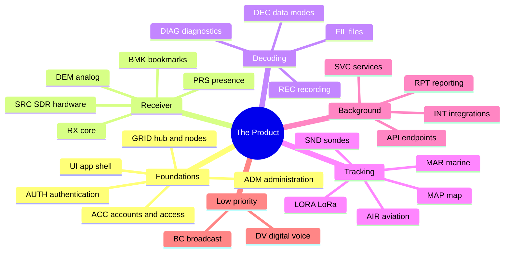
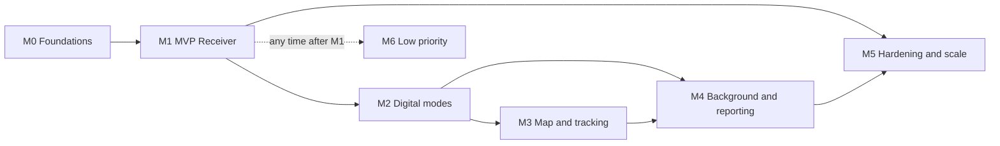
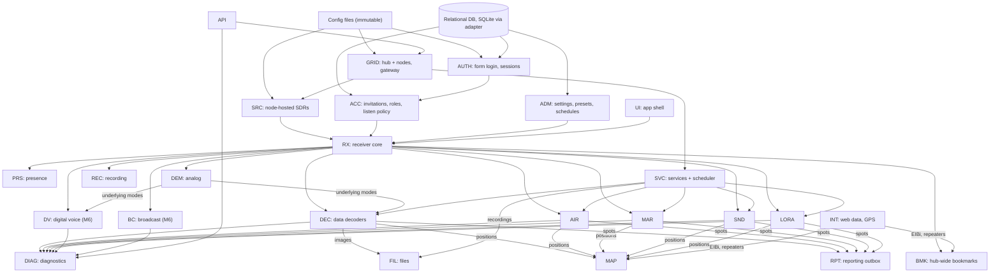

# The Product: Feature Specification

> **Status:** draft v0.3 (2026-10-06). "The Product" is a working name until the team chooses one.
> **Companion document:** [`TECHNICAL_SPEC.md`](TECHNICAL_SPEC.md) covers architecture, grid design, protocol v1, data model and database adapter, node internals, decoding diagnostics, security requirements and risks.
> **Normative language:** MUST, SHOULD and MAY follow RFC 2119.

## Table of contents

1. [Purpose and scope](#1-purpose-and-scope)
2. [Product principles](#2-product-principles)
3. [Roles and access model](#3-roles-and-access-model)
4. [Big Feature map](#4-big-feature-map)
5. [Milestones](#5-milestones)
6. [Feature catalogue](#6-feature-catalogue)
7. [Rights matrix](#7-rights-matrix)
8. [Feature dependencies](#8-feature-dependencies)
9. [Configuration reference](#9-configuration-reference)
10. [UI specification](#10-ui-specification)
11. [Attribution](#11-attribution)

---

## 1. Purpose and scope

The Product is a **multi-user, multi-node web SDR receiver**. Several machines (**nodes**) host SDR hardware, DSP and decoders. One **hub** does three things:

- serves the web application;
- keeps all state in a relational database;
- proxies listeners to the right node.

For each listener, the Product provides:

- live waterfall and spectrum;
- an independently tuned demodulator with audio;
- decoders for analog and digital modes;
- a diagnostic that explains **why** a decoder is not decoding.

It also provides:

- headless background decoding;
- a map;
- a file gallery (with reception metadata);
- a decoded-message history;
- reporting to external networks (PSKReporter, WSPRnet, APRS-IS, SondeHub, AIS aggregators, MQTT).

**Not in scope for now:**

- chat;
- bans;
- connection limits;
- transmitting;
- rig control;
- host network (WiFi) management;
- self-registration;
- MFA;
- SSO. The identity model is ready for OIDC/OAuth2 (TECHNICAL_SPEC §5).

This document specifies *what* the Product does, *who* may do it, and *when* it is delivered (milestones). *How* it is built is in TECHNICAL_SPEC.md.

### 1.1 Catalogue columns

`ID | Feature | Behaviour | Milestone | Priority | Effort | Entry point | Gate | Anon | Listener | Operator | Admin | Depends on`

**Milestone** and **Priority** are explained in §5. **Effort** is in Fibonacci story points (§5.3).

**Gate** gives the source of each controlling value:

| Tag | Source |
|---|---|
| `(cfg)` | Immutable configuration file |
| `(db)` | Admin-editable setting in the database. A config file can lock it. |
| `(rt)` | Per-client runtime value |
| `cap:<flag>` | Capability detected on the node that hosts the device |

**Rights cells:**

| Value | Meaning |
|---|---|
| ✅ | allowed |
| ❌ | denied |
| `LP` | allowed when the listen policy admits anonymous listeners |
| `⚙️ key` | gated by a setting |
| 👁 | read-only |

Every right is enforced by the server.

## 2. Product principles

| # | Principle | Consequence |
|---|---|---|
| P1 | **Grid by design.** SDRs plugged into several nodes are used from one frontend. | Hub + nodes. The hub can also be a node. An all-in-one mode exists for single-machine installs. |
| P2 | **One real-time transport: WebSocket.** | REST for commands and queries. One hub events WebSocket. Node DSP/media WebSockets go through the hub gateway, so the browser only ever talks to the hub. |
| P3 | **Explicit roles, accounts by invitation.** | Anonymous, Listener, Operator, Admin. A listen policy decides whether anonymous visitors may listen. Accounts are created by invitation and use classic form login. |
| P4 | **Two sources of truth only.** | <ul><li>Immutable **config files**: deployment, secrets, and the **devices** of each node.</li><li>One relational **database** on the hub: everything admin-editable, including device-independent **presets** and hub-wide **bookmarks**, plus all state worth keeping.</li><li>SQLite for now, behind an adapter, so that PostgreSQL can be added later.</li><li>No state lives only in RAM, except raw signal streams and the listener's own session controls.</li></ul> |
| P5 | **The user always knows why nothing decodes.** | Every decoder session reports a diagnostic state, a reason and a hint (DIAG). |
| P6 | **Modern, responsive UI, no floating windows, admin-driven look & feel.** | App shell, docked panels and tabs, bottom sheets on mobile. Modals only for confirmations. The admin sets the theme: `light`, `dark` or `auto`. |
| P7 | **Server-side enforcement, secure by default.** | Every permission is checked by the server (TECHNICAL_SPEC §10). |
| P8 | **Stack-agnostic specification.** | Components and contracts are specified, not languages. Caddy is the reference gateway. |

## 3. Roles and access model

### 3.1 Roles

| Role | Who | Can |
|---|---|---|
| **Anonymous** | Visitor without an account | Listen and use their own demodulator **only if** the listen policy of the device is `anonymous`. Read public pages (map, files, decodes) as configured. |
| **Listener** | Invited, registered user | Everything Anonymous can do, also on devices whose policy is `registered` |
| **Operator** | Registered user with the operator role | Everything a Listener can do. Apply a **preset** and move the **center frequency** on devices where `operator_can_retune` is set. Manage the hub-wide **bookmarks**. |
| **Admin** | Registered user with the admin role | Everything, including: settings, look & feel, invitations, users and roles, node enrollment, presets, schedules, diagnostics, reporting configuration. Devices are **read-only** in the UI, because they are configured in node config files. |
| *Node operator* | Person with shell access to a hub or node | Edits config files (immutable at runtime) and uses the CLI (`<product> hub\|node\|all`, first admin bootstrap, migration tool) |
| *System* | — | Background services, scheduler, reporting workers, retention jobs |

### 3.2 Policies and access settings

| Setting | Values | Scope | Source |
|---|---|---|---|
| `listen_policy` | `anonymous` \| `registered` | Global | (db), lockable by (cfg) |
| `devices.<id>.listen_policy` | `anonymous` \| `registered` | Per-device override | (cfg) on the node |
| `devices.<id>.operator_can_retune` | bool | Per device | (cfg) on the node |
| `ui.theme_mode` | `light` \| `dark` \| `auto` | Global look & feel | (db), lockable by (cfg) |

### 3.3 Accounts

- **Creating accounts.** Accounts are created **by invitation only**. An admin issues an invitation with a pre-set role, sent by e-mail or shared as a copyable link. The invitee chooses a password. There is no self-registration.
- **Signing in.** Login is a classic form. A forgotten password is reset by an e-mail link. Passwords are hashed with Argon2id. Every state-changing request is CSRF-protected.
- **SSO later.** Identities are modelled as `(provider, subject)`, so OIDC/OAuth2 providers can be added later without changing sessions or permissions.

### 3.4 Role capability summary

| Capability family | Anon | Listener | Operator | Admin |
|---|---|---|---|---|
| Listen, waterfall, own demodulator, modes, squelch, NR | `LP` | ✅ | ✅ | ✅ |
| Use bookmarks | `LP` | ✅ | ✅ | ✅ |
| Create, edit and delete bookmarks (hub-wide) | ❌ | ❌ | ✅ | ✅ |
| Apply a preset to a device, move its center frequency | ❌ | ❌ | ⚙️ `operator_can_retune` | ✅ |
| View files, decodes and map | ⚙️ public visibility | ✅ | ✅ | ✅ |
| Delete files | ❌ | ❌ | ❌ | ✅ |
| Settings, look & feel, invitations, users, roles, node enrollment, presets, schedules, diagnostics admin (devices read-only) | ❌ | ❌ | ❌ | ✅ |
| Edit config files, run the CLI | — | — | — | node operator |

## 4. Big Feature map

| # | Big Feature | Prefix | Scope | Main milestone |
|---|---|---|---|---|
| 1 | Grid: hub and nodes | `GRID` | Hub/node roles, enrollment, gateway routing, health | M0 |
| 2 | Receiver core | `RX` | Tuning, waterfall/spectrum, audio, squelch, NR, zoom, bandplan, device picker | M1 |
| 3 | SDR sources & hardware | `SRC` | Supported SDR types, device options in node config files, lifecycle | M1 / M5 |
| 4 | Analog demodulation | `DEM` | AM, SAM, NFM, SSB, CW (WFM + RDS: M6) | M1 |
| 5 | Data decoders | `DEC` | WSJT family, JS8, MSK144, packet, PSK, RTTY, CW, paging, SSTV/FAX, skimmers, ISM, EAS… | M2 |
| 6 | Decoding diagnostics | `DIAG` | Per-decoder state, reasons, hints, history | M1 / M2 |
| 7 | Files | `FIL` | Gallery of received images and recordings, with reception metadata | M2 |
| 8 | Recording | `REC` | Browser audio recording | M2 |
| 9 | Map | `MAP` | Positions, layers, locators | M3 |
| 10 | Aviation | `AIR` | ADS-B, UAT, HFDL, VDL2, ACARS | M3 |
| 11 | Marine | `MAR` | AIS, DSC, NAVTEX | M3 |
| 12 | Radiosondes | `SND` | RS41, DFM, M10/M20, MTS01 | M3 |
| 13 | LoRa family | `LORA` | LoRaWAN, LoRa-APRS, FANET, Meshtastic, MeshCore, MeshCom | M3 |
| 14 | Background services & scheduler | `SVC` | Headless decoders, schedules | M4 |
| 15 | Reporting & spotting | `RPT` | PSKReporter, WSPRnet, APRS-IS, SondeHub, AIS, MQTT | M4 |
| 16 | Integrations | `INT` | Web data (EIBi, repeaters, receiver directories), GPS | M4 |
| 17 | Public API endpoints | `API` | Status, capabilities, metrics | M0 / M4 |
| 18 | Bookmarks & scanner | `BMK` | Hub-wide bookmarks, auto bookmarks, scanner | M1 |
| 19 | Presence | `PRS` | Listener counts, admin view of connected listeners | M1 |
| 20 | Administration | `ADM` | Settings, look & feel, presets, schedules, decoding, reporting configuration | M0 → M4 |
| 21 | Authentication | `AUTH` | Form login, sessions, password reset, CSRF | M0 |
| 22 | Accounts & access | `ACC` | Invitations, roles, listen policy, identity model | M0 |
| 23 | UI shell & customisation | `UI` | App shell, responsive layout, look & feel, shortcuts, help | M0 / M1 |
| 24 | Digital voice | `DV` | DMR, D-Star, YSF, NXDN, P25, M17, FreeDV, TETRA | **M6 (P4)** |
| 25 | Digital broadcast | `BC` | DAB, DRM, HD Radio | **M6 (P4)** |



---

## 5. Milestones

A **milestone** is a delivery step. Some milestones are mostly one Big Feature: M3 is the map and tracking, M6 is the low-priority radio families. Others are a cross-cutting step, such as M0 Foundations or M1 MVP. Each feature row in §6 belongs to exactly one milestone, and has a priority and an effort.

### 5.1 Milestone definitions

| Milestone | Goal | Exit criteria |
|---|---|---|
| **M0 Foundations** | A running hub and node skeleton that a user can sign in to. | <ul><li>`<product> hub\|node\|all` starts from config files.</li><li>The DB adapter is in place with SQLite and its migrations.</li><li>Node enrollment over mTLS works, and the gateway routes to the node.</li><li>Form login, password reset and invitations work. Roles are enforced.</li><li>Protocol v1 is in place: envelope, auth at upgrade, error frames.</li><li>The UI app shell (navigation, responsive layout) is live, with admin look & feel.</li><li>CI runs the contract tests.</li></ul> |
| **M1 MVP Receiver** | Listen to a real SDR from the browser, on one or several nodes. | <ul><li>Connector-type SDRs (rtl_sdr, rtl_tcp, basic Soapy) are declared in the node config.</li><li>Presets can be applied.</li><li>The waterfall and spectrum work, with AM/SAM/NFM/SSB/CW audio, squelch and NR.</li><li>Hub-wide bookmarks work, and so does the scanner.</li><li>The listen policy is enforced.</li><li>The multi-node device picker works.</li><li>Basic diagnostics are reported (UNAVAILABLE, NO_SIGNAL, DECODER_ERROR).</li><li>Presence counts are shown.</li></ul> |
| **M2 Digital modes** | The main digital decoders, each with full diagnostics. | <ul><li>WSJT family, JS8, MSK144, packet/APRS decoding, PSK31, RTTY, CW, paging / SelCall / EAS, SSTV, FAX, skimmers and ISM decode on a node.</li><li>The full diagnostic state machine runs, with hints.</li><li>The Files gallery shows reception metadata (UTC time, frequency).</li><li>Browser recording works.</li></ul> |
| **M3 Map & tracking** | Everything with a position ends up on a map and in the history. | <ul><li>The map shows its layers and locators.</li><li>The decoded-message history can be browsed and searched.</li><li>Aviation, marine, sondes and LoRa/Meshtastic are decoded and plotted.</li></ul> |
| **M4 Background & reporting** | The receiver works unattended and feeds external networks. | <ul><li>Background services and the scheduler run.</li><li>PSKReporter, WSPRnet, APRS-IS, SondeHub, AIS and MQTT reporting go through the outbox.</li><li>EIBi, repeater and receiver-directory data are fetched.</li><li>GPS is used.</li><li>The metrics API is available.</li></ul> |
| **M5 Hardening & scale** | Broad hardware support, migration and production readiness. | <ul><li>The remaining SDR types work: full Soapy matrix, sddc, hpsdr, runds, perseus, fifi.</li><li>The migration tool from OpenWebRX+ installations exists.</li><li>Performance budgets are met.</li><li>The PostgreSQL adapter is ready and HA notes are written.</li></ul> |
| **M6 Low priority** | Specialised radio families. | <ul><li>Broadcast: WFM + RDS, DAB, DRM, HD Radio.</li><li>Digital voice: DMR, D-Star, YSF, NXDN, P25, M17, FreeDV, TETRA.</li></ul> |



### 5.2 Priority legend

| Priority | Meaning |
|---|---|
| `P1` | Must. The milestone is not done without it. |
| `P2` | Should. Expected in the milestone; may slip to the next one. |
| `P3` | Could. Nice to have, the first candidate to cut. |
| `P4` | Very low. Every M6 row has this priority. |

### 5.3 Effort calibration (Fibonacci story points)

| Points | Calibration |
|---|---|
| 1 | Trivial setting or UI toggle |
| 2 | Small, well-understood change |
| 3 | Small feature with tests |
| 5 | Feature spanning two components (e.g. node + UI) |
| 8 | Multi-component feature with some unknowns |
| 13 | Major subsystem slice |
| 21 | Epic. It MUST be split before sprint planning (its Behaviour says how). |

Points measure the effort of **building the feature in the Product**, tests included. Reusing an external decoder still costs adapter, parser, diagnostics and test work. The team SHOULD recalibrate after M0, using its measured velocity.

### 5.4 Milestone totals

Generated from §6.

| Milestone | Features | P1 | Story points (all) | Story points (P1 only) |
|---|---|---|---|---|
| **M0** Foundations | 77 | 46 | 300 | 230 |
| **M1** MVP Receiver | 131 | 71 | 422 | 273 |
| **M2** Digital modes | 73 | 25 | 322 | 143 |
| **M3** Map & tracking | 48 | 12 | 182 | 66 |
| **M4** Background & reporting | 68 | 14 | 270 | 89 |
| **M5** Hardening & scale | 7 | 0 | 76 | 0 |
| **M6** Low priority | 33 | 0 | 110 | 0 |
| **Total** | **437** | **168** | **1682** | **801** |

### 5.5 Story points per milestone and Big Feature

| Group | M0 | M1 | M2 | M3 | M4 | M5 | M6 | Total |
|---|---|---|---|---|---|---|---|---|
| GRID | 117 | 16 | · | · | · | 39 | · | 172 |
| AUTH | 54 | · | · | · | · | · | · | 54 |
| ACC | 42 | 7 | · | · | · | · | · | 49 |
| ADM | 31 | 37 | 9 | 7 | 35 | 13 | 2 | 134 |
| UI | 44 | 43 | · | · | · | · | · | 87 |
| API | 8 | 5 | · | · | 5 | · | · | 18 |
| RX | 1 | 117 | 13 | · | · | · | · | 131 |
| SRC | · | 91 | · | · | · | 24 | · | 115 |
| DEM | · | 33 | 5 | · | · | · | 13 | 51 |
| BMK | · | 29 | · | · | 6 | · | · | 35 |
| PRS | · | 5 | · | · | 3 | · | · | 8 |
| DEC | · | 5 | 230 | · | · | · | · | 235 |
| DIAG | · | 26 | 36 | · | · | · | · | 62 |
| FIL | · | · | 29 | · | · | · | · | 29 |
| REC | · | 3 | · | · | 5 | · | · | 8 |
| MAP | · | · | · | 61 | · | · | · | 61 |
| AIR | · | · | · | 47 | · | · | · | 47 |
| MAR | · | · | · | 15 | · | · | · | 15 |
| SND | · | · | · | 25 | · | · | · | 25 |
| LORA | · | · | · | 27 | · | · | · | 27 |
| SVC | · | 5 | · | · | 92 | · | · | 97 |
| RPT | · | · | · | · | 84 | · | · | 84 |
| INT | 3 | · | · | · | 40 | · | · | 43 |
| DV | · | · | · | · | · | · | 54 | 54 |
| BC | · | · | · | · | · | · | 41 | 41 |

### 5.6 Feature lists per milestone

#### 5.6.1 M0 Foundations

| ID | Feature | Priority | Effort |
|---|---|---|---|
| GRID-001 | CLI role `hub` | P1 | 8 |
| GRID-002 | CLI role `node` | P1 | 8 |
| GRID-003 | CLI role `all` | P1 | 5 |
| GRID-004 | Nodes declared in the hub config | P2 | 2 |
| GRID-005 | Nodes added by an admin | P2 | 3 |
| GRID-006 | Enrollment token | P1 | 8 |
| GRID-007 | mTLS between hub and node | P1 | 8 |
| GRID-008 | Control channel | P1 | 13 |
| GRID-009 | Heartbeat and node status view | P1 | 5 |
| GRID-010 | Capabilities reporting | P1 | 5 |
| GRID-011 | Gateway routing per node | P1 | 8 |
| GRID-012 | Token verification on the node | P1 | 5 |
| GRID-013 | Version compatibility | P2 | 3 |
| GRID-014 | Hub as node | P1 | 3 |
| GRID-015 | Node removal and revocation | P2 | 5 |
| GRID-016 | Device registry sync | P1 | 5 |
| GRID-017 | Connection presence registry | P1 | 5 |
| GRID-018 | Database adapter with SQLite | P1 | 13 |
| GRID-019 | Schema migrations per dialect | P1 | 5 |
| AUTH-001 | Login page | P1 | 2 |
| AUTH-002 | Credential check | P1 | 5 |
| AUTH-003 | Sessions | P1 | 5 |
| AUTH-004 | Authorisation | P1 | 8 |
| AUTH-005 | Logout | P1 | 2 |
| AUTH-006 | Forced password change | P2 | 2 |
| AUTH-007 | Voluntary password change | P1 | 2 |
| AUTH-008 | CLI: add user | P1 | 3 |
| AUTH-009 | CLI: remove user | P2 | 2 |
| AUTH-010 | CLI: reset password | P2 | 2 |
| AUTH-011 | CLI: list users | P3 | 1 |
| AUTH-012 | CLI: disable user | P2 | 1 |
| AUTH-013 | CLI: enable user | P2 | 1 |
| AUTH-014 | CLI: user exists | P2 | 1 |
| AUTH-015 | CLI global flags | P1 | 2 |
| AUTH-016 | Admin network restriction | P2 | 3 |
| AUTH-017 | Password storage | P1 | 3 |
| AUTH-018 | Package bootstrap | P1 | 3 |
| AUTH-019 | CSRF protection | P1 | 3 |
| AUTH-020 | OIDC-ready identity model | P2 | 3 |
| ACC-001 | Optional accounts | P1 | 2 |
| ACC-002 | Invitations | P1 | 5 |
| ACC-003 | Password reset | P1 | 5 |
| ACC-004 | Account page | P2 | 3 |
| ACC-005 | Session list and revocation | P2 | 3 |
| ACC-006 | Role assignment | P1 | 3 |
| ACC-007 | Access token issuance | P1 | 8 |
| ACC-008 | User management | P1 | 5 |
| ACC-009 | Account deletion and data export | P3 | 3 |
| ACC-010 | Audit log view | P2 | 3 |
| ACC-011 | Password policy | P1 | 2 |
| ADM-001 | Admin landing page | P1 | 3 |
| ADM-002 | Settings save cycle | P1 | 5 |
| ADM-003 | Receiver information | P2 | 2 |
| ADM-004 | Receiver images | P3 | 3 |
| ADM-005 | Access settings page | P2 | 2 |
| ADM-006 | Look & feel and display defaults | P1 | 3 |
| ADM-007 | Device list | P1 | 3 |
| ADM-008 | Device detail | P2 | 2 |
| ADM-009 | Forget device | P2 | 2 |
| ADM-010 | Effective configuration view | P2 | 3 |
| ADM-011 | Retention policies | P2 | 3 |
| UI-001 | Theme mode | P1 | 2 |
| UI-002 | Help / documentation link | P3 | 1 |
| UI-003 | Usage policy page | P2 | 2 |
| UI-004 | Icons & installable metadata | P3 | 2 |
| UI-005 | robots.txt | P3 | 1 |
| UI-006 | App shell & navigation | P1 | 5 |
| UI-007 | Responsive layout & breakpoints | P1 | 5 |
| UI-008 | Theming (light / dark / auto) | P1 | 5 |
| UI-009 | Accessibility (WCAG 2.1 AA) | P1 | 13 |
| UI-010 | User menu & login entry | P1 | 3 |
| UI-011 | Notifications / toasts | P2 | 3 |
| UI-012 | Confirmation modals only | P2 | 2 |
| API-001 | Feature/capability report | P1 | 3 |
| API-002 | Versioned REST API | P1 | 5 |
| RX-001 | Header navigation | P2 | 1 |
| INT-001 | HTTPS | P1 | 3 |

#### 5.6.2 M1 MVP Receiver

| ID | Feature | Priority | Effort |
|---|---|---|---|
| GRID-020 | Device aggregation in one UI | P1 | 5 |
| GRID-021 | Node offline behaviour | P2 | 5 |
| GRID-022 | Admin Connections across nodes | P2 | 3 |
| GRID-023 | Database backup and restore | P2 | 3 |
| ACC-012 | Global listen policy | P1 | 3 |
| ACC-013 | Per-device listen policy | P1 | 2 |
| ACC-014 | Sign-in prompt for restricted devices | P2 | 2 |
| ADM-012 | Waterfall defaults | P2 | 3 |
| ADM-013 | Stream compression | P2 | 3 |
| ADM-014 | Per-source-type fields | P1 | 5 |
| ADM-015 | Device log | P2 | 3 |
| ADM-016 | New device | P3 | 3 |
| ADM-017 | Edit preset | P1 | 5 |
| ADM-018 | New preset | P1 | 2 |
| ADM-019 | Clone preset | P3 | 1 |
| ADM-020 | Delete preset | P1 | 2 |
| ADM-021 | Reorder presets | P3 | 2 |
| ADM-022 | Bookmark list API | P1 | 2 |
| ADM-023 | Edit bookmark | P1 | 2 |
| ADM-024 | Add bookmarks | P1 | 2 |
| ADM-025 | Delete bookmark | P2 | 2 |
| UI-013 | Waterfall color maps | P1 | 3 |
| UI-014 | Keyboard shortcuts | P2 | 5 |
| UI-015 | Shortcuts help | P3 | 2 |
| UI-016 | Session timeout | P2 | 3 |
| UI-017 | Receiver page layout | P1 | 3 |
| UI-018 | Docked control bar | P1 | 8 |
| UI-019 | Side panel with tabs | P1 | 5 |
| UI-020 | Mobile bottom sheet | P2 | 5 |
| UI-021 | Node/device picker (grid-aware) | P1 | 5 |
| UI-022 | Error / diagnostic chips | P1 | 3 |
| UI-023 | Share current tuning | P3 | 1 |
| API-003 | Public status | P2 | 3 |
| API-004 | Feature report page | P3 | 2 |
| RX-002 | Receiver bootstrap & WS connect | P1 | 8 |
| RX-003 | Auto-reconnect with backoff | P1 | 3 |
| RX-004 | Audio start prompt | P1 | 1 |
| RX-005 | Receiver unavailable states | P1 | 3 |
| RX-006 | Preset select (shared) | P1 | 5 |
| RX-007 | Mode picker (analog + digital) | P1 | 5 |
| RX-008 | Click/drag tuning on waterfall & spectrum | P1 | 3 |
| RX-009 | Tune buttons & step tuning | P1 | 2 |
| RX-010 | Center-frequency change | P1 | 5 |
| RX-011 | Frequency display & direct input | P1 | 3 |
| RX-012 | Tuning step selector | P2 | 2 |
| RX-013 | CW / digimode display offset | P2 | 2 |
| RX-014 | Zoom | P1 | 3 |
| RX-015 | Waterfall | P1 | 8 |
| RX-016 | Spectrum display toggle | P2 | 3 |
| RX-017 | Waterfall manual levels | P2 | 2 |
| RX-018 | Waterfall auto-levels & default | P2 | 3 |
| RX-019 | Frequency scale & filter envelope | P1 | 3 |
| RX-020 | Bandpass drag / BFO / PBS / wheel | P1 | 5 |
| RX-021 | Saved bandpasses per modulation | P3 | 2 |
| RX-022 | S-meter & dB readout | P1 | 2 |
| RX-023 | Squelch slider | P1 | 2 |
| RX-024 | Auto squelch | P2 | 2 |
| RX-025 | Tune-by-squelch (signal seek) | P3 | 2 |
| RX-026 | Volume & mute | P1 | 1 |
| RX-027 | Noise reduction toggle & level | P2 | 2 |
| RX-028 | Deep link | P2 | 3 |
| RX-029 | Bandplan ribbon | P2 | 3 |
| RX-030 | Dial frequencies | P3 | 2 |
| RX-031 | Pointer frequency label | P3 | 1 |
| RX-032 | Wheel swap | P3 | 1 |
| RX-033 | Slider wheel control | P3 | 1 |
| RX-034 | UTC clock | P3 | 1 |
| RX-035 | Receiver status metrics | P2 | 5 |
| RX-036 | Receiver identity & photo | P2 | 3 |
| RX-037 | Collapsible panels & sections | P2 | 2 |
| RX-038 | Log / message panel | P2 | 2 |
| RX-039 | Bookmark/tune info | P3 | 1 |
| RX-040 | Grid-aware device selection | P1 | 5 |
| RX-041 | Default device for new visitors | P1 | 2 |
| RX-042 | Shared-state change propagation | P2 | 3 |
| SRC-001 | SDR type registry | P1 | 5 |
| SRC-002 | Device validity | P1 | 3 |
| SRC-003 | Enable / disable device | P2 | 2 |
| SRC-004 | Start retry & failure | P1 | 5 |
| SRC-005 | Device log view | P2 | 3 |
| SRC-006 | Presets | P1 | 8 |
| SRC-007 | Shared preset switching | P1 | 3 |
| SRC-008 | Shared center-frequency change | P1 | 3 |
| SRC-009 | RF gain / AGC / gain stages | P1 | 3 |
| SRC-010 | PPM correction | P1 | 1 |
| SRC-011 | Oscillator (LO) offset | P2 | 2 |
| SRC-012 | IQ swap | P3 | 1 |
| SRC-013 | Bias-tee | P2 | 2 |
| SRC-014 | Direct sampling | P2 | 2 |
| SRC-015 | Soapy device selector & settings (basic) | P1 | 5 |
| SRC-016 | Live retune without restart | P1 | 5 |
| SRC-017 | Sample-rate validation | P1 | 3 |
| SRC-018 | Waterfall levels per device/preset | P2 | 2 |
| SRC-019 | Preset startup defaults | P1 | 2 |
| SRC-020 | Device ordering / default device | P2 | 2 |
| SRC-021 | Node-hosted device declaration | P1 | 8 |
| SRC-022 | Capability reporting | P1 | 8 |
| SRC-023 | Per-device listen policy | P1 | 3 |
| SRC-024 | Per-device operator retune right | P1 | 2 |
| SRC-025 | Device status reporting | P1 | 5 |
| SRC-026 | Read-only device view | P2 | 3 |
| DEM-001 | NFM demodulation | P1 | 3 |
| DEM-002 | AM demodulation | P1 | 2 |
| DEM-003 | Synchronous AM (SAM) | P1 | 3 |
| DEM-004 | SSB (USB/LSB) | P1 | 2 |
| DEM-005 | CW | P1 | 2 |
| DEM-006 | Mode-default bandpass & persistence | P1 | 3 |
| DEM-007 | Passband tuning gestures | P2 | 2 |
| DEM-008 | Squelch support per mode | P1 | 3 |
| DEM-009 | AGC profile per analog family | P2 | 2 |
| DEM-010 | Audio output path (12 kHz) | P1 | 5 |
| DEM-011 | Noise reduction | P2 | 3 |
| DEM-012 | Demodulator error reporting | P1 | 3 |
| BMK-001 | Bookmarks in the bookmark bar | P1 | 5 |
| BMK-002 | Bookmark origins | P1 | 5 |
| BMK-003 | Add/edit bookmark form | P1 | 3 |
| BMK-004 | Bookmark search | P2 | 3 |
| BMK-005 | Bookmark management table | P2 | 5 |
| BMK-006 | Bookmark scanner | P2 | 3 |
| BMK-007 | Bookmark rendering order and colours | P3 | 2 |
| BMK-008 | Bookmark scope | P2 | 3 |
| PRS-001 | Connected listeners list | P2 | 3 |
| PRS-002 | Listener count and node status | P2 | 2 |
| DEC-001 | Decoder capability probing | P1 | 5 |
| DIAG-001 | Diagnostic state machine per decoder session | P1 | 8 |
| DIAG-002 | Live diagnostic push to user | P1 | 5 |
| DIAG-003 | External tool crash / timeout reporting | P1 | 5 |
| DIAG-004 | Capability missing reporting | P1 | 3 |
| DIAG-005 | Signal presence baseline | P1 | 5 |
| REC-001 | Browser recording | P3 | 3 |
| SVC-001 | On-demand source lifecycle | P1 | 5 |

#### 5.6.3 M2 Digital modes

| ID | Feature | Priority | Effort |
|---|---|---|---|
| ADM-026 | Miscellaneous demodulation settings | P2 | 2 |
| ADM-027 | Paging | P2 | 1 |
| ADM-028 | Fax | P2 | 1 |
| ADM-029 | Image compression | P3 | 2 |
| ADM-030 | WSJT / JS8 decoders | P1 | 3 |
| RX-043 | Secondary (digimode) waterfall & channel pick | P2 | 5 |
| RX-044 | Decoder & metadata routing | P1 | 5 |
| RX-045 | HD audio path | P2 | 3 |
| DEM-013 | DATA (USB/LSB digital, 48 kHz) | P2 | 2 |
| DEM-014 | HD audio path (48 kHz) | P2 | 3 |
| DEC-002 | Secondary demodulator framework | P1 | 13 |
| DEC-003 | Underlying-mode switching | P2 | 3 |
| DEC-004 | Secondary FFT (decoder waterfall) | P2 | 5 |
| DEC-005 | Secondary offset (narrow-band decoders) | P1 | 3 |
| DEC-006 | BPSK31 | P1 | 5 |
| DEC-007 | BPSK63 | P2 | 1 |
| DEC-008 | RTTY 170 Hz / 45.45 Bd | P1 | 5 |
| DEC-009 | RTTY 450 Hz / 50 Bd (inverted) | P2 | 1 |
| DEC-010 | RTTY 85 Hz / 50 Bd (inverted) | P2 | 1 |
| DEC-011 | SITOR-B | P2 | 5 |
| DEC-012 | CW decoder | P1 | 5 |
| DEC-013 | CW Skimmer | P2 | 8 |
| DEC-014 | RTTY Skimmer | P2 | 2 |
| DEC-015 | Skimmer callsign extraction and spotting | P2 | 5 |
| DEC-016 | FT8 | P1 | 8 |
| DEC-017 | FT4 | P1 | 2 |
| DEC-018 | JT65 | P3 | 2 |
| DEC-019 | JT9 | P3 | 2 |
| DEC-020 | WSPR | P1 | 3 |
| DEC-021 | FST4 | P3 | 3 |
| DEC-022 | FST4W | P3 | 3 |
| DEC-023 | Q65 | P3 | 3 |
| DEC-024 | WSJT decoding depth | P2 | 2 |
| DEC-025 | Decoder queue (per node) | P1 | 8 |
| DEC-026 | WSJT/JS8 slot timing | P1 | 5 |
| DEC-027 | WSJT result parsing, map and spotting | P1 | 8 |
| DEC-028 | MSK144 | P2 | 5 |
| DEC-029 | JS8Call | P1 | 8 |
| DEC-030 | JS8 thread view | P2 | 5 |
| DEC-031 | Packet / APRS (AX.25 1200 Bd) | P1 | 8 |
| DEC-032 | APRS parsing and map plotting | P1 | 13 |
| DEC-033 | Paging (POCSAG and FLEX) | P2 | 8 |
| DEC-034 | SelCall (DTMF/EEA/EIA/CCIR) | P2 | 3 |
| DEC-035 | ZVEI (1/2/3, DZVEI, PZVEI) | P3 | 1 |
| DEC-036 | EAS / SAME alerts | P2 | 3 |
| DEC-037 | SSTV | P2 | 8 |
| DEC-038 | HF weather fax | P2 | 8 |
| DEC-039 | ISM sensors (rtl_433) | P2 | 5 |
| DEC-040 | Wireless M-Bus | P3 | 2 |
| DEC-041 | Speech transcriber | P3 | 8 |
| DEC-042 | Server audio recorder (MP3) | P3 | 5 |
| DEC-043 | Meteor-M2 LRPT | P3 | 8 |
| DEC-044 | Elektro-L LRIT | P3 | 2 |
| DEC-045 | Decoder output export | P2 | 3 |
| DEC-046 | Decoder metrics | P3 | 3 |
| DEC-047 | Decoded message persistence | P1 | 8 |
| DEC-048 | Decoder process isolation | P1 | 5 |
| DIAG-006 | Hints catalogue | P2 | 3 |
| DIAG-007 | Persistence and retention | P1 | 3 |
| DIAG-008 | Admin diagnostics view | P2 | 5 |
| DIAG-009 | Aggregated decoder health metrics | P3 | 8 |
| DIAG-010 | Wrong-protocol heuristic | P3 | 8 |
| DIAG-011 | Diagnostics in background services | P2 | 3 |
| DIAG-012 | Diagnostics export / API | P3 | 3 |
| DIAG-013 | Decoder adapter signal contract | P2 | 3 |
| FIL-001 | Files gallery | P1 | 5 |
| FIL-002 | File download | P1 | 2 |
| FIL-003 | File delete | P1 | 2 |
| FIL-004 | Retention | P1 | 3 |
| FIL-005 | File producers | P1 | 8 |
| FIL-006 | Save decoder canvas locally | P3 | 1 |
| FIL-007 | File detail view | P2 | 3 |
| FIL-008 | Reception metadata for received files | P1 | 5 |

#### 5.6.4 M3 Map & tracking

| ID | Feature | Priority | Effort |
|---|---|---|---|
| ADM-031 | Map settings | P2 | 2 |
| ADM-032 | External links | P3 | 2 |
| ADM-033 | Aircraft messages | P2 | 1 |
| ADM-034 | LoRa bandwidths | P2 | 2 |
| MAP-001 | Map section | P1 | 3 |
| MAP-002 | Map live feed | P1 | 8 |
| MAP-003 | Google Maps base layer | P3 | 3 |
| MAP-004 | Base layers (tile providers) | P2 | 2 |
| MAP-005 | Overlay layers | P3 | 5 |
| MAP-006 | Day/night terminator | P3 | 1 |
| MAP-007 | Receiver/station markers | P1 | 3 |
| MAP-008 | Marker types and legend | P1 | 5 |
| MAP-009 | Locator squares | P1 | 5 |
| MAP-010 | Colour mode and band/mode filter | P2 | 3 |
| MAP-011 | Calls (QSO lines) | P2 | 3 |
| MAP-012 | Position retention and fading | P1 | 3 |
| MAP-013 | Report filtering | P3 | 1 |
| MAP-014 | Marker detail popups | P1 | 5 |
| MAP-015 | Lookup links | P2 | 2 |
| MAP-016 | Cross-section linking | P2 | 3 |
| MAP-017 | Static and web-sourced markers | P2 | 5 |
| MAP-018 | Legend toggle and clock | P3 | 1 |
| AIR-001 | HFDL | P2 | 5 |
| AIR-002 | VDL Mode 2 | P2 | 5 |
| AIR-003 | ACARS (VHF) | P2 | 5 |
| AIR-004 | ADS-B (1090 MHz Mode S) | P1 | 8 |
| AIR-005 | UAT (978 MHz) | P3 | 3 |
| AIR-006 | Aircraft database and merging | P1 | 8 |
| AIR-007 | ICAO country and registration lookup | P2 | 3 |
| AIR-008 | ACARS / ARINC-622 / CPDLC / ADS-C sub-decoding | P2 | 8 |
| AIR-009 | Aviation reporting | P3 | 2 |
| MAR-001 | AIS (VHF 9600 Bd GMSK) | P1 | 5 |
| MAR-002 | NAVTEX (518/490 kHz) | P2 | 5 |
| MAR-003 | DSC (HF/MF) | P2 | 5 |
| SND-001 | Vaisala RS41 | P1 | 5 |
| SND-002 | Graw DFM-09 | P2 | 3 |
| SND-003 | Graw DFM-17 | P2 | 2 |
| SND-004 | Meteomodem MTS01 | P3 | 2 |
| SND-005 | Meteomodem M10 | P2 | 3 |
| SND-006 | Meteomodem M20 | P3 | 2 |
| SND-007 | Sonde parsing and map plotting | P1 | 8 |
| LORA-001 | LoRaWAN sniffing | P2 | 5 |
| LORA-002 | LoRa APRS | P2 | 3 |
| LORA-003 | FANET | P3 | 1 |
| LORA-004 | Meshtastic | P2 | 13 |
| LORA-005 | MeshCore | P3 | 1 |
| LORA-006 | MeshCom | P3 | 1 |
| LORA-007 | LoRa raw frame display | P2 | 3 |

#### 5.6.5 M4 Background & reporting

| ID | Feature | Priority | Effort |
|---|---|---|---|
| ADM-035 | Listening time limit and usage policy | P3 | 3 |
| ADM-036 | Receiver listing keys | P3 | 1 |
| ADM-037 | Schedules | P2 | 8 |
| ADM-038 | Background services per device | P2 | 1 |
| ADM-039 | Background audio recording | P3 | 1 |
| ADM-040 | Speech-to-text | P3 | 2 |
| ADM-041 | Background decoding | P1 | 3 |
| ADM-042 | APRS-IS iGate | P2 | 5 |
| ADM-043 | PSKReporter | P2 | 2 |
| ADM-044 | WSPRnet | P2 | 1 |
| ADM-045 | SondeHub | P3 | 1 |
| ADM-046 | AIS reporter | P3 | 2 |
| ADM-047 | MQTT | P2 | 5 |
| API-005 | Metrics | P2 | 5 |
| BMK-009 | EIBi auto-bookmarks | P3 | 3 |
| BMK-010 | Repeater auto-bookmarks | P3 | 3 |
| PRS-003 | Services status page | P2 | 3 |
| REC-002 | Server background recording | P3 | 5 |
| SVC-002 | Background decoding master switch | P1 | 2 |
| SVC-003 | Per-mode service selection | P1 | 3 |
| SVC-004 | Per-device service opt-out | P2 | 1 |
| SVC-005 | Service placement from bandplan | P1 | 8 |
| SVC-006 | Resampler optimisation | P2 | 8 |
| SVC-007 | Service demodulator chain | P1 | 5 |
| SVC-008 | Service decoders catalogue | P2 | 3 |
| SVC-009 | Service restart on retune | P2 | 5 |
| SVC-010 | Static scheduler | P1 | 8 |
| SVC-011 | Daylight scheduler | P3 | 5 |
| SVC-012 | Scheduler yields to listeners | P1 | 3 |
| SVC-013 | Always-on source | P2 | 1 |
| SVC-014 | Background audio recording | P3 | 3 |
| SVC-015 | Speech-to-text service | P3 | 3 |
| SVC-016 | Service text export | P3 | 2 |
| SVC-017 | Image capture (SSTV/FAX) | P2 | 3 |
| SVC-018 | Weather-satellite capture | P3 | 5 |
| SVC-019 | Stored file retention | P1 | 5 |
| SVC-020 | Services status page | P2 | 5 |
| SVC-021 | Decoder queue (WSJT/JS8) | P2 | 1 |
| SVC-022 | Hub-computed service plan | P1 | 13 |
| RPT-001 | Reporting engine | P1 | 13 |
| RPT-002 | PSKReporter | P1 | 8 |
| RPT-003 | WSPRnet | P2 | 5 |
| RPT-004 | APRS-IS iGate | P1 | 8 |
| RPT-005 | APRS-IS beacon | P2 | 3 |
| RPT-006 | SondeHub telemetry | P2 | 8 |
| RPT-007 | SondeHub listener position | P3 | 2 |
| RPT-008 | AIS UDP forwarding | P2 | 3 |
| RPT-009 | MQTT publish | P1 | 5 |
| RPT-010 | MQTT publish categories | P2 | 3 |
| RPT-011 | Radio event reporting | P3 | 3 |
| RPT-012 | Client event reporting | P3 | 2 |
| RPT-013 | MQTT subscribe: WSJT | P3 | 3 |
| RPT-014 | MQTT subscribe: aircraft | P3 | 2 |
| RPT-015 | MQTT subscribe: APRS / AIS | P3 | 2 |
| RPT-016 | MQTT subscribe: sondes | P3 | 2 |
| RPT-017 | MQTT subscribe: Meshtastic | P3 | 2 |
| RPT-018 | MQTT loop guard | P3 | 1 |
| RPT-019 | ReceiverId (listing proof) | P3 | 3 |
| RPT-020 | Public status JSON | P2 | 3 |
| RPT-021 | Reporter metrics | P2 | 3 |
| INT-002 | GPS location updates | P2 | 5 |
| INT-003 | EIBI shortwave schedule | P2 | 8 |
| INT-004 | Repeater directory | P2 | 8 |
| INT-005 | Online receivers markers | P3 | 5 |
| INT-006 | Static marker files | P3 | 2 |
| INT-007 | Web data scheduler | P1 | 5 |
| INT-008 | Data freshness display | P2 | 2 |
| INT-009 | CPU / temperature / battery telemetry | P3 | 5 |

#### 5.6.6 M5 Hardening & scale

| ID | Feature | Priority | Effort |
|---|---|---|---|
| GRID-024 | Node maintenance and drain | P3 | 5 |
| GRID-025 | PostgreSQL database adapter | P2 | 13 |
| GRID-026 | High-availability hub replicas | P3 | 13 |
| GRID-027 | Performance budgets and load tests | P2 | 8 |
| ADM-048 | Migration tool from OpenWebRX+ | P2 | 13 |
| SRC-027 | rtl_tcp compatibility port | P3 | 3 |
| SRC-028 | Remaining SDR types | P3 | 21 |

#### 5.6.7 M6 Low priority

| ID | Feature | Priority | Effort |
|---|---|---|---|
| ADM-049 | Digital voice | P4 | 2 |
| DEM-015 | WFM demodulation (mono) | P4 | 3 |
| DEM-016 | WFM de-emphasis | P4 | 1 |
| DEM-017 | RDS decoding | P4 | 5 |
| DEM-018 | RBDS | P4 | 1 |
| DEM-019 | RDS metadata card | P4 | 3 |
| DV-001 | DMR | P4 | 8 |
| DV-002 | DMR timeslot filter | P4 | 2 |
| DV-003 | DMR/NXDN radio-ID lookup | P4 | 5 |
| DV-004 | DMR talker alias, GPS & map | P4 | 3 |
| DV-005 | DMR metadata card | P4 | 2 |
| DV-006 | D-Star | P4 | 3 |
| DV-007 | D-Star metadata & DPRS | P4 | 3 |
| DV-008 | YSF | P4 | 3 |
| DV-009 | NXDN | P4 | 3 |
| DV-010 | P25 phase 1 | P4 | 3 |
| DV-011 | Codecserver endpoint | P4 | 3 |
| DV-012 | M17 | P4 | 3 |
| DV-013 | FreeDV 1600 | P4 | 3 |
| DV-014 | RADE (upper/lower) | P4 | 3 |
| DV-015 | TETRA | P4 | 5 |
| DV-016 | TETRA metadata card | P4 | 2 |
| BC-001 | DRM | P4 | 5 |
| BC-002 | DRM status card | P4 | 3 |
| BC-003 | DAB / DAB+ | P4 | 8 |
| BC-004 | DAB service selection | P4 | 3 |
| BC-005 | DAB AFC | P4 | 3 |
| BC-006 | DAB output rate | P4 | 1 |
| BC-007 | HD Radio (NRSC-5 FM) | P4 | 8 |
| BC-008 | HD Radio programme selection | P4 | 2 |
| BC-009 | HD Radio metadata | P4 | 3 |
| BC-010 | HD Radio images (LOT) | P4 | 3 |
| BC-011 | HD Radio station on map | P4 | 2 |

---

## 6. Feature catalogue

The catalogue is grouped by Big Feature (§4). Within each group, IDs follow the delivery order (milestone first).

### 6.1 Grid: hub and nodes (GRID)

A deployment is one hub and zero or more nodes. The hub owns the DB, the web UI, the REST API, the events WebSocket and the gateway. Nodes own SDR hardware and DSP and keep no persistent state. The hub dials the nodes over mTLS. The browser reaches a node's DSP/media WebSocket only through the hub gateway (`/nodes/{nodeId}/ws`), and every connection carries a hub-issued access token.

| ID | Feature | Behaviour | Milestone | Priority | Effort | Entry point | Gate | Anon | Listener | Operator | Admin | Depends on |
|---|---|---|---|---|---|---|---|---|---|---|---|---|
| GRID-001 | CLI role `hub` | `<product> hub -c <hub config>` starts the web UI, REST API, events WS, DB access (SQLite at `db.dsn`, through the DB adapter), schedulers, reporting and the gateway. It applies pending DB schema migrations at start (or refuses to start with `--no-migrate` when they are pending). | M0 | P1 | 8 | CLI | `db.dsn (cfg)`, `hub.listen (cfg)`, `gateway.* (cfg)` | ❌ | ❌ | ❌ | ✅ (OS) | — |
| GRID-002 | CLI role `node` | `<product> node -c <node config>` starts the device sources and DSP, and exposes the authenticated node API and WS on `node.listen` (TLS required). It holds no DB connection and writes nothing to disk except temporary DSP scratch files under `paths.tmp_dir`. | M0 | P1 | 8 | CLI | `node.id (cfg)`, `node.listen (cfg)`, `tls.* (cfg)` | ❌ | ❌ | ❌ | ✅ (OS) | — |
| GRID-003 | CLI role `all` | `<product> all -c <config>` runs a hub and a local node in one installation, either as one process or by spawning both. The local node is enrolled automatically over a loopback or local-socket channel without manual token handling. This is the default single-box setup. | M0 | P1 | 5 | CLI | as GRID-001 and GRID-002 | ❌ | ❌ | ❌ | ✅ (OS) | GRID-001, GRID-002, GRID-014 |
| GRID-004 | Nodes declared in the hub config | The hub config MAY declare nodes (`nodes.<nodeId>.url`, `nodes.<nodeId>.ca` or pinned certificate fingerprint). Declared nodes are locked: shown read-only in Admin › Nodes, and not removable from the UI. | M0 | P2 | 2 | hub config | `nodes.<id>.* (cfg)` | ❌ | ❌ | ❌ | 👁 | GRID-007 |
| GRID-005 | Nodes added by an admin | An admin MAY add a node in Admin › Nodes (name, URL). It is stored in `nodes`. Adding a node creates an enrollment token (GRID-006). Admin-added nodes can be edited, disabled and removed. | M0 | P2 | 3 | Admin › Nodes › Add | — | ❌ | ❌ | ❌ | ✅ | GRID-006 |
| GRID-006 | Enrollment token | Enrollment pairs a node with the hub once. The hub creates a single-use, short-lived (`grid.enrollment_ttl_minutes`) enrollment token. The node operator puts it in the node config (`node.enrollment_token`) or passes it to `<product> node enroll`. On first contact, the hub presents the token, the node checks it and returns a CSR, and the hub signs the node certificate from its internal CA. Both sides then pin each other. The token is unusable after success or expiry. Every step is written to `audit_log`. | M0 | P1 | 8 | Admin › Nodes; `<product> node enroll` | `node.enrollment_token (cfg)`, `grid.enrollment_ttl_minutes (db)` | ❌ | ❌ | ❌ | ✅ | GRID-007 |
| GRID-007 | mTLS between hub and node | All hub↔node traffic (control channel, gateway-proxied WS, API calls) MUST use mutual TLS with the hub CA (`tls.*`), TLS 1.2 or later, with certificate rotation before expiry and revocation on node removal. A node MUST refuse non-mTLS connections, except browser WS connections that arrive through the gateway carrying a valid access token. | M0 | P1 | 8 | — | `tls.* (cfg)` | — | — | — | — | GRID-001, GRID-002 |
| GRID-008 | Control channel | The hub opens and keeps one control connection per node (hub dials node). Over it, the hub pushes settings, presets, schedules and revocations. The node sends events: decoded messages, map features, file blobs, decoder diagnostics, connection presence, service state, device logs on request, and metrics. The hub is the only DB writer. The node buffers events in bounded memory while the channel is down and drops the oldest first, counting drops in its metrics. split: transport and reconnection, hub→node pushes, node→hub event ingestion. | M0 | P1 | 13 | — | `grid.event_buffer_size (cfg)` | — | — | — | — | GRID-007 |
| GRID-009 | Heartbeat and node status view | Nodes report a heartbeat every `grid.heartbeat_interval_s` with uptime, CPU load, temperature, memory, device states, listener counts and version. The hub marks a node `degraded` after 2 missed heartbeats and `offline` after `grid.offline_after_s`. Admin › Nodes shows the state, last seen, version, certificate expiry, devices and capabilities, with a history graph of load. | M0 | P1 | 5 | Admin › Nodes | `grid.heartbeat_interval_s (db)`, `grid.offline_after_s (db)` | ❌ | ❌ | 👁 | ✅ | GRID-008 |
| GRID-010 | Capabilities reporting | At connection and on change, each node reports its capabilities: available source types and their key schemas, detected hardware, available decoders (`cap:*` flags with missing-requirement reasons), modes, codecs and limits. The hub stores them in `node_capabilities`. The UI only offers what the device's node can do. | M0 | P1 | 5 | — | — | 👁 (modes) | 👁 (modes) | 👁 (modes) | ✅ | GRID-008 |
| GRID-011 | Gateway routing per node | The gateway (Caddy as reference: embedded as a library, or a sidecar driven through its admin API) exposes `/nodes/{nodeId}/ws` and proxies it with WebSocket upgrade and mTLS to the node's URL. The hub MUST add, update and remove the upstream route when a node is enrolled, changes URL, is disabled or is removed, with no restart. Unknown or disabled node ids get 404. The gateway MUST NOT be the only place where permissions are checked: the node re-checks the access token. | M0 | P1 | 8 | `/nodes/{nodeId}/ws` | `gateway.mode (cfg)`, `gateway.admin_url (cfg)` | LP | ✅ | ✅ | ✅ | GRID-007 |
| GRID-012 | Token verification on the node | The node verifies the access token offline with the hub's public key (distributed over the control channel), its expiry, the device scope and the roles, on WS open and on each privileged message (preset switch, center frequency change). Refresh happens in band. An expired, unrefreshed token closes the socket with a specific close code. | M0 | P1 | 5 | node WS (`rx.v1`) | `auth.token_ttl_s (cfg)` | LP | ✅ | ✅ | ✅ | ACC-007 |
| GRID-013 | Version compatibility | Hub and node exchange their product version and protocol versions (control and `rx.v1`) at connection. The hub MUST refuse incompatible nodes, mark them `incompatible` with the required version range, and keep compatible older nodes working within the declared range (one minor version back at least). | M0 | P2 | 3 | Admin › Nodes | — | ❌ | ❌ | ❌ | 👁 | GRID-008 |
| GRID-014 | Hub as node | A hub MAY also run devices (role `all`, GRID-003). Its local node is listed like any other node (default id `local`), goes through the same token checks and is reached through the same gateway route. | M0 | P1 | 3 | — | `node.id (cfg)` | — | — | — | 👁 | GRID-011 |
| GRID-015 | Node removal and revocation | Removing an admin-added node revokes its certificate, removes the gateway route, closes its sockets, archives its devices and disables the schedules that reference them. Presets are device-independent and are not affected. A node declared in config can only be disabled from the UI. | M0 | P2 | 5 | Admin › Nodes › {node} › Remove | — | ❌ | ❌ | ❌ | ✅ | GRID-011 |
| GRID-016 | Device registry sync | At each connection and config reload (SIGHUP or restart), a node reports its device definitions (from its config file, with secrets masked). The hub upserts `devices`, flags devices that are no longer reported as stale (see ADM-009), and disables schedules whose device is stale or whose preset no longer fits the device's capabilities. The registry holds no device settings. A device id that clashes with a different device type is rejected with an error. | M0 | P1 | 5 | — | device definitions `(cfg)` | — | — | — | 👁 | GRID-008, GRID-010 |
| GRID-017 | Connection presence registry | Every client connection (hub events WS and node DSP WS) is recorded in `connections` with a heartbeat. The hub writes rows from its own sockets and from node presence events, and expires rows when heartbeats stop. The registry drives listener counts, the connected-listeners view, the status API and MQTT client reports, across all nodes. | M0 | P1 | 5 | — (server) | `retention.connections (db)` | — | — | — | 👁 | GRID-008 |
| GRID-018 | Database adapter with SQLite | The hub MUST reach the database only through repository interfaces backed by a dialect adapter. The SQLite adapter (WAL mode, the hub as single writer, generic SQL types, blobs with size caps) is the only implementation for now. No engine-specific SQL is allowed outside the adapter. See TECHNICAL_SPEC §7. | M0 | P1 | 13 | automatic (hub start), `db.dsn` (cfg) | `db.dsn` (cfg) | ❌ | ❌ | ❌ | ❌ | GRID-001 |
| GRID-019 | Schema migrations per dialect | Versioned, forward-only schema migrations, written per dialect and applied at hub start (or with `<product> hub migrate`), each in a transaction, with a check that the schema version matches the binary. Contract tests run the same repository suite against every adapter. | M0 | P1 | 5 | CLI `<product> hub migrate` | `db.dsn` (cfg) | ❌ | ❌ | ❌ | ❌ | GRID-018 |
| GRID-020 | Device aggregation in one UI | The receiver device selector, the status API, the map and Admin › Devices list the devices of every online node as one catalogue, grouped by node and sorted by name. Device ids are globally unique (`<nodeId>/<deviceId>`). Switching to a device on another node reconnects the DSP socket through the gateway transparently. | M1 | P1 | 5 | Receiver › device selector | `listen_policy (db)` | LP | ✅ | ✅ | ✅ | GRID-011, GRID-016 |
| GRID-021 | Node offline behaviour | When a node goes offline, its listeners get a clear "station offline, reconnecting" state, and the client retries with backoff and resumes the same device, preset and frequency when the node returns. The selector shows the node's devices as unavailable. Background schedules for those devices resume when the node returns. Events buffered on the node are flushed on reconnection. | M1 | P2 | 5 | Receiver | — | LP | ✅ | ✅ | ✅ | GRID-009 |
| GRID-022 | Admin Connections across nodes | Admin › Connections (PRS-001) shows the presence registry of every node live, updated through the hub events WebSocket. | M1 | P2 | 3 | Admin › Connections | — | ❌ | ❌ | ❌ | ✅ | GRID-017 |
| GRID-023 | Database backup and restore | A consistent online backup of the SQLite database (online backup API or `VACUUM INTO`) on a schedule and on demand, plus a documented restore procedure. Backups get restrictive file permissions. | M1 | P2 | 3 | CLI `<product> hub backup`, admin › System | `db.backup.*` (cfg) | ❌ | ❌ | ❌ | ✅ | GRID-018 |
| GRID-024 | Node maintenance and drain | An admin can put a node into `drain`: no new listeners are admitted (the hub refuses tokens for its devices), existing listeners get a notice with a countdown, and background services stop at the deadline. `maintenance` marks the node as intentionally offline, which suppresses alerts. Both states are stored in `nodes`. | M5 | P3 | 5 | Admin › Nodes › {node} › Drain / Maintenance | — | ❌ | ❌ | ❌ | ✅ | GRID-009 |
| GRID-025 | PostgreSQL database adapter | A second adapter implementing the same repository interfaces and migrations for PostgreSQL. It must pass the same contract test suite as SQLite. Selected by the `db.dsn` scheme. No feature may depend on the engine. | M5 | P2 | 13 | `db.dsn` (cfg) | `db.dsn` (cfg) | ❌ | ❌ | ❌ | ❌ | GRID-018, GRID-019 |
| GRID-026 | High-availability hub replicas | Several stateless hub instances behind the gateway, sharing one PostgreSQL database. Requires GRID-025. Covers leader election for the scheduler and the outbox workers, and the gateway configuration. Specified as notes in M5. Implementation is optional. | M5 | P3 | 13 | deployment | `db.dsn` (cfg) | ❌ | ❌ | ❌ | ❌ | GRID-025 |
| GRID-027 | Performance budgets and load tests | A reproducible load-test suite (listeners per node, waterfall FPS, end-to-end audio latency, DB write rate for decodes) on reference hardware, run in CI on release branches. Regressions beyond the NFR budgets (TECHNICAL_SPEC §2) fail the build. | M5 | P2 | 8 | CI | — | ❌ | ❌ | ❌ | ❌ | GRID-001, GRID-002 |

### 6.2 Authentication (AUTH)

Accounts are DB-backed with roles. Sessions are DB rows. The browser authenticates to the hub with a form login and a session cookie. The hub issues short-lived access tokens that the browser presents to nodes through the gateway. Sessions and access tokens are independent of the login method, so other identity providers can be added later (AUTH-020). There is no MFA, no API token and no SSO in v1.

| ID | Feature | Behaviour | Milestone | Priority | Effort | Entry point | Gate | Anon | Listener | Operator | Admin | Depends on |
|---|---|---|---|---|---|---|---|---|---|---|---|---|
| AUTH-001 | Login page | A form login page in the app shell (user name or e-mail, password), with a "Forgot password" link (shown when SMTP is configured). There is no sign-up link: accounts are created by invitation only (ACC-002). It is always reachable: the network restriction applies to the admin role (AUTH-016), not to the login page. | M0 | P1 | 2 | `/login`, header › Sign in | `smtp.* (cfg)` | ✅ | ✅ | ✅ | ✅ | UI-010 |
| AUTH-002 | Credential check | `POST /api/v1/auth/login` (JSON). It MUST: run the password hash for unknown users too (no user enumeration by timing); return one generic error; rate-limit per IP and per account with progressive delay or lockout (`auth.login_rate_limit`); rotate the session id on login; and set the cookie with `HttpOnly`, `Secure`, `SameSite=Lax` and `Path=/`. After login, the browser goes to `next` only when it is a same-origin relative path (no `//`, no scheme), otherwise to `/`. A missing `next` MUST NOT cause an error. | M0 | P1 | 5 | `POST /api/v1/auth/login` | `auth.login_rate_limit (db)` | ✅ | ✅ | ✅ | ✅ | AUTH-003, AUTH-017 |
| AUTH-003 | Sessions | Sessions are `sessions` rows (hashed id, user, created, last seen, IP, user agent, login method). They have an idle timeout (`session.idle_timeout`) and an absolute lifetime (`session.absolute_timeout`), and they survive restarts. All of a user's sessions MUST be revoked on password change or reset, disable, deletion or role downgrade. Users can list and revoke their own sessions (ACC-005). Expired rows are purged periodically. | M0 | P1 | 5 | cookie | `session.idle_timeout (db)`, `session.absolute_timeout (db)` | — | ✅ | ✅ | ✅ | GRID-001 |
| AUTH-004 | Authorisation | Every REST endpoint, every `/api/ws` topic and every node WS message MUST be checked against the caller's roles and the effective listen policy of the target device, server-side. Unauthenticated calls get `401`, forbidden calls get `403` (JSON for the API; the UI redirects to login with a safe `next`). Admin endpoints additionally require the client address to be in `admin.allowed_networks`. Admin users on the receiver page MUST get their admin rights. | M0 | P1 | 8 | all protected routes | `admin.allowed_networks (cfg)` | ❌ | ✅ | ✅ | ✅ | AUTH-003, ACC-006 |
| AUTH-005 | Logout | `POST /api/v1/auth/logout` deletes the session row, clears the cookie and stops the refresh of the user's access tokens for that session. Open WebSockets bound to the session are closed or downgraded to anonymous. A "Sign out" entry is in the account menu. | M0 | P1 | 2 | Account menu › Sign out | — | — | ✅ | ✅ | ✅ | AUTH-003 |
| AUTH-006 | Forced password change | Users flagged `must_change_password` (passwords generated by the CLI or set by an admin) MUST set a new password before anything else. The new password follows the password policy (ACC-011). The redirect after the change uses the same safe `next` rule as AUTH-002. | M0 | P2 | 2 | `/account/password?forced=1` | `auth.password_min_length (db)` | ❌ | ✅ | ✅ | ✅ | ACC-011 |
| AUTH-007 | Voluntary password change | On the account page: the current password, a new password and its confirmation, checked against the policy. On success, every other session of the user is revoked. | M0 | P1 | 2 | Account › Security | `auth.password_min_length (db)` | ❌ | ✅ | ✅ | ✅ | ACC-004, ACC-011 |
| AUTH-008 | CLI: add user | `<product> user add <name> [--email] [--role listener\|operator\|admin]`. Interactive mode prompts twice. `--noninteractive` reads `$PRODUCT_PASSWORD`, otherwise generates a password with a CSPRNG, prints it once and sets `must_change_password`. The command writes to the hub DB (hub host only). | M0 | P1 | 3 | CLI (hub) | OS access, `db.dsn (cfg)` | ❌ | ❌ | ❌ | ✅ (CLI) | GRID-001, ACC-006 |
| AUTH-009 | CLI: remove user | `<product> user remove <name>` deletes the user, or anonymises it when audit references must be kept, and revokes its sessions immediately. A missing user gives a clear error and exit code 1. | M0 | P2 | 2 | CLI (hub) | OS access | ❌ | ❌ | ❌ | ✅ (CLI) | ACC-009 |
| AUTH-010 | CLI: reset password | `<product> user reset-password <name>`, with the same rules as `user add`. Revokes all sessions. | M0 | P2 | 2 | CLI (hub) | OS access | ❌ | ❌ | ❌ | ✅ (CLI) | AUTH-008 |
| AUTH-011 | CLI: list users | `<product> user list [--all] [--json]` prints name, e-mail, roles, enabled state and last login. | M0 | P3 | 1 | CLI (hub) | OS access | ❌ | ❌ | ❌ | ✅ (CLI) | AUTH-008 |
| AUTH-012 | CLI: disable user | `<product> user disable <name>` disables the user and revokes its sessions and token refresh immediately. | M0 | P2 | 1 | CLI (hub) | OS access | ❌ | ❌ | ❌ | ✅ (CLI) | AUTH-003 |
| AUTH-013 | CLI: enable user | `<product> user enable <name>`. | M0 | P2 | 1 | CLI (hub) | OS access | ❌ | ❌ | ❌ | ✅ (CLI) | AUTH-012 |
| AUTH-014 | CLI: user exists | `<product> user exists <name>`: exit code 0 or 1, for packaging scripts. | M0 | P2 | 1 | CLI (hub) | OS access | ❌ | ❌ | ❌ | ✅ (CLI) | AUTH-018 |
| AUTH-015 | CLI global flags | `--noninteractive`, `--silent`, `--json` (machine-readable output). `-c/--config` points to the config file (or directory) of the role. Help with no subcommand. Errors print a one-line message and exit with a non-zero code; stack traces only with `--debug`. | M0 | P1 | 2 | CLI | OS access | ❌ | ❌ | ❌ | ✅ (CLI) | GRID-001 |
| AUTH-016 | Admin network restriction | `admin.allowed_networks` (CIDR list in the hub config, default: any) MUST be checked on **every** admin request and admin WS topic, not only at login. The client address is resolved through `http.trusted_proxies` only. IPv4-mapped IPv6 addresses are normalised. A non-admin request is never affected. | M0 | P2 | 3 | hub config | `admin.allowed_networks (cfg)`, `http.trusted_proxies (cfg)` | — | — | — | ⚙️ admin.allowed_networks | AUTH-004 |
| AUTH-017 | Password storage | Passwords are hashed with **Argon2id**, with a per-user salt and the parameters (`auth.argon2.memory_kib`, `auth.argon2.iterations`, `auth.argon2.parallelism`) from the hub config encoded in the hash string, and compared in constant time. A hash with outdated parameters is rehashed at the next successful login. `users.password_hash` is nullable, for identities that do not use a local password (AUTH-020). A malformed hash makes that one account unusable, never the whole user list. | M0 | P1 | 3 | `users.password_hash` | `auth.argon2.* (cfg)` | — | — | — | — | GRID-001 |
| AUTH-018 | Package bootstrap | The packages MUST NOT ship default credentials. If no admin exists at first hub start, the hub prints a one-time setup URL with a random token (valid for a short time, local network only by default). Opening it creates the first admin. Packaging scripts MAY instead run `user exists` / `user add --role admin` with a password provided at install time. | M0 | P1 | 3 | package install; first start | — | — | — | — | ✅ (setup) | AUTH-008, AUTH-014 |
| AUTH-019 | CSRF protection | Every state-changing request (`POST`, `PUT`, `PATCH`, `DELETE`, and state-changing `/api/ws` messages) MUST be protected against CSRF: `SameSite=Lax` session cookie, a synchronizer token bound to the session and sent in a request header, JSON-only bodies with a strict `Content-Type` check, and an `Origin` check against `hub.url` on the WebSocket upgrade. The login, invitation-acceptance and password-reset forms are covered too. A failed check returns `403` and is logged. | M0 | P1 | 3 | all state-changing routes | `hub.url (cfg)` | ✅ | ✅ | ✅ | ✅ | AUTH-003 |
| AUTH-020 | OIDC-ready identity model | Design item. Identities are `user_identities` rows (`user_id`, `provider`, `subject`, `created_at`), with `provider = 'local'` for every account in v1 and `subject` the local user id. Login goes through an auth-provider interface (the form login is its only implementation in v1). Sessions and access tokens MUST NOT depend on the login method. `users.password_hash` is nullable. Future OIDC / OAuth2 providers and account linking by verified e-mail are described as future work, not built. | M0 | P2 | 3 | — (server) | — | — | — | — | — | AUTH-003, AUTH-017 |

### 6.3 Accounts & access (ACC)

Accounts are optional. An installation can run fully anonymous, with only admin accounts, by keeping `listen_policy = anonymous`. Accounts are created **by invitation only**: there is no self-registration. When accounts are used, devices can be restricted to registered listeners. Look & feel is admin-driven (ADM-006): there are no per-user preferences in the DB. What a listener adjusts on the receiver (volume, squelch, zoom, own tuning, panels) is per-session runtime state that the browser MAY remember locally and that is never synced to the account.

| ID | Feature | Behaviour | Milestone | Priority | Effort | Entry point | Gate | Anon | Listener | Operator | Admin | Depends on |
|---|---|---|---|---|---|---|---|---|---|---|---|---|
| ACC-001 | Optional accounts | The Product MUST work with no listener accounts at all. Accounts are `users` rows with `user_roles`. The roles are `listener`, `operator` and `admin`; `anonymous` is the absence of a session. Sign in stays reachable from a discreet menu entry. | M0 | P1 | 2 | — | `listen_policy (db)` | ✅ | ✅ | ✅ | ✅ | AUTH-001 |
| ACC-002 | Invitations | Invitations are the only way to create an account from the web UI. An admin creates an `invitations` row with an optional e-mail, a pre-set role, an expiry (`invitations.ttl_hours`) and a single use. The invitation is sent by e-mail when an e-mail is given and SMTP is configured, or shown as a copyable link. The invitee opens the link, chooses a user name (unless pre-set) and a password that follows ACC-011, and the account is created with the pre-set role. Accepting an e-mailed invitation marks that e-mail as verified. Invitations can be listed and revoked. Creation, acceptance and revocation write `audit_log`. | M0 | P1 | 5 | Admin › Invitations; `/invite/{token}` | `invitations.ttl_hours (db)`, `smtp.* (cfg)` | ✅ (with valid token) | — | — | ✅ | ACC-006, ACC-011 |
| ACC-003 | Password reset | A "Forgot password" flow sends a single-use, time-limited reset link (`password_reset.ttl_minutes`) to the account's verified e-mail. The response is identical whether or not the account exists, and requests are rate-limited. A completed reset revokes all sessions. Without SMTP, only an admin (ACC-008) or the CLI (AUTH-010) can reset a password. | M0 | P1 | 5 | `/password-reset` | `smtp.* (cfg)`, `password_reset.ttl_minutes (db)` | ✅ | ✅ | ✅ | ✅ | ACC-002, AUTH-003 |
| ACC-004 | Account page | Users edit their display name, e-mail (a changed e-mail is verified through a single-use link before it is used for password reset) and password (AUTH-007). There are no per-user look & feel preferences: theme, palette, layout and shortcuts are set by the admin (ADM-006). | M0 | P2 | 3 | nav › Account | — | ❌ | ✅ | ✅ | ✅ | AUTH-007 |
| ACC-005 | Session list and revocation | Users see their active sessions (device, browser, IP, last seen) and can revoke any or all. Admins can do the same for any user. | M0 | P2 | 3 | Account › Sessions; Admin › Users › {user} | — | ❌ | ✅ (own) | ✅ (own) | ✅ | AUTH-003 |
| ACC-006 | Role assignment | Admins assign global roles (`listener`, `operator`, `admin`) through `user_roles`. An admin cannot remove the last admin. A role change revokes sessions when it is a downgrade and refreshes the claims of the user's next access token otherwise. Each change is written to `audit_log`. | M0 | P1 | 3 | Admin › Users › {user} › Roles | — | ❌ | ❌ | ❌ | ✅ | AUTH-004 |
| ACC-007 | Access token issuance | The hub issues a signed access token (Ed25519, TTL about 5 min) carrying the user id (or an anonymous connection id), roles and device scopes, through `POST /api/v1/auth/token` or the events socket. The client refreshes it before expiry. Nodes verify it offline with the hub's public key. A disable, deletion or role downgrade stops refreshes, and the hub tells nodes to close the affected sockets at once. | M0 | P1 | 8 | `POST /api/v1/auth/token` | `auth.token_ttl_s (cfg)`, `auth.signing_key_file (cfg)` | LP | ✅ | ✅ | ✅ | AUTH-003, GRID-008 |
| ACC-008 | User management | Admin › Users lists users with search and filters (role, enabled, last login). Actions: invite (ACC-002), disable or enable, send a password-reset e-mail or set a generated password with `must_change_password`, delete, and view sessions. | M0 | P1 | 5 | Admin › Users | — | ❌ | ❌ | ❌ | ✅ | ACC-002, ACC-006 |
| ACC-009 | Account deletion and data export | Users can export their data (account, sessions) as JSON, and delete their account. Deletion removes personal data. Audit entries keep a pseudonymous id. Admins can run the same actions for a user (GDPR requests). | M0 | P3 | 3 | Account › Privacy; Admin › Users › {user} | — | ❌ | ✅ (own) | ✅ (own) | ✅ | ACC-004 |
| ACC-010 | Audit log view | Admin › Audit log lists the `audit_log` entries (logins, failed logins, admin changes, invitations, role changes, file deletions, node enrollment) with filters by actor, action, target and date, and CSV/JSON export. Retention is `retention.audit_log`. The log is append-only through the UI. | M0 | P2 | 3 | Admin › Audit log | `retention.audit_log (db)` | ❌ | ❌ | ❌ | ✅ | ADM-011 |
| ACC-011 | Password policy | Minimum length (`auth.password_min_length`, default 10), maximum length of at least 128, a check against a bundled list of common passwords, and no composition rules. It applies to invitation acceptance, change, reset and CLI. | M0 | P1 | 2 | — (server) | `auth.password_min_length (db)` | — | ✅ | ✅ | ✅ | AUTH-017 |
| ACC-012 | Global listen policy | `listen_policy = anonymous \| registered`. With `registered`, anonymous visitors can see the app shell, the status and the device list, but they get no access token for any device, so they cannot open a node stream; the UI asks them to sign in. Map, Files and Decodes follow the global policy unless their own visibility setting is stricter. | M1 | P1 | 3 | Admin › General › Access | `listen_policy (db)` | LP | ✅ | ✅ | ✅ | ACC-007 |
| ACC-013 | Per-device listen policy | `devices.<id>.listen_policy` in the node config overrides the global policy for one device (`anonymous` or `registered`). Together with the roles it is the only per-device access control. The device list shows a lock badge on devices the user cannot open, with the reason. | M1 | P1 | 2 | Node config; Admin › Devices › {device} (read-only) | `devices.<id>.listen_policy (cfg)` | LP | ✅ | ✅ | ✅ | ACC-012 |
| ACC-014 | Sign-in prompt for restricted devices | When an anonymous visitor selects a device that requires registration, the receiver shows an inline sign-in panel instead of an error, and keeps the selected device and frequency as the post-login destination. | M1 | P2 | 2 | Receiver | `devices.<id>.listen_policy (cfg)` | ✅ | — | — | — | ACC-013 |

### 6.4 Administration (ADM)

The Admin nav section edits **DB settings** (`settings`, including the admin-driven look & feel), presets, schedules, users, invitations and nodes. **Devices are configured only in their node config file**: hardware, gain, PPM, sample rates, frequency range, `listen_policy` override, `operator_can_retune`, `always_on` and background services. The `devices` table is a read-only registry mirrored from node reports (id, node, name, type, frequency range, online state, capabilities), and the UI shows devices read-only. Presets are device-independent DB data, validated against a device's capabilities when they are applied. Any key set in a config file is locked.

| ID | Feature | Behaviour | Milestone | Priority | Effort | Entry point | Gate | Anon | Listener | Operator | Admin | Depends on |
|---|---|---|---|---|---|---|---|---|---|---|---|---|
| ADM-001 | Admin landing page | Admin is a nav section with sub-pages: General, Look & feel, Devices (read-only), Presets, Schedules, Bookmarks, Decoding, Background services, Reporting, Users, Invitations, Nodes, Connections, Services, Audit log, Capabilities. It shows a health summary (nodes online, devices running, failed devices, stale web caches). It is reachable only by admins coming from `admin.allowed_networks` (AUTH-016). | M0 | P1 | 3 | nav › Admin | `admin.allowed_networks (cfg)` | ❌ | ❌ | ❌ | ✅ | AUTH-004, UI-006 |
| ADM-002 | Settings save cycle | Settings pages read `GET /api/v1/settings` (value, source: `cfg`/`db`/`default`, locked flag, schema) and write with `PATCH /api/v1/settings`. Validation is server-side, returning per-field errors (`422`). Writing a locked key returns `409`. A `null` value resets the key to its default. Writes use optimistic concurrency (version or ETag). Changes apply live where the consumer supports it; otherwise the UI shows "applies after restart of node X". Each save writes `audit_log`. | M0 | P1 | 5 | every Admin settings page | — | ❌ | ❌ | ❌ | ✅ | ADM-010, AUTH-004 |
| ADM-003 | Receiver information | DB settings `receiver.name`, `receiver.location`, `receiver.altitude_m`, `receiver.admin_email`, `bandplan.region`, `receiver.country`, `receiver.gps` (map picker that works without a Google key), `receiver.photo_title` and `receiver.photo_desc` (sanitised Markdown). Following a gpsd fix is a node concern (`node.gpsd` in the node config). | M0 | P2 | 2 | Admin › General › Receiver | `receiver.* (db)`, `bandplan.region (db)`, `node.gpsd (cfg)` | ❌ | ❌ | ❌ | ✅ | ADM-002 |
| ADM-004 | Receiver images | The avatar (≤ 250 KiB) and panorama (≤ 2 MiB) are uploaded as multipart to `POST /api/v1/branding/{avatar\|panorama}`. The server checks size before reading the body, checks the magic bytes, re-encodes the image, and stores it as a `files` row of kind `branding`. "Restore default" deletes the row. | M0 | P3 | 3 | Admin › General › Images | — | ❌ | ❌ | ❌ | ✅ | ADM-002 |
| ADM-005 | Access settings page | Admin › General › Access groups `listen_policy` (editable), `ui.recorder_enabled` (editable, REC-001) and `admin.allowed_networks` (read-only, from the hub config). Retune and preset rights come from the operator role plus `devices.<id>.operator_can_retune` (node config), shown read-only per device. | M0 | P2 | 2 | Admin › General › Access | `listen_policy (db)`, `ui.recorder_enabled (db)`, `admin.allowed_networks (cfg)` | ❌ | ❌ | ❌ | ✅ | ADM-002, AUTH-016 |
| ADM-006 | Look & feel and display defaults | Look & feel is set **by the admin only**, as DB settings a config file can lock: `ui.theme_mode` (`light` \| `dark` \| `auto`, where `auto` follows the OS `prefers-color-scheme`), default layout options (`ui.layout.*`), the shortcut set (`ui.shortcut_set`), `ui.tuning_precision`, `bookmarks.eibi_range_km` and `bookmarks.repeater_range_km`. The default waterfall palette and levels are ADM-012. There is no per-user theme or palette override in v1. | M0 | P1 | 3 | Admin › Look & feel | `ui.* (db)`, `bookmarks.*_range_km (db)` | ❌ | ❌ | ❌ | ✅ | UI-008, ADM-002 |
| ADM-007 | Device list | Admin › Devices is a **read-only** registry of every device of every node, mirrored from node capability and status reports: node, device id, name, type, frequency range, online state (stopped, starting, tuning, running, failed), capabilities, active preset and listener count. The node-config values `listen_policy` and `operator_can_retune` are shown read-only. Rows of offline nodes appear greyed. | M0 | P1 | 3 | Admin › Devices | device definitions `(cfg)` | ❌ | ❌ | 👁 | 👁 | GRID-020, GRID-016 |
| ADM-008 | Device detail | The whole device definition from the node config (name, type, `rf_gain`, `ppm`, `lfo_offset`, sample rates, frequency range, per-type keys, `listen_policy`, `operator_can_retune`, `always_on`, `services`) is shown **read-only** with "defined in node config `<node>`", next to the presets compatible with the device. The DB stores no device settings. | M0 | P2 | 2 | Admin › Devices › {device} | device definition `(cfg)` | ❌ | ❌ | 👁 | 👁 | GRID-016 |
| ADM-009 | Forget device | A device is removed by deleting it from the node config. The UI only offers "Forget" for a registry entry (`devices`) whose node no longer reports it, through `DELETE /api/v1/devices/{id}`. Schedules that reference it are disabled and flagged for the admin. Presets are device-independent and are not affected. | M0 | P2 | 2 | Admin › Devices › {stale device} › Forget | — | ❌ | ❌ | ❌ | ✅ | GRID-016 |
| ADM-010 | Effective configuration view | Admin › General › "Effective configuration" lists every key with its effective value, its source (`cfg` file and path, `db`, or `default`), its lock state and its class, with secrets masked. It can be exported as JSON for support. | M0 | P2 | 3 | Admin › General | — | ❌ | ❌ | ❌ | ✅ | ADM-002 |
| ADM-011 | Retention policies | One page groups the retention settings of every DB-backed store: decoded messages, decoder diagnostics, files, map features, connections history, sessions, audit log, reporting outbox. Each shows its current row count and size, and offers "purge now". | M0 | P2 | 3 | Admin › General › Retention | `retention.* (db)`, `files.retention_* (db)` | ❌ | ❌ | ❌ | ✅ | ADM-002 |
| ADM-012 | Waterfall defaults | DB settings: `waterfall.scheme` (shipped palettes plus Custom), `waterfall.colors`, `fft.fps`, `fft.size`, `fft.voverlap_factor`, `waterfall.levels`, `waterfall.auto_levels`, `waterfall.auto_level_default`, `waterfall.auto_min_range`. The admin's scheme is the default palette for everyone (no per-user choice). Levels can be overridden per preset. `fft.*` values MUST also reach the secondary FFT. | M1 | P2 | 3 | Admin › General › Waterfall | `waterfall.* (db)`, `fft.* (db)` | ❌ | ❌ | ❌ | ✅ | RX-015, ADM-002 |
| ADM-013 | Stream compression | The admin sets the codecs a node offers (`stream.audio_codecs`, `stream.fft_codecs`, e.g. `adpcm`, `none`). The client chooses among them at stream start (`rx.v1` negotiation). The default is `adpcm`. | M1 | P2 | 3 | Admin › General › Streaming | `stream.audio_codecs (db)`, `stream.fft_codecs (db)` | ❌ | ❌ | ❌ | ✅ | RX-002 |
| ADM-014 | Per-source-type fields | Per-type keys are declared in the node config, validated by the node at startup against the type's schema, and published in `node_capabilities`. An invalid device is reported as `Failed` with the validation error. Every per-type key MUST map to exactly one hardware parameter (e.g. Mirics `bufflen` and `buffers` are two keys). | M1 | P1 | 5 | node config; Admin › Devices (read-only) | device definition `(cfg)`, `cap:<source type>` | ❌ | ❌ | ❌ | 👁 | GRID-010 |
| ADM-015 | Device log | The node keeps a bounded in-memory log per device and serves it to the hub on request over the control channel. It is shown on the device page, escaped, with live tailing. | M1 | P2 | 3 | Admin › Devices › {device} › Log | — | ❌ | ❌ | ❌ | ✅ | GRID-008 |
| ADM-016 | New device | The UI MUST NOT create devices, because device definitions are config. Admin › Devices › "Add device" shows the source types the node reports as available, plus any detected hardware the node reports, and generates a config snippet to paste into that node's config file. The device appears once the node reloads its config. | M1 | P3 | 3 | Admin › Devices › Add | `cap:<source type>` | ❌ | ❌ | ❌ | ✅ | GRID-010, GRID-016 |
| ADM-017 | Edit preset | Presets are `presets` rows on the hub DB, **independent of any device or node** (no `device_id` or `node_id`). Fields: `name`, `center_freq`, `samp_rate`, `start_freq`, `start_mod`, `tuning_step`, initial squelch and NR level, waterfall levels, and an optional description and tags. Field syntax is validated on save. Compatibility with a device (frequency range, supported sample rates) is checked **at apply time** against that device's reported capabilities: incompatible presets are hidden from that device's selectors, or refused with a clear error. Hardware settings are never preset fields. Unknown ids return 404. | M1 | P1 | 5 | Admin › Presets › {preset} | — | ❌ | ❌ | ❌ | ✅ | GRID-010 |
| ADM-018 | New preset | `POST /api/v1/presets`. The new preset appears live, without a reload, in the preset selectors of every device it is compatible with. | M1 | P1 | 2 | Admin › Presets › New | — | ❌ | ❌ | ❌ | ✅ | ADM-017 |
| ADM-019 | Clone preset | `POST /api/v1/presets/{id}/clone` creates a new UUID preset with every field copied and the name suffixed. | M1 | P3 | 1 | Admin › Presets › Clone | — | ❌ | ❌ | ❌ | ✅ | ADM-018 |
| ADM-020 | Delete preset | `DELETE /api/v1/presets/{id}` after a confirmation modal. Deleting a preset never retunes a device: a device on which it is active keeps its current tuning. Schedules that reference the preset are listed and MUST be fixed before deletion (409 otherwise). | M1 | P1 | 2 | Admin › Presets › Delete | — | ❌ | ❌ | ❌ | ✅ | ADM-017 |
| ADM-021 | Reorder presets | Presets have an explicit `position` column, changed by drag-and-drop or up/down actions (`PATCH`). Reordering MUST NOT change the active preset or retune anyone. | M1 | P3 | 2 | Admin › Presets | — | ❌ | ❌ | ❌ | ✅ | ADM-017 |
| ADM-022 | Bookmark list API | `GET /api/v1/bookmarks` returns the DB-backed bookmarks with stable UUIDs, filters by origin, scope and band, and pagination. | M1 | P1 | 2 | `GET /api/v1/bookmarks` | — | LP | ✅ | ✅ | ✅ | BMK-002 |
| ADM-023 | Edit bookmark | `PATCH /api/v1/bookmarks/{id}` with server validation; returns 200, 404, 409 (pack row) or 422. Subscribers in band receive the update. | M1 | P1 | 2 | Bookmarks › Manage (inline edit) | — | ❌ | ❌ | ✅ | ✅ | ADM-022 |
| ADM-024 | Add bookmarks | `POST /api/v1/bookmarks` accepts one bookmark or a batch, validated server-side, and returns the created ids. | M1 | P1 | 2 | Bookmarks › Manage › Add | — | ❌ | ❌ | ✅ | ✅ | ADM-022 |
| ADM-025 | Delete bookmark | `DELETE /api/v1/bookmarks/{id}` after a confirmation modal. Pack rows cannot be deleted, but an admin MAY hide them per installation. | M1 | P2 | 2 | Bookmarks › Manage | — | ❌ | ❌ | ✅ | ✅ | ADM-022 |
| ADM-026 | Miscellaneous demodulation settings | DB settings: squelch auto margin, secondary FFT size, AGC profiles (SSB, AM, NFM), CW show-symbols, DSC show-errors, ISM report levels. The DAB output rate, WFM de-emphasis and RBDS keys ship with the broadcast rows (M6). | M2 | P2 | 2 | Admin › Decoding › Miscellaneous | `dsp.* (db)`, `decoders.* (db)` | ❌ | ❌ | ❌ | ✅ | DEM-009, DEC-012, MAR-003, DEC-039 |
| ADM-027 | Paging | DB settings: paging charset and paging filter. | M2 | P2 | 1 | Admin › Decoding › Paging | `paging.* (db)` | ❌ | ❌ | ❌ | ✅ | DEC-033 |
| ADM-028 | Fax | DB settings: LPM, min/max length, post-processing, colour, AM. | M2 | P2 | 1 | Admin › Decoding › Fax | `fax.* (db)` | ❌ | ❌ | ❌ | ✅ | DEC-038 |
| ADM-029 | Image compression | DB settings: compression on/off, level, filter, quantisation and palette size, applied by the hub before storing image blobs. | M2 | P3 | 2 | Admin › Decoding › Images | `images.* (db)` | ❌ | ❌ | ❌ | ✅ | FIL-005 |
| ADM-030 | WSJT / JS8 decoders | Decoder worker count and queue length are node resources in the node config (`node.decoding_workers`, `node.decoding_queue_length`). Decoding depths, JS8 profiles, FST4/FST4W intervals and Q65 combinations are DB settings, pushed live to nodes. | M2 | P1 | 3 | Admin › Decoding › WSJT | `node.decoding_* (cfg)`, `wsjt.* (db)`, `js8.* (db)`, `cap:wsjt`, `cap:js8` | ❌ | ❌ | ❌ | ✅ | DEC-024, DEC-025, DEC-029 |
| ADM-031 | Map settings | Behaviour keys are DB settings: `map.default_base_layer`, `map.base_layers`, `map.position_retention_s`, `map.call_retention_s`, `map.max_calls`, `map.ignore_indirect_reports`, `map.prefer_recent_reports`. Provider keys are config secrets (`openweathermap.api_key`, `repeaterbook.api_key`, `map.google_browser_key`) shown as "set / not set" only. | M3 | P2 | 2 | Admin › General › Map | `map.* (db)`, `*.api_key (cfg)` | ❌ | ❌ | ❌ | ✅ | MAP-001, ADM-002 |
| ADM-032 | External links | `links.callsign_url`, `links.vessel_url`, `links.flight_url`, `links.modes_url`, `links.sonde_url` and `links.geoip_url` are DB settings, validated (http/https, host, exactly one `{}`) and all delivered to clients. | M3 | P3 | 2 | Admin › General › Links | `links.* (db)` | ❌ | ❌ | ❌ | ✅ | ADM-002 |
| ADM-033 | Aircraft messages | DB settings: ADS-B, HFDL, VDL2 and ACARS TTLs, and the VDL2/ACARS ignore-ACK flags. | M3 | P2 | 1 | Admin › Decoding › Aircraft | `aircraft.* (db)` | ❌ | ❌ | ❌ | ✅ | AIR-006, MAP-012 |
| ADM-034 | LoRa bandwidths | DB settings `lora.lorawan_bw_hz`, `lora.meshtastic_bw_hz`, `lora.meshcore_bw_hz` and `lora.meshcom_bw_hz`, stored as bandwidths in Hz and labelled in kHz. | M3 | P2 | 2 | Admin › Decoding › LoRa | `lora.* (db)` | ❌ | ❌ | ❌ | ✅ | LORA-001, LORA-004 |
| ADM-035 | Listening time limit and usage policy | `listen.max_session_minutes` (0 = off) MUST be enforced **server-side**: the node closes the DSP socket and the hub refuses a new token for that subject during `listen.cooldown_minutes`. Operators and admins are exempt. `receiver.usage_policy_url` is shown on expiry and in the footer. | M4 | P3 | 3 | Admin › General › Access | `listen.max_session_minutes (db)`, `listen.cooldown_minutes (db)`, `receiver.usage_policy_url (db)` | ❌ | ❌ | ❌ | ✅ | GRID-012, ACC-007 |
| ADM-036 | Receiver listing keys | `listing.receiver_keys` are secrets in the hub config file. The UI shows only the key ids, read-only. | M4 | P3 | 1 | Admin › General › Listings (read-only) | `listing.receiver_keys (cfg)` | ❌ | ❌ | ❌ | 👁 | API-003 |
| ADM-037 | Schedules | Schedules are `schedules` rows `(device_id, preset_id, time window)`: a static window (UTC time slot) or a daylight window (day, night, greyline, or off), evaluated by the hub and pushed to the node. The preset's compatibility with the device is checked on save and again on apply. Overlapping windows for one device are rejected. Schedules apply only while the device is idle (no listeners). | M4 | P2 | 8 | Admin › Schedules | `services.enabled (db)`, `devices.<id>.scheduler_enabled (cfg)` | ❌ | ❌ | ❌ | ✅ | SVC-010, SVC-011, ADM-017 |
| ADM-038 | Background services per device | `devices.<id>.services` (default true) and `devices.<id>.always_on` (default false) are set only in the node config, and shown read-only in Admin › Devices. | M4 | P2 | 1 | Node config; Admin › Devices › {device} (read-only) | `devices.<id>.services (cfg)`, `devices.<id>.always_on (cfg)`, `services.enabled (db)` | ❌ | ❌ | ❌ | 👁 | SVC-004, SVC-013 |
| ADM-039 | Background audio recording | DB settings `recording.squelch_db`, `recording.hang_time_ms` and `recording.produce_silence`. | M4 | P3 | 1 | Admin › Decoding › Recording | `recording.* (db)` | ❌ | ❌ | ❌ | ✅ | REC-002 |
| ADM-040 | Speech-to-text | The Whisper endpoint is infrastructure (`speech.url`, in the hub or node config). Squelch and hang time are DB settings. The capability `cap:speech` is reported only when the endpoint answers. | M4 | P3 | 2 | Admin › Decoding › Speech | `speech.url (cfg)`, `speech.squelch_db (db)`, `speech.hang_time_ms (db)` | ❌ | ❌ | ❌ | ✅ | DEC-041, SVC-015 |
| ADM-041 | Background decoding | `services.enabled` (master switch) and `services.decoders` (list of modes) are DB settings applied live on every node. The list offers only modes that at least one node reports as available. The per-device opt-out is ADM-038. Service-only modes cannot be requested by interactive clients. | M4 | P1 | 3 | Admin › Background services | `services.enabled (db)`, `services.decoders (db)` | ❌ | ❌ | ❌ | ✅ | SVC-002, SVC-003, GRID-010 |
| ADM-042 | APRS-IS iGate | The behaviour keys (enabled, callsign, server, Direwolf mode, beacon, symbol, comment, PHG) are DB settings. The passcode is a secret in the config file (`aprs.igate_password`), never stored in the DB or written to world-readable temp files. The beacon position comes from `receiver.gps`. The iGate runs on the hub, fed by node events, so a multi-node installation has exactly one iGate. | M4 | P2 | 5 | Admin › Reporting › APRS-IS | `aprs.* (db)`, `aprs.igate_password (cfg)` | ❌ | ❌ | ❌ | ✅ | RPT-004, RPT-005 |
| ADM-043 | PSKReporter | DB settings: enabled, callsign, antenna, rig. Spots go through `reporting_outbox`. | M4 | P2 | 2 | Admin › Reporting › PSKReporter | `pskreporter.* (db)` | ❌ | ❌ | ❌ | ✅ | RPT-002 |
| ADM-044 | WSPRnet | DB settings: enabled, callsign. Spots go through `reporting_outbox`. | M4 | P2 | 1 | Admin › Reporting › WSPRnet | `wsprnet.* (db)` | ❌ | ❌ | ❌ | ✅ | RPT-003 |
| ADM-045 | SondeHub | DB settings: enabled, callsign (falling back to the APRS callsign), antenna. | M4 | P3 | 1 | Admin › Reporting › SondeHub | `sondehub.* (db)` | ❌ | ❌ | ❌ | ✅ | RPT-006 |
| ADM-046 | AIS reporter | DB settings: enabled, plus a list of `host:port` destinations. | M4 | P3 | 2 | Admin › Reporting › AIS | `aisreporter.* (db)` | ❌ | ❌ | ❌ | ✅ | RPT-008 |
| ADM-047 | MQTT | The broker connection (host, TLS, client id, user, password) is in the hub config file; the password is a secret. Topic, `mqtt.report_clients`, `mqtt.report_radio` and the inbound subscriptions (aircraft, AIS, APRS, WSJT, sondes, Meshtastic) are DB settings. Inbound data is validated and rate-limited as untrusted. Client reports MUST NOT include raw IPs unless `privacy.mask_ips` is false. | M4 | P2 | 5 | Admin › Reporting › MQTT | `mqtt.broker.* (cfg)`, `mqtt.* (db)`, `cap:mqtt` | ❌ | ❌ | ❌ | ✅ | RPT-009, RPT-012 |
| ADM-048 | Migration tool from OpenWebRX+ | `<product> import-openwebrx --from <dir>` reads an OpenWebRX+ installation: `settings.json` (any schema version), `users.json`, `bookmarks.json`, receiver images and decoded files. It produces (a) a node config file with the device definitions, (b) a hub config file with secrets and infrastructure keys, and (c) DB rows for settings, presets (device links dropped and reported), schedules, hub bookmarks and users. PBKDF2 hashes are kept and rehashed with Argon2id at the next successful login. Files keep the reception UTC time and frequency parsed from their OpenWebRX+ file names. It MUST never execute `config_webrx.py`. It prints a report of every key it cannot map (magic key, WiFi, chat, bans, client limits, rig, TX, personal bookmarks, colour themes) and is idempotent (dry-run by default, `--apply` to write). split: config files, DB rows, files and users. | M5 | P2 | 13 | CLI on the hub host | — | ❌ | ❌ | ❌ | ✅ (CLI) | ADM-010, AUTH-017 |
| ADM-049 | Digital voice | The codecserver address is node infrastructure (`node.codecserver`). The node probes it and reports `cap:ambe` in its capabilities. The radioid.net ID lookups are DB settings. | M6 | P4 | 2 | Admin › Decoding › Digital voice | `node.codecserver (cfg)`, `dv.dmr_id_lookup (db)`, `dv.nxdn_id_lookup (db)` | ❌ | ❌ | ❌ | ✅ | DV-003, DV-011, GRID-010 |

### 6.5 UI shell & customisation (UI)

The UI is a responsive app shell: Receiver, Map, Decodes, Files and Admin sections; a full-width waterfall; a docked control bar; a tabbed side panel that becomes a bottom sheet on mobile; light, dark and auto theme modes; and WCAG 2.1 AA. Keyboard shortcuts are supported. Look and feel is set by the admin only, as DB settings that a config file can lock: theme mode (`light` \| `dark` \| `auto`), default waterfall palette and levels, default layout options and the shortcut set. There are no per-user preferences. What the visitor adjusts while listening (panel state, display toggles, audio and DSP controls) is per-session runtime state (rt), which the browser MAY remember in local storage as a non-authoritative convenience. Anything with security impact, such as session timeout, is enforced on the server.

| ID | Feature | Behaviour | Milestone | Priority | Effort | Entry point | Gate | Anon | Listener | Operator | Admin | Depends on |
|---|---|---|---|---|---|---|---|---|---|---|---|---|
| UI-001 | Theme mode | The admin picks the theme mode `ui_theme` = `light` \| `dark` \| `auto`, where `auto` follows the OS `prefers-color-scheme`. There is no user override. | M0 | P1 | 2 | Admin → Settings → Look & feel | `ui_theme` (cfg\|db) | 👁 | 👁 | 👁 | ✅ | UI-008 |
| UI-002 | Help / documentation link | A configurable help URL MUST be reachable from the user menu and with key `H`. | M0 | P3 | 1 | user menu, `H` | `receiver_help` (cfg\|db) | ✅ | ✅ | ✅ | ✅ | UI-010 |
| UI-003 | Usage policy page | `/policy` shows an admin-editable policy text (db; plain or sanitized markup) with a sensible default. It is linked from the footer and the user menu. | M0 | P2 | 2 | `/policy` | `usage_policy_text` (cfg\|db) | ✅ | ✅ | ✅ | ✅ | — |
| UI-004 | Icons & installable metadata | The product MUST ship a web app manifest (name, icons, theme colors per theme) and serve every linked icon from a valid route. The viewport MUST NOT disable user scaling. A service worker MAY cache the app shell only, never streams. | M0 | P3 | 2 | `<head>`, `/manifest.webmanifest` | — | ✅ | ✅ | ✅ | ✅ | UI-009 |
| UI-005 | robots.txt | `/robots.txt` MUST disallow `/login`, `/logout`, `/admin`, `/api/` and `/nodes/`. | M0 | P3 | 1 | `/robots.txt` | — | ✅ | ✅ | ✅ | ✅ | — |
| UI-006 | App shell & navigation | A persistent top bar MUST hold the logo/site name, the nav sections Receiver, Map, Decodes, Files and Admin, the UTC clock, the notifications area and the user menu. A section is shown only when the user's role can access it: Admin for admins only; Files and Decodes per their own policies. Navigation MUST be client-side, without reloading the receiver audio. Below 768 px the nav collapses into a bottom tab bar or menu. | M0 | P1 | 5 | top bar | role | ✅ | ✅ | ✅ | ✅ | UI-010, AUTH-004 |
| UI-007 | Responsive layout & breakpoints | Three layouts. **Desktop** (≥ 1200 px): side panel docked on the right, control bar under the waterfall. **Tablet** (768–1199 px): side panel collapsible and closed by default, control bar wraps into two rows. **Mobile** (< 768 px): side panel becomes a bottom sheet (UI-020), with a compact control bar and secondary controls in an overflow sheet. No horizontal page scroll at 320 px width. Touch targets at least 44×44 px. Layouts MUST follow orientation changes. | M0 | P1 | 5 | all pages | — | ✅ | ✅ | ✅ | ✅ | UI-017, UI-020 |
| UI-008 | Theming (light / dark / auto) | Colors, spacing and typography MUST come from design tokens with light and dark sets. The admin-chosen `ui_theme` (UI-001) selects `light`, `dark` or `auto`, which follows `prefers-color-scheme`. There is no user override. Canvas colors (scale, envelope, bandplan, S-meter) read the same tokens. `prefers-reduced-motion` disables non-essential animation. | M0 | P1 | 5 | Admin → Settings → Look & feel | `ui_theme` (cfg\|db) | 👁 | 👁 | 👁 | ✅ | UI-001 |
| UI-009 | Accessibility (WCAG 2.1 AA) | Every page MUST meet WCAG 2.1 AA. In particular: all controls reachable and operable by keyboard with visible focus; landmarks and headings; labelled inputs; contrast ≥ 4.5:1 for text and ≥ 3:1 for UI parts; color never the only cue; content usable at 200 % zoom. Canvases get text equivalents: tuned frequency, mode and signal level as text, and decodes in an accessible list. Status changes go to throttled `aria-live` regions. | M0 | P1 | 13 | all pages | — | ✅ | ✅ | ✅ | ✅ | UI-008 |
| UI-010 | User menu & login entry | Top-right. Anonymous visitors see **Log in**. Signed-in users see their name and role, Change password, Shortcuts, Help, Policy, About and Log out. There is no Register entry (accounts are by invitation) and no Theme or Preferences entry (look and feel is admin-set). Logout MUST end the server session. | M0 | P1 | 3 | top bar | — | ✅ | ✅ | ✅ | ✅ | AUTH-001, AUTH-005, ACC-002 |
| UI-011 | Notifications / toasts | A single notifications region in the top bar plus transient toasts (bottom on mobile, top-right on desktop). Error toasts persist until dismissed. Info toasts auto-dismiss (≥ 5 s, paused on hover or focus). Toasts are announced via `aria-live` (assertive for errors). Sources include server log messages, preset or center changes by an operator, device or node going offline, and session expiry. Recent notifications stay listed in the region for the session. | M0 | P2 | 3 | top bar bell, toasts | — | ✅ | ✅ | ✅ | ✅ | RX-038, RX-042 |
| UI-012 | Confirmation modals only | Modal dialogs MUST be used only for confirmations of consequential actions: switching a shared preset or moving the center frequency while others listen (stating how many), and destructive admin actions. Every other interaction is docked or inline. Modals trap focus, close with `Esc` and return focus to their origin. | M0 | P2 | 2 | anywhere | — | ✅ | ✅ | ✅ | ✅ | RX-006, RX-010 |
| UI-013 | Waterfall color maps | The product MUST ship the palettes Default, Turbo, Classic, Teejeez, Ocean, Eclipse and Wave, plus a custom `waterfall_colors` palette. The admin picks the default palette and default levels. There is no per-user palette choice. | M1 | P1 | 3 | Admin → Settings → Look & feel | `waterfall_scheme`, `waterfall_colors`, `waterfall_levels` (cfg\|db) | 👁 | 👁 | 👁 | ✅ | RX-015 |
| UI-014 | Keyboard shortcuts | The product MUST ship a default shortcut set. The admin chooses the active shortcut set (`ui_shortcut_set`: default, or single-key shortcuts off); users cannot remap. Shortcuts MUST be ignored while focus is in a text field, MUST NOT trap focus or hijack assistive-technology keys, and MUST be listed in-app (UI-015). Shortcuts that trigger shared-state actions (`P`, `PageUp/PageDown`) are no-ops for users without the right, and the server still enforces. | M1 | P2 | 5 | `document` keydown | `ui_shortcut_set` (cfg\|db) | ✅ | ✅ | ✅ | ✅ | UI-009, RX-006, RX-010 |
| UI-015 | Shortcuts help | `?` opens the keyboard-shortcut reference as a docked help view (side panel or help page). It is reachable from the user menu and closes with `Esc`. | M1 | P3 | 2 | key `?`, user menu → Shortcuts | — | ✅ | ✅ | ✅ | ✅ | UI-014, UI-019 |
| UI-016 | Session timeout | Enforced on the server. The node MUST close a listener's media WS after `session_timeout` seconds of connection, applying it per role (anonymous and listener by default; operators and admins exempt unless configured). The `connections` registry records the reason. The client then shows the policy notice with a Reconnect action. | M1 | P2 | 3 | automatic | `session_timeout`, `session_timeout_roles`, `usage_policy_url` (cfg\|db) | ⚙️ `session_timeout` | ⚙️ `session_timeout` | ⚙️ `session_timeout` | ⚙️ `session_timeout` | UI-003, AUTH-003 |
| UI-017 | Receiver page layout | The Receiver page MUST show a full-width spectrum (optional), waterfall and frequency scale with bandplan and bookmark ribbons. The waterfall area grows to fill the free height. Nothing MAY float over the waterfall except transient chips and the empty or error state. | M1 | P1 | 3 | `/receiver/{nodeId}/{deviceId}` | — | LP | ✅ | ✅ | ✅ | RX-015, RX-019 |
| UI-018 | Docked control bar | A bar docked under the waterfall MUST group: device/preset (UI-021, RX-006), frequency display and input, tune and step, mode picker, squelch with auto, volume and mute, NR, zoom, the Display menu (spectrum, levels, ribbons) and audio start. Controls the user is not allowed to use are hidden, or disabled with an explanation. Overflowing groups move into a "More" menu. | M1 | P1 | 8 | Receiver page | role, device flags | LP | ✅ | ✅ | ✅ | RX-006, RX-011, RX-023, RX-026 |
| UI-019 | Side panel with tabs | A collapsible panel with tabs **Decoders** (secondary waterfall, decoder output, metadata cards, diagnostic state), **Bookmarks** and **Info** (receiver identity, status metrics, event log, About). Tabs show unread badges and are keyboard-navigable (ARIA tabs pattern). The default open state comes from the admin layout options. The open state, width and active tab are per-session runtime state (rt). | M1 | P1 | 5 | Receiver page | `ui_layout_defaults` (cfg\|db), panel state (rt) | LP | ✅ | ✅ | ✅ | RX-035, RX-043, RX-044, BMK-001 |
| UI-020 | Mobile bottom sheet | Below 768 px the side panel MUST become a bottom sheet with peek, half and full snap points and the same three tabs. It is draggable and also operable by buttons, and it never hides the frequency display and audio controls entirely. Secondary control-bar groups open in the same sheet. Confirmation modals stay the only modal surfaces. | M1 | P2 | 5 | Receiver page (mobile) | — | LP | ✅ | ✅ | ✅ | UI-007, UI-019 |
| UI-021 | Node/device picker (grid-aware) | One list of all devices from every node, grouped or filterable by node, band (frequency range) and status, with search. Each entry shows device name, node, active preset, state (SRC-025), listener count, and a lock if login is required (SRC-023). Unavailable or offline devices are shown disabled with a reason. Selection performs RX-040. It is a dropdown panel on desktop and a full-height sheet on mobile, and keyboard- and screen-reader-operable. It updates live from `/api/ws`. | M1 | P1 | 5 | control bar device button, shortcut `P` (device) | `listen_policy` (cfg\|db), `devices.<id>.listen_policy` (cfg) | LP | ✅ | ✅ | ✅ | RX-040, SRC-021, SRC-025, GRID-020 |
| UI-022 | Error / diagnostic chips | Compact status chips in the control bar for hub connection, node connection, device state, audio state (suspended, buffer under/overrun) and decoder state (`UNAVAILABLE`…`TIMEOUT`). Each chip carries a text label plus a color, and expands inline (or in the Info tab on mobile) to show the reason and hint. Chips update live and never block interaction. | M1 | P1 | 3 | control bar | — | LP | ✅ | ✅ | ✅ | DIAG-002, RX-003, SRC-025, DEM-012 |
| UI-023 | Share current tuning | A Share action copies the RX-028 deep link (node, device, frequency, mode, squelch) to the clipboard, or uses the platform share sheet on mobile. The link never contains credentials or tokens. | M1 | P3 | 1 | control bar "More" → Share | — | LP | ✅ | ✅ | ✅ | RX-028 |

### 6.6 Public API endpoints (API)

| ID | Feature | Behaviour | Milestone | Priority | Effort | Entry point | Gate | Anon | Listener | Operator | Admin | Depends on |
|---|---|---|---|---|---|---|---|---|---|---|---|---|
| API-001 | Feature/capability report | `GET /api/v1/nodes/{nodeId}/capabilities` returns the node's reported capabilities (`node_capabilities`): available decoders and source types, with missing requirements. A public summary (`GET /api/v1/features`, a list of available modes per device) stays public. The detailed requirement report is admin-only. | M0 | P1 | 3 | `GET /api/v1/features`, `GET /api/v1/nodes/{id}/capabilities` | — | 👁 (summary) | 👁 (summary) | 👁 (summary) | ✅ | GRID-010 |
| API-002 | Versioned REST API | Every browser and admin operation MUST be available under `/api/v1/…`, described by a machine-readable schema served at `/api/v1/openapi.json`. Errors use one JSON error format. Breaking changes require `/api/v2`. The API is used with the session cookie only (no API tokens in v1). | M0 | P1 | 5 | `/api/v1/*` | — | ✅ (public endpoints) | ✅ | ✅ | ✅ | AUTH-003, AUTH-004 |
| API-003 | Public status | `GET /api/v1/status` returns the station name, location, altitude, global position, version, device count and per-device summary (name, type family, active preset with center frequency and sample rate, listener count, online state), aggregated across nodes. The admin e-mail is included only when `receiver.admin_email_public` is true. `/status.json` is an alias for receiver directory sites. The ReceiverId challenge MUST reject malformed headers with 400 and MUST sign only well-formed challenges. | M1 | P2 | 3 | `GET /api/v1/status`, `GET /status.json` | `receiver.admin_email_public (db)`, `listing.receiver_keys (cfg)` | ✅ | ✅ | ✅ | ✅ | GRID-020, RPT-019 |
| API-004 | Feature report page | The feature report is a page under Admin › Nodes › Capabilities, behind authentication. Requirement descriptions are rendered from bundled assets with no runtime CDN dependency. | M1 | P3 | 2 | Admin › Nodes › Capabilities | — | ❌ | ❌ | ❌ | ✅ | API-001 |
| API-005 | Metrics | The hub exposes `/metrics` (Prometheus format), aggregating its own metrics and the node metrics pulled over the control channel and labelled by node. Metrics MUST be off unless `metrics.enabled` is true, and MUST require a bearer token (`metrics.token`) or a source address in `metrics.allowed_networks`. | M4 | P2 | 5 | `GET /metrics` | `metrics.enabled (cfg)`, `metrics.token (cfg)`, `metrics.allowed_networks (cfg)` | ❌ | ❌ | ❌ | ⚙️ metrics.token | GRID-008 |

### 6.7 Receiver core (RX)

The receiver covers tuning, waterfall, spectrum and audio for one listener connection. The browser opens the hub events WebSocket (`/api/ws`) and, for the selected device, the node DSP/media WebSocket through the hub gateway at `/nodes/{nodeId}/ws` (subprotocol `rx.v1`, authenticated by the hub-issued access token). Listeners tune only their own demodulator. Switching shared presets and moving the center frequency are operator actions, allowed on devices with `operator_can_retune`, and the server enforces them. The receiver uses the docked control bar, side-panel tabs, toasts and chips; nothing floats over the waterfall. Look-and-feel defaults (theme mode, waterfall palette and levels, layout options, shortcut set) are admin settings. What a listener adjusts while listening (volume, mute, squelch, NR, bandpass, zoom, own tuning, display toggles, panel state) is per-session runtime state (rt). The browser MAY remember it in local storage as a non-authoritative convenience, but it is never stored in the DB or synced to the account. Device flags such as `operator_can_retune` are set only in the node config.

| ID | Feature | Behaviour | Milestone | Priority | Effort | Entry point | Gate | Anon | Listener | Operator | Admin | Depends on |
|---|---|---|---|---|---|---|---|---|---|---|---|---|
| RX-001 | Header navigation | Navigation MUST go through the app-shell navigation (UI-006) and the user menu (UI-010). Help, Status and Log live in the user menu or the Info tab. Nothing opens in a named external window. | M0 | P2 | 1 | top bar | `receiver_help` (cfg\|db) | ✅ | ✅ | ✅ | ✅ | UI-006, UI-010 |
| RX-002 | Receiver bootstrap & WS connect | On load, the Receiver page MUST fetch `/api/v1/me` and `/api/v1/devices` and open the hub events WS `/api/ws`. For the selected device it MUST obtain an access token scoped to that device and open `/nodes/{nodeId}/ws` via the gateway with subprotocol `rx.v1`. The token MUST be presented in the handshake, and the node MUST verify it offline with the hub public key. | M1 | P1 | 8 | `/receiver`, `/api/ws`, `/nodes/{nodeId}/ws` | `listen_policy` (cfg\|db), `devices.<id>.listen_policy` (cfg) | LP | ✅ | ✅ | ✅ | GRID-011, GRID-012, AUTH-003, RX-040 |
| RX-003 | Auto-reconnect with backoff | The hub WS and the node WS MUST reconnect independently with exponential backoff (1 s doubling, capped at 60 s, with jitter). A server `backoff` message MUST carry `retry_after`, which the client honours. Before reconnecting, the client MUST refresh an expired access token. Connection state is shown as a chip (UI-022). | M1 | P1 | 3 | automatic | — | LP | ✅ | ✅ | ✅ | RX-002, UI-022 |
| RX-004 | Audio start prompt | When the AudioContext is suspended, the UI MUST show a non-modal "Start audio" call-to-action in the docked control bar and over the waterfall area, not a full-screen overlay. | M1 | P1 | 1 | control bar | — | LP | ✅ | ✅ | ✅ | UI-018 |
| RX-005 | Receiver unavailable states | Unavailability MUST be rendered as an empty state in the waterfall area plus an error chip, never as a floating overlay. Each case has a typed reason: no device, device failed or disabled, node offline, or login required by listen policy. The login-required case MUST offer a Login action. The state clears when a usable device becomes available. | M1 | P1 | 3 | WS `error`/`backoff`; hub event `device.status` | `listen_policy` (cfg\|db) | LP | ✅ | ✅ | ✅ | UI-022, SRC-025, AUTH-004 |
| RX-006 | Preset select (shared) | Every user sees the active preset of the device. The selector lists only presets compatible with the device (frequency range, supported sample rates). Only an operator (on a device with `operator_can_retune`) or an admin may switch it, via WS `select_preset`. The node MUST check the token role and the device flag, and MUST reject a disallowed request with an explicit error. An incompatible preset MUST be refused at apply time with a clear error. The UI hides or disables the control for others. A switch is recorded in `audit_log` and announced to all listeners of the device (UI-011). The node MUST rate-limit preset switches per connection. | M1 | P1 | 5 | control bar preset selector, shortcut `P` | `devices.<id>.operator_can_retune` (cfg) | 👁 | 👁 | ⚙️ `devices.<id>.operator_can_retune` | ✅ | SRC-006, SRC-007, UI-012 |
| RX-007 | Mode picker (analog + digital) | Analog modes show as a button group and digital modes in a searchable select, inside the docked control bar (bottom sheet on mobile). The list comes from the device's capability report (`node_capabilities`). The node MUST reject any `mod` that is not advertised for that device, including service-only and hidden modes. Modes compatible with the current signal type are highlighted. | M1 | P1 | 5 | control bar, shortcuts `0..9`, `Ctrl+0..9` | `cap:<mode>` | LP | ✅ | ✅ | ✅ | SRC-022 |
| RX-008 | Click/drag tuning on waterfall & spectrum | A click tunes (snapped to the step) and stops the scanner, a drag pans, a pinch zooms, using unified pointer events. The node MUST range-check the offset against the current preset bandwidth. | M1 | P1 | 3 | waterfall/spectrum canvas | — | LP | ✅ | ✅ | ✅ | RX-011 |
| RX-009 | Tune buttons & step tuning | The UI MUST offer ±1 step buttons, arrow keys and wheel tuning, including 8.33 kHz airband channel triplets. The right-click center-frequency jump on these buttons is offered only to users allowed by RX-010. Every action also has a visible, keyboard-reachable equivalent. | M1 | P1 | 2 | control bar `<` `>`, `←/→`, wheel | — | LP | ✅ | ✅ | ✅ | RX-012, RX-010 |
| RX-010 | Center-frequency change | WS `set_center_frequency` (a jump by ±bw/4 or an explicit value) MUST be accepted only from an operator on a device with `operator_can_retune`, or from an admin. Any other request MUST get an explicit `forbidden` error, never a silent failure. The UI MUST hide or disable the control (with a tooltip) for users without the right. A change affecting other listeners asks for confirmation (UI-012), is written to `audit_log` and is announced to the device's listeners. | M1 | P1 | 5 | control bar, right-click tune buttons, `PageUp/PageDown` | `devices.<id>.operator_can_retune` (cfg) | ❌ | ❌ | ⚙️ `devices.<id>.operator_can_retune` | ✅ | SRC-008, UI-012 |
| RX-011 | Frequency display & direct input | The display MUST pick the unit automatically, show `tuning_precision` decimals, allow per-digit wheel changes, and offer an inline numeric input with unit and k/M/G/T hotkeys plus a pointer frequency line. The input MUST be an accessible text field with a label. | M1 | P1 | 3 | control bar, shortcut `T` | `tuning_precision` (cfg\|db) | LP | ✅ | ✅ | ✅ | — |
| RX-012 | Tuning step selector | The UI MUST offer a list of tuning steps. The default comes from the active preset's `tuning_step`. Reset and preset changes restore it. | M1 | P2 | 2 | control bar, `Ctrl+←/→` | `presets.tuning_step` (db) | LP | ✅ | ✅ | ✅ | SRC-019 |
| RX-013 | CW / digimode display offset | In CW the display MUST show the carrier plus the tone offset. Bookmark offsets for fax, RTTY, BPSK, NAVTEX, DSC and similar modes MUST be applied when tuning. | M1 | P2 | 2 | implicit | — | LP | ✅ | ✅ | ✅ | RX-021 |
| RX-014 | Zoom | The waterfall MUST offer 14 logarithmic zoom levels via buttons, keys, wheel and pinch. Zoom resets on preset change. | M1 | P1 | 3 | control bar zoom group, `↑/↓` | — | LP | ✅ | ✅ | ✅ | — |
| RX-015 | Waterfall | A full-width waterfall MUST render FFT frames with the current color map. FFT frames arrive as an `rx.v1` binary frame over the node WS through the gateway, in float32 or ADPCM per `fft_compression`. Stream data stays in RAM only. | M1 | P1 | 8 | main area | `fft_size`, `fft_fps`, `fft_compression` (cfg\|db) | LP | ✅ | ✅ | ✅ | RX-002 |
| RX-016 | Spectrum display toggle | An optional spectrum view MUST show the current FFT with peak hold, redrawn every 150 ms. The default comes from the admin layout options (`ui_layout_defaults`). The visitor's toggle is per-session runtime state (rt). | M1 | P2 | 3 | control bar Display menu, `V` | `ui_layout_defaults` (cfg\|db), spectrum visible (rt) | LP | ✅ | ✅ | ✅ | RX-015 |
| RX-017 | Waterfall manual levels | The UI MUST offer min/max level sliders and keys. Levels are per-session runtime state (rt). | M1 | P2 | 2 | Display menu, `,` `.` `<` `>` | `waterfall_min`/`max` (rt) | LP | ✅ | ✅ | ✅ | — |
| RX-018 | Waterfall auto-levels & default | The UI MUST offer AUTO (once and continuous) and DEFAULT level actions. Defaults come from the active preset (`waterfall_levels`), else from the admin default levels (UI-013). | M1 | P2 | 3 | Display menu, `Z` `X` `C` | `presets.waterfall_levels` (db), `waterfall_auto_levels`, `waterfall_auto_min_range` (cfg\|db) | LP | ✅ | ✅ | ✅ | SRC-018 |
| RX-019 | Frequency scale & filter envelope | A frequency scale MUST show labels and the current filter envelope. Envelope and label colors come from theme tokens that meet the contrast targets in both themes. | M1 | P1 | 3 | scale canvas | — | LP | ✅ | ✅ | ✅ | UI-008 |
| RX-020 | Bandpass drag / BFO / PBS / wheel | The user MUST be able to drag the bandpass edges, shift the BFO, use passband shift and the wheel, within per-mode limits. The node MUST clamp `low_cut`/`high_cut` to the mode's limits and the 100 Hz minimum. Keyboard `Shift+arrows` stays available. | M1 | P1 | 5 | scale canvas, `Shift+←/→/↑/↓` | — | LP | ✅ | ✅ | ✅ | RX-021, DEM-007 |
| RX-021 | Saved bandpasses per modulation | The client MUST remember the last bandpass per modulation and restore it for each new demodulator; `\|` clears them all. Saved bandpasses are per-session runtime state (rt). | M1 | P3 | 2 | automatic, key `\|` | saved bandpasses (rt) | LP | ✅ | ✅ | ✅ | — |
| RX-022 | S-meter & dB readout | The control bar MUST show an S-meter with a numeric dB readout. Color zones MUST be backed by the numeric text (color is not the only cue). | M1 | P1 | 2 | control bar | — | LP | ✅ | ✅ | ✅ | — |
| RX-023 | Squelch slider | A squelch slider MUST be offered, disabled for modes without squelch. The initial value comes from the preset's `initial_squelch_level`. It is included in the deep link (RX-028). | M1 | P1 | 2 | control bar, `{` `}` `D` | `presets.initial_squelch_level` (db) | LP | ✅ | ✅ | ✅ | DEM-008 |
| RX-024 | Auto squelch | Auto squelch MUST set the level from the S-meter plus `squelch_auto_margin`. The scanner has its own visible control, with right-click as a shortcut. | M1 | P2 | 2 | control bar, `A` | `squelch_auto_margin` (cfg\|db) | LP | ✅ | ✅ | ✅ | RX-022, BMK-006 |
| RX-025 | Tune-by-squelch (signal seek) | Keys `[` `]` MUST walk the peak-hold FFT to the next bin above squelch −13 dB and tune there. | M1 | P3 | 2 | keys `[` `]` | — | LP | ✅ | ✅ | ✅ | RX-015 |
| RX-026 | Volume & mute | The control bar MUST offer volume and mute. Both are per-session runtime state (rt). | M1 | P1 | 1 | control bar, `Space`, `Ctrl/Alt+↑/↓` | volume, mute (rt) | LP | ✅ | ✅ | ✅ | — |
| RX-027 | Noise reduction toggle & level | The control bar MUST offer an NR toggle and level, sent to the node as connection properties. The initial value comes from the preset's `initial_nr_level`. The user's toggle and level are per-session runtime state (rt). | M1 | P2 | 2 | control bar, `N` | `presets.initial_nr_level` (db), NR toggle/level (rt) | LP | ✅ | ✅ | ✅ | DEM-011 |
| RX-028 | Deep link | The URL MUST encode node, device and tuning: `/receiver/{nodeId}/{deviceId}?f=<Hz>&m=<mod>&m2=<mod>&sql=<dB>`, updated on tune, mode and squelch changes and re-applied on navigation. Opening a link selects that device for the visitor only. It MUST NOT switch the shared preset or move the center frequency. If `f` lies outside the active preset, a chip says so (and offers a retune to users allowed by RX-010). The URL MUST NOT carry credentials. | M1 | P2 | 3 | address bar, share button (UI-023) | — | LP | ✅ | ✅ | ✅ | RX-040, RX-010 |
| RX-029 | Bandplan ribbon | A bandplan ribbon MUST show bands for the configured region. Bandplan files are config files (cfg). Tag colors come from theme tokens that meet contrast. The default visibility comes from the admin layout options. The visitor's toggle is per-session runtime state (rt). | M1 | P2 | 3 | Display menu, `B` | `bandplan_region`, `ui_layout_defaults` (cfg\|db), ribbon visible (rt) | LP | ✅ | ✅ | ✅ | UI-008 |
| RX-030 | Dial frequencies | Bandplan dial frequencies MUST be shown as distinct markers; a click tunes mode and frequency. | M1 | P3 | 2 | bookmark bar | `bandplan_region` (cfg\|db) | LP | ✅ | ✅ | ✅ | RX-029 |
| RX-031 | Pointer frequency label | On pointer devices a label MUST show the frequency under the pointer; it is hidden on touch devices. Visibility is per-session runtime state (rt). | M1 | P3 | 1 | Display menu | pointer label visible (rt) | ✅ | ✅ | ✅ | ✅ | — |
| RX-032 | Wheel swap | A toggle MUST swap the wheel between tune and zoom. The setting is per-session runtime state (rt). | M1 | P3 | 1 | Display menu | wheel swap (rt) | ✅ | ✅ | ✅ | ✅ | — |
| RX-033 | Slider wheel control | Every range slider in the control bar and side panel MUST respond to the wheel. | M1 | P3 | 1 | wheel | — | ✅ | ✅ | ✅ | ✅ | — |
| RX-034 | UTC clock | An `HH:MM UTC` clock MUST be shown in the app-shell top bar on all sections. | M1 | P3 | 1 | top bar | — | ✅ | ✅ | ✅ | ✅ | UI-006 |
| RX-035 | Receiver status metrics | The side panel Info tab MUST show audio buffer, audio rate, stream and network bars, node CPU and temperature (node telemetry relayed by the hub), battery, and the listener count from the `connections` registry (DB, heartbeat). Buffer under/overruns also raise a chip (UI-022). | M1 | P2 | 5 | side panel Info tab | — | LP | ✅ | ✅ | ✅ | UI-019, UI-022, GRID-017 |
| RX-036 | Receiver identity & photo | Site details (name, location, locator, ASL, photo, description) are hub settings (cfg\|db). Optional per-node and per-device overrides are set only in the node config file (cfg). They are shown in the Info tab and in the device picker. Every value MUST be rendered as escaped text or sanitized markup, never raw HTML. Images are stored as `files`/`file_blobs`, uploaded by an admin. | M1 | P2 | 3 | side panel Info tab, device picker | `receiver_name`, `receiver_location`, `receiver_asl`, `receiver_gps`, `photo_title`, `photo_desc` (cfg\|db) | 👁 | 👁 | 👁 | 👁 | UI-019, FIL-001 |
| RX-037 | Collapsible panels & sections | The receiver uses a collapsible side panel with tabs (UI-019), and control-bar groups collapse into an overflow menu. The default open state comes from the admin layout options. The visitor's open/collapsed state is per-session runtime state (rt). | M1 | P2 | 2 | side panel toggle, `Enter` | `ui_layout_defaults` (cfg\|db), panel state (rt) | ✅ | ✅ | ✅ | ✅ | UI-019 |
| RX-038 | Log / message panel | Server log messages and connection info MUST be shown as notifications (UI-011). Errors are also listed in the Info tab event list. Messages MUST be rendered as text, not HTML. Author, documentation and support links live on an About page. | M1 | P2 | 2 | toasts, Info tab | — | LP | ✅ | ✅ | ✅ | UI-011 |
| RX-039 | Bookmark/tune info | After tuning to a bookmark, an inline label in the control bar MUST show the bookmark name for 3 s and announce it through an `aria-live` region. | M1 | P3 | 1 | control bar | — | LP | ✅ | ✅ | ✅ | BMK-001 |
| RX-040 | Grid-aware device selection | A user MUST be able to pick any device from any online node in one list (UI-021). Selecting a device closes the previous node WS and opens `/nodes/{nodeId}/ws` for the new one with a device-scoped token. The hub MUST issue the token only if the user's role satisfies the device's effective `listen_policy`. The node MUST re-check the token, so an attach that bypasses the policy is impossible. The choice affects only the user's own connection. | M1 | P1 | 5 | device picker, WS reconnect | `listen_policy` (cfg\|db), `devices.<id>.listen_policy` (cfg) | LP | ✅ | ✅ | ✅ | SRC-021, SRC-023, UI-021, GRID-020 |
| RX-041 | Default device for new visitors | Without a deep link, the receiver MUST open the default device: the admin-chosen default (db), else the first online device the visitor may listen to, in admin-defined order. If none is allowed, it shows the login-required empty state (RX-005). The last device used is per-session runtime state (rt); when the browser remembers it, it takes priority if the visitor may still listen to it. | M1 | P1 | 2 | automatic | `default_device` (db), last device (rt) | LP | ✅ | ✅ | ✅ | RX-040, SRC-020 |
| RX-042 | Shared-state change propagation | When an operator or admin changes the preset or center frequency of a device, the node MUST push the new state to every connected client. The hub MUST emit a `device.state` event on `/api/ws` so device pickers update live. Affected listeners get a toast naming the role (not the identity, unless they are an admin). | M1 | P2 | 3 | node WS, `/api/ws` | — | 👁 | 👁 | 👁 | 👁 | RX-006, RX-010, UI-011 |
| RX-043 | Secondary (digimode) waterfall & channel pick | Digital modes that need it MUST show a secondary waterfall with channel pick, docked in the Decoders tab (bottom sheet on mobile). The node MUST compute the secondary FFT only when the active mode shows it and MUST honour `fft_fps`. | M2 | P2 | 5 | side panel Decoders tab | `digimodes_fft_size` (cfg\|db), `cap:<mode>` | LP | ✅ | ✅ | ✅ | DEC-002, UI-019 |
| RX-044 | Decoder & metadata routing | Decoder messages and metadata cards MUST render in the Decoders tab. Each card has Clear. The hub persists decoded messages to `decoded_messages` (retention policy). Decoder state is shown per DIAG-001. SSTV/FAX images are saved through Files. | M2 | P1 | 5 | side panel Decoders tab | `cap:<mode>` | LP | ✅ | ✅ | ✅ | DEC-002, DIAG-001, DIAG-002 |
| RX-045 | HD audio path | A distinct `rx.v1` binary frame type MUST carry 36–48 kHz HD audio, with `hd_output_rate` negotiated per connection. | M2 | P2 | 3 | automatic | — | LP | ✅ | ✅ | ✅ | DEM-014 |

### 6.8 SDR sources & hardware (SRC)

Devices are hosted on nodes. Each device is declared in its node's config file (immutable, locked), and the node reports what the device can do (`node_capabilities`). Every device-level setting (hardware, gain, PPM, sample rates, frequency range, `listen_policy` override, `operator_can_retune`, `always_on`, scheduler enablement) is set only in the node config file (cfg). The DB stores no device settings: the hub mirrors devices into `devices` as a read-only registry (id, node, name, type, frequency range, online state, capabilities), and the admin UI shows devices read-only. Presets are device-independent data in the hub DB, validated against a device's capabilities when applied. Schedules reference (device, preset, time window). Shared retuning is an operator right (`operator_can_retune`). M1 ships the connector types `rtl_sdr`, `rtl_tcp` and basic Soapy; every other SDR type is M5 (SRC-028).

| ID | Feature | Behaviour | Milestone | Priority | Effort | Entry point | Gate | Anon | Listener | Operator | Admin | Depends on |
|---|---|---|---|---|---|---|---|---|---|---|---|---|
| SRC-001 | SDR type registry | Each node MUST detect which driver types it can run and report them in its capability report (SRC-022). The hub stores them in `node_capabilities`. The admin UI lists the device types available per node. Type resolution MUST use an explicit registry so that every shipped type loads. M1 registers `rtl_sdr`, `rtl_tcp` and basic Soapy; other types are added by SRC-028. | M1 | P1 | 5 | Admin → Nodes → node, `/api/v1/nodes/{id}/capabilities` | `cap:<driver>` | ❌ | ❌ | ❌ | ✅ | SRC-022 |
| SRC-002 | Device validity | At startup the node MUST validate every declared device. A device with an unavailable driver or invalid keys MUST be reported to the hub as unavailable with a reason and hint (shown in Admin and as a chip), never silently skipped. | M1 | P1 | 3 | automatic | — | ❌ | ❌ | ❌ | 👁 | SRC-021, SRC-025, DIAG-001 |
| SRC-003 | Enable / disable device | `devices.<id>.enabled` is set only in the node config file (cfg). The admin UI shows it read-only. A change takes effect when the node restarts with the new config. A disabled device is reported as `disabled`. Connected listeners get the "device disabled" empty state and the device picker. | M1 | P2 | 2 | node config file; Admin → Devices (read-only) | `devices.<id>.enabled` (cfg) | ❌ | ❌ | ❌ | 👁 | SRC-021, RX-005 |
| SRC-004 | Start retry & failure | The node MUST retry a failed device start every 15 s, up to 10 attempts, then mark the device `failed`. The node MUST report each transition, including `starting`, to the hub. The hub persists the state in `devices` and writes failures to `audit_log`. An admin MAY reset a failed device through the API without restarting the node. | M1 | P1 | 5 | automatic; `POST /api/v1/devices/{id}/reset` | — | ❌ | ❌ | 👁 | ✅ | SRC-025 |
| SRC-005 | Device log view | The node MUST keep the last 200 log records of each device (including connector output) in a RAM ring buffer. These are ephemeral diagnostics, not state. The admin UI fetches them through the hub on demand. State changes and failures are persisted separately (SRC-004). | M1 | P2 | 3 | Admin → Devices → Log | — | ❌ | ❌ | ❌ | ✅ | SRC-004 |
| SRC-006 | Presets | `presets` are pure data stored in the hub DB, independent of any device or node (the table has no `device_id` or `node_id`). A preset holds name, center frequency, sample rate, start frequency and mode, tuning step, initial squelch and NR, waterfall levels, and an optional description and tags. Admins manage them by CRUD. Applying a preset to a device MUST be validated at apply time against that device's capabilities (frequency range, supported sample rates). Incompatible presets are hidden from the picker or refused with a clear error. Unknown ids return 404. A preset MUST NOT carry device tunables (gain, ppm etc.), which are cfg-only. | M1 | P1 | 8 | Admin → Presets, `/api/v1/presets` | `presets` (db) | ❌ | ❌ | 👁 | ✅ | SRC-022 |
| SRC-007 | Shared preset switching | Switching a device's active preset affects all its listeners. It MUST be allowed only to an operator when `operator_can_retune` is true, and to an admin. Only presets compatible with the device can be applied (SRC-006). Listeners and anonymous users are denied server-side. Every switch goes to `audit_log`. | M1 | P1 | 3 | WS `select_preset` | `devices.<id>.operator_can_retune` (cfg) | ❌ | ❌ | ⚙️ `devices.<id>.operator_can_retune` | ✅ | RX-006, SRC-006, SRC-024 |
| SRC-008 | Shared center-frequency change | Same gate as SRC-007. The new center MUST lie within the device's reported frequency range. Every change goes to `audit_log`. | M1 | P1 | 3 | WS `set_center_frequency` | `devices.<id>.operator_can_retune` (cfg) | ❌ | ❌ | ⚙️ `devices.<id>.operator_can_retune` | ✅ | RX-010, SRC-024 |
| SRC-009 | RF gain / AGC / gain stages | The node MUST support "auto" gain when the device reports AGC, a manual value, or per-stage values. Set only in the node config file (cfg); the admin UI shows it read-only. The available stages come from the capability report. | M1 | P1 | 3 | node config file | `devices.<id>.rf_gain` (cfg) | ❌ | ❌ | ❌ | 👁 | SRC-022 |
| SRC-010 | PPM correction | The node MUST apply a PPM frequency correction where the capability report says the device supports it. Set only in the node config file (cfg); the admin UI shows it read-only. | M1 | P1 | 1 | node config file | `devices.<id>.ppm` (cfg) | ❌ | ❌ | ❌ | 👁 | SRC-022 |
| SRC-011 | Oscillator (LO) offset | The node MUST tune the hardware to `center + lfo_offset`, applied at start, for upconverters and downconverters. Set only in the node config file (cfg); the admin UI shows it read-only. | M1 | P2 | 2 | node config file | `devices.<id>.lfo_offset` (cfg) | ❌ | ❌ | ❌ | 👁 | — |
| SRC-012 | IQ swap | The node MUST swap I and Q where configured and supported by the capability report. Set only in the node config file (cfg); the admin UI shows it read-only. | M1 | P3 | 1 | node config file | `devices.<id>.iqswap` (cfg) | ❌ | ❌ | ❌ | 👁 | SRC-022 |
| SRC-013 | Bias-tee | The node MUST switch the bias-tee per the driver's mapping. Set only in the node config file (cfg); the admin UI shows it read-only. | M1 | P2 | 2 | node config file | `devices.<id>.bias_tee` (+ variants) (cfg) | ❌ | ❌ | ❌ | 👁 | SRC-022 |
| SRC-014 | Direct sampling | The node MUST support direct sampling Off/I/Q where the device supports it. Set only in the node config file (cfg); the admin UI shows it read-only. | M1 | P2 | 2 | node config file | `devices.<id>.direct_sampling` (cfg) | ❌ | ❌ | ❌ | 👁 | SRC-022 |
| SRC-015 | Soapy device selector & settings (basic) | Hardware identity (type, `device` string, serial, `channel`), `antenna` and type-specific settings MUST be declared only in the node config (cfg). The admin UI shows them read-only. Each key MUST appear once in the Soapy device string, and type keys MUST be parsed per type. M1 covers local Soapy devices; SoapyRemote and the full driver matrix are SRC-028. | M1 | P1 | 5 | node config file | `devices.<id>.device`, `.channel`, `.antenna`, type keys (cfg) | ❌ | ❌ | ❌ | 👁 | SRC-021 |
| SRC-016 | Live retune without restart | When a preset is applied, connector sources MUST retune live over the control socket; direct sources restart their process. | M1 | P1 | 5 | automatic | — | — | — | — | — | SRC-006 |
| SRC-017 | Sample-rate validation | The hub API MUST validate preset values on save (types and ranges) and MUST validate a preset against the target device's capability-reported ranges (frequency, `samp_rate`) when it is applied. The node MUST validate config-declared device values at startup. Form-only validation is not enough. | M1 | P1 | 3 | API (preset save and apply), node startup | — | ❌ | ❌ | ❌ | ✅ | SRC-022 |
| SRC-018 | Waterfall levels per device/preset | Device-level waterfall defaults are set only in the node config (cfg). Presets carry their own levels (db). Both are delivered to clients as defaults, the preset winning. | M1 | P2 | 2 | node config file; Admin → Presets | `devices.<id>.waterfall_levels`, `.waterfall_auto_level_default_mode` (cfg); `presets.waterfall_levels` (db) | ❌ | ❌ | ❌ | ✅ | RX-018 |
| SRC-019 | Preset startup defaults | Presets (db) MUST carry `start_freq`, `start_mod`, `initial_squelch_level`, `initial_nr_level` and `tuning_step`, which clients apply when the preset becomes active. | M1 | P1 | 2 | Admin preset form | `presets.*` (db) | ❌ | ❌ | ❌ | ✅ | RX-012, RX-023, RX-027 |
| SRC-020 | Device ordering / default device | Devices are listed by node, then in node-config declaration order. An admin MAY set `default_device` (db), a hub setting that references a device id. The default for a visitor follows RX-041. | M1 | P2 | 2 | node config file; Admin → Settings | `default_device` (db) | ❌ | ❌ | ❌ | ✅ | RX-041 |
| SRC-021 | Node-hosted device declaration | Each node MUST declare its devices in its config file under `devices.<id>.*`, with a stable `<id>` unique within the node. On every hub connection the node sends its device list over the control channel. The hub upserts the read-only `devices` registry (id, node, name, type, frequency range, online state, capabilities) keyed by (`node.id`, device id) and addresses each device as `{nodeId}/{deviceId}`. A device removed from config is marked gone, never silently deleted, so that its history (schedules, bookmarks, audit) is kept. The DB stores no device settings. | M1 | P1 | 8 | node config file; control channel | `node.id`, `devices.<id>.*` (cfg) | ❌ | ❌ | ❌ | 👁 | GRID-008, GRID-016 |
| SRC-022 | Capability reporting | For each device, the node MUST report driver type, frequency range, supported sample rates, gain modes and stages, AGC, ppm, bias-tee, direct sampling and antennas. For the node as a whole it reports the available demodulators and decoders (`cap:*`). This happens on connect and whenever the report changes. The hub stores it in `node_capabilities`. The UI, API validation and apply-time preset compatibility (SRC-006) use it. | M1 | P1 | 8 | control channel; `/api/v1/nodes/{id}/capabilities` | — | ❌ | ❌ | 👁 | ✅ | GRID-008, GRID-010 |
| SRC-023 | Per-device listen policy | `devices.<id>.listen_policy` = `anonymous` \| `registered` is set only in the node config (cfg) and overrides the global `listen_policy`. With `registered`, the hub MUST NOT issue an anonymous token for that device and the node MUST reject one. The device picker shows a lock for devices that need login. | M1 | P1 | 3 | node config file | `listen_policy` (cfg\|db), `devices.<id>.listen_policy` (cfg) | LP | ✅ | ✅ | 👁 | RX-040, AUTH-004 |
| SRC-024 | Per-device operator retune right | `devices.<id>.operator_can_retune` is set only in the node config (cfg), default false. It enables SRC-007 and SRC-008 for operators on that device. Admins are always allowed, whatever the flag. | M1 | P1 | 2 | node config file | `devices.<id>.operator_can_retune` (cfg) | ❌ | ❌ | ⚙️ `devices.<id>.operator_can_retune` | 👁 | SRC-007, SRC-008 |
| SRC-025 | Device status reporting | The node MUST push device state (`starting`, `running`, `idle`, `failed`, `disabled`, `unavailable`) with a reason. The hub MUST mark all devices of an unreachable node as `node_offline`. The hub persists the state in `devices` and broadcasts it on `/api/ws`. The picker and chips show it. | M1 | P1 | 5 | `/api/ws` event `device.status` | — | 👁 | 👁 | 👁 | 👁 | GRID-008, UI-022 |
| SRC-026 | Read-only device view | Admin → Devices MUST show each device read-only: registry fields, state, capabilities and every effective cfg value with the marker "Set in node config". There is no device edit form, and no device setting is stored in the DB. Preset forms edit DB data only. | M1 | P2 | 3 | Admin → Devices | node config (cfg) | ❌ | ❌ | ❌ | 👁 | ADM-001, SRC-021 |
| SRC-027 | rtl_tcp compatibility port | The node MAY expose a device's IQ stream on an rtl_tcp-compatible port. It is set only in the node config (cfg). The node MUST bind it to loopback unless the config explicitly gives a bind address. | M5 | P3 | 3 | node config | `devices.<id>.rtltcp_compat` (cfg) | ❌ | ❌ | ❌ | 👁 | SRC-021 |
| SRC-028 | Remaining SDR types | The node MUST support the remaining SDR types behind the same device contract (declaration, capability report, status, validation, tests). split: full Soapy driver matrix including SoapyRemote; sddc; hpsdr; runds; perseus; fifi. | M5 | P3 | 21 | node config file | `cap:<driver>` | ❌ | ❌ | ❌ | 👁 | SRC-001, SRC-015, SRC-022 |

### 6.9 Analog demodulation (DEM)

Analog demodulation runs on the node. The node MUST accept only modes its capability report advertises, MUST clamp bandpass values server-side, and MUST report every demodulator failure as a decoder-diagnostic state (DIAG-001). Audio frames travel over the node WS through the gateway as `rx.v1` binary frames. Client-side filter memory is per-session runtime state (rt) that the browser MAY remember in local storage, never in the DB. Metadata panels are docked cards. WFM and RDS are very low priority (M6).

| ID | Feature | Behaviour | Milestone | Priority | Effort | Entry point | Gate | Anon | Listener | Operator | Admin | Depends on |
|---|---|---|---|---|---|---|---|---|---|---|---|---|
| DEM-001 | NFM demodulation | The node MUST demodulate NFM (FM demod, limiter, de-emphasis, AGC per `nfm_agc_profile`) at the client `output_rate`. | M1 | P1 | 3 | mode picker "FM" | `nfm_agc_profile` (cfg\|db), `cap:nfm` | LP | ✅ | ✅ | ✅ | — |
| DEM-002 | AM demodulation | The node MUST demodulate AM (AM demod, DC block, AGC per `am_agc_profile`). | M1 | P1 | 2 | mode picker "AM" | `am_agc_profile` (cfg\|db) | LP | ✅ | ✅ | ✅ | — |
| DEM-003 | Synchronous AM (SAM) | The node MUST demodulate synchronous AM. Every chain using SAM, including background services, MUST be configured with the sample rate. | M1 | P1 | 3 | mode picker "SAM" | `am_agc_profile` (cfg\|db) | LP | ✅ | ✅ | ✅ | — |
| DEM-004 | SSB (USB/LSB) | The node MUST demodulate SSB, the sideband being chosen by the bandpass sign. | M1 | P1 | 2 | mode picker "USB"/"LSB" | `ssb_agc_profile` (cfg\|db) | LP | ✅ | ✅ | ✅ | — |
| DEM-005 | CW | The node MUST demodulate CW with the SSB chain. The CW tone offset is per-session runtime state (rt). | M1 | P1 | 2 | mode picker "CW" | `ssb_agc_profile` (cfg\|db), CW offset (rt) | LP | ✅ | ✅ | ✅ | DEM-004, RX-013 |
| DEM-006 | Mode-default bandpass & persistence | Each mode definition MUST give a default bandpass. The node MUST clamp `low_cut`/`high_cut` to the per-mode limits and remove the bandpass when either is null. Edited analog bandpasses are per-session runtime state (rt) (see RX-021). | M1 | P1 | 3 | scale canvas; WS `low_cut`/`high_cut` | saved bandpasses (rt) | LP | ✅ | ✅ | ✅ | RX-020, RX-021 |
| DEM-007 | Passband tuning gestures | The UI MUST offer passband gestures with per-mode maximum widths (see RX-020) and keyboard equivalents. The limits MUST also be enforced on the node. | M1 | P2 | 2 | scale canvas | — | LP | ✅ | ✅ | ✅ | DEM-006, RX-020 |
| DEM-008 | Squelch support per mode | The UI MUST disable squelch for unsupported modes, and the node MUST force −150 dB for chains without squelch support. Squelch uses block, hang and flush timing. | M1 | P1 | 3 | squelch slider; WS `squelch_level` | `squelch_auto_margin` (cfg\|db) | LP | ✅ | ✅ | ✅ | RX-023 |
| DEM-009 | AGC profile per analog family | The node MUST apply SSB, AM and NFM AGC profiles. Interactive and background chains MUST apply the same profiles. | M1 | P2 | 2 | Admin → Settings → Decoding | `ssb_agc_profile`, `am_agc_profile`, `nfm_agc_profile` (cfg\|db) | ❌ | ❌ | ❌ | ✅ | — |
| DEM-010 | Audio output path (12 kHz) | The node MUST convert, resample, optionally denoise and optionally ADPCM-compress the audio, delivered as an `rx.v1` binary audio frame over the node WS through the gateway. Compression is a global setting (cfg\|db) with an optional per-device override in the node config (cfg). Audio stays in RAM only. | M1 | P1 | 5 | automatic | `audio_compression` (cfg\|db), `devices.<id>.audio_compression` (cfg) | LP | ✅ | ✅ | ✅ | RX-002 |
| DEM-011 | Noise reduction | The node MUST offer a per-connection noise filter on all audio output. | M1 | P2 | 3 | control bar NR | — (rt) | LP | ✅ | ✅ | ✅ | RX-027 |
| DEM-012 | Demodulator error reporting | Every demodulator failure (codec unavailable, unsupported or unadvertised mode, process exit) MUST be reported as a diagnostic state (`UNAVAILABLE` or `DECODER_ERROR`) with a reason and hint. It is pushed live to the user as a chip and persisted by the hub in `decoder_diagnostics`. Silent failures are not allowed. | M1 | P1 | 3 | WS `diagnostic`; chip | — | LP | ✅ | ✅ | ✅ | DIAG-001, UI-022 |
| DEM-013 | DATA (USB/LSB digital, 48 kHz) | The node MUST offer `usbd` ("DATA") and `lsbd` ("DATA-L") as first-class modes on the HD path. A mode MUST NOT be reachable unless it is advertised. | M2 | P2 | 2 | mode picker "DATA"/"DATA-L" | `cap:usbd`, `cap:lsbd` | LP | ✅ | ✅ | ✅ | DEM-014 |
| DEM-014 | HD audio path (48 kHz) | HD-flagged demodulators MUST output on a distinct `rx.v1` frame type. | M2 | P2 | 3 | automatic | — | LP | ✅ | ✅ | ✅ | RX-045 |
| DEM-015 | WFM demodulation (mono) | The node MUST demodulate mono WFM at a 200 kHz IF, delivered on the HD audio path. Stereo is out of scope. | M6 | P4 | 3 | mode picker "WFM" | `cap:wfm` | LP | ✅ | ✅ | ✅ | DEM-014 |
| DEM-016 | WFM de-emphasis | The node MUST apply 50 µs or 75 µs de-emphasis per a global setting (cfg\|db), with an optional per-device override set only in the node config (cfg). | M6 | P4 | 1 | Admin → Settings; node config file | `wfm_deemphasis_tau` (cfg\|db), `devices.<id>.wfm_deemphasis_tau` (cfg) | ❌ | ❌ | ❌ | ✅ | DEM-015 |
| DEM-017 | RDS decoding | In WFM the node MUST decode RDS from the MPX signal (redsea) and reset the parser on PI or frequency change. | M6 | P4 | 5 | automatic in WFM | `cap:rds` | LP | ✅ | ✅ | ✅ | DEM-015 |
| DEM-018 | RBDS | The node MUST support RBDS decoding, restarting the RDS sub-chain when toggled. It is a global setting (cfg\|db) with an optional per-device override set only in the node config (cfg). | M6 | P4 | 1 | Admin → Settings; node config file | `wfm_rds_rbds` (cfg\|db), `devices.<id>.wfm_rds_rbds` (cfg) | ❌ | ❌ | ❌ | ✅ | DEM-017 |
| DEM-019 | RDS metadata card | A docked card in the Decoders tab (bottom sheet on mobile) MUST show the RDS fields and auto-clear after 10 s. Radiotext and RT+ MUST be rendered as text. The homepage link MUST be limited to http(s) and open with `rel=noopener`. | M6 | P4 | 3 | side panel Decoders tab | `cap:rds` | LP | ✅ | ✅ | ✅ | DEM-017, UI-019 |

### 6.10 Bookmarks & scanner (BMK)

Bookmarks are DB rows (`bookmarks`) with stable UUIDs. They are **hub-wide**: there are no personal bookmarks and no per-user scope. There are two origins: shipped **packs** (general, per-region and per-country lists, imported read-only and refreshed on upgrade) and **hub** bookmarks, created and managed by operators and admins. Every bookmark is visible to every listener allowed on the device it applies to. Several bookmarks MAY share a frequency.

| ID | Feature | Behaviour | Milestone | Priority | Effort | Entry point | Gate | Anon | Listener | Operator | Admin | Depends on |
|---|---|---|---|---|---|---|---|---|---|---|---|---|
| BMK-001 | Bookmarks in the bookmark bar | The receiver MUST show the pack and hub bookmarks that fall inside the current band (`center_freq ± samp_rate/2`) of the selected device and match its scope (BMK-008). Clicking one MUST tune the user's **own** demodulator (mode, underlying mode and exact frequency), stop the scanner and show the bubble. Hover shows the description. The list MUST be pushed again when the band changes or a bookmark visible in this band is created, edited or deleted. | M1 | P1 | 5 | Receiver › bookmark bar; side panel tab Bookmarks | `listen_policy (db)`, `devices.<id>.listen_policy (cfg)` | LP | ✅ | ✅ | ✅ | RX-039, BMK-002 |
| BMK-002 | Bookmark origins | Bookmarks MUST be read from the `bookmarks` table. Pack bookmarks are imported from the packs shipped with the Product: the region pack follows `bandplan.region` and the country pack follows `receiver.country`. Pack rows are read-only. Hub rows are created, edited and deleted by operators and admins. Ids MUST be stable UUIDs. Two bookmarks with the same frequency MUST both be kept. | M1 | P1 | 5 | — (server) | `bandplan.region (db)`, `receiver.country (db)`, `bookmarks.packs_dir (cfg)` | 👁 | 👁 | ✅ | ✅ | ADM-022 |
| BMK-003 | Add/edit bookmark form | Operators and admins add or edit a hub bookmark. The fields are name, frequency, modulation, underlying mode, description, scannable and scope. The form is pre-filled from the current tuning. The server MUST validate every field (non-empty name with a length cap, integer frequency > 0, modulation known to the device's node capabilities, underlying mode allowed for the modulation). The form is a docked panel, not a floating window. | M1 | P1 | 3 | Bookmarks tab › Add; bookmark menu › Edit | — | ❌ | ❌ | ✅ | ✅ | BMK-002, BMK-008 |
| BMK-004 | Bookmark search | The search MUST cover pack and hub bookmarks by name **and** frequency, across every device the user can listen to. A result MUST deep-link to the device and frequency (`/receiver/{deviceId}?freq=…&mod=…`). Keyboard shortcut `Y`. | M1 | P2 | 3 | Bookmarks tab search field, key `Y` | — | LP | ✅ | ✅ | ✅ | RX-028, GRID-020 |
| BMK-005 | Bookmark management table | A table lists hub and pack bookmarks with filters (origin, device, scope, band). Hub rows can be edited inline and deleted, and new rows added. Every operation goes through `/api/v1/bookmarks` (ADM-022…053) and is validated server-side. Pack rows are shown read-only. | M1 | P2 | 5 | Bookmarks › Manage | — | ❌ | ❌ | ✅ | ✅ | ADM-022, ADM-023, ADM-024, ADM-025 |
| BMK-006 | Bookmark scanner | The scanner is client-side. It cycles over the scannable bookmarks in band (pack, hub and virtual) and moves **only the user's own demodulator**. It MUST NOT change the center frequency or the preset. A bookmark is a hit when the smoothed level exceeds the squelch level minus 13 dB; bookmarks are visited round robin. It stops on manual tune, bookmark click or preset change. Shortcut `S`. | M1 | P2 | 3 | Control bar › Scan, key `S` | — | LP | ✅ | ✅ | ✅ | RX-023, BMK-001 |
| BMK-007 | Bookmark rendering order and colours | Bookmarks are sorted by frequency. On ties the order is dial frequency, then hub, then pack, then virtual. Each origin has a distinct colour **and** a non-colour cue (icon or shape) to meet WCAG 2.1 AA. | M1 | P3 | 2 | bookmark bar | — | LP | ✅ | ✅ | ✅ | BMK-001, UI-009 |
| BMK-008 | Bookmark scope | A hub bookmark MAY be scoped to all devices, to one device, or to one preset. Only bookmarks whose scope matches the device and preset the user is on are shown in the bar. | M1 | P2 | 3 | Bookmarks › Manage (scope column) | — | ❌ | ❌ | ✅ | ✅ | BMK-002 |
| BMK-009 | EIBi auto-bookmarks | When `bookmarks.eibi_range_km` > 0, the broadcasts that are on air now (EIBi schedule) within range MUST be added to the bar as virtual bookmarks of origin `eibi`. The EIBi data comes from `web_caches`. | M4 | P3 | 3 | bookmark bar | `bookmarks.eibi_range_km (db)` | LP | ✅ | ✅ | ✅ | INT-003, BMK-001 |
| BMK-010 | Repeater auto-bookmarks | When `bookmarks.repeater_range_km` > 0 and a RepeaterBook key is configured, the repeaters within range MUST be added as virtual bookmarks of origin `repeater`, read from `web_caches`. | M4 | P3 | 3 | bookmark bar | `bookmarks.repeater_range_km (db)`, `repeaterbook.api_key (cfg)` | LP | ✅ | ✅ | ✅ | INT-004, BMK-001 |

### 6.11 Presence (PRS)

Presence only: listener counts and the admin view of connected listeners. The connection registry (`connections`) is fed by heartbeats from the hub (events socket) and from the nodes (DSP sockets), see GRID-017.

| ID | Feature | Behaviour | Milestone | Priority | Effort | Entry point | Gate | Anon | Listener | Operator | Admin | Depends on |
|---|---|---|---|---|---|---|---|---|---|---|---|---|
| PRS-001 | Connected listeners list | Admin › Connections lists the `connections` rows across every node: user or "anonymous", IP (masked when `privacy.mask_ips` is true, with a reveal action logged to `audit_log`), device, preset and band, client type (receiver, map, events), and connected-since. The view is read-only. Every value is rendered as text. | M1 | P2 | 3 | Admin › Connections | `privacy.mask_ips (db)` | ❌ | ❌ | ❌ | ✅ | GRID-017, GRID-022 |
| PRS-002 | Listener count and node status | The Info tab shows the current listener count of the device, and the node's CPU load and temperature (from the node heartbeat). | M1 | P2 | 2 | Side panel › Info | — | LP | ✅ | ✅ | ✅ | GRID-009, GRID-017 |
| PRS-003 | Services status page | Admin › Services lists the running background services of every node (node, device, mode, preset, frequency), plus host boot time, node start time and the last refresh time of each `web_caches` entry (red when never refreshed or stale). | M4 | P2 | 3 | Admin › Services | — | ❌ | ❌ | ❌ | ✅ | SVC-020, GRID-009 |

### 6.12 Data decoders (DEC)

Generic digital-mode framework, HF/VHF text and image decoders, WSJT-family and JS8 file-based decoding, packet/APRS, paging, selective calling, ISM, speech, recorder and satellite chains. All decoders run on nodes. Decoded output is persisted in the hub DB. Every row states its P5 diagnostic signals. A server-side allow-list gates which modes a client may start.

| ID | Feature | Behaviour | Milestone | Priority | Effort | Entry point | Gate | Anon | Listener | Operator | Admin | Depends on |
|---|---|---|---|---|---|---|---|---|---|---|---|---|
| DEC-001 | Decoder capability probing | At startup and on admin request, each node probes the tools, versions and native modules behind every `cap:<flag>`, and reports them to the hub (`node_capabilities`). The hub advertises to clients only the catalogue modes that are available on the device's node (service-only modes excluded). | M1 | P1 | 5 | Admin → Nodes → Capabilities; `POST /api/v1/nodes/{nodeId}/capabilities/probe` | – | ❌ | ❌ | 👁 | ✅ | DIAG-004 |
| DEC-002 | Secondary demodulator framework | A digital mode is a primary (underlying) demodulator plus a decoder chain on the node. The decoder reads the complex selector output, the primary's audio, or its own narrow secondary selector. Output MUST be **typed JSON events only** (no serialised language objects), sent over WS `rx.v1` and forwarded to the hub. The node MUST check every `decoder.start` request against the mode catalogue, `cap:<flag>` and the service-only flag (the derived allow-list, no extra key), and reply with an error otherwise. Each session MUST create a DIAG-001 state machine. | M2 | P1 | 13 | Receiver → Decoders tab; WS `rx.v1` `decoder.start` | `cap:<flag>` | LP | ✅ | ✅ | ✅ | DIAG-001, DEC-001 |
| DEC-003 | Underlying-mode switching | Each digital mode declares its allowed underlying modes. Changing the primary re-creates the decoder only if the new primary is allowed. Bookmarks, presets and service dials MAY carry `underlying`. The UI highlights the other allowed underlying modes. | M2 | P2 | 3 | Mode buttons while a decoder is active; bookmarks | – | LP | ✅ | ✅ | ✅ | DEC-002 |
| DEC-004 | Secondary FFT (decoder waterfall) | Narrow FFT of the selector output, shown in the Decoders tab. Click sets the secondary offset. The node MUST compute it only when the mode declares `secondaryFft` **and** a client has the panel open. It MUST honour the configured FFT overlap and frame rate. | M2 | P2 | 5 | Receiver → Decoders tab; WS `rx.v1` `secondary_config` | `digimodes_fft_size (db)`, `fft_compression (db)` | LP | ✅ | ✅ | ✅ | DEC-002 |
| DEC-005 | Secondary offset (narrow-band decoders) | For PSK, RTTY, SITOR, NAVTEX, DSC and CW, a secondary selector shifts by the offset and band-passes the mode bandwidth. The bandwidth is sent to the client. The reported frequency includes the offset. | M2 | P1 | 3 | Click in decoder waterfall; WS `rx.v1` `secondary_offset_freq` | – | LP | ✅ | ✅ | ✅ | DEC-004 |
| DEC-006 | BPSK31 | Native chain: 31.25 Hz selector, AGC, timing recovery, DBPSK, Varicode, text. **Diag:** heuristic. Passband SNR, timing-recovery lock estimate and valid-Varicode character ratio (garbage ratio high → `SYNC_NO_DECODE`). | M2 | P1 | 5 | Decoders tab → BPSK31 | `cap:native-dsp` | LP | ✅ | ✅ | ✅ | DEC-005 |
| DEC-007 | BPSK63 | Same as DEC-006 at 62.5 Bd. **Diag:** as DEC-006. | M2 | P2 | 1 | Decoders tab → BPSK63 | `cap:native-dsp` | LP | ✅ | ✅ | ✅ | DEC-006 |
| DEC-008 | RTTY 170 Hz / 45.45 Bd | Native chain: 170 Hz selector, AGC, FM demod, lowpass, timing recovery, RTTY and Baudot decode, text. **Diag:** heuristic plus framing. Mark/space tone energy ratio and Baudot start/stop-bit framing-error rate. High framing errors with strong tones → `SYNC_NO_DECODE` or `WRONG_PROTOCOL_SUSPECTED` (wrong shift or baud, DIAG-010). | M2 | P1 | 5 | Decoders tab → RTTY-170 | `cap:native-dsp` | LP | ✅ | ✅ | ✅ | DEC-005 |
| DEC-009 | RTTY 450 Hz / 50 Bd (inverted) | Same chain as DEC-008, 50 Bd, 450 Hz shift, inverted. **Diag:** as DEC-008. | M2 | P2 | 1 | Decoders tab → RTTY-450 | `cap:native-dsp` | LP | ✅ | ✅ | ✅ | DEC-008 |
| DEC-010 | RTTY 85 Hz / 50 Bd (inverted) | Same chain as DEC-008, 50 Bd, 85 Hz shift, inverted. **Diag:** as DEC-008. | M2 | P2 | 1 | Decoders tab → RTTY-85 | `cap:native-dsp` | LP | ✅ | ✅ | ✅ | DEC-008 |
| DEC-011 | SITOR-B | Native chain: 100 Bd, 210 Hz, SITOR-B and CCIR 476 decode, text. **Diag:** tool counters. The CCIR 476 constant-ratio (4B/3Y) check gives an invalid-character count, and FEC repeat mismatches give an error rate (`SYNC_NO_DECODE`). | M2 | P2 | 5 | Decoders tab → SITOR-B | `cap:native-dsp` | LP | ✅ | ✅ | ✅ | DEC-005 |
| DEC-012 | CW decoder | Native chain: 75 Hz selector, AGC, CW decoder. Resets on dial change. `cw_showcw` also prints dots and dashes. **Diag:** heuristic. Tone presence and keying-timing consistency only. | M2 | P1 | 5 | Decoders tab → CW Decoder | `cap:native-dsp`; `cw_showcw (db)` | LP | ✅ | ✅ | ✅ | DEC-005 |
| DEC-013 | CW Skimmer | Wideband (48 kHz) multi-signal CW skimmer via the skimmer tool. Interactive output: mode, text, frequency, dB, changed flag. **Diag:** heuristic. Per-line SNR from tool output, decoded-lines rate and band energy. | M2 | P2 | 8 | Decoders tab → CW Skimmer | `cap:skimmer` | LP | ✅ | ✅ | ✅ | DEC-002 |
| DEC-014 | RTTY Skimmer | Same as DEC-013 with the RTTY skimmer tool, mode "RTTY". **Diag:** as DEC-013. | M2 | P2 | 2 | Decoders tab → RTTY Skimmer | `cap:skimmer` | LP | ✅ | ✅ | ✅ | DEC-002 |
| DEC-015 | Skimmer callsign extraction and spotting | Rolling per-frequency text is matched against QSO patterns and validated against the callsign country table. Matched spots MUST be persisted in `decoded_messages` and queued in `reporting_outbox` (PSKReporter CW/RTTY). Metric `skimmer.decodes` is labelled by node, band and mode. | M2 | P2 | 5 | Automatic | `pskreporter_enabled (db)` | LP | ✅ | ✅ | ✅ | DEC-013, DEC-014, RPT-001 |
| DEC-016 | FT8 | 15 s slots, 12 kHz WAV, `jt9 --ft8 -d <depth>`. **Diag:** heuristic plus per-slot results. Per-slot audio level, decode count per slot, and tool exit code and runtime. Energy in passband but zero decodes over N slots → `SIGNAL_NO_SYNC`. Slot-clock skew (from the `dt` spread of decodes) → hint "check node time sync". | M2 | P1 | 8 | Decoders tab → FT8 | `cap:wsjt` | LP | ✅ | ✅ | ✅ | DEC-025, DEC-026 |
| DEC-017 | FT4 | 7.5 s slots, `jt9 --ft4`. **Diag:** as DEC-016. | M2 | P1 | 2 | Decoders tab → FT4 | `cap:wsjt` | LP | ✅ | ✅ | ✅ | DEC-016 |
| DEC-018 | JT65 | 60 s slots, `jt9 --jt65` (default depth 1). **Diag:** as DEC-016. | M2 | P3 | 2 | Decoders tab → JT65 | `cap:wsjt` | LP | ✅ | ✅ | ✅ | DEC-016 |
| DEC-019 | JT9 | 60 s slots, `jt9 --jt9`. **Diag:** as DEC-016. | M2 | P3 | 2 | Decoders tab → JT9 | `cap:wsjt` | LP | ✅ | ✅ | ✅ | DEC-016 |
| DEC-020 | WSPR | 120 s slots, `wsprd`, 1350–1650 Hz bandpass, beacon parser (callsign, locator, dBm, drift). **Diag:** as DEC-016. Drift spread is also reported. | M2 | P1 | 3 | Decoders tab → WSPR | `cap:wsprd` | LP | ✅ | ✅ | ✅ | DEC-016 |
| DEC-021 | FST4 | Selectable T/R periods from `fst4_enabled_intervals`, `jt9 --fst4 -p <T>`. Reconfigures live when the setting changes. **Diag:** as DEC-016. | M2 | P3 | 3 | Decoders tab → FST4 | `cap:wsjt-2.3`; `fst4_enabled_intervals (db)` | LP | ✅ | ✅ | ✅ | DEC-016 |
| DEC-022 | FST4W | `fst4w_enabled_intervals`, `jt9 --fst4w`, beacon parser, reported to WSPRnet. **Diag:** as DEC-016. | M2 | P3 | 3 | Decoders tab → FST4W | `cap:wsjt-2.3`; `fst4w_enabled_intervals (db)` | LP | ✅ | ✅ | ✅ | DEC-016 |
| DEC-023 | Q65 | Submode/interval combinations from `q65_enabled_combinations`, filtered by occupied bandwidth (< 2700 Hz). Empty messages are dropped. **Diag:** as DEC-016. | M2 | P3 | 3 | Decoders tab → Q65 | `cap:wsjt-2.4`; `q65_enabled_combinations (db)` | LP | ✅ | ✅ | ✅ | DEC-016 |
| DEC-024 | WSJT decoding depth | Per-mode depth `wsjt_decoding_depths[mode]`, else global `wsjt_decoding_depth` (3). Stored as DB settings (lockable by config file) and pushed to nodes. | M2 | P2 | 2 | Admin → Decoding | `wsjt_decoding_depth (db)`, `wsjt_decoding_depths (db)` | ❌ | ❌ | ❌ | ✅ | DEC-016..022 |
| DEC-025 | Decoder queue (per node) | Bounded job queue per node with N low-priority workers for file-based decoders. Each job runs in a private per-session work directory (DEC-048) with a timeout. An overflow drops the oldest job and raises a `DECODER_ERROR` reason `queue_overflow` with hint "raise workers or reduce decoders" (DIAG-003). Queue metrics are labelled by node. | M2 | P1 | 8 | Admin → Decoding | `decoding_queue_workers (db)`, `decoding_queue_length (db)` | ❌ | ❌ | ❌ | ✅ | DEC-048, DIAG-003 |
| DEC-026 | WSJT/JS8 slot timing | One audio writer per distinct interval writes 12 kHz mono WAV slots aligned to UTC multiples (+1 s guard) and enqueues jobs per profile. Files live only in the session's private work directory and are deleted after decoding. The node MUST report its clock offset (NTP state) to the hub. An unsynchronised clock produces a diagnostic hint (DIAG-006). | M2 | P1 | 5 | Automatic | – | LP | ✅ | ✅ | ✅ | DEC-025, DEC-048 |
| DEC-027 | WSJT result parsing, map and spotting | Fixed-column output is parsed (time, dB, dt, frequency, message). QSO parsing extracts callsign + locator or callsign + callee. Each decode is persisted in `decoded_messages`. Locators and calls go to `map_features`. Spots go to `reporting_outbox` (PSKReporter, WSPRnet, MQTT). Metric labelled by node, band and mode. The decode date MUST be the slot's UTC date. | M2 | P1 | 8 | Decodes section; Map | reporting keys (RPT) | LP | ✅ | ✅ | ✅ | DEC-016..022, DEC-047, RPT-001 |
| DEC-028 | MSK144 | Streaming decode: 12 kHz audio → `msk144decoder` → parser with 15 s profile. No WAV files and no queue. **Diag:** heuristic. Ping (burst) detection count vs. decoded count. Many pings with no decodes → `SYNC_NO_DECODE` (confidence heuristic). | M2 | P2 | 5 | Decoders tab → MSK144 | `cap:msk144` | LP | ✅ | ✅ | ✅ | DEC-002 |
| DEC-029 | JS8Call | Slots from `js8_enabled_profiles` (normal/slow/fast/turbo), `js8 --js8 -b <sub> -d <depth>`, JS8 frame parsing. Heartbeat/compound frames with grid → map and spot. Persisted in `decoded_messages` and `map_features`. **Diag:** as DEC-016, plus frame-type parse failures counted as `SYNC_NO_DECODE` evidence. | M2 | P1 | 8 | Decoders tab → JS8Call | `cap:js8`; `js8_enabled_profiles (db)`, `js8_decoding_depth (db)` | LP | ✅ | ✅ | ✅ | DEC-025, DEC-026, DEC-047 |
| DEC-030 | JS8 thread view | Messages are grouped into threads by frequency (±5 Hz), submode and thread-type bits, with continuation markers and linked callsigns. Rendered in the Decoders tab and in the Decodes section (P6), rebuilt from `decoded_messages`. All text MUST be escaped on render. | M2 | P2 | 5 | Decoders tab; Decodes section | – | LP | ✅ | ✅ | ✅ | DEC-029 |
| DEC-031 | Packet / APRS (AX.25 1200 Bd) | FM demod at 48 kHz → `direwolf` → KISS → AX.25 → APRS parser. Direwolf's config file lives in the session's private work directory. KISS uses a loopback-only ephemeral port (or a pipe) owned by that session. **Diag:** tool counters. Direwolf audio-level reports plus decoded frame count, and frames failing FCS where the tool version reports them. | M2 | P1 | 8 | Decoders tab → Packet | `cap:direwolf` | LP | ✅ | ✅ | ✅ | DEC-048 |
| DEC-032 | APRS parsing and map plotting | Parses positions (plain, compressed, Mic-E), status, message/ack/rej, objects, items, third-party, NMEA, weather and extensions. Map entries are keyed by source/object/item, with digipeater hops. Entries go to `map_features`, packets to `decoded_messages`, iGate/MQTT spots to `reporting_outbox`. The "h" timestamp MUST resolve to the correct day. All decoded text MUST be escaped on render. | M2 | P1 | 13 | Decodes section; Map | – | LP | ✅ | ✅ | ✅ | DEC-031, DEC-047 |
| DEC-033 | Paging (POCSAG and FLEX) | FM demod at 22 050 Hz → `multimon-ng` (FLEX, POCSAG 512/1200/2400) → page parser with FLEX fragment reassembly per capcode (capped buffer), readability filter, per-address colour, spot. **Diag:** heuristic. Signal level and decoded-message rate. At higher tool verbosity, sync/codeword detections are counted, so detections without messages → `SYNC_NO_DECODE`. | M2 | P2 | 8 | Decoders tab → Page | `cap:multimon-ng`; `paging_filter (db)`, `paging_charset (db)` | LP | ✅ | ✅ | ✅ | DEC-002 |
| DEC-034 | SelCall (DTMF/EEA/EIA/CCIR) | `multimon-ng` with the DTMF, EEA, EIA and CCIR decoders → "[DECODER] digits" text. Interactive only. **Diag:** heuristic. Tone energy and decoded-sequence rate. | M2 | P2 | 3 | Decoders tab → SelCall | `cap:multimon-ng` | LP | ✅ | ✅ | ✅ | DEC-002 |
| DEC-035 | ZVEI (1/2/3, DZVEI, PZVEI) | `multimon-ng` with the ZVEI decoders → SelCall parser. **Diag:** as DEC-034. | M2 | P3 | 1 | Decoders tab → Zvei | `cap:multimon-ng` | LP | ✅ | ✅ | ✅ | DEC-034 |
| DEC-036 | EAS / SAME alerts | `multimon-ng -a EAS` → SAME decode (location codes, event, start/end). Emits raw and decoded text and spots. **Diag:** tool counters. SAME headers are sent three times, so disagreement between bursts or partial headers counts as `SYNC_NO_DECODE` evidence. Preamble detections without a header are counted. | M2 | P2 | 3 | Decoders tab → EAS | `cap:multimon-ng` | LP | ✅ | ✅ | ✅ | DEC-002 |
| DEC-037 | SSTV | Native SSTV decoder (VIS detection, mode table, scanlines). Interactive mode streams header and lines. In service mode the image is stored in `files`/`file_blobs` (PNG) with its reception metadata: UTC start/end, frequency in Hz, SSTV mode, VIS code (FIL-008). Images under half height are discarded. **Diag:** tool counters. VIS code detected → sync. Line-sync loss count → `SYNC_NO_DECODE`. An unknown VIS code → `WRONG_PROTOCOL_SUSPECTED`. | M2 | P2 | 8 | Decoders tab → SSTV | `cap:native-dsp` | LP | ✅ | ✅ | ✅ | DEC-047, SVC-017, FIL-008 |
| DEC-038 | HF weather fax | Native fax decoder (`fax_lpm`, `fax_max_length`, post-processing, colour, AM). Streams lines. Service-mode images go to `files`/`file_blobs`, with their reception metadata: UTC start/end, frequency in Hz, LPM, IOC (FIL-008). Images shorter than `fax_min_length` are discarded. **Diag:** tool counters. Start tone and phasing detection → sync. IOC/LPM mismatch → hint. No start tone with signal → `SIGNAL_NO_SYNC`. | M2 | P2 | 8 | Decoders tab → Fax | `cap:native-dsp`; `fax_lpm (db)`, `fax_max_length (db)`, `fax_min_length (db)`, `fax_postprocess (db)`, `fax_color (db)`, `fax_am (db)` | LP | ✅ | ✅ | ✅ | DEC-047, SVC-017, FIL-008 |
| DEC-039 | ISM sensors (rtl_433) | 250 kHz complex → `rtl_433` JSON (unix time, level) → ISM parser → spot. **Diag:** tool counters. Per-frame level/SNR from `-M level`, and per-protocol pulse/decode/fail statistics from the tool's stats output. Many pulse detections with no successful decode → `SYNC_NO_DECODE`. | M2 | P2 | 5 | Decoders tab → ISM | `cap:rtl_433`; `ism_report_levels (db)` | LP | ✅ | ✅ | ✅ | DEC-002 |
| DEC-040 | Wireless M-Bus | Same chain as DEC-039 at 1.2 MS/s. The parser MUST set mode `WMBUS`. **Diag:** as DEC-039. | M2 | P3 | 2 | Decoders tab → WMBus | `cap:rtl_433` | LP | ✅ | ✅ | ✅ | DEC-039 |
| DEC-041 | Speech transcriber | Underlying audio → SNR squelch → chunks of ≥ 20 s POSTed as WAV to `speech_url` (whisper-compatible HTTP server). Backlog over twice the chunk size is truncated with a "skipping" marker. The node probes `speech_url` reachability as `cap:speech`. HTTP errors and timeouts raise `DECODER_ERROR`/`TIMEOUT` (DIAG-003). Text is persisted. **Diag:** heuristic. Squelch-open ratio, HTTP status and latency, and empty-transcript ratio. | M2 | P3 | 8 | Decoders tab → Speech | `cap:speech`; `speech_url (cfg)`, `speech_squelch (db)`, `speech_hang_time (db)` | LP | ✅ | ✅ | ✅ | DEC-047, DIAG-003 |
| DEC-042 | Server audio recorder (MP3) | **Service only, enforced server-side:** a client `decoder.start` for `audio` MUST be rejected. Underlying audio → SNR squelch → MP3 128 kbps. Recordings are stored in `files`/`file_blobs` (max size per file), with retention (SVC-019). **Diag:** heuristic. Squelch-open ratio and encoder exit status. `NO_SIGNAL` while the squelch stays closed. | M2 | P3 | 5 | Admin → Background services | `cap:mp3`; `rec_squelch (db)`, `rec_hang_time (db)`, `rec_produce_silence (db)` | ❌ | ❌ | ❌ | ✅ | SVC-014, DEC-002 |
| DEC-043 | Meteor-M2 LRPT | **Service only.** 150 kHz complex → `satdump live meteor_m2-x_lrpt`, run in the session's private work directory. On pass end, products are imported into `files` (CADU, and images when product processing is enabled). **Diag:** tool counters. Satdump's live status gives SNR, Viterbi BER and deframer lock, mapped to `SIGNAL_NO_SYNC` (no lock), `SYNC_NO_DECODE` (lock, high BER) and `DECODING`. | M2 | P3 | 8 | Admin → Background services | `cap:satdump` | ❌ | ❌ | ❌ | ✅ | DEC-048, SVC-018 |
| DEC-044 | Elektro-L LRIT | **Service only.** 400 kHz complex → `satdump live elektro_lrit`. Otherwise as DEC-043. **Diag:** as DEC-043. | M2 | P3 | 2 | Admin → Background services | `cap:satdump` | ❌ | ❌ | ❌ | ✅ | DEC-043 |
| DEC-045 | Decoder output export | Service text decoders MUST NOT write text log files. Every parsed line is a `decoded_messages` row with mode, node, device, frequency and timestamp. A text export per mode and time range MAY produce a `PREFIX-<freq>-<ts>.txt` file on demand. | M2 | P2 | 3 | Decodes section; `GET /api/v1/decoded-messages` | retention keys (DEC-047) | ❌ | 👁 | 👁 | ✅ | DEC-047 |
| DEC-046 | Decoder metrics | Per-decoder counters (decodes by band/mode, queue length/in/out/overflow/error). Nodes push counters to the hub. The hub exposes them labelled by node, device and mode, together with DIAG-009 health metrics. Access as in RPT-021. | M2 | P3 | 3 | `GET /metrics` (API); Admin → Diagnostics | `metrics_public (db)` | ⚙️ `metrics_public` | ⚙️ `metrics_public` | ⚙️ `metrics_public` | ✅ | DIAG-009, RPT-021 |
| DEC-047 | Decoded message persistence | Every decoder event (text line, structured message, image reference) is sent from the node to the hub over the control channel. The hub (sole writer) stores it in `decoded_messages` with node, device, preset, mode, frequency, timestamp, session id and a JSON payload. Retention is per mode family (`retention.decoded_messages.<family>`, default 30 days) with a row cap. Map-capable messages also upsert `map_features`. | M2 | P1 | 8 | Decodes section; `GET /api/v1/decoded-messages` | `retention.decoded_messages.* (db)` | LP | ✅ | ✅ | ✅ | DIAG-007 |
| DEC-048 | Decoder process isolation | Every external decoder process MUST run in a private, per-session work directory with restrictive permissions, created on start and removed on stop. There are no shared fixed paths. Command lines MUST be built as argument vectors, never through a shell. Each process has a CPU niceness, a memory limit where the OS supports it, and a watchdog (DIAG-003). | M2 | P1 | 5 | Automatic | `decoders.process_limits (cfg)` | – | – | – | – | DIAG-003 |

### 6.13 Decoding diagnostics (DIAG)

Every decoder session, interactive or background, runs a diagnostic state machine on the node (P5). States are pushed live, persisted by the hub in `decoder_diagnostics` with retention, aggregated into health metrics, and exposed to admins and through the API. Each decoder adapter declares which signals it can provide (see the **Diag** notes in DEC/AIR/MAR/SND/LORA). The basic state machine with `UNAVAILABLE`, `NO_SIGNAL` and `DECODER_ERROR` ships in M1; the rest in M2.

| ID | Feature | Behaviour | Milestone | Priority | Effort | Entry point | Gate | Anon | Listener | Operator | Admin | Depends on |
|---|---|---|---|---|---|---|---|---|---|---|---|---|
| DIAG-001 | Diagnostic state machine per decoder session | Each decoder session MUST hold exactly one state from `UNAVAILABLE`, `IDLE`, `NO_SIGNAL`, `SIGNAL_NO_SYNC`, `SYNC_NO_DECODE`, `DECODING`, `WRONG_PROTOCOL_SUSPECTED`, `DECODER_ERROR`, `TIMEOUT`, with a machine-readable `reason`, a `hint` id (DIAG-006), `confidence` (`counters` \| `heuristic`) and the evidence values. States are evaluated over a sliding window sized per mode (for example one slot for WSJT). Hysteresis prevents flapping. `DECODING` is entered on the first valid decode and left after a quiet window. Transitions are timestamped. | M1 | P1 | 8 | Automatic (node) | `diagnostics.window.<mode> (db)` | – | – | – | – | DEC-002 |
| DIAG-002 | Live diagnostic push to user | State transitions (and a periodic evidence update at most every 2 s) are pushed to the session owner over WS `rx.v1` (`decoder.diag`). The Decoders tab shows a state badge, reason and hint, plus key evidence (level, sync/CRC counters when available, last decode age). Other users of a shared device see only states of sessions they own. | M1 | P1 | 5 | Receiver → Decoders tab | – | LP | ✅ | ✅ | ✅ | DIAG-001 |
| DIAG-003 | External tool crash / timeout reporting | The node supervises each decoder process. Non-zero exit, signal, stderr error patterns or spawn failure → `DECODER_ERROR` with exit code and the last stderr lines (admin-only evidence). No output and no progress for the mode's watchdog period, or a file job exceeding its timeout → `TIMEOUT`, and the process is killed. Automatic restart with backoff (max N per window), after which the session stays in `DECODER_ERROR`. Queue overflow (DEC-025) is reported here too. | M1 | P1 | 5 | Automatic (node) | `decoders.watchdog.<mode> (db)`, `decoders.max_restarts (db)` | – | – | – | – | DEC-048 |
| DIAG-004 | Capability missing reporting | A decoder whose `cap:<flag>` is missing on the node is listed with state `UNAVAILABLE` and reason `capability_missing:<flag>` (tool, required version, found version). Non-admins see "not available on this receiver". Admins see the missing tool and the probe output. A capability that disappears at runtime (tool removed or failing self-test) moves running sessions to `DECODER_ERROR`. | M1 | P1 | 3 | Decoders tab; Admin → Nodes → Capabilities | `cap:<flag>` | 👁 | 👁 | 👁 | ✅ | DEC-001 |
| DIAG-005 | Signal presence baseline | The node measures in-band power against the device noise floor (from the main FFT) for each session's passband, to separate `NO_SIGNAL` from the other states for every decoder, including those that only have heuristic signals. The threshold is per mode with a sensible default. | M1 | P1 | 5 | Automatic (node) | `diagnostics.signal_threshold_db.<mode> (db)` | – | – | – | – | DIAG-001 |
| DIAG-006 | Hints catalogue | A versioned, translatable catalogue maps `(state, reason, mode)` to a user-facing hint with an optional suggested action, for example "no signal: check frequency or antenna", "sync without decode: try a different offset or decoding depth", "clock skew: node time not synchronised", "wrong protocol: try RTTY-450", "private channel key", "tool missing on node". Hints MUST NOT expose host paths or secrets to non-admins. | M2 | P2 | 3 | Built-in data; Admin → Diagnostics → Hints | – | 👁 | 👁 | 👁 | 👁 | DIAG-001 |
| DIAG-007 | Persistence and retention | The node sends every state transition (not every evidence tick) to the hub, which writes `decoder_diagnostics` (node, device, preset, session, mode, frequency, state, reason, hint, confidence, evidence JSON, start/end). Retention: `retention.decoder_diagnostics` (default 14 days) plus a per-session cap of transitions. Older rows MAY be rolled up into hourly aggregates (DIAG-009) before deletion. | M2 | P1 | 3 | Automatic (hub) | `retention.decoder_diagnostics (db)` | – | – | – | – | DIAG-001 |
| DIAG-008 | Admin diagnostics view | Admin → Diagnostics lists sessions and their current state, filterable by node, device, decoder, state and time. It drills down into the per-session timeline (transitions, evidence, tool stderr excerpt). Operators get a read-only view. | M2 | P2 | 5 | Admin → Diagnostics; `GET /api/v1/diagnostics` | – | ❌ | ❌ | 👁 | ✅ | DIAG-007 |
| DIAG-009 | Aggregated decoder health metrics | The hub computes per node/device/mode aggregates: time-in-state ratios, decodes per hour, error and timeout counts, mean time to first decode, and tool crash rate. Shown as health indicators (ok / degraded / failing) in Admin → Diagnostics and Admin → Nodes. Exported as metrics (RPT-021 access rules). | M2 | P3 | 8 | Admin → Diagnostics; `GET /metrics` | `diagnostics.health_thresholds (db)` | ❌ | ❌ | 👁 | ✅ | DIAG-007, DEC-046 |
| DIAG-010 | Wrong-protocol heuristic | When there is signal but no sync or decode, the node compares the measured occupied bandwidth, tone spacing, symbol rate estimate and burst timing with a signature table of the supported modes. A good match for another mode raises `WRONG_PROTOCOL_SUSPECTED` with `suggested_mode`, always `confidence=heuristic`. The client MAY offer a one-click switch to that mode, subject to the allow-list. The heuristic MUST be disableable per mode. | M2 | P3 | 8 | Automatic (node); Decoders tab | `diagnostics.wrong_protocol (db)` | LP | ✅ | ✅ | ✅ | DIAG-001 |
| DIAG-011 | Diagnostics in background services | Every background service chain is a decoder session with its own DIAG-001 state machine, persisted the same way (`session.kind=service`). A service that stays in `NO_SIGNAL`, `SIGNAL_NO_SYNC` or `DECODER_ERROR` longer than a threshold raises a health warning on the device. The warning is shown in Admin → Background services and MAY be reported as a `DIAG` spot. | M2 | P2 | 3 | Admin → Background services | `diagnostics.service_alert_after (db)` | ❌ | ❌ | 👁 | ✅ | SVC-022, DIAG-009 |
| DIAG-012 | Diagnostics export / API | REST `GET /api/v1/diagnostics` (filters: node, device, mode, state, time range) and `GET /api/v1/diagnostics/{sessionId}`, export as JSON Lines or CSV, and `diag.*` events on the hub events WS for admin dashboards. When `report_diagnostics` is enabled, state transitions MAY be published as `DIAG` spots through the outbox (RPT-010). Evidence fields that contain tool stderr are admin-only. | M2 | P3 | 3 | `GET /api/v1/diagnostics`; `/api/ws` | `report_diagnostics (db)` | ❌ | ❌ | 👁 | ✅ | DIAG-007 |
| DIAG-013 | Decoder adapter signal contract | Each decoder adapter MUST declare its diagnostic capabilities (`level`, `sync_counter`, `crc_counter`, `fec_counter`, `decode_counter`, `slot_result`, `heuristic_only`) and map tool output to them. The declaration is published with `node_capabilities`, so the UI can show which states are measured and which are inferred. | M2 | P2 | 3 | Automatic (node); Admin → Nodes → Capabilities | – | ❌ | ❌ | 👁 | ✅ | DIAG-001, DEC-001 |

### 6.14 Files (FIL)

Decoded images, recordings and transcripts are `files` rows (metadata) with content in `file_blobs`. Nodes stream the produced file to the hub over the control channel, and the hub is the only writer. Access goes through ids, never through file names.

| ID | Feature | Behaviour | Milestone | Priority | Effort | Entry point | Gate | Anon | Listener | Operator | Admin | Depends on |
|---|---|---|---|---|---|---|---|---|---|---|---|---|
| FIL-001 | Files gallery | The Files nav section lists `files` newest first, with filters (kind: image, audio, text; device; decoder; UTC date/time range; frequency range) and pagination. Each tile shows the reception UTC date-time and frequency (FIL-008). Images show a thumbnail generated by the hub, other kinds show an icon. Size is human-formatted. Visibility follows `files.visibility` (`public` = same as the global listen policy, `registered`, or `operator`). | M2 | P1 | 5 | nav › Files, key `F` | `files.visibility (db)`, `listen_policy (db)` | LP | ✅ | ✅ | ✅ | FIL-005, FIL-008 |
| FIL-002 | File download | `GET /api/v1/files/{id}/content` serves the blob with the stored content type, `Content-Disposition: attachment` with a sanitised name, an ETag and caching headers. The same visibility rule as FIL-001 applies, checked server-side. | M2 | P1 | 2 | file tile | `files.visibility (db)` | LP | ✅ | ✅ | ✅ | FIL-001 |
| FIL-003 | File delete | `DELETE /api/v1/files/{id}`. An unauthorised call MUST return 403. Deletion works by id only. Bulk delete by filter is allowed for admins. Each deletion is written to `audit_log`. | M2 | P1 | 2 | file tile › Delete; Files › bulk actions | — | ❌ | ❌ | ✅ | ✅ | FIL-001 |
| FIL-004 | Retention | The hub MUST apply retention after each insert and on a periodic job. The limits are a maximum count per kind (`files.retention_count`), an optional maximum age (`files.retention_days`) and an optional total size cap (`files.max_total_bytes`). The oldest files go first. | M2 | P1 | 3 | automatic | `files.retention_count (db)`, `files.retention_days (db)`, `files.max_total_bytes (db)` | — | — | — | ⚙️ files.retention_* | ADM-011 |
| FIL-005 | File producers | SSTV and FAX images (PNG, short images discarded), server audio recordings, CW/RTTY skimmer text and speech transcripts are produced on the node and sent to the hub, which stores them in `files` and `file_blobs` with device, preset, frequency, mode and decoder metadata. Per-file size caps: 8 MiB, 16 MiB for FAX. Nodes MUST NOT keep produced files after the hub acknowledges them. | M2 | P1 | 8 | — (server) | per decoder `cap:*` | — | — | — | — | GRID-008, DEC-037, DEC-038, REC-002 |
| FIL-006 | Save decoder canvas locally | An SSTV/FAX panel image can be downloaded as PNG from the browser. | M2 | P3 | 1 | decoder panel image | — | LP | ✅ | ✅ | ✅ | DEC-037, DEC-038 |
| FIL-007 | File detail view | Each file has a detail view showing its metadata: device, preset, reception frequency, mode, decoder, reception start/end in UTC, size, and per-kind metadata such as the SSTV mode and VIS code (FIL-008), a preview (image, audio player, text), and links to the receiver at that frequency and to the related decoded messages. | M2 | P2 | 3 | Files › tile | `files.visibility (db)` | LP | ✅ | ✅ | ✅ | FIL-001, FIL-008 |
| FIL-008 | Reception metadata for received files | Every file produced by a decoder or a recording (SSTV, FAX, recordings, transcripts, skimmer logs, satellite images) MUST be stored with DB metadata. At least: **reception start date-time in UTC** (`received_start_utc`) and **reception frequency in Hz** (`frequency_hz`, the dial frequency the decoder was tuned to). Also, when known: reception end (UTC), mode, device, node, active preset, decoder session, and per-kind details (SSTV: mode name, VIS code, lines received/total, complete flag, optional SNR; FAX: LPM, IOC). The node stamps these values from its NTP-synchronised clock when reception starts. The hub checks the clock skew. The fields can be filtered and sorted in the gallery and the API, and are shown in the detail view. | M2 | P1 | 5 | automatic (file producers); Files › filters, detail view; `GET /api/v1/files?from=&to=&freq_min=&freq_max=` | `files.visibility (db)` | LP | ✅ | ✅ | ✅ | FIL-005, DEC-037, DEC-038, SVC-017 |

### 6.15 Recording (REC)

| ID | Feature | Behaviour | Milestone | Priority | Effort | Entry point | Gate | Anon | Listener | Operator | Admin | Depends on |
|---|---|---|---|---|---|---|---|---|---|---|---|---|
| REC-001 | Browser recording | The client encodes the audio of the stream that is actually playing (normal or HD) and downloads `REC-<yymmdd-HHMMSS>-<kHz>.mp3`. The `ui.recorder_enabled` toggle MUST be documented in the Admin UI as a convenience switch that cannot prevent recording, because the audio is streamed anyway. Shortcut `R`. | M1 | P3 | 3 | Control bar › Record, key `R` | `ui.recorder_enabled (db)` | ⚙️ ui.recorder_enabled | ⚙️ ui.recorder_enabled | ⚙️ ui.recorder_enabled | ✅ | RX-026, RX-045 |
| REC-002 | Server background recording | Squelch-gated server recording runs as a background service on a node. Its parameters (`recording.squelch_db`, `recording.hang_time_ms`, `recording.produce_silence`) are DB settings. Each recording is stored as a `files` row (FIL-005). Clients MUST NOT be able to start the server recorder mode. | M4 | P3 | 5 | — (service) | `recording.* (db)`, `services.enabled (db)` | 👁 | 👁 | 👁 | ✅ | SVC-014, FIL-005 |

### 6.16 Map (MAP)

The map is one nav section of the app shell. It is fed from the `map_features` table (positions, locator reports, calls, static and web-sourced markers) through a `map` subscription on the hub events WebSocket (`/api/ws`). Retention is enforced in the DB. There is one map implementation with selectable base layers.

| ID | Feature | Behaviour | Milestone | Priority | Effort | Entry point | Gate | Anon | Listener | Operator | Admin | Depends on |
|---|---|---|---|---|---|---|---|---|---|---|---|---|
| MAP-001 | Map section | There is a single map implementation. Google Maps is one optional base layer, available only when a browser key is configured. The default base layer is `map.default_base_layer`. Shortcut `M` opens the Map section. | M3 | P1 | 3 | nav › Map, key `M` | `map.default_base_layer (db)` | LP | ✅ | ✅ | ✅ | UI-006 |
| MAP-002 | Map live feed | A client subscribes to the `map` topic on `/api/ws`. The hub MUST send a config snapshot, then the current features from `map_features`, then incremental updates. Server-side API keys MUST NOT be sent to clients. Only a key explicitly configured as a browser key (`map.google_browser_key`) is sent, and only when the Google layer is enabled. The subscription MUST honour the global listen policy. Reconnection uses exponential backoff, and the map MUST keep the last state, marked stale, while disconnected. | M3 | P1 | 8 | `/api/ws` topic `map` | `listen_policy (db)` | LP | ✅ | ✅ | ✅ | GRID-008, ACC-012 |
| MAP-003 | Google Maps base layer | Google Maps is an optional base layer inside the unified map. The overlays, legend, terminator, locators and calls MUST behave identically on every base layer. | M3 | P3 | 3 | base-layer selector | `map.google_browser_key (cfg)` | LP | ✅ | ✅ | ✅ | MAP-001 |
| MAP-004 | Base layers (tile providers) | The admin configures the list of base layers (`map.base_layers`). The defaults are OpenStreetMap, OpenTopoMap, Esri and CartoDB variants; Stadia is only offered when its key is set. The admin picks the default layer (`map.default_base_layer`). Selecting another layer is per-session runtime state: the browser MAY remember it in local storage (non-authoritative), and it is never stored on the account. | M3 | P2 | 2 | Map › Layers | `map.base_layers (db)`, `map.default_base_layer (db)`, layer choice `(rt)` | LP | ✅ | ✅ | ✅ | MAP-001 |
| MAP-005 | Overlay layers | Overlays: OpenWeatherMap clouds and precipitation as **two independent toggles**, weather radar over HTTPS only, OpenSeaMap seamarks, and a Maidenhead grid rendered locally (no third-party fetch). Third-party overlays that need a server-side key MUST be proxied by the hub so the key never reaches the browser. Toggle state is per-session runtime state (browser storage MAY remember it, never the account). | M3 | P3 | 5 | Map › Layers | `openweathermap.api_key (cfg)` | LP | ✅ | ✅ | ✅ | MAP-002 |
| MAP-006 | Day/night terminator | A terminator overlay refreshed at least every 60 s. | M3 | P3 | 1 | always on | — | LP | ✅ | ✅ | ✅ | MAP-001 |
| MAP-007 | Receiver/station markers | One marker per **node location** (and per device when a device declares its own position in the node config), with the station name and the node's devices listed in the popup. The global `receiver.gps` is used when a node declares no position. Distances ("at N km") are computed from the device that produced the report, or else from the global position. | M3 | P1 | 3 | map | `receiver.gps (db)`, `node.gps (cfg)`, `devices.<id>.gps (cfg)` | LP | ✅ | ✅ | ✅ | GRID-020 |
| MAP-008 | Marker types and legend | Aircraft, APRS-style (APRS/AIS/HDR/SONDE/Meshtastic) and feature (receivers, EIBi stations, repeaters) markers, with rotation and a "Features" legend. Per-type visibility is per-session runtime state. Receivers, stations and repeaters are hidden by default. The legend MUST be keyboard-operable. | M3 | P1 | 5 | Map › Legend | — | LP | ✅ | ✅ | ✅ | MAP-002 |
| MAP-009 | Locator squares | Maidenhead squares coloured by band or mode with opacity by age, and a popup listing the active callsigns. All popup content MUST be escaped. | M3 | P1 | 5 | map | — | LP | ✅ | ✅ | ✅ | DEC-027, DEC-047 |
| MAP-010 | Colour mode and band/mode filter | By band / By mode / Off, with click-to-isolate in the legend. Colour mode is per-session runtime state. Colour MUST NOT be the only cue for an isolated entry. | M3 | P2 | 3 | Map › Colours | — | LP | ✅ | ✅ | ✅ | MAP-009 |
| MAP-011 | Calls (QSO lines) | Great-circle lines between locators, limited to `map.max_calls` and expired after `map.call_retention_s`. Calls are persisted in `map_features` so a new subscriber sees them. | M3 | P2 | 3 | map | `map.max_calls (db)`, `map.call_retention_s (db)` | LP | ✅ | ✅ | ✅ | MAP-002 |
| MAP-012 | Position retention and fading | The hub MUST purge expired features from `map_features` (per-feature TTL, otherwise `map.position_retention_s`) and push removals to subscribers. Clients fade items in the second half of their lifetime and MUST drop them from memory on expiry. | M3 | P1 | 3 | automatic | `map.position_retention_s (db)`, `aircraft.*_ttl_s (db)` | 👁 | 👁 | 👁 | 👁 | MAP-002, ADM-011 |
| MAP-013 | Report filtering | `map.ignore_indirect_reports` and `map.prefer_recent_reports` are applied by the hub before a feature is written. | M3 | P3 | 1 | — | `map.ignore_indirect_reports (db)`, `map.prefer_recent_reports (db)` | 👁 | 👁 | 👁 | 👁 | MAP-002 |
| MAP-014 | Marker detail popups | Popups show weather, telemetry, aircraft data, receiver and EIBi details, and hops. Every field that comes from RF, MQTT or web data MUST be rendered as text, never as HTML. Popups are anchored panels on mobile. | M3 | P1 | 5 | marker click | — | LP | ✅ | ✅ | ✅ | MAP-008 |
| MAP-015 | Lookup links | The URL templates `links.callsign_url`, `links.vessel_url`, `links.flight_url`, `links.modes_url` and `links.sonde_url` MUST all be delivered to clients. The placeholder value MUST be URL-encoded. Links open in a new tab with `rel="noopener noreferrer"`. Prefix and MID country tooltips are shown. | M3 | P2 | 2 | popups, decoder panels | `links.*_url (db)` | LP | ✅ | ✅ | ✅ | ADM-032 |
| MAP-016 | Cross-section linking | Decoder entries link to `/map?callsign=…` or `/map?locator=…`, which centres the map and opens the popup when the item arrives. Map popups link back to `/receiver/{deviceId}?freq=…&mod=…`. Several query parameters MUST work together. Links stay inside the app shell. | M3 | P2 | 3 | links | — | LP | ✅ | ✅ | ✅ | RX-028, MAP-014 |
| MAP-017 | Static and web-sourced markers | Static marker files are read from the config directory at hub start (`map.static_markers_dir`, immutable) and shown read-only. Online receiver lists, EIBi stations and RepeaterBook repeaters are refreshed into `web_caches` and projected into `map_features`. | M3 | P2 | 5 | — (server) | `map.static_markers_dir (cfg)`, `repeaterbook.api_key (cfg)` | 👁 | 👁 | 👁 | 👁 | INT-003, INT-004, INT-005, INT-006, INT-007 |
| MAP-018 | Legend toggle and clock | The legend is collapsed and expanded by a labelled button. A UTC clock is shown in the map toolbar. Per-session runtime state. | M3 | P3 | 1 | Map toolbar | — | ✅ | ✅ | ✅ | ✅ | MAP-008 |

### 6.17 Aviation (AIR)

Aviation decoders (HFDL, VDL2, ACARS, ADS-B, UAT) and the aircraft state they build. Decoders run on nodes. The hub merges aircraft state across all nodes into `map_features` with TTL-based retention. Each session writes tool output only into its own private work directory.

| ID | Feature | Behaviour | Milestone | Priority | Effort | Entry point | Gate | Anon | Listener | Operator | Admin | Depends on |
|---|---|---|---|---|---|---|---|---|---|---|---|---|
| AIR-001 | HFDL | 12 kHz complex → `dumphfdl` JSON → HFDL parser (SPDU/MPDU/LPDU/HFNPDU, ACARS, ADS-C, CPDLC). **Diag:** tool counters. Per-frame signal/noise level and frequency skew from JSON, plus CRC-failure counts from the tool's statistics output. Squitters heard but no PDUs decoded → `SYNC_NO_DECODE`. | M3 | P2 | 5 | Decoders tab → HFDL | `cap:dumphfdl`; `hfdl_ttl (db)` | LP | ✅ | ✅ | ✅ | AIR-006, AIR-008 |
| AIR-002 | VDL Mode 2 | 105 kHz complex → `dumpvdl2` JSON (fragments decoded) → VDL2 parser (AVLC, XID, ACARS). AVLC ACKs MAY be ignored. **Diag:** tool counters. Per-frame signal/noise level and skew, plus CRC/FEC failure counts from tool statistics. | M3 | P2 | 5 | Decoders tab → VDL2 | `cap:dumpvdl2`; `vdl2_ttl (db)`, `vdl2_ignore_acks (db)` | LP | ✅ | ✅ | ✅ | AIR-006, AIR-008 |
| AIR-003 | ACARS (VHF) | 12 kHz AM audio → `acarsdec` JSON → ACARS parser. **Diag:** tool counters. Per-message level and corrected-error count from JSON. CRC-rejected frames are counted where the tool reports them. | M3 | P2 | 5 | Decoders tab → ACARS | `cap:acarsdec`; `acars_ttl (db)`, `acars_ignore_acks (db)` | LP | ✅ | ✅ | ✅ | AIR-006, AIR-008 |
| AIR-004 | ADS-B (1090 MHz Mode S) | 2.4 MS/s → `dump1090` with receiver position. JSON output goes to the session's private work directory (or stdout), never a shared path, so concurrent sessions are independent. No secondary FFT is computed. Clients receive aircraft-list snapshots. **Diag:** tool counters. `stats.json` gives preambles seen, CRC-bad and accepted message counts and signal level: preambles but no accepted → `SYNC_NO_DECODE`. | M3 | P1 | 8 | Decoders tab → ADS-B | `cap:dump1090`; `adsb_ttl (db)` | LP | ✅ | ✅ | ✅ | AIR-006, DEC-048 |
| AIR-005 | UAT (978 MHz) | 2.083 MS/s → `dump978` JSON → UAT parser. **Diag:** tool counters. Per-message RSSI and Reed-Solomon corrected-error count from JSON metadata. | M3 | P3 | 3 | Decoders tab → UAT | `cap:dump978` | LP | ✅ | ✅ | ✅ | AIR-006 |
| AIR-006 | Aircraft database and merging | Aircraft are keyed by ICAO → tail → flight and merged across modes, with TTL per mode, course from consecutive positions, a capped message log and per-aircraft colour. Merging happens at the hub across **all nodes**. State is stored in `map_features` (kind `aircraft`), and expiry is enforced by retention. | M3 | P1 | 8 | Map; Decodes section | `acars_ttl (db)`, `vdl2_ttl (db)`, `hfdl_ttl (db)`, `adsb_ttl (db)` | LP | ✅ | ✅ | ✅ | DEC-047 |
| AIR-007 | ICAO country and registration lookup | ICAO 24-bit address → country (range table) and registration (N-number, JA, HL and other mappings). | M3 | P2 | 3 | Automatic | – | LP | ✅ | ✅ | ✅ | – |
| AIR-008 | ACARS / ARINC-622 / CPDLC / ADS-C sub-decoding | Common parsers fill flight, origin/destination, ETA, position reports, waypoints and weather from ACARS labels and libacars output. | M3 | P2 | 8 | Automatic | – | LP | ✅ | ✅ | ✅ | AIR-001..003 |
| AIR-009 | Aviation reporting | Each parsed message becomes a `reporting_outbox` entry for MQTT (topic per mode) when `mqtt_aircraft` is enabled. | M3 | P3 | 2 | Admin → Reporting | `mqtt_aircraft (db)` | ❌ | ❌ | ❌ | ✅ | RPT-001, RPT-009 |

### 6.18 Marine (MAR)

Maritime decoders. They run on nodes, persist through DEC-047 and report through the outbox.

| ID | Feature | Behaviour | Milestone | Priority | Effort | Entry point | Gate | Anon | Listener | Operator | Admin | Depends on |
|---|---|---|---|---|---|---|---|---|---|---|---|---|
| MAR-001 | AIS (VHF 9600 Bd GMSK) | Packet chain with `direwolf -B AIS`. Reports carry the MMSI and country. Map plotting as APRS (no hops). Never sent to the APRS iGate. Spots → `reporting_outbox` (AIS UDP, MQTT). **Diag:** tool counters. Frame count, FCS failures where reported, audio level. | M3 | P1 | 5 | Decoders tab → AIS | `cap:direwolf`; `aisreporter_enabled (db)`, `mqtt_ais (db)` | LP | ✅ | ✅ | ✅ | DEC-031, RPT-008 |
| MAR-002 | NAVTEX (518/490 kHz) | SITOR-B chain + native NAVTEX decoder → text. **Diag:** tool counters as DEC-011, plus NAVTEX header (ZCZC/NNNN) detection. | M3 | P2 | 5 | Decoders tab → NAVTEX | `cap:native-dsp` | LP | ✅ | ✅ | ✅ | DEC-011, DEC-047 |
| MAR-003 | DSC (HF/MF) | 100 Bd FSK → CCIR 493 → DSC decoder (JSON) → parser. Errors are optionally hidden. Colour per source. Spot. **Diag:** tool counters. The DSC error-check character and decoder error flag give an error count (`SYNC_NO_DECODE` when only errored calls are seen). | M3 | P2 | 5 | Decoders tab → DSC | `cap:native-dsp`; `dsc_show_errors (db)` | LP | ✅ | ✅ | ✅ | DEC-047 |

### 6.19 Radiosondes (SND)

Radiosonde decoders based on the rs1729 tool family. They run on nodes. Sonde tracks are stored in `map_features` and spotted to SondeHub through the outbox.

| ID | Feature | Behaviour | Milestone | Priority | Effort | Entry point | Gate | Anon | Listener | Operator | Admin | Depends on |
|---|---|---|---|---|---|---|---|---|---|---|---|---|
| SND-001 | Vaisala RS41 | 48 kHz complex → `rs41mod --ptu2 --json` → sonde parser. **Diag:** tool counters. The tool reports a per-frame CRC/ECC status (OK/NO and corrected bytes) when run with its error-reporting option. Frames with only failed CRC → `SYNC_NO_DECODE`. | M3 | P1 | 5 | Decoders tab → Sonde RS41 | `cap:rs41mod` | LP | ✅ | ✅ | ✅ | SND-007 |
| SND-002 | Graw DFM-09 | `dfm09mod --ptu --json`. **Diag:** tool counters. Per-frame ECC/CRC status as SND-001. | M3 | P2 | 3 | Decoders tab → Sonde DFM9 | `cap:dfm09mod` | LP | ✅ | ✅ | ✅ | SND-007 |
| SND-003 | Graw DFM-17 | `dfm09mod -i --ptu --json` (inverted). **Diag:** as SND-002. Frames that sync only with the opposite polarity → `WRONG_PROTOCOL_SUSPECTED` (hint "try DFM-09/DFM-17"). | M3 | P2 | 2 | Decoders tab → Sonde DFM17 | `cap:dfm09mod` | LP | ✅ | ✅ | ✅ | SND-002 |
| SND-004 | Meteomodem MTS01 | `mts01mod --json` at 48 kHz. **Diag:** heuristic plus per-frame check status where the tool reports it. | M3 | P3 | 2 | Decoders tab → Sonde MTS01 | `cap:mts01mod` | LP | ✅ | ✅ | ✅ | SND-007 |
| SND-005 | Meteomodem M10 | `m10mod --ptu --json` at 76.8 kHz, ±12.5 kHz. **Diag:** tool counters. Per-frame checksum status. | M3 | P2 | 3 | Decoders tab → Sonde M10 | `cap:m10mod` | LP | ✅ | ✅ | ✅ | SND-007 |
| SND-006 | Meteomodem M20 | `m20mod --ptu --json` at 76.8 kHz. **Diag:** as SND-005. | M3 | P3 | 2 | Decoders tab → Sonde M20 | `cap:m20mod` | LP | ✅ | ✅ | ✅ | SND-007 |
| SND-007 | Sonde parsing and map plotting | JSON → normalised sonde record (id, position, altitude, course, speed, vertical speed, battery, sats, type, weather, frequency). Non-JSON lines are counted as diagnostic evidence, not displayed. Tracks are stored in `map_features` keyed by serial, spots go to `reporting_outbox` (SondeHub, MQTT). `sonde_url` MUST be delivered to clients. | M3 | P1 | 8 | Map; Decodes section | `sondehub_enabled (db)`, `mqtt_sonde (db)`, `sonde_url (db)` | LP | ✅ | ✅ | ✅ | DEC-047, RPT-006 |

### 6.20 LoRa family (LORA)

LoRa-family decoders based on `lorarx`. They run on nodes. The Meshtastic node cache is stored in the hub DB. Generic LoRa frames get a proper rendering.

| ID | Feature | Behaviour | Milestone | Priority | Effort | Entry point | Gate | Anon | Listener | Operator | Admin | Depends on |
|---|---|---|---|---|---|---|---|---|---|---|---|---|
| LORA-001 | LoRaWAN sniffing | `lorarx` with both chirp polarities, SF7–12, configurable bandwidth → LoRa parser (JSON frames, spot). Non-JSON lines are passed as text. **Diag:** tool counters. Per-frame CRC status, SNR and level as reported by the tool. Preamble/header detections without a valid CRC → `SYNC_NO_DECODE`. | M3 | P2 | 5 | Decoders tab → LoRaWAN | `cap:lorarx`; `lorawan_bw (db)` | LP | ✅ | ✅ | ✅ | DEC-047 |
| LORA-002 | LoRa APRS | `lorarx` SF9/SF12 preset. A payload with the `3C FF 01` prefix is parsed as TNC2 → APRS parser (map, iGate, MQTT). **Diag:** as LORA-001. Valid CRC with a non-TNC2 payload → `WRONG_PROTOCOL_SUSPECTED`. | M3 | P2 | 3 | Decoders tab → LoRa APRS | `cap:lorarx` | LP | ✅ | ✅ | ✅ | LORA-001, DEC-032 |
| LORA-003 | FANET | `lorarx` SF7 preset → generic LoRa parser (no FANET payload decoding). **Diag:** as LORA-001. | M3 | P3 | 1 | Decoders tab → LoRa FANET | `cap:lorarx` | LP | ✅ | ✅ | ✅ | LORA-001 |
| LORA-004 | Meshtastic | `lorarx` SF7–11 → Meshtastic parser: header parse, 60 s de-duplication (capped), AES-CTR decryption with the **default public channel key**, protobuf decode of the known port numbers. Map marker `!xxxxxxxx`. Spot. The node cache (names, role, hardware, position, 7-day TTL) is stored at the hub in `map_features` (kind `mesh_node`). **Diag:** tool counters as LORA-001, plus a decryption-failure counter. Valid frames that fail decryption → hint "private channel key, not decodable". | M3 | P2 | 13 | Decoders tab → Meshtastic | `cap:lorarx`, `cap:meshtastic`; `meshtastic_bw (db)` | LP | ✅ | ✅ | ✅ | LORA-001, DEC-047 |
| LORA-005 | MeshCore | `lorarx` SF7/8 preset → generic LoRa parser. **Diag:** as LORA-001. | M3 | P3 | 1 | Decoders tab → MeshCore | `cap:lorarx`; `meshcore_bw (db)` | LP | ✅ | ✅ | ✅ | LORA-001 |
| LORA-006 | MeshCom | `lorarx` SF10/11 preset → generic LoRa parser. **Diag:** as LORA-001. | M3 | P3 | 1 | Decoders tab → MeshCom | `cap:lorarx`; `meshcom_bw (db)` | LP | ✅ | ✅ | ✅ | LORA-001 |
| LORA-007 | LoRa raw frame display | Generic LoRa JSON frames MUST be rendered in the Decoders tab and the Decodes section as a frame row (time, SF, bandwidth, CRC, SNR, hex/ASCII payload, escaped). | M3 | P2 | 3 | Decoders tab; Decodes section | – | LP | ✅ | ✅ | ✅ | LORA-001 |

### 6.21 Background services & scheduler (SVC)

Background decoding services. **Scheduling and placement are decided by the hub** from DB state (`settings`, `devices`, `presets`, `schedules`). The hub sends each node a service plan over the control channel, and **the node executes it**. Service outputs (messages, files) go back to the hub DB with retention, and each service session reports diagnostics like an interactive one.

| ID | Feature | Behaviour | Milestone | Priority | Effort | Entry point | Gate | Anon | Listener | Operator | Admin | Depends on |
|---|---|---|---|---|---|---|---|---|---|---|---|---|
| SVC-001 | On-demand source lifecycle | A device starts when an interactive or background client attaches and stops when none remain. Busy = interactive user present. | M1 | P1 | 5 | Automatic | – | – | – | – | – | – |
| SVC-002 | Background decoding master switch | Global on/off, as a DB setting (lockable by config). When it changes, the hub recomputes and pushes service plans to all nodes. Nodes stop all services when the plan is empty. | M4 | P1 | 2 | Admin → Background services | `services_enabled (db)` | ❌ | ❌ | ❌ | ✅ | SVC-022 |
| SVC-003 | Per-mode service selection | Admin picks the modes that run as services. A mode runs on a device only if it is selected (globally or per device), service-capable, and available in that node's `node_capabilities`. A per-device restriction, if any, is set in the node config. A missing capability MUST be shown as `UNAVAILABLE` (DIAG-004), never skipped silently. | M4 | P1 | 3 | Admin → Background services | `services_decoders (db)`, `devices.<id>.services_decoders (cfg)`, `cap:<flag>` | ❌ | ❌ | ❌ | ✅ | DEC-001 |
| SVC-004 | Per-device service opt-out | Per-device "Run background services on this device" (default true), set only in the node config file. Admin → Devices shows it read-only. | M4 | P2 | 1 | Node config; Admin → Devices → `<id>` (read-only) | `devices.<id>.services (cfg)` | ❌ | ❌ | ❌ | 👁 | SVC-002 |
| SVC-005 | Service placement from bandplan | After the device is running plus a settle delay, collect bandplan dial frequencies inside the passband, filter them by SVC-003 and start one chain per dial. The hub computes the dial list. The node starts the chains. The settle delay is configurable (default 10 s). | M4 | P1 | 8 | Automatic; Admin → Background services (read-only plan) | `services_settle_delay (db)` | ❌ | ❌ | 👁 | ✅ | SVC-022 |
| SVC-006 | Resampler optimisation | Neighbouring dials are grouped. Each group of 2 or more gets a shift + decimate resampler with bandwidth `max(1.15×span, 25 kHz)`. The cheapest grouping wins. Runs on the node. | M4 | P2 | 8 | Automatic | – | ❌ | ❌ | ❌ | ❌ | SVC-005 |
| SVC-007 | Service demodulator chain | Selector (no squelch) → primary demod when needed → decoder. Primary demodulators MUST be built with all required parameters. AGC follows the dial's mode profile. Each chain creates a DIAG-001 session (DIAG-011). | M4 | P1 | 5 | Automatic | – | ❌ | ❌ | ❌ | ❌ | DIAG-011 |
| SVC-008 | Service decoders catalogue | Modes that can run headless, mapped to chains. The catalogue shown to the admin is filtered per node by `node_capabilities` and labels each mode available or unavailable with its reason. | M4 | P2 | 3 | Admin → Background services | `services_decoders (db)`, `cap:<flag>` | ❌ | ❌ | ❌ | ✅ | DEC-001 |
| SVC-009 | Service restart on retune | A change of center frequency, sample rate or selected modes triggers a plan recomputation. Only the affected chains are stopped and started (after the settle delay). A retune that interrupts services MUST be logged in `audit_log` with the actor (operator or admin). | M4 | P2 | 5 | Automatic | `devices.<id>.operator_can_retune (cfg)` | ❌ | ❌ | ⚙️ `operator_can_retune` | ✅ | SVC-005 |
| SVC-010 | Static scheduler | UTC schedule of `HHMM-HHMM → preset`, overnight wrap allowed. Each slot is a `schedules` row `(device_id, preset_id, time window)`, evaluated by the hub. The preset is validated against the device's capabilities when the schedule is saved and again when it is applied; an incompatible preset is refused with a clear error. The hub tells the node to apply the preset and start the device as a background client. | M4 | P1 | 8 | Admin → Schedules | `schedules` (db) | ❌ | ❌ | ❌ | ✅ | SVC-012 |
| SVC-011 | Daylight scheduler | Day, night and optional greyline presets computed from the node position (sunrise and sunset). Greyline is ±1 h. Slot "off" allowed. Stored as `schedules` rows `(device_id, preset_id, time window)` whose window is a daylight period instead of fixed times. The position comes from the device's node (INT-002), falling back to `receiver_gps`. | M4 | P3 | 5 | Admin → Schedules | `schedules` (db), `receiver_gps (db)` | ❌ | ❌ | ❌ | ✅ | INT-002 |
| SVC-012 | Scheduler yields to listeners | No scheduled preset switch while an interactive user session is attached to the device. Re-evaluate when the device goes idle, stops, is re-enabled or is retuned. Retry after state events. Presence comes from `connections` (heartbeat). | M4 | P1 | 3 | Automatic | – | – | – | – | – | SVC-010 |
| SVC-013 | Always-on source | The device starts at node boot and never stops for lack of clients. Set only in the node config file, shown read-only in Admin → Devices. | M4 | P2 | 1 | Node config; Admin → Devices → `<id>` (read-only) | `devices.<id>.always_on (cfg)` | ❌ | ❌ | ❌ | 👁 | – |
| SVC-014 | Background audio recording | Service-only `audio` mode (DEC-042). MP3 files are stored in `files`/`file_blobs`. Visibility of recordings follows the Files permissions and MUST NOT be public by default. | M4 | P3 | 3 | Admin → Background services; Files section | `cap:mp3`; `rec_squelch (db)`, `rec_hang_time (db)`, `rec_produce_silence (db)`, `files.public_categories (db)` | ⚙️ `files.public_categories` | ⚙️ `files.public_categories` | 👁 | ✅ | DEC-042, SVC-019 |
| SVC-015 | Speech-to-text service | Service mode `speech` (DEC-041). Transcripts are stored as `decoded_messages` (mode `SPEECH`) and spotted via the outbox. Transcriber unreachable → `DECODER_ERROR` on the service session. | M4 | P3 | 3 | Admin → Background services | `cap:speech`; `speech_url (cfg)`, `speech_squelch (db)`, `speech_hang_time (db)` | ❌ | ❌ | ❌ | ✅ | DEC-041 |
| SVC-016 | Service text export | Service text output is stored as `decoded_messages` rows (DEC-045). On-demand text export per prefix/mode and time range. | M4 | P3 | 2 | Decodes section; export | – | ❌ | 👁 | 👁 | ✅ | DEC-045 |
| SVC-017 | Image capture (SSTV/FAX) | Service SSTV/FAX images. Short images are discarded. The rest are converted to PNG, with optional quantise/compress, and stored in `files`/`file_blobs` with metadata (mode, frequency, node, timestamps). Conversion happens on the node before upload, using a native encoder when available (`cap:png` otherwise). | M4 | P2 | 3 | Files section | `cap:png`; `image_compress (db)`, `image_quantize (db)` | ⚙️ `files.public_categories` | ⚙️ `files.public_categories` | 👁 | ✅ | DEC-037, DEC-038 |
| SVC-018 | Weather-satellite capture | Service-only Meteor LRPT and Elektro LRIT (DEC-043/045). Products are imported into `files` at pass end. The private work directory is removed afterwards. | M4 | P3 | 5 | Admin → Background services; Files section | `cap:satdump` | ❌ | ❌ | 👁 | ✅ | DEC-043 |
| SVC-019 | Stored file retention | Retention policies per file category (age and count, plus a total size quota) on `files`. The hub enforces them on insert and by a periodic job. | M4 | P1 | 5 | Admin → Storage | `retention.files.<category> (db)`, `files.quota (db)` | ❌ | ❌ | ❌ | ✅ | DIAG-007 |
| SVC-020 | Services status page | Admin → Background services view: per node and device the running services (mode, preset, frequency), their DIAG-001 state, node uptime, and web-cache freshness (INT-008). Served by REST. | M4 | P2 | 5 | Admin → Background services; `GET /api/v1/services` | – | ❌ | ❌ | 👁 | ✅ | DIAG-008, INT-008 |
| SVC-021 | Decoder queue (WSJT/JS8) | Same feature as DEC-025: per-node queue, overflow surfaced as a diagnostic. | M4 | P2 | 1 | Admin → Decoding | `decoding_queue_workers (db)`, `decoding_queue_length (db)` | ❌ | ❌ | ❌ | ✅ | DEC-025 |
| SVC-022 | Hub-computed service plan | The hub derives a versioned service plan per node from `settings`, `devices`, `presets`, `schedules` and `node_capabilities`, and pushes it over the control channel. The node acknowledges and reports per-chain status. When the hub is unreachable, the node keeps running the last acknowledged plan in RAM and buffers events in a bounded queue until reconnect (no persistent node state). | M4 | P1 | 13 | Automatic; Admin → Background services | – | ❌ | ❌ | 👁 | ✅ | SVC-002..010 |

### 6.22 Reporting & spotting (RPT)

Reporting to third-party networks and MQTT. **Reporters run on the hub only.** Decoders on nodes emit spots, the hub writes them to `reporting_outbox`, and per-reporter workers deliver from the outbox with retries, de-duplication and retention. Inbound MQTT data is untrusted.

| ID | Feature | Behaviour | Milestone | Priority | Effort | Entry point | Gate | Anon | Listener | Operator | Admin | Depends on |
|---|---|---|---|---|---|---|---|---|---|---|---|---|
| RPT-001 | Reporting engine | Spots are written to `reporting_outbox` (reporter, payload, status, attempts, next attempt, last error). Each enabled reporter has a worker that delivers at-least-once with exponential backoff and a per-reporter batch policy. Failed and delivered rows are purged by retention. Mode filtering per reporter. Reporters reload when their settings change. | M4 | P1 | 13 | Admin → Reporting | `pskreporter_enabled (db)`, `wsprnet_enabled (db)`, `sondehub_enabled (db)`, `aisreporter_enabled (db)`, `aprs_igate_enabled (db)`, `mqtt_enabled (db)`, `retention.reporting_outbox (db)` | ❌ | ❌ | ❌ | ✅ | DEC-047 |
| RPT-002 | PSKReporter | Batches FT8, FT4, JT9, JT65, FST4, JS8, Q65, WSPR, FST4W, MSK144, CW and RTTY spots, de-duplicates them, validates the callsign, drops `RR73` locators. Uploads every 300 s + jitter as IPFIX over UDP. Optional antenna and rig info. Reads from the outbox. | M4 | P1 | 8 | Admin → Reporting | `pskreporter_enabled (db)`, `pskreporter_callsign (db)`, `pskreporter_antenna_information (db)`, `pskreporter_rig_information (db)` | ❌ | ❌ | ❌ | ✅ | RPT-001 |
| RPT-003 | WSPRnet | WSPR and FST4W spots are POSTed to WSPRnet (60 s timeout). FST4W intervals are mapped to WSPRnet mode codes. Delivery goes through the outbox with retries. HTTPS SHOULD be used when the endpoint supports it. | M4 | P2 | 5 | Admin → Reporting | `wsprnet_enabled (db)`, `wsprnet_callsign (db)` | ❌ | ❌ | ❌ | ✅ | RPT-001 |
| RPT-004 | APRS-IS iGate | Forwards APRS packets as TNC2 with `qAO,<callsign>` over one TCP connection (default port 14580), checks the logresp, skips TCPIP/RFONLY/NOGATE paths and unwraps third-party envelopes. It is the **only** iGate implementation. Packets from all nodes are gated through one hub connection. | M4 | P1 | 8 | Admin → Reporting | `aprs_igate_enabled (db)`, `aprs_igate_password (cfg)`, `aprs_callsign (db)`, `aprs_igate_server (db)` | ❌ | ❌ | ❌ | ✅ | RPT-001, DEC-032 |
| RPT-005 | APRS-IS beacon | Position beacon to APRS-IS after 30 s, then every 1800 s, and when the position changes. Symbol, comment, height, gain and direction fields. | M4 | P2 | 3 | Admin → Reporting | `aprs_igate_beacon (db)`, `aprs_igate_symbol (db)`, `aprs_igate_comment (db)`, `aprs_igate_height (db)`, `aprs_igate_gain (db)`, `aprs_igate_dir (db)` | ❌ | ❌ | ❌ | ✅ | RPT-004 |
| RPT-006 | SondeHub telemetry | SONDE spots batched and sent as gzip JSON PUT (15 s standard, 30 s and ≥ 10 packets for DFM), de-duplicated by serial+frame, retried on 5xx. Reads from the outbox. | M4 | P2 | 8 | Admin → Reporting | `sondehub_enabled (db)`, `sondehub_callsign (db)` | ❌ | ❌ | ❌ | ✅ | RPT-001, SND-007 |
| RPT-007 | SondeHub listener position | Every 6 h, PUT listener callsign, position, altitude and antenna. | M4 | P3 | 2 | Admin → Reporting | `sondehub_enabled (db)`, `sondehub_antenna (db)`, `receiver_asl (db)` | ❌ | ❌ | ❌ | ✅ | RPT-006 |
| RPT-008 | AIS UDP forwarding | Extracts single-fragment `!AIVDM/!AIVDO` sentences, checks or recomputes the checksum, sends them over UDP to each configured host:port pair. Live reconfiguration. | M4 | P2 | 3 | Admin → Reporting | `aisreporter_enabled (db)`, `aisreporter_udp_hosts (db)`, `aisreporter_udp_ports (db)` | ❌ | ❌ | ❌ | ✅ | RPT-001, MAR-001 |
| RPT-009 | MQTT publish | Every spot is published as JSON to `<mqtt_topic>/<mode>`. MQTT v5, optional TLS, user, password and client id. Reconnects when settings change. TLS MUST verify the broker certificate unless explicitly disabled. The password is a secret (config file or write-only DB value, never returned by the API). | M4 | P1 | 5 | Admin → Reporting | `cap:mqtt`; `mqtt_enabled (db)`, `mqtt_host (db)`, `mqtt_use_ssl (db)`, `mqtt_user (db)`, `mqtt_password (cfg)`, `mqtt_client_id (db)`, `mqtt_topic (db)` | ❌ | ❌ | ❌ | ✅ | RPT-001 |
| RPT-010 | MQTT publish categories | The set of spot `mode` strings and their JSON schemas is a documented, versioned catalogue (one per decoder family plus `RX`, `CLIENT` and `DIAG`). Every spot carries `node_id`. | M4 | P2 | 3 | – | `report_diagnostics (db)` | ❌ | ❌ | ❌ | ✅ | RPT-009, DIAG-012 |
| RPT-011 | Radio event reporting | `RX` events: server start/stop, device state changes, preset changes, web-data downloads, node joined/left/unreachable. Every event carries `node_id`. | M4 | P3 | 3 | Admin → Reporting | `report_radio (db)` | ❌ | ❌ | ❌ | ✅ | RPT-009 |
| RPT-012 | Client event reporting | `CLIENT` events on connect and disconnect, default **off**. Client IP addresses MUST NOT be published unless `report_client_ip` is explicitly enabled. The user is identified by display name or "anonymous". | M4 | P3 | 2 | Admin → Reporting | `report_clients (db)`, `report_client_ip (db)` | ❌ | ❌ | ❌ | ✅ | RPT-009 |
| RPT-013 | MQTT subscribe: WSJT | Remote WSJT-family decodes are put on the local map (locators, calls, band, hop = source topic). Validated against the spot schema and stored in `map_features` with `origin=mqtt` and their own retention. | M4 | P3 | 3 | Map | `mqtt_wsjt (db)` | LP 👁 | 👁 | 👁 | ✅ | RPT-009 |
| RPT-014 | MQTT subscribe: aircraft | Remote aircraft messages are merged into AIR-006 (raw data removed first). Validated, `origin=mqtt` in `map_features`. | M4 | P3 | 2 | Map | `mqtt_aircraft (db)` | LP 👁 | 👁 | 👁 | ✅ | RPT-013, AIR-006 |
| RPT-015 | MQTT subscribe: APRS / AIS | Remote APRS and AIS go to the APRS map path. Validated, `origin=mqtt` in `map_features`. Never re-gated to APRS-IS. | M4 | P3 | 2 | Map | `mqtt_aprs (db)`, `mqtt_ais (db)` | LP 👁 | 👁 | 👁 | ✅ | RPT-013 |
| RPT-016 | MQTT subscribe: sondes | Remote sondes go to the sonde map path. Validated, `origin=mqtt` in `map_features`. Never re-uploaded to SondeHub. | M4 | P3 | 2 | Map | `mqtt_sonde (db)` | LP 👁 | 👁 | 👁 | ✅ | RPT-013, SND-007 |
| RPT-017 | MQTT subscribe: Meshtastic | Remote Meshtastic records go to the mesh map path. Validated, `origin=mqtt` in `map_features`. | M4 | P3 | 2 | Map | `mqtt_meshtastic (db)` | LP 👁 | 👁 | 👁 | ✅ | RPT-013, LORA-004 |
| RPT-018 | MQTT loop guard | Messages under our own topic prefix are ignored. A leading product prefix is stripped from the hop name. | M4 | P3 | 1 | Automatic | – | – | – | – | – | RPT-013..019 |
| RPT-019 | ReceiverId (listing proof) | Challenge/response `Authorization: ReceiverId …` answered with HMAC-SHA256 per configured key, only on the public status endpoint served by the hub. A malformed header returns 400. Rate-limited per IP. Keys are secrets (config file or write-only DB value). | M4 | P3 | 3 | `GET /api/v1/status` | `receiver_keys (cfg)` | ✅ | ✅ | ✅ | ✅ | RPT-020 |
| RPT-020 | Public status JSON | Receiver name, location, version and active devices with preset names, center frequencies and sample rates, aggregated across nodes. The admin e-mail MUST NOT be published unless `status.publish_admin_contact` is set, and the published position is rounded to `status.position_precision`. A `/status.json` alias MAY be served for receiver directories. | M4 | P2 | 3 | `GET /api/v1/status`; `/status.json` (alias) | `status.publish_admin_contact (db)`, `status.position_precision (db)` | ✅ | ✅ | ✅ | ✅ | – |
| RPT-021 | Reporter metrics | Counters for each reporter (spots, duplicates, uploads, errors), outbox depth and age per reporter, queue, users. Exposed by the hub with node labels. Public only when `metrics_public` is set, otherwise admin or a metrics bearer token. | M4 | P2 | 3 | `GET /metrics`, `GET /api/v1/metrics` | `metrics_public (db)`, `metrics_token (cfg)` | ⚙️ `metrics_public` | ⚙️ `metrics_public` | ⚙️ `metrics_public` | ✅ | RPT-001, DIAG-009 |

### 6.23 Integrations (INT)

Integrations: GPS, third-party web data, static markers, host telemetry and TLS. Hardware integrations (GPS, telemetry) run on the node that owns them. Web-data fetching runs on the hub into `web_caches`. TLS is terminated at the gateway.

| ID | Feature | Behaviour | Milestone | Priority | Effort | Entry point | Gate | Anon | Listener | Operator | Admin | Depends on |
|---|---|---|---|---|---|---|---|---|---|---|---|---|
| INT-001 | HTTPS | TLS is terminated by the gateway (Caddy), with automatic certificates or configured cert/key paths. Hub ↔ node traffic uses mTLS (P1). No hard-coded certificate paths. The TLS handshake MUST NOT block the accept loop. | M0 | P1 | 3 | Config files | `tls.* (cfg)`, `gateway.* (cfg)` | – | – | – | ✅ | – |
| INT-002 | GPS location updates | gpsd client on the node. With a 2D+ fix and a changed position, the node sends a position event and the hub updates that node's position in `nodes` (map, beacons, repeaters, daylight schedule). Position is per node, not a global setting. GPS updates MUST be re-enableable at runtime. | M4 | P2 | 5 | Admin → Nodes → `<id>` | `cap:gpsd`; `nodes.<id>.gps_updates (db)` | ❌ | ❌ | ❌ | ✅ | – |
| INT-003 | EIBI shortwave schedule | The hub downloads the EIBI CSV, normalises it and stores it in `web_caches`. Used for automatic bookmarks within range and map "Stations" markers. Modulation is guessed from name and language. Fetched by the hub job scheduler (INT-007). All fields MUST be escaped on render. | M4 | P2 | 8 | Map; bookmark bar | `eibi_bookmarks_range (db)` | LP | ✅ | ✅ | ✅ | INT-007 |
| INT-004 | Repeater directory | RepeaterBook API (with API key and contact UA) or the ARD list as fallback, cached in `web_caches` (7-day refresh, invalidated when the position moves > 10 km). Automatic bookmarks for the nearest repeater per frequency within range, and map markers. Hub-fetched. `repeaterbook_api_key` is configurable. The contact UA uses `receiver_admin` only if it is set. | M4 | P2 | 8 | Map; bookmark bar | `repeater_range (db)`, `repeaterbook_api_key (cfg)`, `bandplan_region (db)`, `receiver_country (db)` | LP | ✅ | ✅ | ✅ | INT-007 |
| INT-005 | Online receivers markers | Receiverbook, KiwiSDR and WebSDR lists scraped into `web_caches` (24 h). Markers per receiver type. The feature can be disabled. Fields MUST be escaped on render. | M4 | P3 | 5 | Map | `web.receivers_enabled (db)` | LP | ✅ | ✅ | ✅ | INT-007 |
| INT-006 | Static marker files | JSON marker files from the config directory (`markers.json`, `markers.d/*.json`) are loaded at hub start into `map_features` as `origin=static` (locked, read-only in UI). Paths resolve against the config directory, never the working directory. | M4 | P3 | 2 | Config files; Map | config dir (cfg) | LP | ✅ | ✅ | 👁 | – |
| INT-007 | Web data scheduler | A hub job scheduler runs each web-data agent (EIBI, repeaters, receivers) at its period with jitter. Failures use exponential backoff and **do not give up until restart**: they are recorded and shown as a health warning. Requests use an honest product User-Agent. Results go to `web_caches`. | M4 | P1 | 5 | Automatic; Admin → Background services | `web.<agent>.period (db)` | ❌ | ❌ | 👁 | ✅ | – |
| INT-008 | Data freshness display | Last success, last attempt, last error and entry count per web cache. Shown in Admin → Background services (SVC-020) and available from REST. | M4 | P2 | 2 | Admin → Background services; `GET /api/v1/web-caches` | – | ❌ | ❌ | 👁 | ✅ | INT-007 |
| INT-009 | CPU / temperature / battery telemetry | Each node samples its own CPU, temperature and battery and sends them to the hub, which stores the latest value in `nodes` and pushes it over the hub events WS. Listeners see the telemetry of the node behind the device they are on. Admin sees all nodes. Visibility to non-admins MAY be disabled. | M4 | P3 | 5 | Receiver → Info tab; Admin → Nodes | `telemetry_public (db)`; node `temperature_sensor (cfg)` | ⚙️ `telemetry_public` | ⚙️ `telemetry_public` | ⚙️ `telemetry_public` | ✅ | – |

### 6.24 Digital voice (DV)

Digital-voice modes are very low priority (M6, P4). The node runs the chains (digiham, codecserver for AMBE, m17, FreeDV, RADE, TETRA tools). Positions decoded from DMR, D-Star (DPRS), YSF and P25 travel from the node to the hub, which writes them to `map_features`. Radio-ID lookups are cached in `web_caches`. Codec failures are diagnostic states (DIAG-001). Metadata is shown on docked cards. Text fields received over the air MUST be escaped.

| ID | Feature | Behaviour | Milestone | Priority | Effort | Entry point | Gate | Anon | Listener | Operator | Admin | Depends on |
|---|---|---|---|---|---|---|---|---|---|---|---|---|
| DV-001 | DMR | The node MUST decode DMR with digiham and AMBE via codecserver. Squelch stays disabled. The decoder state (sync, no sync, decoding) is reported per DIAG-001. | M6 | P4 | 8 | mode picker "DMR" | `cap:digital_voice_digiham` | LP | ✅ | ✅ | ✅ | DV-011, DIAG-001 |
| DV-002 | DMR timeslot filter | Each listener connection MUST be able to filter timeslot 1, 2 or both (`dmr_filter`), toggled from slot buttons on the DMR card, which MUST be keyboard-operable and expose `aria-pressed`. | M6 | P4 | 2 | DMR card; WS `dmr_filter` | — (rt) | LP | ✅ | ✅ | ✅ | DV-001 |
| DV-003 | DMR/NXDN radio-ID lookup | The hub performs lookups (rate-limited, with timeout and bounded concurrency) and caches results in `web_caches` with a 24 h TTL, shared by all nodes. Nodes ask the hub over the control channel. Enriched metadata is re-emitted when the lookup completes. | M6 | P4 | 5 | automatic | `digital_voice_dmr_id_lookup`, `digital_voice_nxdn_id_lookup` (cfg\|db) | LP | ✅ | ✅ | ✅ | GRID-008 |
| DV-004 | DMR talker alias, GPS & map | The node MUST resolve talker aliases and send positions to the hub, which writes them to `map_features` (source "DMR", retention policy). Alias text MUST be escaped. The card links to the Map section. | M6 | P4 | 3 | automatic | — | LP | ✅ | ✅ | ✅ | DV-001, MAP-002 |
| DV-005 | DMR metadata card | A docked card in the Decoders tab MUST show the metadata of both slots. | M6 | P4 | 2 | side panel Decoders tab | — | LP | ✅ | ✅ | ✅ | DV-001, UI-019 |
| DV-006 | D-Star | The node MUST decode D-Star with digiham and AMBE via codecserver. | M6 | P4 | 3 | mode picker "D-Star" | `cap:digital_voice_digiham` | LP | ✅ | ✅ | ✅ | DV-011 |
| DV-007 | D-Star metadata & DPRS | A docked card MUST show the D-Star header fields and messages. DPRS positions go to `map_features` through the hub (source "DPRS"). Message text is escaped. | M6 | P4 | 3 | side panel Decoders tab | — | LP | ✅ | ✅ | ✅ | DV-006, DEC-030, MAP-002 |
| DV-008 | YSF | The node MUST decode YSF and show its metadata on a docked card. Positions go to `map_features` (source "YSF"). | M6 | P4 | 3 | mode picker "YSF" | `cap:digital_voice_digiham` | LP | ✅ | ✅ | ✅ | DV-011, MAP-002 |
| DV-009 | NXDN | The node MUST decode NXDN with radio-ID enrichment, shown on a docked card. | M6 | P4 | 3 | mode picker "NXDN" | `cap:digital_voice_digiham` | LP | ✅ | ✅ | ✅ | DV-003 |
| DV-010 | P25 phase 1 | The node MUST decode P25 phase 1 and show its metadata (algorithm, manufacturer, encryption state). Positions go to `map_features` (source "P25"). The encryption state MUST use text as well as color. | M6 | P4 | 3 | mode picker "P25" | `cap:digital_voice_digiham` | LP | ✅ | ✅ | ✅ | DV-011, MAP-002 |
| DV-011 | Codecserver endpoint | The endpoint is set only in the node config (cfg), at node level or per device. A connection failure MUST produce an `UNAVAILABLE`/`DECODER_ERROR` diagnostic state with a hint such as "codecserver unreachable". The node MUST also report AMBE availability in its capabilities. The admin UI shows the endpoint read-only. | M6 | P4 | 3 | node config file | `digital_voice_codecserver` (cfg) | ❌ | ❌ | ❌ | 👁 | SRC-022, DIAG-001 |
| DV-012 | M17 | The node MUST decode M17 and show source and destination, cleared at end of stream. | M6 | P4 | 3 | mode picker "M17" | `cap:digital_voice_m17` | LP | ✅ | ✅ | ✅ | — |
| DV-013 | FreeDV 1600 | The node MUST decode FreeDV mode 1600. | M6 | P4 | 3 | mode picker "FreeDV" | `cap:digital_voice_freedv` | LP | ✅ | ✅ | ✅ | — |
| DV-014 | RADE (upper/lower) | The node MUST decode RADE, the sideband being chosen by the bandpass sign. | M6 | P4 | 3 | mode picker "RADEL"/"RADEU" | `cap:digital_voice_rade` | LP | ✅ | ✅ | ✅ | — |
| DV-015 | TETRA | The node MUST decode TETRA and parse the decoder status stream, emitting audio only while the decoder reports active audio. | M6 | P4 | 5 | mode picker "TETRA" | `cap:tetra` | LP | ✅ | ✅ | ✅ | — |
| DV-016 | TETRA metadata card | A docked card MUST show only the fields the parser actually produces. | M6 | P4 | 2 | side panel Decoders tab | — | LP | ✅ | ✅ | ✅ | DV-015 |

### 6.25 Digital broadcast (BC)

Broadcast decoders (DRM, DAB/DAB+, HD Radio) are very low priority (M6, P4). They run on the node with per-listener programme selection, because a programme change affects only the listener's own demodulator. Status is shown on docked cards, station positions are written to `map_features` by the hub, images are validated before display, and decoder state is reported per DIAG-001. DVB is a possible future candidate.

| ID | Feature | Behaviour | Milestone | Priority | Effort | Entry point | Gate | Anon | Listener | Operator | Admin | Depends on |
|---|---|---|---|---|---|---|---|---|---|---|---|---|
| BC-001 | DRM | The node MUST decode DRM with `dream`, delivering 48 kHz audio on the normal path. Decoder state is reported per DIAG-001. | M6 | P4 | 5 | mode picker "DRM" | `cap:drm` | LP | ✅ | ✅ | ✅ | DIAG-001 |
| BC-002 | DRM status card | A docked card in the Decoders tab MUST show the DRM status indicators and programme list. Sync indicators MUST carry text labels, not only colors. Requires Dream ≥ 2.2. | M6 | P4 | 3 | side panel Decoders tab | `cap:dream-2-2` | LP | ✅ | ✅ | ✅ | BC-001, UI-019 |
| BC-003 | DAB / DAB+ | The node MUST decode DAB/DAB+ (ETI + dablin) on the HD audio path. | M6 | P4 | 8 | mode picker "DAB" | `cap:dab` | LP | ✅ | ✅ | ✅ | DEM-014 |
| BC-004 | DAB service selection | Each listener MUST be able to select a service (`audio_service_id`); the first programme is auto-selected after 1 s. | M6 | P4 | 3 | DAB card select; WS `audio_service_id` | — (rt) | LP | ✅ | ✅ | ✅ | BC-003 |
| BC-005 | DAB AFC | The node MUST apply bounded (±1 kHz) coarse and fine frequency correction, reset on dial change. | M6 | P4 | 3 | automatic | — | LP | ✅ | ✅ | ✅ | BC-003 |
| BC-006 | DAB output rate | The DAB output rate is a global setting (cfg\|db) with an optional per-device override set only in the node config (cfg). | M6 | P4 | 1 | Admin → Settings; node config file | `dab_output_rate` (cfg\|db), `devices.<id>.dab_output_rate` (cfg) | ❌ | ❌ | ❌ | ✅ | BC-003 |
| BC-007 | HD Radio (NRSC-5 FM) | The node MUST decode NRSC-5 FM with libnrsc5 at 44.1 kHz on the HD audio path. AM HD is not supported. | M6 | P4 | 8 | mode picker "HDR" | `cap:hdradio` | LP | ✅ | ✅ | ✅ | DEM-014 |
| BC-008 | HD Radio programme selection | Each listener MUST be able to select a programme number (P1…); ID3 fields are cleared and the selection resets on frequency change. | M6 | P4 | 2 | HDR card select; WS `audio_service_id` | — (rt) | LP | ✅ | ✅ | ✅ | BC-007 |
| BC-009 | HD Radio metadata | A docked card MUST show SIS and ID3 fields, sending changes only. All text MUST be escaped. | M6 | P4 | 3 | side panel Decoders tab | — | LP | ✅ | ✅ | ✅ | BC-007 |
| BC-010 | HD Radio images (LOT) | Logos and album art are stream data (RAM, cached per programme for the session, not persisted). The node MUST sniff and validate the image type and enforce a size limit. The client MUST render the image with its detected type. Images carry alt text (station or title). | M6 | P4 | 3 | HDR card | — | LP | ✅ | ✅ | ✅ | BC-009 |
| BC-011 | HD Radio station on map | The node sends the SIS location to the hub, which upserts a `map_features` row (source "HDR", antenna symbol, retention policy). | M6 | P4 | 2 | Map section | — | LP | ✅ | ✅ | ✅ | MAP-002 |

---

## 7. Rights matrix

Generated from §6 (437 features). Every cell is enforced server-side (P7).

### 7.1 Grid: hub and nodes (GRID)

| ID | Feature | Milestone | Anon | Listener | Operator | Admin | Gate |
|---|---|---|---|---|---|---|---|
| GRID-001 | CLI role `hub` | M0 | ❌ | ❌ | ❌ | ✅ (OS) | `db.dsn (cfg)`, `hub.listen (cfg)`, `gateway.* (cfg)` |
| GRID-002 | CLI role `node` | M0 | ❌ | ❌ | ❌ | ✅ (OS) | `node.id (cfg)`, `node.listen (cfg)`, `tls.* (cfg)` |
| GRID-003 | CLI role `all` | M0 | ❌ | ❌ | ❌ | ✅ (OS) | as GRID-001 and GRID-002 |
| GRID-004 | Nodes declared in the hub config | M0 | ❌ | ❌ | ❌ | 👁 | `nodes.<id>.* (cfg)` |
| GRID-005 | Nodes added by an admin | M0 | ❌ | ❌ | ❌ | ✅ | — |
| GRID-006 | Enrollment token | M0 | ❌ | ❌ | ❌ | ✅ | `node.enrollment_token (cfg)`, `grid.enrollment_ttl_minutes (db)` |
| GRID-007 | mTLS between hub and node | M0 | — | — | — | — | `tls.* (cfg)` |
| GRID-008 | Control channel | M0 | — | — | — | — | `grid.event_buffer_size (cfg)` |
| GRID-009 | Heartbeat and node status view | M0 | ❌ | ❌ | 👁 | ✅ | `grid.heartbeat_interval_s (db)`, `grid.offline_after_s (db)` |
| GRID-010 | Capabilities reporting | M0 | 👁 (modes) | 👁 (modes) | 👁 (modes) | ✅ | — |
| GRID-011 | Gateway routing per node | M0 | LP | ✅ | ✅ | ✅ | `gateway.mode (cfg)`, `gateway.admin_url (cfg)` |
| GRID-012 | Token verification on the node | M0 | LP | ✅ | ✅ | ✅ | `auth.token_ttl_s (cfg)` |
| GRID-013 | Version compatibility | M0 | ❌ | ❌ | ❌ | 👁 | — |
| GRID-014 | Hub as node | M0 | — | — | — | 👁 | `node.id (cfg)` |
| GRID-015 | Node removal and revocation | M0 | ❌ | ❌ | ❌ | ✅ | — |
| GRID-016 | Device registry sync | M0 | — | — | — | 👁 | device definitions `(cfg)` |
| GRID-017 | Connection presence registry | M0 | — | — | — | 👁 | `retention.connections (db)` |
| GRID-018 | Database adapter with SQLite | M0 | ❌ | ❌ | ❌ | ❌ | `db.dsn` (cfg) |
| GRID-019 | Schema migrations per dialect | M0 | ❌ | ❌ | ❌ | ❌ | `db.dsn` (cfg) |
| GRID-020 | Device aggregation in one UI | M1 | LP | ✅ | ✅ | ✅ | `listen_policy (db)` |
| GRID-021 | Node offline behaviour | M1 | LP | ✅ | ✅ | ✅ | — |
| GRID-022 | Admin Connections across nodes | M1 | ❌ | ❌ | ❌ | ✅ | — |
| GRID-023 | Database backup and restore | M1 | ❌ | ❌ | ❌ | ✅ | `db.backup.*` (cfg) |
| GRID-024 | Node maintenance and drain | M5 | ❌ | ❌ | ❌ | ✅ | — |
| GRID-025 | PostgreSQL database adapter | M5 | ❌ | ❌ | ❌ | ❌ | `db.dsn` (cfg) |
| GRID-026 | High-availability hub replicas | M5 | ❌ | ❌ | ❌ | ❌ | `db.dsn` (cfg) |
| GRID-027 | Performance budgets and load tests | M5 | ❌ | ❌ | ❌ | ❌ | — |

### 7.2 Authentication (AUTH)

| ID | Feature | Milestone | Anon | Listener | Operator | Admin | Gate |
|---|---|---|---|---|---|---|---|
| AUTH-001 | Login page | M0 | ✅ | ✅ | ✅ | ✅ | `smtp.* (cfg)` |
| AUTH-002 | Credential check | M0 | ✅ | ✅ | ✅ | ✅ | `auth.login_rate_limit (db)` |
| AUTH-003 | Sessions | M0 | — | ✅ | ✅ | ✅ | `session.idle_timeout (db)`, `session.absolute_timeout (db)` |
| AUTH-004 | Authorisation | M0 | ❌ | ✅ | ✅ | ✅ | `admin.allowed_networks (cfg)` |
| AUTH-005 | Logout | M0 | — | ✅ | ✅ | ✅ | — |
| AUTH-006 | Forced password change | M0 | ❌ | ✅ | ✅ | ✅ | `auth.password_min_length (db)` |
| AUTH-007 | Voluntary password change | M0 | ❌ | ✅ | ✅ | ✅ | `auth.password_min_length (db)` |
| AUTH-008 | CLI: add user | M0 | ❌ | ❌ | ❌ | ✅ (CLI) | OS access, `db.dsn (cfg)` |
| AUTH-009 | CLI: remove user | M0 | ❌ | ❌ | ❌ | ✅ (CLI) | OS access |
| AUTH-010 | CLI: reset password | M0 | ❌ | ❌ | ❌ | ✅ (CLI) | OS access |
| AUTH-011 | CLI: list users | M0 | ❌ | ❌ | ❌ | ✅ (CLI) | OS access |
| AUTH-012 | CLI: disable user | M0 | ❌ | ❌ | ❌ | ✅ (CLI) | OS access |
| AUTH-013 | CLI: enable user | M0 | ❌ | ❌ | ❌ | ✅ (CLI) | OS access |
| AUTH-014 | CLI: user exists | M0 | ❌ | ❌ | ❌ | ✅ (CLI) | OS access |
| AUTH-015 | CLI global flags | M0 | ❌ | ❌ | ❌ | ✅ (CLI) | OS access |
| AUTH-016 | Admin network restriction | M0 | — | — | — | ⚙️ admin.allowed_networks | `admin.allowed_networks (cfg)`, `http.trusted_proxies (cfg)` |
| AUTH-017 | Password storage | M0 | — | — | — | — | `auth.argon2.* (cfg)` |
| AUTH-018 | Package bootstrap | M0 | — | — | — | ✅ (setup) | — |
| AUTH-019 | CSRF protection | M0 | ✅ | ✅ | ✅ | ✅ | `hub.url (cfg)` |
| AUTH-020 | OIDC-ready identity model | M0 | — | — | — | — | — |

### 7.3 Accounts & access (ACC)

| ID | Feature | Milestone | Anon | Listener | Operator | Admin | Gate |
|---|---|---|---|---|---|---|---|
| ACC-001 | Optional accounts | M0 | ✅ | ✅ | ✅ | ✅ | `listen_policy (db)` |
| ACC-002 | Invitations | M0 | ✅ (with valid token) | — | — | ✅ | `invitations.ttl_hours (db)`, `smtp.* (cfg)` |
| ACC-003 | Password reset | M0 | ✅ | ✅ | ✅ | ✅ | `smtp.* (cfg)`, `password_reset.ttl_minutes (db)` |
| ACC-004 | Account page | M0 | ❌ | ✅ | ✅ | ✅ | — |
| ACC-005 | Session list and revocation | M0 | ❌ | ✅ (own) | ✅ (own) | ✅ | — |
| ACC-006 | Role assignment | M0 | ❌ | ❌ | ❌ | ✅ | — |
| ACC-007 | Access token issuance | M0 | LP | ✅ | ✅ | ✅ | `auth.token_ttl_s (cfg)`, `auth.signing_key_file (cfg)` |
| ACC-008 | User management | M0 | ❌ | ❌ | ❌ | ✅ | — |
| ACC-009 | Account deletion and data export | M0 | ❌ | ✅ (own) | ✅ (own) | ✅ | — |
| ACC-010 | Audit log view | M0 | ❌ | ❌ | ❌ | ✅ | `retention.audit_log (db)` |
| ACC-011 | Password policy | M0 | — | ✅ | ✅ | ✅ | `auth.password_min_length (db)` |
| ACC-012 | Global listen policy | M1 | LP | ✅ | ✅ | ✅ | `listen_policy (db)` |
| ACC-013 | Per-device listen policy | M1 | LP | ✅ | ✅ | ✅ | `devices.<id>.listen_policy (cfg)` |
| ACC-014 | Sign-in prompt for restricted devices | M1 | ✅ | — | — | — | `devices.<id>.listen_policy (cfg)` |

### 7.4 Administration (ADM)

| ID | Feature | Milestone | Anon | Listener | Operator | Admin | Gate |
|---|---|---|---|---|---|---|---|
| ADM-001 | Admin landing page | M0 | ❌ | ❌ | ❌ | ✅ | `admin.allowed_networks (cfg)` |
| ADM-002 | Settings save cycle | M0 | ❌ | ❌ | ❌ | ✅ | — |
| ADM-003 | Receiver information | M0 | ❌ | ❌ | ❌ | ✅ | `receiver.* (db)`, `bandplan.region (db)`, `node.gpsd (cfg)` |
| ADM-004 | Receiver images | M0 | ❌ | ❌ | ❌ | ✅ | — |
| ADM-005 | Access settings page | M0 | ❌ | ❌ | ❌ | ✅ | `listen_policy (db)`, `ui.recorder_enabled (db)`, `admin.allowed_networks (cfg)` |
| ADM-006 | Look & feel and display defaults | M0 | ❌ | ❌ | ❌ | ✅ | `ui.* (db)`, `bookmarks.*_range_km (db)` |
| ADM-007 | Device list | M0 | ❌ | ❌ | 👁 | 👁 | device definitions `(cfg)` |
| ADM-008 | Device detail | M0 | ❌ | ❌ | 👁 | 👁 | device definition `(cfg)` |
| ADM-009 | Forget device | M0 | ❌ | ❌ | ❌ | ✅ | — |
| ADM-010 | Effective configuration view | M0 | ❌ | ❌ | ❌ | ✅ | — |
| ADM-011 | Retention policies | M0 | ❌ | ❌ | ❌ | ✅ | `retention.* (db)`, `files.retention_* (db)` |
| ADM-012 | Waterfall defaults | M1 | ❌ | ❌ | ❌ | ✅ | `waterfall.* (db)`, `fft.* (db)` |
| ADM-013 | Stream compression | M1 | ❌ | ❌ | ❌ | ✅ | `stream.audio_codecs (db)`, `stream.fft_codecs (db)` |
| ADM-014 | Per-source-type fields | M1 | ❌ | ❌ | ❌ | 👁 | device definition `(cfg)`, `cap:<source type>` |
| ADM-015 | Device log | M1 | ❌ | ❌ | ❌ | ✅ | — |
| ADM-016 | New device | M1 | ❌ | ❌ | ❌ | ✅ | `cap:<source type>` |
| ADM-017 | Edit preset | M1 | ❌ | ❌ | ❌ | ✅ | — |
| ADM-018 | New preset | M1 | ❌ | ❌ | ❌ | ✅ | — |
| ADM-019 | Clone preset | M1 | ❌ | ❌ | ❌ | ✅ | — |
| ADM-020 | Delete preset | M1 | ❌ | ❌ | ❌ | ✅ | — |
| ADM-021 | Reorder presets | M1 | ❌ | ❌ | ❌ | ✅ | — |
| ADM-022 | Bookmark list API | M1 | LP | ✅ | ✅ | ✅ | — |
| ADM-023 | Edit bookmark | M1 | ❌ | ❌ | ✅ | ✅ | — |
| ADM-024 | Add bookmarks | M1 | ❌ | ❌ | ✅ | ✅ | — |
| ADM-025 | Delete bookmark | M1 | ❌ | ❌ | ✅ | ✅ | — |
| ADM-026 | Miscellaneous demodulation settings | M2 | ❌ | ❌ | ❌ | ✅ | `dsp.* (db)`, `decoders.* (db)` |
| ADM-027 | Paging | M2 | ❌ | ❌ | ❌ | ✅ | `paging.* (db)` |
| ADM-028 | Fax | M2 | ❌ | ❌ | ❌ | ✅ | `fax.* (db)` |
| ADM-029 | Image compression | M2 | ❌ | ❌ | ❌ | ✅ | `images.* (db)` |
| ADM-030 | WSJT / JS8 decoders | M2 | ❌ | ❌ | ❌ | ✅ | `node.decoding_* (cfg)`, `wsjt.* (db)`, `js8.* (db)`, `cap:wsjt`, `cap:js8` |
| ADM-031 | Map settings | M3 | ❌ | ❌ | ❌ | ✅ | `map.* (db)`, `*.api_key (cfg)` |
| ADM-032 | External links | M3 | ❌ | ❌ | ❌ | ✅ | `links.* (db)` |
| ADM-033 | Aircraft messages | M3 | ❌ | ❌ | ❌ | ✅ | `aircraft.* (db)` |
| ADM-034 | LoRa bandwidths | M3 | ❌ | ❌ | ❌ | ✅ | `lora.* (db)` |
| ADM-035 | Listening time limit and usage policy | M4 | ❌ | ❌ | ❌ | ✅ | `listen.max_session_minutes (db)`, `listen.cooldown_minutes (db)`, … |
| ADM-036 | Receiver listing keys | M4 | ❌ | ❌ | ❌ | 👁 | `listing.receiver_keys (cfg)` |
| ADM-037 | Schedules | M4 | ❌ | ❌ | ❌ | ✅ | `services.enabled (db)`, `devices.<id>.scheduler_enabled (cfg)` |
| ADM-038 | Background services per device | M4 | ❌ | ❌ | ❌ | 👁 | `devices.<id>.services (cfg)`, `devices.<id>.always_on (cfg)`, `services.enabled (db)` |
| ADM-039 | Background audio recording | M4 | ❌ | ❌ | ❌ | ✅ | `recording.* (db)` |
| ADM-040 | Speech-to-text | M4 | ❌ | ❌ | ❌ | ✅ | `speech.url (cfg)`, `speech.squelch_db (db)`, `speech.hang_time_ms (db)` |
| ADM-041 | Background decoding | M4 | ❌ | ❌ | ❌ | ✅ | `services.enabled (db)`, `services.decoders (db)` |
| ADM-042 | APRS-IS iGate | M4 | ❌ | ❌ | ❌ | ✅ | `aprs.* (db)`, `aprs.igate_password (cfg)` |
| ADM-043 | PSKReporter | M4 | ❌ | ❌ | ❌ | ✅ | `pskreporter.* (db)` |
| ADM-044 | WSPRnet | M4 | ❌ | ❌ | ❌ | ✅ | `wsprnet.* (db)` |
| ADM-045 | SondeHub | M4 | ❌ | ❌ | ❌ | ✅ | `sondehub.* (db)` |
| ADM-046 | AIS reporter | M4 | ❌ | ❌ | ❌ | ✅ | `aisreporter.* (db)` |
| ADM-047 | MQTT | M4 | ❌ | ❌ | ❌ | ✅ | `mqtt.broker.* (cfg)`, `mqtt.* (db)`, `cap:mqtt` |
| ADM-048 | Migration tool from OpenWebRX+ | M5 | ❌ | ❌ | ❌ | ✅ (CLI) | — |
| ADM-049 | Digital voice | M6 | ❌ | ❌ | ❌ | ✅ | `node.codecserver (cfg)`, `dv.dmr_id_lookup (db)`, `dv.nxdn_id_lookup (db)` |

### 7.5 UI shell & customisation (UI)

| ID | Feature | Milestone | Anon | Listener | Operator | Admin | Gate |
|---|---|---|---|---|---|---|---|
| UI-001 | Theme mode | M0 | 👁 | 👁 | 👁 | ✅ | `ui_theme` (cfg\|db) |
| UI-002 | Help / documentation link | M0 | ✅ | ✅ | ✅ | ✅ | `receiver_help` (cfg\|db) |
| UI-003 | Usage policy page | M0 | ✅ | ✅ | ✅ | ✅ | `usage_policy_text` (cfg\|db) |
| UI-004 | Icons & installable metadata | M0 | ✅ | ✅ | ✅ | ✅ | — |
| UI-005 | robots.txt | M0 | ✅ | ✅ | ✅ | ✅ | — |
| UI-006 | App shell & navigation | M0 | ✅ | ✅ | ✅ | ✅ | role |
| UI-007 | Responsive layout & breakpoints | M0 | ✅ | ✅ | ✅ | ✅ | — |
| UI-008 | Theming (light / dark / auto) | M0 | 👁 | 👁 | 👁 | ✅ | `ui_theme` (cfg\|db) |
| UI-009 | Accessibility (WCAG 2.1 AA) | M0 | ✅ | ✅ | ✅ | ✅ | — |
| UI-010 | User menu & login entry | M0 | ✅ | ✅ | ✅ | ✅ | — |
| UI-011 | Notifications / toasts | M0 | ✅ | ✅ | ✅ | ✅ | — |
| UI-012 | Confirmation modals only | M0 | ✅ | ✅ | ✅ | ✅ | — |
| UI-013 | Waterfall color maps | M1 | 👁 | 👁 | 👁 | ✅ | `waterfall_scheme`, `waterfall_colors`, `waterfall_levels` (cfg\|db) |
| UI-014 | Keyboard shortcuts | M1 | ✅ | ✅ | ✅ | ✅ | `ui_shortcut_set` (cfg\|db) |
| UI-015 | Shortcuts help | M1 | ✅ | ✅ | ✅ | ✅ | — |
| UI-016 | Session timeout | M1 | ⚙️ `session_timeout` | ⚙️ `session_timeout` | ⚙️ `session_timeout` | ⚙️ `session_timeout` | `session_timeout`, `session_timeout_roles`, `usage_policy_url` (cfg\|db) |
| UI-017 | Receiver page layout | M1 | LP | ✅ | ✅ | ✅ | — |
| UI-018 | Docked control bar | M1 | LP | ✅ | ✅ | ✅ | role, device flags |
| UI-019 | Side panel with tabs | M1 | LP | ✅ | ✅ | ✅ | `ui_layout_defaults` (cfg\|db), panel state (rt) |
| UI-020 | Mobile bottom sheet | M1 | LP | ✅ | ✅ | ✅ | — |
| UI-021 | Node/device picker (grid-aware) | M1 | LP | ✅ | ✅ | ✅ | `listen_policy` (cfg\|db), `devices.<id>.listen_policy` (cfg) |
| UI-022 | Error / diagnostic chips | M1 | LP | ✅ | ✅ | ✅ | — |
| UI-023 | Share current tuning | M1 | LP | ✅ | ✅ | ✅ | — |

### 7.6 Public API endpoints (API)

| ID | Feature | Milestone | Anon | Listener | Operator | Admin | Gate |
|---|---|---|---|---|---|---|---|
| API-001 | Feature/capability report | M0 | 👁 (summary) | 👁 (summary) | 👁 (summary) | ✅ | — |
| API-002 | Versioned REST API | M0 | ✅ (public endpoints) | ✅ | ✅ | ✅ | — |
| API-003 | Public status | M1 | ✅ | ✅ | ✅ | ✅ | `receiver.admin_email_public (db)`, `listing.receiver_keys (cfg)` |
| API-004 | Feature report page | M1 | ❌ | ❌ | ❌ | ✅ | — |
| API-005 | Metrics | M4 | ❌ | ❌ | ❌ | ⚙️ metrics.token | `metrics.enabled (cfg)`, `metrics.token (cfg)`, `metrics.allowed_networks (cfg)` |

### 7.7 Receiver core (RX)

| ID | Feature | Milestone | Anon | Listener | Operator | Admin | Gate |
|---|---|---|---|---|---|---|---|
| RX-001 | Header navigation | M0 | ✅ | ✅ | ✅ | ✅ | `receiver_help` (cfg\|db) |
| RX-002 | Receiver bootstrap & WS connect | M1 | LP | ✅ | ✅ | ✅ | `listen_policy` (cfg\|db), `devices.<id>.listen_policy` (cfg) |
| RX-003 | Auto-reconnect with backoff | M1 | LP | ✅ | ✅ | ✅ | — |
| RX-004 | Audio start prompt | M1 | LP | ✅ | ✅ | ✅ | — |
| RX-005 | Receiver unavailable states | M1 | LP | ✅ | ✅ | ✅ | `listen_policy` (cfg\|db) |
| RX-006 | Preset select (shared) | M1 | 👁 | 👁 | ⚙️ `devices.<id>.operator_can_retune` | ✅ | `devices.<id>.operator_can_retune` (cfg) |
| RX-007 | Mode picker (analog + digital) | M1 | LP | ✅ | ✅ | ✅ | `cap:<mode>` |
| RX-008 | Click/drag tuning on waterfall & spectrum | M1 | LP | ✅ | ✅ | ✅ | — |
| RX-009 | Tune buttons & step tuning | M1 | LP | ✅ | ✅ | ✅ | — |
| RX-010 | Center-frequency change | M1 | ❌ | ❌ | ⚙️ `devices.<id>.operator_can_retune` | ✅ | `devices.<id>.operator_can_retune` (cfg) |
| RX-011 | Frequency display & direct input | M1 | LP | ✅ | ✅ | ✅ | `tuning_precision` (cfg\|db) |
| RX-012 | Tuning step selector | M1 | LP | ✅ | ✅ | ✅ | `presets.tuning_step` (db) |
| RX-013 | CW / digimode display offset | M1 | LP | ✅ | ✅ | ✅ | — |
| RX-014 | Zoom | M1 | LP | ✅ | ✅ | ✅ | — |
| RX-015 | Waterfall | M1 | LP | ✅ | ✅ | ✅ | `fft_size`, `fft_fps`, `fft_compression` (cfg\|db) |
| RX-016 | Spectrum display toggle | M1 | LP | ✅ | ✅ | ✅ | `ui_layout_defaults` (cfg\|db), spectrum visible (rt) |
| RX-017 | Waterfall manual levels | M1 | LP | ✅ | ✅ | ✅ | `waterfall_min`/`max` (rt) |
| RX-018 | Waterfall auto-levels & default | M1 | LP | ✅ | ✅ | ✅ | `presets.waterfall_levels` (db), `waterfall_auto_levels`, `waterfall_auto_min_range` … |
| RX-019 | Frequency scale & filter envelope | M1 | LP | ✅ | ✅ | ✅ | — |
| RX-020 | Bandpass drag / BFO / PBS / wheel | M1 | LP | ✅ | ✅ | ✅ | — |
| RX-021 | Saved bandpasses per modulation | M1 | LP | ✅ | ✅ | ✅ | saved bandpasses (rt) |
| RX-022 | S-meter & dB readout | M1 | LP | ✅ | ✅ | ✅ | — |
| RX-023 | Squelch slider | M1 | LP | ✅ | ✅ | ✅ | `presets.initial_squelch_level` (db) |
| RX-024 | Auto squelch | M1 | LP | ✅ | ✅ | ✅ | `squelch_auto_margin` (cfg\|db) |
| RX-025 | Tune-by-squelch (signal seek) | M1 | LP | ✅ | ✅ | ✅ | — |
| RX-026 | Volume & mute | M1 | LP | ✅ | ✅ | ✅ | volume, mute (rt) |
| RX-027 | Noise reduction toggle & level | M1 | LP | ✅ | ✅ | ✅ | `presets.initial_nr_level` (db), NR toggle/level (rt) |
| RX-028 | Deep link | M1 | LP | ✅ | ✅ | ✅ | — |
| RX-029 | Bandplan ribbon | M1 | LP | ✅ | ✅ | ✅ | `bandplan_region`, `ui_layout_defaults` (cfg\|db), ribbon visible (rt) |
| RX-030 | Dial frequencies | M1 | LP | ✅ | ✅ | ✅ | `bandplan_region` (cfg\|db) |
| RX-031 | Pointer frequency label | M1 | ✅ | ✅ | ✅ | ✅ | pointer label visible (rt) |
| RX-032 | Wheel swap | M1 | ✅ | ✅ | ✅ | ✅ | wheel swap (rt) |
| RX-033 | Slider wheel control | M1 | ✅ | ✅ | ✅ | ✅ | — |
| RX-034 | UTC clock | M1 | ✅ | ✅ | ✅ | ✅ | — |
| RX-035 | Receiver status metrics | M1 | LP | ✅ | ✅ | ✅ | — |
| RX-036 | Receiver identity & photo | M1 | 👁 | 👁 | 👁 | 👁 | `receiver_name`, `receiver_location`, `receiver_asl`, `receiver_gps`, `photo_title`, … |
| RX-037 | Collapsible panels & sections | M1 | ✅ | ✅ | ✅ | ✅ | `ui_layout_defaults` (cfg\|db), panel state (rt) |
| RX-038 | Log / message panel | M1 | LP | ✅ | ✅ | ✅ | — |
| RX-039 | Bookmark/tune info | M1 | LP | ✅ | ✅ | ✅ | — |
| RX-040 | Grid-aware device selection | M1 | LP | ✅ | ✅ | ✅ | `listen_policy` (cfg\|db), `devices.<id>.listen_policy` (cfg) |
| RX-041 | Default device for new visitors | M1 | LP | ✅ | ✅ | ✅ | `default_device` (db), last device (rt) |
| RX-042 | Shared-state change propagation | M1 | 👁 | 👁 | 👁 | 👁 | — |
| RX-043 | Secondary (digimode) waterfall & channel pick | M2 | LP | ✅ | ✅ | ✅ | `digimodes_fft_size` (cfg\|db), `cap:<mode>` |
| RX-044 | Decoder & metadata routing | M2 | LP | ✅ | ✅ | ✅ | `cap:<mode>` |
| RX-045 | HD audio path | M2 | LP | ✅ | ✅ | ✅ | — |

### 7.8 SDR sources & hardware (SRC)

| ID | Feature | Milestone | Anon | Listener | Operator | Admin | Gate |
|---|---|---|---|---|---|---|---|
| SRC-001 | SDR type registry | M1 | ❌ | ❌ | ❌ | ✅ | `cap:<driver>` |
| SRC-002 | Device validity | M1 | ❌ | ❌ | ❌ | 👁 | — |
| SRC-003 | Enable / disable device | M1 | ❌ | ❌ | ❌ | 👁 | `devices.<id>.enabled` (cfg) |
| SRC-004 | Start retry & failure | M1 | ❌ | ❌ | 👁 | ✅ | — |
| SRC-005 | Device log view | M1 | ❌ | ❌ | ❌ | ✅ | — |
| SRC-006 | Presets | M1 | ❌ | ❌ | 👁 | ✅ | `presets` (db) |
| SRC-007 | Shared preset switching | M1 | ❌ | ❌ | ⚙️ `devices.<id>.operator_can_retune` | ✅ | `devices.<id>.operator_can_retune` (cfg) |
| SRC-008 | Shared center-frequency change | M1 | ❌ | ❌ | ⚙️ `devices.<id>.operator_can_retune` | ✅ | `devices.<id>.operator_can_retune` (cfg) |
| SRC-009 | RF gain / AGC / gain stages | M1 | ❌ | ❌ | ❌ | 👁 | `devices.<id>.rf_gain` (cfg) |
| SRC-010 | PPM correction | M1 | ❌ | ❌ | ❌ | 👁 | `devices.<id>.ppm` (cfg) |
| SRC-011 | Oscillator (LO) offset | M1 | ❌ | ❌ | ❌ | 👁 | `devices.<id>.lfo_offset` (cfg) |
| SRC-012 | IQ swap | M1 | ❌ | ❌ | ❌ | 👁 | `devices.<id>.iqswap` (cfg) |
| SRC-013 | Bias-tee | M1 | ❌ | ❌ | ❌ | 👁 | `devices.<id>.bias_tee` (+ variants) (cfg) |
| SRC-014 | Direct sampling | M1 | ❌ | ❌ | ❌ | 👁 | `devices.<id>.direct_sampling` (cfg) |
| SRC-015 | Soapy device selector & settings (basic) | M1 | ❌ | ❌ | ❌ | 👁 | `devices.<id>.device`, `.channel`, `.antenna`, type keys (cfg) |
| SRC-016 | Live retune without restart | M1 | — | — | — | — | — |
| SRC-017 | Sample-rate validation | M1 | ❌ | ❌ | ❌ | ✅ | — |
| SRC-018 | Waterfall levels per device/preset | M1 | ❌ | ❌ | ❌ | ✅ | `devices.<id>.waterfall_levels`, `.waterfall_auto_level_default_mode` (cfg); … |
| SRC-019 | Preset startup defaults | M1 | ❌ | ❌ | ❌ | ✅ | `presets.*` (db) |
| SRC-020 | Device ordering / default device | M1 | ❌ | ❌ | ❌ | ✅ | `default_device` (db) |
| SRC-021 | Node-hosted device declaration | M1 | ❌ | ❌ | ❌ | 👁 | `node.id`, `devices.<id>.*` (cfg) |
| SRC-022 | Capability reporting | M1 | ❌ | ❌ | 👁 | ✅ | — |
| SRC-023 | Per-device listen policy | M1 | LP | ✅ | ✅ | 👁 | `listen_policy` (cfg\|db), `devices.<id>.listen_policy` (cfg) |
| SRC-024 | Per-device operator retune right | M1 | ❌ | ❌ | ⚙️ `devices.<id>.operator_can_retune` | 👁 | `devices.<id>.operator_can_retune` (cfg) |
| SRC-025 | Device status reporting | M1 | 👁 | 👁 | 👁 | 👁 | — |
| SRC-026 | Read-only device view | M1 | ❌ | ❌ | ❌ | 👁 | node config (cfg) |
| SRC-027 | rtl_tcp compatibility port | M5 | ❌ | ❌ | ❌ | 👁 | `devices.<id>.rtltcp_compat` (cfg) |
| SRC-028 | Remaining SDR types | M5 | ❌ | ❌ | ❌ | 👁 | `cap:<driver>` |

### 7.9 Analog demodulation (DEM)

| ID | Feature | Milestone | Anon | Listener | Operator | Admin | Gate |
|---|---|---|---|---|---|---|---|
| DEM-001 | NFM demodulation | M1 | LP | ✅ | ✅ | ✅ | `nfm_agc_profile` (cfg\|db), `cap:nfm` |
| DEM-002 | AM demodulation | M1 | LP | ✅ | ✅ | ✅ | `am_agc_profile` (cfg\|db) |
| DEM-003 | Synchronous AM (SAM) | M1 | LP | ✅ | ✅ | ✅ | `am_agc_profile` (cfg\|db) |
| DEM-004 | SSB (USB/LSB) | M1 | LP | ✅ | ✅ | ✅ | `ssb_agc_profile` (cfg\|db) |
| DEM-005 | CW | M1 | LP | ✅ | ✅ | ✅ | `ssb_agc_profile` (cfg\|db), CW offset (rt) |
| DEM-006 | Mode-default bandpass & persistence | M1 | LP | ✅ | ✅ | ✅ | saved bandpasses (rt) |
| DEM-007 | Passband tuning gestures | M1 | LP | ✅ | ✅ | ✅ | — |
| DEM-008 | Squelch support per mode | M1 | LP | ✅ | ✅ | ✅ | `squelch_auto_margin` (cfg\|db) |
| DEM-009 | AGC profile per analog family | M1 | ❌ | ❌ | ❌ | ✅ | `ssb_agc_profile`, `am_agc_profile`, `nfm_agc_profile` (cfg\|db) |
| DEM-010 | Audio output path (12 kHz) | M1 | LP | ✅ | ✅ | ✅ | `audio_compression` (cfg\|db), `devices.<id>.audio_compression` (cfg) |
| DEM-011 | Noise reduction | M1 | LP | ✅ | ✅ | ✅ | — (rt) |
| DEM-012 | Demodulator error reporting | M1 | LP | ✅ | ✅ | ✅ | — |
| DEM-013 | DATA (USB/LSB digital, 48 kHz) | M2 | LP | ✅ | ✅ | ✅ | `cap:usbd`, `cap:lsbd` |
| DEM-014 | HD audio path (48 kHz) | M2 | LP | ✅ | ✅ | ✅ | — |
| DEM-015 | WFM demodulation (mono) | M6 | LP | ✅ | ✅ | ✅ | `cap:wfm` |
| DEM-016 | WFM de-emphasis | M6 | ❌ | ❌ | ❌ | ✅ | `wfm_deemphasis_tau` (cfg\|db), `devices.<id>.wfm_deemphasis_tau` (cfg) |
| DEM-017 | RDS decoding | M6 | LP | ✅ | ✅ | ✅ | `cap:rds` |
| DEM-018 | RBDS | M6 | ❌ | ❌ | ❌ | ✅ | `wfm_rds_rbds` (cfg\|db), `devices.<id>.wfm_rds_rbds` (cfg) |
| DEM-019 | RDS metadata card | M6 | LP | ✅ | ✅ | ✅ | `cap:rds` |

### 7.10 Bookmarks & scanner (BMK)

| ID | Feature | Milestone | Anon | Listener | Operator | Admin | Gate |
|---|---|---|---|---|---|---|---|
| BMK-001 | Bookmarks in the bookmark bar | M1 | LP | ✅ | ✅ | ✅ | `listen_policy (db)`, `devices.<id>.listen_policy (cfg)` |
| BMK-002 | Bookmark origins | M1 | 👁 | 👁 | ✅ | ✅ | `bandplan.region (db)`, `receiver.country (db)`, `bookmarks.packs_dir (cfg)` |
| BMK-003 | Add/edit bookmark form | M1 | ❌ | ❌ | ✅ | ✅ | — |
| BMK-004 | Bookmark search | M1 | LP | ✅ | ✅ | ✅ | — |
| BMK-005 | Bookmark management table | M1 | ❌ | ❌ | ✅ | ✅ | — |
| BMK-006 | Bookmark scanner | M1 | LP | ✅ | ✅ | ✅ | — |
| BMK-007 | Bookmark rendering order and colours | M1 | LP | ✅ | ✅ | ✅ | — |
| BMK-008 | Bookmark scope | M1 | ❌ | ❌ | ✅ | ✅ | — |
| BMK-009 | EIBi auto-bookmarks | M4 | LP | ✅ | ✅ | ✅ | `bookmarks.eibi_range_km (db)` |
| BMK-010 | Repeater auto-bookmarks | M4 | LP | ✅ | ✅ | ✅ | `bookmarks.repeater_range_km (db)`, `repeaterbook.api_key (cfg)` |

### 7.11 Presence (PRS)

| ID | Feature | Milestone | Anon | Listener | Operator | Admin | Gate |
|---|---|---|---|---|---|---|---|
| PRS-001 | Connected listeners list | M1 | ❌ | ❌ | ❌ | ✅ | `privacy.mask_ips (db)` |
| PRS-002 | Listener count and node status | M1 | LP | ✅ | ✅ | ✅ | — |
| PRS-003 | Services status page | M4 | ❌ | ❌ | ❌ | ✅ | — |

### 7.12 Data decoders (DEC)

| ID | Feature | Milestone | Anon | Listener | Operator | Admin | Gate |
|---|---|---|---|---|---|---|---|
| DEC-001 | Decoder capability probing | M1 | ❌ | ❌ | 👁 | ✅ | – |
| DEC-002 | Secondary demodulator framework | M2 | LP | ✅ | ✅ | ✅ | `cap:<flag>` |
| DEC-003 | Underlying-mode switching | M2 | LP | ✅ | ✅ | ✅ | – |
| DEC-004 | Secondary FFT (decoder waterfall) | M2 | LP | ✅ | ✅ | ✅ | `digimodes_fft_size (db)`, `fft_compression (db)` |
| DEC-005 | Secondary offset (narrow-band decoders) | M2 | LP | ✅ | ✅ | ✅ | – |
| DEC-006 | BPSK31 | M2 | LP | ✅ | ✅ | ✅ | `cap:native-dsp` |
| DEC-007 | BPSK63 | M2 | LP | ✅ | ✅ | ✅ | `cap:native-dsp` |
| DEC-008 | RTTY 170 Hz / 45.45 Bd | M2 | LP | ✅ | ✅ | ✅ | `cap:native-dsp` |
| DEC-009 | RTTY 450 Hz / 50 Bd (inverted) | M2 | LP | ✅ | ✅ | ✅ | `cap:native-dsp` |
| DEC-010 | RTTY 85 Hz / 50 Bd (inverted) | M2 | LP | ✅ | ✅ | ✅ | `cap:native-dsp` |
| DEC-011 | SITOR-B | M2 | LP | ✅ | ✅ | ✅ | `cap:native-dsp` |
| DEC-012 | CW decoder | M2 | LP | ✅ | ✅ | ✅ | `cap:native-dsp`; `cw_showcw (db)` |
| DEC-013 | CW Skimmer | M2 | LP | ✅ | ✅ | ✅ | `cap:skimmer` |
| DEC-014 | RTTY Skimmer | M2 | LP | ✅ | ✅ | ✅ | `cap:skimmer` |
| DEC-015 | Skimmer callsign extraction and spotting | M2 | LP | ✅ | ✅ | ✅ | `pskreporter_enabled (db)` |
| DEC-016 | FT8 | M2 | LP | ✅ | ✅ | ✅ | `cap:wsjt` |
| DEC-017 | FT4 | M2 | LP | ✅ | ✅ | ✅ | `cap:wsjt` |
| DEC-018 | JT65 | M2 | LP | ✅ | ✅ | ✅ | `cap:wsjt` |
| DEC-019 | JT9 | M2 | LP | ✅ | ✅ | ✅ | `cap:wsjt` |
| DEC-020 | WSPR | M2 | LP | ✅ | ✅ | ✅ | `cap:wsprd` |
| DEC-021 | FST4 | M2 | LP | ✅ | ✅ | ✅ | `cap:wsjt-2.3`; `fst4_enabled_intervals (db)` |
| DEC-022 | FST4W | M2 | LP | ✅ | ✅ | ✅ | `cap:wsjt-2.3`; `fst4w_enabled_intervals (db)` |
| DEC-023 | Q65 | M2 | LP | ✅ | ✅ | ✅ | `cap:wsjt-2.4`; `q65_enabled_combinations (db)` |
| DEC-024 | WSJT decoding depth | M2 | ❌ | ❌ | ❌ | ✅ | `wsjt_decoding_depth (db)`, `wsjt_decoding_depths (db)` |
| DEC-025 | Decoder queue (per node) | M2 | ❌ | ❌ | ❌ | ✅ | `decoding_queue_workers (db)`, `decoding_queue_length (db)` |
| DEC-026 | WSJT/JS8 slot timing | M2 | LP | ✅ | ✅ | ✅ | – |
| DEC-027 | WSJT result parsing, map and spotting | M2 | LP | ✅ | ✅ | ✅ | reporting keys (RPT) |
| DEC-028 | MSK144 | M2 | LP | ✅ | ✅ | ✅ | `cap:msk144` |
| DEC-029 | JS8Call | M2 | LP | ✅ | ✅ | ✅ | `cap:js8`; `js8_enabled_profiles (db)`, `js8_decoding_depth (db)` |
| DEC-030 | JS8 thread view | M2 | LP | ✅ | ✅ | ✅ | – |
| DEC-031 | Packet / APRS (AX.25 1200 Bd) | M2 | LP | ✅ | ✅ | ✅ | `cap:direwolf` |
| DEC-032 | APRS parsing and map plotting | M2 | LP | ✅ | ✅ | ✅ | – |
| DEC-033 | Paging (POCSAG and FLEX) | M2 | LP | ✅ | ✅ | ✅ | `cap:multimon-ng`; `paging_filter (db)`, `paging_charset (db)` |
| DEC-034 | SelCall (DTMF/EEA/EIA/CCIR) | M2 | LP | ✅ | ✅ | ✅ | `cap:multimon-ng` |
| DEC-035 | ZVEI (1/2/3, DZVEI, PZVEI) | M2 | LP | ✅ | ✅ | ✅ | `cap:multimon-ng` |
| DEC-036 | EAS / SAME alerts | M2 | LP | ✅ | ✅ | ✅ | `cap:multimon-ng` |
| DEC-037 | SSTV | M2 | LP | ✅ | ✅ | ✅ | `cap:native-dsp` |
| DEC-038 | HF weather fax | M2 | LP | ✅ | ✅ | ✅ | `cap:native-dsp`; `fax_lpm (db)`, `fax_max_length (db)`, `fax_min_length (db)`, … |
| DEC-039 | ISM sensors (rtl_433) | M2 | LP | ✅ | ✅ | ✅ | `cap:rtl_433`; `ism_report_levels (db)` |
| DEC-040 | Wireless M-Bus | M2 | LP | ✅ | ✅ | ✅ | `cap:rtl_433` |
| DEC-041 | Speech transcriber | M2 | LP | ✅ | ✅ | ✅ | `cap:speech`; `speech_url (cfg)`, `speech_squelch (db)`, `speech_hang_time (db)` |
| DEC-042 | Server audio recorder (MP3) | M2 | ❌ | ❌ | ❌ | ✅ | `cap:mp3`; `rec_squelch (db)`, `rec_hang_time (db)`, `rec_produce_silence (db)` |
| DEC-043 | Meteor-M2 LRPT | M2 | ❌ | ❌ | ❌ | ✅ | `cap:satdump` |
| DEC-044 | Elektro-L LRIT | M2 | ❌ | ❌ | ❌ | ✅ | `cap:satdump` |
| DEC-045 | Decoder output export | M2 | ❌ | 👁 | 👁 | ✅ | retention keys (DEC-047) |
| DEC-046 | Decoder metrics | M2 | ⚙️ `metrics_public` | ⚙️ `metrics_public` | ⚙️ `metrics_public` | ✅ | `metrics_public (db)` |
| DEC-047 | Decoded message persistence | M2 | LP | ✅ | ✅ | ✅ | `retention.decoded_messages.* (db)` |
| DEC-048 | Decoder process isolation | M2 | – | – | – | – | `decoders.process_limits (cfg)` |

### 7.13 Decoding diagnostics (DIAG)

| ID | Feature | Milestone | Anon | Listener | Operator | Admin | Gate |
|---|---|---|---|---|---|---|---|
| DIAG-001 | Diagnostic state machine per decoder session | M1 | – | – | – | – | `diagnostics.window.<mode> (db)` |
| DIAG-002 | Live diagnostic push to user | M1 | LP | ✅ | ✅ | ✅ | – |
| DIAG-003 | External tool crash / timeout reporting | M1 | – | – | – | – | `decoders.watchdog.<mode> (db)`, `decoders.max_restarts (db)` |
| DIAG-004 | Capability missing reporting | M1 | 👁 | 👁 | 👁 | ✅ | `cap:<flag>` |
| DIAG-005 | Signal presence baseline | M1 | – | – | – | – | `diagnostics.signal_threshold_db.<mode> (db)` |
| DIAG-006 | Hints catalogue | M2 | 👁 | 👁 | 👁 | 👁 | – |
| DIAG-007 | Persistence and retention | M2 | – | – | – | – | `retention.decoder_diagnostics (db)` |
| DIAG-008 | Admin diagnostics view | M2 | ❌ | ❌ | 👁 | ✅ | – |
| DIAG-009 | Aggregated decoder health metrics | M2 | ❌ | ❌ | 👁 | ✅ | `diagnostics.health_thresholds (db)` |
| DIAG-010 | Wrong-protocol heuristic | M2 | LP | ✅ | ✅ | ✅ | `diagnostics.wrong_protocol (db)` |
| DIAG-011 | Diagnostics in background services | M2 | ❌ | ❌ | 👁 | ✅ | `diagnostics.service_alert_after (db)` |
| DIAG-012 | Diagnostics export / API | M2 | ❌ | ❌ | 👁 | ✅ | `report_diagnostics (db)` |
| DIAG-013 | Decoder adapter signal contract | M2 | ❌ | ❌ | 👁 | ✅ | – |

### 7.14 Files (FIL)

| ID | Feature | Milestone | Anon | Listener | Operator | Admin | Gate |
|---|---|---|---|---|---|---|---|
| FIL-001 | Files gallery | M2 | LP | ✅ | ✅ | ✅ | `files.visibility (db)`, `listen_policy (db)` |
| FIL-002 | File download | M2 | LP | ✅ | ✅ | ✅ | `files.visibility (db)` |
| FIL-003 | File delete | M2 | ❌ | ❌ | ✅ | ✅ | — |
| FIL-004 | Retention | M2 | — | — | — | ⚙️ files.retention_* | `files.retention_count (db)`, `files.retention_days (db)`, `files.max_total_bytes (db)` |
| FIL-005 | File producers | M2 | — | — | — | — | per decoder `cap:*` |
| FIL-006 | Save decoder canvas locally | M2 | LP | ✅ | ✅ | ✅ | — |
| FIL-007 | File detail view | M2 | LP | ✅ | ✅ | ✅ | `files.visibility (db)` |
| FIL-008 | Reception metadata for received files | M2 | LP | ✅ | ✅ | ✅ | `files.visibility (db)` |

### 7.15 Recording (REC)

| ID | Feature | Milestone | Anon | Listener | Operator | Admin | Gate |
|---|---|---|---|---|---|---|---|
| REC-001 | Browser recording | M1 | ⚙️ ui.recorder_enabled | ⚙️ ui.recorder_enabled | ⚙️ ui.recorder_enabled | ✅ | `ui.recorder_enabled (db)` |
| REC-002 | Server background recording | M4 | 👁 | 👁 | 👁 | ✅ | `recording.* (db)`, `services.enabled (db)` |

### 7.16 Map (MAP)

| ID | Feature | Milestone | Anon | Listener | Operator | Admin | Gate |
|---|---|---|---|---|---|---|---|
| MAP-001 | Map section | M3 | LP | ✅ | ✅ | ✅ | `map.default_base_layer (db)` |
| MAP-002 | Map live feed | M3 | LP | ✅ | ✅ | ✅ | `listen_policy (db)` |
| MAP-003 | Google Maps base layer | M3 | LP | ✅ | ✅ | ✅ | `map.google_browser_key (cfg)` |
| MAP-004 | Base layers (tile providers) | M3 | LP | ✅ | ✅ | ✅ | `map.base_layers (db)`, `map.default_base_layer (db)`, layer choice `(rt)` |
| MAP-005 | Overlay layers | M3 | LP | ✅ | ✅ | ✅ | `openweathermap.api_key (cfg)` |
| MAP-006 | Day/night terminator | M3 | LP | ✅ | ✅ | ✅ | — |
| MAP-007 | Receiver/station markers | M3 | LP | ✅ | ✅ | ✅ | `receiver.gps (db)`, `node.gps (cfg)`, `devices.<id>.gps (cfg)` |
| MAP-008 | Marker types and legend | M3 | LP | ✅ | ✅ | ✅ | — |
| MAP-009 | Locator squares | M3 | LP | ✅ | ✅ | ✅ | — |
| MAP-010 | Colour mode and band/mode filter | M3 | LP | ✅ | ✅ | ✅ | — |
| MAP-011 | Calls (QSO lines) | M3 | LP | ✅ | ✅ | ✅ | `map.max_calls (db)`, `map.call_retention_s (db)` |
| MAP-012 | Position retention and fading | M3 | 👁 | 👁 | 👁 | 👁 | `map.position_retention_s (db)`, `aircraft.*_ttl_s (db)` |
| MAP-013 | Report filtering | M3 | 👁 | 👁 | 👁 | 👁 | `map.ignore_indirect_reports (db)`, `map.prefer_recent_reports (db)` |
| MAP-014 | Marker detail popups | M3 | LP | ✅ | ✅ | ✅ | — |
| MAP-015 | Lookup links | M3 | LP | ✅ | ✅ | ✅ | `links.*_url (db)` |
| MAP-016 | Cross-section linking | M3 | LP | ✅ | ✅ | ✅ | — |
| MAP-017 | Static and web-sourced markers | M3 | 👁 | 👁 | 👁 | 👁 | `map.static_markers_dir (cfg)`, `repeaterbook.api_key (cfg)` |
| MAP-018 | Legend toggle and clock | M3 | ✅ | ✅ | ✅ | ✅ | — |

### 7.17 Aviation (AIR)

| ID | Feature | Milestone | Anon | Listener | Operator | Admin | Gate |
|---|---|---|---|---|---|---|---|
| AIR-001 | HFDL | M3 | LP | ✅ | ✅ | ✅ | `cap:dumphfdl`; `hfdl_ttl (db)` |
| AIR-002 | VDL Mode 2 | M3 | LP | ✅ | ✅ | ✅ | `cap:dumpvdl2`; `vdl2_ttl (db)`, `vdl2_ignore_acks (db)` |
| AIR-003 | ACARS (VHF) | M3 | LP | ✅ | ✅ | ✅ | `cap:acarsdec`; `acars_ttl (db)`, `acars_ignore_acks (db)` |
| AIR-004 | ADS-B (1090 MHz Mode S) | M3 | LP | ✅ | ✅ | ✅ | `cap:dump1090`; `adsb_ttl (db)` |
| AIR-005 | UAT (978 MHz) | M3 | LP | ✅ | ✅ | ✅ | `cap:dump978` |
| AIR-006 | Aircraft database and merging | M3 | LP | ✅ | ✅ | ✅ | `acars_ttl (db)`, `vdl2_ttl (db)`, `hfdl_ttl (db)`, `adsb_ttl (db)` |
| AIR-007 | ICAO country and registration lookup | M3 | LP | ✅ | ✅ | ✅ | – |
| AIR-008 | ACARS / ARINC-622 / CPDLC / ADS-C sub-decoding | M3 | LP | ✅ | ✅ | ✅ | – |
| AIR-009 | Aviation reporting | M3 | ❌ | ❌ | ❌ | ✅ | `mqtt_aircraft (db)` |

### 7.18 Marine (MAR)

| ID | Feature | Milestone | Anon | Listener | Operator | Admin | Gate |
|---|---|---|---|---|---|---|---|
| MAR-001 | AIS (VHF 9600 Bd GMSK) | M3 | LP | ✅ | ✅ | ✅ | `cap:direwolf`; `aisreporter_enabled (db)`, `mqtt_ais (db)` |
| MAR-002 | NAVTEX (518/490 kHz) | M3 | LP | ✅ | ✅ | ✅ | `cap:native-dsp` |
| MAR-003 | DSC (HF/MF) | M3 | LP | ✅ | ✅ | ✅ | `cap:native-dsp`; `dsc_show_errors (db)` |

### 7.19 Radiosondes (SND)

| ID | Feature | Milestone | Anon | Listener | Operator | Admin | Gate |
|---|---|---|---|---|---|---|---|
| SND-001 | Vaisala RS41 | M3 | LP | ✅ | ✅ | ✅ | `cap:rs41mod` |
| SND-002 | Graw DFM-09 | M3 | LP | ✅ | ✅ | ✅ | `cap:dfm09mod` |
| SND-003 | Graw DFM-17 | M3 | LP | ✅ | ✅ | ✅ | `cap:dfm09mod` |
| SND-004 | Meteomodem MTS01 | M3 | LP | ✅ | ✅ | ✅ | `cap:mts01mod` |
| SND-005 | Meteomodem M10 | M3 | LP | ✅ | ✅ | ✅ | `cap:m10mod` |
| SND-006 | Meteomodem M20 | M3 | LP | ✅ | ✅ | ✅ | `cap:m20mod` |
| SND-007 | Sonde parsing and map plotting | M3 | LP | ✅ | ✅ | ✅ | `sondehub_enabled (db)`, `mqtt_sonde (db)`, `sonde_url (db)` |

### 7.20 LoRa family (LORA)

| ID | Feature | Milestone | Anon | Listener | Operator | Admin | Gate |
|---|---|---|---|---|---|---|---|
| LORA-001 | LoRaWAN sniffing | M3 | LP | ✅ | ✅ | ✅ | `cap:lorarx`; `lorawan_bw (db)` |
| LORA-002 | LoRa APRS | M3 | LP | ✅ | ✅ | ✅ | `cap:lorarx` |
| LORA-003 | FANET | M3 | LP | ✅ | ✅ | ✅ | `cap:lorarx` |
| LORA-004 | Meshtastic | M3 | LP | ✅ | ✅ | ✅ | `cap:lorarx`, `cap:meshtastic`; `meshtastic_bw (db)` |
| LORA-005 | MeshCore | M3 | LP | ✅ | ✅ | ✅ | `cap:lorarx`; `meshcore_bw (db)` |
| LORA-006 | MeshCom | M3 | LP | ✅ | ✅ | ✅ | `cap:lorarx`; `meshcom_bw (db)` |
| LORA-007 | LoRa raw frame display | M3 | LP | ✅ | ✅ | ✅ | – |

### 7.21 Background services & scheduler (SVC)

| ID | Feature | Milestone | Anon | Listener | Operator | Admin | Gate |
|---|---|---|---|---|---|---|---|
| SVC-001 | On-demand source lifecycle | M1 | – | – | – | – | – |
| SVC-002 | Background decoding master switch | M4 | ❌ | ❌ | ❌ | ✅ | `services_enabled (db)` |
| SVC-003 | Per-mode service selection | M4 | ❌ | ❌ | ❌ | ✅ | `services_decoders (db)`, `devices.<id>.services_decoders (cfg)`, `cap:<flag>` |
| SVC-004 | Per-device service opt-out | M4 | ❌ | ❌ | ❌ | 👁 | `devices.<id>.services (cfg)` |
| SVC-005 | Service placement from bandplan | M4 | ❌ | ❌ | 👁 | ✅ | `services_settle_delay (db)` |
| SVC-006 | Resampler optimisation | M4 | ❌ | ❌ | ❌ | ❌ | – |
| SVC-007 | Service demodulator chain | M4 | ❌ | ❌ | ❌ | ❌ | – |
| SVC-008 | Service decoders catalogue | M4 | ❌ | ❌ | ❌ | ✅ | `services_decoders (db)`, `cap:<flag>` |
| SVC-009 | Service restart on retune | M4 | ❌ | ❌ | ⚙️ `operator_can_retune` | ✅ | `devices.<id>.operator_can_retune (cfg)` |
| SVC-010 | Static scheduler | M4 | ❌ | ❌ | ❌ | ✅ | `schedules` (db) |
| SVC-011 | Daylight scheduler | M4 | ❌ | ❌ | ❌ | ✅ | `schedules` (db), `receiver_gps (db)` |
| SVC-012 | Scheduler yields to listeners | M4 | – | – | – | – | – |
| SVC-013 | Always-on source | M4 | ❌ | ❌ | ❌ | 👁 | `devices.<id>.always_on (cfg)` |
| SVC-014 | Background audio recording | M4 | ⚙️ `files.public_categories` | ⚙️ `files.public_categories` | 👁 | ✅ | `cap:mp3`; `rec_squelch (db)`, `rec_hang_time (db)`, `rec_produce_silence (db)`, … |
| SVC-015 | Speech-to-text service | M4 | ❌ | ❌ | ❌ | ✅ | `cap:speech`; `speech_url (cfg)`, `speech_squelch (db)`, `speech_hang_time (db)` |
| SVC-016 | Service text export | M4 | ❌ | 👁 | 👁 | ✅ | – |
| SVC-017 | Image capture (SSTV/FAX) | M4 | ⚙️ `files.public_categories` | ⚙️ `files.public_categories` | 👁 | ✅ | `cap:png`; `image_compress (db)`, `image_quantize (db)` |
| SVC-018 | Weather-satellite capture | M4 | ❌ | ❌ | 👁 | ✅ | `cap:satdump` |
| SVC-019 | Stored file retention | M4 | ❌ | ❌ | ❌ | ✅ | `retention.files.<category> (db)`, `files.quota (db)` |
| SVC-020 | Services status page | M4 | ❌ | ❌ | 👁 | ✅ | – |
| SVC-021 | Decoder queue (WSJT/JS8) | M4 | ❌ | ❌ | ❌ | ✅ | `decoding_queue_workers (db)`, `decoding_queue_length (db)` |
| SVC-022 | Hub-computed service plan | M4 | ❌ | ❌ | 👁 | ✅ | – |

### 7.22 Reporting & spotting (RPT)

| ID | Feature | Milestone | Anon | Listener | Operator | Admin | Gate |
|---|---|---|---|---|---|---|---|
| RPT-001 | Reporting engine | M4 | ❌ | ❌ | ❌ | ✅ | `pskreporter_enabled (db)`, `wsprnet_enabled (db)`, `sondehub_enabled (db)`, … |
| RPT-002 | PSKReporter | M4 | ❌ | ❌ | ❌ | ✅ | `pskreporter_enabled (db)`, `pskreporter_callsign (db)`, `pskreporter_antenna_information … |
| RPT-003 | WSPRnet | M4 | ❌ | ❌ | ❌ | ✅ | `wsprnet_enabled (db)`, `wsprnet_callsign (db)` |
| RPT-004 | APRS-IS iGate | M4 | ❌ | ❌ | ❌ | ✅ | `aprs_igate_enabled (db)`, `aprs_igate_password (cfg)`, `aprs_callsign (db)`, … |
| RPT-005 | APRS-IS beacon | M4 | ❌ | ❌ | ❌ | ✅ | `aprs_igate_beacon (db)`, `aprs_igate_symbol (db)`, `aprs_igate_comment (db)`, … |
| RPT-006 | SondeHub telemetry | M4 | ❌ | ❌ | ❌ | ✅ | `sondehub_enabled (db)`, `sondehub_callsign (db)` |
| RPT-007 | SondeHub listener position | M4 | ❌ | ❌ | ❌ | ✅ | `sondehub_enabled (db)`, `sondehub_antenna (db)`, `receiver_asl (db)` |
| RPT-008 | AIS UDP forwarding | M4 | ❌ | ❌ | ❌ | ✅ | `aisreporter_enabled (db)`, `aisreporter_udp_hosts (db)`, `aisreporter_udp_ports (db)` |
| RPT-009 | MQTT publish | M4 | ❌ | ❌ | ❌ | ✅ | `cap:mqtt`; `mqtt_enabled (db)`, `mqtt_host (db)`, `mqtt_use_ssl (db)`, `mqtt_user (db)`, … |
| RPT-010 | MQTT publish categories | M4 | ❌ | ❌ | ❌ | ✅ | `report_diagnostics (db)` |
| RPT-011 | Radio event reporting | M4 | ❌ | ❌ | ❌ | ✅ | `report_radio (db)` |
| RPT-012 | Client event reporting | M4 | ❌ | ❌ | ❌ | ✅ | `report_clients (db)`, `report_client_ip (db)` |
| RPT-013 | MQTT subscribe: WSJT | M4 | LP 👁 | 👁 | 👁 | ✅ | `mqtt_wsjt (db)` |
| RPT-014 | MQTT subscribe: aircraft | M4 | LP 👁 | 👁 | 👁 | ✅ | `mqtt_aircraft (db)` |
| RPT-015 | MQTT subscribe: APRS / AIS | M4 | LP 👁 | 👁 | 👁 | ✅ | `mqtt_aprs (db)`, `mqtt_ais (db)` |
| RPT-016 | MQTT subscribe: sondes | M4 | LP 👁 | 👁 | 👁 | ✅ | `mqtt_sonde (db)` |
| RPT-017 | MQTT subscribe: Meshtastic | M4 | LP 👁 | 👁 | 👁 | ✅ | `mqtt_meshtastic (db)` |
| RPT-018 | MQTT loop guard | M4 | – | – | – | – | – |
| RPT-019 | ReceiverId (listing proof) | M4 | ✅ | ✅ | ✅ | ✅ | `receiver_keys (cfg)` |
| RPT-020 | Public status JSON | M4 | ✅ | ✅ | ✅ | ✅ | `status.publish_admin_contact (db)`, `status.position_precision (db)` |
| RPT-021 | Reporter metrics | M4 | ⚙️ `metrics_public` | ⚙️ `metrics_public` | ⚙️ `metrics_public` | ✅ | `metrics_public (db)`, `metrics_token (cfg)` |

### 7.23 Integrations (INT)

| ID | Feature | Milestone | Anon | Listener | Operator | Admin | Gate |
|---|---|---|---|---|---|---|---|
| INT-001 | HTTPS | M0 | – | – | – | ✅ | `tls.* (cfg)`, `gateway.* (cfg)` |
| INT-002 | GPS location updates | M4 | ❌ | ❌ | ❌ | ✅ | `cap:gpsd`; `nodes.<id>.gps_updates (db)` |
| INT-003 | EIBI shortwave schedule | M4 | LP | ✅ | ✅ | ✅ | `eibi_bookmarks_range (db)` |
| INT-004 | Repeater directory | M4 | LP | ✅ | ✅ | ✅ | `repeater_range (db)`, `repeaterbook_api_key (cfg)`, `bandplan_region (db)`, … |
| INT-005 | Online receivers markers | M4 | LP | ✅ | ✅ | ✅ | `web.receivers_enabled (db)` |
| INT-006 | Static marker files | M4 | LP | ✅ | ✅ | 👁 | config dir (cfg) |
| INT-007 | Web data scheduler | M4 | ❌ | ❌ | 👁 | ✅ | `web.<agent>.period (db)` |
| INT-008 | Data freshness display | M4 | ❌ | ❌ | 👁 | ✅ | – |
| INT-009 | CPU / temperature / battery telemetry | M4 | ⚙️ `telemetry_public` | ⚙️ `telemetry_public` | ⚙️ `telemetry_public` | ✅ | `telemetry_public (db)`; node `temperature_sensor (cfg)` |

### 7.24 Digital voice (DV)

| ID | Feature | Milestone | Anon | Listener | Operator | Admin | Gate |
|---|---|---|---|---|---|---|---|
| DV-001 | DMR | M6 | LP | ✅ | ✅ | ✅ | `cap:digital_voice_digiham` |
| DV-002 | DMR timeslot filter | M6 | LP | ✅ | ✅ | ✅ | — (rt) |
| DV-003 | DMR/NXDN radio-ID lookup | M6 | LP | ✅ | ✅ | ✅ | `digital_voice_dmr_id_lookup`, `digital_voice_nxdn_id_lookup` (cfg\|db) |
| DV-004 | DMR talker alias, GPS & map | M6 | LP | ✅ | ✅ | ✅ | — |
| DV-005 | DMR metadata card | M6 | LP | ✅ | ✅ | ✅ | — |
| DV-006 | D-Star | M6 | LP | ✅ | ✅ | ✅ | `cap:digital_voice_digiham` |
| DV-007 | D-Star metadata & DPRS | M6 | LP | ✅ | ✅ | ✅ | — |
| DV-008 | YSF | M6 | LP | ✅ | ✅ | ✅ | `cap:digital_voice_digiham` |
| DV-009 | NXDN | M6 | LP | ✅ | ✅ | ✅ | `cap:digital_voice_digiham` |
| DV-010 | P25 phase 1 | M6 | LP | ✅ | ✅ | ✅ | `cap:digital_voice_digiham` |
| DV-011 | Codecserver endpoint | M6 | ❌ | ❌ | ❌ | 👁 | `digital_voice_codecserver` (cfg) |
| DV-012 | M17 | M6 | LP | ✅ | ✅ | ✅ | `cap:digital_voice_m17` |
| DV-013 | FreeDV 1600 | M6 | LP | ✅ | ✅ | ✅ | `cap:digital_voice_freedv` |
| DV-014 | RADE (upper/lower) | M6 | LP | ✅ | ✅ | ✅ | `cap:digital_voice_rade` |
| DV-015 | TETRA | M6 | LP | ✅ | ✅ | ✅ | `cap:tetra` |
| DV-016 | TETRA metadata card | M6 | LP | ✅ | ✅ | ✅ | — |

### 7.25 Digital broadcast (BC)

| ID | Feature | Milestone | Anon | Listener | Operator | Admin | Gate |
|---|---|---|---|---|---|---|---|
| BC-001 | DRM | M6 | LP | ✅ | ✅ | ✅ | `cap:drm` |
| BC-002 | DRM status card | M6 | LP | ✅ | ✅ | ✅ | `cap:dream-2-2` |
| BC-003 | DAB / DAB+ | M6 | LP | ✅ | ✅ | ✅ | `cap:dab` |
| BC-004 | DAB service selection | M6 | LP | ✅ | ✅ | ✅ | — (rt) |
| BC-005 | DAB AFC | M6 | LP | ✅ | ✅ | ✅ | — |
| BC-006 | DAB output rate | M6 | ❌ | ❌ | ❌ | ✅ | `dab_output_rate` (cfg\|db), `devices.<id>.dab_output_rate` (cfg) |
| BC-007 | HD Radio (NRSC-5 FM) | M6 | LP | ✅ | ✅ | ✅ | `cap:hdradio` |
| BC-008 | HD Radio programme selection | M6 | LP | ✅ | ✅ | ✅ | — (rt) |
| BC-009 | HD Radio metadata | M6 | LP | ✅ | ✅ | ✅ | — |
| BC-010 | HD Radio images (LOT) | M6 | LP | ✅ | ✅ | ✅ | — |
| BC-011 | HD Radio station on map | M6 | LP | ✅ | ✅ | ✅ | — |

---

## 8. Feature dependencies

### 8.1 Big Feature dependency graph



### 8.2 Capability flags

Decoder capabilities are probed **on each node** and stored in `node_capabilities`. A mode is offered on a device only when the device's node reports every capability that the mode requires. The probing contract is in TECHNICAL_SPEC §8.

### 8.3 Per-feature dependency table

This table is generated from the catalogue in §6.

#### Grid: hub and nodes (GRID)

| ID | Feature | Milestone | Gate | Depends on |
|---|---|---|---|---|
| GRID-001 | CLI role `hub` | M0 | `db.dsn (cfg)`, `hub.listen (cfg)`, `gateway.* (cfg)` | — |
| GRID-002 | CLI role `node` | M0 | `node.id (cfg)`, `node.listen (cfg)`, `tls.* (cfg)` | — |
| GRID-003 | CLI role `all` | M0 | as GRID-001 and GRID-002 | GRID-001, GRID-002, GRID-014 |
| GRID-004 | Nodes declared in the hub config | M0 | `nodes.<id>.* (cfg)` | GRID-007 |
| GRID-005 | Nodes added by an admin | M0 | — | GRID-006 |
| GRID-006 | Enrollment token | M0 | `node.enrollment_token (cfg)`, `grid.enrollment_ttl_minutes (db)` | GRID-007 |
| GRID-007 | mTLS between hub and node | M0 | `tls.* (cfg)` | GRID-001, GRID-002 |
| GRID-008 | Control channel | M0 | `grid.event_buffer_size (cfg)` | GRID-007 |
| GRID-009 | Heartbeat and node status view | M0 | `grid.heartbeat_interval_s (db)`, `grid.offline_after_s (db)` | GRID-008 |
| GRID-010 | Capabilities reporting | M0 | — | GRID-008 |
| GRID-011 | Gateway routing per node | M0 | `gateway.mode (cfg)`, `gateway.admin_url (cfg)` | GRID-007 |
| GRID-012 | Token verification on the node | M0 | `auth.token_ttl_s (cfg)` | ACC-007 |
| GRID-013 | Version compatibility | M0 | — | GRID-008 |
| GRID-014 | Hub as node | M0 | `node.id (cfg)` | GRID-011 |
| GRID-015 | Node removal and revocation | M0 | — | GRID-011 |
| GRID-016 | Device registry sync | M0 | device definitions `(cfg)` | GRID-008, GRID-010 |
| GRID-017 | Connection presence registry | M0 | `retention.connections (db)` | GRID-008 |
| GRID-018 | Database adapter with SQLite | M0 | `db.dsn` (cfg) | GRID-001 |
| GRID-019 | Schema migrations per dialect | M0 | `db.dsn` (cfg) | GRID-018 |
| GRID-020 | Device aggregation in one UI | M1 | `listen_policy (db)` | GRID-011, GRID-016 |
| GRID-021 | Node offline behaviour | M1 | — | GRID-009 |
| GRID-022 | Admin Connections across nodes | M1 | — | GRID-017 |
| GRID-023 | Database backup and restore | M1 | `db.backup.*` (cfg) | GRID-018 |
| GRID-024 | Node maintenance and drain | M5 | — | GRID-009 |
| GRID-025 | PostgreSQL database adapter | M5 | `db.dsn` (cfg) | GRID-018, GRID-019 |
| GRID-026 | High-availability hub replicas | M5 | `db.dsn` (cfg) | GRID-025 |
| GRID-027 | Performance budgets and load tests | M5 | — | GRID-001, GRID-002 |

#### Authentication (AUTH)

| ID | Feature | Milestone | Gate | Depends on |
|---|---|---|---|---|
| AUTH-001 | Login page | M0 | `smtp.* (cfg)` | UI-010 |
| AUTH-002 | Credential check | M0 | `auth.login_rate_limit (db)` | AUTH-003, AUTH-017 |
| AUTH-003 | Sessions | M0 | `session.idle_timeout (db)`, `session.absolute_timeout (db)` | GRID-001 |
| AUTH-004 | Authorisation | M0 | `admin.allowed_networks (cfg)` | AUTH-003, ACC-006 |
| AUTH-005 | Logout | M0 | — | AUTH-003 |
| AUTH-006 | Forced password change | M0 | `auth.password_min_length (db)` | ACC-011 |
| AUTH-007 | Voluntary password change | M0 | `auth.password_min_length (db)` | ACC-004, ACC-011 |
| AUTH-008 | CLI: add user | M0 | OS access, `db.dsn (cfg)` | GRID-001, ACC-006 |
| AUTH-009 | CLI: remove user | M0 | OS access | ACC-009 |
| AUTH-010 | CLI: reset password | M0 | OS access | AUTH-008 |
| AUTH-011 | CLI: list users | M0 | OS access | AUTH-008 |
| AUTH-012 | CLI: disable user | M0 | OS access | AUTH-003 |
| AUTH-013 | CLI: enable user | M0 | OS access | AUTH-012 |
| AUTH-014 | CLI: user exists | M0 | OS access | AUTH-018 |
| AUTH-015 | CLI global flags | M0 | OS access | GRID-001 |
| AUTH-016 | Admin network restriction | M0 | `admin.allowed_networks (cfg)`, `http.trusted_proxies (cfg)` | AUTH-004 |
| AUTH-017 | Password storage | M0 | `auth.argon2.* (cfg)` | GRID-001 |
| AUTH-018 | Package bootstrap | M0 | — | AUTH-008, AUTH-014 |
| AUTH-019 | CSRF protection | M0 | `hub.url (cfg)` | AUTH-003 |
| AUTH-020 | OIDC-ready identity model | M0 | — | AUTH-003, AUTH-017 |

#### Accounts & access (ACC)

| ID | Feature | Milestone | Gate | Depends on |
|---|---|---|---|---|
| ACC-001 | Optional accounts | M0 | `listen_policy (db)` | AUTH-001 |
| ACC-002 | Invitations | M0 | `invitations.ttl_hours (db)`, `smtp.* (cfg)` | ACC-006, ACC-011 |
| ACC-003 | Password reset | M0 | `smtp.* (cfg)`, `password_reset.ttl_minutes (db)` | ACC-002, AUTH-003 |
| ACC-004 | Account page | M0 | — | AUTH-007 |
| ACC-005 | Session list and revocation | M0 | — | AUTH-003 |
| ACC-006 | Role assignment | M0 | — | AUTH-004 |
| ACC-007 | Access token issuance | M0 | `auth.token_ttl_s (cfg)`, `auth.signing_key_file (cfg)` | AUTH-003, GRID-008 |
| ACC-008 | User management | M0 | — | ACC-002, ACC-006 |
| ACC-009 | Account deletion and data export | M0 | — | ACC-004 |
| ACC-010 | Audit log view | M0 | `retention.audit_log (db)` | ADM-011 |
| ACC-011 | Password policy | M0 | `auth.password_min_length (db)` | AUTH-017 |
| ACC-012 | Global listen policy | M1 | `listen_policy (db)` | ACC-007 |
| ACC-013 | Per-device listen policy | M1 | `devices.<id>.listen_policy (cfg)` | ACC-012 |
| ACC-014 | Sign-in prompt for restricted devices | M1 | `devices.<id>.listen_policy (cfg)` | ACC-013 |

#### Administration (ADM)

| ID | Feature | Milestone | Gate | Depends on |
|---|---|---|---|---|
| ADM-001 | Admin landing page | M0 | `admin.allowed_networks (cfg)` | AUTH-004, UI-006 |
| ADM-002 | Settings save cycle | M0 | — | ADM-010, AUTH-004 |
| ADM-003 | Receiver information | M0 | `receiver.* (db)`, `bandplan.region (db)`, `node.gpsd (cfg)` | ADM-002 |
| ADM-004 | Receiver images | M0 | — | ADM-002 |
| ADM-005 | Access settings page | M0 | `listen_policy (db)`, `ui.recorder_enabled (db)`, `admin.allowed_networks (cfg)` | ADM-002, AUTH-016 |
| ADM-006 | Look & feel and display defaults | M0 | `ui.* (db)`, `bookmarks.*_range_km (db)` | UI-008, ADM-002 |
| ADM-007 | Device list | M0 | device definitions `(cfg)` | GRID-020, GRID-016 |
| ADM-008 | Device detail | M0 | device definition `(cfg)` | GRID-016 |
| ADM-009 | Forget device | M0 | — | GRID-016 |
| ADM-010 | Effective configuration view | M0 | — | ADM-002 |
| ADM-011 | Retention policies | M0 | `retention.* (db)`, `files.retention_* (db)` | ADM-002 |
| ADM-012 | Waterfall defaults | M1 | `waterfall.* (db)`, `fft.* (db)` | RX-015, ADM-002 |
| ADM-013 | Stream compression | M1 | `stream.audio_codecs (db)`, `stream.fft_codecs (db)` | RX-002 |
| ADM-014 | Per-source-type fields | M1 | device definition `(cfg)`, `cap:<source type>` | GRID-010 |
| ADM-015 | Device log | M1 | — | GRID-008 |
| ADM-016 | New device | M1 | `cap:<source type>` | GRID-010, GRID-016 |
| ADM-017 | Edit preset | M1 | — | GRID-010 |
| ADM-018 | New preset | M1 | — | ADM-017 |
| ADM-019 | Clone preset | M1 | — | ADM-018 |
| ADM-020 | Delete preset | M1 | — | ADM-017 |
| ADM-021 | Reorder presets | M1 | — | ADM-017 |
| ADM-022 | Bookmark list API | M1 | — | BMK-002 |
| ADM-023 | Edit bookmark | M1 | — | ADM-022 |
| ADM-024 | Add bookmarks | M1 | — | ADM-022 |
| ADM-025 | Delete bookmark | M1 | — | ADM-022 |
| ADM-026 | Miscellaneous demodulation settings | M2 | `dsp.* (db)`, `decoders.* (db)` | DEM-009, DEC-012, MAR-003, DEC-039 |
| ADM-027 | Paging | M2 | `paging.* (db)` | DEC-033 |
| ADM-028 | Fax | M2 | `fax.* (db)` | DEC-038 |
| ADM-029 | Image compression | M2 | `images.* (db)` | FIL-005 |
| ADM-030 | WSJT / JS8 decoders | M2 | `node.decoding_* (cfg)`, `wsjt.* (db)`, `js8.* (db)`, `cap:wsjt`, `cap:js8` | DEC-024, DEC-025, DEC-029 |
| ADM-031 | Map settings | M3 | `map.* (db)`, `*.api_key (cfg)` | MAP-001, ADM-002 |
| ADM-032 | External links | M3 | `links.* (db)` | ADM-002 |
| ADM-033 | Aircraft messages | M3 | `aircraft.* (db)` | AIR-006, MAP-012 |
| ADM-034 | LoRa bandwidths | M3 | `lora.* (db)` | LORA-001, LORA-004 |
| ADM-035 | Listening time limit and usage policy | M4 | `listen.max_session_minutes (db)`, `listen.cooldown_minutes (db)`, `receiver.usage_policy_url (db)` | GRID-012, ACC-007 |
| ADM-036 | Receiver listing keys | M4 | `listing.receiver_keys (cfg)` | API-003 |
| ADM-037 | Schedules | M4 | `services.enabled (db)`, `devices.<id>.scheduler_enabled (cfg)` | SVC-010, SVC-011, ADM-017 |
| ADM-038 | Background services per device | M4 | `devices.<id>.services (cfg)`, `devices.<id>.always_on (cfg)`, `services.enabled (db)` | SVC-004, SVC-013 |
| ADM-039 | Background audio recording | M4 | `recording.* (db)` | REC-002 |
| ADM-040 | Speech-to-text | M4 | `speech.url (cfg)`, `speech.squelch_db (db)`, `speech.hang_time_ms (db)` | DEC-041, SVC-015 |
| ADM-041 | Background decoding | M4 | `services.enabled (db)`, `services.decoders (db)` | SVC-002, SVC-003, GRID-010 |
| ADM-042 | APRS-IS iGate | M4 | `aprs.* (db)`, `aprs.igate_password (cfg)` | RPT-004, RPT-005 |
| ADM-043 | PSKReporter | M4 | `pskreporter.* (db)` | RPT-002 |
| ADM-044 | WSPRnet | M4 | `wsprnet.* (db)` | RPT-003 |
| ADM-045 | SondeHub | M4 | `sondehub.* (db)` | RPT-006 |
| ADM-046 | AIS reporter | M4 | `aisreporter.* (db)` | RPT-008 |
| ADM-047 | MQTT | M4 | `mqtt.broker.* (cfg)`, `mqtt.* (db)`, `cap:mqtt` | RPT-009, RPT-012 |
| ADM-048 | Migration tool from OpenWebRX+ | M5 | — | ADM-010, AUTH-017 |
| ADM-049 | Digital voice | M6 | `node.codecserver (cfg)`, `dv.dmr_id_lookup (db)`, `dv.nxdn_id_lookup (db)` | DV-003, DV-011, GRID-010 |

#### UI shell & customisation (UI)

| ID | Feature | Milestone | Gate | Depends on |
|---|---|---|---|---|
| UI-001 | Theme mode | M0 | `ui_theme` (cfg\|db) | UI-008 |
| UI-002 | Help / documentation link | M0 | `receiver_help` (cfg\|db) | UI-010 |
| UI-003 | Usage policy page | M0 | `usage_policy_text` (cfg\|db) | — |
| UI-004 | Icons & installable metadata | M0 | — | UI-009 |
| UI-005 | robots.txt | M0 | — | — |
| UI-006 | App shell & navigation | M0 | role | UI-010, AUTH-004 |
| UI-007 | Responsive layout & breakpoints | M0 | — | UI-017, UI-020 |
| UI-008 | Theming (light / dark / auto) | M0 | `ui_theme` (cfg\|db) | UI-001 |
| UI-009 | Accessibility (WCAG 2.1 AA) | M0 | — | UI-008 |
| UI-010 | User menu & login entry | M0 | — | AUTH-001, AUTH-005, ACC-002 |
| UI-011 | Notifications / toasts | M0 | — | RX-038, RX-042 |
| UI-012 | Confirmation modals only | M0 | — | RX-006, RX-010 |
| UI-013 | Waterfall color maps | M1 | `waterfall_scheme`, `waterfall_colors`, `waterfall_levels` (cfg\|db) | RX-015 |
| UI-014 | Keyboard shortcuts | M1 | `ui_shortcut_set` (cfg\|db) | UI-009, RX-006, RX-010 |
| UI-015 | Shortcuts help | M1 | — | UI-014, UI-019 |
| UI-016 | Session timeout | M1 | `session_timeout`, `session_timeout_roles`, `usage_policy_url` (cfg\|db) | UI-003, AUTH-003 |
| UI-017 | Receiver page layout | M1 | — | RX-015, RX-019 |
| UI-018 | Docked control bar | M1 | role, device flags | RX-006, RX-011, RX-023, RX-026 |
| UI-019 | Side panel with tabs | M1 | `ui_layout_defaults` (cfg\|db), panel state (rt) | RX-035, RX-043, RX-044, BMK-001 |
| UI-020 | Mobile bottom sheet | M1 | — | UI-007, UI-019 |
| UI-021 | Node/device picker (grid-aware) | M1 | `listen_policy` (cfg\|db), `devices.<id>.listen_policy` (cfg) | RX-040, SRC-021, SRC-025, GRID-020 |
| UI-022 | Error / diagnostic chips | M1 | — | DIAG-002, RX-003, SRC-025, DEM-012 |
| UI-023 | Share current tuning | M1 | — | RX-028 |

#### Public API endpoints (API)

| ID | Feature | Milestone | Gate | Depends on |
|---|---|---|---|---|
| API-001 | Feature/capability report | M0 | — | GRID-010 |
| API-002 | Versioned REST API | M0 | — | AUTH-003, AUTH-004 |
| API-003 | Public status | M1 | `receiver.admin_email_public (db)`, `listing.receiver_keys (cfg)` | GRID-020, RPT-019 |
| API-004 | Feature report page | M1 | — | API-001 |
| API-005 | Metrics | M4 | `metrics.enabled (cfg)`, `metrics.token (cfg)`, `metrics.allowed_networks (cfg)` | GRID-008 |

#### Receiver core (RX)

| ID | Feature | Milestone | Gate | Depends on |
|---|---|---|---|---|
| RX-001 | Header navigation | M0 | `receiver_help` (cfg\|db) | UI-006, UI-010 |
| RX-002 | Receiver bootstrap & WS connect | M1 | `listen_policy` (cfg\|db), `devices.<id>.listen_policy` (cfg) | GRID-011, GRID-012, AUTH-003, RX-040 |
| RX-003 | Auto-reconnect with backoff | M1 | — | RX-002, UI-022 |
| RX-004 | Audio start prompt | M1 | — | UI-018 |
| RX-005 | Receiver unavailable states | M1 | `listen_policy` (cfg\|db) | UI-022, SRC-025, AUTH-004 |
| RX-006 | Preset select (shared) | M1 | `devices.<id>.operator_can_retune` (cfg) | SRC-006, SRC-007, UI-012 |
| RX-007 | Mode picker (analog + digital) | M1 | `cap:<mode>` | SRC-022 |
| RX-008 | Click/drag tuning on waterfall & spectrum | M1 | — | RX-011 |
| RX-009 | Tune buttons & step tuning | M1 | — | RX-012, RX-010 |
| RX-010 | Center-frequency change | M1 | `devices.<id>.operator_can_retune` (cfg) | SRC-008, UI-012 |
| RX-011 | Frequency display & direct input | M1 | `tuning_precision` (cfg\|db) | — |
| RX-012 | Tuning step selector | M1 | `presets.tuning_step` (db) | SRC-019 |
| RX-013 | CW / digimode display offset | M1 | — | RX-021 |
| RX-014 | Zoom | M1 | — | — |
| RX-015 | Waterfall | M1 | `fft_size`, `fft_fps`, `fft_compression` (cfg\|db) | RX-002 |
| RX-016 | Spectrum display toggle | M1 | `ui_layout_defaults` (cfg\|db), spectrum visible (rt) | RX-015 |
| RX-017 | Waterfall manual levels | M1 | `waterfall_min`/`max` (rt) | — |
| RX-018 | Waterfall auto-levels & default | M1 | `presets.waterfall_levels` (db), `waterfall_auto_levels`, `waterfall_auto_min_range` (cfg\|db) | SRC-018 |
| RX-019 | Frequency scale & filter envelope | M1 | — | UI-008 |
| RX-020 | Bandpass drag / BFO / PBS / wheel | M1 | — | RX-021, DEM-007 |
| RX-021 | Saved bandpasses per modulation | M1 | saved bandpasses (rt) | — |
| RX-022 | S-meter & dB readout | M1 | — | — |
| RX-023 | Squelch slider | M1 | `presets.initial_squelch_level` (db) | DEM-008 |
| RX-024 | Auto squelch | M1 | `squelch_auto_margin` (cfg\|db) | RX-022, BMK-006 |
| RX-025 | Tune-by-squelch (signal seek) | M1 | — | RX-015 |
| RX-026 | Volume & mute | M1 | volume, mute (rt) | — |
| RX-027 | Noise reduction toggle & level | M1 | `presets.initial_nr_level` (db), NR toggle/level (rt) | DEM-011 |
| RX-028 | Deep link | M1 | — | RX-040, RX-010 |
| RX-029 | Bandplan ribbon | M1 | `bandplan_region`, `ui_layout_defaults` (cfg\|db), ribbon visible (rt) | UI-008 |
| RX-030 | Dial frequencies | M1 | `bandplan_region` (cfg\|db) | RX-029 |
| RX-031 | Pointer frequency label | M1 | pointer label visible (rt) | — |
| RX-032 | Wheel swap | M1 | wheel swap (rt) | — |
| RX-033 | Slider wheel control | M1 | — | — |
| RX-034 | UTC clock | M1 | — | UI-006 |
| RX-035 | Receiver status metrics | M1 | — | UI-019, UI-022, GRID-017 |
| RX-036 | Receiver identity & photo | M1 | `receiver_name`, `receiver_location`, `receiver_asl`, `receiver_gps`, `photo_title`, `photo_desc` (cfg\|db) | UI-019, FIL-001 |
| RX-037 | Collapsible panels & sections | M1 | `ui_layout_defaults` (cfg\|db), panel state (rt) | UI-019 |
| RX-038 | Log / message panel | M1 | — | UI-011 |
| RX-039 | Bookmark/tune info | M1 | — | BMK-001 |
| RX-040 | Grid-aware device selection | M1 | `listen_policy` (cfg\|db), `devices.<id>.listen_policy` (cfg) | SRC-021, SRC-023, UI-021, GRID-020 |
| RX-041 | Default device for new visitors | M1 | `default_device` (db), last device (rt) | RX-040, SRC-020 |
| RX-042 | Shared-state change propagation | M1 | — | RX-006, RX-010, UI-011 |
| RX-043 | Secondary (digimode) waterfall & channel pick | M2 | `digimodes_fft_size` (cfg\|db), `cap:<mode>` | DEC-002, UI-019 |
| RX-044 | Decoder & metadata routing | M2 | `cap:<mode>` | DEC-002, DIAG-001, DIAG-002 |
| RX-045 | HD audio path | M2 | — | DEM-014 |

#### SDR sources & hardware (SRC)

| ID | Feature | Milestone | Gate | Depends on |
|---|---|---|---|---|
| SRC-001 | SDR type registry | M1 | `cap:<driver>` | SRC-022 |
| SRC-002 | Device validity | M1 | — | SRC-021, SRC-025, DIAG-001 |
| SRC-003 | Enable / disable device | M1 | `devices.<id>.enabled` (cfg) | SRC-021, RX-005 |
| SRC-004 | Start retry & failure | M1 | — | SRC-025 |
| SRC-005 | Device log view | M1 | — | SRC-004 |
| SRC-006 | Presets | M1 | `presets` (db) | SRC-022 |
| SRC-007 | Shared preset switching | M1 | `devices.<id>.operator_can_retune` (cfg) | RX-006, SRC-006, SRC-024 |
| SRC-008 | Shared center-frequency change | M1 | `devices.<id>.operator_can_retune` (cfg) | RX-010, SRC-024 |
| SRC-009 | RF gain / AGC / gain stages | M1 | `devices.<id>.rf_gain` (cfg) | SRC-022 |
| SRC-010 | PPM correction | M1 | `devices.<id>.ppm` (cfg) | SRC-022 |
| SRC-011 | Oscillator (LO) offset | M1 | `devices.<id>.lfo_offset` (cfg) | — |
| SRC-012 | IQ swap | M1 | `devices.<id>.iqswap` (cfg) | SRC-022 |
| SRC-013 | Bias-tee | M1 | `devices.<id>.bias_tee` (+ variants) (cfg) | SRC-022 |
| SRC-014 | Direct sampling | M1 | `devices.<id>.direct_sampling` (cfg) | SRC-022 |
| SRC-015 | Soapy device selector & settings (basic) | M1 | `devices.<id>.device`, `.channel`, `.antenna`, type keys (cfg) | SRC-021 |
| SRC-016 | Live retune without restart | M1 | — | SRC-006 |
| SRC-017 | Sample-rate validation | M1 | — | SRC-022 |
| SRC-018 | Waterfall levels per device/preset | M1 | `devices.<id>.waterfall_levels`, `.waterfall_auto_level_default_mode` (cfg); `presets.waterfall_levels` (db) | RX-018 |
| SRC-019 | Preset startup defaults | M1 | `presets.*` (db) | RX-012, RX-023, RX-027 |
| SRC-020 | Device ordering / default device | M1 | `default_device` (db) | RX-041 |
| SRC-021 | Node-hosted device declaration | M1 | `node.id`, `devices.<id>.*` (cfg) | GRID-008, GRID-016 |
| SRC-022 | Capability reporting | M1 | — | GRID-008, GRID-010 |
| SRC-023 | Per-device listen policy | M1 | `listen_policy` (cfg\|db), `devices.<id>.listen_policy` (cfg) | RX-040, AUTH-004 |
| SRC-024 | Per-device operator retune right | M1 | `devices.<id>.operator_can_retune` (cfg) | SRC-007, SRC-008 |
| SRC-025 | Device status reporting | M1 | — | GRID-008, UI-022 |
| SRC-026 | Read-only device view | M1 | node config (cfg) | ADM-001, SRC-021 |
| SRC-027 | rtl_tcp compatibility port | M5 | `devices.<id>.rtltcp_compat` (cfg) | SRC-021 |
| SRC-028 | Remaining SDR types | M5 | `cap:<driver>` | SRC-001, SRC-015, SRC-022 |

#### Analog demodulation (DEM)

| ID | Feature | Milestone | Gate | Depends on |
|---|---|---|---|---|
| DEM-001 | NFM demodulation | M1 | `nfm_agc_profile` (cfg\|db), `cap:nfm` | — |
| DEM-002 | AM demodulation | M1 | `am_agc_profile` (cfg\|db) | — |
| DEM-003 | Synchronous AM (SAM) | M1 | `am_agc_profile` (cfg\|db) | — |
| DEM-004 | SSB (USB/LSB) | M1 | `ssb_agc_profile` (cfg\|db) | — |
| DEM-005 | CW | M1 | `ssb_agc_profile` (cfg\|db), CW offset (rt) | DEM-004, RX-013 |
| DEM-006 | Mode-default bandpass & persistence | M1 | saved bandpasses (rt) | RX-020, RX-021 |
| DEM-007 | Passband tuning gestures | M1 | — | DEM-006, RX-020 |
| DEM-008 | Squelch support per mode | M1 | `squelch_auto_margin` (cfg\|db) | RX-023 |
| DEM-009 | AGC profile per analog family | M1 | `ssb_agc_profile`, `am_agc_profile`, `nfm_agc_profile` (cfg\|db) | — |
| DEM-010 | Audio output path (12 kHz) | M1 | `audio_compression` (cfg\|db), `devices.<id>.audio_compression` (cfg) | RX-002 |
| DEM-011 | Noise reduction | M1 | — (rt) | RX-027 |
| DEM-012 | Demodulator error reporting | M1 | — | DIAG-001, UI-022 |
| DEM-013 | DATA (USB/LSB digital, 48 kHz) | M2 | `cap:usbd`, `cap:lsbd` | DEM-014 |
| DEM-014 | HD audio path (48 kHz) | M2 | — | RX-045 |
| DEM-015 | WFM demodulation (mono) | M6 | `cap:wfm` | DEM-014 |
| DEM-016 | WFM de-emphasis | M6 | `wfm_deemphasis_tau` (cfg\|db), `devices.<id>.wfm_deemphasis_tau` (cfg) | DEM-015 |
| DEM-017 | RDS decoding | M6 | `cap:rds` | DEM-015 |
| DEM-018 | RBDS | M6 | `wfm_rds_rbds` (cfg\|db), `devices.<id>.wfm_rds_rbds` (cfg) | DEM-017 |
| DEM-019 | RDS metadata card | M6 | `cap:rds` | DEM-017, UI-019 |

#### Bookmarks & scanner (BMK)

| ID | Feature | Milestone | Gate | Depends on |
|---|---|---|---|---|
| BMK-001 | Bookmarks in the bookmark bar | M1 | `listen_policy (db)`, `devices.<id>.listen_policy (cfg)` | RX-039, BMK-002 |
| BMK-002 | Bookmark origins | M1 | `bandplan.region (db)`, `receiver.country (db)`, `bookmarks.packs_dir (cfg)` | ADM-022 |
| BMK-003 | Add/edit bookmark form | M1 | — | BMK-002, BMK-008 |
| BMK-004 | Bookmark search | M1 | — | RX-028, GRID-020 |
| BMK-005 | Bookmark management table | M1 | — | ADM-022, ADM-023, ADM-024, ADM-025 |
| BMK-006 | Bookmark scanner | M1 | — | RX-023, BMK-001 |
| BMK-007 | Bookmark rendering order and colours | M1 | — | BMK-001, UI-009 |
| BMK-008 | Bookmark scope | M1 | — | BMK-002 |
| BMK-009 | EIBi auto-bookmarks | M4 | `bookmarks.eibi_range_km (db)` | INT-003, BMK-001 |
| BMK-010 | Repeater auto-bookmarks | M4 | `bookmarks.repeater_range_km (db)`, `repeaterbook.api_key (cfg)` | INT-004, BMK-001 |

#### Presence (PRS)

| ID | Feature | Milestone | Gate | Depends on |
|---|---|---|---|---|
| PRS-001 | Connected listeners list | M1 | `privacy.mask_ips (db)` | GRID-017, GRID-022 |
| PRS-002 | Listener count and node status | M1 | — | GRID-009, GRID-017 |
| PRS-003 | Services status page | M4 | — | SVC-020, GRID-009 |

#### Data decoders (DEC)

| ID | Feature | Milestone | Gate | Depends on |
|---|---|---|---|---|
| DEC-001 | Decoder capability probing | M1 | – | DIAG-004 |
| DEC-002 | Secondary demodulator framework | M2 | `cap:<flag>` | DIAG-001, DEC-001 |
| DEC-003 | Underlying-mode switching | M2 | – | DEC-002 |
| DEC-004 | Secondary FFT (decoder waterfall) | M2 | `digimodes_fft_size (db)`, `fft_compression (db)` | DEC-002 |
| DEC-005 | Secondary offset (narrow-band decoders) | M2 | – | DEC-004 |
| DEC-006 | BPSK31 | M2 | `cap:native-dsp` | DEC-005 |
| DEC-007 | BPSK63 | M2 | `cap:native-dsp` | DEC-006 |
| DEC-008 | RTTY 170 Hz / 45.45 Bd | M2 | `cap:native-dsp` | DEC-005 |
| DEC-009 | RTTY 450 Hz / 50 Bd (inverted) | M2 | `cap:native-dsp` | DEC-008 |
| DEC-010 | RTTY 85 Hz / 50 Bd (inverted) | M2 | `cap:native-dsp` | DEC-008 |
| DEC-011 | SITOR-B | M2 | `cap:native-dsp` | DEC-005 |
| DEC-012 | CW decoder | M2 | `cap:native-dsp`; `cw_showcw (db)` | DEC-005 |
| DEC-013 | CW Skimmer | M2 | `cap:skimmer` | DEC-002 |
| DEC-014 | RTTY Skimmer | M2 | `cap:skimmer` | DEC-002 |
| DEC-015 | Skimmer callsign extraction and spotting | M2 | `pskreporter_enabled (db)` | DEC-013, DEC-014, RPT-001 |
| DEC-016 | FT8 | M2 | `cap:wsjt` | DEC-025, DEC-026 |
| DEC-017 | FT4 | M2 | `cap:wsjt` | DEC-016 |
| DEC-018 | JT65 | M2 | `cap:wsjt` | DEC-016 |
| DEC-019 | JT9 | M2 | `cap:wsjt` | DEC-016 |
| DEC-020 | WSPR | M2 | `cap:wsprd` | DEC-016 |
| DEC-021 | FST4 | M2 | `cap:wsjt-2.3`; `fst4_enabled_intervals (db)` | DEC-016 |
| DEC-022 | FST4W | M2 | `cap:wsjt-2.3`; `fst4w_enabled_intervals (db)` | DEC-016 |
| DEC-023 | Q65 | M2 | `cap:wsjt-2.4`; `q65_enabled_combinations (db)` | DEC-016 |
| DEC-024 | WSJT decoding depth | M2 | `wsjt_decoding_depth (db)`, `wsjt_decoding_depths (db)` | DEC-016..022 |
| DEC-025 | Decoder queue (per node) | M2 | `decoding_queue_workers (db)`, `decoding_queue_length (db)` | DEC-048, DIAG-003 |
| DEC-026 | WSJT/JS8 slot timing | M2 | – | DEC-025, DEC-048 |
| DEC-027 | WSJT result parsing, map and spotting | M2 | reporting keys (RPT) | DEC-016..022, DEC-047, RPT-001 |
| DEC-028 | MSK144 | M2 | `cap:msk144` | DEC-002 |
| DEC-029 | JS8Call | M2 | `cap:js8`; `js8_enabled_profiles (db)`, `js8_decoding_depth (db)` | DEC-025, DEC-026, DEC-047 |
| DEC-030 | JS8 thread view | M2 | – | DEC-029 |
| DEC-031 | Packet / APRS (AX.25 1200 Bd) | M2 | `cap:direwolf` | DEC-048 |
| DEC-032 | APRS parsing and map plotting | M2 | – | DEC-031, DEC-047 |
| DEC-033 | Paging (POCSAG and FLEX) | M2 | `cap:multimon-ng`; `paging_filter (db)`, `paging_charset (db)` | DEC-002 |
| DEC-034 | SelCall (DTMF/EEA/EIA/CCIR) | M2 | `cap:multimon-ng` | DEC-002 |
| DEC-035 | ZVEI (1/2/3, DZVEI, PZVEI) | M2 | `cap:multimon-ng` | DEC-034 |
| DEC-036 | EAS / SAME alerts | M2 | `cap:multimon-ng` | DEC-002 |
| DEC-037 | SSTV | M2 | `cap:native-dsp` | DEC-047, SVC-017, FIL-008 |
| DEC-038 | HF weather fax | M2 | `cap:native-dsp`; `fax_lpm (db)`, `fax_max_length (db)`, `fax_min_length (db)`, `fax_postprocess (db)`, `fax_color (db)`, `fax_am (db)` | DEC-047, SVC-017, FIL-008 |
| DEC-039 | ISM sensors (rtl_433) | M2 | `cap:rtl_433`; `ism_report_levels (db)` | DEC-002 |
| DEC-040 | Wireless M-Bus | M2 | `cap:rtl_433` | DEC-039 |
| DEC-041 | Speech transcriber | M2 | `cap:speech`; `speech_url (cfg)`, `speech_squelch (db)`, `speech_hang_time (db)` | DEC-047, DIAG-003 |
| DEC-042 | Server audio recorder (MP3) | M2 | `cap:mp3`; `rec_squelch (db)`, `rec_hang_time (db)`, `rec_produce_silence (db)` | SVC-014, DEC-002 |
| DEC-043 | Meteor-M2 LRPT | M2 | `cap:satdump` | DEC-048, SVC-018 |
| DEC-044 | Elektro-L LRIT | M2 | `cap:satdump` | DEC-043 |
| DEC-045 | Decoder output export | M2 | retention keys (DEC-047) | DEC-047 |
| DEC-046 | Decoder metrics | M2 | `metrics_public (db)` | DIAG-009, RPT-021 |
| DEC-047 | Decoded message persistence | M2 | `retention.decoded_messages.* (db)` | DIAG-007 |
| DEC-048 | Decoder process isolation | M2 | `decoders.process_limits (cfg)` | DIAG-003 |

#### Decoding diagnostics (DIAG)

| ID | Feature | Milestone | Gate | Depends on |
|---|---|---|---|---|
| DIAG-001 | Diagnostic state machine per decoder session | M1 | `diagnostics.window.<mode> (db)` | DEC-002 |
| DIAG-002 | Live diagnostic push to user | M1 | – | DIAG-001 |
| DIAG-003 | External tool crash / timeout reporting | M1 | `decoders.watchdog.<mode> (db)`, `decoders.max_restarts (db)` | DEC-048 |
| DIAG-004 | Capability missing reporting | M1 | `cap:<flag>` | DEC-001 |
| DIAG-005 | Signal presence baseline | M1 | `diagnostics.signal_threshold_db.<mode> (db)` | DIAG-001 |
| DIAG-006 | Hints catalogue | M2 | – | DIAG-001 |
| DIAG-007 | Persistence and retention | M2 | `retention.decoder_diagnostics (db)` | DIAG-001 |
| DIAG-008 | Admin diagnostics view | M2 | – | DIAG-007 |
| DIAG-009 | Aggregated decoder health metrics | M2 | `diagnostics.health_thresholds (db)` | DIAG-007, DEC-046 |
| DIAG-010 | Wrong-protocol heuristic | M2 | `diagnostics.wrong_protocol (db)` | DIAG-001 |
| DIAG-011 | Diagnostics in background services | M2 | `diagnostics.service_alert_after (db)` | SVC-022, DIAG-009 |
| DIAG-012 | Diagnostics export / API | M2 | `report_diagnostics (db)` | DIAG-007 |
| DIAG-013 | Decoder adapter signal contract | M2 | – | DIAG-001, DEC-001 |

#### Files (FIL)

| ID | Feature | Milestone | Gate | Depends on |
|---|---|---|---|---|
| FIL-001 | Files gallery | M2 | `files.visibility (db)`, `listen_policy (db)` | FIL-005, FIL-008 |
| FIL-002 | File download | M2 | `files.visibility (db)` | FIL-001 |
| FIL-003 | File delete | M2 | — | FIL-001 |
| FIL-004 | Retention | M2 | `files.retention_count (db)`, `files.retention_days (db)`, `files.max_total_bytes (db)` | ADM-011 |
| FIL-005 | File producers | M2 | per decoder `cap:*` | GRID-008, DEC-037, DEC-038, REC-002 |
| FIL-006 | Save decoder canvas locally | M2 | — | DEC-037, DEC-038 |
| FIL-007 | File detail view | M2 | `files.visibility (db)` | FIL-001, FIL-008 |
| FIL-008 | Reception metadata for received files | M2 | `files.visibility (db)` | FIL-005, DEC-037, DEC-038, SVC-017 |

#### Recording (REC)

| ID | Feature | Milestone | Gate | Depends on |
|---|---|---|---|---|
| REC-001 | Browser recording | M1 | `ui.recorder_enabled (db)` | RX-026, RX-045 |
| REC-002 | Server background recording | M4 | `recording.* (db)`, `services.enabled (db)` | SVC-014, FIL-005 |

#### Map (MAP)

| ID | Feature | Milestone | Gate | Depends on |
|---|---|---|---|---|
| MAP-001 | Map section | M3 | `map.default_base_layer (db)` | UI-006 |
| MAP-002 | Map live feed | M3 | `listen_policy (db)` | GRID-008, ACC-012 |
| MAP-003 | Google Maps base layer | M3 | `map.google_browser_key (cfg)` | MAP-001 |
| MAP-004 | Base layers (tile providers) | M3 | `map.base_layers (db)`, `map.default_base_layer (db)`, layer choice `(rt)` | MAP-001 |
| MAP-005 | Overlay layers | M3 | `openweathermap.api_key (cfg)` | MAP-002 |
| MAP-006 | Day/night terminator | M3 | — | MAP-001 |
| MAP-007 | Receiver/station markers | M3 | `receiver.gps (db)`, `node.gps (cfg)`, `devices.<id>.gps (cfg)` | GRID-020 |
| MAP-008 | Marker types and legend | M3 | — | MAP-002 |
| MAP-009 | Locator squares | M3 | — | DEC-027, DEC-047 |
| MAP-010 | Colour mode and band/mode filter | M3 | — | MAP-009 |
| MAP-011 | Calls (QSO lines) | M3 | `map.max_calls (db)`, `map.call_retention_s (db)` | MAP-002 |
| MAP-012 | Position retention and fading | M3 | `map.position_retention_s (db)`, `aircraft.*_ttl_s (db)` | MAP-002, ADM-011 |
| MAP-013 | Report filtering | M3 | `map.ignore_indirect_reports (db)`, `map.prefer_recent_reports (db)` | MAP-002 |
| MAP-014 | Marker detail popups | M3 | — | MAP-008 |
| MAP-015 | Lookup links | M3 | `links.*_url (db)` | ADM-032 |
| MAP-016 | Cross-section linking | M3 | — | RX-028, MAP-014 |
| MAP-017 | Static and web-sourced markers | M3 | `map.static_markers_dir (cfg)`, `repeaterbook.api_key (cfg)` | INT-003, INT-004, INT-005, INT-006, INT-007 |
| MAP-018 | Legend toggle and clock | M3 | — | MAP-008 |

#### Aviation (AIR)

| ID | Feature | Milestone | Gate | Depends on |
|---|---|---|---|---|
| AIR-001 | HFDL | M3 | `cap:dumphfdl`; `hfdl_ttl (db)` | AIR-006, AIR-008 |
| AIR-002 | VDL Mode 2 | M3 | `cap:dumpvdl2`; `vdl2_ttl (db)`, `vdl2_ignore_acks (db)` | AIR-006, AIR-008 |
| AIR-003 | ACARS (VHF) | M3 | `cap:acarsdec`; `acars_ttl (db)`, `acars_ignore_acks (db)` | AIR-006, AIR-008 |
| AIR-004 | ADS-B (1090 MHz Mode S) | M3 | `cap:dump1090`; `adsb_ttl (db)` | AIR-006, DEC-048 |
| AIR-005 | UAT (978 MHz) | M3 | `cap:dump978` | AIR-006 |
| AIR-006 | Aircraft database and merging | M3 | `acars_ttl (db)`, `vdl2_ttl (db)`, `hfdl_ttl (db)`, `adsb_ttl (db)` | DEC-047 |
| AIR-007 | ICAO country and registration lookup | M3 | – | – |
| AIR-008 | ACARS / ARINC-622 / CPDLC / ADS-C sub-decoding | M3 | – | AIR-001..003 |
| AIR-009 | Aviation reporting | M3 | `mqtt_aircraft (db)` | RPT-001, RPT-009 |

#### Marine (MAR)

| ID | Feature | Milestone | Gate | Depends on |
|---|---|---|---|---|
| MAR-001 | AIS (VHF 9600 Bd GMSK) | M3 | `cap:direwolf`; `aisreporter_enabled (db)`, `mqtt_ais (db)` | DEC-031, RPT-008 |
| MAR-002 | NAVTEX (518/490 kHz) | M3 | `cap:native-dsp` | DEC-011, DEC-047 |
| MAR-003 | DSC (HF/MF) | M3 | `cap:native-dsp`; `dsc_show_errors (db)` | DEC-047 |

#### Radiosondes (SND)

| ID | Feature | Milestone | Gate | Depends on |
|---|---|---|---|---|
| SND-001 | Vaisala RS41 | M3 | `cap:rs41mod` | SND-007 |
| SND-002 | Graw DFM-09 | M3 | `cap:dfm09mod` | SND-007 |
| SND-003 | Graw DFM-17 | M3 | `cap:dfm09mod` | SND-002 |
| SND-004 | Meteomodem MTS01 | M3 | `cap:mts01mod` | SND-007 |
| SND-005 | Meteomodem M10 | M3 | `cap:m10mod` | SND-007 |
| SND-006 | Meteomodem M20 | M3 | `cap:m20mod` | SND-007 |
| SND-007 | Sonde parsing and map plotting | M3 | `sondehub_enabled (db)`, `mqtt_sonde (db)`, `sonde_url (db)` | DEC-047, RPT-006 |

#### LoRa family (LORA)

| ID | Feature | Milestone | Gate | Depends on |
|---|---|---|---|---|
| LORA-001 | LoRaWAN sniffing | M3 | `cap:lorarx`; `lorawan_bw (db)` | DEC-047 |
| LORA-002 | LoRa APRS | M3 | `cap:lorarx` | LORA-001, DEC-032 |
| LORA-003 | FANET | M3 | `cap:lorarx` | LORA-001 |
| LORA-004 | Meshtastic | M3 | `cap:lorarx`, `cap:meshtastic`; `meshtastic_bw (db)` | LORA-001, DEC-047 |
| LORA-005 | MeshCore | M3 | `cap:lorarx`; `meshcore_bw (db)` | LORA-001 |
| LORA-006 | MeshCom | M3 | `cap:lorarx`; `meshcom_bw (db)` | LORA-001 |
| LORA-007 | LoRa raw frame display | M3 | – | LORA-001 |

#### Background services & scheduler (SVC)

| ID | Feature | Milestone | Gate | Depends on |
|---|---|---|---|---|
| SVC-001 | On-demand source lifecycle | M1 | – | – |
| SVC-002 | Background decoding master switch | M4 | `services_enabled (db)` | SVC-022 |
| SVC-003 | Per-mode service selection | M4 | `services_decoders (db)`, `devices.<id>.services_decoders (cfg)`, `cap:<flag>` | DEC-001 |
| SVC-004 | Per-device service opt-out | M4 | `devices.<id>.services (cfg)` | SVC-002 |
| SVC-005 | Service placement from bandplan | M4 | `services_settle_delay (db)` | SVC-022 |
| SVC-006 | Resampler optimisation | M4 | – | SVC-005 |
| SVC-007 | Service demodulator chain | M4 | – | DIAG-011 |
| SVC-008 | Service decoders catalogue | M4 | `services_decoders (db)`, `cap:<flag>` | DEC-001 |
| SVC-009 | Service restart on retune | M4 | `devices.<id>.operator_can_retune (cfg)` | SVC-005 |
| SVC-010 | Static scheduler | M4 | `schedules` (db) | SVC-012 |
| SVC-011 | Daylight scheduler | M4 | `schedules` (db), `receiver_gps (db)` | INT-002 |
| SVC-012 | Scheduler yields to listeners | M4 | – | SVC-010 |
| SVC-013 | Always-on source | M4 | `devices.<id>.always_on (cfg)` | – |
| SVC-014 | Background audio recording | M4 | `cap:mp3`; `rec_squelch (db)`, `rec_hang_time (db)`, `rec_produce_silence (db)`, `files.public_categories (db)` | DEC-042, SVC-019 |
| SVC-015 | Speech-to-text service | M4 | `cap:speech`; `speech_url (cfg)`, `speech_squelch (db)`, `speech_hang_time (db)` | DEC-041 |
| SVC-016 | Service text export | M4 | – | DEC-045 |
| SVC-017 | Image capture (SSTV/FAX) | M4 | `cap:png`; `image_compress (db)`, `image_quantize (db)` | DEC-037, DEC-038 |
| SVC-018 | Weather-satellite capture | M4 | `cap:satdump` | DEC-043 |
| SVC-019 | Stored file retention | M4 | `retention.files.<category> (db)`, `files.quota (db)` | DIAG-007 |
| SVC-020 | Services status page | M4 | – | DIAG-008, INT-008 |
| SVC-021 | Decoder queue (WSJT/JS8) | M4 | `decoding_queue_workers (db)`, `decoding_queue_length (db)` | DEC-025 |
| SVC-022 | Hub-computed service plan | M4 | – | SVC-002..010 |

#### Reporting & spotting (RPT)

| ID | Feature | Milestone | Gate | Depends on |
|---|---|---|---|---|
| RPT-001 | Reporting engine | M4 | `pskreporter_enabled (db)`, `wsprnet_enabled (db)`, `sondehub_enabled (db)`, `aisreporter_enabled (db)`, `aprs_igate_enabled (db)`, `mqtt_enabled (db)`, `retention.reporting_outbox (db)` | DEC-047 |
| RPT-002 | PSKReporter | M4 | `pskreporter_enabled (db)`, `pskreporter_callsign (db)`, `pskreporter_antenna_information (db)`, `pskreporter_rig_information (db)` | RPT-001 |
| RPT-003 | WSPRnet | M4 | `wsprnet_enabled (db)`, `wsprnet_callsign (db)` | RPT-001 |
| RPT-004 | APRS-IS iGate | M4 | `aprs_igate_enabled (db)`, `aprs_igate_password (cfg)`, `aprs_callsign (db)`, `aprs_igate_server (db)` | RPT-001, DEC-032 |
| RPT-005 | APRS-IS beacon | M4 | `aprs_igate_beacon (db)`, `aprs_igate_symbol (db)`, `aprs_igate_comment (db)`, `aprs_igate_height (db)`, `aprs_igate_gain (db)`, `aprs_igate_dir (db)` | RPT-004 |
| RPT-006 | SondeHub telemetry | M4 | `sondehub_enabled (db)`, `sondehub_callsign (db)` | RPT-001, SND-007 |
| RPT-007 | SondeHub listener position | M4 | `sondehub_enabled (db)`, `sondehub_antenna (db)`, `receiver_asl (db)` | RPT-006 |
| RPT-008 | AIS UDP forwarding | M4 | `aisreporter_enabled (db)`, `aisreporter_udp_hosts (db)`, `aisreporter_udp_ports (db)` | RPT-001, MAR-001 |
| RPT-009 | MQTT publish | M4 | `cap:mqtt`; `mqtt_enabled (db)`, `mqtt_host (db)`, `mqtt_use_ssl (db)`, `mqtt_user (db)`, `mqtt_password (cfg)`, `mqtt_client_id (db)`, `mqtt_topic (db)` | RPT-001 |
| RPT-010 | MQTT publish categories | M4 | `report_diagnostics (db)` | RPT-009, DIAG-012 |
| RPT-011 | Radio event reporting | M4 | `report_radio (db)` | RPT-009 |
| RPT-012 | Client event reporting | M4 | `report_clients (db)`, `report_client_ip (db)` | RPT-009 |
| RPT-013 | MQTT subscribe: WSJT | M4 | `mqtt_wsjt (db)` | RPT-009 |
| RPT-014 | MQTT subscribe: aircraft | M4 | `mqtt_aircraft (db)` | RPT-013, AIR-006 |
| RPT-015 | MQTT subscribe: APRS / AIS | M4 | `mqtt_aprs (db)`, `mqtt_ais (db)` | RPT-013 |
| RPT-016 | MQTT subscribe: sondes | M4 | `mqtt_sonde (db)` | RPT-013, SND-007 |
| RPT-017 | MQTT subscribe: Meshtastic | M4 | `mqtt_meshtastic (db)` | RPT-013, LORA-004 |
| RPT-018 | MQTT loop guard | M4 | – | RPT-013..019 |
| RPT-019 | ReceiverId (listing proof) | M4 | `receiver_keys (cfg)` | RPT-020 |
| RPT-020 | Public status JSON | M4 | `status.publish_admin_contact (db)`, `status.position_precision (db)` | – |
| RPT-021 | Reporter metrics | M4 | `metrics_public (db)`, `metrics_token (cfg)` | RPT-001, DIAG-009 |

#### Integrations (INT)

| ID | Feature | Milestone | Gate | Depends on |
|---|---|---|---|---|
| INT-001 | HTTPS | M0 | `tls.* (cfg)`, `gateway.* (cfg)` | – |
| INT-002 | GPS location updates | M4 | `cap:gpsd`; `nodes.<id>.gps_updates (db)` | – |
| INT-003 | EIBI shortwave schedule | M4 | `eibi_bookmarks_range (db)` | INT-007 |
| INT-004 | Repeater directory | M4 | `repeater_range (db)`, `repeaterbook_api_key (cfg)`, `bandplan_region (db)`, `receiver_country (db)` | INT-007 |
| INT-005 | Online receivers markers | M4 | `web.receivers_enabled (db)` | INT-007 |
| INT-006 | Static marker files | M4 | config dir (cfg) | – |
| INT-007 | Web data scheduler | M4 | `web.<agent>.period (db)` | – |
| INT-008 | Data freshness display | M4 | – | INT-007 |
| INT-009 | CPU / temperature / battery telemetry | M4 | `telemetry_public (db)`; node `temperature_sensor (cfg)` | – |

#### Digital voice (DV)

| ID | Feature | Milestone | Gate | Depends on |
|---|---|---|---|---|
| DV-001 | DMR | M6 | `cap:digital_voice_digiham` | DV-011, DIAG-001 |
| DV-002 | DMR timeslot filter | M6 | — (rt) | DV-001 |
| DV-003 | DMR/NXDN radio-ID lookup | M6 | `digital_voice_dmr_id_lookup`, `digital_voice_nxdn_id_lookup` (cfg\|db) | GRID-008 |
| DV-004 | DMR talker alias, GPS & map | M6 | — | DV-001, MAP-002 |
| DV-005 | DMR metadata card | M6 | — | DV-001, UI-019 |
| DV-006 | D-Star | M6 | `cap:digital_voice_digiham` | DV-011 |
| DV-007 | D-Star metadata & DPRS | M6 | — | DV-006, DEC-030, MAP-002 |
| DV-008 | YSF | M6 | `cap:digital_voice_digiham` | DV-011, MAP-002 |
| DV-009 | NXDN | M6 | `cap:digital_voice_digiham` | DV-003 |
| DV-010 | P25 phase 1 | M6 | `cap:digital_voice_digiham` | DV-011, MAP-002 |
| DV-011 | Codecserver endpoint | M6 | `digital_voice_codecserver` (cfg) | SRC-022, DIAG-001 |
| DV-012 | M17 | M6 | `cap:digital_voice_m17` | — |
| DV-013 | FreeDV 1600 | M6 | `cap:digital_voice_freedv` | — |
| DV-014 | RADE (upper/lower) | M6 | `cap:digital_voice_rade` | — |
| DV-015 | TETRA | M6 | `cap:tetra` | — |
| DV-016 | TETRA metadata card | M6 | — | DV-015 |

#### Digital broadcast (BC)

| ID | Feature | Milestone | Gate | Depends on |
|---|---|---|---|---|
| BC-001 | DRM | M6 | `cap:drm` | DIAG-001 |
| BC-002 | DRM status card | M6 | `cap:dream-2-2` | BC-001, UI-019 |
| BC-003 | DAB / DAB+ | M6 | `cap:dab` | DEM-014 |
| BC-004 | DAB service selection | M6 | — (rt) | BC-003 |
| BC-005 | DAB AFC | M6 | — | BC-003 |
| BC-006 | DAB output rate | M6 | `dab_output_rate` (cfg\|db), `devices.<id>.dab_output_rate` (cfg) | BC-003 |
| BC-007 | HD Radio (NRSC-5 FM) | M6 | `cap:hdradio` | DEM-014 |
| BC-008 | HD Radio programme selection | M6 | — (rt) | BC-007 |
| BC-009 | HD Radio metadata | M6 | — | BC-007 |
| BC-010 | HD Radio images (LOT) | M6 | — | BC-009 |
| BC-011 | HD Radio station on map | M6 | — | MAP-002 |

---

## 9. Configuration reference

§9.1 lists every configuration key: immutable config file `(cfg)`, admin-editable DB setting `(db)` (lockable by a config file), or per-client runtime `(rt)`. §9.2 is generated from the *Gate* column of §6. The file formats and the DB storage are in TECHNICAL_SPEC §7.

### 9.1 Keys

This document lists every configuration key of the Product, by scope.

| Class | Meaning |
|---|---|
| `cfg` | Immutable config file: the hub config or the node config. Holds infrastructure, secrets, network, paths, node resources and **every device-level setting**. Never editable at runtime. |
| `db` | Admin-editable row in `settings` (or a column of the `presets` table). Any `settings` key MAY also be set in the hub config file, which locks it: the UI shows it read-only and the REST API answers `409` on write. Precedence: config file > DB > built-in default. The DB stores **no device settings**. |
| `rt` | Per-client runtime value sent over the node WebSocket (`rx.v1`). Never persisted. Validated and bounded by the node. |

Rules:

- Keys use dotted namespaces. `devices.<id>.*` keys live **only** in the config file of the node that hosts the device; the Admin UI shows them read-only from the `devices` registry.
- A secret in a `cfg` file MAY be given indirectly, as `<key>_file` (path to a file holding the value) or as an environment variable reference, so it never sits in a world-readable file.
- `—` in the Default column means "unset": the feature that needs the key stays off, or the key is required where the description says so.
- Durations in `db` settings are written as strings with a unit suffix (`30d`, `24h`, `15m`).

#### 1. Common keys (hub and node config)

| Key | Class | Type | Default | Description |
|---|---|---|---|---|
| `log.level` | cfg | enum `debug` \| `info` \| `warn` \| `error` | `info` | Process log level. `--debug` on the CLI overrides it. |
| `tls.cert_file` | cfg | path | — (required) | Certificate of this hub or node for mTLS. Issued by the hub CA at enrollment for a node. |
| `tls.key_file` | cfg | path (secret) | — (required) | Private key matching `tls.cert_file`. |
| `tls.ca_file` | cfg | path | — (required) | Hub CA certificate used to verify the peer. |
| `tls.client_ca_file` | cfg | path | value of `tls.ca_file` | CA used to verify client certificates on the node API, when different from `tls.ca_file`. |
| `speech.url` | cfg | URL | — | Whisper-compatible speech-to-text endpoint. `cap:speech` is reported only when it answers. |

#### 2. Hub config

| Key | Class | Type | Default | Description |
|---|---|---|---|---|
| `hub.listen` | cfg | `host:port` | `0.0.0.0:8073` | Hub HTTP listen address. The address given decides IPv4 or IPv6. |
| `hub.url` | cfg | URL | — (required) | Public base URL of the hub, used for links in e-mails, invitation and reset links, and the WebSocket `Origin` check. |
| `db.dsn` | cfg | DSN string (secret) | `sqlite:///var/lib/<product>/hub.db` | DB connection, through the DB adapter. SQLite is the only engine for now (WAL mode, the hub is the single writer). |
| `db.backup.dir`, `db.backup.schedule`, `db.backup.keep` | cfg | path / cron expression / int | `/var/lib/<product>/backups`, `0 3 * * *`, `7` | Consistent online backups of the database (SQLite online backup API or `VACUUM INTO`). Files are written with mode 0600. |
| `http.trusted_proxies` | cfg | list of CIDR | `[]` | Reverse proxies trusted for `X-Forwarded-For`. The client address is taken from the header only when the peer is in this list. |
| `admin.allowed_networks` | cfg | list of CIDR | `["0.0.0.0/0", "::/0"]` | Client networks allowed to use admin endpoints and admin WS topics. Checked on every admin request. |
| `gateway.mode` | cfg | enum `embedded` \| `sidecar` | `embedded` | Caddy embedded as a library, or run as a sidecar configured through its admin API. |
| `gateway.admin_url` | cfg | URL | `http://localhost:2019` | Caddy admin API endpoint, sidecar mode only. |
| `gateway.public_listen` | cfg | `host:port` + TLS options | `:443` (ACME) | Public address of the gateway and its TLS source (ACME or provided certificate). |
| `auth.signing_key_file` | cfg | path (secret) | — (required) | Ed25519 private key that signs access tokens. Nodes receive the public key over the control channel. |
| `auth.token_ttl_s` | cfg | integer, seconds | `300` | Access token lifetime. |
| `auth.argon2.memory_kib` | cfg | integer, KiB | `65536` | Argon2id memory cost for password hashing. |
| `auth.argon2.iterations` | cfg | integer | `3` | Argon2id time cost. |
| `auth.argon2.parallelism` | cfg | integer | `1` | Argon2id lanes. |
| `smtp.host` | cfg | host name | — | Outgoing mail server. Without it, invitations are shown as copyable links only and password reset by e-mail is off. |
| `smtp.port` | cfg | integer | `587` | Mail server port. |
| `smtp.tls` | cfg | enum `starttls` \| `tls` \| `none` | `starttls` | Transport security to the mail server. |
| `smtp.user` | cfg | string | — | SMTP user name. |
| `smtp.password` | cfg | string (secret) | — | SMTP password. |
| `smtp.from` | cfg | e-mail address | — | Sender address of invitation and password-reset e-mails. |
| `nodes.<nodeId>.url` | cfg | URL | — | Node declared in the hub config. Declared nodes are locked in Admin › Nodes. |
| `nodes.<nodeId>.ca` | cfg | path or certificate fingerprint | — | CA or pinned certificate of a declared node. |
| `metrics.enabled` | cfg | boolean | `false` | Exposes `/metrics` (Prometheus format). |
| `metrics.token` | cfg | string (secret) | — | Bearer token required on `/metrics`. |
| `metrics.allowed_networks` | cfg | list of CIDR | `[]` | Source networks allowed on `/metrics` without the token. |
| `listing.receiver_keys` | cfg | list of strings (secret) | `[]` | Keys that sign ReceiverId challenges for receiver directory sites. |
| `map.google_browser_key` | cfg | string | — | Google Maps browser key (sent to clients, MUST be referrer-restricted). Enables the Google base layer. |
| `openweathermap.api_key` | cfg | string (secret) | — | OpenWeatherMap key. The overlay tiles are proxied by the hub. |
| `repeaterbook.api_key` | cfg | string (secret) | — | RepeaterBook key for repeater markers and auto-bookmarks. |
| `aprs.igate_password` | cfg | string (secret) | — | APRS-IS passcode. Never stored in the DB or in temp files. |
| `mqtt.broker.host` | cfg | `host[:port]` | `localhost` | MQTT broker. Reporting to MQTT has no effect until it is set and `mqtt.enabled` is true. |
| `mqtt.broker.tls` | cfg | boolean | `false` | TLS to the broker. |
| `mqtt.broker.client_id` | cfg | string | — | MQTT client id. |
| `mqtt.broker.user` | cfg | string | — | MQTT user name. |
| `mqtt.broker.password` | cfg | string (secret) | — | MQTT password. |
| `map.static_markers_dir` | cfg | path | — | Directory of static marker files, read at hub start. |
| `bookmarks.packs_dir` | cfg | path | bundled packs | Directory of the shipped bookmark packs. |
| `paths.aprs_symbols` | cfg | path | bundled symbols | Installed APRS symbol assets. |

#### 3. Node config

##### 3.1 Node keys

| Key | Class | Type | Default | Description |
|---|---|---|---|---|
| `node.id` | cfg | string | — (required); `local` in role `all` | Stable node id. Global device ids are `<nodeId>/<deviceId>`. |
| `node.listen` | cfg | `host:port` | `0.0.0.0:8074` | Node API and WS listen address (TLS required). |
| `node.enrollment_token` | cfg | string (secret) | — | Single-use enrollment token issued by the hub. |
| `node.gps` | cfg | `{lat, lon}` | — | Node position. Falls back to `receiver.gps`. |
| `node.gpsd` | cfg | `host:port` | — | gpsd endpoint for live position updates. Off when unset. |
| `node.temperature_sensor` | cfg | path | — | Sysfs file read for the host temperature in heartbeats. |
| `node.codecserver` | cfg | `host:port` | — | codecserver endpoint, probed for `cap:ambe` (digital voice, M6). |
| `node.decoding_workers` | cfg | integer | `2` | Worker count of the WSJT/JS8 decoding queue. |
| `node.decoding_queue_length` | cfg | integer | `10` | Maximum queued decoding jobs. |
| `paths.tmp_dir` | cfg | path | private per-service directory | Scratch space for decoder audio slices and tool configs. MUST be private to the node service, not a shared `/tmp`. |
| `grid.event_buffer_size` | cfg | integer, events | `10000` | Bound of the in-memory event buffer kept while the control channel is down. Oldest events are dropped first. |

##### 3.2 Device keys (`devices.<id>.*`)

| Key | Class | Type | Default | Description |
|---|---|---|---|---|
| `devices.<id>.name` | cfg | string | — (required) | Display name. |
| `devices.<id>.type` | cfg | enum (source type) | — (required) | Source type (e.g. `rtl_sdr`, `rtl_tcp`, `soapy`, `sdrplay`, `airspy`, `hpsdr`, `perseus`). Validated against the node's capabilities. |
| `devices.<id>.enabled` | cfg | boolean | `true` | Device is started and listed. |
| `devices.<id>.frequency_range` | cfg | `{min_hz, max_hz}` | from the source type | Frequency range used to validate presets and retunes. |
| `devices.<id>.samp_rates` | cfg | list of integers, Hz | from the source type | Supported sample rates, used to validate presets. |
| `devices.<id>.listen_policy` | cfg | enum `anonymous` \| `registered` | global `listen_policy` | Per-device override of the listen policy. |
| `devices.<id>.operator_can_retune` | cfg | boolean | `false` | Operators may switch presets and the center frequency on this device. |
| `devices.<id>.always_on` | cfg | boolean | `false` | Keep the source running without listeners. |
| `devices.<id>.services` | cfg | boolean | `true` | Device takes part in background services. |
| `devices.<id>.scheduler_enabled` | cfg | boolean | `false` | Schedules (`schedules` rows) may switch this device's preset. |
| `devices.<id>.gps` | cfg | `{lat, lon}` | — | Device position, when it differs from the node. |
| `devices.<id>.rf_gain` | cfg | number or `auto` | type default | RF gain. |
| `devices.<id>.ppm` | cfg | integer | `0` | Frequency correction. |
| `devices.<id>.lfo_offset` | cfg | integer, Hz | `0` | Converter local-oscillator offset. |
| `devices.<id>.iqswap` | cfg | boolean | `false` | Swap I and Q. |
| `devices.<id>.device` | cfg | string | — | Driver device selector (serial, index or Soapy args). |
| `devices.<id>.antenna` | cfg | string | type default | Antenna port. |
| `devices.<id>.channel` | cfg | integer | `0` | Hardware channel. |
| `devices.<id>.rtltcp_compat` | cfg | integer (port) | — | Port on which the node re-exposes the IQ stream in rtl_tcp format. |
| `devices.<id>.fft.fps`, `.fft.size`, `.fft.voverlap_factor` | cfg | number | global `fft.*` | Per-device FFT overrides. |
| `devices.<id>.waterfall.levels` | cfg | `{min, max}` dB | global `waterfall.levels` | Per-device waterfall levels. |
| `devices.<id>.waterfall.auto_level_default` | cfg | boolean | global value | Per-device auto-level default. |
| `devices.<id>.bias_tee`, `.bias_tee_hf`, `.bias_tee_vhf` | cfg | boolean | `false` | Bias-tee power (per type). |
| `devices.<id>.direct_sampling` | cfg | integer `0`–`2` | `0` | RTL direct-sampling mode. |
| `devices.<id>.remote`, `.hostname`, `.remote_driver`, `.afedri_address_port`, `.server_port` | cfg | string | — | Network endpoints of network-attached hardware (per type). |
| `devices.<id>.adc_frequency`, `.clk_freq` | cfg | integer, Hz | type default | Hardware clock values (per type). |
| `devices.<id>.clk_prescaler` | cfg | integer | type default | Clock prescaler (sxceiver). The node maps the preset sample rate onto it. |
| `devices.<id>.debug` | cfg | boolean | `false` | Driver debug output (hpsdr). |
| `devices.<id>.protocol`, `.long` | cfg | string, boolean | type default | Protocol options (runds). |
| `devices.<id>.bitpack` | cfg | boolean | `false` | Packed IQ transport. |
| `devices.<id>.rf_notch`, `.dab_notch`, `.external_reference`, `.hdr_ctrl`, `.if_mode`, `.rfgain_sel`, `.agc_setpoint` | cfg | per type | type default | SDRplay / sxceiver front-end settings. |
| `devices.<id>.rx_mode` | cfg | string | type default | Receive mode (afedri). |
| `devices.<id>.r820t_lna_agc`, `.r820t_mixer_agc` | cfg | boolean | `false` | R820T tuner AGC stages. |
| `devices.<id>.offset_tune`, `.bufflen`, `.buffers`, `.asyncbuffers` | cfg | boolean, integer | type default | Mirics tuning and transport buffers (one key per parameter). |
| `devices.<id>.high_z`, `.lna`, `.attenuator` | cfg | boolean, integer | type default | Front-end settings (malahit, perseus). |
| `devices.<id>.adc_preamp`, `.adc_dither`, `.wideband` | cfg | boolean | `false` | ADC settings (perseus). |

#### 4. DB settings (`settings`)

##### 4.1 Station, access and accounts

| Key | Class | Type | Default | Description |
|---|---|---|---|---|
| `listen_policy` | db | enum `anonymous` \| `registered` | `anonymous` | Global listen policy. |
| `receiver.name` | db | string | `[Callsign]` | Station name. |
| `receiver.location` | db | string | — | Station location text. |
| `receiver.altitude_m` | db | integer, m | `0` | Antenna altitude. |
| `receiver.admin_email` | db | e-mail address | — | Contact e-mail. |
| `receiver.admin_email_public` | db | boolean | `false` | Publish the contact e-mail in the status API. |
| `receiver.gps` | db | `{lat, lon}` | — | Station position, set with the map picker. |
| `receiver.country` | db | ISO 3166 code | — | Selects the country bookmark pack and RepeaterBook queries. |
| `receiver.help_url` | db | URL | — | Help link in the header. |
| `receiver.photo_title` | db | string | — | Panorama title. |
| `receiver.photo_desc` | db | Markdown (sanitised) | — | Panorama description. |
| `receiver.usage_policy_url` | db | URL | `/policy` | Usage policy link, shown in the footer and on session expiry. |
| `usage_policy_text` | db | Markdown (sanitised) | — | Usage policy shown in-app. |
| `default_device` | db | device id | first online device | Device opened for visitors without a deep link. |
| `bandplan.region` | db | integer `0`–`3` | `0` (all) | IARU region of the band plan and of the region bookmark pack. |
| `listen.max_session_minutes` | db | integer, minutes | `0` (off) | Server-enforced listening time limit. Operators and admins are exempt. |
| `listen.cooldown_minutes` | db | integer, minutes | `15` | Time during which a new token is refused after the limit is reached. |
| `privacy.mask_ips` | db | boolean | `true` | Mask client IPs in the connections view and in MQTT client reports. |
| `session.idle_timeout` | db | duration | `24h` | Session idle timeout. |
| `session.absolute_timeout` | db | duration | `30d` | Session absolute lifetime. |
| `auth.login_rate_limit` | db | string `count/window` | `5/15m` | Failed-login limit per IP and per account, with progressive delay. |
| `auth.password_min_length` | db | integer | `10` | Minimum password length. |
| `invitations.ttl_hours` | db | integer, hours | `72` | Invitation validity. |
| `password_reset.ttl_minutes` | db | integer, minutes | `60` | Password-reset link validity. |
| `grid.heartbeat_interval_s` | db | integer, seconds | `10` | Node heartbeat interval. |
| `grid.offline_after_s` | db | integer, seconds | `60` | Delay after which a silent node is marked offline. |
| `grid.enrollment_ttl_minutes` | db | integer, minutes | `60` | Enrollment token validity. |

##### 4.2 Look & feel, waterfall and streaming

| Key | Class | Type | Default | Description |
|---|---|---|---|---|
| `ui.theme_mode` | db | enum `light` \| `dark` \| `auto` | `auto` | Theme for every user. `auto` follows the OS `prefers-color-scheme`. |
| `ui.layout.*` | db | per option | per option | Default layout options (side panel open, default tab). |
| `ui.shortcut_set` | db | string | `default` | Keyboard shortcut set. |
| `ui.tuning_precision` | db | integer, digits | `2` | Frequency display precision. |
| `ui.recorder_enabled` | db | boolean | `true` | Shows the browser recorder (a convenience switch, not an enforcement). |
| `waterfall.scheme` | db | enum (palette) | `turbo` | Default waterfall palette. |
| `waterfall.colors` | db | list of colours | — | Colours of the Custom palette. |
| `waterfall.levels` | db | `{min, max}` dB | `{min: -88, max: -20}` | Default manual levels. |
| `waterfall.auto_levels` | db | `{min, max}` dB margins | `{min: 3, max: 10}` | Auto-level margins. |
| `waterfall.auto_level_default` | db | boolean | `false` | Auto-level on by default. |
| `waterfall.auto_min_range` | db | integer, dB | `50` | Minimum range of auto levels. |
| `fft.fps` | db | integer | `9` | FFT frames per second. |
| `fft.size` | db | integer | `4096` | FFT size. |
| `fft.voverlap_factor` | db | number `0`–`1` | `0.3` | FFT overlap; also applied to the secondary FFT. |
| `stream.audio_codecs` | db | list of `adpcm` \| `none` | `["adpcm", "none"]` | Audio codecs offered; the client picks one at stream start. |
| `stream.fft_codecs` | db | list of `adpcm` \| `none` | `["adpcm", "none"]` | FFT codecs offered. |

##### 4.3 Demodulation and decoders

| Key | Class | Type | Default | Description |
|---|---|---|---|---|
| `dsp.squelch_auto_margin` | db | integer, dB | `10` | Auto-squelch margin above the noise floor. |
| `dsp.secondary_fft_size` | db | integer | `2048` | Secondary (decoder) FFT size. |
| `dsp.agc_profile.ssb` | db | enum `Fast` \| `Slow` | `Fast` | AGC profile for SSB. |
| `dsp.agc_profile.am` | db | enum `Fast` \| `Slow` | `Slow` | AGC profile for AM. |
| `dsp.agc_profile.nfm` | db | enum `Fast` \| `Slow` | `Slow` | AGC profile for NFM. |
| `dsp.wfm_deemphasis_tau` | db | number, seconds | `50e-6` | WFM de-emphasis (M6). |
| `dsp.wfm_rbds` | db | boolean | `false` | Decode RBDS instead of RDS (M6). |
| `dsp.dab_output_rate` | db | integer, Hz | `48000` | DAB audio output rate (M6). |
| `dv.dmr_id_lookup` | db | boolean | `true` | radioid.net lookup for DMR (M6). |
| `dv.nxdn_id_lookup` | db | boolean | `true` | radioid.net lookup for NXDN (M6). |
| `decoders.cw_show_symbols` | db | boolean | `false` | Show CW dots and dashes. |
| `decoders.dsc_show_errors` | db | boolean | `true` | Show DSC messages with errors. |
| `decoders.ism_report_levels` | db | boolean | `false` | Report signal levels of ISM sensors. |
| `wsjt.decoding_depth` | db | integer `1`–`3` | `3` | Default WSJT decoding depth. |
| `wsjt.decoding_depths` | db | map mode → integer | `{jt65: 1}` | Per-mode decoding depth. |
| `wsjt.fst4_intervals` | db | list of seconds | `[15, 30]` | Enabled FST4 intervals. |
| `wsjt.fst4w_intervals` | db | list of seconds | `[120, 300]` | Enabled FST4W intervals. |
| `wsjt.q65_combinations` | db | list of strings | `["A30", "E120", "C60"]` | Enabled Q65 submode/interval combinations. |
| `js8.profiles` | db | list of strings | `["normal", "slow"]` | Enabled JS8 profiles. |
| `js8.decoding_depth` | db | integer `1`–`3` | `3` | JS8 decoding depth. |
| `paging.filter` | db | boolean | `true` | Filter out empty and idle paging messages. |
| `paging.charset` | db | string | `US` | Paging character set. |
| `fax.lpm` | db | integer | `120` | Fax lines per minute. |
| `fax.min_lines` | db | integer | `200` | Minimum fax length kept. |
| `fax.max_lines` | db | integer | `1500` | Maximum fax length. |
| `fax.postprocess` | db | boolean | `true` | Fax post-processing. |
| `fax.color` | db | boolean | `false` | Colour fax. |
| `fax.am` | db | boolean | `false` | AM fax instead of FM. |
| `images.compress` | db | boolean | `true` | Compress stored PNG images. |
| `images.compress_level` | db | integer `0`–`9` | `7` | PNG compression level. |
| `images.compress_filter` | db | integer `0`–`5` | `5` | PNG filter. |
| `images.quantize` | db | boolean | `false` | Palette quantisation. |
| `images.quantize_colors` | db | integer | `256` | Palette size. |
| `aircraft.adsb_ttl_s` | db | integer, seconds | `900` | ADS-B position lifetime. |
| `aircraft.vdl2_ttl_s` | db | integer, seconds | `1800` | VDL2 position lifetime. |
| `aircraft.hfdl_ttl_s` | db | integer, seconds | `1800` | HFDL position lifetime. |
| `aircraft.acars_ttl_s` | db | integer, seconds | `1800` | ACARS position lifetime. |
| `aircraft.vdl2_ignore_acks` | db | boolean | `false` | Ignore VDL2 acknowledgements. |
| `aircraft.acars_ignore_acks` | db | boolean | `false` | Ignore ACARS acknowledgements. |
| `lora.lorawan_bw_hz` | db | integer, Hz | `125000` | LoRaWAN bandwidth. |
| `lora.meshtastic_bw_hz` | db | integer, Hz | `250000` | Meshtastic bandwidth. |
| `lora.meshcore_bw_hz` | db | integer, Hz | `62500` | MeshCore bandwidth. |
| `lora.meshcom_bw_hz` | db | integer, Hz | `250000` | MeshCom bandwidth. |
| `speech.squelch_db` | db | integer, dB | `20` | Speech-to-text squelch. |
| `speech.hang_time_ms` | db | integer, ms | `5000` | Speech-to-text hang time. |
| `recording.squelch_db` | db | integer, dB | `20` | Background recorder squelch. |
| `recording.hang_time_ms` | db | integer, ms | `1000` | Background recorder hang time. |
| `recording.produce_silence` | db | boolean | `false` | Keep silent periods in recordings. |
| `diagnostics.*` | db | per key | per key | Decoder diagnostic thresholds and windows (no-sync timeout, wrong-protocol sensitivity). |

##### 4.4 Background services and reporting

| Key | Class | Type | Default | Description |
|---|---|---|---|---|
| `services.enabled` | db | boolean | `false` | Master switch of background services. |
| `services.decoders` | db | list of modes | `["ft8", "ft4", "wspr", "packet"]` | Modes decoded in the background. |
| `aprs.callsign` | db | callsign | `N0CALL` | APRS identity. |
| `aprs.igate_enabled` | db | boolean | `false` | Forward APRS packets to APRS-IS. |
| `aprs.igate_use_direwolf` | db | boolean | `false` | Use Direwolf as the iGate. |
| `aprs.igate_server` | db | host name | `euro.aprs2.net` | APRS-IS server. |
| `aprs.beacon_enabled` | db | boolean | `false` | Send a position beacon. |
| `aprs.beacon_symbol` | db | string | `R&` | Beacon symbol. |
| `aprs.beacon_comment` | db | string | `<product> APRS gateway` | Beacon comment. |
| `aprs.beacon_height_m` | db | integer, m | — | PHG height. |
| `aprs.beacon_gain_dbi` | db | integer, dBi | — | PHG gain. |
| `aprs.beacon_direction` | db | string | — | PHG direction. |
| `pskreporter.enabled` | db | boolean | `false` | Send spots to PSKReporter. |
| `pskreporter.callsign` | db | callsign | `N0CALL` | PSKReporter identity. |
| `pskreporter.antenna` | db | string | — | Antenna description sent with spots. |
| `pskreporter.rig` | db | string | — | Receiver description sent with spots. |
| `wsprnet.enabled` | db | boolean | `false` | Send spots to WSPRnet. |
| `wsprnet.callsign` | db | callsign | `N0CALL` | WSPRnet identity. |
| `sondehub.enabled` | db | boolean | `false` | Send telemetry to SondeHub. |
| `sondehub.callsign` | db | callsign | `aprs.callsign` | SondeHub identity. |
| `sondehub.antenna` | db | string | — | Antenna description. |
| `aisreporter.enabled` | db | boolean | `false` | Forward AIS frames over UDP. |
| `aisreporter.destinations` | db | list of `host:port` | `["ais.vesselfinder.com:5482"]` | AIS UDP destinations. |
| `mqtt.enabled` | db | boolean | `false` | Publish events to MQTT. |
| `mqtt.topic` | db | string | `<product>` | Base topic. |
| `mqtt.report_clients` | db | boolean | `true` | Publish client connect and disconnect events. |
| `mqtt.report_radio` | db | boolean | `true` | Publish radio events. |
| `mqtt.subscribe.{aircraft,ais,aprs,wsjt,sonde,meshtastic}` | db | boolean | `false` | Ingest these categories from MQTT (validated as untrusted). |

##### 4.5 Map, links, bookmarks, files and retention

| Key | Class | Type | Default | Description |
|---|---|---|---|---|
| `map.default_base_layer` | db | string (layer id) | `osm` | Default map base layer. |
| `map.base_layers` | db | list of layer ids | OSM, OpenTopoMap, Esri, CartoDB | Offered base layers. |
| `map.position_retention_s` | db | integer, seconds | `7200` | Default lifetime of map positions. |
| `map.call_retention_s` | db | integer, seconds | `300` | Lifetime of call lines. |
| `map.max_calls` | db | integer | `5` | Maximum call lines shown. |
| `map.prefer_recent_reports` | db | boolean | `true` | Keep the most recent report of a station. |
| `map.ignore_indirect_reports` | db | boolean | `false` | Drop digipeated and indirect reports. |
| `links.callsign_url` | db | URL template with `{}` | `https://www.qrzcq.com/call/{}` | Callsign lookup link. |
| `links.vessel_url` | db | URL template with `{}` | `https://www.vesselfinder.com/vessels/details/{}` | Vessel lookup link. |
| `links.flight_url` | db | URL template with `{}` | `https://flightaware.com/live/flight/{}` | Flight lookup link. |
| `links.modes_url` | db | URL template with `{}` | `https://flightaware.com/live/modes/{}/redirect` | Mode S lookup link. |
| `links.sonde_url` | db | URL template with `{}` | `https://sondehub.org/{}` | Sonde lookup link. |
| `links.geoip_url` | db | URL template with `{}` | `https://www.geolocation.com/?ip={}#ipresult` | IP lookup link in the admin connections view. |
| `bookmarks.eibi_range_km` | db | integer, km | `0` (off) | Range of EIBi auto-bookmarks. |
| `bookmarks.repeater_range_km` | db | integer, km | `0` (off) | Range of repeater auto-bookmarks. |
| `files.visibility` | db | enum `public` \| `registered` \| `operator` | `public` | Who can see and download files. |
| `files.retention_count` | db | integer per kind | `20` | Maximum files kept per kind. |
| `files.retention_days` | db | integer, days | `0` (off) | Maximum file age. |
| `files.max_total_bytes` | db | integer, bytes | `0` (off) | Total size cap of stored files. |
| `retention.decoded_messages` | db | duration | `30d` | Retention of `decoded_messages` (MAY be refined per family as `retention.decoded_messages.<family>`). |
| `retention.decoder_diagnostics` | db | duration | `7d` | Retention of raw decoder diagnostics. |
| `retention.decoder_diagnostics_hourly` | db | duration | `90d` | Retention of hourly diagnostic aggregates. |
| `retention.connections` | db | duration | `30d` | Retention of closed `connections` rows. |
| `retention.sessions` | db | duration | `7d` | Retention of expired `sessions` rows. |
| `retention.audit_log` | db | duration | `365d` | Retention of `audit_log`. |
| `retention.reporting_outbox.sent` | db | duration | `7d` | Retention of sent `reporting_outbox` rows. |

##### 4.6 Preset fields (`presets` table)

Presets are device-independent rows, validated against a device's capabilities when applied.

| Key | Class | Type | Default | Description |
|---|---|---|---|---|
| `preset.name` | db | string | — (required) | Preset name. |
| `preset.center_freq` | db | integer, Hz | — (required) | Center frequency, checked against the device range at apply time. |
| `preset.samp_rate` | db | integer, Hz | — (required) | Sample rate, checked against the device's supported rates at apply time. |
| `preset.start_freq` | db | integer, Hz | `center_freq` | Initial listener frequency. |
| `preset.start_mod` | db | mode id | `nfm` | Initial mode. |
| `preset.tuning_step` | db | integer, Hz | `1000` | Default tuning step. |
| `preset.initial_squelch_level` | db | number, dB | — | Initial squelch. |
| `preset.initial_nr_level` | db | number | — | Initial noise-reduction threshold. |
| `preset.waterfall_levels` | db | `{min, max}` dB or `auto` | device or global levels | Preset waterfall levels. |
| `preset.description` | db | string | — | Free description. |
| `preset.tags` | db | list of strings | `[]` | Tags for filtering. |
| `preset.position` | db | integer | append | Display order. |

#### 5. Runtime client values (`rx.v1`)

| Key | Class | Type | Default | Description |
|---|---|---|---|---|
| `output_rate` | rt | integer, Hz | `12000` | Audio output rate, bounded to the rates the node advertises. |
| `hd_output_rate` | rt | integer, Hz | `48000` | HD audio output rate. |
| `squelch_level` | rt | number, dB | preset value | Squelch level. |
| `mod` | rt | mode id | preset `start_mod` | Demodulator mode. Service-only modes are rejected. |
| `secondary_mod` | rt | mode id | — | Secondary (decoder) mode, same validation. |
| `low_cut`, `high_cut` | rt | integer, Hz | mode default | Bandpass edges, bounded to the sample rate. |
| `offset_freq` | rt | integer, Hz | from `start_freq` | Offset from the center frequency, bounded to ±`samp_rate`/2. |
| `secondary_offset_freq` | rt | integer, Hz | — | Secondary offset, bounded. |
| `nr_enabled` | rt | boolean | `false` | Noise reduction on. |
| `nr_threshold` | rt | number | preset value | Noise-reduction threshold, bounded. |
| `dmr_filter` | rt | integer | `3` (both slots) | DMR timeslot filter (M6). |
| `audio_service_id` | rt | integer | — | DAB audio service (M6). |
| `preset_id` | rt | UUID (read-only) | active preset | Active preset, sent to the client. |
| `device_id` | rt | `<nodeId>/<deviceId>` (read-only) | — | Device of the stream. |

#### 6. Count summary

A row that groups sibling keys (for example `smtp.*` is six rows, but `mqtt.subscribe.{…}` or a per-type device family is one row) counts once.

| Section | cfg | db | rt | Total |
|---|---|---|---|---|
| 1. Common (hub and node) | 6 | 0 | 0 | 6 |
| 2. Hub config | 38 | 0 | 0 | 38 |
| 3.1 Node keys | 11 | 0 | 0 | 11 |
| 3.2 Device keys | 36 | 0 | 0 | 36 |
| 4.1 Station, access and accounts | 0 | 27 | 0 | 27 |
| 4.2 Look & feel, waterfall, streaming | 0 | 16 | 0 | 16 |
| 4.3 Demodulation and decoders | 0 | 49 | 0 | 49 |
| 4.4 Background services and reporting | 0 | 28 | 0 | 28 |
| 4.5 Map, links, bookmarks, files, retention | 0 | 26 | 0 | 26 |
| 4.6 Preset fields | 0 | 12 | 0 | 12 |
| 5. Runtime | 0 | 0 | 14 | 14 |
| **Total** | **91** | **158** | **14** | **263** |

### 9.2 Gate → features

| Gate | Source | Features |
|---|---|---|
| `db.backup.*` | cfg | GRID-023 |
| `db.dsn` | cfg | GRID-018, GRID-019, GRID-025, GRID-026 |
| `devices.<id>.*` | cfg | SRC-021 |
| `devices.<id>.audio_compression` | cfg | DEM-010 |
| `devices.<id>.dab_output_rate` | cfg | BC-006 |
| `devices.<id>.direct_sampling` | cfg | SRC-014 |
| `devices.<id>.enabled` | cfg | SRC-003 |
| `devices.<id>.iqswap` | cfg | SRC-012 |
| `devices.<id>.lfo_offset` | cfg | SRC-011 |
| `devices.<id>.listen_policy` | cfg | RX-002, RX-040, SRC-023, UI-021 |
| `devices.<id>.operator_can_retune` | cfg | RX-006, RX-010, SRC-007, SRC-008, SRC-024 |
| `devices.<id>.ppm` | cfg | SRC-010 |
| `devices.<id>.rf_gain` | cfg | SRC-009 |
| `devices.<id>.rtltcp_compat` | cfg | SRC-027 |
| `devices.<id>.wfm_deemphasis_tau` | cfg | DEM-016 |
| `devices.<id>.wfm_rds_rbds` | cfg | DEM-018 |
| `digital_voice_codecserver` | cfg | DV-011 |
| `cap:acarsdec` | cap | AIR-003 |
| `cap:dab` | cap | BC-003 |
| `cap:dfm09mod` | cap | SND-002, SND-003 |
| `cap:digital_voice_digiham` | cap | DV-001, DV-006, DV-008, DV-009, DV-010 |
| `cap:digital_voice_freedv` | cap | DV-013 |
| `cap:digital_voice_m17` | cap | DV-012 |
| `cap:digital_voice_rade` | cap | DV-014 |
| `cap:direwolf` | cap | DEC-031, MAR-001 |
| `cap:dream-2-2` | cap | BC-002 |
| `cap:drm` | cap | BC-001 |
| `cap:dump1090` | cap | AIR-004 |
| `cap:dump978` | cap | AIR-005 |
| `cap:dumphfdl` | cap | AIR-001 |
| `cap:dumpvdl2` | cap | AIR-002 |
| `cap:gpsd` | cap | INT-002 |
| `cap:hdradio` | cap | BC-007 |
| `cap:js8` | cap | ADM-030, DEC-029 |
| `cap:lorarx` | cap | LORA-001, LORA-002, LORA-003, LORA-004, LORA-005, LORA-006 |
| `cap:lsbd` | cap | DEM-013 |
| `cap:m10mod` | cap | SND-005 |
| `cap:m20mod` | cap | SND-006 |
| `cap:meshtastic` | cap | LORA-004 |
| `cap:mp3` | cap | DEC-042, SVC-014 |
| `cap:mqtt` | cap | ADM-047, RPT-009 |
| `cap:msk144` | cap | DEC-028 |
| `cap:mts01mod` | cap | SND-004 |
| `cap:multimon-ng` | cap | DEC-033, DEC-034, DEC-035, DEC-036 |
| `cap:native-dsp` | cap | DEC-006, DEC-007, DEC-008, DEC-009, DEC-010, DEC-011, DEC-012, DEC-037, DEC-038, MAR-002, MAR-003 |
| `cap:nfm` | cap | DEM-001 |
| `cap:png` | cap | SVC-017 |
| `cap:rds` | cap | DEM-017, DEM-019 |
| `cap:rs41mod` | cap | SND-001 |
| `cap:rtl_433` | cap | DEC-039, DEC-040 |
| `cap:satdump` | cap | DEC-043, DEC-044, SVC-018 |
| `cap:skimmer` | cap | DEC-013, DEC-014 |
| `cap:speech` | cap | DEC-041, SVC-015 |
| `cap:tetra` | cap | DV-015 |
| `cap:usbd` | cap | DEM-013 |
| `cap:wfm` | cap | DEM-015 |
| `cap:wsjt` | cap | ADM-030, DEC-016, DEC-017, DEC-018, DEC-019 |
| `cap:wsjt-2` | cap | DEC-021, DEC-022, DEC-023 |
| `cap:wsprd` | cap | DEC-020 |
| `default_device` | db | RX-041, SRC-020 |
| `max` | rt | RX-017 |
| `presets` | db | SRC-006 |
| `presets.*` | db | SRC-019 |
| `presets.initial_nr_level` | db | RX-027 |
| `presets.initial_squelch_level` | db | RX-023 |
| `presets.tuning_step` | db | RX-012 |
| `presets.waterfall_levels` | db | RX-018, SRC-018 |
| `schedules` | db | SVC-010, SVC-011 |

---

## 10. UI specification

This section specifies the Product's web user interface (P6). It details the catalogue rows UI-006…UI-023 (app shell, layout, side panel, bottom sheet, theming, accessibility, user menu, picker, notifications, diagnostic chips, confirmations, share) and the authentication pages (AUTH-001, ACC-002, ACC-003, ACC-004). It is normative and stack-agnostic: it names screens, regions, behaviours and constraints, not frameworks. Where this section and a feature catalogue row disagree on *what* a feature does, the catalogue row wins. This section owns *where* and *how* the feature is presented.

### 10.1 Design principles

1. **The spectrum is the page.** On the Receiver page the waterfall and spectrum take all space that controls do not strictly need. Controls are docked around them and never cover them, except on mobile, where a bottom sheet may cover part of the waterfall when the user opens it.
2. **No floating windows.** The UI MUST NOT contain draggable, resizable or free-floating windows or panels, nor opacity or frame settings for them. Content lives in docked regions: the app bar, the control bar, the side panel / bottom sheet, and full pages. Anchored popovers and menus that open from a control and close on Esc or on an outside click are allowed. They MUST NOT be movable.
3. **Modals only for confirmations.** A modal dialog MAY be used only to confirm a destructive or irreversible action (delete, revoke, switch a shared preset, leave with unsaved changes). Forms, search, help, details and errors MUST NOT use modals.
4. **Server-driven permissions.** The UI renders controls from a per-session *capability set* sent by the server (role, device scopes, `operator_can_retune`, `listen_policy`, locked settings). It MUST hide or disable controls the user may not use, and MUST show *why* (for example "Sign in to listen", "Operators only", "Set in config file"). Every action is still authorised server-side (P3). The UI is never the enforcement point.
5. **One URL per state that is worth sharing.** Pages, tabs, selected device/preset, frequency, mode and map selection are reflected in the URL. URLs MUST NOT carry secrets; the only exception is the single-use token in a password reset or invitation link, which the page removes from the address bar after reading it (SR-07).
6. **Untrusted by default.** Every string that comes from RF decoding, third-party datasets, other users or node logs is rendered as text. Links are built only from an allow-list of URL schemes (`https:`, `http:` where the admin allows it). This is the UI half of SR-22, SR-23 and SR-24.
7. **Progressive disclosure.** Listeners see listening controls first. DSP fine-tuning, operator actions and diagnostics details sit one level deeper (an expanded section, overflow menu or tab), never in the primary row.
8. **Same features on every form factor.** Mobile is a different layout, not a reduced product. Every receiver feature that exists on desktop MUST be reachable on mobile, through gestures, the bottom sheet or the overflow menu.
9. **Accessible and themable from day one.** WCAG 2.1 AA, light, dark and auto theme modes, reduced motion and keyboard operation are acceptance criteria, not later polish.


### 10.2 App shell and navigation

The app shell is common to all pages. It contains:

- **App bar** (top, persistent): product logo and site name (from site settings, `receiver_name`), the primary navigation, a connection-status indicator, the UTC clock (RX-034), a help entry and the user menu.
- **Primary navigation** with these sections, in this order:

  | Section | Route (indicative) | Visible to | Content |
  |---|---|---|---|
  | Receiver | `/` and `/receiver/{nodeId}/{deviceId}` | everyone (listening itself is gated by `listen_policy`) | waterfall, controls, side panel |
  | Map | `/map` | everyone, unless the admin disables public map access (`(db)` site setting) | live map of `map_features` |
  | Decodes | `/decodes` | everyone, subject to site setting and role | history of `decoded_messages` and `decoder_diagnostics` |
  | Files | `/files` | everyone, subject to site setting and role | `files` gallery (images, audio, text) |
  | Admin | `/admin/...` | admin only (UI-006) | admin area (see "Admin area") |

  Items the current role cannot open MUST NOT be shown. The Admin item MUST NOT be shown to anonymous users, listeners or operators.
- **User menu** (avatar or "Sign in" button, UI-010):
  - anonymous: *Sign in*, *Keyboard shortcuts*. There is no sign-up entry: accounts are created by invitation only;
  - signed in: display name and role badge, *Account* (profile, password, sessions, data export and deletion), *Keyboard shortcuts*, *Sign out*.

  There is no *Preferences* or *Theme* entry: look and feel is set by the admin (see "Look & feel settings and session state").
- **Footer links** (in the Info tab and on non-receiver pages, not a fixed footer on the Receiver page): usage policy (UI-003), privacy notice, help/documentation (UI-002, `receiver_help`), product version and **source code link** (AGPL obligation, see the risks section), status page.
- **Connection-status indicator** (complemented by the hub, node, device and audio chips in the control bar, UI-022): one chip showing `Connected`, `Reconnecting in N s` (RX-003 back-off, made visible), `Offline` or `Receiver unavailable`. It is a live region (polite).

Navigating between sections MUST NOT drop the audio stream. The Receiver session (node WebSocket and audio) MUST persist while the user visits Map, Decodes or Files in the same tab, and a compact *mini player* (frequency, mode, mute, stop, S-meter) MUST appear in the app bar while audio plays outside the Receiver page.


### 10.3 Authentication and account pages

Authentication uses classic form login, password reset by e-mail and invitation acceptance. There is no registration page and no MFA in v1. All these pages are full pages in the app shell (no modals), with a centred single-column form that works at 320 px width.

| Page | Route (indicative) | Content | Behaviour |
|---|---|---|---|
| **Sign in** (AUTH-001) | `/login` | Identifier field "Username or e-mail" (`autocomplete="username"`), password field (`autocomplete="current-password"`) with a show/hide toggle, *Sign in* button, *Forgot password?* link (shown only when SMTP is configured) | One generic error for every failure: "Incorrect username, e-mail or password." When throttled: "Too many attempts. Try again in N minutes.", worded the same whether or not the account exists (SR-05, SR-06). On success the user goes to the `next` path if it is a same-origin route (SR-12), else to the Receiver. |
| **Forgot password** (ACC-003) | `/password/forgot` | One field "Username or e-mail", *Send reset link* button | Always shows the same confirmation: "If an account matches, we sent a link. It is valid for N minutes." (SR-06). When SMTP is not configured, the page is not linked and says "Ask an administrator to reset your password". |
| **Reset password** (ACC-003) | `/password/reset/{token}` | New password and confirmation (`autocomplete="new-password"`), password rules shown as a checklist that updates while typing, *Set password* button | The page reads the token, then replaces the URL with `/password/reset` so the token leaves the address bar and history (SR-07). An invalid, expired or already used token shows an inline state "This link has expired or was already used" with a link to request a new one. On success every session of the user is signed out and the user lands on Sign in with a success banner. |
| **Accept invitation** (ACC-002) | `/invite/{token}` | Site name, the invited role (read-only), e-mail (read-only when the invitation is bound to one, otherwise a field), username, display name, new password and confirmation, link to the usage policy, *Create account* button | Same token handling as the reset page. An invalid, expired, revoked or used invitation shows an inline state "This invitation is no longer valid. Ask the administrator for a new one." On success the user is signed in and lands on the Receiver. |
| **Password change required** (AUTH-006) | `/password/change` | Current password, new password and confirmation | Interstitial page shown after sign-in when the account is flagged; no other route is reachable until it is done. |
| **Account** (ACC-004) | `/account` | Sections: *Profile* (display name, e-mail; changing the e-mail asks for the current password), *Security* (change password, AUTH-007), *Sessions* (device, browser, IP, last seen; revoke one or all others, ACC-005), *Your data* (export as JSON, delete account with a confirmation modal, ACC-009) | Each section has its own Save button. Changing the password signs out every other session. |

Rules for these pages:

- Every form carries a CSRF token (SR-02). Password fields accept paste and password managers. Errors appear inline next to the field and in a summary at the top.
- These pages send `Cache-Control: no-store` and are excluded from indexing; the reset and invitation pages also send `Referrer-Policy: no-referrer` (SR-28).
- No page reveals whether an account or an e-mail address exists (SR-06).


### 10.4 Receiver page layout

The Receiver page has four regions:

1. **Device/preset bar** (top of the content area, one line): current node › device › preset, device status, number of listeners on the device, and the button that opens the device/preset picker (shortcut `P`).
2. **Spectrum area** (full width, flexible height), from top to bottom:
   - bandplan ribbon (RX-029, toggle `B`);
   - bookmark bar: hub bookmarks, web-derived bookmarks (EIBi, repeaters) and dial-frequency bookmarks (BMK-001, BMK-007, RX-030), coloured by source with a text or shape distinction as well (not colour only);
   - frequency scale with the passband envelope (RX-019, RX-020);
   - optional spectrum trace (RX-016, toggle `V`);
   - waterfall (RX-015), which takes the remaining height.

   The pointer-frequency tooltip (RX-031) is drawn on the canvas, next to the pointer. Inline state overlays (see "Notifications and system states") are drawn inside this area, not as page overlays.
3. **Docked control bar** (bottom of the spectrum area on desktop and tablet, sticky, see below).
4. **Side panel** (right on desktop, collapsible; bottom sheet on mobile) with tabs **Decoders**, **Bookmarks** and **Info**.

#### Docked control bar

The control bar is a single docked strip, organised in groups. On wide screens all groups show in one or two rows. On narrower screens lower-priority groups move into an overflow menu ("More"), in the priority order below.

| Priority | Group | Controls | Features |
|---|---|---|---|
| 1 | Audio | play/start-audio button (needed for the autoplay gesture), mute (`Space`), volume slider (`Ctrl/Alt+↑/↓`) | RX-004, RX-026 |
| 1 | Frequency | tuned frequency with unit, inline editing (click or `T`; Enter submits, Esc cancels, k/M/G suffix), wheel-per-digit, pointer frequency on a second line, tune ◀ ▶ buttons, tuning step selector | RX-009, RX-011, RX-012, RX-013 |
| 1 | Mode | analog mode segmented buttons (shortcuts `1…0`), digital mode selector (searchable list, grouped by family, showing only modes the device's node advertises in `node_capabilities` and the role may start), **decoder status chip** (see "Decoder diagnostics presentation") | RX-007 |
| 2 | Signal | S-meter with numeric dB readout, squelch slider (`{` `}`), auto squelch (`A`), squelch off (`D`), scanner toggle (`S`), signal seek ◀ ▶ (`[` `]`) | RX-022…RX-025, BMK-006 |
| 2 | DSP | noise reduction toggle and level (`N`), bandpass presets and "reset bandpasses" (`\|`) | RX-020, RX-021, RX-027 |
| 3 | View | zoom in/out/full/reset (`↑` `↓`), waterfall min/max levels (`,` `.` `<` `>`), auto levels once / continuous / default (`Z` `X` `C`), spectrum toggle, bandplan toggle, pause waterfall (palette is admin-set, UI-013) | RX-014, RX-016…RX-018, RX-029 |
| 3 | Capture | record (`R`, shown only if recording is allowed for the role), share current tuning (UI-023), add bookmark here (operators and admins only) | REC-001, UI-023, BMK-003 |
| 4 | Operator | shared preset switch and centre-frequency jump (`PageUp`/`PageDown`). Shown only when the capability set allows them (`operator_can_retune`, role operator or admin). These controls MUST be visually separated from listener controls and labelled "affects all listeners" | RX-006, RX-010 |

Rules:

- Sliders MUST show their current value as text (for example "−72 dB"), not only as a thumb position.
- The squelch slider track MAY show the live signal level (RX-023). It MUST also expose the open/closed state as text or icon.
- A disabled control MUST explain itself with a tooltip and an accessible description, for example "Squelch not available in this mode".
- Display toggles live in the View group and the overflow menu; there are no separate "Settings" or "Display" sections.

#### Side panel and tabs

- Desktop: docked on the right, default width 360 px, resizable between 280 and 560 px with a splitter. It can collapse to an icon rail (shortcut `Enter`). Open state, width and active tab are per-session state (rt) that the browser MAY remember; the initial state comes from the admin layout defaults. The splitter is a docked layout control, not a floating window.
- Tablet: docked on the right in landscape. In portrait it becomes a bottom sheet (as on mobile).
- Mobile: bottom sheet (see "Mobile patterns").
- Tabs (UI-019; each tab is a URL query, for example `?panel=bookmarks`, so it can be linked):

  | Tab | Content |
  |---|---|
  | **Decoders** | Active decoder for the user's demodulator. It shows the diagnostics chip with reason and hint, the secondary (digimode) waterfall with channel pick (RX-043) when the mode has one, the live decoder view, the "Now playing" metadata block for modes that carry it, Clear and Pause, and a link "Open in Decodes" filtered to this device and mode. Background decoders running on the same device MAY be listed read-only under "Also decoding on this device". |
  | **Bookmarks** | Hub-wide bookmarks only: there are no personal bookmarks. Search field (shortcut `Y` focuses it, BMK-004), list of bookmarks in the current band and then all bookmarks, filters (source: hub, EIBi, repeaters; scannable), scanner start/stop and scan list. Every listener allowed on the device sees its bookmarks. **Operators and admins** also get an *Add bookmark* action and per-row *Edit* and *Delete*; the add/edit form is inline in the tab (BMK-003) and delete asks for confirmation. For other roles the list is read-only and the edit actions are not rendered. |
  | **Info** | Receiver details (name, location, locator, ASL, photo, description, RX-036), device and node information, usage policy, status meters (RX-035: audio buffer, network, server CPU/temperature, listeners on this device, battery when reported), the current user's session limits (for example the remaining listening time when a time limit applies), **Recent events** (server log messages and the notification history, RX-038, capped at 500 items with older items loaded on demand), product version and source link. |

- **Decoder views.** The Decoders tab renders one of five generic views, chosen by the per-mode field descriptor the server sends: *table* (WSJT family, packet/APRS, pagers, ISM, aviation, marine, skimmers, Meshtastic), *threaded* (JS8), *console* (monospace, line-wrapped, capped scrollback: CW, RTTY, PSK, NAVTEX and similar), *image strip* (SSTV, FAX: live line-by-line render, a *Save image* button, saved images in Files) and *Now playing* (digital voice and broadcast metadata, with a programme selector where the mode has several programmes). Callsign, locator and position fields link to the in-app Map. All fields are rendered as text (SR-22).
- An unread badge MUST appear on the Decoders tab when the panel is collapsed or another tab is active. New decodes and errors MUST NOT force the panel open; errors use toasts and inline states.

#### Device and preset picker (grid-aware)

This details UI-021.

The picker opens from the device/preset bar (or with `P`). It is a side drawer on desktop and tablet, and a full-height sheet on mobile. It is not a modal: the waterfall stays live behind it, and Esc closes it.

- **Structure:** a tree or list grouped **Node › Device › Presets**. Nodes are the GRID nodes registered in the hub (`nodes`). On a single-node install the node level MUST be hidden. Presets are device-independent hub data (SRC-006): under each device the picker lists only the presets compatible with that device (frequency range, supported sample rates). The server re-validates at apply time and refuses an incompatible preset with a clear error.
- **Per node:** name, location (optional), reachability (`online`, `degraded`, `unreachable`) and version-skew warning (visible to admin only).
- **Per device:** name, SDR type, frequency coverage, current preset and its band, state (`idle`, `starting`, `running`, `failed`, `disabled`, `scheduled`), listener count, busy indicator from the node load report, `listen_policy` badge ("Registered users only" with a lock icon when the device is `registered` and the user is anonymous), and "Busy (scheduled service)" when a schedule holds the device.
- **Per preset:** name, centre frequency, bandwidth and default mode. The active preset is marked.
- **Search and filter:** a free-text box matches names. A frequency query ("14.074", "145.8M") lists devices and presets whose coverage contains it, and selecting a result tunes there. Filters: band, online only, "I can listen".
- **Actions depend on the capability set:**
  - choosing a device joins it on its current preset (every role allowed by the device's listen policy);
  - choosing another preset on a shared device is an operator action on devices with `operator_can_retune` (P3). The UI MUST label it "Switch for all listeners" and MUST show a confirmation when other listeners are connected (one of the allowed confirmations);
  - when the server allows a non-operator to activate a preset on an idle device, the capability flag says so and the action is shown. The UI does not decide this.
- Unavailable entries stay visible with the reason, unless the admin hides them for the user's role.

#### Receiver URL (deep link)

The URL has the form `/receiver/{nodeId}/{deviceId}?f=<Hz>&m=<mod>&m2=<mod>&sql=<dB>` (RX-028), plus `panel` for the side-panel tab. Opening a deep link selects the device if the user may listen on it, then tunes. It MUST NOT switch a shared preset unless the user is allowed and confirms. Map popups and Decodes rows link to the receiver with these parameters (MAP-016). The short hash format `#freq=…,mod=…` MUST also be accepted and rewritten to the canonical format. Unknown parameters are ignored and stripped.


### 10.5 ASCII wireframes

#### Desktop (≥ 1200 px)

```
+--------------------------------------------------------------------------------------------+
| [Logo] Site name    Receiver  Map  Decodes  Files  Admin      ● Connected  12:34 UTC  ?  (U)|
+--------------------------------------------------------------------------------------------+
| Node A › RSP1A › 20m FT8 / SSB  ● running  7 listeners             [Change device/preset P]|
+------------------------------------------------------------------+-------------------------+
| ▓▓ bandplan: 20m amateur ▓▓▓▓▓▓▓▓▓▓▓▓▓▓▓▓▓▓▓▓▓▓▓▓▓▓▓▓▓▓▓▓▓▓▓▓▓▓▓ | Decoders|Bookmarks|Info |
| [FT8] [◆ Club net] [■ DX net]          [WSPR]                    |-------------------------|
| 14.000    14.050    14.100   |‾‾‾‾|   14.200    14.250    14.300 | FT8  ● DECODING  ▸ why  |
|                                                                  | 23 decodes / last slot  |
|  spectrum trace (toggle V)  _/\_/\___/\/\______/\___             |-------------------------|
|                                                                  | UTC   dB  DT  Freq Msg  |
|  W A T E R F A L L                                               | 1234 -12 0.1 1520 CQ .. |
|  (full width, takes remaining height)                            | 1234 -18 0.3  730 K1..  |
|                                                                  | ...                     |
|                                                                  |                         |
|                                                                  | [Clear] [Pause] [Open in|
|                                                                  |  Decodes →]             |
+------------------------------------------------------------------+-------------------------+
| ▶ 🔊━━━━○── 80 | ◀ 14.074.000 MHz ▶ step 1 kHz ▾ | USB LSB CW AM FM … DIG:FT8 ▾ ● DECODING  |
| S▮▮▮▮▮▯▯ -73 dB  SQL ━━○━━ -90 [A][S][D] [◀◀ ▶▶] | NR ○ | zoom − + | lvl Z X C | ⏺ | ⋯ More |
+--------------------------------------------------------------------------------------------+
```

#### Tablet portrait (768–1199 px)

```
+-----------------------------------------------+
| ☰ Site name   Receiver Map Decodes …   ●  (U) |
+-----------------------------------------------+
| Node A › RSP1A › 20m FT8          [Change ▾]  |
+-----------------------------------------------+
| ▓ bandplan ▓▓▓▓▓▓▓▓▓▓▓▓▓▓▓▓▓▓▓▓▓▓▓▓▓▓▓▓▓▓▓▓▓▓ |
| [FT8]  [◆ Club net]         [WSPR]            |
| 14.000   14.100  |‾‾‾|  14.200    14.300      |
|                                               |
|  W A T E R F A L L                            |
|                                               |
+-----------------------------------------------+
| ▶ 🔊━━○ | ◀ 14.074.000 MHz ▶ | USB ▾ DIG ▾ ●  |
| S▮▮▮▯ -73  SQL ━○━ [A][S] | NR | ⏺ | ⋯ More   |
+-----------------------------------------------+
| ═══  Decoders | Bookmarks | Info          ▲   |  <- bottom sheet, peek state
+-----------------------------------------------+
```

In landscape, tablets use the desktop layout with a narrower side panel (default 320 px).

#### Mobile (< 768 px)

```
+-----------------------------+      +-----------------------------+
| ☰  Site name       ●   (U) |      | ☰  Site name       ●   (U) |
+-----------------------------+      +-----------------------------+
| RSP1A › 20m FT8   [Change] |      | RSP1A › 20m FT8   [Change] |
+-----------------------------+      +-----------------------------+
| ▓ bandplan ▓▓▓▓▓▓▓▓▓▓▓▓▓▓▓ |      | 14.0  |‾‾|  14.1    14.2  |
| [FT8] [◆net]      [WSPR]   |      |  W A T E R F A L L (short) |
| 14.0  |‾‾|  14.1    14.2   |      +-----------------------------+
|                             |      | ═══ (drag)                  |
|  W A T E R F A L L          |      | Decoders  Bookmarks  Info   |
|  tap = tune                 |      |-----------------------------|
|  drag = pan, pinch = zoom   |      | FT8 ● SIGNAL_NO_SYNC        |
|  long-press = context menu  |      | Signal present but no sync. |
|                             |      | Hint: check USB dial freq,  |
+-----------------------------+      | clock must be within ±1 s.  |
| 14.074.000 MHz      USB ▾  |      | 1234 -12 CQ K1ABC FN42      |
| ▶  🔊  S▮▮▮▯ -73   ⋯ More  |      | ...                         |
+-----------------------------+      +-----------------------------+
| ═══ Decoders|Bkm|Info      |      | ▶ 🔊 14.074.000 USB  ⋯     |
+-----------------------------+      +-----------------------------+
  sheet collapsed (peek)              sheet at half height
```

On mobile, primary navigation moves to a bottom navigation bar on non-receiver pages, and to the ☰ menu on the Receiver page, where the bottom edge belongs to the control bar and the sheet.


### 10.6 Breakpoints

| Name | Width | Layout |
|---|---|---|
| `mobile` | < 768 px | one column, compact control bar (2 rows), bottom sheet for the side panel, bottom navigation (non-receiver pages) |
| `tablet` | 768–1199 px | control bar wraps into 2 rows with overflow; side panel collapsible and closed by default; portrait = bottom sheet, landscape = side panel 320 px |
| `desktop` | 1200–1599 px | side panel 360 px docked on the right, control bar under the waterfall |
| `wide` | ≥ 1600 px | side panel up to 560 px, control bar in one row |

- Breakpoints MUST be driven by the viewport width (and, for the waterfall height, by the height). Device detection MUST NOT be used.
- At 320 px CSS width (WCAG 1.4.10 reflow) every page MUST work without horizontal scrolling of the page. The waterfall canvas is exempt because it is two-dimensional content.
- The viewport MUST allow user zoom: no `user-scalable=no` and no fixed scale.
- Short landscape phones (height < 480 px) collapse the bandplan and bookmark bar into toggles to keep at least 160 px of waterfall.


### 10.7 Mobile patterns

- **Bottom sheet** (UI-020). It holds the side-panel tabs. It has three snap points: *peek* (tab bar only), *half* (≈ 50 % of the viewport) and *full* (below the device bar). Drag the handle or tap a tab to open it. The Back gesture or button collapses it before leaving the page. The sheet is non-modal: the waterfall above it stays live and interactive.
- **Compact control bar.** Row 1: frequency (tap to edit) and mode. Row 2: play, mute/volume, S-meter and *More*. *More* opens a full-width sheet section with the remaining groups (signal, DSP, view, capture, operator). Volume MAY use the hardware buttons where the platform routes them to the page's audio.
- **Waterfall gestures** (the waterfall area sets `touch-action: none` so that gestures do not scroll the page):

  | Gesture | Action |
  |---|---|
  | Tap | tune to the tapped frequency (snapped to the step) and stop the scanner |
  | Horizontal drag | pan the zoomed view |
  | Pinch | zoom in or out around the pinch centre |
  | Double-tap | zoom in one step around the tapped point |
  | Drag on passband edge or body | change low/high cut or retune |
  | Long-press | context menu: "Tune here", "Copy frequency", "Add bookmark here" (operators and admins), "Centre here" (operators on devices with `operator_can_retune`) |
  | Two-finger horizontal swipe on the control bar frequency | step tune |

  Gesture hit areas for passband edges MUST be at least 24 px wide on touch devices, wider than the drawn edge.
- **Right-click and long-press are shortcuts only.** Every action reachable by right-click or long-press (centre jump on tune buttons, continuous auto levels, scanner on the auto-squelch button, bookmark search on the bookmark button) MUST also be reachable through a visible control, an overflow item or a keyboard shortcut.
- **Audio start.** Browsers require a user gesture before audio plays. The UI shows a large play button centred in the waterfall area plus the play button in the control bar (RX-004).
- **Wake lock.** While audio plays, the UI SHOULD request a screen wake lock where the platform allows it (a per-session toggle, default off, remembered by the browser), and SHOULD keep audio playing when the page is in the background where the platform allows it.


### 10.8 Decoder diagnostics presentation

Each decoder session reports a P5 state with a reason and a hint. The UI presents it the same way everywhere.

- **Status chip** (UI-022). It appears next to the digital-mode selector in the control bar, at the top of the Decoders tab, on each background decoder row in Admin › Background services, and in Decodes › Diagnostics. It contains an icon, a short label and, where it helps, a counter (for example "DECODING · 23").

  | State | Label | Icon / tone token | Default hint (examples, the server sends the real reason and hint) |
  |---|---|---|---|
  | `UNAVAILABLE` | Not available | blocked / `neutral` | "This decoder is not installed on node A" |
  | `IDLE` | Idle | pause / `neutral` | "Waiting for a slot or for audio" |
  | `NO_SIGNAL` | No signal | signal-off / `info` | "Nothing above the squelch. Check frequency and antenna." |
  | `SIGNAL_NO_SYNC` | Signal, no sync | sync-off / `warning` | "Signal present but the decoder cannot lock. Check the mode and the dial frequency." |
  | `SYNC_NO_DECODE` | Sync, no decode | crc / `warning` | "Frames found but CRC/FEC fails. The signal may be too weak or overdriven." |
  | `DECODING` | Decoding | check / `success` | — |
  | `WRONG_PROTOCOL_SUSPECTED` | Wrong mode? | question / `warning` | "This looks like DMR, not YSF. Try DMR." (with a one-click "Switch to DMR" action when the server suggests a mode) |
  | `DECODER_ERROR` | Decoder error | error / `danger` | "The decoder stopped. It restarts automatically." |
  | `TIMEOUT` | Timed out | clock / `danger` | "No output for 60 s." |

- State MUST be conveyed by text and icon, never by colour alone (WCAG 1.4.1).
- **Reason and hint.** Activating the chip (click, Enter or Space) expands a details block in the Decoders tab with: the reason (one sentence from the server), the hint (an actionable sentence), when the state started, the last successful decode time, and counters for the current window (frames seen, CRC failures, decodes). Admins also see technical details: decoder process, node, exit code and a link to the logs.
- **Suggested actions** are buttons the server attaches to the hint: "Switch mode to X", "Re-centre on dial frequency", "Open the device logs" (admin). The UI MUST NOT invent remedies.
- **Debounce.** The chip MUST NOT flicker. A new state is shown when it has lasted at least 1 s, except `DECODER_ERROR` and `DECODING`, which show at once.
- **Announcements.** State changes are announced through a polite live region, at most one announcement every 10 s per decoder, and never for counter updates.
- **History.** Decodes › Diagnostics lists `decoder_diagnostics` with a timeline per decoder session (state bands over time) and filters by node, device, mode and state. It helps the admin see, for example, that a background FT8 decoder spends its nights in `NO_SIGNAL`.


### 10.9 Notifications and system states

| Kind | Use | Behaviour | ARIA |
|---|---|---|---|
| **Inline state** (in the spectrum area or a page region) | Blocking conditions for that region: receiver unavailable, listen policy requires sign-in, node unreachable, audio not started | Persistent until resolved. Always has an action (Retry, Sign in, Choose another device). Does not cover the app bar or navigation. | `role="status"` (or `alert` for failures) |
| **Banner** (below the app bar) | Page-wide conditions: reconnecting with countdown, maintenance announcement, listening-time limit about to expire, "Some settings are locked by configuration" (Admin) | Persistent; dismissible when not critical | `role="status"` |
| **Toast** (top-right on desktop, bottom above the control bar on mobile; UI-011) | Transient events: bookmark saved, preset switched by an operator ("Operator switched this device to 40m SSB"), recording saved, copy done | At most 3 visible, newest on top. Info/success auto-dismiss after 5 s (paused on hover or focus). Warnings and errors persist until dismissed. Each toast is also listed in Info › Recent events. | `role="status"` for info/success, `role="alert"` for errors |
| **Confirmation modal** (UI-012) | Destructive or shared-impact actions only (principle 3) | Focus trapped, Esc cancels, the default button is the safe option | `role="alertdialog"` |

- Server messages are plain text (SR-24); the client MAY turn URLs into links only through the scheme allow-list.
- Toasts MUST NOT be the only place where an error is visible if the error blocks a task. The task's region MUST also show it inline.
- The UI MUST NOT use browser `alert()`, `confirm()` or `prompt()`.
- Browser (OS) notifications MAY be offered as an opt-in for watch-list decodes, using the browser permission plus a toggle remembered in local storage. They are off by default.


### 10.10 Map page layout

- **Full-bleed map.** The map fills the content area below the app bar. Tile providers and overlays come from site settings (MAP-004, MAP-005). The UI MUST NOT load scripts from unpinned third-party URLs (SR-29).
- **Toolbar** (top-left, docked): search (callsign, locator, ICAO, MMSI, free text), time window (last 15 min … retention), colour mode (band / mode / off, MAP-010).
- **Layers panel** (left, collapsible; bottom sheet on mobile): base layer selector, overlays, each with its own toggle (toggles are per-session state the browser MAY remember), feature-type toggles with counts (APRS, AIS, aircraft, radiosondes, Meshtastic, locators, calls, receivers, stations, repeaters; MAP-008), band/mode legend with isolate-on-click (MAP-010), day/night terminator toggle (MAP-006).
- **Detail panel** (right, collapsible; bottom sheet on mobile): opens on selection (MAP-009, MAP-014). It shows the entity fields (as text), distance from the receiver or node, last-heard time, path/"via" hops, a history list, lookup links (MAP-015, built from the URL templates the server sends, with encoded IDs) and actions: "Tune receiver" (deep link to Receiver, MAP-016), "Show decodes" (Decodes filtered by this entity). Popups are not floating windows.
- **Multi-node.** Each node with a location has a receiver marker. Features can be filtered by node or device.
- **URL state:** `/map?callsign=…`, `?locator=…`, `?icao=…`, `?mmsi=…`, `?layers=…`, `?node=…`. Several parameters MUST work together.
- **Live updates** arrive over the hub events WebSocket (`/api/ws`). The initial view loads from REST (`map_features`). Expired features are removed by retention on both the server and the client.
- **Performance:** marker clustering or canvas rendering above 1,000 visible features; updates batched to at most 4 redraws per second.
- **Accessibility:** a list view toggle ("Show as list") MUST give a sortable, keyboard-navigable table of visible features with the same detail panel, because a map canvas alone is not accessible.


### 10.11 Decodes page

- Table of `decoded_messages`, newest first, with columns that depend on the decoder family (time UTC, node/device, frequency, mode, signal, source/callsign, destination, text or summary). Common columns stay fixed; family-specific columns come from a per-mode field descriptor sent by the server, so that the UI does not need a hand-written view for each decoder.
- Filters: time range, node, device, mode or family, band, callsign or ID, free-text search, "only mine" (decodes from the user's own demodulator sessions, when retained). Filters are in the URL.
- **Live tail** toggle: new rows stream in over `/api/ws`. The table is virtualised and the live tail pauses while the user scrolls away from the top, with a "N new" pill to resume.
- **Row detail** in a side panel (bottom sheet on mobile): all fields, raw payload (as text) for roles allowed to see it, map link, receiver deep link, related files (images).
- **Diagnostics tab:** see "Decoder diagnostics presentation" › History.
- **Export** (CSV, JSON) for the roles and quotas the catalogue allows, bounded by row count.
- Retention notice: "Decodes are kept for N days" from site settings.


### 10.12 Files page

- Grid view (thumbnails for images, waveform or audio icon for audio, text icon for text) and list view, newest first.
- Filters: type (image, audio, text), mode (SSTV, FAX, recording, skimmer, speech…), node/device, **UTC date/time range**, **frequency range**. Search by name. Sorting by reception time or frequency.
- Each tile and list row shows the **reception UTC date-time** and **frequency** (e.g. `2026-10-06 14:32:05 UTC · 14.230 MHz`) and, for SSTV, the SSTV mode (FIL-008). Times are always shown in UTC with an explicit `UTC` suffix; showing local time as well MAY come later.
- **Detail view** as a page route (`/files/{id}`), not a lightbox modal: full image with zoom, audio player with seek, text viewer; metadata (reception start/end in UTC, frequency, mode, SSTV mode and VIS code, node, device, size); download; delete for permitted roles (confirmation modal); "Open in Decodes" when linked.
- Files are referenced by server IDs, never by user-supplied file names (SR-31). Previews are served with safe content types (SR-30).
- Quota and retention notice from site settings.


### 10.13 Admin area information architecture

The admin area is a two-level layout: a section list on the left (a drawer on mobile) and the section content on the right. It is reserved to admins.

| Section | Content |
|---|---|
| **Overview** | Health dashboard: nodes online/offline, devices running/failed, listeners now, decoders by state, outbox backlog, web-cache freshness, DB size and write-queue depth, recent audit events, version-skew warnings |
| **Site** | Receiver name, location, GPS, ASL, description, images (avatar, panorama), usage policy, help URL, lookup URL templates (`callsign_url`, `vessel_url`, `flight_url`, `modes_url`, `sonde_url`), branding (logo, accent colour) |
| **Access** | `listen_policy` (global; per-device overrides shown read-only from node configs), listening time limit, public visibility of Map, Decodes, Files, status and metrics, admin network restriction (read-only when set in the config file) |
| **Users & invitations** | User list with search and filters (role, enabled, last login); actions: change role, disable or enable, send a password reset link, view and revoke sessions. Invitations: create (e-mail or copyable link, pre-set role, expiry), list pending invitations with their state, revoke. The copyable link is shown once. The SMTP state ("Mail configured" or "Mail not configured: invitations are copy-link only") is shown here, with a *Send test e-mail* action. |
| **Connections** | Live view of connected listeners from the `connections` registry: user or anonymous ID, IP shown according to the privacy setting, node/device/preset, since. Read-only. |
| **Nodes & devices** | Node registry (enrol, rename, revoke, rotate certificates), node health and capabilities (`node_capabilities`, versions), devices per node shown **read-only** (registry fields, state, capabilities and every effective node-config value, including the `listen_policy` override, `operator_can_retune` and `always_on`, marked "Set in node config"), schedules (device, preset, time window), device logs (as text) |
| **Presets** | Device-independent presets (create, clone, delete, tags), each listing the devices it is compatible with |
| **Bookmarks** | Bulk import and export of hub bookmarks (file upload, JSON), settings of web-derived bookmarks (EIBi, repeaters). Day-to-day editing of hub bookmarks happens in the Receiver's Bookmarks tab, where operators can also do it. |
| **Decoding** | Demodulation and decoder settings (digital voice, paging, fax, image compression, WSJT/JS8 depth, LoRa bandwidths, aircraft, speech-to-text) |
| **Background services** | Enable, per-device service list, status per service with diagnostics chips, background recording |
| **Reporting & integrations** | PSKReporter, WSPRnet, APRS-IS iGate, SondeHub, AIS, MQTT; outbox status and retry (`reporting_outbox`) |
| **Map & web data** | Map settings (retention, calls, tile providers, overlays, API keys as write-only fields), web caches (EIBi, repeaters, receivers): last refresh, refresh now |
| **Look & feel** | Theme mode (`ui_theme`: light / dark / auto), default waterfall palette and levels, default layout options (`ui_layout_defaults`), shortcut set (`ui_shortcut_set`), FFT size/fps, compression, bandplan region, tuning precision |
| **Data & retention** | Retention policies per table (decodes, map features, files, connections, diagnostics, audit), storage use, last backup time and state, privacy settings (IP truncation, data export and deletion requests) |
| **Diagnostics** | `decoder_diagnostics` across the grid, node and device logs, outbox errors |
| **Audit log** | Read-only, filterable `audit_log` (who, what, when, from where, before/after for settings) |
| **System** | Settings provenance view: every effective setting with its source (config file — locked, DB, default), product version, licence and source link |

Settings form rules:

- **Locked settings (P4).** A key set in a config file MUST show read-only with a lock icon and the text "Set in configuration file" (the file path is shown to admins only). The control is disabled but stays focusable and readable by assistive technology. The effective value is shown, except for secrets.
- **Secrets** (API keys, passwords, passcodes) are write-only: the field shows "Set" or "Not set" and a "Replace" action. Stored values are never sent back to the browser (SR-58).
- **Save model:** explicit Save per form section, with a dirty-state indicator and a "leave with unsaved changes?" confirmation. Validation errors appear inline next to the field and in a summary at the top that links to each field. Server validation is authoritative.
- **Destructive actions** use POST/DELETE with a confirmation modal that states the impact ("3 listeners are connected to this device").


### 10.14 Theming

- **Design tokens** (UI-008). All colours, spacing, radii, typography, elevation and motion come from named tokens. Components MUST NOT hard-code colour values. Minimum token set:

  | Group | Tokens |
  |---|---|
  | Surfaces | `surface`, `surface-raised`, `surface-sunken`, `overlay-scrim` |
  | Content | `on-surface`, `on-surface-muted`, `on-accent` |
  | Brand | `accent`, `accent-hover`, `accent-pressed` |
  | Status | `success`, `info`, `warning`, `danger`, `neutral` (each with a `-surface` and `on-` variant) |
  | Interaction | `focus-ring`, `border`, `border-strong`, `selection` |
  | Spectrum chrome | `scale-text`, `scale-grid`, `passband-fill`, `passband-edge`, `bookmark-hub`, `bookmark-dial`, `bookmark-web`, `bandplan-amateur`, `bandplan-broadcast`, `bandplan-public`, `bandplan-service`, `bandplan-other` |
  | Layout | `space-1…space-8`, `radius-s/m/l`, `control-height-s/m/l`, `sidepanel-width` |
  | Typography | `font-ui`, `font-mono` (frequency display, consoles), size scale `text-xs…text-xl` |
  | Motion | `duration-fast` (100 ms), `duration-base` (200 ms), `easing-standard` |

- **Light, dark and auto.** Light and dark token sets MUST both be provided and MUST both meet the contrast requirements. The admin picks the theme mode (`ui_theme` = `light` \| `dark` \| `auto`, UI-001); `auto` follows `prefers-color-scheme`. There is no user override in v1.
- **Waterfall palettes** (UI-013): *Default*, *Turbo*, *Classic*, *Teejeez*, *Ocean*, *Eclipse*, *Wave*, plus a custom palette from `waterfall_colors`. The admin picks the default (`waterfall_scheme`) in Admin › Look & feel, where the selector shows a gradient preview. There is no per-user palette choice in v1. Palettes are independent of the theme mode. The product MAY ship a perceptually uniform, colour-blind-safe palette (for example a viridis-like map) as an extra admin option.
- Server-provided branding MUST be limited to token values (accent colour, logo image). Admins MUST NOT inject CSS or HTML.


### 10.15 Accessibility

Target: **WCAG 2.1 level AA** on every page (UI-009). Requirements that are easy to miss in an SDR UI:

- **Keyboard.** Every control is reachable and operable by keyboard in a logical order: skip link → app bar → device bar → control bar → side panel → spectrum area. Custom controls (segmented mode buttons, sliders, tabs, tree picker) use the standard keyboard patterns (roving tab index, arrow keys, Home/End). No keyboard trap, except inside a confirmation modal.
- **Spectrum area focus.** The waterfall is a focusable region (`role="application"` is NOT used for the whole page; it is scoped to the canvas group with an accessible name such as "Waterfall, tuned 14.074 MHz USB"). While it has focus, arrow keys tune and zoom as the global shortcuts do, and Shift+arrows adjust the passband. A text summary next to it is always available: tuned frequency, mode, passband, S-meter value, nearest bookmark.
- **Focus visibility.** Focus indicators use the `focus-ring` token, at least 2 px, with 3:1 contrast against adjacent colours. Focus is never removed with no replacement.
- **ARIA.** Sliders expose `aria-valuetext` with units ("−90 dB", "80 %"). Tabs use the tab pattern. Toggle buttons use `aria-pressed`. The S-meter is a `meter` with a text value. Live regions: connection status (polite), decoder state changes (polite, rate-limited), errors (assertive). Decode streams are NOT live regions (too chatty).
- **Forms.** Every field on the authentication, account and admin pages has a visible label, programmatic error association and correct `autocomplete` values; errors are announced when the form is submitted.
- **Contrast.** Text 4.5:1 (3:1 for large text), UI component boundaries and graphical objects 3:1, in both themes and with the admin accent colour. Spectrum chrome (scale labels, passband edges, bookmark markers) is drawn with tokens that meet 3:1 against the waterfall's darkest and lightest colours, using a halo or background plate where needed.
- **Not colour alone.** Bookmark sources, bandplan categories, decoder states, S-meter zones and map colour modes also use text, shape or pattern.
- **Target size.** Pointer targets are at least 24×24 CSS px on pointer layouts, and at least 44×44 px on touch layouts (UI-007).
- **Reduced motion.** With `prefers-reduced-motion: reduce`: no panel animations, no pulsing record or scanner buttons (a static indicator instead), instant sheet snaps, and no smooth scrolling. The waterfall keeps scrolling because it is the content, but the user can pause it ("pause waterfall" toggle in the View group, per-session state).
- **Timing.** Any time limit (listening time limit, session expiry) is announced at least 60 s in advance with an option to extend where the policy allows it (WCAG 2.2.1).
- **Character key shortcuts (WCAG 2.1.4).** Single-key shortcuts MUST be possible to turn off. The admin shortcut set (`ui_shortcut_set`) gives the default ("active anywhere except in text fields", or off). The shortcuts help also offers a "Single-key shortcuts" on/off toggle, which is per-session state (rt) the browser MAY remember. Shortcuts are not remappable in v1.
- **Zoom and reflow.** 200 % browser zoom and 320 px reflow work (see Breakpoints).
- **Media.** Decoded images (SSTV, FAX) have a text alternative built from their metadata (mode, time, frequency).
- **Testing.** Automated accessibility checks run in CI on every page. A manual screen-reader pass (one desktop and one mobile reader) is part of release acceptance.


### 10.16 Internationalisation readiness

- All user-visible strings come from message catalogues keyed by ID. No string is concatenated from fragments. Messages use a plural- and gender-aware message format (ICU MessageFormat or equivalent).
- English is the source and default locale. The locale is chosen from `Accept-Language`, then the site default. A language switcher MAY override it for the session; the browser MAY remember that choice. E-mails (password reset, invitation) use the site default locale.
- Layout uses logical properties (start/end, not left/right) so that right-to-left locales can be added without redesign. The spectrum (frequency increases left to right) and the waterfall stay left-to-right in every locale.
- **Numbers and dates.** Dates and times are formatted per locale. Times on decodes are shown in UTC by default, with a per-session local-time toggle. The frequency format is part of the admin layout defaults: locale decimal separator, or "Radio-style frequency (14.074.000)" with dotted grouping (RX-011). Frequency input accepts both `.` and `,` as the decimal separator and k/M/G suffixes.
- Server messages (errors, diagnostics reasons and hints) are sent as a message ID plus parameters, with an English fallback text, so that the UI can translate them. User content is not translated.
- Decoded content (callsigns, messages, broadcast text) is never translated or transliterated.


### 10.17 Keyboard shortcuts

The Product ships a default shortcut set (UI-014). Shortcuts become active as soon as the page loads. They are ignored while focus is in a text input, text area, select or content-editable element. A handled key prevents the browser default.

| Key | Action | Note |
|---|---|---|
| `←` / `→` | Tune down/up one step | |
| `Ctrl+←` / `Ctrl+→` | Previous/next tuning step | macOS uses Ctrl+←/→ to switch Spaces, so `Alt+Shift+←/→` is an alias |
| `Shift+←` / `Shift+→` | Shift passband −/+50 Hz | |
| `↑` / `↓` | Zoom in/out | |
| `Ctrl+↑`/`Ctrl+↓`, `Alt+↑`/`Alt+↓` | Volume +/− | Ctrl+↑/↓ is taken by macOS Mission Control; the Alt variant is documented as primary |
| `Shift+↑` / `Shift+↓` | Passband wider/narrower | |
| `PageUp` / `PageDown` | Centre-frequency jump ±¼ bandwidth | Operators on devices with `operator_can_retune` only. Others get a toast "Operators only" |
| `[` / `]` | Seek previous/next signal above squelch | |
| `{` / `}` | Squelch −/+1 dB | |
| `1`…`9`, `0` | Select analog mode button 1…10 | Digit keys are matched by physical key code, so they work on AZERTY layouts too |
| `Shift+1`…`Shift+0` | Select mode button 11…20 | Matched by key code. `Ctrl+digit` is also handled where the browser delivers it (browsers often reserve Ctrl/Cmd+1…9 for tab switching) |
| `A` | Auto squelch | |
| `S` | Toggle scanner | |
| `D` | Squelch off | |
| `Z` / `X` / `C` | Auto levels once / continuous / default | |
| `V` | Toggle spectrum | |
| `B` | Toggle bandplan | |
| `Space` | Mute/unmute | Not handled when a button, checkbox or link has focus (Space activates it) |
| `N` | Toggle noise reduction | |
| `R` | Toggle recording | Only when recording is allowed |
| `<` / `>` | Waterfall max level −/+ | |
| `,` / `.` | Waterfall min level −/+ | |
| `F` | Go to Files | In-app navigation, audio continues |
| `H` | Open help/documentation | Opens `receiver_help` in a new tab |
| `M` | Go to Map | In-app navigation, audio continues |
| `I` | Open Info tab | |
| `T` | Edit frequency | |
| `Y` | Search bookmarks | Opens the Bookmarks tab with the search field focused |
| `P` | Open device/preset picker | |
| `Enter` | Toggle side panel | Not handled when an interactive element has focus |
| `\|` | Reset all saved passbands | |
| `?` or `/` | Show keyboard shortcuts | Opens the shortcuts help as a side-panel view (UI-015), which replaces the active tab until closed with Esc |
| `Esc` | Close picker, sheet, popover or shortcuts view | |
| `G` then `R`/`M`/`D`/`F`/`A` | Go to Receiver/Map/Decodes/Files/Admin | MAY. Two-key sequence, 1 s window |

- The shortcuts help MUST list every binding, including aliases, the `/` alias and the mouse/touch equivalents.
- Mouse equivalents (RX-008, RX-020, RX-032, RX-033): the wheel tunes or zooms per the per-session wheel-swap toggle (RX-032), Shift-wheel does the other action, the wheel on a frequency digit changes that digit, and the wheel on a slider steps it.
- Users cannot remap shortcuts in v1. The admin chooses the shortcut set (UI-014).


### 10.18 Look & feel settings and session state

There are **no per-user preferences in v1**. Look and feel is set by the admin; what a listener adjusts while listening is per-session runtime state. No preference document is stored on `users`, and nothing is synced to the account.

**Admin look & feel settings.** These are DB settings (`settings`), edited in Admin › Look & feel. A config file can lock any of them (P4: config file > DB > default). They apply to every visitor.

| Setting | Values | Default | Catalogue |
|---|---|---|---|
| `ui_theme` | `light` \| `dark` \| `auto` (`auto` follows `prefers-color-scheme`) | `auto` | UI-001, UI-008 |
| `waterfall_scheme`, `waterfall_colors` | one of the shipped palettes, or a custom palette | Default | UI-013 |
| `waterfall_levels` | default min/max levels when the preset gives none | built-in | UI-013, RX-018 |
| `ui_layout_defaults` | side panel open or collapsed, default tab, spectrum shown, bandplan shown, frequency format (locale or radio-style) | panel open on desktop, Decoders tab, spectrum off, bandplan on, radio-style | RX-016, RX-029, RX-037, UI-019 |
| `ui_shortcut_set` | the default set, or single-key shortcuts off | default set | UI-014 |
| branding | logo image, accent colour (token values only) | product defaults | — |

**Per-session runtime state (rt).** Values the visitor changes while using the receiver. They start from the admin defaults and the active preset, and they never change what other users see or what the server allows.

| State | Initial value |
|---|---|
| Volume, mute | 50, unmuted |
| Squelch, NR on/off and level | from the preset (`initial_squelch_level`, `initial_nr_level`) |
| Saved passbands per mode | none |
| Own tuning (frequency, mode), zoom, waterfall levels | from the deep link or preset |
| Show spectrum, show bandplan, show pointer frequency, wheel swap | from `ui_layout_defaults`; pointer frequency off, wheel swap off |
| Side panel open, width, active tab | from `ui_layout_defaults` |
| Map base layer, overlays, feature-type toggles, colour mode | site map defaults |
| Language override, local-time display, single-key shortcuts on/off, pause waterfall, wake lock, OS notifications | `Accept-Language`, UTC, per `ui_shortcut_set`, off, off, off |
| Last device | none (RX-041) |

**Browser memory:**

- The browser MAY remember session state in local storage, under a single namespaced key (for example `<product>.v1.session`), not in unprefixed keys. Storage access is wrapped so that the UI works with defaults when storage is unavailable.
- This memory is a convenience only. It is non-authoritative, it is the same for anonymous and signed-in visitors, and it is never sent to the hub as preferences, stored in the DB or synced to the account. Signing in does not import it.

**Consistency with P4.** Browser-remembered session state is an explicitly tolerated "small leak" of P4. It is not product state:

- the server never reads it to make a decision; it affects only that browser's rendering and the values it chooses to send;
- every value that does reach the server (NR on/off, passband, squelch, mode and frequency are sent as per-session `(rt)` DSP parameters) is validated and range-checked server-side as untrusted client input (SR-20), exactly as if the user had moved the control;
- losing it (cleared storage, private window) loses nothing anyone else depends on.

As soon as a value has meaning beyond that browser (a hub bookmark, a recording kept on the server, an account setting), it is product state and lives in the DB.


### 10.19 Performance budgets

Budgets are measured on two reference clients: **desktop** (4-core laptop CPU from the last 5 years, integrated GPU, 1920×1080) and **mobile** (mid-range Android phone from the last 3 years, 4G). They are release gates checked by automated performance tests.

| Metric | Desktop | Mobile |
|---|---|---|
| Waterfall render rate | 60 fps, and every FFT frame the server sends is drawn (up to 30 frames/s) | ≥ 30 fps, with frame dropping allowed above that |
| Spectrum trace redraw | ≤ 150 ms interval | ≤ 250 ms |
| Main-thread long tasks during streaming | none > 50 ms | none > 100 ms |
| Input to visual feedback (tune click → passband moves) | < 50 ms | < 100 ms |
| Tune click → audio at the new frequency (LAN, excluding network RTT) | < 250 ms | < 400 ms |
| Audio start after the play gesture (warm connection) | < 1 s | < 1.5 s |
| Audio glitches (underruns) at a steady 1 % packet jitter | 0 per 10 min | ≤ 1 per 10 min |
| Receiver route initial JS (compressed) | ≤ 250 KB | same |
| Initial CSS (compressed) | ≤ 50 KB | same |
| Map route chunk (compressed, loaded on demand, tiles excluded) | ≤ 200 KB | same |
| Largest Contentful Paint, receiver page, cold cache | < 2.0 s on broadband | < 3.0 s on 4G |
| Tab memory after 1 h of streaming with a busy decoder | < 300 MB, no growth trend | < 200 MB |
| DOM nodes in the Decoders tab and Info › Recent events | capped (virtualised lists, ≤ 500 rendered rows) | same |

Implementation constraints that follow from the budgets:

- Audio decoding and resampling MUST run off the main thread (audio worklet or equivalent). The deprecated main-thread `ScriptProcessorNode` MUST NOT be used.
- Binary frame parsing for FFT data SHOULD run off the main thread, and the waterfall SHOULD use GPU-accelerated drawing where available, with a 2D-canvas fallback.
- Heavy routes (Map, Admin, Decodes) are loaded on demand. Map libraries never load on the Receiver route.
- All third-party code is bundled or self-hosted with integrity checks (SR-29). Runtime loading of remote scripts is forbidden.


### 10.20 Browser support

| Browser | Supported versions |
|---|---|
| Chrome, Edge (Chromium) | the last 2 stable major versions |
| Firefox | the last 2 stable major versions and the current ESR |
| Safari (macOS and iOS/iPadOS) | the last 2 major versions |
| Samsung Internet, Chrome for Android | the last 2 major versions |

- Required platform features: WebSocket (binary frames), Web Audio with audio worklets, Canvas 2D, ES2020, CSS custom properties and container/media queries. WebGL is optional (used when present). Local storage is optional.
- On an unsupported browser, the UI shows a clear inline message with the missing capability, instead of failing silently.
- The UI MUST work behind a reverse proxy under a sub-path. All URLs are built relative to a configured base path.
- A web app manifest and the icon set are served from real routes, so the Product can be installed to a home screen (UI-004). An offline mode is out of scope; a service worker MAY be used only to cache static assets.


---

## 11. Attribution

The Product is **inspired by OpenWebRX+** (luarvique fork of jketterl/openwebrx, AGPLv3), which first explored a multi-user web SDR with many decoders. The specification is independent and makes no functional reference to it. The one exception is the optional migration tool for existing OpenWebRX+ installations (M5).

An analysis of OpenWebRX+, made as background research, is archived in `docs/archive/` and is not part of this specification. External libraries and tools (csdr, owrx_connector, SoapySDR, digiham, WSJT-X, Dire Wolf, multimon-ng, dump1090 and others) are dependencies, listed in TECHNICAL_SPEC §8 with their licences.
