# The Product: Technical Specification

> **Status:** draft v0.3 (2026-10-06). "The Product" is a working name.
> **Companion document:** [`FEATURE_SPEC.md`](FEATURE_SPEC.md) holds the feature catalogue (IDs such as `RX-012`, `GRID-003` or `DIAG-001`), roles and rights, milestones with effort, and the UI specification.
> **Stack:** the specification is **stack-agnostic**. It defines components, contracts and requirements. **Caddy** is the reference gateway: embedded as a Go library if the hub is written in Go, otherwise run as a sidecar driven by its admin API. **SQLite** is the only database for now, behind an adapter; PostgreSQL is a future adapter.
> **Principles:** P1–P8 refer to the product principles in FEATURE_SPEC §2.
> **Normative language:** MUST, SHOULD and MAY follow RFC 2119.

## Table of contents

1. [Summary of the design](#1-summary-of-the-design)
2. [Goals, non-goals and NFRs](#2-goals-non-goals-and-nfrs)
3. [Architecture](#3-architecture)
4. [Grid design](#4-grid-design)
5. [Authentication and authorisation](#5-authentication-and-authorisation)
6. [Protocol v1](#6-protocol-v1)
7. [Data model, database adapter, persistence and configuration](#7-data-model-database-adapter-persistence-and-configuration)
8. [Node internals and dependencies](#8-node-internals-and-dependencies)
9. [Decoding diagnostics](#9-decoding-diagnostics)
10. [Security requirements](#10-security-requirements)
11. [Risks and milestone sequencing](#11-risks-and-milestone-sequencing)
12. [Attribution](#12-attribution)

---

## 1. Summary of the design

| Concern | Design |
|---|---|
| Topology | **Hub + nodes.** The hub can be a node; `all` mode runs both on one machine. The hub dials the nodes over mTLS. |
| Browser entry point | **Hub only.** The gateway (Caddy reference) proxies `/nodes/{nodeId}/ws` and node HTTP to the right node. |
| Real-time transport | Standards-compliant WebSocket, subprotocol `rx.v1`, JSON envelope, little-endian binary media header with sequence numbers and timestamps. REST for everything else. |
| Users and roles | Anonymous / Listener / Operator / Admin. Accounts by invitation, form login, password reset, Argon2id, CSRF. The identity model is ready for OIDC/OAuth2. |
| Authorisation | Sessions in the DB, plus short-lived access tokens signed by the hub. They carry role and device scopes and are checked by the hub, the gateway and the node. |
| State | **Immutable config files + one relational DB.** <ul><li>Devices are configured in the node config files.</li><li>Presets (device-independent) and hub-wide bookmarks are in the DB.</li><li>SQLite in WAL mode, behind a repository/dialect adapter.</li><li>Nothing survives only in RAM except raw signal streams.</li></ul> |
| Decoding feedback | **Decoding diagnostics:** a state machine, reasons, hints and history. |
| UI | Responsive app shell, docked panels and tabs, bottom sheets, WCAG 2.1 AA. Admin-driven look & feel: `light`, `dark` or `auto`. |
| DSP and decoders | External SDR connectors and decoder tools **reused as processes**, behind a typed adapter contract (argv-only, private workdirs, timeouts, diagnostics). DSP engine with a shared FFT and a scheduler or thread pool. |

---

## 2. Goals, non-goals and NFRs

This section is normative. "The Product" is the SDR web receiver described in the shared brief. Decision ids (P2…P6) refer to the product decisions of the brief.

### 2.1 Goals

| # | Goal |
|---|---|
| G1 | Serve live SDR reception (waterfall, demodulated audio, decoders) to browsers with low, measurable latency. |
| G2 | Let one hub federate N receiver nodes in different places behind a single origin, one login and one database (P1). |
| G3 | Enforce every permission server-side, through the roles `anonymous`, `listener`, `operator`, `admin` (P3). There is no shared secret key and no client-only gate. |
| G4 | Keep exactly two sources of truth: immutable config files and one relational DB, accessed through a DB adapter (P4). Stream data lives only in RAM. |
| G5 | Make decoder health observable: every decoder session reports a diagnostic state (P5). |
| G6 | Version every interface: REST `/api/v1`, WS subprotocol `rx.v1`, control channel `rx-ctl.v1`, and binary frames that carry a version byte and a fixed byte order. |
| G7 | Be secure by default. The baseline requirements are listed in "Security baseline" below. |


### 2.2 Non-goals (v1)

| # | Non-goal | Rationale |
|---|---|---|
| NG1 | A client-side extension or plugin API | P4. A future versioned extension API is out of scope. |
| NG2 | Executable configuration files | P4. Config files are declarative data only. A one-shot migration tool from OpenWebRX+ installations MAY exist (M5). |
| NG3 | Mercure, SSE, long polling | P2: WebSocket only. |
| NG4 | Nodes dialling the hub | P1: the hub dials the nodes. |
| NG5 | Multi-tenant hosting (several unrelated stations in one hub) | One hub serves one station identity. |
| NG6 | Persistent state on nodes | P1/P4: nodes hold config files only. |
| NG7 | Database engines other than SQLite in v1 | KISS. The DB adapter keeps PostgreSQL possible as a future adapter (see "Persistence"). |
| NG8 | MFA, API tokens, SSO, self-registration | Accounts are created by invitation only. OIDC / OAuth2 is prepared for, not implemented (see "Authentication and authorisation"). |


### 2.3 Non-functional requirements

#### Latency budget

Audio latency is measured from the timestamp of the first IQ sample of a block at the node (frame header `timestamp`) to the moment the browser outputs that audio. The client MUST compute the latency from the header timestamp and the clock offset estimated by `time.sync` (Protocol v1), and SHOULD show it in the Info tab.

| Segment | Budget (p95) | Notes |
|---|---|---|
| SDR driver + USB/network transfer + source fan-out | ≤ 40 ms | Depends on hardware buffer size. Drivers SHOULD use the smallest stable buffer. |
| Per-listener DSP (shift, decimate, demodulate, AGC, NR, resample) | ≤ 25 ms | Bounded block sizes. Ring buffers MUST NOT accumulate an unbounded backlog. |
| Audio encoder framing | ≤ 20 ms Opus (frame + look-ahead), ≤ 10 ms ADPCM | Opus frame duration SHOULD be 20 ms and MAY be 10 ms for CW. |
| Node send queue + gateway + hub hop | ≤ 10 ms | The gateway MUST NOT buffer streaming responses (low-latency flushing). |
| Network (one way) | not budgeted | Deployment-dependent. |
| Client jitter buffer | 60–150 ms adaptive | It MUST shrink back towards 60 ms when jitter allows. |
| Audio output (AudioWorklet or equivalent) | ≤ 20 ms | |
| **Total, excluding network** | **≤ 250 ms p95, target 200 ms** | On reference hardware, LAN, Opus. |
| Tuning response (`demod.set` sent → audio at the new offset) | ≤ 150 ms p95 plus RTT | Perceived directly in CW and SSB. |
| FFT frame age at display | ≤ 200 ms p95 plus one-way network | Stale FFT frames are dropped, never queued (see back-pressure). |

The Product MUST ship a latency self-test (an admin diagnostics page plus a metric) that reports these segments per node.

#### Capacity

| Item | Requirement |
|---|---|
| Listeners per node, reference hardware A (4-core ARM64, Raspberry Pi 5 class), one device at ≤ 2.4 MS/s | MUST sustain 20 concurrent listeners with NFM/AM/SSB demodulators, Opus audio and FFT at 10 fps, with node CPU ≤ 80 %. |
| Listeners per node, reference hardware B (8-core x86-64), ≤ 10 MS/s | SHOULD sustain 100 concurrent listeners. |
| Heavy decoders | KISS: there is no CPU budget and no admission control. Batch decoders run on a bounded worker pool (Node internals). |
| Shared FFT | One main FFT computation per device MUST be shared by all its listeners. |
| Hub | MUST sustain 50 nodes, 2 000 concurrent hub events WS and 1 000 concurrent proxied node WS on 4 vCPU / 4 GiB, with SQLite on local SSD storage. |

#### Availability and failure behaviour

| Scenario | Required behaviour |
|---|---|
| Single hub, target | 99.5 % monthly for a single instance. Restart to ready ≤ 10 s, excluding DB migrations. |
| Hub process down | Browsers lose REST, the events WS and proxied node WS (the gateway runs with the hub). Nodes MUST keep running scheduled background decoding from the last desired state they received, and MUST buffer outbound events in RAM (bounded: `node.event_buffer` default 50 000 events / 64 MiB, dropping lowest priority first: diagnostics transitions are coalesced, then map updates, then decodes). On reconnect the node MUST replay the buffer in order. |
| Gateway restart or config reload | Reloads happen only on node enrollment or removal, which is rare. Proxied streams SHOULD survive a route change (`stream_close_delay`, see Grid design); a dropped stream on reload is an accepted risk. Clients MUST reconnect with jittered back-off (0.5 s → 30 s) and resume (`session.hello` with `resume` token, Protocol v1). |
| Node down or unreachable | The hub MUST mark the node `offline` after 3 missed heartbeats (≤ 30 s), emit `node.status`, and fail new connects to it fast with HTTP 503 `node_offline`. Its devices become `offline`. Other nodes MUST NOT be affected. |
| Device failure on a node | The node MUST retry starting the source every 15 s, up to 10 times, then mark the device `failed` until an admin restarts it or the auto-recover timer fires (Node internals). The state is published to the hub. |
| DB write failure (disk full, I/O error, lock timeout) | The hub MUST stop accepting writes (REST 503), keep proxying established streams, and keep node control channels connected. Node events MUST be held in a bounded hub-side buffer (they stay unacknowledged, so nodes keep them too) and the hub MUST report `degraded` on `/healthz/ready`. |
| HA hub (future) | Not available with SQLite. Hub replicas become possible only with the future PostgreSQL adapter (see "Deployment variants"). |

#### Data growth and retention

Every table that grows unboundedly MUST have a retention policy, stored in `settings` (db) and lockable by config file (cfg). A retention job MUST run at least hourly, delete in bounded batches (short write transactions, so that the single SQLite writer is never blocked for long), and report rows deleted as a metric.

| Table | Default retention | Notes |
|---|---|---|
| `decoded_messages` | 30 days and ≤ 5 M rows | Highest volume. Busy FT8 is about 50 decodes per 15 s per band, roughly 60 MB/day/band. |
| `decoder_diagnostics` | 7 days | Only state **transitions** are persisted (plus at most one heartbeat row per session per 10 min), never per-frame data. |
| `map_features` | per-type TTL (settings `map.retention.<kind>`) | Expired features MUST be deleted and a `map.feature.remove` event emitted. |
| `connections` | 24 h of live rows; 90 days for closed sessions with IP truncated (/24, /48) | Privacy. |
| `sessions` | deleted at absolute expiry | |
| `password_reset_tokens`, `invitations` | deleted 7 days after expiry or use | |
| `files` / `file_blobs` | quota `files.max_bytes` (default 5 GiB) plus age (`files.keep_days`) | Oldest first. |
| `reporting_outbox` | delivered rows purged after 24 h. Failed rows kept 7 days. | |
| `audit_log` | 365 days | MUST NOT be deletable through the UI. |
| `web_caches` | replaced on refresh | |

Sizing target: a 4-device station on default retention SHOULD stay under 10 GiB of SQLite database (blobs included). The hub MUST batch DB inserts from node events in transactions (≥ 500 rows/s sustained, flush ≤ 1 s). SQLite `VACUUM` or incremental vacuum SHOULD run in a maintenance window to return space after large retention deletes.

#### Security baseline

The Product MUST implement at least the following:

- TLS everywhere. Browser ↔ gateway uses HTTPS with HSTS by default. Hub ↔ node uses mTLS only. A plain-HTTP mode MAY exist for loopback or explicit LAN use (`tls.mode = off` (cfg)) and the UI MUST then show a warning banner.
- No implicit trust of private IPs. Forwarded headers are honoured only from `gateway.trusted_proxies` (cfg), right-most untrusted hop, with IPv4-mapped IPv6 canonicalised.
- Form login with Argon2id password hashing (parameters in cfg), a dummy hash for unknown users, rate limits and lock-out. Password reset by single-use, time-limited token. Accounts by invitation only (see "Authentication and authorisation").
- CSRF protection on every state-changing request and no state change on GET. Session cookie `HttpOnly`, `Secure`, `SameSite=Lax`, rotated on login. Strict CSP, `frame-ancestors 'none'`, `nosniff`, `Referrer-Policy: same-origin`. All front-end assets self-hosted or pinned with SRI.
- All untrusted text (RF-decoded data, third-party lists, user-supplied names) is rendered as text, never as HTML.
- Schema-validated WS messages with ranges. No native-object serialisation anywhere.
- Argv-only process spawning, private per-instance runtime directories, Unix sockets 0600.
- Secrets in a separate store (files 0600 or an OS keyring), written atomically, write-only in the UI, never sent to browsers (including map provider API keys).
- Least-privilege service units and a non-root container image.


---

## 3. Architecture

### 3.1 System context

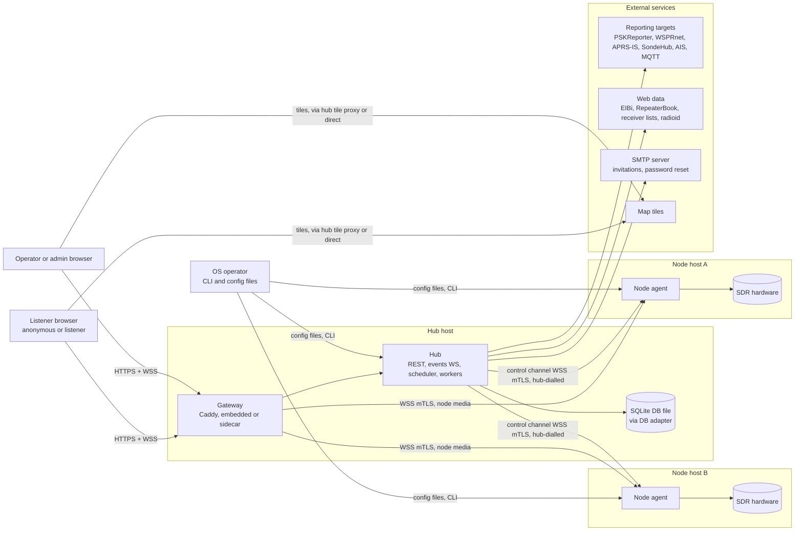

Nodes MUST NOT need outbound Internet access. Any external enrichment (radioid lookups, reporting, web caches) and all e-mail run on the hub. A node MAY access the Internet only for NTP, which is a deployment requirement.


### 3.2 Container view

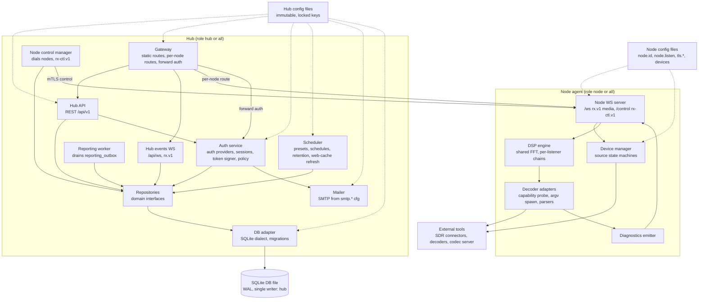

| Container | Responsibilities | State |
|---|---|---|
| Gateway | TLS termination, static routes (`/`, `/api/*`, `/assets/*`), one dynamic route per node (`/nodes/{nodeId}/ws`), forward auth to the hub for node WS upgrades, security headers, request-size limits. | Config only, driven by the hub. |
| Hub API | REST resources (Protocol v1), validation, permission checks, settings precedence (cfg > db > default). | DB |
| Hub events WS | Topic subscriptions, fan-out of hub events, presence heartbeat. | DB plus RAM fan-out |
| Auth service | Auth-provider interface (local password provider in v1), sessions, CSRF tokens, invitations, password reset, the access-token signer and key rotation, listen-policy decisions. | DB plus signing keys in the secret store |
| Mailer | Sends invitation and password-reset e-mails through the SMTP server configured in `smtp.*` (cfg). Without SMTP, invitation and reset links are shown to the admin to copy. | None |
| Node control manager | Dials every enrolled node, keeps the control channels, pushes desired state, ingests node events, writes them in batches to the DB, and drives gateway route changes. | DB |
| Scheduler | Applies `schedules` (`device_id`, `preset_id`, time window), validating each preset against the device's capabilities, retention jobs, web-cache refreshes (EIBi, repeaters, receivers), session and token purge. | DB |
| Reporting worker | Delivers `reporting_outbox` rows (PSKReporter, WSPRnet, APRS-IS, SondeHub, AIS, MQTT) with retry and back-off. Also handles MQTT ingest. | DB |
| Repositories and DB adapter | Domain repository interfaces, implemented by one adapter per DB engine (SQLite in v1). See "Persistence". | — |
| DB | The only persistent store (P4): one SQLite database file on the hub host. Tables are named in the brief. | — |
| Config files | Immutable at runtime. Keys set there are locked in the UI. | Files |
| Node: device manager | Device discovery, source lifecycle (on-demand or always-on, retry policy, failed state), connector processes. | RAM |
| Node: DSP engine | Shared FFT per device, per-listener demodulator chains, audio encoders, secondary FFT, S-meter. | RAM |
| Node: decoder adapters | One adapter per external decoder: capability probe, argv-only spawn, typed parser, timeouts, restart with back-off, private working directory per decoder instance. | RAM, private tmp |
| Node: diagnostics emitter | Computes the P5 state per decoder session and pushes it to the owning client and to the hub. | RAM |
| Node WS | `/ws` (media, `rx.v1`, reached only through the gateway) and `/control` (`rx-ctl.v1`, hub only). Both require mTLS from the peer. | RAM |
| External tools | SDR connectors, SoapySDR, decoders, codec server (AMBE). They run as separate processes, never in the node agent's address space. | — |


### 3.3 Persistence

The hub reaches the database only through a DB adapter. SQLite is the only engine in v1.

| Aspect | Requirement |
|---|---|
| Repository interfaces | The domain layer MUST define repository interfaces (users, sessions, presets, schedules, bookmarks, connections, decodes, files, settings, audit…). Domain and application code MUST depend only on these interfaces, never on an engine or a driver. |
| Adapters | One adapter per engine implements every repository interface and owns its SQL dialect. v1 ships the SQLite adapter only. |
| Migrations | Migrations are versioned per dialect (`migrations/sqlite/…`). The hub applies pending migrations at startup inside a transaction and refuses to start if the schema is newer than the binary. `<product> admin migrate` runs them offline. |
| Portable schema | Generic SQL types only: integer, real, text, blob, boolean stored as integer, timestamps as integer ms UTC, JSON stored as text. Core logic MUST NOT rely on engine-specific features (no SQLite-only functions, triggers or `ROWID` semantics, no PostgreSQL-only types). Engine-specific tuning stays inside the adapter. |
| SQLite mode | WAL journal mode, `foreign_keys=ON`, `busy_timeout` ≥ 5 s, `synchronous=NORMAL`. `db.dsn` (cfg) points to a local file (for example `sqlite:///var/lib/<product>/rx.db`). Network file systems MUST NOT be used. |
| Single writer | The hub is the only process that opens the DB, and the adapter MUST serialise writes through one writer connection (plus a read pool). Nodes never touch the DB. Writes are batched in short transactions. |
| Blobs | File contents are stored in `file_blobs` inside SQLite, chunked (≤ 256 KiB per row), with a per-file cap `files.max_file_bytes` (default 25 MiB) and a total quota `files.max_bytes` (default 5 GiB). |
| Backup | `<product> admin backup` MUST produce a consistent online copy (SQLite backup API or `VACUUM INTO`) without stopping the hub. |
| Future: PostgreSQL | A PostgreSQL adapter is future work. It MUST pass the same repository contract test suite as the SQLite adapter. It is the precondition for HA hub replicas. |


### 3.4 Deployment variants

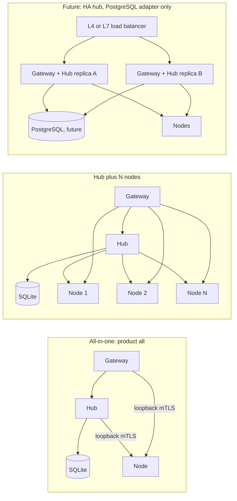

| Variant | Description | Requirements |
|---|---|---|
| All-in-one (`<product> all`) | One command starts a hub and a local node. This is the default for single-SDR hobby stations. | The hub and node MUST talk through the same protocols as in a grid (control channel and node WS over loopback with mTLS, or a Unix socket with peer-credential check). Enrollment MUST be automatic (the hub issues the node certificate on first start). The DB is a local SQLite file. |
| Hub + N nodes | One `<product> hub` and N `<product> node` processes on other hosts. | Each node MUST be reachable from the hub at `node.listen` (LAN, VPN or port-forward). Nodes MUST NOT be reachable directly from browsers. The node port SHOULD be firewalled to the hub address(es). |
| Hub-as-node | The hub host also has SDRs. | Runs as `<product> all` with remote nodes enrolled as well. The local node is a normal row in `nodes`. |
| HA hub replicas (future) | ≥ 2 hub replicas share one PostgreSQL DB, each with its own gateway. | Not supported in v1: SQLite has a single writer. Possible only once the PostgreSQL adapter exists. The design keeps it open: (1) sessions, settings and all state are already in the DB. (2) Each node control channel would be owned by one replica through a DB lease. (3) Hub events would fan out across replicas (DB notifications or an inter-replica WS mesh), which is transport, not state. (4) Scheduler and retention jobs would run under a single DB lease. (5) Token signing keys would be shared through the secret store. |


### 3.5 CLI roles

| Command | Starts | Notes |
|---|---|---|
| `<product> hub` | Gateway (embedded or sidecar driver), hub API, events WS, control manager, scheduler, reporting worker | Requires `db.dsn` (SQLite file). |
| `<product> node` | Node agent | Requires `node.id`, `node.listen`, `tls.*`, and enrollment material on first start. |
| `<product> all` | Both, wired over loopback | Zero-config enrollment of the local node. |
| `<product> admin …` | Offline admin tasks: create the first admin, issue an invitation or a password-reset link, run migrations, back up the DB, rotate keys, show the enrollment token, import an OpenWebRX+ installation (migration tool, M5) | MUST NOT need the hub to be running, except for commands that call its API. |


---

## 4. Grid design

### 4.1 Node identity

- `node.id` (cfg) is a stable slug `^[a-z0-9][a-z0-9-]{1,62}$`, unique per hub. It MUST NOT change after enrollment. Renaming is a display-name change only (`nodes.display_name`).
- The cryptographic identity is the node's key pair (Ed25519 or ECDSA P-256), generated on first start and kept in the node's `tls.*` files (cfg directory, 0600). These are config files, not state, so P1 holds.
- The node certificate is issued by the hub's internal CA. Its SAN MUST contain the URI `urn:rx:node:<node.id>` and the DNS names or IPs of `node.listen`. Validity: 90 days, renewed by the hub over the control channel when 2/3 of the validity has elapsed.
- The hub has its own client certificate (SAN `urn:rx:hub:<hub-id>`) and the gateway has its own (SAN `urn:rx:gateway:<hub-id>`), both issued by the same CA. A node MUST accept `/control` only from a hub URI SAN and `/ws` only from a gateway URI SAN.


### 4.2 Enrollment: config file vs DB

| Source | How a node is declared | Mutability |
|---|---|---|
| Hub config file | `nodes.<id>.address`, optional `nodes.<id>.display_name` | Locked. Shown read-only in Admin, cannot be deleted from the UI. |
| DB | Admin → Nodes → Add (`POST /api/v1/nodes`) | Editable and deletable by admins. |
| All-in-one | Implicit local node | Locked (from the CLI role). |

Enrollment protocol (first contact, before mTLS exists):

1. The admin creates the node in the hub (UI or config file). The hub generates a single-use **enrollment token** (≥ 128-bit random, TTL 24 h, stored hashed in `nodes.enrollment_token_hash`) and shows it once together with the hub CA fingerprint (SHA-256).
2. The operator puts both on the node, either as config keys `hub.enrollment_token` and `hub.ca_fingerprint` or through `<product> node --enroll-token … --hub-ca …`. The node also has `hub.url` (cfg), used for the token issuer check and the allowed Origin.
3. Not yet enrolled, the node serves only `POST /enroll` on `node.listen` with a self-signed certificate. Every other path returns 403.
4. The hub dials `https://<address>/enroll` and pins the node's self-signed certificate for this exchange only. It sends `{node_id, hub_ca_chain, nonce, proof}` where `proof = HMAC-SHA256(enrollment_token, nonce ‖ node_id ‖ sha256(node self-signed cert))`.
5. The node checks that `hub_ca_chain` matches `hub.ca_fingerprint`, then verifies `proof`. It answers with a CSR for its key pair and `HMAC(enrollment_token, nonce ‖ sha256(CSR))`.
6. The hub verifies the HMAC, signs the CSR, marks the token consumed, and returns the certificate. The node switches to mTLS-only mode (`/enroll` disabled). From then on the node accepts only certificates chaining to the hub CA.
7. The hub records `nodes.enrolled_at` and `nodes.cert_fingerprint` and opens the control channel.

Re-enrollment (lost key, moved host) MUST require a new token issued by an admin. Revoking a node (`DELETE /api/v1/nodes/{id}` or `POST …/revoke`) MUST add the certificate serial to the hub's revocation list, close its control channel, remove its gateway route and invalidate all tokens scoped to it.


### 4.3 mTLS and token layers

| Link | Transport auth | Application auth |
|---|---|---|
| Hub → node `/control` | mTLS. The client cert must have a hub URI SAN. The node checks the CA and the revocation list pushed by the hub. | The first frame `ctl.hello` carries a hub-signed challenge response proving possession of the token-signing key. The node checks protocol version compatibility. |
| Gateway → node `/ws` | mTLS. The client cert must have a gateway URI SAN. | Per-connection **access token** (`X-Rx-Access-Token` request header injected by the gateway after forward auth, plus in-band refresh). See "Authentication and authorisation". |
| Browser → gateway | TLS (server cert, ACME or operator-provided) | Session cookie or anonymous, CSRF on REST writes. |

TLS requirements: TLS 1.3 MUST be supported and SHOULD be the only version on hub ↔ node links. Session tickets MAY be used. Certificate private keys MUST be 0600 files or held in an OS keystore.


### 4.4 Control channel (hub-dialled)

- Endpoint: `wss://<node.listen>/control`, WS subprotocol `rx-ctl.v1`. It uses the same JSON envelope as Protocol v1 (`{v,type,id,ts,payload}`) and the same error frame.
- The hub MUST hold exactly one control channel per node. It reconnects with jittered exponential back-off (1 s → 60 s).
- Message order is preserved per channel. Every node→hub event carries a per-node monotonically increasing `seq` inside `payload`. The hub acknowledges in batches (`ctl.ack {upto_seq}`) only after the DB commit. The node keeps unacknowledged events in its RAM buffer and replays them after a reconnect (at-least-once delivery). DB writes MUST be idempotent on `(node_id, seq, boot_id)`.

Hub → node messages:

| Type | Payload | Purpose |
|---|---|---|
| `ctl.hello` | `{hub_id, hub_version, protocols:["rx-ctl.v1"], challenge_sig, server_time}` | Opens the session. |
| `ctl.state.apply` | `{revision, devices:{<deviceId>: {presets, active_preset_id, schedule}}, policy:{listen_policy}, reporting:{…}}` | Desired state, built from cfg > DB > defaults. `presets` lists only the presets compatible with that device's capabilities. It carries **no device settings**: they live only in the node config file (hardware, gain, PPM, sample rates, frequency range, `listen_policy` override, `operator_can_retune`, `always_on`). The node MUST apply it atomically and answer `ctl.state.applied {revision, errors[]}`. |
| `ctl.keys.update` | `{jwks:{keys:[…]}, revoked_kids:[…]}` | Token verification keys (see rotation). |
| `ctl.revocations` | `{sessions:[sid…], users:[uid…], cert_serials:[…]}` | Live revocation (logout everywhere, user disabled, role removed, node revoked): the node MUST close matching media WS within 1 s with close code 4403. |
| `ctl.preset.activate` | `{device_id, preset_id, actor}` | Operator or scheduler preset switch. The hub checks compatibility first; the node re-checks and refuses with `preset_incompatible`. |
| `ctl.device.retune` | `{device_id, center_freq, actor}` | Operator retune. |
| `ctl.device.control` | `{device_id, action:"restart"}` | Admin. Restarts the source and clears `failed`. Enabling or disabling a device is a node config change. |
| `ctl.cert.renew` | `{certificate_chain}` | Certificate rotation. |
| `ctl.capabilities.probe` | `{}` | Forces a capability re-probe. |
| `ctl.ping` | `{}` | Application-level liveness. |
| `ctl.ack` | `{upto_seq}` | Ack of node events. |

Node → hub events:

| Type | Payload (abridged) | Hub action |
|---|---|---|
| `ctl.welcome` | `{node_id, boot_id, version, protocols, capabilities_hash, last_applied_revision}` | Version check, then `ctl.state.apply` if the revision differs. |
| `node.capabilities` | see capability reporting | Upsert `node_capabilities` and mirror `devices[]` into the read-only `devices` registry. |
| `node.heartbeat` | `{seq, uptime_s, cpu, load, temp_c?, battery?, mem, listeners, streams, queue_depth, clock_offset_ms, ntp_synced}` every 10 s | Update `nodes.last_seen`, emit `node.status`. |
| `device.state` | `{device_id, state:"stopped"\|"starting"\|"running"\|"failed"\|"disabled"\|"offline", reason?, active_preset_id, center_freq, sample_rate, listeners}` | Update the runtime columns of the `devices` registry, emit hub event. |
| `connection.opened` / `connection.closed` / `connection.heartbeat` | `{cid, sid?, user_id?, device_id, ip_hash, demod, since}` | Upsert `connections` (presence). |
| `decode.batch` | `[{device_id, mode, freq, ts, band, payload, source:"listener"\|"background", cid?}]` | Insert `decoded_messages`, enqueue `reporting_outbox`, emit `decode.new`. |
| `map.feature.batch` | `[{key, kind, mode, geometry, attrs, ttl_s, ts}]` | Upsert `map_features`, emit `map.feature.upsert`. |
| `diag.transition` | `{session_id, device_id, decoder, state, reason, hint, metrics:{snr_db, sync_hits, crc_fail, …}, ts}` | Insert `decoder_diagnostics`, emit `diag.state`. |
| `file.begin` / `file.chunk` / `file.end` | `{file_id, kind, mime, size, sha256, device_id, mode, frequency_hz, received_start_utc, received_end_utc, metadata}` (reception fields are mandatory for decoder-produced files, FIL-008) / `{file_id, offset, data_b64}` / `{file_id}` | Stream into `files` + `file_blobs` (chunks ≤ 256 KiB, max file size `files.max_file_bytes`). |
| `audit.event` | `{actor, action, target, result, ts}` | Insert `audit_log` (for example preset switch, retune). |
| `log.batch` | `{lines:[{ts, level, component, msg}]}` (rate-limited) | Shown in Admin → Nodes → Logs (RAM ring on the hub, not persisted, or persisted with a 24 h retention if enabled). |
| `ctl.state.applied` | `{revision, errors:[…]}` | Shown in Admin. |
| `ctl.pong` | `{}` | |


### 4.5 Health and heartbeat

- Transport: the hub sends WS ping frames every 15 s on every control channel. A missing pong for 30 s closes the channel.
- Application: `node.heartbeat` every 10 s. Three missed heartbeats → node `offline`. The node is `online` again on the next `ctl.welcome`.
- Node health states: `enrolling`, `online`, `degraded` (heartbeat OK but `ctl.state.applied` errors, clock offset > 1 s, NTP unsynced, or queue saturation), `offline`, `incompatible`, `revoked`.
- Clock: the node MUST report `clock_offset_ms` (measured against `ctl.hello.server_time` with RTT/2 correction). Offset > 1 s → `degraded`, with a hint because WSJT/JS8 decoders depend on it.
- Endpoints: `/healthz/live` and `/healthz/ready` exist on hub and node. The node's endpoints are served on `node.listen` to mTLS peers only.


### 4.6 Gateway dynamic routing

The gateway's path layout:

| Path | Upstream | Notes |
|---|---|---|
| `/` and SPA routes, `/assets/*` | hub (static) | Immutable hashed assets, `Cache-Control: public, max-age=31536000, immutable`. |
| `/api/v1/*` | hub API | Body limit `gateway.max_body` (default 1 MiB, 25 MiB on file upload routes). |
| `/api/ws` | hub events WS | |
| `/nodes/{nodeId}/ws` | node `/ws` over mTLS | One route per enrolled node, added and removed at runtime. Forward auth to the hub first. |
| anything else | 404 | |

Rules:

1. The hub is the only writer of the gateway configuration. At startup it MUST load the complete config (static routes plus one route per enrolled, non-revoked node). Afterwards it applies incremental changes.
2. Routes are added on enrollment and removed on revocation or deletion. A node going `offline` MUST NOT remove its route. Fail-fast is done by forward auth (the hub answers 503 `node_offline`), which avoids gateway config churn.
3. Gateway config changes (and so reloads) happen only on node enrollment or removal, which is rare. A WebSocket dropped by a reload is an **accepted risk** (see Risks): no further engineering beyond rules 2 and 3. Caddy closes proxied WebSockets on every config reload, unless the `reverse_proxy` handler sets `stream_close_delay` ([Caddy reverse_proxy docs, "Streaming"](https://caddyserver.com/docs/caddyfile/directives/reverse_proxy#streaming)). Every node route MUST therefore set `stream_close_delay` ≥ `gateway.stream_close_delay` (default `2h`), and SHOULD set `stream_timeout` (default `24h`). Route changes SHOULD be batched (≤ 1 apply per 5 s).
4. Every route object MUST carry an `@id` of the form `node-<nodeId>` so that the hub can address it through the admin API's `/id/` endpoint ([Caddy API docs, "Using @id in JSON"](https://caddyserver.com/docs/api#using-id-in-json)).
5. The node route MUST delete any client-supplied `X-Rx-Access-Token` and `X-Rx-*` headers before forward auth, and MUST set `flush_interval: -1` (low-latency mode, no response buffering).

Two operating modes, chosen by `gateway.mode` (cfg):

| Mode | When | Mechanism |
|---|---|---|
| `embedded` | The hub is implemented in Go | Caddy is linked as a library. The hub builds the same JSON config and loads it in-process. The implementation MAY provide a custom upstream-source module that reads the node registry directly, so that node address changes need no config reload. |
| `sidecar` | Any other stack | Caddy runs as a separate process. The hub drives it through the admin API: `POST /load` at startup with the full config, then `POST /config/apps/http/servers/rx/routes` to append a node route (POST on an array appends), `PATCH /id/node-<id>` to change it, and `DELETE /id/node-<id>` to remove it ([Caddy API docs](https://caddyserver.com/docs/api)). The admin endpoint MUST listen on a Unix socket (0600, owned by the service user) or `localhost:2019` only, MUST set `admin.enforce_origin`, and MUST NOT be reachable from any network. The hub MUST re-push the full config if it detects drift (`GET /config/` hash mismatch) or a sidecar restart. |

Route insertion order: node routes MUST sit before the SPA catch-all route. In sidecar mode the hub SHOULD keep node routes in a dedicated subroute (`@id: "node-routes"`) and append to `/id/node-routes/routes`.

Example node route (sidecar, appended with `POST /id/node-routes/routes`):

```json
{
  "@id": "node-n-roof",
  "match": [{ "path": ["/nodes/n-roof/ws"] }],
  "handle": [
    {
      "handler": "headers",
      "request": { "delete": ["X-Rx-Access-Token", "X-Rx-Node-Id", "X-Rx-Cid"] }
    },
    {
      "handler": "reverse_proxy",
      "upstreams": [{ "dial": "unix//run/rx/hub-authz.sock" }],
      "rewrite": { "method": "GET", "uri": "/internal/gateway/authz?node=n-roof" },
      "headers": {
        "request": {
          "set": {
            "X-Forwarded-Method": ["{http.request.method}"],
            "X-Forwarded-Uri": ["{http.request.uri}"]
          }
        }
      },
      "handle_response": [
        {
          "match": { "status_code": [2] },
          "routes": [
            {
              "handle": [
                {
                  "handler": "headers",
                  "request": {
                    "set": {
                      "X-Rx-Access-Token": ["{http.reverse_proxy.header.X-Rx-Access-Token}"],
                      "X-Rx-Cid": ["{http.reverse_proxy.header.X-Rx-Cid}"]
                    }
                  }
                }
              ]
            }
          ]
        }
      ]
    },
    { "handler": "rewrite", "uri": "/ws" },
    {
      "handler": "reverse_proxy",
      "upstreams": [{ "dial": "10.8.0.12:7443" }],
      "flush_interval": -1,
      "stream_close_delay": "2h",
      "stream_timeout": "24h",
      "headers": { "request": { "set": { "X-Rx-Node-Id": ["n-roof"] } } },
      "transport": {
        "protocol": "http",
        "dial_timeout": "3s",
        "tls": {
          "root_ca_pem_files": ["/etc/rx/tls/hub-ca.pem"],
          "client_certificate_file": "/etc/rx/tls/gateway.crt",
          "client_certificate_key_file": "/etc/rx/tls/gateway.key",
          "server_name": "n-roof.nodes.rx.internal"
        }
      }
    }
  ]
}
```

The second handler is the JSON form of Caddy's `forward_auth`: a non-2xx authz response (401, 403, 429, 503) is returned to the browser as is and the upgrade never reaches the node. Field names follow current Caddy JSON. Newer Caddy versions MAY express the CA trust with a `ca` trust-pool module instead of `root_ca_pem_files`. The implementation MUST pin a tested Caddy version range.


### 4.7 Capability reporting

On every `ctl.welcome`, and whenever its capabilities change, a node sends `node.capabilities`, which the hub stores in `node_capabilities` (one row per node, JSON document plus extracted columns):

| Field | Content |
|---|---|
| `product_version`, `protocols` | e.g. `1.4.2`, `["rx.v1","rx-ctl.v1"]` |
| `platform` | OS, arch, CPU model and cores, SIMD flags, RAM |
| `sdr_drivers[]` | `{type, available, version, reason?}` for each supported source type |
| `devices[]` | Devices configured in the node config file: `{id, name, type, freq_min, freq_max, sample_rates[], listen_policy?, operator_can_retune, always_on}`. The hub mirrors them into the read-only `devices` registry. |
| `devices_detected[]` | Hardware enumerated (serials), shown read-only to help the node operator write the node config file |
| `decoders[]` | `{cap:"cap:wsjt", tools:[{name:"jt9", version, ok}], modes:["ft8","ft4",…]}`. The probe is argv-only with a timeout. |
| `audio_codecs[]` | `["opus","adpcm-ima","pcm-s16le"]` |
| `fft_codecs[]` | `["u8-db","f32"]` |
| `codecserver` | `{available, ambe:bool}` |

The hub derives the mode list offered to clients per device (`GET /api/v1/devices/{id}/modes`) from the mode catalogue intersected with `node_capabilities`, excluding service-only modes for interactive clients. No extra configuration key (such as a decoder allow-list) exists. A mode whose capability is missing MUST be offered as `UNAVAILABLE` with a reason (P5), never silently hidden from admins.


### 4.8 Version compatibility

- The product uses SemVer. Hub and nodes negotiate the protocol through the WS subprotocol header (`rx-ctl.v1`) and `ctl.welcome.protocols`.
- A hub MUST support nodes of the same major version and the same or previous minor version (N, N-1). An older node MUST be marked `degraded` with an "upgrade recommended" hint. A newer-minor node MUST work in the hub's dialect: new optional fields are ignored, and unknown message types are answered with `error {code:"unsupported_type"}` without closing the channel.
- A major mismatch → node `incompatible`. The hub keeps the channel only for `ctl.welcome`, `node.capabilities` and heartbeats, pushes no state, and the gateway authz answers 503 `node_incompatible`.
- The browser client is served by the hub, so client and hub versions always match. The node WS (`rx.v1`) MUST stay backward compatible within major 1: fields are additive only, and unknown fields are ignored by both sides.


### 4.9 Failure modes

| Failure | Detection | Behaviour |
|---|---|---|
| Node unreachable at hub start | Dial error | Node `offline`, retry with back-off, admin notification after 5 min. |
| Control channel drops, node alive | WS close or ping timeout | Media WS already established through the gateway keep working until token refresh fails (≤ 5 min plus grace). New connects get 503. Events are buffered on the node. |
| Node restarts | New `boot_id` in `ctl.welcome` | The hub drops in-flight presence rows of the old boot (`connections` closed with reason `node_restart`), re-applies state, and resets `seq` tracking per `boot_id`. |
| Hub restarts | Node sees the control channel close | The node keeps background services on its last state. Media WS through the gateway are lost (the gateway restarts) and clients reconnect and resume. |
| Gateway config apply fails (sidecar) | Admin API non-2xx | Retry, then full `POST /load`. The hub marks itself `degraded` and raises an admin notification. |
| Sidecar crash | Admin API unreachable | Supervisor restarts it. The hub re-pushes the full config. |
| Node state apply partially fails | `ctl.state.applied.errors` | Node `degraded`. The admin sees the per-key error. Last-good config stays active for the affected device. |
| Certificate near expiry, hub unreachable | Node timer | The node MUST raise `degraded` 7 days before expiry. When it expires the node refuses all peers until re-enrollment. |
| Clock skew | `clock_offset_ms` | > 1 s: `degraded` plus diagnostics hint on time-sensitive decoders. > 30 s: token `nbf`/`exp` checks would fail, so the node MUST refuse media connects with error `clock_skew` and say so in its logs. |
| Second control channel for the same node | New authenticated hub channel | A node MUST accept a single control channel and MUST close the older one when a new authenticated hub channel arrives. |
| Event buffer overflow on the node | Buffer bytes | Drop by priority (see Availability). Emit `node.events_dropped {count, kinds}` on reconnect. The hub records it in `audit_log` (system actor). |


### 4.10 Node registration and route add

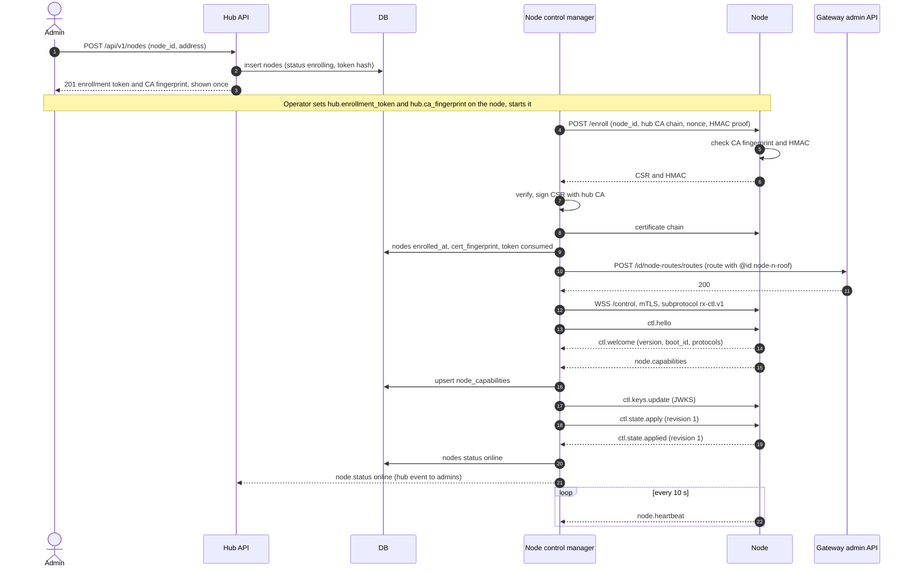


---

## 5. Authentication and authorisation

### 5.1 Identities and roles

- Roles: `anonymous` (no account), `listener` (registered), `operator`, `admin` (P3). They are stored in `roles` and `user_roles`. A `user_roles` row MAY carry a `device_id` scope (NULL = all devices), so that an operator can be limited to some devices. `admin` is always global.
- Accounts are optional for listening (see listen policy). Accounts exist **only by invitation**: there is no self-registration and no registration mode.
- `users` holds the person: `id`, `username` (unique), `email` (unique, nullable), `email_verified_at`, `display_name`, `password_hash` (**nullable**: NULL for accounts that only have non-local identities), `disabled_at`, `created_at`, `updated_at`.
- `user_identities` links a user to the way they log in: `user_id`, `provider`, `subject`, `created_at`, unique on `(provider, subject)`. In v1 the only provider is `local` (subject = the user id), created together with the account when the invitee sets a password.
- Bootstrapping: the first admin is created by `<product> admin create-user --admin` or by a one-time setup link printed at first start. There is no default password.


### 5.2 Auth-provider interface

Login goes through an **auth-provider interface**, so that OIDC / OAuth2 can be added later without changing sessions, tokens or permissions.

| Aspect | Requirement |
|---|---|
| Interface | A provider has an id (`local`, later e.g. `oidc:<name>`), a display name, and an operation that turns provider-specific credentials (or a callback) into a verified `(provider, subject, claims)` result, where `claims` MAY carry `email` and `email_verified`. |
| Resolution | The auth service maps `(provider, subject)` to `user_identities.user_id`. An unknown identity MUST NOT create an account in v1. A disabled user MUST be refused. |
| Local provider (v1) | Form login with username or e-mail plus password, verified with Argon2id against `users.password_hash`. |
| Independence | Sessions, CSRF and node access tokens MUST NOT depend on the provider used. A session records `auth_provider` for audit only. |
| Not in v1 | MFA, API tokens for users, SSO / OIDC / OAuth2 providers. |
| Future | OIDC / OAuth2 providers configured in cfg. Account linking by **verified** e-mail (an external identity whose verified e-mail equals a user's verified e-mail is attached as a new `user_identities` row) is future work and MUST require explicit confirmation by the logged-in user or an admin. |


### 5.3 Password storage and reset

| Aspect | Requirement |
|---|---|
| Hash | Argon2id, PHC string format in `users.password_hash`. Parameters in cfg: `auth.argon2.memory_kib` (default 19456), `auth.argon2.iterations` (default 2), `auth.argon2.parallelism` (default 1). A hash with outdated parameters MUST be re-hashed on the next successful login. |
| Policy | Minimum 12 characters, maximum 256, no composition rules. Passwords SHOULD be checked against a local list of common passwords. |
| Unknown users | Verification MUST run against a dummy hash, so that response time does not reveal whether an account exists. |
| Reset request | `POST /api/v1/auth/password-reset {login}` always answers 202, whether or not the account exists. If it exists, has an e-mail and SMTP is configured, the hub e-mails a link with a reset token. |
| Reset token | ≥ 256-bit random, single-use, TTL `auth.reset_token_ttl` (cfg, default 1 h). Only its SHA-256 hash is stored in `password_reset_tokens` (`token_hash`, `user_id`, `created_at`, `expires_at`, `used_at`). A new request invalidates older tokens of the same user. |
| Reset confirm | `POST /api/v1/auth/password-reset/confirm {token, new_password}` sets the hash, marks the token used, revokes all the user's sessions and writes the audit log. |
| Admin-issued reset | An admin MAY issue a reset link for a user (`POST /api/v1/users/{id}/password-reset`). It is e-mailed if SMTP is configured, otherwise shown once to the admin to copy. |
| SMTP | `smtp.host`, `smtp.port`, `smtp.tls` (`starttls` \| `implicit` \| `off`), `smtp.username`, `smtp.password` (secret store), `smtp.from`. All cfg. Without SMTP, links are copyable only. |


### 5.4 Invitations

| Aspect | Requirement |
|---|---|
| Create | An admin creates an invitation with a pre-set role (`listener`, `operator` with optional device scope, or `admin`), an optional e-mail and an expiry (default 7 days, max 30). |
| Delivery | If an e-mail is given and SMTP is configured, the hub sends the link. In every case the admin can copy the link once from the UI. |
| Token | ≥ 256-bit random, single-use. Only its hash is stored in `invitations` (`token_hash`, `email?`, `role`, `device_id?`, `created_by`, `expires_at`, `used_at`, `revoked_at`). |
| Accept | `GET /api/v1/auth/invitations/{token}` validates the token and returns the pre-set role and e-mail. `POST /api/v1/auth/invitations/{token}/accept {username, display_name, password, email?}` creates `users`, the `local` `user_identities` row and `user_roles`, marks the invitation used, and logs the user in (new session). If the invitation carried an e-mail, that e-mail is stored as verified. |
| Revoke | An admin can revoke an unused invitation. |


### 5.5 Sessions

| Item | Requirement |
|---|---|
| Store | `sessions` table: `id_hash` (SHA-256 of the cookie value), `user_id`, `auth_provider`, `created_at`, `last_seen_at`, `idle_expires_at`, `absolute_expires_at`, `ip_hash`, `user_agent`, `csrf_secret`, `revoked_at`. It survives restarts. |
| ID | ≥ 256-bit CSPRNG, base64url. Only the hash is stored. |
| Lifetime | Idle timeout `session_idle_timeout` (default 12 h), absolute `session_max_age` (default 30 days with "remember me", otherwise 24 h). |
| Rotation | A new ID on login (any pre-session value is discarded), on role change and on password change. |
| Invalidation | Logout deletes the session. Password change or reset, user disable, role removal or admin "sign out everywhere" revoke all of the user's sessions. The revocation is pushed to nodes (`ctl.revocations`). |
| Anonymous | Anonymous visitors get no session row. Their presence is tracked per connection (`connections`) with an anonymous connection id. |


### 5.6 Cookie

- Name `__Host-rx_session`, attributes `Secure; HttpOnly; Path=/; SameSite=Lax`. No `Domain`.
- With `tls.mode = off` (LAN or loopback only), the name is `rx_session` and `Secure` is omitted. The UI MUST show a non-dismissable warning to admins.
- No other cookie carries credentials. There are no per-user preferences in v1: look & feel is an admin DB setting that a config file can lock (theme mode `light`, `dark` or `auto`, where `auto` follows the OS `prefers-color-scheme`; default waterfall palette and levels; default layout options; shortcut set). Per-session runtime state (volume, squelch, NR, zoom, own tuning, panel state) MAY be kept in localStorage as a non-authoritative convenience, never synced to the account.


### 5.7 CSRF

- Every unsafe REST method (`POST`, `PUT`, `PATCH`, `DELETE`) MUST carry `X-CSRF-Token`, an HMAC of the session id with `csrf_secret`, fetched from `GET /api/v1/auth/session`. Anonymous unsafe endpoints (login, password reset, invitation accept, token mint for anonymous connections) use a double-submit token bound to a pre-session cookie.
- The `Origin` header (or `Referer` when Origin is absent) MUST match one of the configured public origins (`hub.url` plus `gateway.extra_origins` (cfg)) on every unsafe request and every WS upgrade. A mismatch → 403.
- JSON endpoints MUST require `Content-Type: application/json`. No state change on GET.


### 5.8 Access tokens

The hub issues access tokens for node media WS. Nodes never see session cookies. Tokens are independent of the login method.

| Aspect | Requirement |
|---|---|
| Format | JWS compact serialisation, `alg: EdDSA` (Ed25519, RFC 8037), header `kid`. Implementations MAY use an equivalent signed format (e.g. PASETO v4.public) only if every node supports it. Hub and nodes MUST agree through `rx-ctl.v1`. |
| TTL | 300 s (`auth.token_ttl` (cfg), 60–900 s). Clock-skew leeway 30 s. |
| Claims | `iss` = `hub.url`. `aud` = `rx-node:<nodeId>`. `sub` = user id or `anon`. `sid` = session id hash prefix (absent for anonymous). `cid` = connection id (unique per media WS, issued by the hub). `roles` = role names. `scp` = list of `{dev:<deviceId>, perm:["listen","demod","preset","retune"]}` computed from roles and device policies. `lim` = `{max_demods}`. `iat`, `nbf`, `exp`, `jti`. |
| Minting | (1) At WS upgrade by gateway forward auth (`/internal/gateway/authz`): the hub evaluates cookie, listen policy and node status, and returns 2xx with `X-Rx-Access-Token` and `X-Rx-Cid`. (2) On refresh, through `POST /api/v1/auth/token {node_id, cid}`, which needs the session cookie plus CSRF, or the anonymous double-submit token for anonymous connections bound to the same `cid`. |
| Refresh | The client MUST send `auth.refresh {token}` on the media WS before `exp` (recommended at 80 % of TTL). The node MUST verify the new token (same `cid`, same `aud`) and replace the connection's scopes. Expiry without refresh → close 4401 `token_expired` after a grace of 30 s. A downgrade of scopes (e.g. operator role removed) MUST take effect immediately on refresh. |
| Signing keys | Ed25519 key pairs in the secret store. Rotation every 30 days (`auth.key_rotation_days`) or on demand (`<product> admin rotate-keys`). Overlap: the new key is published to nodes (`ctl.keys.update`) ≥ 60 s before it signs anything, and the retired key stays published for TTL + leeway. Compromise: `revoked_kids` forces immediate rejection. |
| Node offline verification | Nodes verify signature, `iss`, `aud`, `nbf`/`exp` and `cid` uniqueness entirely offline, using the JWKS received over the control channel and held in RAM. A node that has not received a JWKS since boot MUST refuse media connects (`hub_unavailable`). A node MAY be configured with static verification keys (`hub.token_keys` (cfg)) for cold start without the hub. |
| Revocation | Short TTL plus push: `ctl.revocations` closes affected connections within 1 s. |
| Never | Tokens MUST NOT appear in URLs or query strings, MUST NOT be logged, and MUST NOT be stored in browser storage beyond the JS memory of the page. |


### 5.9 Listen policy enforcement points

The effective policy for a device is `devices.<id>.listen_policy` if set, otherwise the global `listen_policy`. It is evaluated at three points, and each MUST deny independently:

| Point | Check | Failure |
|---|---|---|
| Hub events WS `/api/ws` upgrade and `sub` | Anonymous clients may connect when at least one device is anonymous-listenable or the station page is public. Topics scoped to devices (`decodes:device=…`, `diagnostics:device=…`) require listen permission on that device. Admin topics require `admin`. | 403 on upgrade. `error {code:"forbidden"}` on `sub`. |
| Gateway forward auth (`/nodes/{nodeId}/ws` upgrade) | The hub refuses to mint a token if no device on the node is listenable for the caller, or the node is offline or incompatible. | 401 (login required), 403, 429 (token mint rate limit) with `Retry-After`, or 503. |
| Node media WS (`device.attach`, `demod.create`, `preset.select`, `device.retune`) | The node checks the token's `scp` for the device and permission. | `error {code:"forbidden"}`. Repeated violations (> 10/min) → close 4403. |


### 5.10 Permission matrix (server-side)

| Action | Anonymous | Listener | Operator | Admin | Enforced at |
|---|---|---|---|---|---|
| View station info, public map, public decodes | ✅ | ✅ | ✅ | ✅ | Hub API |
| Listen to device (attach, own demodulator, own decoders) | `LP` | ✅ | ✅ | ✅ | Authz, node |
| View bookmarks of a device | `LP` | ✅ | ✅ | ✅ | Hub API |
| Switch shared preset | ❌ | ❌ | ✅ (device scope) | ✅ | Node (token scope) + hub audit |
| Retune center frequency | ❌ | ❌ | ⚙️ `devices.<id>.operator_can_retune` | ✅ | Node |
| Manage bookmarks (hub-wide) | ❌ | ❌ | ✅ | ✅ | Hub API |
| Listener count | ✅ | ✅ | ✅ | ✅ | Hub API / events WS |
| View connected listeners (presence list) | ❌ | ❌ | ❌ | ✅ | Hub API / events WS |
| Presets, schedules, nodes, settings, users, invitations | ❌ | ❌ | 👁 presets, and schedules of scoped devices | ✅ | Hub API |
| Devices (registry mirrored from node config) | ❌ | ❌ | 👁 scoped devices | 👁 | Hub API (no write route) |
| Delete files | ❌ | ❌ | ❌ | ✅ | Hub API |


### 5.11 Operator device permissions

- An operator's rights on a device come from `user_roles(role=operator, device_id IN (NULL, <dev>))` and are copied into `scp`.
- `preset` perm: any operator in scope. `retune` perm: only if `devices.<id>.operator_can_retune` is true.
- Shared-state commands MUST be rate-limited per device (default: 1 preset switch per 5 s, 4 retunes per second coalesced) and recorded in `audit_log`.
- When a background schedule (`schedules`) and an operator compete, the operator's choice MUST hold until the device becomes idle, then the scheduler resumes. There is no configuration key for this. The UI shows who holds the device.
- An operator or admin picks a preset for a device only from the presets compatible with that device's capabilities (frequency range, supported sample rates). Any other preset is refused with `preset_incompatible`.


### 5.12 Rate limits

Defaults. All are configurable (cfg or db). They are keyed by canonical client IP, account and session. Every refusal returns 429 or `error {code:"rate_limited", retry_after_ms}`.

| Scope | Default |
|---|---|
| `POST /api/v1/auth/login` | 5/min per IP, 20/h per account. Exponential lock-out after 10 failures (15 min). |
| Password reset request, invitation accept | 3/h per IP, 3/h per account |
| Token mint (`/auth/token`, authz) | 30/min per session or cid |
| REST (general) | 600/min per session, 120/min per anonymous IP |
| WS upgrades (hub and node) | 10/min per IP |
| Node media WS messages | 20/s sustained, burst 50 |
| Shared-state commands | See operator device permissions. |
| Request body | 1 MiB default, file upload 25 MiB |


### 5.13 Audit log

`audit_log` rows: `{id, ts, actor_type: user|system|node, actor_id, ip_hash, action, target_type, target_id, before?, after?, result: ok|denied|error, reason?}`. Secrets are always redacted. The following MUST be logged:

- Authentication: login success and failure (with throttling state and provider), logout, password change, password reset request and completion, session revocation.
- Invitations: create, revoke, accept.
- Users and roles: update, disable, delete, role grant and revoke.
- Settings and devices: every DB setting change (key, old and new value, secrets redacted), preset create/update/delete, schedule changes, bookmark create/update/delete/import, node enrollment, revocation and certificate renewal.
- Shared radio state: preset switch, retune.
- Files: deletion.
- Security: token key rotation, CSRF or Origin failures (sampled), repeated forbidden WS messages.

Read access: admins only (`GET /api/v1/audit`). The audit repository MUST be append-only: it exposes no update or delete operation except the retention job.


### 5.14 Login

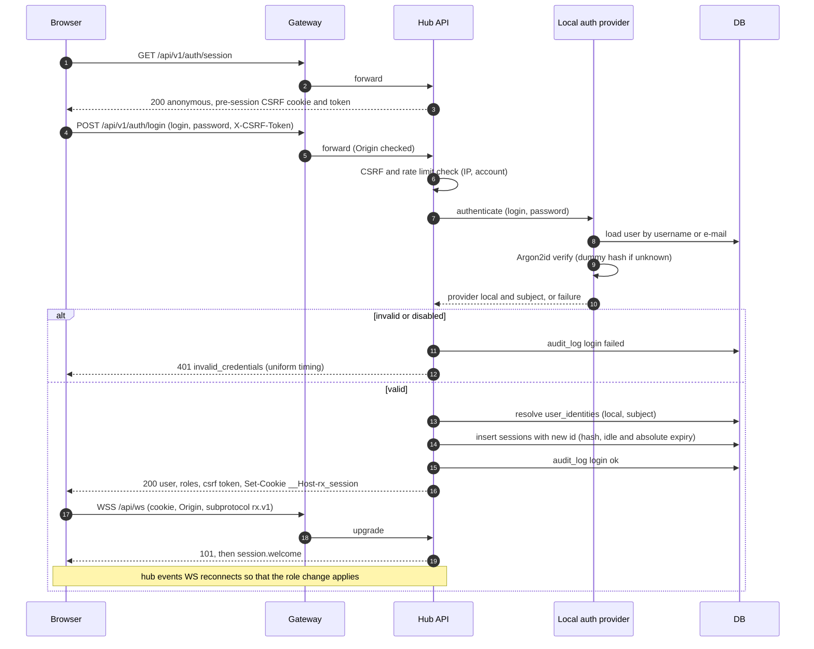


### 5.15 Invitation acceptance

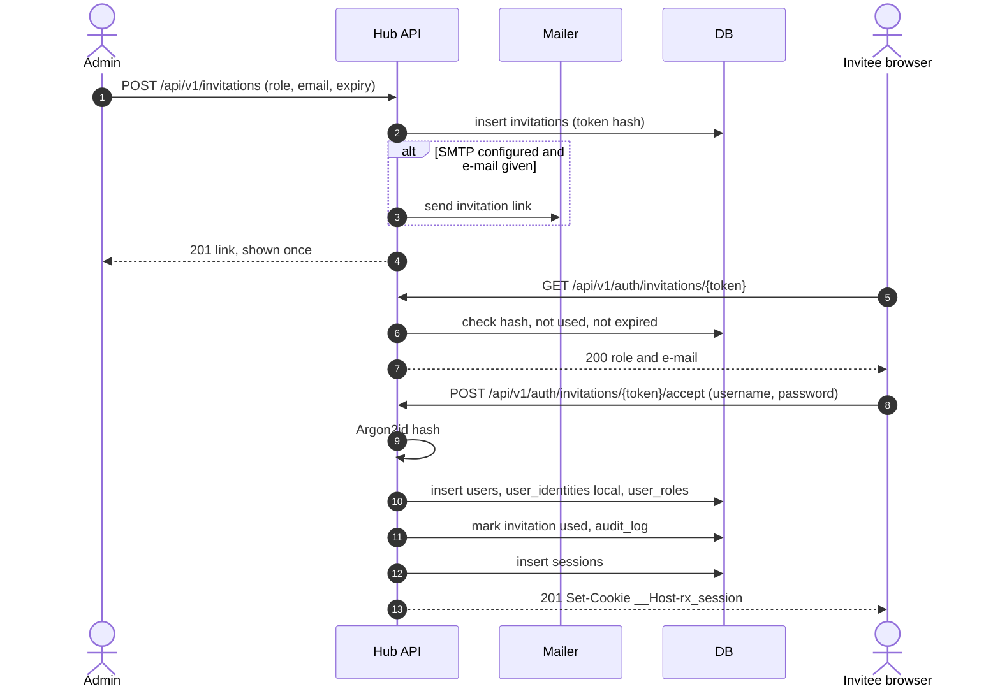


### 5.16 Browser to node media WS connect

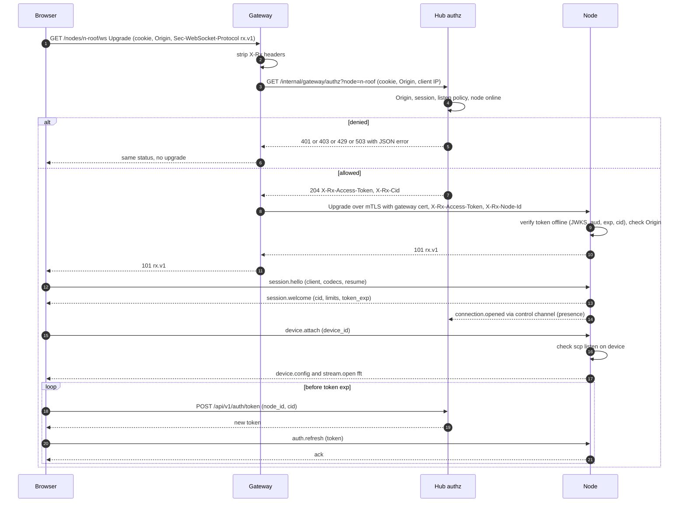


---

## 6. Protocol v1

This section is normative. Roles, the access token and enforcement points are defined in "Authentication and authorisation". Node control channel messages (`rx-ctl.v1`) are defined in "Grid design".

### 6.1 Transport overview

| Channel | Endpoint | Peer | Transport | Auth | Content |
|---|---|---|---|---|---|
| REST | `/api/v1/…` | Browser ↔ hub (through the gateway) | HTTPS, HTTP/1.1 or HTTP/2 | Session cookie + CSRF, or anonymous | JSON resources, file uploads and downloads |
| Hub events WS | `/api/ws`, subprotocol `rx.v1` | Browser ↔ hub | WSS | Session cookie (or anonymous), Origin check at upgrade | JSON envelopes: subscriptions and hub events (presence, map, decodes, diagnostics, node status, notifications) |
| Node media WS | `/nodes/{nodeId}/ws`, subprotocol `rx.v1` | Browser ↔ gateway ↔ node `/ws` | WSS to the gateway, then WSS with mTLS to the node | Forward auth at upgrade → access token injected by the gateway, refreshed in-band | JSON control envelopes plus binary stream frames (FFT, audio) |
| Control channel | node `/control`, subprotocol `rx-ctl.v1` | Hub → node (hub dials) | WSS mTLS | Certificates + `ctl.hello` | See Grid design |

General rules:

- Every WS endpoint MUST require the subprotocol `rx.v1` (or `rx-ctl.v1`) and reject the upgrade with HTTP 426 if it is absent. The server MUST echo the selected subprotocol.
- WebSocket framing MUST follow RFC 6455 completely: masked client frames, fragmentation, 64-bit lengths, close codes, ping/pong with echoed payload.
- `permessage-deflate` MAY be negotiated on the hub events WS. It MUST NOT be used on the node media WS, for latency and because compression over attacker-influenced data creates an oracle.
- All text frames are UTF-8 JSON objects that follow the envelope. All binary frames follow the binary frame header. Byte order is **little-endian** everywhere.
- Every timestamp is integer milliseconds since the Unix epoch, UTC, unless a field name says `_us` (microseconds).
- Identifiers are opaque strings (`^[A-Za-z0-9_-]{1,64}$`) and stable across restarts. Composite identifiers built by concatenating other ids MUST NOT be used.
- Frequencies are integer Hz (`int64`). Offsets are signed integer Hz. Levels are dB as float.
- Every untrusted string field (decoded payloads, names, third-party data) is **plain text**. Clients MUST render it as text and never as HTML. No message carries HTML.


### 6.2 WebSocket subprotocol rx.v1

#### Envelope

Every JSON text frame in either direction:

```json
{ "v": 1, "type": "demod.set", "id": "c-42", "ts": 1767225600123, "payload": { "offset_hz": 14000 } }
```

| Field | Type | Required | Rules |
|---|---|---|---|
| `v` | integer | yes | Protocol major version, `1`. Anything else → error `unsupported_version` and close 4426. |
| `type` | string | yes | `^[a-z][a-z0-9_]*(\.[a-z0-9_]+)*$`, from the catalogues below. Unknown type → error `unsupported_type`. The connection stays open. |
| `id` | string ≤ 64 chars | no | Correlation id chosen by the sender. When present on a request, the receiver MUST answer with exactly one `ack` or one `error` that references it. Server-originated events normally omit `id`. |
| `ts` | integer | yes | Sender time in ms. Used for latency and clock-offset estimation only, never for authorisation. |
| `payload` | object | yes (may be `{}`) | Type-specific. Validated against a schema: unknown fields → `invalid_payload` (strict) on client → server messages. Clients MUST ignore unknown fields on server → client messages (forward compatibility). |

#### Ack and correlation

```json
{ "v": 1, "type": "ack", "ts": 1767225600130, "payload": { "re": "c-42", "result": { "applied": { "offset_hz": 14000 } } } }
```

- `payload.re` is the request `id`. `result` is type-specific and MAY be `{}`.
- Requests with side effects on shared state (`preset.select`, `device.retune`) MUST carry an `id`. Requests without `id` are fire-and-forget: errors are still reported, with `re: null`.
- Ack timing: the ack is sent after the change is applied (DSP rewired, preset active), or after it is rejected. The client SHOULD time out after 5 s.
- Ordering: messages on one connection are processed in order. Coalescing (e.g. several `demod.set` in a burst) MUST keep the last value per field, and MUST ack every `id`, each with the final applied state.

#### Error frame

```json
{ "v": 1, "type": "error", "ts": 1767225600131,
  "payload": { "re": "c-43", "code": "forbidden", "message": "Retune is not allowed on this device", "retryable": false, "retry_after_ms": null, "details": { "device_id": "dev-hf" } } }
```

| `code` | Meaning | Close? |
|---|---|---|
| `invalid_json`, `invalid_envelope`, `invalid_payload` | Schema violation (`details.path` names the field) | After 10 in 60 s → 4400 |
| `unsupported_type`, `unsupported_version` | | `unsupported_version` → 4426 |
| `unauthenticated`, `token_expired`, `token_invalid` | | 4401 |
| `forbidden` | Role, scope, listen policy or device flag denies it | Repeated → 4403 |
| `not_found` | Unknown device, preset, demod or stream | no |
| `conflict` | e.g. preset switch while the device is starting | no |
| `capacity_exceeded` | Demodulators per connection (`lim.max_demods`) reached | no |
| `rate_limited` | `retry_after_ms` set | Repeated → 4429 |
| `out_of_range` | Frequency or parameter outside the device range | no |
| `preset_incompatible` | Preset does not fit the device's capabilities (frequency range, supported sample rates). `details` names the failing check. REST: 422. | no |
| `device_unavailable` | Device stopped, failed, offline | no |
| `demod_error` | DSP chain could not be built | no |
| `node_unavailable`, `hub_unavailable`, `clock_skew` | | 4503 |
| `internal` | Bug. Has a `details.incident_id` that matches a server log line. | no |

`message` is human-readable English text with no HTML. Clients SHOULD map `code` to localised strings.

#### Close codes

| Code | Meaning | Client behaviour |
|---|---|---|
| 1000 | Normal | — |
| 1001 | Server going away (restart, node shutdown) | Reconnect with back-off and resume |
| 1003 | Unsupported data (client binary frame) | Do not retry the same message |
| 1008 | Origin or subprotocol policy violation | Do not retry |
| 1009 | Message too big | Do not retry the same message |
| 4400 | Repeated protocol violations | Do not retry automatically |
| 4401 | Not authenticated / token expired | Fetch a new token or session, then reconnect |
| 4403 | Forbidden or revoked | Show the reason, do not retry |
| 4408 | Handshake timeout (`session.hello` not received in 5 s) | Reconnect |
| 4413 | Slow consumer (see back-pressure) | Reconnect, with lower FFT rate |
| 4426 | Protocol version unsupported | Reload the app |
| 4429 | Rate limited | Reconnect after `retry_after_ms` (sent in a preceding `error`) |
| 4503 | Node or device unavailable | Back-off reconnect |

#### Session handshake (both WS)

1. After the 101 upgrade the client MUST send `session.hello` within 5 s (otherwise 4408):
   `{client:{name, version}, capabilities:{audio_codecs:["opus","adpcm-ima"], fft_codecs:["u8-db"], audio_rates:[48000,44100], max_fft_fps}, resume?: "<resume token>"}`.
2. The server answers `session.welcome`:
   `{cid, server:{product_version, protocol:"rx.v1"}, user:{id?, name?, roles}, limits:{max_msg_bytes, msg_rate, max_demods, max_fft_fps}, token_exp?, resume_token, server_time}`.
3. Before `session.welcome` the server MUST ignore every message except `session.hello` (answering `error {code:"invalid_envelope"}`).
4. `resume`: if the previous connection closed less than 60 s ago, the node restores the attached device, demodulators and decoders of that `cid` (it keeps a RAM tombstone for 60 s). The resume token is opaque, single-use and bound to the user or anonymous `cid`.


### 6.3 Message catalogue

Summary of every `rx.v1` message type. Details follow in the per-channel tables.

| Channel | Direction | Types |
|---|---|---|
| Node media WS | client → node | `session.hello`, `auth.refresh`, `time.sync`, `device.attach`, `device.detach`, `stream.configure`, `audio.configure`, `demod.create`, `demod.set`, `demod.remove`, `decoder.set`, `preset.select`, `device.retune`, `bye` |
| Node media WS | node → client | `session.welcome`, `device.config`, `device.config.patch`, `device.state`, `stream.open`, `stream.update`, `stream.close`, `demod.meter`, `demod.meta`, `decode`, `diag.state`, `notice`, `time.sync.reply`, `ack`, `error`, binary frames |
| Hub events WS | client → hub | `session.hello`, `sub`, `unsub`, `presence.heartbeat` |
| Hub events WS | hub → client | `session.welcome`, `presence.count`, `presence.list`, `presence.joined`, `presence.left`, `map.snapshot`, `map.feature.upsert`, `map.feature.remove`, `decode.new`, `diag.state`, `node.status`, `device.status`, `preset.changed`, `bookmark.changed`, `settings.changed`, `notification`, `files.new`, `session.revoked`, `ack`, `error` |


### 6.4 Client → node messages (media WS)

| Type | Payload | Permission | Ack result |
|---|---|---|---|
| `session.hello` | see handshake | any valid token | `session.welcome` |
| `auth.refresh` | `{token}` | — | `{exp}` |
| `time.sync` | `{t0}` | — | `time.sync.reply {t0, t1, t2}` (clock offset for latency display and decoder slots) |
| `device.attach` | `{device_id, fft:{codec, fps, size?}}` | `listen` on device | `{device, streams:[…]}`. Emits `device.config` and `stream.open` (FFT). |
| `device.detach` | `{device_id}` | — | `{}` |
| `stream.configure` | `{stream_id, fps?, codec?, paused?}` | — | `{stream}`. Codecs are negotiated per stream. |
| `audio.configure` | `{codec:"opus"\|"adpcm-ima"\|"pcm-s16le", sample_rate, opus?:{bitrate, frame_ms}}` | — | `{codec, sample_rate}`. The server MUST range-check the rate (8000–48000). |
| `demod.create` | `{device_id, mode, offset_hz, bandpass?:{low_hz, high_hz}, squelch_db?, nr?:{enabled, threshold}, agc?, dmr_filter?, audio_service_id?}` | `demod` on device | `{demod_id, audio_stream_id, applied}`. Emits `stream.open` (audio). |
| `demod.set` | `{demod_id, …any field of demod.create except device_id}` | owner of the demod | `{applied}` |
| `demod.remove` | `{demod_id}` | owner | `{}` |
| `decoder.set` | `{demod_id, decoder:"ft8"\|…\|null, offset_hz?, options?}` | owner + capability | `{decoder_session_id, secondary_fft_stream_id?}`. Starts diagnostics. |
| `preset.select` | `{device_id, preset_id}` | `preset` on device (operator, admin). The preset MUST be compatible with the device's capabilities, else `preset_incompatible`. | `{active_preset_id}` |
| `device.retune` | `{device_id, center_hz}` | `retune` (operator with `operator_can_retune`, admin) | `{center_hz}` |
| `bye` | `{reason?}` | — | (server closes 1000) |

Clients MUST NOT send binary frames. The node MUST close with 1003 on a client binary frame.


### 6.5 Node → client messages (media WS)

| Type | Payload | When |
|---|---|---|
| `session.welcome` | see handshake | after `session.hello` |
| `device.config` | `{device_id, revision, center_hz, sample_rate, active_preset:{id,name}, presets_available:[{id,name}] (only presets compatible with this device), tuning_step_hz, tuning_precision, start:{mode, offset_hz}, waterfall:{levels:{min,max}, auto_min_range, scheme}, fft:{size, fps}, squelch:{initial, auto_margin}, nr_initial, limits:{min_hz, max_hz}, permissions:{preset, retune}}` | on attach (full) |
| `device.config.patch` | `{device_id, revision, set:{…}, unset:[…]}` | on preset switch, retune, settings change. `revision` MUST increase by 1. A gap → the client MUST request `device.attach` again. Fields to remove are listed explicitly in `unset`. |
| `device.state` | `{device_id, state, reason?, hint?}` | on change |
| `stream.open` | `{stream_id, kind:"fft"\|"fft2"\|"audio"\|"audio_hd", codec, sample_rate?, channels?, fft:{size, start_hz, span_hz, db_min?, db_step?}?, demod_id?}` | before the first binary frame of a stream |
| `stream.update` | `{stream_id, …changed fields}` | e.g. FFT fps reduced by back-pressure, start_hz after retune |
| `stream.close` | `{stream_id, reason}` | |
| `demod.meter` | `{demod_id, level_db, squelch_open}` at ≤ 10 Hz (coalesced) | while audio flows |
| `demod.meta` | `{demod_id, protocol, fields:{…}, location?:{lat,lon}}` typed per protocol (DMR, YSF, D-STAR, NXDN, M17, P25, RDS, DAB, DRM, HDR, TETRA). Images (e.g. HD Radio logos) are delivered as `{image_file_id}` stored via the hub, never as inline base64 over 64 KiB. | on decoder metadata |
| `decode` | `{demod_id, decoder_session_id, mode, ts, freq_hz, payload:{…typed per mode}}` | each decode of the client's own decoder |
| `diag.state` | `{decoder_session_id, state, reason, hint, since, metrics}` with `state` from P5 | on transition and every 10 s while not `DECODING` |
| `notice` | `{level:"info"\|"warn", code, text}` | device-level notices (e.g. "preset changed by operator X"), plain text |
| `time.sync.reply` | `{t0, t1, t2}` | answer to `time.sync` |
| `ack`, `error` | see above | |


### 6.6 Hub events WS

Client → hub:

| Type | Payload | Permission | Notes |
|---|---|---|---|
| `session.hello` | `{client, resume?}` | any | Same handshake as the media WS. The hub events WS relies on the session cookie: there is no `auth.refresh`, and the hub closes 4401 when the session ends. |
| `sub` | `{topics:["presence","map","decodes:device=<id>","diagnostics:device=<id>","nodes","devices","notifications","admin.connections"], since?:{<topic>: <cursor>}}` | per topic | Ack `{subscribed:[…], snapshots:{…}}`. `since` replays missed events from the DB when the topic is backed by a table (decodes, diagnostics, map) and the cursor is within retention. |
| `unsub` | `{topics}` | — | |
| `presence.heartbeat` | `{view:"receiver"\|"map"\|…, device_id?}` every 30 s | any | Updates `connections` for map-only and app viewers, so that every viewer appears in presence. |

Hub → client events:

| Type | Topic | Payload |
|---|---|---|
| `presence.count` | `presence` | `{total, by_device:{<id>: n}}` |
| `presence.list` | `admin.connections` | `{connections:[{cid, user?, ip (admin only), device_id, demod, since, view}]}` (snapshot + `presence.joined`/`presence.left` deltas) |
| `map.snapshot` | `map` | `{features:[…], cursor}` |
| `map.feature.upsert` | `map` | `{key, kind:"position"\|"call"\|"receiver"\|"station"\|"repeater"\|"marker", mode, band?, geometry:{type:"point", lat, lon}\|{type:"locator", locator}\|{type:"line", from, to}, attrs:{…typed}, last_seen, expires_at}`. Expiry is always an absolute `expires_at`. |
| `map.feature.remove` | `map` | `{key, reason:"expired"\|"deleted"}` |
| `decode.new` | `decodes:device=<id>` | `{id, device_id, node_id, mode, band, freq_hz, ts, source:"background"\|"listener", payload}`. Background decodes are visible to everyone allowed on the device. |
| `diag.state` | `diagnostics:device=<id>` | `{session_id, device_id, decoder, state, reason, hint, since}` (P5) |
| `node.status` | `nodes` | `{node_id, status, version, cpu, temp_c?, battery?, listeners, clock_offset_ms, last_seen}` (public subset for non-admins: `status`, `listeners`, `cpu`, `temp_c`) |
| `device.status` | `devices` | `{device_id, node_id, state, active_preset_id, center_hz, listeners}` |
| `preset.changed` | `devices` | `{device_id, preset_id, actor:{type, name?}}` |
| `bookmark.changed` | `devices` | `{op:"upsert"\|"delete", bookmark}` (hub-wide bookmarks) |
| `settings.changed` | `devices` | `{keys:[…]}` (public keys only) |
| `notification` | `notifications` | `{id, level, text, from:"system", ts}`, plain text (e.g. decoder report to admins, node offline) |
| `files.new` | `notifications` | `{file_id, kind, device_id?, mode?, frequency_hz?, received_start_utc?, ts}` |
| `session.revoked` | (always) | `{reason}`, then close 4401 |
| `ack`, `error` | — | as defined |

Topic access: `presence`, `map`, `nodes`, `devices` and `notifications` follow the station's public visibility and the listen policy (anonymous allowed only if some device is `anonymous`-listenable, or `public_map` (db) is true). `decodes:*` and `diagnostics:*` require listen permission on the device. `admin.*` requires `admin`.


### 6.7 Binary frames

Every binary frame from node to client starts with a fixed 24-byte header, little-endian:

| Offset | Size | Field | Type | Description |
|---|---|---|---|---|
| 0 | 1 | `magic` | u8 | `0xA5` |
| 1 | 1 | `version` | u8 | `1`. A client MUST drop frames with an unknown version and report `stream_error` once. |
| 2 | 1 | `type` | u8 | Frame type (table below) |
| 3 | 1 | `codec` | u8 | Codec id (table below) |
| 4 | 2 | `stream_id` | u16 | From `stream.open`. Unique per connection. |
| 6 | 2 | `flags` | u16 | bit 0 `discontinuity` (frames were dropped before this one), bit 1 `reset` (codec state reset or keyframe), bit 2 `end_of_stream`, bit 3 `squelched` (audio is silence), bits 4–15 reserved (0) |
| 8 | 4 | `seq` | u32 | Per-stream sequence, +1 per frame, wraps at 2³² |
| 12 | 8 | `timestamp_us` | u64 | Node wall-clock time (µs since Unix epoch) of the first IQ sample that contributed to this frame |
| 20 | 4 | `payload_len` | u32 | Bytes after the header. MUST equal the frame length − 24, otherwise the frame is dropped. |

Frame types:

| `type` | Name | Payload |
|---|---|---|
| `0x01` | FFT (main waterfall) | One spectrum line, bins ordered lowest frequency first, `fft.size` bins |
| `0x02` | Audio | Encoded audio of one demodulator, rate from `stream.open` |
| `0x03` | Secondary FFT | Same as `0x01`, for the decoder's IF spectrum |
| `0x04` | HD audio | Audio at high rate (WFM stereo, DAB, HD Radio, SSB digital), `channels` 1 or 2 |
| `0x05`–`0xFF` | Reserved | |

Codecs:

| `codec` | Name | Applies to | Payload layout | Requirement |
|---|---|---|---|---|
| `0x00` | PCM s16le | audio | Interleaved int16 LE samples | MAY (debug, LAN) |
| `0x01` | IMA ADPCM | audio | 4-byte state prefix `{predictor:i16, step_index:u8, reserved:u8}`, then nibbles, **low nibble first**, standard IMA step and index tables. Each frame is self-contained: there are no in-band sync words and no padding samples. | MUST be supported by node and client (fallback, low CPU) |
| `0x02` | Opus | audio | Exactly one Opus packet (RFC 6716), `frame_ms` 10 or 20, 48 kHz decode clock. The `reset` flag is set on the first packet after a codec reconfiguration. | SHOULD be the default |
| `0x10` | FFT u8 dB | FFT | `{db_min:f32, db_step:f32}` (8 bytes), then `size` × u8. Value `q` → `db_min + q × db_step`. `q = 0` means ≤ `db_min`, `q = 255` means ≥ `db_min + 255 × db_step`. Default `db_min = -150`, `db_step = 0.5`. | MUST |
| `0x11` | FFT f32 dB | FFT | `size` × float32 LE dB | MAY (debug) |

Quantisation note: 0.5 dB steps over 127.5 dB are below what the waterfall palette and spectrum resolve. FFT data MUST NOT be ADPCM-compressed.

Client handling:

- `seq` gaps or the `discontinuity` flag on audio → the jitter buffer MUST insert concealment (Opus PLC, or silence for ADPCM) and MUST NOT time-stretch the backlog.
- Latency = client time at playout − (`timestamp_us` + clock offset from `time.sync`).


### 6.8 Back-pressure and drop policy

The node keeps one bounded send queue per connection, with per-stream policies. A slow consumer MUST NOT block DSP threads or other clients.

| Stream / message | Policy |
|---|---|
| JSON `ack`, `error`, `device.*`, `stream.*`, `decode`, `diag.state` | Never dropped. Queue cap 1 MiB of pending JSON. Exceeded → close 4413. |
| `demod.meter` | Coalesced: only the latest value per demod is kept. |
| FFT (`0x01`, `0x03`) | Latest-wins: at most 2 pending frames per stream, older ones dropped. If ≥ 25 % of frames are dropped over 5 s, the node MUST halve the stream fps (min 1 fps) and send `stream.update`. It MAY raise fps again after 30 s without drops. |
| Audio (`0x02`, `0x04`) | Highest priority, sent before FFT. Queue cap 500 ms of audio. On overflow, drop the **oldest** audio frames and set `discontinuity` on the next frame. Audio backlog above cap for > 10 s → close 4413. |
| Per-connection total | 4 MiB pending bytes hard cap → close 4413. |

The gateway MUST NOT buffer streamed bytes (`flush_interval: -1`). Clients that hide the tab SHOULD send `stream.configure {paused:true}` for FFT streams.

Hub events WS: per-connection queue of 1 000 events. Map and presence deltas are coalesced per key on overflow. Persistent topics (decodes, diagnostics, map) can be replayed with `since`. A client lagging past the cap receives `error {code:"rate_limited"}` and close 4413, and MUST resubscribe with cursors.


### 6.9 Limits

| Limit | Default | Enforced by |
|---|---|---|
| WS upgrade | Origin MUST match `hub.url` origin or `gateway.extra_origins`. Subprotocol required. | Gateway / hub (events WS), hub authz + node (media WS: the node checks the forwarded `Origin` too) |
| Authentication at upgrade | Hub WS: session cookie or anonymous per policy. Media WS: forward auth + access token header, verified by the node before sending 101. | Hub, gateway, node |
| Handshake timeout | 5 s to `session.hello` | Hub, node |
| Inbound text message size | 16 KiB (media and hub WS), 64 KiB (`rx-ctl.v1`) | Receiver closes 1009 |
| Outbound frame size | ≤ 64 KiB per binary frame (larger FFTs MUST be split by `fft.size` ≤ 32768 bins) | Node |
| Inbound message rate | 20 msg/s sustained, burst 50 (media). 10 msg/s (hub WS). | Node, hub |
| Demodulators per connection | `lim.max_demods` from the token (default 1 for anonymous, 2 for listener, 4 for operator) | Node (`capacity_exceeded`) |
| Idle | Ping every 20 s. Pong timeout 30 s → close. | All |
| Parameter ranges | `offset_hz` within ±`sample_rate/2`. Bandpass within mode limits. `center_hz` within device range. `sample_rate` for audio in [8000, 48000]. fps in [1, `max_fft_fps`]. | Node (`out_of_range`) |


### 6.10 REST API

Conventions:

- Base path `/api/v1`. JSON bodies (`application/json`) except file upload (`multipart/form-data` or raw with `Content-Type`).
- Errors: RFC 9457 problem details `{type, title, status, code, detail, errors?:[{path, code, message}]}`, with `code` from the WS error catalogue.
- Unsafe methods require `X-CSRF-Token` and a matching `Origin`.
- Pagination: cursor-based (`?limit=&cursor=`), `limit` ≤ 500. Responses carry `next_cursor`.
- Optimistic concurrency: mutable resources return an `ETag`, and `PUT`/`PATCH` MUST accept `If-Match` (412 on mismatch).
- Settings precedence: every settings value is returned as `{value, source:"cfg"\|"db"\|"default", locked:bool}`. Writes to a `locked` key → 409 `locked_by_config`.
- Roles column: `anon` = anonymous allowed (subject to listen policy where marked `LP`), `listener`, `operator`, `admin`. A role implies the roles to its left (except `anon` when the listen policy is `registered`).
- There are no self-registration, MFA or API-token routes in v1.

| Method | Path | Role | Purpose |
|---|---|---|---|
| GET | `/auth/session` | anon | Current identity, roles, CSRF token, available auth providers (`local` only in v1) |
| POST | `/auth/login` | anon | Form login with `{login, password, remember_me?}`, where `login` is a username or an e-mail (rate-limited). Rotates and sets the session cookie. |
| POST | `/auth/logout` | listener | Destroy the current session |
| POST | `/auth/logout-all` | listener | Revoke all own sessions |
| POST | `/auth/password` | listener | Change own password (current password required). Revokes other sessions. |
| POST | `/auth/password-reset` | anon | Request a reset e-mail. Always 202, whether or not the account exists. |
| POST | `/auth/password-reset/confirm` | anon | Complete a reset with `{token, new_password}`. Single-use, time-limited token. |
| GET | `/auth/invitations/{token}` | anon | Validate an invitation token. Returns the pre-set role and e-mail. |
| POST | `/auth/invitations/{token}/accept` | anon | Accept an invitation: `{username, display_name, password, email?}`. Creates the account and its `local` identity, then logs in. |
| POST | `/auth/token` | anon `LP` | Refresh the media access token for `{node_id, cid}` |
| GET | `/.well-known/jwks.json` | anon | Public token-verification keys (informational, nodes get them via control channel) |
| GET | `/me` | listener | Own account (username, display name, e-mail, roles, identities). No per-user preferences in v1 |
| PATCH | `/me` | listener | Update display name |
| GET | `/users` | admin | List users |
| GET | `/users/{id}` | admin | User detail, including `user_identities` |
| PATCH | `/users/{id}` | admin | Update, enable or disable |
| DELETE | `/users/{id}` | admin | Delete a user (sessions revoked) |
| POST | `/users/{id}/sessions/revoke` | admin | Sign the user out everywhere |
| POST | `/users/{id}/password-reset` | admin | Issue a password-reset link (e-mailed if SMTP is configured, otherwise returned once to copy) |
| GET | `/roles` | admin | List roles |
| GET | `/users/{id}/roles` | admin | List role grants (with device scopes) |
| PUT | `/users/{id}/roles` | admin | Replace role grants |
| GET | `/invitations` | admin | List invitations (pending, used, expired, revoked) |
| POST | `/invitations` | admin | Create an invitation `{role, device_id?, email?, expires_in?}`. Returns the link once. Single-use. |
| DELETE | `/invitations/{id}` | admin | Revoke an unused invitation |
| GET | `/station` | anon | Public station info (name, location (coarse option), photo, policy URL, admin contact if public) |
| GET | `/nodes` | anon (public subset) / admin | List nodes and status |
| POST | `/nodes` | admin | Declare a node and get its enrollment token |
| GET | `/nodes/{id}` | admin | Node detail (status, cert, last seen, applied revision) |
| PATCH | `/nodes/{id}` | admin | Update address or display name (409 if locked) |
| DELETE | `/nodes/{id}` | admin | Remove a node (revoke cert, remove route) |
| POST | `/nodes/{id}/enrollment-token` | admin | Issue a new enrollment token (re-enrollment) |
| POST | `/nodes/{id}/revoke` | admin | Revoke the node certificate without deleting history |
| GET | `/nodes/{id}/capabilities` | admin | Full `node_capabilities` |
| POST | `/nodes/{id}/capabilities/probe` | admin | Trigger a re-probe |
| GET | `/nodes/{id}/logs` | admin | Recent node log lines |
| GET | `/devices` | anon `LP` | Devices visible to the caller, with state and active preset |
| GET | `/devices/{id}` | anon `LP` | Device detail from the read-only registry (public fields; admin also sees the node-config settings, all `locked`). Devices are configured only in the node config file: there is no create, update or delete route |
| POST | `/devices/{id}/restart` | admin | Restart the source (also clears `failed`). An action, not a settings change |
| GET | `/devices/{id}/modes` | anon `LP` | Modes available on this device: mode catalogue ∩ node capabilities, service-only modes excluded |
| GET | `/presets` | anon `LP` | List presets. Presets are device-independent hub data. `?device_id=` returns only the presets compatible with that device's capabilities |
| POST | `/presets` | admin | Create a preset (name, center frequency, sample rate, start frequency and mode, tuning step, initial squelch and NR, waterfall levels, description, tags). No device or node reference |
| GET | `/presets/{id}` | anon `LP` | Preset detail |
| PUT | `/presets/{id}` | admin | Replace a preset |
| PATCH | `/presets/{id}` | admin | Update a preset |
| DELETE | `/presets/{id}` | admin | Delete a preset (409 if a schedule references it) |
| POST | `/devices/{id}/presets/{presetId}/activate` | operator | Apply a preset to the device as the shared preset (same checks as WS `preset.select`). 422 `preset_incompatible` if it does not fit the device's capabilities |
| GET | `/schedules` | operator (scoped, read-only) / admin | List schedules |
| POST | `/schedules` | admin | Create a schedule `(device_id, preset_id, time window)`. 422 `preset_incompatible` if the preset does not fit the device |
| PUT | `/schedules/{id}` | admin | Replace a schedule |
| DELETE | `/schedules/{id}` | admin | Delete a schedule |
| GET | `/bookmarks` | anon `LP` | Hub-wide bookmarks in range (`device_id`, `from`, `to`), plus EIBi/repeater auto-bookmarks. Only bookmarks on devices the caller may listen to are returned |
| POST | `/bookmarks` | operator | Create a hub-wide bookmark (array allowed, atomic) |
| PATCH | `/bookmarks/{id}` | operator | Update a bookmark |
| DELETE | `/bookmarks/{id}` | operator | Delete a bookmark |
| POST | `/bookmarks/import` | operator | Import bookmarks (JSON) |
| GET | `/bookmarks/export` | operator | Export bookmarks (JSON) |
| GET | `/bandplan` | anon | Bands and dial frequencies in range |
| GET | `/connections` | anon (count only) / admin (full) | Connected listeners (presence registry) |
| GET | `/files` | anon `LP` (if `files_public` (db)) / listener | List files (decoded images, recordings, text). Filters: `kind`, `mode`, `device_id`, `from` / `to` (UTC, ISO 8601), `freq_min` / `freq_max` (Hz). Each item includes `frequency_hz`, `received_start_utc` and `received_end_utc` (FIL-008). |
| GET | `/files/{id}` | as list | File metadata |
| GET | `/files/{id}/content` | as list | Download the file (`Content-Disposition`, `nosniff`) |
| DELETE | `/files/{id}` | admin | Delete a file |
| POST | `/uploads/images` | admin | Upload a station image (avatar, top photo), magic-byte checked |
| GET | `/decodes` | anon `LP` | Search decoded messages (device, mode, band, time range, text, cursor) |
| GET | `/decodes/{id}` | anon `LP` | One decode |
| GET | `/decodes/export` | listener | Export decodes (CSV or JSON) |
| GET | `/map/config` | anon | Map layers, retention, center. No secret keys. |
| GET | `/map/features` | anon (if `public_map`) | Current features (bbox, kinds, modes, since) |
| GET | `/map/tiles/{layer}/{z}/{x}/{y}` | anon (if `public_map`) | Tile proxy for providers that need an API key, so that keys never reach browsers |
| GET | `/diagnostics/sessions` | listener (own) / admin (all) | Decoder sessions with current state |
| GET | `/diagnostics/sessions/{id}` | owner / admin | State history of a session |
| GET | `/diagnostics/summary` | admin | Aggregated states per device and decoder over a period |
| POST | `/diagnostics/sessions/{id}/reports` | listener | User report "this decoder is not working", with an optional note. Attached to the session, notifies admins. |
| GET | `/settings` | admin | All settings with `{value, source, locked}` (secrets write-only: `{set:true}`) |
| GET | `/settings/public` | anon | Public settings subset for the UI, including the admin-set look & feel (theme mode `light`/`dark`/`auto`, default waterfall palette and levels, layout defaults, shortcut set) |
| PATCH | `/settings` | admin | Update DB settings (409 for locked keys) |
| DELETE | `/settings/{key}` | admin | Reset a DB setting to the default (unless locked) |
| GET | `/settings/schema` | admin | JSON Schema of all settings (types, ranges, groups, secret flags) |
| GET | `/reporting/status` | admin | Outbox queue depth, last delivery per target |
| GET | `/web-caches` | admin | EIBi, repeaters, receivers cache status |
| POST | `/web-caches/{name}/refresh` | admin | Force a refresh |
| GET | `/capabilities` | anon (summary) / admin (detail) | Aggregated features per node |
| GET | `/audit` | admin | Audit log search |
| GET | `/healthz/live` | anon | Liveness (no details) |
| GET | `/healthz/ready` | anon | Readiness (`ok`/`degraded`, no internals) |
| GET | `/metrics` | admin or `metrics_token` bearer (cfg, static scrape secret) | Prometheus exposition with `# TYPE`/`# HELP`, labelled metrics (`node`, `device`, `mode`, `band`) |
| GET | `/status.json` (outside `/api/v1`) | anon | MAY exist for receiver-directory listing, with the receiver-id challenge-response bound to the request and a coarse location option |
| GET | `/internal/gateway/authz` | gateway only (Unix socket or loopback, not routed publicly) | Forward-auth decision and token minting for `/nodes/{nodeId}/ws` |


### 6.11 Sequence diagrams

#### Operator preset switch

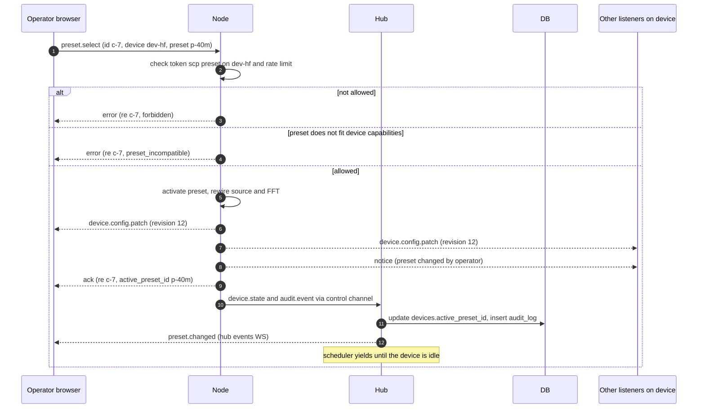

#### Decode-error report flow (diagnostics)

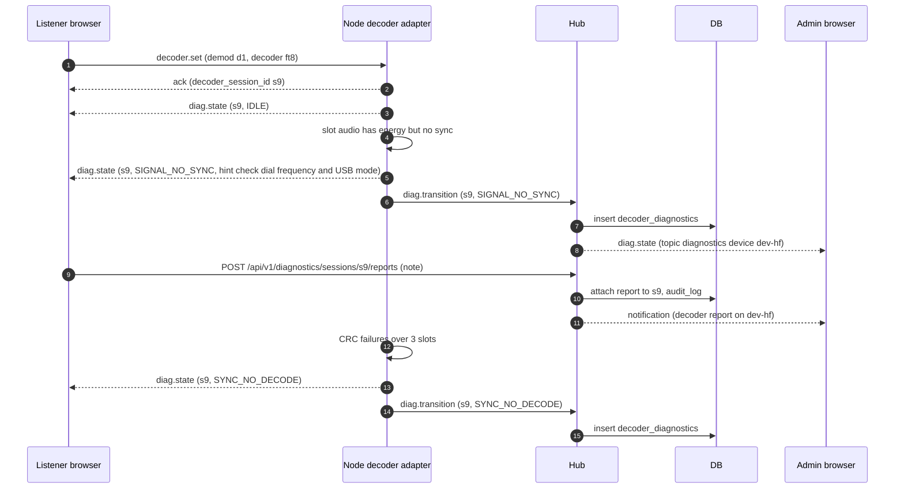

#### Listener tune and stream

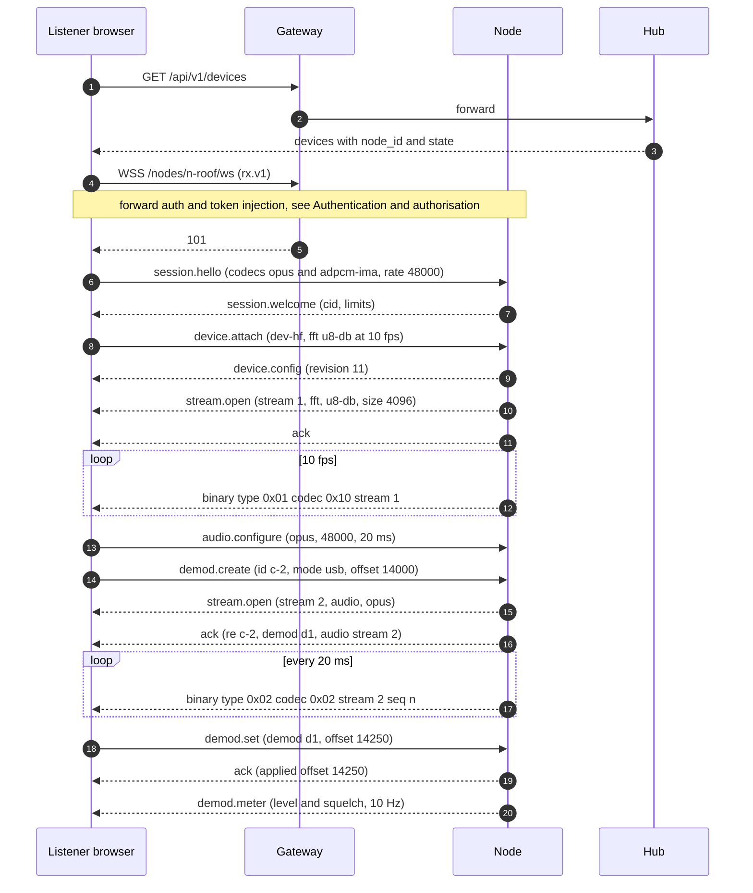


---

## 7. Data model, database adapter, persistence and configuration

The key-by-key configuration reference is in FEATURE_SPEC §9.

### 7.1 Data model

The Product has exactly two sources of truth (P4): immutable configuration files and one relational database (DB). This section specifies the relational schema. The hub is the **only DB writer** (P1). Nodes never open a DB connection: they send events to the hub over the hub-initiated control channel, and the hub persists them. The DB engine is **SQLite**, reached only through the database adapter (see "Database adapter"). PostgreSQL is a future adapter.

#### Conventions

| Topic | Rule |
|---|---|
| Generic types | Every column is declared with a **generic type**: `UUID`, `STRING(n)`, `TEXT`, `INT16`, `INT32`, `INT64`, `FLOAT64`, `BOOL`, `TIMESTAMP`, `JSON`, `BYTES` / `BYTES(n)`, `ENUM(...)`. Each dialect adapter maps them to engine types (see "Database adapter", "Generic type mapping"). Core logic MUST NOT depend on engine-specific types or features. |
| Primary keys | Surrogate keys are UUIDv7 (time-ordered), generated by the application, unless the table says otherwise. Keys MUST be stable across restarts and MUST never derive from memory addresses. High-volume append tables (`decoded_messages`, `decoder_diagnostics`, `audit_log`, `reporting_outbox`) use `INT64` auto-increment keys instead. |
| Slugs | Operator-chosen identifiers (`nodes.id`, `devices.id`, `presets.slug`) match `^[a-z0-9][a-z0-9_-]{0,62}$`. They MUST NOT contain `\|`, `.` or `/`, so that they can be embedded in config key paths (`devices.<id>.…`) and URLs. |
| Timestamps | `TIMESTAMP` is always UTC with millisecond precision. Values are set by the application, never by engine defaults. Every mutable table has `created_at` and `updated_at`. A node-supplied event time is stored next to the hub receive time (`received_at`) and is never trusted for retention decisions. |
| IP addresses | Stored as `STRING(45)` in canonical textual form. IPv4-mapped IPv6 addresses are normalised to IPv4 on write. |
| Optimistic concurrency | Every admin-editable table has `version INT32 NOT NULL DEFAULT 1`. An update MUST include the expected version. A mismatch returns HTTP 409 `version_conflict`. |
| Config origin | Every table that can also be populated from a config file has `origin ENUM('config','db','import','builtin')` and `locked_fields JSON` (an array of field paths set by a config file). Locked fields MUST be rejected on write with HTTP 409 `setting_locked` (see "Configuration files"). |
| Text from RF or third parties | Columns that hold RF-decoded or third-party text are **plain text**. They MUST be stored verbatim (UTF-8, invalid sequences replaced with U+FFFD, C0 controls except `\n` and `\t` removed) and MUST be rendered as text, never as HTML. |
| Secrets | No table stores a secret in clear text. Password and token columns hold hashes. Admin-entered third-party credentials are stored only in `settings.value_enc` (AEAD-encrypted; see "Configuration files", "Secrets handling"). |
| Deletes | Hard delete is the default. A soft delete (`deleted_at`) is used only where clients must learn about the removal (`map_features`, `files`). |
| Large tables | No table relies on engine partitioning. Retention uses batched deletes (see "Retention jobs"). A future PostgreSQL adapter MAY add partitions without changing the logical schema. |

#### Canonical tables

Each canonical entity has exactly one table. The column lists are normative. Implementations MAY add columns, but MUST NOT remove or repurpose them.

##### `users`

Writers: hub API (admin user management, invitation redemption, password reset), migration tool, CLI `user` sub-commands.

| Column | Type | Null | Notes |
|---|---|---|---|
| `id` | UUID | no | PK |
| `username` | STRING(64) | no | Unique, case-insensitive (unique index on `lower(username)`). Pattern `^[A-Za-z0-9_.-]{2,64}$`. |
| `email` | STRING(254) | yes | Unique when not null (case-insensitive). Required for e-mail invitations and password reset. Login accepts the username or the e-mail. |
| `email_verified_at` | TIMESTAMP | yes | Set when the user redeems an e-mail invitation or completes a password reset. Reserved for future account linking by verified e-mail. |
| `display_name` | STRING(64) | yes | Plain text. |
| `password_hash` | TEXT | yes | PHC string. New hashes MUST use Argon2id with the parameters in `auth.argon2.*` (cfg). Other PHC formats written by the migration tool are accepted and MUST be re-hashed with Argon2id on the next successful login. **Null** means the user has no `local` identity (for example a future OIDC-only account), so password login is impossible. |
| `must_change_password` | BOOL | no | Default false. |
| `enabled` | BOOL | no | Default true. |
| `failed_login_count` | INT16 | no | Reset on success. Drives account throttling. |
| `locked_until` | TIMESTAMP | yes | Temporary lock after repeated failures. |
| `last_login_at` | TIMESTAMP | yes | |
| `origin` | ENUM('config','db','import') | no | `config` is used for the bootstrap admin declared in `hub.toml`. |
| `created_at`, `updated_at` | TIMESTAMP | no | |
| `version` | INT32 | no | |

Indexes: `ux_users_username_lower`, `ux_users_email_lower` (partial, `email IS NOT NULL`).
Check: a user with a `local` row in `user_identities` MUST have a non-null `password_hash`, except while an invitation is pending redemption.

##### `user_identities`

One row per way a user can authenticate. Login methods are pluggable behind an **auth-provider interface** (see "Authentication data"). Writers: hub (invitation redemption, admin user creation, migration tool).

| Column | Type | Null | Notes |
|---|---|---|---|
| `user_id` | UUID | no | FK `users.id` ON DELETE CASCADE |
| `provider` | STRING(32) | no | Provider id. Only `local` (form login with `users.password_hash`) exists today. Future values: one id per configured OIDC / OAuth2 provider. |
| `subject` | STRING(255) | no | Stable subject at the provider. For `local`, the user id as text. For OIDC, the `sub` claim. |
| `created_at` | TIMESTAMP | no | |

PK: (`provider`, `subject`). Index: `user_id`.
Every user created today has exactly one `local` identity. Sessions and access tokens never reference an identity: they reference the user, so they are independent of the login method.

##### `roles`

Writers: migrations only (seed data). Read-only at runtime.

| Column | Type | Null | Notes |
|---|---|---|---|
| `id` | INT16 | no | PK. Seeded: 0 `anonymous`, 10 `listener`, 20 `operator`, 30 `admin`. |
| `name` | STRING(32) | no | Unique. |
| `rank` | INT16 | no | A higher rank implies every right of a lower rank (P3). |
| `description` | TEXT | no | |

`anonymous` is never assigned in `user_roles`. It is the implicit role of a request without a session.

##### `user_roles`

Writers: hub API (admin), invitation redemption, migration tool.

| Column | Type | Null | Notes |
|---|---|---|---|
| `id` | UUID | no | PK |
| `user_id` | UUID | no | FK `users.id` ON DELETE CASCADE |
| `role_id` | INT16 | no | FK `roles.id`. MUST NOT be `anonymous`. |
| `device_id` | STRING(64) | yes | FK `devices.id` ON DELETE CASCADE. Null = global grant. Non-null = the role applies to this device only. This is the source of the "device scopes" claim in the access token. |
| `granted_by` | UUID | yes | FK `users.id` ON DELETE SET NULL |
| `granted_at` | TIMESTAMP | no | |

Unique: (`user_id`, `role_id`, `device_id`), with NULL treated as a value. This is implemented portably as two partial unique indexes (`device_id IS NULL` and `device_id IS NOT NULL`). Index: `device_id`.
Every registered user implicitly holds `listener` globally. No row is needed for it.

##### `sessions`

Writers: hub (login, refresh, logout, password reset, reaper).

| Column | Type | Null | Notes |
|---|---|---|---|
| `id` | UUID | no | PK. Never sent to clients. |
| `token_hash` | BYTES(32) | no | Unique. SHA-256 of the random session cookie value (≥ 256 bits of entropy). A new value is issued on every login (session rotation). |
| `csrf_secret_hash` | BYTES(32) | no | SHA-256 of the per-session CSRF secret. Every state-changing request MUST carry the matching token. |
| `user_id` | UUID | no | FK `users.id` ON DELETE CASCADE |
| `auth_provider` | STRING(32) | no | Provider used to log in (`local` today). Informational: the session behaves the same for every provider. |
| `created_at` | TIMESTAMP | no | |
| `last_seen_at` | TIMESTAMP | no | Updated at most once per minute (write coalescing). |
| `idle_expires_at` | TIMESTAMP | no | `last_seen_at` + `auth.session_idle_timeout` |
| `absolute_expires_at` | TIMESTAMP | no | `created_at` + `auth.session_max_lifetime` |
| `ip` | STRING(45) | yes | Client IP as resolved by the gateway's trusted-proxy rules. |
| `user_agent` | STRING(512) | yes | |
| `revoked_at` | TIMESTAMP | yes | Logout, admin revoke, password change or reset. |
| `revoke_reason` | STRING(32) | yes | `logout`, `admin`, `password_change`, `password_reset`, `user_disabled`, `expired`. |

Indexes: `user_id`, `idle_expires_at`. Retention: delete 30 days after expiry or revocation.
The session cookie is `HttpOnly`, `Secure`, `SameSite=Lax`. Access tokens (≈ 5 min, Ed25519-signed) are **not** stored. They are derived from a live session row at refresh time. Revocation therefore takes effect within one access-token TTL.

##### `invitations`

Accounts are created **by invitation only**. There is no self-registration. Writers: hub API (admin creates or revokes; redemption marks the row used).

| Column | Type | Null | Notes |
|---|---|---|---|
| `id` | UUID | no | PK |
| `token_hash` | BYTES(32) | no | Unique. SHA-256 of the invitation token. The token is shown once to the admin (copyable link) and/or sent by e-mail. |
| `delivery` | ENUM('email','link') | no | `email` = sent through `smtp.*`. `link` = copied by the admin. |
| `email` | STRING(254) | yes | Required when `delivery = email`. When set, the account is created with this address and `email_verified_at` is set on redemption. |
| `role_id` | INT16 | no | FK `roles.id`. Role pre-set by the admin (`listener`, `operator` or `admin`). |
| `device_id` | STRING(64) | yes | FK `devices.id` ON DELETE CASCADE. Optional device scope of the granted role. |
| `created_by` | UUID | yes | FK `users.id` ON DELETE SET NULL |
| `created_at` | TIMESTAMP | no | |
| `expires_at` | TIMESTAMP | no | `created_at` + `auth.invitation_ttl` (default 7 days). |
| `redeemed_at` | TIMESTAMP | yes | Single use: set once, in the transaction that creates the user, its `local` identity and its role. |
| `redeemed_user_id` | UUID | yes | FK `users.id` ON DELETE SET NULL |
| `revoked_at` | TIMESTAMP | yes | |

Redemption: the invitee chooses a username (pre-filled from the e-mail when present) and a password. The hub hashes it with Argon2id and logs the user in with a new session. Retention: delete 30 days after `expires_at`, redemption or revocation.

##### `password_reset_tokens`

Writers: hub (reset request, reset completion, reaper).

| Column | Type | Null | Notes |
|---|---|---|---|
| `id` | UUID | no | PK |
| `user_id` | UUID | no | FK `users.id` ON DELETE CASCADE |
| `token_hash` | BYTES(32) | no | Unique. SHA-256 of the token sent by e-mail. |
| `created_at` | TIMESTAMP | no | |
| `expires_at` | TIMESTAMP | no | `created_at` + `auth.password_reset_ttl` (default 30 min). |
| `used_at` | TIMESTAMP | yes | Single use. |
| `requested_ip` | STRING(45) | yes | |

Index: `user_id`. Rules: a reset request always answers the same way, whether or not the account exists. Issuing a token invalidates the earlier unused tokens of the same user. Completing a reset sets the new Argon2id hash, marks the token used, and revokes every session of the user (`revoke_reason = 'password_reset'`), in one transaction. Requests are rate-limited per IP and per account. A user without a `local` identity cannot request a reset. Retention: delete 1 day after expiry or use.

##### `nodes`

Writers: hub (config sync at startup, enrollment, control-channel events).

| Column | Type | Null | Notes |
|---|---|---|---|
| `id` | STRING(64) | no | PK. Equals the node's `node.id`. |
| `name` | STRING(128) | no | |
| `url` | STRING(512) | no | Base URL that the hub dials (node API + control WS). |
| `enrollment_state` | ENUM('pending','enrolled','revoked') | no | |
| `cert_fingerprint` | BYTES(32) | yes | SHA-256 of the node certificate pinned at enrollment. |
| `cert_not_after` | TIMESTAMP | yes | Drives renewal alerts. |
| `status` | ENUM('online','degraded','offline','unreachable') | no | Derived from the control-channel heartbeat (see "Persistence rules"). |
| `last_heartbeat_at` | TIMESTAMP | yes | |
| `boot_id` | UUID | yes | Random per node process start. Used for event de-duplication. |
| `software_version`, `protocol_version` | STRING(32) | yes | Reported at connect. |
| `hostname` | STRING(255) | yes | |
| `cpu_cores` | INT16 | yes | Informational. |
| `clock_offset_ms` | INT32 | yes | Measured hub−node clock offset. Values beyond ±500 ms raise a warning. |
| `labels` | JSON | no | Free key/value labels. Default `{}`. |
| `origin` | ENUM('config','db') | no | See conventions. |
| `locked_fields` | JSON | no | See conventions. |
| `created_at`, `updated_at` | TIMESTAMP | no | |
| `version` | INT32 | no | |

Index: `status`.

##### `devices`

A **read-only registry** mirrored from node capability and status reports. Devices are configured on their node, in `node.toml`, and only there. This table stores **no device settings**: no hardware, gain, PPM, sample rates, listen policy, retune, always-on or scheduler flags. The admin UI shows devices read-only. Writers: hub ingest only (node `capabilities.report` and device state events).

| Column | Type | Null | Notes |
|---|---|---|---|
| `id` | STRING(64) | no | PK. Globally unique, so that the node config key `devices.<id>.*` is unambiguous. A node reporting an id already owned by another node is refused (`device_id_conflict`). |
| `node_id` | STRING(64) | no | FK `nodes.id` ON DELETE CASCADE |
| `name` | STRING(128) | no | Plain text, as reported. |
| `type` | STRING(48) | no | Driver type, for example `rtl_sdr`, `rtl_tcp`, `sddc`, `hpsdr`, `runds`, `perseus`, `fifi_sdr`, `soapy:<driver>`. |
| `freq_min`, `freq_max` | INT64 | no | Tunable frequency range (Hz), as reported. Used to validate preset application. |
| `sample_rates` | JSON | no | Supported sample rates (S/s), as reported. Used to validate preset application. |
| `capabilities` | JSON | no | Reported flags, for example `{"modes": [...], "scheduler": true}`. Mirrors the effective node-config policy (`listen_policy`, `operator_can_retune`, `scheduler_enabled`) **for display and token scoping only**: the node remains authoritative and enforces it. |
| `online` | BOOL | no | False when the node is offline or the device is not running. |
| `runtime_state` | ENUM('unavailable','disabled','stopped','starting','running','retuning','stopping','retry_wait','failed') | no | Last state reported by the node (see Node internals). |
| `runtime_state_at` | TIMESTAMP | no | |
| `runtime_reason` | STRING(64) | yes | Machine-readable reason code. |
| `active_preset_id` | UUID | yes | FK `presets.id` ON DELETE SET NULL. Last preset applied, as reported by the node. |
| `center_freq` | INT64 | yes | Current centre frequency (Hz), reported by the node. Can differ from the preset after an operator retune. |
| `sort_order` | INT32 | no | Order of the device in `node.toml`. |
| `reported_at` | TIMESTAMP | no | Time of the last report. |

Indexes: `node_id`, (`node_id`, `sort_order`).
Rows are low-rate state (≤ 1 write per report or state change), written only by the hub from node events. A device that disappears from a node's report is kept with `online = false` and `runtime_state = 'unavailable'`. It is deleted when its node is removed, or when an admin explicitly forgets it (which also deletes its `schedules` and device-scoped grants). There is no `version`, `origin` or `locked_fields`: the table is never edited through the API.

##### `presets`

Pure stored data in the hub DB, **independent of any device or node**. There is no `device_id` and no `node_id`. Writers: hub API (operators and admins), migration tool.

| Column | Type | Null | Notes |
|---|---|---|---|
| `id` | UUID | no | PK |
| `slug` | STRING(64) | no | Unique. Used in URLs. |
| `name` | STRING(128) | no | Plain text. |
| `description` | STRING(1024) | yes | Plain text. |
| `tags` | JSON | no | Default `[]`. |
| `center_freq` | INT64 | no | Hz |
| `samp_rate` | INT32 | no | S/s |
| `start_freq` | INT64 | no | Hz. MUST lie within ±`samp_rate`/2 of `center_freq` (checked on write). |
| `start_mod` | STRING(24) | no | Mode id from the mode catalogue. |
| `tuning_step` | INT32 | no | Hz |
| `initial_squelch_level` | INT16 | yes | dBFS |
| `initial_nr_level` | INT16 | yes | dB, −20..20 |
| `waterfall_levels` | JSON | yes | `{min, max}` in dB. Null = device or global default. |
| `sort_order` | INT32 | no | Display order. |
| `created_at`, `updated_at` | TIMESTAMP | no | |
| `version` | INT32 | no | |

Index: `sort_order`. Tag filtering is done by the application on the (small) preset list; no JSON index is required.
A preset holds no hardware settings (gain, PPM, antenna and per-type keys are device-level, in `node.toml`).

**Capability validation at apply time.** Applying a preset to a device (operator or admin switch, or schedule) MUST be validated by the hub, and again by the node, against that device's reported capabilities: `center_freq` ± `samp_rate`/2 MUST lie within [`freq_min`, `freq_max`], `samp_rate` MUST be in `sample_rates`, and `start_mod` MUST be a mode the node supports. Listing presets for a device returns only the compatible ones. An incompatible apply is refused with HTTP 422 `preset_incompatible` (or the `rx.v1` error of the same code) and a reason naming the failed check. A preset that becomes incompatible after a capability change stays in the DB and is simply hidden for that device. When a device starts, the hub applies its `active_preset_id` if it is still compatible, otherwise the first compatible preset by `sort_order`.

##### `schedules`

One row per schedule entry: (`device_id`, `preset_id`, time window). Writers: hub API (admin), migration tool. Reader: hub scheduler. Schedules run only on devices whose node config sets `devices.<id>.scheduler_enabled = true` (reported in `devices.capabilities`).

| Column | Type | Null | Notes |
|---|---|---|---|
| `id` | UUID | no | PK |
| `device_id` | STRING(64) | no | FK `devices.id` ON DELETE CASCADE |
| `preset_id` | UUID | no | FK `presets.id` ON DELETE CASCADE. MUST be compatible with the device (capability validation at apply time, above). The check also runs on write. |
| `kind` | ENUM('static','daylight') | no | All enabled entries of one device MUST share the same kind (enforced by the hub on write). |
| `start_minute` | INT16 | yes | 0..1439, UTC. Required for `static`. |
| `end_minute` | INT16 | yes | 0..1439, UTC. `end < start` means the window wraps over midnight. |
| `days_of_week` | INT16 | no | Bitmask, Monday = bit 0. Default 127 (every day). |
| `daylight_phase` | ENUM('day','night','greyline') | yes | Required for `daylight`. |
| `priority` | INT16 | no | Resolves overlapping static windows (highest priority wins, then the earliest start). Default 0. |
| `enabled` | BOOL | no | |
| `created_at`, `updated_at` | TIMESTAMP | no | |
| `version` | INT32 | no | |

Index: `device_id`, `preset_id`. Check constraints: `static` ⇒ both minutes are non-null; `daylight` ⇒ `daylight_phase` is non-null. A scheduled entry whose preset is incompatible when it fires is skipped and audited (`schedule.skip`, reason `preset_incompatible`).

##### `bookmarks`

Bookmarks are **hub-wide**. There are no personal bookmarks and no per-user scope. They are created, edited and deleted by **operators and admins**, and visible to every listener allowed on the device being viewed (filtered by the device's frequency range). Writers: hub API (operator, admin), migration tool, config sync of shipped bookmark files.

| Column | Type | Null | Notes |
|---|---|---|---|
| `id` | UUID | no | PK |
| `name` | STRING(128) | no | Plain text. |
| `frequency` | INT64 | no | Hz |
| `modulation` | STRING(24) | no | |
| `underlying` | STRING(24) | yes | |
| `description` | STRING(1024) | yes | Plain text. |
| `scannable` | BOOL | no | |
| `tags` | JSON | no | Default `[]`. |
| `origin` | ENUM('config','db','import','builtin') | no | `builtin` = shipped bookmark files. |
| `locked_fields` | JSON | no | See conventions. |
| `created_by` | UUID | yes | FK `users.id` ON DELETE SET NULL |
| `created_at`, `updated_at` | TIMESTAMP | no | |
| `version` | INT32 | no | |

Index: `frequency`. Unique: (`name`, `frequency`, `modulation`).
EIBi and RepeaterBook "auto bookmarks" are **not** rows here. They are computed from `web_caches` at query time.

##### `connections`

The heartbeat-based presence registry (see "Persistence rules"). It backs listener counts and the admin view of connected listeners. Writers: hub only: gateway and WS lifecycle, node `session.*` events.

| Column | Type | Null | Notes |
|---|---|---|---|
| `id` | UUID | no | PK. Also the connection id carried in node media-session events. |
| `kind` | ENUM('events','media','map') | no | `events` = `/api/ws`. `media` = `/nodes/{nodeId}/ws` (proxied). `map` = a map-only events subscription. |
| `user_id` | UUID | yes | FK `users.id` ON DELETE SET NULL |
| `session_id` | UUID | yes | No FK (sessions may be purged first). |
| `role_id` | INT16 | no | Effective role at open time. |
| `ip` | STRING(45) | no | |
| `user_agent` | STRING(512) | yes | |
| `node_id` | STRING(64) | yes | Media connections only. |
| `device_id` | STRING(64) | yes | Current device. Updated on device switch. |
| `preset_id` | UUID | yes | |
| `tuned_freq` | INT64 | yes | Last reported tuned frequency (Hz). Updated at most every 5 s. |
| `mode` | STRING(24) | yes | Current primary mode. |
| `secondary_mode` | STRING(24) | yes | |
| `opened_at` | TIMESTAMP | no | |
| `last_heartbeat_at` | TIMESTAMP | no | |
| `closed_at` | TIMESTAMP | yes | Null = live. |
| `close_reason` | STRING(32) | yes | `client`, `heartbeat_timeout`, `hub_restart`, `node_lost`, `policy` (session revoked, user disabled, listen policy changed). |
| `bytes_out`, `bytes_in` | INT64 | no | Updated with the heartbeat. |

Indexes: partial (`last_heartbeat_at`) where `closed_at IS NULL`; `user_id`; `device_id`; `opened_at`. Retention: closed rows 30 days (`retention.connections`).

##### `decoded_messages`

Writers: hub ingest of node `decode` events, and MQTT ingest (`origin = mqtt`).

| Column | Type | Null | Notes |
|---|---|---|---|
| `id` | INT64 | no | PK, auto-increment. |
| `decoded_at` | TIMESTAMP | no | Event time. A full UTC date-time computed by the node from the sample timestamps (for slot modes: the slot start), so day rollovers are correct. |
| `received_at` | TIMESTAMP | no | Hub time. |
| `node_id` | STRING(64) | yes | |
| `device_id` | STRING(64) | yes | |
| `preset_id` | UUID | yes | |
| `decoder_session_id` | UUID | yes | Joins with `decoder_diagnostics.session_id`. |
| `origin` | ENUM('service','listener','mqtt') | no | |
| `mode` | STRING(24) | no | Mode id (`ft8`, `aprs`, `adsb`, …). |
| `family` | STRING(16) | no | Decoder family (see Decoding diagnostics). |
| `frequency` | INT64 | yes | Absolute RF frequency (Hz). |
| `snr_db` | FLOAT64 | yes | |
| `rssi_dbfs` | FLOAT64 | yes | |
| `callsign` | STRING(16) | yes | Upper case. Also used for aircraft ICAO, vessel MMSI and sonde serial (`subject` semantics). |
| `locator` | STRING(10) | yes | Maidenhead. |
| `lat`, `lon` | FLOAT64 | yes | |
| `text` | STRING(4096) | yes | Plain-text rendering. |
| `payload` | JSON | no | Typed record. Its schema is named in `payload_schema` (for example `wsjt.v1`, `aprs.v1`, `aircraft.v1`). |
| `payload_schema` | STRING(32) | no | |
| `dedup_key` | BYTES(16) | no | Unique. Hash of (`node_id`, `boot_id`, `event_seq`) for node events, or of (`mode`, `subject`, `text`, 1-minute time bucket) for MQTT. This makes ingest idempotent when a node replays events after a reconnect. |

Indexes: (`decoded_at`), (`mode`, `decoded_at` DESC), (`callsign`, `decoded_at` DESC), (`device_id`, `decoded_at` DESC), (`locator`) partial non-null.
Retention: `retention.decoded_messages` (default 30 days), overridable per family as `retention.decoded_messages.<family>` (default `aircraft` 2 days, `wspr` 180 days).
Volume control: high-rate families (`aircraft` position, `ais` position, `ism`) MUST be down-sampled on the node to at most one row per subject per `decodes.sample_interval` (default 30 s). The live UI still receives every update. Only the persisted rows are thinned.

##### `map_features`

Writers: hub (decode ingest, MQTT ingest, web-cache refresh jobs, config sync of static markers, receiver GPS).

| Column | Type | Null | Notes |
|---|---|---|---|
| `id` | UUID | no | PK |
| `feature_key` | STRING(160) | no | Unique natural key: `<kind>:<subject>`, for example `aircraft:4CA1FA`, `aprs:F4ABC-9`, `locator:JN18`, `call:F4ABC>DL1XYZ`, `station:eibi:<hash>`, `repeater:<id>`, `receiver:<source>:<id>`, `static:<file>:<id>`, `node:<id>`. |
| `kind` | ENUM('aircraft','vessel','aprs','sonde','meshtastic','lora','locator','call','station','repeater','receiver','static','node','other') | no | |
| `source` | ENUM('decode','mqtt','web_cache','config','gps') | no | |
| `label` | STRING(128) | yes | Plain text. |
| `lat`, `lon` | FLOAT64 | yes | Null for `call` lines (endpoints live in `geometry`). |
| `geometry` | JSON | yes | Lines (calls), tracks (≤ 100 points), polygons (locators). |
| `altitude_m`, `heading_deg`, `speed_kmh` | FLOAT64 | yes | |
| `symbol` | STRING(16) | yes | APRS symbol or icon id. |
| `mode`, `band` | STRING(24) | yes | |
| `details` | JSON | no | Plain-text values only. URLs are allowed only in fields that the schema marks as `url`, and only with `https` or `http` schemes. |
| `node_id`, `device_id` | STRING(64) | yes | |
| `first_seen_at`, `last_seen_at` | TIMESTAMP | no | |
| `expires_at` | TIMESTAMP | yes | **Absolute** expiry time for every kind. Null = permanent (static, node). |
| `deleted_at` | TIMESTAMP | yes | Tombstone, so that map clients receive removals. |

Indexes: `expires_at`, (`kind`, `last_seen_at` DESC), (`lat`, `lon`). Bounding-box queries use the plain (`lat`, `lon`) index; no engine spatial extension is required.
Retention: the expiry job sets `deleted_at` when `expires_at` has passed, and deletes tombstones after 1 hour. Expiry defaults per kind come from `map.retention.<kind>`.

##### `files`

File metadata. Writers: hub (node file uploads, admin uploads of receiver images, deletion API, retention job).

| Column | Type | Null | Notes |
|---|---|---|---|
| `id` | UUID | no | PK |
| `kind` | ENUM('sstv','fax','recording','speech','text_log','satellite','receiver_avatar','receiver_photo','other') | no | |
| `name` | STRING(160) | no | Display and download name, generated server-side as `<PFX>-<yymmdd>-<HHMMSS>[-<kHz>].<ext>`. Never used as a filesystem path. |
| `mime_type` | STRING(64) | no | Allow-list: `image/png`, `image/jpeg`, `image/webp`, `audio/mpeg`, `audio/ogg`, `text/plain`, `application/zip`. |
| `size_bytes` | INT64 | no | |
| `sha256` | BYTES(32) | no | |
| `blob_state` | ENUM('receiving','complete','failed') | no | |
| `node_id`, `device_id` | STRING(64) | yes | |
| `preset_id` | UUID | yes | |
| `decoder_session_id` | UUID | yes | |
| `mode` | STRING(24) | yes | |
| `frequency_hz` | INT64 | yes¹ | **Reception frequency** in Hz: the RF frequency the decoder was tuned to when reception started. That is the device center frequency plus the listener's or service's offset, i.e. the dial frequency for SSTV and FAX. Hz precision. |
| `received_start_utc` | TIMESTAMP | yes¹ | **Reception start**, UTC. For SSTV this is when the VIS header was detected; for FAX, the start tone; for recordings, the squelch opening. |
| `received_end_utc` | TIMESTAMP | yes | Reception end, UTC (last line or squelch close). Null when the reception was cut short and the file was still kept. |
| `visibility` | ENUM('public','registered','admin') | no | Default from `files.default_visibility` (`public`). |
| `width`, `height` | INT32 | yes | Images. |
| `duration_ms` | INT32 | yes | Audio. |
| `metadata` | JSON | no | For example SSTV mode name, FAX IOC/LPM, satellite name. |
| `uploaded_by` | UUID | yes | Admin uploads. |
| `created_at` | TIMESTAMP | no | |
| `deleted_at` | TIMESTAMP | yes | |
| `deleted_by` | UUID | yes | |

¹ **Reception metadata rule (FIL-008).** For every file produced by a decoder or a recording (`kind` ∈ `sstv`, `fax`, `recording`, `speech`, `text_log`, `satellite`), `frequency_hz` and `received_start_utc` are **mandatory** (CHECK constraint). They are null only for admin uploads (`receiver_avatar`, `receiver_photo`, `other`) and for files imported by the migration tool without that data (`metadata.import_incomplete = true`). Rules:

- Timestamps are stored and exchanged in **UTC** (generic `TIMESTAMP`), with ISO 8601 `Z` on the wire. Local time is never stored.
- The **node** stamps the times from its own clock, which MUST be NTP-synchronised. The hub checks them against its own clock. If they differ by more than 5 s, it keeps the node values, sets `metadata.clock_skew_ms`, and raises a `clock_skew` diagnostic for that node.
- `mode` holds the decoder mode (`sstv`, `fax`, …). `device_id`, `node_id`, `preset_id` (if a preset was active) and `decoder_session_id` are filled whenever they are known.
- `metadata` holds per-kind fields with a JSON Schema:
  - **SSTV:** `sstv_mode` (e.g. `Scottie 1`, `Martin 1`, `Robot 36`), `vis_code`, `lines_received`, `lines_total`, `complete` (bool), optional `snr_db`.
  - **FAX:** `lpm`, `ioc`, `lines_received`, `complete`.
  - **recording:** `squelch_db`.
- These fields are exposed by the REST API, shown in the file detail view (FIL-007), and filterable in the gallery (FIL-001): date/time range in UTC, frequency range, kind, mode, device.

Indexes: (`kind`, `received_start_utc` DESC), (`frequency_hz`), (`received_start_utc`), `device_id`, `sha256`.

##### `file_blobs`

File content, chunked, stored in the DB. Writers: hub only (streamed from node uploads or admin uploads).

| Column | Type | Null | Notes |
|---|---|---|---|
| `file_id` | UUID | no | FK `files.id` ON DELETE CASCADE |
| `chunk_no` | INT32 | no | 0-based |
| `data` | BYTES | no | ≤ 1 MiB per chunk. |

PK: (`file_id`, `chunk_no`). Size caps are specified in "Database adapter" and "Persistence rules".

##### `decoder_diagnostics`

Decoder-session state transitions (P5). Writers: hub ingest of node `decoder.diag` events. The payload and semantics are specified in "Decoding diagnostics".

| Column | Type | Null | Notes |
|---|---|---|---|
| `id` | INT64 | no | PK, auto-increment. |
| `session_id` | UUID | no | Decoder session id (node-generated UUIDv7). |
| `seq` | INT32 | no | Monotonic per session. |
| `node_id`, `device_id` | STRING(64) | no | |
| `preset_id` | UUID | yes | |
| `connection_id` | UUID | yes | Null for services. |
| `origin` | ENUM('listener','service') | no | |
| `mode` | STRING(24) | no | |
| `family` | STRING(16) | no | |
| `tool` | STRING(32) | yes | Adapter id, for example `jt9`, `direwolf`, `native:psk`. |
| `tool_version` | STRING(32) | yes | |
| `frequency` | INT64 | no | Hz |
| `state` | ENUM('UNAVAILABLE','IDLE','NO_SIGNAL','SIGNAL_NO_SYNC','SYNC_NO_DECODE','DECODING','WRONG_PROTOCOL_SUSPECTED','DECODER_ERROR','TIMEOUT') | no | |
| `previous_state` | ENUM (same values) | yes | |
| `reason_code` | STRING(48) | no | |
| `hint_code` | STRING(48) | yes | |
| `confidence` | FLOAT64 | no | 0..1 |
| `suggested_modes` | JSON | no | Default `[]`. |
| `entered_at` | TIMESTAMP | no | |
| `left_at` | TIMESTAMP | yes | Set when the next transition or the session end arrives. |
| `signals` | JSON | no | Signal snapshot at entry. Cumulative counters at exit are in `exit_signals`. |
| `exit_signals` | JSON | yes | |

Unique: (`session_id`, `seq`). Indexes: (`entered_at`), (`device_id`, `entered_at` DESC), (`state`, `entered_at` DESC), (`mode`, `entered_at` DESC).
Retention: `retention.decoder_diagnostics` (default 14 days). Hourly aggregates go to the auxiliary table `decoder_diagnostics_hourly` (below).

##### `web_caches`

Third-party data. Writers: hub web-data jobs (EIBi, RepeaterBook and its ARD fallback, receiverbook/KiwiSDR/WebSDR listings, RadioID lookups).

| Column | Type | Null | Notes |
|---|---|---|---|
| `id` | UUID | no | PK |
| `source` | STRING(32) | no | `eibi`, `repeaterbook`, `ard`, `receiverbook`, `kiwisdr`, `websdr`, `radioid_dmr`, `radioid_nxdn`, … |
| `cache_key` | STRING(256) | no | For example `sked-b25`, `prox:47.00,19.00:200km`, `id:2161234`. |
| `payload` | JSON | yes | Normalised, validated data. Raw third-party HTML is never stored. |
| `payload_bytes` | INT32 | no | Cap: 16 MiB per row. |
| `etag`, `last_modified` | STRING(128) | yes | Conditional requests. |
| `fetched_at` | TIMESTAMP | yes | |
| `expires_at` | TIMESTAMP | yes | Fresh until this time. |
| `status` | ENUM('ok','stale','error','pending') | no | |
| `error_count` | INT16 | no | Reset on success. Failures never stop the job permanently: they only extend the back-off. |
| `last_error` | STRING(512) | yes | |
| `next_attempt_at` | TIMESTAMP | no | |

Unique: (`source`, `cache_key`). Retention: rows past `expires_at` + 30 days that no job references are deleted. `radioid_*` rows keep at most 100 000 entries (LRU on `fetched_at`).

##### `reporting_outbox`

Transactional outbox for external networks. Writers: hub decode ingest (insert, in the same transaction as `decoded_messages`), hub scheduler (beacons, listener-position updates), outbox workers (status updates).

| Column | Type | Null | Notes |
|---|---|---|---|
| `id` | INT64 | no | PK, auto-increment. |
| `network` | ENUM('pskreporter','wsprnet','aprs_is','sondehub','sondehub_listener','ais_udp','mqtt') | no | |
| `decoded_message_id` | INT64 | yes | Reference only (no FK, so that decode retention never blocks on the outbox). |
| `payload` | JSON | no | Network-specific normalised record. |
| `dedup_key` | BYTES(16) | no | Unique per network: (`network`, `dedup_key`). |
| `status` | ENUM('pending','in_flight','sent','failed','dead') | no | |
| `attempts` | INT16 | no | |
| `next_attempt_at` | TIMESTAMP | no | |
| `lease_owner` | STRING(64) | yes | Worker id. |
| `lease_until` | TIMESTAMP | yes | |
| `batch_id` | UUID | yes | Set when the row is part of a batched upload (PSKReporter, SondeHub). |
| `created_at` | TIMESTAMP | no | |
| `sent_at` | TIMESTAMP | yes | |
| `last_error` | STRING(512) | yes | |

Index: (`network`, `status`, `next_attempt_at`). Retention: `sent` 7 days, `dead` 30 days. Back-pressure: at most `reporting.<network>.max_pending` pending rows (default 50 000). When the cap is reached, the oldest pending rows are marked `dead` with reason `overflow`, and a metric is incremented.

##### `audit_log`

Append-only. Writers: hub only. The audit repository exposes no update operation. Each dialect adapter MUST also guard the table (the SQLite adapter installs a trigger that aborts any `UPDATE`). DELETE is performed only by the retention job.

| Column | Type | Null | Notes |
|---|---|---|---|
| `id` | INT64 | no | PK, auto-increment. |
| `at` | TIMESTAMP | no | |
| `actor_kind` | ENUM('user','anonymous','system','node','cli') | no | |
| `actor_user_id` | UUID | yes | |
| `actor_ip` | STRING(45) | yes | |
| `action` | STRING(64) | no | Dotted verb, for example `auth.login.success`, `auth.login.failure`, `auth.password_reset.request`, `auth.password_reset.complete`, `invitation.create`, `invitation.redeem`, `settings.update`, `device.retune`, `device.preset.switch`, `user.role.grant`, `bookmark.update`, `file.delete`, `node.enroll`, `db.backup`, `migration.import`. |
| `target_type` | STRING(32) | yes | |
| `target_id` | STRING(128) | yes | |
| `result` | ENUM('ok','denied','error') | no | |
| `before`, `after` | JSON | yes | Secrets are replaced by `"<redacted:sha256-prefix>"`. |
| `request_id` | STRING(64) | yes | Correlates with logs. |

Indexes: (`at` DESC), (`actor_user_id`, `at`), (`action`, `at`). Retention: `retention.audit_log` (default 365 days, minimum 30 days).

##### `settings`

Admin-editable values: the "DB preset" layer of P4. Writers: hub API (admin), migration tool. Locked keys (set in a config file) are never written.

| Column | Type | Null | Notes |
|---|---|---|---|
| `key` | STRING(160) | no | PK. Dotted path from the settings schema, for example `receiver.name`, `listen_policy`, `reporting.pskreporter.enabled`, `retention.decoded_messages`, `ui.theme_mode`. Preset fields live in `presets`. Device settings are never stored in the DB (they are node-config only). |
| `value` | JSON | yes | Null for secrets. |
| `value_enc` | BYTES | yes | AEAD ciphertext (key from `secrets.master_key`) for keys that the schema marks `secret: true`. |
| `schema_version` | INT16 | no | Settings-schema version that validated this value. |
| `updated_by` | UUID | yes | FK `users.id` ON DELETE SET NULL |
| `updated_at` | TIMESTAMP | no | |
| `version` | INT32 | no | |

**Look & feel.** The admin look & feel lives here, as ordinary lockable settings: `ui.theme_mode` (`light` \| `dark` \| `auto`, where `auto` follows the OS `prefers-color-scheme`), the default waterfall palette `waterfall.scheme` (and `waterfall.colors` for a custom palette), the default waterfall levels `waterfall.levels` and `waterfall.auto_levels`, the default layout options `ui.layout.*`, and the keyboard shortcut set `ui.shortcut_set`. There is **no per-user preference storage** in v1: no `users.preferences` column, no preference table and no preference sync. Values a listener adjusts while using the receiver (volume, mute, squelch, NR, bandpass, zoom, own tuning, panel state) are per-session runtime state (`rt`); the browser MAY keep them in local storage as a non-authoritative convenience, and they are never synced to the account.

Check: exactly one of `value` and `value_enc` is non-null. Unknown keys are rejected on write. Rows whose key no longer exists in the schema are kept, ignored and reported by `config check`.

##### `node_capabilities`

Writers: hub, from node `capabilities.report` events.

| Column | Type | Null | Notes |
|---|---|---|---|
| `node_id` | STRING(64) | no | FK `nodes.id` ON DELETE CASCADE |
| `capability` | STRING(64) | no | Namespaced: `tool:<name>` (for example `tool:jt9`), `driver:<type>` (for example `driver:soapy:sdrplay`), `mode:<id>`, `feature:<flag>` (for example `wsjt-x-2-4`, `dream-2-2`), `codec:ambe`. |
| `available` | BOOL | no | |
| `status` | ENUM('ok','missing','too_old','untested','error') | no | `untested` = the version is outside the contract-tested range (see Node internals). |
| `version` | STRING(64) | yes | |
| `detail` | JSON | no | Probe evidence (detected flags, driver list, per-type parameter schema). |
| `probed_at` | TIMESTAMP | no | |
| `probe_ms` | INT32 | no | |
| `error` | STRING(512) | yes | |

PK: (`node_id`, `capability`). A full report replaces every row of the node in one transaction.

#### Authentication data

| Concern | Rule |
|---|---|
| Login | Classic form login (username or e-mail + password) against the `local` provider. A failed login answers the same way for an unknown user and a wrong password, and increments `users.failed_login_count`. |
| Auth-provider interface | Every login method implements one interface: `authenticate(credentials) → (provider, subject)`, then the hub resolves `user_identities(provider, subject)` → `users.id` and opens a session. Only `local` exists today. OIDC / OAuth2 providers are future implementations of the same interface; they need no schema change (they add `user_identities` rows and may leave `password_hash` null). |
| Account linking | Linking a future external identity to an existing user by **verified** e-mail (`users.email_verified_at` non-null on both sides) is future work. It MUST NOT happen silently for unverified addresses. |
| Session independence | `sessions` and access tokens reference `users.id` only. Changing or adding a login method never invalidates the session model. |
| Not in v1 | No MFA, no API tokens, no SSO, no self-registration. There are no tables or columns for them. |

#### Auxiliary tables

These tables are not canonical entities. They support migrations and jobs.

| Table | Purpose | Key columns |
|---|---|---|
| `schema_migrations` | Applied schema migrations of the current dialect | `version` INT64 PK, `name` STRING(128), `dialect` STRING(16), `checksum` BYTES(32), `applied_at` TIMESTAMP, `duration_ms` INT32, `product_version` STRING(32) |
| `job_runs` | Last run of periodic hub jobs (retention, scheduler, web data, outbox sweeps, backups); prevents overlapping runs | `job` STRING(64) PK, `running_since` TIMESTAMP, `last_started_at` TIMESTAMP, `last_finished_at` TIMESTAMP, `last_status` STRING(16), `last_error` STRING(512), `rows_affected` INT64 |
| `decoder_diagnostics_hourly` | Rollup of `decoder_diagnostics` | PK (`hour` TIMESTAMP, `device_id` STRING(64), `mode` STRING(24), `origin` STRING(16), `state` STRING(32)). Columns: `seconds_in_state` INT32, `transitions` INT32, `sessions` INT32, `decodes` INT32, `crc_failures` INT32, `sync_count` INT32, `snr_db_avg` FLOAT64, `snr_db_p90` FLOAT64. Retention 180 days. |
| `node_event_cursor` | Last event sequence persisted per node boot (idempotent replay) | PK (`node_id` STRING(64), `boot_id` UUID), `last_seq` INT64, `updated_at` TIMESTAMP |

#### Entity-relationship diagram

```mermaid
erDiagram
    users ||--o{ user_identities : "authenticates as"
    users ||--o{ user_roles : "holds"
    roles ||--o{ user_roles : "granted as"
    devices |o--o{ user_roles : "scopes"
    users ||--o{ sessions : "owns"
    users ||--o{ password_reset_tokens : "requests"
    roles ||--o{ invitations : "grants"
    users |o--o{ invitations : "creates"
    nodes ||--o{ devices : "hosts"
    nodes ||--o{ node_capabilities : "reports"
    devices ||--o{ schedules : "has"
    presets ||--o{ schedules : "selected by"
    presets |o--o{ devices : "active on"
    users |o--o{ bookmarks : "created by"
    users |o--o{ connections : "opens"
    devices |o--o{ connections : "tuned to"
    devices |o--o{ decoded_messages : "produces"
    devices |o--o{ decoder_diagnostics : "produces"
    devices |o--o{ map_features : "feeds"
    devices |o--o{ files : "produces"
    files ||--|{ file_blobs : "stored in"
    decoded_messages |o--o{ reporting_outbox : "enqueues"
    users |o--o{ audit_log : "acts in"
    users |o--o{ settings : "last edited"

    users {
        uuid id PK
        string username UK
        string email UK
        text password_hash "nullable"
        bool enabled
    }
    user_identities {
        uuid user_id FK
        string provider PK
        string subject PK
        timestamp created_at
    }
    roles {
        int16 id PK
        string name UK
        int16 rank
    }
    user_roles {
        uuid id PK
        uuid user_id FK
        int16 role_id FK
        string device_id FK
    }
    sessions {
        uuid id PK
        bytes token_hash UK
        uuid user_id FK
        timestamp idle_expires_at
    }
    invitations {
        uuid id PK
        bytes token_hash UK
        string email
        int16 role_id FK
        timestamp expires_at
        timestamp redeemed_at
    }
    password_reset_tokens {
        uuid id PK
        uuid user_id FK
        bytes token_hash UK
        timestamp expires_at
        timestamp used_at
    }
    nodes {
        string id PK
        string url
        enum status
        timestamp last_heartbeat_at
    }
    devices {
        string id PK
        string node_id FK
        string type
        int64 freq_min
        int64 freq_max
        json capabilities
        bool online
        uuid active_preset_id FK
    }
    presets {
        uuid id PK
        string slug UK
        int64 center_freq
        int32 samp_rate
        json tags
    }
    schedules {
        uuid id PK
        string device_id FK
        uuid preset_id FK
        enum kind
        int16 start_minute
        int16 end_minute
    }
    bookmarks {
        uuid id PK
        string name
        int64 frequency
        string modulation
    }
    connections {
        uuid id PK
        enum kind
        uuid user_id FK
        timestamp last_heartbeat_at
        timestamp closed_at
    }
    decoded_messages {
        int64 id PK
        timestamp decoded_at
        string mode
        json payload
    }
    map_features {
        uuid id PK
        string feature_key UK
        enum kind
        timestamp expires_at
    }
    files {
        uuid id PK
        enum kind
        int64 frequency_hz
        timestamp received_start_utc
        timestamp received_end_utc
        int64 size_bytes
        bytes sha256
    }
    file_blobs {
        uuid file_id PK
        int32 chunk_no PK
        bytes data
    }
    decoder_diagnostics {
        int64 id PK
        uuid session_id
        enum state
        timestamp entered_at
    }
    web_caches {
        uuid id PK
        string source
        string cache_key
        timestamp expires_at
    }
    reporting_outbox {
        int64 id PK
        enum network
        enum status
        timestamp next_attempt_at
    }
    audit_log {
        int64 id PK
        timestamp at
        string action
    }
    settings {
        string key PK
        json value
        bytes value_enc
    }
    node_capabilities {
        string node_id PK
        string capability PK
        bool available
    }
```

#### Who writes what (summary)

| Table | Hub API (user action) | Hub ingest (node events) | Hub jobs | Config sync at startup | Migration tool |
|---|---|---|---|---|---|
| `users`, `user_identities`, `user_roles` | ✅ admin, invitation redemption | – | – | bootstrap admin | ✅ |
| `roles` | – | – | – | – | – (migrations seed) |
| `sessions`, `invitations`, `password_reset_tokens` | ✅ | – | reaper | – | – |
| `nodes` | ✅ enroll | ✅ heartbeat, state | status sweeper | ✅ | – |
| `devices` | – (read-only) | ✅ registry mirror from node reports | – | – | – |
| `presets`, `schedules` | ✅ | – | – | – | ✅ |
| `bookmarks` | ✅ operator, admin | – | – | ✅ shipped files | ✅ |
| `connections` | ✅ open/close | ✅ media session events | heartbeat reaper | – | – |
| `decoded_messages`, `decoder_diagnostics` | – | ✅ | retention, rollup | – | – |
| `map_features` | – | ✅ | expiry, web data | ✅ static markers | ✅ markers |
| `files`, `file_blobs` | ✅ upload, delete | ✅ upload | retention | – | ✅ receiver images, optional decoded files |
| `web_caches` | – | – | ✅ | – | optional |
| `reporting_outbox` | – | ✅ (same transaction as the decode) | workers, beacons | – | – |
| `audit_log` | ✅ | ✅ security-relevant node events | retention only | ✅ config load | ✅ |
| `settings` | ✅ | – | – | – (locked keys are not written) | ✅ |
| `node_capabilities` | – | ✅ | – | – | – |

### 7.2 Database adapter

**SQLite is the only DB engine in v1.** All DB access goes through an adapter layer, so that a PostgreSQL adapter can be added later without touching core logic.

#### Layering

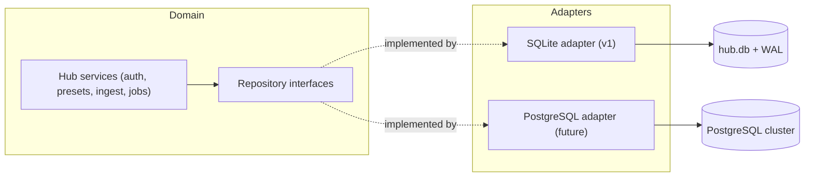

1. **Repository interfaces live in the domain.** Hub services depend only on them, never on SQL, drivers or engine types. One repository per aggregate:

   | Repository | Tables | Notable operations |
   |---|---|---|
   | `UserRepository` | `users`, `user_identities`, `user_roles` | find by login (username or e-mail), find by identity (`provider`, `subject`), create with identity and role (one transaction), update password hash, throttling counters |
   | `SessionRepository` | `sessions` | create (rotation), touch (coalesced), revoke one / all of a user, reap |
   | `InvitationRepository` | `invitations` | create, find by token hash, redeem (single use, transactional), revoke, reap |
   | `PasswordResetRepository` | `password_reset_tokens` | issue (invalidating earlier ones), consume (single use), reap |
   | `NodeRepository`, `DeviceRegistry`, `CapabilityRepository` | `nodes`, `devices`, `node_capabilities`, `node_event_cursor` | upsert from reports, replace capabilities, advance event cursor |
   | `PresetRepository`, `ScheduleRepository` | `presets`, `schedules` | CRUD with optimistic concurrency, list compatible presets |
   | `BookmarkRepository` | `bookmarks` | CRUD, list by frequency range |
   | `ConnectionRegistry` | `connections` | open, batched heartbeat, close, reap stale, counts per device |
   | `DecodeRepository`, `DiagnosticsRepository` | `decoded_messages`, `decoder_diagnostics`, `decoder_diagnostics_hourly` | idempotent batched insert, queries by mode / callsign / device / time, rollup |
   | `MapFeatureRepository` | `map_features` | upsert by `feature_key`, bounding-box query, expire |
   | `FileStore` | `files`, `file_blobs` | streamed chunk write, streamed read, caps enforcement |
   | `WebCacheRepository`, `OutboxRepository` | `web_caches`, `reporting_outbox` | conditional refresh state, claim with lease, mark sent / failed / dead |
   | `AuditLog`, `SettingsRepository`, `JobRunRepository` | `audit_log`, `settings`, `job_runs` | append only, versioned settings write, job bookkeeping |

2. **One dialect adapter per engine** implements every repository, plus a small engine contract: open and pool connections, run a unit of work in one transaction, map generic types (below), upsert, keyset pagination, batched delete, online backup, and the migration set of its dialect.
3. **Portable SQL only in core logic.** Queries that services need are expressed through repository methods. Dialect SQL lives only inside the adapter. Adapters MUST NOT rely on engine-specific behaviour: no SQLite type affinity or implicit `rowid`, no PostgreSQL-only types, no stored procedures, no triggers that implement business rules (integrity guards such as the `audit_log` append-only trigger are allowed). Partial and expression indexes (`lower(username)`) are used because both engines support them.
4. **Application-owned values.** IDs (UUIDv7), timestamps and defaults that carry meaning are set by the application, not by engine defaults, so that both adapters produce identical rows.
5. **JSON columns are opaque to queries.** Services filter on regular columns. JSON is decoded by the application. An adapter MAY index a JSON path for performance, but no behaviour may depend on it.
6. **Conformance suite.** One repository test suite MUST run against every adapter. A new adapter is accepted only when it passes the full suite.
7. **Engine selection** is by the scheme of `db.dsn` (cfg): `sqlite:` is the only supported scheme in v1. `postgres:` is reserved: the hub refuses to start with `db_engine_unsupported` until the adapter ships.

#### SQLite profile (v1)

| Topic | Rule |
|---|---|
| File | One DB file, for example `db.dsn = "sqlite:/var/lib/<product>/hub.db"`, on a **local** filesystem (no NFS or SMB: WAL needs shared memory). The DB file and its `-wal` and `-shm` files are mode 0600, owned by the service user. |
| Journal | `journal_mode = WAL`, set at every open and verified. `synchronous = NORMAL` by default (`db.sqlite.synchronous`, cfg, MAY be `FULL`). `foreign_keys = ON`. `busy_timeout` 5 s. `auto_vacuum = INCREMENTAL`. Tables are declared `STRICT`. |
| Single writer | The hub is the only process that opens the DB. Inside the hub, **one writer connection** serialises every write transaction through a write queue. Readers use a pool of read-only connections (`db.max_read_connections`, default 4), which WAL lets run concurrently with the writer. Nodes, the CLI and the migration tool never write while the hub runs: CLI sub-commands that change data go through the hub API, or require the hub to be stopped. |
| Write batching | High-rate ingest (decodes, diagnostics, heartbeats, map updates) is grouped into one transaction per batch (at most 250 ms or 500 rows). A write transaction SHOULD stay under 50 ms. Long jobs (retention, rollups) work in batches of ≤ 10 000 rows and yield the writer between batches. |
| Maintenance | `wal_autocheckpoint` stays enabled. A daily job runs `PRAGMA optimize` and `incremental_vacuum` after retention. `PRAGMA integrity_check` runs at startup when the previous shutdown was not clean, and on `<product> db check`. |
| Leases | There is no `SKIP LOCKED`. Outbox workers claim rows by setting `lease_owner` and `lease_until` in the writer transaction. With a single hub, leases only protect against overlapping workers inside the hub. |
| Change notification | Subscribers are notified through the in-process change bus, after commit. No engine notification mechanism is used. |
| Size watch | The hub exposes the DB file size and WAL size as metrics, and raises an admin warning above `db.size_warning` (default 8 GiB). |

#### Generic type mapping

| Generic type | SQLite (v1) | PostgreSQL (future) |
|---|---|---|
| `UUID` | `BLOB` (16 bytes) with `CHECK(length(x) = 16)` | `uuid` |
| `STRING(n)` | `TEXT` with `CHECK(length(x) <= n)` | `varchar(n)` |
| `TEXT` | `TEXT` | `text` |
| `INT16` | `INTEGER` with a range `CHECK` | `smallint` |
| `INT32` | `INTEGER` with a range `CHECK` | `integer` |
| `INT64` | `INTEGER` | `bigint` |
| `INT64` auto-increment PK | `INTEGER PRIMARY KEY` | `bigint GENERATED ALWAYS AS IDENTITY` |
| `FLOAT64` | `REAL` | `double precision` |
| `BOOL` | `INTEGER` with `CHECK(x IN (0,1))` | `boolean` |
| `TIMESTAMP` | `INTEGER`: Unix epoch milliseconds, UTC | `timestamptz(3)` |
| `JSON` | `TEXT` with `CHECK(json_valid(x))` | `jsonb` |
| `BYTES`, `BYTES(n)` | `BLOB` (with `CHECK(length(x) = n)` when sized) | `bytea` |
| `ENUM(...)` | `TEXT` with `CHECK(x IN (...))` | `text` with `CHECK(x IN (...))` (no native enum type, so both dialects migrate the same way) |

#### Blob storage in SQLite

File content is stored in `file_blobs`, in the DB, with these caps (all lockable settings):

| Key | Default | Effect |
|---|---|---|
| chunk size | 1 MiB (fixed) | Keeps every row far below SQLite's blob limit and keeps write transactions short. |
| `files.max_file_size` | 32 MiB | A larger upload is rejected. The node aborts the producer and reports `file_too_large`. |
| `files.max_total_size` | 2 GiB | Total of `files.size_bytes`. Before an insert would exceed the cap, the retention job deletes the oldest files of the same kind. If the cap would still be exceeded, the upload is rejected. |
| `files.receiver_image_max_size` | 2 MiB | Avatar and top photo. |

Each chunk is written in its own short write transaction, so a large upload never holds the writer. Deleted blobs free their pages through `incremental_vacuum`.

#### Backup and restore

1. `<product> db backup <path>` MUST take a consistent snapshot **while the hub runs**, using the SQLite online backup API or `VACUUM INTO <path>`. The result is a standalone, compacted DB file. The backup is audited (`db.backup`).
2. Scheduled backups: `db.backup.schedule` (cfg, for example `"daily 03:30"`), `db.backup.dir` and `db.backup.keep` (default 7). Each backup is verified with `PRAGMA integrity_check` before older ones are pruned.
3. `<product> db restore <path>` requires the hub to be stopped. It checks integrity and the schema version, keeps the replaced file as `hub.db.bak-<timestamp>`, and then installs the backup.
4. A complete backup is the DB backup plus the config directory. Secrets referenced by file are backed up separately, by the operator.
5. Copying the live `hub.db` file with file tools is **not** a supported backup method (it may miss the WAL).

#### PostgreSQL adapter (future)

- PostgreSQL is a **future adapter** (milestone M5 covers readiness only). It implements the same repositories and passes the same conformance suite, with its own migration set.
- It MAY use engine features **inside the adapter only**: partitions for the high-volume tables, `SELECT … FOR UPDATE SKIP LOCKED` for outbox claims, `LISTEN/NOTIFY` for cross-instance change notification.
- **HA hub replicas are possible only with PostgreSQL.** Running several hub instances against one DB requires that adapter, plus per-instance ownership of sockets in the `connections` registry and cross-instance notifications. That design is future work. With SQLite, exactly one hub instance runs.
- Moving an installation from SQLite to PostgreSQL will be a one-shot `<product> db copy --from sqlite:… --to postgres:…` tool that reads every table through the repositories. It is future work.

### 7.3 Persistence rules

#### No volatile state

1. All non-stream state MUST live in the DB (P4). A hub restart MUST NOT lose users, identities, sessions, invitations, presets, schedules, bookmarks, map features, decoded messages, files, diagnostics, web caches, pending reports, audit records or settings.
2. The Product MUST NOT keep state in files: no JSON state files for settings, users, bookmarks, receiver listings or caches, and no uploaded images on disk. The only files it writes are the DB file (with its WAL), DB backups, and temporary decoder work files inside a node session directory (see Node internals).
3. Every multi-row change MUST run in one DB transaction. Notifications to WebSocket subscribers MUST be emitted **after** the commit, never before. A subscriber therefore never sees state that was rolled back.
4. Nodes hold **no persistent state** (P1). A node restart loses only in-flight streams, in-flight DSP buffers and its bounded event buffer (below). A node reads its device configuration from its own `node.toml` and reports it to the hub. Everything else it needs at runtime (access-token public key, the preset to apply to each device, desired schedule timeline) is pushed by the hub over the control channel after each (re)connect. The node keeps it in RAM only.

#### What may stay in RAM

| Data | Where | Why it is allowed | Bound |
|---|---|---|---|
| Raw IQ, demodulated audio, FFT frames | node | Stream data (P4) | Per-edge ring buffers (see Node internals) |
| In-flight DSP state (filters, AGC, decoder process pipes) | node | Stream data | Per session |
| Slot WAV files of batch decoders | node session directory (tmpfs recommended) | In-flight decoder input. Deleted after the job. | ≤ 2 slots per session |
| Node event buffer while the hub is unreachable | node | Replayed with `(boot_id, seq)` after reconnect | `node.event_buffer` (default 10 000 events or 16 MiB). On overflow, drop in this order: diagnostic samples, map position updates, then decodes (oldest first). The drop count is reported as `events.dropped`. |
| Last 200 stderr lines per decoder session, last 200 log lines per device | node | Debug aid, served on demand to admins | Ring buffer. Never persisted. Classified events are persisted through diagnostics. |
| Per-connection send queues | hub, node | Transport | See the protocol spec drop policies |
| Pending write batch | hub | Write batching for the single writer | ≤ 250 ms or 500 rows (see "Database adapter") |
| Read-through caches of DB rows (settings, roles, devices) | hub | Performance | Invalidated on the in-process change bus after commit. A cache miss MUST be correct. |
| Per-IP rate-limit token buckets (login, password reset, API) | hub | Loss on restart only resets throttling | LRU, 100 000 entries |
| Effective-config snapshot | hub, node | Derived from files + DB | Rebuilt at startup and on settings change |

Account-level login throttling (`users.failed_login_count`, `users.locked_until`) MUST be in the DB, because losing it on restart would let an attacker reset the brute-force protection.

#### Heartbeat-based connection registry

1. When the hub accepts an `/api/ws` socket, or authorises a `/nodes/{nodeId}/ws` upgrade, it MUST insert a `connections` row (`closed_at = NULL`) before it sends the first application frame.
2. The hub refreshes `last_heartbeat_at` of each live row every `presence.heartbeat_interval` (default 15 s). It uses one batched `UPDATE … WHERE id IN (…)` per interval, not one write per socket. For media connections, the liveness evidence is the node's `session.stats` event (every 15 s per media session), forwarded over the control channel. Protocol-level WS pings alone are not enough.
3. A row is **stale** when `now − last_heartbeat_at > presence.stale_after` (default 45 s). The reaper job (every 15 s) sets `closed_at = last_heartbeat_at` and `close_reason = 'heartbeat_timeout'` on stale rows.
4. At startup, the hub MUST close every row that is still open (`close_reason = 'hub_restart'`): with SQLite there is exactly one hub instance. When the control channel of a node is lost for more than `presence.stale_after`, every open media row of that node is closed with `close_reason = 'node_lost'`.
5. Listener counts (public `/status`, per device) and the admin view of connected listeners are queries on open rows. They are not in-memory lists.
6. When a session is revoked, a user is disabled, or a listen-policy change denies an open connection, the hub closes the affected sockets (`close_reason = 'policy'`) and tells the node to tear down the matching media sessions.

#### Caches

1. Third-party data (EIBi, RepeaterBook/ARD, receiver listings, RadioID) MUST be cached in `web_caches`, with `etag`/`last_modified` conditional requests and per-source refresh periods (EIBi 24 h, RepeaterBook 7 days, listings 24 h, RadioID 30 days).
2. Every outbound HTTP call MUST have a connect timeout (≤ 10 s) and a total timeout (≤ 60 s). A failure MUST set `status = 'error'` and `next_attempt_at` with exponential back-off (5 min × 2ⁿ, capped at 24 h). Stale data stays usable until replaced.
3. On first install, the web-data jobs MUST run within 60 s of hub start.
4. A change of `receiver.gps` larger than 10 km MUST invalidate (set `expires_at = now`) the location-dependent cache rows. It MUST NOT delete them while a job may be reading them.

#### Transactional outbox

1. Decode ingest MUST insert the `decoded_messages` row, upsert `map_features`, and insert one `reporting_outbox` row per enabled network that accepts the mode, **in one transaction**. A crash can therefore neither report a spot that was not stored nor lose a stored spot's report.
2. Outbox workers (one logical worker per network; see Node internals, "Reporting") claim rows with a lease (`lease_owner`, `lease_until` = now + 60 s). They send the rows, then mark them `sent`, or `failed` with `next_attempt_at` = now + min(30 s × 2^attempts, 1 h). After `reporting.<network>.max_attempts` (default 20) or 24 h, the row becomes `dead`.
3. Delivery is **at least once**. Each network adapter MUST de-duplicate where the remote side does not: PSKReporter (same call, band and mode within 5 min), APRS-IS (same packet within 30 s), SondeHub (same serial and frame).
4. Disabling a network MUST NOT delete pending rows. They stay `pending` until `reporting.<network>.pending_ttl` (default 1 h) expires, and are then marked `dead` with reason `disabled`.
5. MQTT publishing uses the same outbox, with network `mqtt`. MQTT **ingest** (subscriptions) writes `decoded_messages` (`origin = 'mqtt'`) and `map_features`. It never enqueues outbox rows, which prevents loops.

#### File blobs in the DB

1. File content MUST be stored in `file_blobs`, in chunks of ≤ 1 MiB, streamed from the node over the control channel (or from an admin upload). `files.blob_state` stays `receiving` until every chunk and the SHA-256 check succeed. Rows still `receiving` after 10 min are deleted with their chunks.
2. Size caps are those of "Blob storage in SQLite", plus count and age retention:

   | Key | Default | Effect |
   |---|---|---|
   | `files.keep_per_kind` | 20 | The newest N files per `kind` (and per `device_id` for recordings) are kept. Older ones are deleted. |
   | `files.max_age` | 30 days | Age cap, applied in addition to the count cap. |

   Kinds `receiver_*` are exempt from count and age retention.
3. Uploaded images MUST be decoded and re-encoded server-side (or at least validated by magic bytes and dimension limits ≤ 8192 × 8192) before they are stored. SVG is rejected.
4. Downloads MUST stream chunks in order, set `Content-Type` from `files.mime_type`, `Content-Disposition: attachment` for non-images, and `X-Content-Type-Options: nosniff`.

#### Retention jobs

All jobs run on the hub, record their run in `job_runs` (a job never overlaps itself), delete in batches of ≤ 10 000 rows per transaction through the single writer, and record `rows_affected`. Large deletes are followed by `incremental_vacuum` in the daily maintenance job.

| Job | Period | Rule | Setting key (default) |
|---|---|---|---|
| `sessions.reap` | 1 h | Delete sessions 30 days after expiry or revocation | `retention.sessions` (30d) |
| `invitations.reap` | 1 d | Delete invitations 30 days after expiry, redemption or revocation | – |
| `password_reset_tokens.reap` | 1 h | Delete reset tokens 1 day after expiry or use | – |
| `presence.reap` | 15 s | Close stale `connections` rows | `presence.stale_after` (45s) |
| `connections.purge` | 1 d | Delete rows closed more than N ago | `retention.connections` (30d) |
| `decodes.purge` | 1 h | Delete rows older than N, with per-family overrides | `retention.decoded_messages` (30d), `retention.decoded_messages.<family>` |
| `map.expire` | 30 s | Tombstone features past `expires_at`; delete tombstones after 1 h | `map.retention.<kind>` |
| `diag.rollup` | 5 min | Aggregate closed transitions into `decoder_diagnostics_hourly` | – |
| `diag.purge` | 1 h | Delete raw rows older than N; rollups older than 180 days | `retention.decoder_diagnostics` (14d), `retention.decoder_diagnostics_hourly` (180d) |
| `files.retention` | after each upload + 1 h | Apply the count, age and total caps | `files.*` |
| `files.orphans` | 1 h | Delete `receiving` rows older than 10 min, and blobs without metadata | – |
| `web_caches.purge` | 1 d | Delete unreferenced rows past `expires_at` + 30 days; enforce the RadioID LRU | – |
| `outbox.purge` | 1 h | Delete `sent` rows after 7 days and `dead` rows after 30 days | `retention.reporting_outbox.sent` (7d), `.dead` (30d) |
| `audit.purge` | 1 d | Delete rows older than N (minimum 30 days) | `retention.audit_log` (365d) |
| `db.maintenance` | 1 d | `PRAGMA optimize`, `incremental_vacuum` | – |
| `db.backup` | `db.backup.schedule` | Online backup, verify, prune | `db.backup.*` (cfg) |

Retention values are DB settings, so they can be locked in `hub.toml`. A value below the documented minimum MUST fail validation.

#### Time, identity and integrity

1. Nodes MUST run NTP. The hub measures the node clock offset on every control-channel heartbeat. An offset above 500 ms raises the node status to `degraded` and the diagnostic hint `clock_skew` for slot-based decoders, which fail beyond about 1 s.
2. Node events carry (`node_id`, `boot_id`, `seq`). The hub persists the highest contiguous `seq` per (`node_id`, `boot_id`) in `node_event_cursor`, in the same transaction as the events. Replayed events with `seq ≤ last_seq` are acknowledged and discarded.
3. Backups are specified in "Database adapter", "Backup and restore".

### 7.4 Configuration files

#### Format

1. Configuration files MUST use **TOML v1.0**. They are declarative only. Nothing in a configuration file is ever executed (P4).
2. Each release MUST publish a **JSON Schema** (draft 2020-12) for `hub.toml`, for `node.toml`, and for the `settings` namespace. The schema is the single source for: types, ranges, enums, defaults, `secret: true` markers, `lockable: true` markers, UI labels and help text, and the `x-scope` annotation (`global`, `device`, `preset`). The admin UI forms MUST be generated from or validated against the same schema, so that file-based and UI-based values share one validator.
3. Every file starts with `schema_version = <int>`. A missing or unknown version is a startup error.
4. Durations are strings with units (`"15s"`, `"7d"`). Frequencies are integers in Hz, or strings with units (`"145.800MHz"`). Sizes are strings with units (`"32MiB"`).

#### File layout

| Path (default; root is overridable with `--config-dir` or `<PRODUCT>_CONFIG_DIR`) | Role | Purpose | Permissions |
|---|---|---|---|
| `/etc/<product>/hub.toml` | hub, all | Hub bootstrap and locked settings | root:`<product>` 0640 |
| `/etc/<product>/hub.d/*.toml` | hub, all | Drop-ins, merged in lexical order | same |
| `/etc/<product>/node.toml` | node, all | Node bootstrap and every device setting | root:`<product>` 0640 |
| `/etc/<product>/node.d/*.toml` | node, all | Drop-ins (for example one file per device) | same |
| `/etc/<product>/secrets/` | both | Secret files referenced by `{ file = "…" }` | dir 0750, files 0640 or 0600 |
| `/etc/<product>/tls/` | both | CA, hub and node certificates and keys | keys 0600 |
| `/usr/share/<product>/data/` | hub | Shipped read-only data: bandplans (R1/R2/R3), built-in bookmarks, APRS symbol set | read-only |
| `/etc/<product>/data/` | hub | Operator overrides of shipped data (bandplans, bookmarks, static map markers), same formats | 0644 |
| `/var/lib/<product>/` | hub, all | SQLite DB file (`hub.db`, `-wal`, `-shm`) and default backup directory. Not configuration. | 0700, service user |
| `/run/<product>-node/` | node | Session work directories (tmpfs recommended). Not configuration. | 0700, service user |

Drop-in merge rule: tables merge recursively. Scalars and arrays in a later file replace earlier ones. Defining the same `devices.<id>` table in two `node.d` files is allowed (deep merge), but the merged result MUST validate as a whole. The merged view with per-key origin (`file:line`) is kept for the UI and for `config explain`.

The `all` role reads both `hub.toml` and `node.toml` from the same directory. If `node.toml` has no `[hub_trust]` section, the `all` role enrolls the local node automatically, over loopback, with certificates generated at first start and stored in `/etc/<product>/tls/` (the only files the Product may create in the config directory, and only when they are absent).

#### Immutability

1. The Product MUST NOT modify configuration files at runtime. The only exception is the first-start TLS bootstrap of the `all` role (above).
2. Config files are read at startup. A change takes effect on restart. The Product MAY implement `SIGHUP` (or `<product> reload`) as an atomic re-read: parse, validate the whole new configuration, and apply it only if it is valid. Otherwise it keeps the running configuration and logs the errors. Keys that require a restart (listen addresses, `db.*`, TLS files, `node.id`) MUST be reported as `restart_required` and not applied.
3. The UI MUST show every config-set value as read-only, with its origin ("set in `hub.toml`, line 42").

#### Locking semantics and precedence

Effective value = **config file (locked) > DB setting (admin-editable) > built-in default** (P4).

| Rule | Detail |
|---|---|
| Lock unit | The **leaf key**. Setting `settings.reporting.pskreporter.callsign` in a file locks that key only. `settings.reporting.pskreporter.enabled` stays editable unless it is also set. An array is a leaf: setting it locks the whole array. |
| Settings namespace | In `hub.toml`, every key under `[settings]` maps 1:1 to a `settings` row key and is locked. Bootstrap keys outside `[settings]` (`db`, `tls`, `gateway`, `hub`, `auth`, `smtp`, `secrets`, `log`, `nodes`) are config-only, never stored in the DB, and never editable in the UI. |
| Entities | A node or bookmark declared in `hub.toml` is upserted into its table at startup with `origin = 'config'` and `locked_fields` = the fields present in the file. Admins can edit the unlocked fields. Deleting an entity with `origin = 'config'` is refused (409 `entity_locked`). Presets and schedules are DB-only data; they are never declared in a config file. |
| Removal from config | When a config-declared node or bookmark disappears from the files, its row becomes `origin = 'db'` with `locked_fields = []`, unless `config.prune_removed_entities = true`, in which case it is deleted. Either way, the change is audited. |
| Shadowed DB values | When a key becomes locked, the existing DB value is kept but ignored. The UI shows it as "overridden by config". If the lock is removed later, the DB value takes effect again. |
| Write attempts | An API write to a locked key or field returns 409 `setting_locked` with the origin. It is audited with `result = 'denied'`. |
| Device settings | Every device-level setting lives in `node.toml` of the hosting node, and only there: hardware, gain, PPM, sample rates, frequency range, `listen_policy` override, `operator_can_retune`, `always_on`, `scheduler_enabled`. `hub.toml` has **no** `[devices]` section, and the DB stores no device settings. The node enforces these values itself (it refuses a retune by an operator when `operator_can_retune = false`). The hub mirrors them from the node report to scope access tokens and to show them read-only. A change requires editing `node.toml` and restarting (or reloading) the node. |
| Device scope resolution | For a device-scoped consumer, the resolution order is: runtime override (operator retune) > applied preset fields > device setting in `node.toml` > global setting (cfg > db) > default. Tables are deep-merged at every layer. |
| No hidden defaults | The effective configuration MUST be explainable: `<product> config explain <key> [--device <id>]` prints the value, its origin layer and the shadowed values. |

#### Secrets handling

1. Every key that the schema marks `secret: true` MUST be given as a reference: `{ file = "/etc/<product>/secrets/mqtt_password" }` or `{ env = "MQTT_PASSWORD" }`. An inline literal is accepted only if `allow_inline_secrets = true` is set in the same file. It then produces a startup warning.
2. Secret files MUST NOT be group- or world-writable, and MUST NOT be world-readable. Otherwise startup fails with `insecure_secret_file`.
3. Secrets loaded from config are held in memory only. They MUST NOT be written to the DB, logs, metrics, audit records, error messages, HTML or any WebSocket payload. API responses expose only `{ "set": true, "origin": "config" }`.
4. Secrets entered in the admin UI (when the key is not locked) are stored in `settings.value_enc`, encrypted with an AEAD cipher (for example XChaCha20-Poly1305) under `secrets.master_key`, with the key name as associated data. Without `secrets.master_key`, UI entry of secrets is disabled and the UI says so.
5. Child processes receive only the secrets they need, through a private file in the session directory (mode 0600) or through stdin, never on the command line (argv is world-readable through `/proc`).
6. Browser-side API keys (map tiles, weather overlays) are not secrets in this sense. They are delivered to clients by design, so the schema marks them `public_client_key: true`, and the UI warns that they must be origin-restricted with the provider.

#### Validation at startup

The hub and the node MUST run these steps in order, and MUST refuse to start (exit code 78, `EX_CONFIG`) on any error:

1. Parse every file. Errors report `file:line:column`.
2. Merge the drop-ins and check `schema_version`.
3. Validate against the JSON Schema. Unknown keys are **errors** (with a "did you mean" suggestion), not warnings.
4. Resolve secret references (existence, permissions, non-empty).
5. Semantic checks: unique ids; device frequency range and sample rates within the device type's limits; no `[devices]` section in `hub.toml`; listen addresses not in conflict; certificate and key pair match and are not expired; the `node.id` slug format; the `hub.url` scheme is `https` unless `hub.allow_insecure_url = true`; the `db.dsn` scheme is supported; `auth.argon2.*` parameters meet the minimums (memory ≥ 19 MiB, iterations ≥ 2).
6. Hub only: open the DB through the adapter (WAL verified), run migrations (see "Migrations"), sync config-declared entities, then validate every `settings` row against the schema. Invalid DB values are **ignored** (the default applies), logged and audited. They are never fatal, because an admin must still be able to log in and fix them.
7. Log a summary: number of locked keys, devices (node) or nodes (hub), plus warnings.

Preset and schedule rows are validated on write and at apply time (see `presets`), never at startup.

`<product> config check [--role hub|node|all]` runs steps 1–5 (and step 6 in read-only mode when the DB is reachable) without starting services. `<product> config schema --role …` prints the JSON Schema.

#### Configuration key namespaces

| Namespace | File | Lockable into DB settings? | Examples |
|---|---|---|---|
| `hub.*` | `hub.toml` | No (bootstrap) | `hub.url`, `hub.listen_internal`, `hub.auto_migrate` |
| `db.*` | `hub.toml` | No | `db.dsn`, `db.max_read_connections`, `db.sqlite.synchronous`, `db.size_warning`, `db.backup.schedule`, `db.backup.dir`, `db.backup.keep`, `db.backup_before_migrate` |
| `tls.*` | both | No | `tls.ca_cert`, `tls.cert`, `tls.key`, `tls.ca_key` (hub, for enrollment) |
| `gateway.*` | `hub.toml` | No | `gateway.mode` (`embedded` \| `sidecar`), `gateway.admin_api`, `gateway.http_listen`, `gateway.https_listen`, `gateway.acme_email`, `gateway.trusted_proxies` |
| `auth.*` | `hub.toml` | No | `auth.token_signing_key` (secret, Ed25519), `auth.access_token_ttl`, `auth.session_idle_timeout`, `auth.session_max_lifetime`, `auth.argon2.memory`, `auth.argon2.iterations`, `auth.argon2.parallelism`, `auth.invitation_ttl`, `auth.password_reset_ttl`, `auth.bootstrap_admin` |
| `smtp.*` | `hub.toml` | No | `smtp.host`, `smtp.port`, `smtp.tls` (`starttls` \| `implicit` \| `none`), `smtp.username`, `smtp.password` (secret), `smtp.from`. Without `smtp.host`, e-mail invitations and password reset are disabled and the UI says so (link invitations still work). |
| `secrets.*` | `hub.toml` | No | `secrets.master_key` |
| `nodes.<id>.*` | `hub.toml` | No | `nodes.<id>.url`, `nodes.<id>.enrollment_token` (secret) |
| `node.*` | `node.toml` | No | `node.id`, `node.listen`, `node.runtime_dir`, `node.event_buffer`, `node.ipc_port_range` |
| `hub_trust.*` | `node.toml` | No | `hub_trust.ca_cert`, `hub_trust.hub_identity` |
| `tools.*` | `node.toml` | No | Absolute paths of external programs; `tools.codecserver_socket` |
| `devices.<id>.*` | `node.toml` only | No (mirrored read-only into the `devices` registry) | `devices.<id>.type`, `.driver.*`, `.freq_range`, `.sample_rates`, `.listen_policy`, `.operator_can_retune`, `.always_on`, `.scheduler_enabled` |
| `settings.*` | `hub.toml` | **Yes**: each leaf is a lockable `settings` key | `listen_policy`, `receiver.name`, `reporting.*`, `retention.*`, `map.*`, `files.*`, `decoders.*`, `ui.theme_mode`, `ui.layout.*`, `ui.shortcut_set`, `waterfall.*` |
| `log.*` | both | No | `log.level`, `log.format` (`text` \| `json`) |

#### Example `hub.toml`

```toml
schema_version = 1

[hub]
url = "https://sdr.example.org"          # public URL served by the gateway

[db]
dsn = "sqlite:/var/lib/product/hub.db"   # SQLite only in v1 (WAL, hub is the single writer)
max_read_connections = 4
backup = { schedule = "daily 03:30", dir = "/var/lib/product/backups", keep = 7 }

[tls]                                    # hub <-> node mTLS
ca_cert = "/etc/product/tls/ca.pem"
ca_key  = { file = "/etc/product/tls/ca.key" }   # signs node certificates at enrollment
cert    = "/etc/product/tls/hub.pem"
key     = { file = "/etc/product/tls/hub.key" }

[gateway]
mode = "sidecar"                         # "embedded" when the hub embeds Caddy
admin_api = "http://127.0.0.1:2019"
https_listen = ":443"
http_listen = ":80"                      # redirects to https
acme_email = "admin@example.org"
trusted_proxies = []                     # no X-Forwarded-For trust by default

[auth]
token_signing_key = { file = "/etc/product/secrets/token_ed25519.key" }
access_token_ttl = "5m"
session_idle_timeout = "14d"
session_max_lifetime = "90d"
argon2 = { memory = "64MiB", iterations = 3, parallelism = 1 }
invitation_ttl = "7d"
password_reset_ttl = "30m"
bootstrap_admin = { username = "admin", password = { file = "/etc/product/secrets/admin_password" } }

[smtp]                                   # invitations and password reset e-mails
host = "smtp.example.org"
port = 587
tls = "starttls"
username = "sdr@example.org"
password = { file = "/etc/product/secrets/smtp_password" }
from = "WebSDR <sdr@example.org>"

[secrets]
master_key = { file = "/etc/product/secrets/master.key" }

[log]
level = "info"
format = "json"

[nodes.attic]
url = "https://10.8.0.12:8074"
enrollment_token = { file = "/etc/product/secrets/node_attic.token" }

[nodes.garden]
url = "https://garden.vpn.example.org:8074"
enrollment_token = { file = "/etc/product/secrets/node_garden.token" }

# No [devices] section: devices are configured only in each node's node.toml

# Locked settings: each leaf below is read-only in the admin UI
[settings]
listen_policy = "anonymous"

[settings.receiver]
name = "F4XYZ WebSDR"
location = "Lille, France"
gps = { lat = 50.63, lon = 3.06 }
asl = 40

[settings.ui]                            # admin look & feel, locked
theme_mode = "auto"                      # light | dark | auto (follows prefers-color-scheme)
shortcut_set = "default"

[settings.waterfall]
scheme = "turbo"                         # default palette
levels = { min = -110, max = -20 }

[settings.reporting.pskreporter]
enabled = true
callsign = "F4XYZ"
antenna_information = "EFHW 40m"

[settings.reporting.mqtt]
enabled = true
host = "mqtt.example.org:8883"
use_tls = true
user = "sdr"
password = { file = "/etc/product/secrets/mqtt_password" }
topic = "sdr/f4xyz"

[settings.retention]
decoded_messages = "60d"
audit_log = "400d"
```

#### Example `node.toml`

```toml
schema_version = 1

[node]
id = "attic"
listen = "0.0.0.0:8074"                  # authenticated API + control WS + media WS
runtime_dir = "/run/product-node"
event_buffer = { max_events = 10000, max_bytes = "16MiB" }
ipc_port_range = "40000-40999"           # loopback ports for connector IQ/control sockets

[tls]
cert = "/etc/product/tls/node-attic.pem" # issued at enrollment
key  = { file = "/etc/product/tls/node-attic.key" }

[hub_trust]
ca_cert = "/etc/product/tls/ca.pem"      # only hub certificates from this CA are accepted
hub_identity = "hub.sdr.example.org"     # expected SAN of the hub client certificate
enrollment_token = { file = "/etc/product/secrets/enrollment.token" }  # used until enrolled

[tools]
jt9 = "/usr/bin/jt9"
direwolf = "/usr/bin/direwolf"
codecserver_socket = "/run/codecserver/codecserver.sock"

[devices.hf-sdrplay]
name = "SDRplay RSPdx (HF)"
type = "soapy:sdrplay"
enabled = true
always_on = true
listen_policy = "registered"             # overrides the global listen_policy
operator_can_retune = true
scheduler_enabled = true                 # schedules themselves are DB rows on the hub
freq_range = { min = 1_000, max = 30_000_000 }
sample_rates = [500_000, 2_000_000]
services_enabled = true
services_decoders = ["ft8", "wspr", "js8"]
driver = { device = "driver=sdrplay", antenna = "Antenna B", rf_gain = "auto" }
waterfall = { levels = { min = -105, max = -30 } }

[devices.vhf-rtl]
name = "RTL-SDR (2 m)"
type = "rtl_sdr"
enabled = true
always_on = false
listen_policy = "anonymous"
operator_can_retune = false
freq_range = { min = 24_000_000, max = 1_766_000_000 }
sample_rates = [1_024_000, 2_048_000, 2_400_000]
driver = { device = "0", ppm = 1, rf_gain = 29.7 }
```

### 7.5 Migrations

#### Schema migrations

1. Migrations are **per dialect**: `migrations/sqlite/` today, `migrations/postgresql/` when that adapter ships. Both sets use the **same version numbers and names** (`<yyyymmddhhmm>_<name>`) and MUST produce the same logical schema (tables, columns, generic types, keys, constraints, indexes). A schema-equivalence test compares them through the adapters' introspection.
2. Migrations are **forward-only** and checksummed. They are recorded in `schema_migrations` with their dialect. A modified applied migration (checksum mismatch) is a fatal startup error.
3. The hub applies pending migrations at startup, before it serves traffic, as the single writer. On SQLite each migration runs inside `BEGIN IMMEDIATE … COMMIT` (SQLite DDL is transactional). A table change that SQLite cannot do in place uses the documented rebuild procedure (create new table, copy, drop, rename) with `foreign_keys` checked at the end. `<product> db migrate [--dry-run]` and `<product> db status` MUST exist. `hub.auto_migrate = false` makes the hub refuse to start while migrations are pending.
4. If the DB schema version is **newer** than the binary supports, the hub MUST refuse to start with a clear message naming both versions.
5. Long data back-fills run as batched, resumable jobs after the DDL, tracked in `job_runs`.
6. Changes SHOULD follow **expand → migrate → contract** across at least one minor release, so that a downgrade to the previous minor release keeps working on a backup-free path. (Rolling upgrades of several hub instances need the future PostgreSQL adapter.)
7. Each migration MUST ship with a test that applies it to a fixture DB of the previous version, for its dialect, and checks idempotent re-runs of its data back-fill.
8. When `db.backup_before_migrate = true` (default true), the hub takes an online backup (`VACUUM INTO`) before applying pending migrations.

#### Hub–node protocol and config versioning

| Artifact | Version carrier | Compatibility rule |
|---|---|---|
| DB schema | `schema_migrations` | Forward-only, per dialect, same version numbers in every dialect. |
| Control-channel protocol | `protocol_version` in the node hello | The hub MUST support nodes of the current and the previous minor protocol version. Older nodes are refused with `node_too_old` and shown as `degraded` in the admin UI. |
| Media WS subprotocol | `rx.v1` | A breaking change creates `rx.v2`. The node MUST offer both during a deprecation window of one major release. |
| Config files | `schema_version` | `<product> config migrate --in hub.toml --out hub.new.toml` rewrites a file to the current version, keeps comments where possible, and never edits in place unless `--in-place` is given. Startup with an older `schema_version` MUST fail with instructions; it is never silently upgraded. |
| Settings rows | `settings.schema_version` | Setting renames and type changes are DB migrations that rewrite the rows and record the old values in `audit_log` (`action = 'settings.migrate'`). |

#### Migration tool from OpenWebRX+

`<product> import-openwebrx` is a one-shot tool (P4, milestone M5). It reads an OpenWebRX+ installation and writes Product config files and DB rows. It never executes code from that installation, and it never modifies its files. It writes to the DB while the hub is **stopped** (the hub is otherwise the single writer).

##### Invocation

```
<product> import-openwebrx
    --source-data-dir /var/lib/openwebrx      # settings.json, users.json, bookmarks.json, images, caches
    --source-etc-dir  /etc/openwebrx          # openwebrx.conf(+.d), markers.json, markers.d, bookmarks.d
    --node-id attic                           # node that receives every imported SDR
    --settings-to config|db                   # default: db (admin-editable); config = locked
    --out-config-dir ./imported               # generated hub.toml, node.d/imported-devices.toml, secrets (never /etc directly)
    --dry-run                                 # default; --apply performs the DB writes
    --report report.json
```

##### Rules

1. **Dry run by default.** Without `--apply`, the tool writes only the files in `--out-config-dir` and the report. With `--apply`, it takes an online backup of the DB first, then runs every DB write in **one transaction**. It is idempotent: a re-run matches users by `username`, presets by `slug`, schedules by (`device_id`, `preset_id`, window) and bookmarks by (`name`, `frequency`, `modulation`), and updates instead of duplicating.
2. **Never execute `config_webrx.py`** (P4). The tool MAY read it with a restricted literal parser that accepts only top-level `name = <literal>` assignments (numbers, strings, booleans, None, lists, dicts, tuples). Any other construct makes the tool skip the file, with a report entry listing the keys it could not read.
3. **Version handling.** OpenWebRX+ `settings.json` versions 1–8 are accepted. The tool upgrades its in-memory copy to version 8 with OpenWebRX+'s own upgrade semantics, **except** that a custom `callsign_url` MUST be preserved. `callsign_service` is ignored. A version above 8 is reported and the import stops.
4. **Layer merge.** OpenWebRX+ precedence is reproduced: `settings.json` > `config_webrx.py` literals > OpenWebRX+ defaults. Only values that differ from the OpenWebRX+ defaults are imported. Product defaults then apply, so OpenWebRX+ defaults are not frozen into the DB.
5. **Secrets.** `aprs_igate_password`, `mqtt_password`, `repeaterbook_api_key` and `receiver_keys` are written as files in `<out>/secrets/` (mode 0600) and referenced from the generated `hub.toml`. They are never written to the DB in clear text. With `--settings-to db` and a configured `secrets.master_key`, they MAY instead be stored encrypted in `settings.value_enc`. `google_maps_api_key` and `openweathermap_api_key` become `public_client_key` settings.
6. **Report.** A JSON report (and a human-readable summary) lists, per source key and entity: `imported` (with the target), `transformed` (with the rule), `dropped` (with the reason), or `conflict`. The tool exits non-zero if any `conflict` remains, unless `--force` is given.
7. The import is audited (`action = 'migration.import'`, `after` = report digest).

##### Source → target mapping

| OpenWebRX+ source | Target | Rule |
|---|---|---|
| `users.json` entries `{user, enabled, must_change_password, password}` | `users` + `user_identities` (`provider = 'local'`) + `user_roles` | Every imported user becomes `admin` (OpenWebRX+ has no role model: every logged-in user is an admin). `encoding = hash` (PBKDF2-HMAC-SHA256, 100 000 iterations, hex salt and hash) → PHC `$pbkdf2-sha256$i=100000$<salt>$<hash>`, re-hashed with Argon2id on the next login. `encoding = string` (clear text) → hashed with Argon2id at import, with `must_change_password = true`. `origin = 'import'`. No e-mail is known: the report lists users that need one for password reset. |
| `settings.json` / `config_webrx.py` → `sdrs.<id>` (all device settings) | Generated node config file `node.d/imported-devices.toml` (never DB rows) | `id`: the source id if it is a valid slug, else a slugified `name` with a numeric suffix. The old → new map goes into the report. `type` → driver type (Soapy types become `soapy:<driver>`). `enabled`, `always-on` → `always_on`, `services` → `services_enabled`, `scheduler` presence → `scheduler_enabled = true`. Per-type keys go into `driver`. `waterfall_levels` and `waterfall_auto_level_default_mode` go into `waterfall`. The frequency range and sample rates are filled from the driver defaults for review. `operator_can_retune` is set from the global `allow_center_freq_changes`, and `listen_policy` is left unset (inherits the global value). `key_locked` is **dropped** (magic key, P4), with the hint to set `operator_can_retune` instead. Rig keys are dropped. The `devices` registry fills itself when the node starts with this file. |
| `sdrs.<id>.profiles.<pid>` | `presets` (device-independent) | **The device link is dropped**: a profile becomes a standalone preset, and the report notes the device it came from (and adds a `device:<id>` tag). `slug`: `pid` if valid and unused, else `<device-id>-<pid>`. `sort_order` = source order. `tuning_step` string → integer. `waterfall_levels` → `waterfall_levels`. Hardware keys (`rf_gain`, `ppm`, `lfo_offset`, `iqswap`, `antenna`, per-type keys), `eibi_bookmarks_range`, `repeater_range`, `rig_enabled` and `rig_rx_enabled` are dropped and reported, because presets hold no device settings. |
| `sdrs.<id>.scheduler` (`static` or `daylight`) and the older `schedule` key | `schedules` (`device_id`, `preset_id`, window) | `device_id` = the device's new id; `preset_id` = the preset imported from the referenced profile. `"HHMM-HHMM": pid` → `start_minute` and `end_minute` (UTC), `days_of_week = 127`. `daylight` `day` / `night` / `greyline` → `daylight_phase`. A reference to an unknown profile is a `conflict`. |
| `bookmarks.json` | `bookmarks` (hub-wide, `origin = import`) | New UUIDs. `scannable` is kept, or computed from the OpenWebRX+ rule. Browser-local bookmarks are not reachable and are not imported. |
| `/etc/openwebrx/bookmarks.d/**/*.json` | – | Not imported. The Product ships its own `builtin` bookmark set with the same format. Operator-modified files are reported as `dropped`, with a hint to copy them into `/etc/<product>/data/bookmarks/`. |
| `markers.json`, `/etc/openwebrx/markers.json`, `markers.d/*.json` | `map_features` (`kind = static`, `source = config`) or `/etc/<product>/data/markers/` | Copied into the data directory (a read-only source, synced at startup). |
| `receiver_avatar.*`, `receiver_top_photo.*` | `files` (`receiver_avatar`, `receiver_photo`) | Validated and re-encoded (see the file rules). |
| Stored decoded files in the OpenWebRX+ temporary directory (`SSTV-*`, `FAX-*`, `REC-*`, … ) | `files` + `file_blobs` (optional, `--import-files`) | Reception metadata is **parsed from the file name** `<PFX>-<yymmdd>-<HHMMSS>[-<kHz>].<ext>`: OpenWebRX+ writes the date-time in UTC → `received_start_utc`, and kHz × 1000 → `frequency_hz` (kHz precision only). `received_end_utc` is null. A file without the frequency part, or with an unparseable name, is imported with `metadata.import_incomplete = true` (exempt from the CHECK) and reported. BMP files are converted to PNG. Size caps apply. |
| `receivers.json`, `repeaters.json`, `eibi.json` | `web_caches` (optional, `--import-caches`) | `fetched_at` = file mtime, `expires_at` = now. They are therefore refreshed on first start. |
| Meshtastic node cache | – | Dropped. It stored monotonic timestamps, meaningless after a reboot. |
| `openwebrx.conf` `[core] data_directory`, `temporary_directory` | – | Dropped. The Product keeps its state in the DB and uses node session directories. |
| `[core] log_level` | `log.level` in both TOML files | Name mapping. |
| `[core] temperature_sensor` | `node.temperature_sensor` | Path copied. |
| `[web] port`, `ipv6`, `bind_address` | `gateway.https_listen` / `gateway.http_listen` | Reported for operator review (the gateway replaces the built-in server). |
| `[web] trusted_proxies` | `gateway.trusted_proxies` | Copied. Private peers are **not** trusted implicitly. |
| `[aprs] symbols_path` | – | Dropped. The Product ships the APRS symbol set. |
| TLS `/etc/openwebrx/{key,cert}.pem` | Reported | Not copied. The gateway handles public TLS (ACME or operator certificates). |

Global `settings.json` keys, grouped by target:

| OpenWebRX+ keys | Target | Rule |
|---|---|---|
| `receiver_name`, `receiver_location`, `receiver_asl`, `receiver_admin`, `receiver_gps`, `receiver_country`, `photo_title`, `photo_desc`, `receiver_help`, `usage_policy_url` | `settings.receiver.*` (`receiver_` prefix removed: `receiver.name`, `receiver.gps`, …, `receiver.help`; the others move as `receiver.photo_title`, `receiver.photo_desc`, `receiver.usage_policy_url`) | `photo_desc` was raw HTML. It is imported as plain text, with tags stripped, and the change is reported. `receiver_admin` is no longer published in the public status by default (`receiver.publish_admin_email = false`). |
| `session_timeout` | `settings.media.anonymous_idle_timeout` | Becomes a server-enforced idle timeout for anonymous media sessions. |
| `max_clients`, `max_clients_per_ip`, `bot_ban_enabled` | **Dropped** | The Product has no client limits and no bans. Reported. |
| `fft_fps`, `fft_size`, `fft_voverlap_factor`, `audio_compression`, `fft_compression`, `digimodes_fft_size` | `settings.dsp.*` (device-level overrides go to the generated node config) | Codec names are kept for `rx.v1` (see the protocol spec). |
| `waterfall_scheme`, `waterfall_colors`, `waterfall_levels`, `waterfall_auto_levels`, `waterfall_auto_level_default_mode`, `waterfall_auto_min_range`, `tuning_precision`, `squelch_auto_margin` | `settings.waterfall.*`, `settings.ui.*`, `settings.dsp.*` | Admin look & feel defaults. |
| `ui_theme` | `settings.ui.theme_mode` | The ten OpenWebRX+ colour themes are **dropped**. Every value maps to `auto`, and the report lists the dropped theme name. |
| `wfm_deemphasis_tau`, `wfm_rds_rbds`, `ssb_agc_profile`, `am_agc_profile`, `nfm_agc_profile`, `dab_output_rate` | `settings.dsp.*` | |
| `digital_voice_dmr_id_lookup`, `digital_voice_nxdn_id_lookup` | `settings.decoders.radioid.*` | |
| `digital_voice_codecserver` | `tools.codecserver_socket` in the generated `node.toml` | |
| `allow_center_freq_changes` | **Dropped** | Replaced by `devices.<id>.operator_can_retune` (P3), written into the generated node config for every device. |
| `allow_audio_recording` | `settings.ui.allow_audio_recording` | Admin-set UI toggle only (browser-side recording cannot be enforced). |
| `allow_chat` | **Dropped** | The Product has no chat. Reported. |
| `allow_remote_config` | `settings.auth.admin_networks` | `false` → the RFC 1918 and loopback CIDRs. Admin login is then accepted only from those networks, using the gateway-resolved client IP. |
| `magic_key`, `key_locked` | **Dropped** (P4) | |
| `google_maps_api_key`, `openweathermap_api_key`, `map_type` | `settings.map.*` | Marked `public_client_key`. |
| `map_position_retention_time`, `map_call_retention_time`, `map_max_calls`, `map_prefer_recent_reports`, `map_ignore_indirect_reports`, `adsb_ttl`, `vdl2_ttl`, `hfdl_ttl`, `acars_ttl` | `settings.map.*` and `settings.map.retention.<kind>` | Durations are converted to strings with units. |
| `callsign_url`, `vessel_url`, `flight_url`, `modes_url`, `sonde_url`, `geoip_url` | `settings.links.*` | URL templates validated (`https` or `http`, one `{}` placeholder). `sonde_url` is delivered to clients. |
| `keep_files` | `settings.files.keep_per_kind` | |
| `decoding_queue_workers`, `decoding_queue_length` | `node.decoding_workers`, `node.decoding_queue_length` in the generated node config | Node resource sizing. |
| `wsjt_decoding_depth`, `wsjt_decoding_depths`, `fst4_enabled_intervals`, `fst4w_enabled_intervals`, `q65_enabled_combinations`, `js8_enabled_profiles`, `js8_decoding_depth` | `settings.decoders.wsjt.*`, `settings.decoders.js8.*` | JS8 profile names are validated against the enum. |
| `services_enabled`, `services_decoders` | `settings.services.enabled`, `settings.services.decoders` | |
| `aprs_callsign`, `aprs_igate_enabled`, `aprs_igate_server`, `aprs_igate_password`, `aprs_igate_beacon`, `aprs_igate_symbol`, `aprs_igate_comment`, `aprs_igate_height`, `aprs_igate_gain`, `aprs_igate_dir` | `settings.reporting.aprs_is.*` | The password becomes a secret (rule 5). The comment is validated (no CR or LF). |
| `aprs_igate_legacy` | **Dropped** | The direwolf-side iGate is replaced by the hub outbox worker. Reported. |
| `pskreporter_*`, `wsprnet_*`, `sondehub_*`, `aisreporter_*`, `mqtt_*`, `report_clients`, `report_radio` | `settings.reporting.<network>.*` | `mqtt_password` becomes a secret. `report_clients` defaults to `false` in the Product, because it publishes client IPs. The imported value is kept, with a privacy note in the report. |
| `paging_filter`, `paging_charset`, `eibi_bookmarks_range`, `repeater_range`, `vdl2_ignore_acks`, `acars_ignore_acks`, `cw_showcw`, `dsc_show_errors`, `ism_report_levels`, `lorawan_bw`, `meshtastic_bw`, `meshcore_bw`, `meshcom_bw` | `settings.decoders.*`, `settings.bookmarks.*` | `repeater_range` uses one consistent limit (200 km). |
| `fax_*`, `image_*`, `rec_*`, `speech_url`, `speech_squelch`, `speech_hang_time` | `settings.services.*` | Image post-processing runs natively (see Node internals). `speech_url` gets a request timeout. |
| `gps_updates` | `settings.receiver.gps_source` (`static` \| `gpsd`) plus `node.gpsd` in `node.toml` | |
| `bandplan_region` | `settings.bandplan.region` | |
| `rig_enabled`, `rig_tx_enabled`, `rig_model`, `rig_device`, `rig_address` | **Dropped** | The Product has no rig control and no transmit. Reported. |
| `wifi_*` | **Dropped** (P4) | |
| `version`, `callsign_service`, `bufflenbuffers`, `waterfall_min_level`, `waterfall_max_level`, `frequency_display_precision`, `waterfall_auto_level_margin`, `wsjt_queue_*` | Consumed by the version logic or dropped | Obsolete keys. |
| Any other key | `dropped` with reason `unknown_key` | Listed in the report. |

---

## 8. Node internals and dependencies

A node owns radio hardware and does all real-time work: SDR device control, DSP, decoder processes and media streaming. It holds **no persistent state** (P1). It reads only its config files (`node.toml`, `node.d/`), which are the **only** place where its devices are configured (hardware, gain, PPM, sample rates, frequency range, `listen_policy` override, `operator_can_retune`, `always_on`; all `(cfg)`). It reports this device list to the hub, which mirrors it as a read-only registry (`devices`). It receives everything else from the hub over the hub-initiated, mTLS-authenticated control channel. Everything it produces (device states, decodes, diagnostics, files, capability reports, session statistics) goes back to the hub as events. The hub is the only DB writer.

### 8.1 Component overview

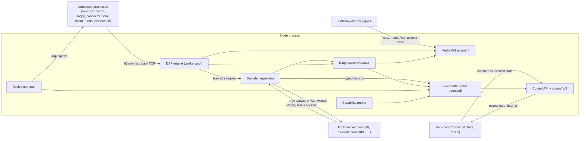

General rules:

1. The node MUST start without any hub connection. It probes capabilities, validates its config, and waits for the hub. Until the hub has pushed the access-token public key, it MUST refuse media connections (`503 hub_not_connected`).
2. Each node process start generates a random `boot_id`. Every event carries (`node_id`, `boot_id`, `seq`), with `seq` strictly increasing. On reconnect, the node replays the unacknowledged events from its bounded RAM buffer (see Data model, "Persistence rules").
3. Desired state from the hub (the data of the presets compatible with each device, as filtered by the hub, and the active preset, global settings such as `listen_policy`, service list, schedule timeline) is **level-triggered**. The hub never sends device settings: they come only from the node config file: the hub sends the complete desired state for each device after every (re)connect and after every change. The node converges to it. The node never relies on having received an earlier delta.
4. All work that waits (process exit, socket connect, port polling, child stop) MUST be asynchronous, with timeouts. No lock may be held while waiting.


### 8.2 SDR device manager

#### Driver strategy

| Device types | Process (argv, never a shell) | IQ path | Control path |
|---|---|---|---|
| `rtl_sdr`, `rtl_tcp` | `rtl_connector`, `rtl_tcp_connector` (owrx_connector ≥ 0.6.5) | loopback TCP, CF32 | loopback TCP text `key:value\n` |
| `soapy:<driver>` (sdrplay, airspy, airspyhf, hackrf, lime, pluto, uhd, bladerf, hydrasdr, afedri, elad, sx, mirics, malahit, radioberry, fcdpp, remote, iqfile, sddc, rtlsdr) | `soapy_connector` | same | same |
| `sddc` | `sddc_connector` | same | same |
| `hpsdr` | `hpsdrconnector` | same | same |
| `runds` | `runds_connector` | same | same |
| `perseus` | `perseustest … -o -`, its stdout piped by the node into `nmux` (or into the node's own fan-out) | loopback TCP from `nmux` (or in-process) | restart on change |
| `fifi_sdr` | `arecord …` piped by the node into `nmux`, plus `rockprog` for tuning | same | `rockprog` argv per retune |

1. Multi-process pipelines (Perseus, FiFi) MUST be built by the node connecting the stdout of one child to the stdin of the next. Shell invocation and shell strings are forbidden.
2. Every argument MUST come from a typed, schema-validated value. String parameters (`device`, `antenna`, `remote`, Soapy settings, gain stage strings) MUST be validated against per-parameter patterns, and MUST NOT contain control characters. In the connector control protocol, values MUST NOT contain `\n` or `\r`. In Soapy settings strings, values MUST NOT contain `,` or `=`. Invalid values fail config validation. They are never escaped silently.
3. Loopback ports for IQ and control are allocated from `node.ipc_port_range`. A port is reserved only while its device is starting or running. If the connector fails to bind, the next start attempt picks a **new** port.
4. Connector IQ and control sockets are unauthenticated. The node MUST bind them to loopback only. It SHOULD run connectors under the node service user in a dedicated network namespace, or document that the host must be single-tenant.
5. Connector stdout and stderr are captured per device into a 200-line RAM ring (served to admins on demand) and classified (`info`, `warn`, `device_lost`, `usb_error`, `overflow`) for state reasons. Lines are never inherited by the node's own stderr.

#### Lifecycle

Demand classes:

- `USER`: at least one media session is attached to the device.
- `BACKGROUND`: a scheduled preset is active or a service decoder runs.
- `ALWAYS_ON`: the device has `always_on = true`.

The device runs while it has any demand. Spectrum-only viewers count as `USER`.

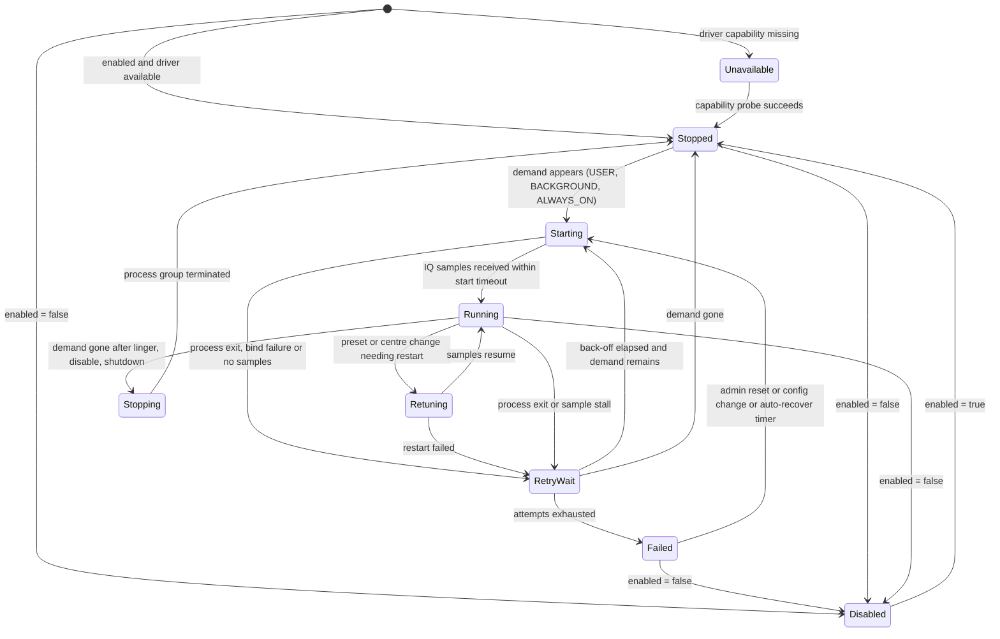

| Parameter | Default | Rule |
|---|---|---|
| Start timeout | 15 s | `Running` requires that the IQ socket is connected **and** that at least `samp_rate` × 0.1 samples have arrived. A merely open port is not enough. |
| Sample-stall watchdog | 3 s | In `Running`, no samples for this time count as a failure. The process group is stopped, and the device enters `RetryWait` with reason `sample_stall`. This covers hung drivers, such as SDRplay driver hangs. |
| Retry back-off | 2 s, 5 s, 15 s, 30 s, then 60 s | |
| Max attempts | 10 | Then `Failed`. |
| Auto-recover from `Failed` | every 15 min (`devices.<id>.auto_recover` (cfg), default true) | An admin "reset" action is always available. |
| Linger after the last demand | 10 s | Avoids start/stop flapping when a listener reloads the page. `ALWAYS_ON` devices never stop. |
| Stop | SIGTERM to the process group, 5 s grace, then SIGKILL | Asynchronous. No lock is held while waiting. |
| Retune | Connector types: live, over the control socket. Direct (`nmux`) types: `Retuning` (restart). | Media sessions get a `device.retuning` notice and a sample gap marker. They are not torn down, and no stale DSP chain survives the retune. |

Every transition emits `device.state` {`device_id`, `state`, `reason`, `retry_count`, `active_preset`, `center_freq`}. The hub writes it to the runtime columns of `devices`. States are named in lower case in the DB (`retry_wait`, …).

#### Preset and centre-frequency arbitration

1. The **active preset** of a device is shared by everyone attached to it. Only an operator (on a device with `operator_can_retune`) or an admin may switch it, or move the centre frequency (P3). Listeners tune only their own demodulator offset, within the current capture band.
2. Presets are device-independent data held in the hub DB. The hub validates a preset against the device's capabilities (frequency range, supported sample rates) before it sends it, and refuses an incompatible preset with `preset_incompatible`. The node re-checks the same limits and rejects an invalid preset with the same code. Operators and admins pick only from the presets compatible with the device.
3. The hub scheduler requests preset changes from `schedules` rows (`device_id`, `preset_id`, time window). The node applies a scheduled change only when the device has no `USER` demand (the scheduler yields to listeners). When the device becomes idle, the node applies the pending scheduled preset within 10 s.
4. An operator or admin switch overrides the schedule until the device becomes idle. There is no configuration key for this.
5. Every switch is audited by the hub (`device.preset.switch`, `device.retune`), with the actor.


### 8.3 DSP engine contract

The node MUST implement DSP natively (SIMD where available). Whether it uses libcsdr++ through FFI or implements the blocks natively is an implementation choice, subject to the licensing note of the dependencies plan.

#### Topology

| Stage | Instances | Contract |
|---|---|---|
| Device front-end | 1 per running device | Receives IQ from the connector, normalises it to complex float32, stamps each block with `sample_index` (monotonic since device start) and a UTC time anchor, and writes into the device IQ ring. |
| Shared spectrum (waterfall) | **1 per device**, whatever the number of viewers | FFT (`fft_size`, `fft_fps`, `fft_voverlap_factor`, window), log-power and averaging, computed **once**. The output is encoded **once per codec variant** (`adpcm`, `none`) and fanned out to every subscriber. Runs only while the device has at least one spectrum subscriber or a service that needs it. |
| Channelizer | Shared per device where possible | Services on neighbouring dials share a resampled sub-band. A polyphase channelizer MAY replace per-session shifts when more than `dsp.channelizer_threshold` (default 4) sessions run on one device. |
| Per-listener chain | 1 per media session | Selector (shift, decimation, bandpass, squelch and power meter) → primary demodulator → audio chain (NR, AGC, resample to the client rate, codec) → media WS. |
| Secondary decoder | 0..1 per listener session | Taps the selector IQ or the demodulated audio, as declared by the mode. Feeds the decoder adapter. |
| Secondary FFT | 0..1 per listener session | Runs **only when the client has subscribed to it**. |
| Service chain | 1 per active service dial | Same blocks, without audio output and without per-client parameters. |
| Diagnostics taps | 1 per decoder session | In-band power, noise floor, occupied bandwidth and the optional classifier (see Decoding diagnostics). They read existing buffers. They MUST NOT add a second channelizer. |

#### Execution model

1. DSP blocks MUST run on a **fixed worker pool** (dataflow scheduler). A block becomes runnable when its input has at least one block of samples and its output has room. A thread per block or per module is forbidden. Pool size = `node.dsp_workers` (default: number of cores − 1, minimum 1).
2. Blocking I/O (decoder process pipes, sockets, files) MUST run on an I/O reactor or dedicated I/O threads, never on DSP workers.
3. A session's chain MUST be built completely, off the hot path, before it replaces the previous chain (mode switch). The old chain is drained and released asynchronously. A failed build leaves the previous chain running and reports `demodulator_error` to the client. It never leaves the session without a chain.
4. All block parameters that clients can set MUST be range-checked before use: `output_rate` ∈ {8000, 11025, 12000, 16000, 22050, 24000, 44100, 48000}; `hd_output_rate` ∈ {44100, 48000}; `nr_threshold` within −20..20 dB; squelch within −150..0 dBFS; bandpass edges within ±(selector rate)/2; offset within the capture band.
5. The allowed modes for a session are derived, with no extra configuration key: the mode catalogue, **intersected with** the modes whose capabilities are present on the node, **intersected with** the modes that fit the device's current sample rate. **Service-only modes** (background recording, satellite capture, speech-to-text) MUST NOT be startable from a media session.
6. Batch decoder workers (WSJT, JS8) share `decoders.batch_workers` (cfg, default: cores ÷ 2) with `nice 10`. When no worker is free, the batch-queue rules below apply (`jobs_skipped`).
7. The node reports its measured CPU load to the hub for display only (busy indicator).

#### Buffers and overflow policies

Every edge between two blocks is a bounded ring buffer. Overflow is **never silent**: every drop increments a counter, and inserts a gap marker (`gap{from_sample, to_sample}`) that downstream blocks, decoders and diagnostics can see.

| Stream | Buffer depth (default) | Policy on overflow (consumer too slow) | Policy on underflow |
|---|---|---|---|
| Device IQ → per-session selector | 250 ms | Drop the oldest blocks for **that reader only**, then insert a gap marker. Other readers are unaffected. | Wait. |
| Shared FFT frames → subscriber | 2 frames | Keep the newest frame (coalesce). FFT frames are never queued. | – |
| Audio → client | 300 ms on the node side | Drop the oldest audio frames, and signal `audio.gap` with sequence numbers. Never block the DSP worker. Disconnect only if the backlog stays above 5 s for 10 s. | The client plays silence or uses concealment. |
| IQ or audio → streaming decoder process (stdin) | 2 s | Drop the oldest data and insert a gap. The diagnostics counter `input_overruns` increments, and the session reason becomes `input_overrun`. | – |
| Slot recorder → batch job queue | 2 slots per session | If no worker can start the job before `slot_start + deadline` (see the adapter table), the job is skipped and counted (`jobs_skipped`). | – |
| Decoder records → event buffer | unbounded within the global `node.event_buffer` cap | Back-pressure on the parser. When the cap is hit, the global drop order applies (Data model, "Persistence rules"). | – |
| Metadata (RDS, DMR talker, DRM status, …) → client | 32 messages | Keep the newest value per metadata key (coalesce). | – |

#### Latency targets

- Node-internal audio latency, from IQ arrival to the media WS frame: ≤ 100 ms at the 95th percentile on the reference hardware (4-core ARM64 at 1.8 GHz, one 2.4 MS/s device, 10 NFM listeners).
- An FFT frame is sent ≤ 1 frame period after its last sample.
- Wire formats (frame types, little-endian encoding, sequence numbers, timestamps, codecs) are specified by the `rx.v1` protocol, not here.


### 8.4 Decoder adapter contract

Every external decoder (and every native decoder that runs out-of-process) is wrapped by an **adapter**. An adapter is a declarative descriptor plus a parser. The supervisor runs adapters generically, so no tool-specific lifecycle code exists outside the descriptor and its parser.

#### Adapter descriptor (normative fields)

| Field | Meaning |
|---|---|
| `id` | Adapter id, for example `jt9`, `wsprd`, `direwolf`, `dump1090`, `native:psk`. |
| `capability` | Capability name gated by probing, for example `tool:jt9`. |
| `probe` | Argv list, timeout (≤ 5 s), expected exit codes, version regex and the stream it is read from (stdout or stderr). |
| `tested_versions` | Version range covered by contract tests (for example `>=2.6.1 <2.8`). |
| `min_version` | Hard minimum. Below it, the capability is `too_old`. |
| `kind` | `streaming` (long-lived, stdin→stdout) or `batch` (one process per input file or slot). |
| `input` | Sample format (`cf32`, `cs16`, `s16`, `f32`), sample rate, tap point (selector IQ or audio). |
| `argv` | Template array. Placeholders are typed (`{samp_rate:int}`, `{workdir:path}`, `{lat:float}`). No string concatenation into a single argument. Secrets are never placed in argv. |
| `side_channels` | Status sockets, FIFOs, JSON output files and stats files. All paths live **inside the session workdir**. |
| `timeouts` | `start` (first output, readiness or status), `idle_output` (optional liveness rule), `job` (batch wall-clock), `stop` (grace before SIGKILL). |
| `restart` | Back-off sequence, crash-loop threshold. |
| `stderr_rules` | Ordered regex → class mapping (below). |
| `parser` | Record schema(s) produced (`wsjt.v1`, `aprs.v1`, …). |
| `diag_map` | How tool outputs map to diagnostics signals (see Decoding diagnostics). |
| `resources` | Memory cap, open-files cap, `nice`, and whether network access is required (default: none). |

#### Spawning and isolation

1. **Argv-only**: `execve` with an argv array. No shell, and no shell-style parsing of strings built from config.
2. **Environment** is scrubbed and fixed: `PATH` set to the configured tool directories, `LANG=C.UTF-8`, `TZ=UTC`, `HOME` = workdir, no `DISPLAY`. Only variables declared in the descriptor are added.
3. **Private per-instance workdir**: `<node.runtime_dir>/sessions/<session_id>/`, mode 0700, created before the spawn. It is the process `cwd`. It holds every file the tool reads or writes: WAV slots, the `direwolf.conf` (0600), `dump1090` JSON output (`--write-json <workdir>/adsb`), Dream's `--status-socket`, the TETRA FIFO, `wsprd` side files (`ALL_WSPR.TXT`, `hashtable.txt`, …), and SatDump products. The workdir is removed when the session ends. A startup sweep removes leftovers from crashed runs. **No shared or hard-coded `/tmp` paths**.
4. Files are created with `O_CREAT|O_EXCL` and `O_NOFOLLOW` semantics.
5. Processes run as the node service user, in their own process group. They SHOULD get resource limits: an address-space or cgroup memory cap (default 512 MiB, per descriptor), an open-files cap, and no new privileges. Tools that need no network SHOULD run without network access where the platform allows it (namespace or sandbox).
6. Stopping a session kills the whole process group (SIGTERM, `stop` grace of 3 s by default, then SIGKILL). The stop is asynchronous and never blocks a DSP worker or the session's mode switch.

#### Timeouts, restart and back-off

| Situation | Rule |
|---|---|
| Streaming tool does not start (exec failure, early exit before first output or readiness) | Exit code 127 or ENOENT → capability re-probe, then diagnostics `UNAVAILABLE`. Otherwise → restart with back-off. |
| Streaming tool exits unexpectedly | Restart after 1 s, 2 s, 4 s, 8 s … capped at 60 s. Gap markers cover the lost interval. |
| Crash loop | ≥ 5 unexpected exits within 5 min → stop restarting. Diagnostics `DECODER_ERROR` (reason `crash_loop`). One retry every 10 min, or immediately when the user re-selects the mode. |
| Streaming tool alive but silent | A per-adapter `idle_output` rule applies only where the tool emits periodic output: Dream status (≤ 5 s), dump1090 stats file (≤ 30 s), rtl_433 stats (`-M stats` period + 10 s). A violation gives diagnostics `TIMEOUT` (reason `no_tool_output`); after 3 consecutive violations, the tool is restarted. For other tools, silence is normal (no signal) and is **not** an error. |
| Batch job (jt9, wsprd, js8) | Reading stdout and waiting for exit share **one** wall-clock deadline (`job`): FT8 = 13 s, FT4 = 6 s, JT65/JT9 = 50 s, WSPR = 100 s, FST4/FST4W/Q65 = 0.8 × interval, JS8 = 0.8 × submode interval. When the deadline passes, the process group is killed and the job counts as `job_timeout`. A hung decoder MUST NOT pin a worker. |
| Batch job queue full | The job is skipped, and `jobs_skipped` increments. Diagnostics reason `input_overrun`. Jobs are never dropped silently. |
| Status side channel (Dream socket, TETRA FIFO) | Opened non-blocking, with retry and back-off (1 s × 1.5, up to 10 s). A FIFO open MUST NOT block a thread. EOF on the FIFO is treated as a close, not as "readable forever". |

#### Typed framed output (no pickle)

1. Tool output MUST be parsed **in the node**, by the adapter parser, into typed records. Records are carried internally and to the hub in a **length-prefixed framed format**: a 4-byte little-endian length, then a self-describing payload (JSON, CBOR or protobuf; the protocol spec fixes the choice). The envelope is `{type, schema, session_id, seq, t_sample, t_utc, payload}`.
2. Record types: `decode` (family schema, for example `wsjt.v1`, `aprs.v1`, `aircraft.v1`, `sonde.v1`, `ism.v1`, `paging.v1`, `text.v1`), `meta` (`rds.v1`, `dv.v1`, `drm.v1`, `dab.v1`, `hdr.v1`, `tetra.v1`), `file` (an announcement plus chunk stream), `diag.signal`, `diag.state`, `log`.
3. **Python pickle, or any format that can instantiate code or objects, MUST NOT be used**. A channel never guesses its content type: each pipe or socket has exactly one declared format.
4. RF-derived strings are data. They are decoded as UTF-8 (or the tool's declared charset, for example the `paging.charset` setting), with invalid bytes replaced. Control characters other than `\n` and `\t` are removed. Fields are length-capped (text ≤ 4 KiB). Fields that downstream clients could treat as markup or URLs are typed as such in the schema, and validated at the source.
5. Parsers MUST tolerate unknown fields and missing optional fields. A record that fails parsing is counted (`parse_errors`) and logged at debug level. It never aborts the whole batch or file.
6. Timestamps: batch decoders report a time of day. The node derives the full UTC date-time from the **slot start time** of the input file, not from "today". Streaming decoders get `t_utc` from the sample timestamps at the tap point, plus the tool's own time when it provides one.

#### Stderr and exit-code classification

| Class | Meaning | Effect |
|---|---|---|
| `info` | Banner, normal progress | Kept in the ring only. |
| `signal_info` | Lines that carry sync, level or quality data (for example m17-demod LSF lines, direwolf audio level, freedv verbose stats, SatDump deframer state) | Parsed into `diag.signal`. |
| `warn` | Recoverable warnings | Ring, plus a counter. |
| `input_error` | Wrong sample format or rate, unexpected EOF | Diagnostics `DECODER_ERROR` (reason `input_format`). No restart until the configuration changes. |
| `fatal_config` | Invalid option, missing model file | Diagnostics `UNAVAILABLE` (reason `tool_misconfigured`). No restart. Admin alert. |
| `resource` | Out of memory, device busy, codecserver unreachable, AMBE codec missing | Diagnostics `DECODER_ERROR` or `UNAVAILABLE` (reason `codec_unavailable`), with back-off. |
| `unknown` | Anything else | Ring, plus a counter. Rate-limited to 10 lines/s per session. |

Exit codes: 0 = normal end (batch) or unexpected end (streaming); 126 = permission problem (`UNAVAILABLE`); 127 = not found (re-probe, then `UNAVAILABLE`); termination by a signal other than the node's own SIGTERM/SIGKILL (SIGSEGV, SIGABRT, SIGBUS, SIGILL) = `crash`; any other non-zero value = `error` (restart with back-off). The class, the exit code and the last 20 stderr lines are attached to the `DECODER_ERROR` diagnostics event.

#### Contract tests with pinned tool versions

1. Every adapter MUST have contract tests in CI: recorded input fixtures (IQ or audio files, with license-compatible provenance), pinned tool versions (container images with exact versions or source commits), and expected outputs: the decoded records **and** the expected diagnostics transitions (for example "noise-only fixture → `NO_SIGNAL`", "wrong-mode fixture → `SIGNAL_NO_SYNC`, then `WRONG_PROTOCOL_SUSPECTED`").
2. The CI matrix covers the `tested_versions` range of every adapter (at least the minimum and the latest tested version).
3. At runtime, a version outside `tested_versions` is still used. Its capability gets `status = 'untested'`, and the admin UI shows a warning.
4. Parser changes MUST keep earlier fixtures passing, or update them with a changelog entry.

#### Capability probing

1. Probes run at node start, on the hub command `capabilities.refresh`, and automatically after an ENOENT or 127 exit of any adapter. There is no time-based cache.
2. Probes are argv-only, run in a scratch workdir, have a 5 s timeout, at most 4 run in parallel, and run with `stdin` closed. A probe timeout yields `status = 'error'`; it never raises out of the prober.
3. The probe catalogue covers every adapter and device type, with these rules: version comparison uses a semver-tolerant comparator; `sonde` probes every sonde binary, not only `rs41mod`; the APRS symbol set is shipped, not probed; `speech` is a hub-side setting check, not a node capability; `dream-2-2` is detected by the presence of `--status-socket` in the help text; `codec:ambe` is probed by asking codecserver for its codec list over the configured socket.
4. The node sends one complete `capabilities.report` (all capabilities, their versions and evidence, plus the per-device-type parameter JSON Schemas) to the hub. The hub persists it in `node_capabilities` and derives mode availability per device: capability present ∧ device rate fits the mode ∧ the mode is not disabled by settings.

#### Batch slot decoders (WSJT family, WSPR, JS8)

1. The slot recorder cuts audio at UTC slot boundaries computed from **sample timestamps** (the device time anchor plus the sample index), not from wall-clock timers. A slot that contains a gap marker longer than 10 % of the slot is still decoded, but flagged (`partial_slot = true`, a diagnostics signal).
2. One WAV (mono, 16-bit, 12 kHz, correct 44-byte header) is written per slot and per interval group, in the session workdir. Several profiles of the same interval share the file through a reference count. They do not use hard links in a shared directory.
3. `wsprd` keeps its workdir across slots for the whole session, so that its call-sign hash table persists between slots (better decoding of hashed calls).
4. Jobs are queued per node, with the deadline rules above. Results are parsed into `wsjt.v1` or `js8.v1` records.


### 8.5 Background services and scheduling

1. Schedules are rows of the `schedules` table (Data model): (`device_id`, `preset_id`, time window). The **hub scheduler** is the only evaluator. Nodes never evaluate schedules from config on their own.
2. For each device, the hub computes a **timeline**: the desired preset per time interval for the next 24 h. Static entries are evaluated in UTC, with `days_of_week` and `priority`. Daylight entries are evaluated from `receiver.gps` with a solar-position algorithm. The greyline window is ±`schedule.greyline_minutes` (default 30) around sunrise and sunset. **Polar handling**: if the sun does not rise on a date, the whole day is `night`; if it does not set, the whole day is `day`. The computation MUST NOT raise an error (for example a domain error in the solar-angle formula).
3. The hub sends the timeline (`device.schedule_timeline`, versioned) to the node after every connect, on every change, and hourly. The node executes transitions from its own clock, so a schedule keeps running while the hub is temporarily unreachable, until the timeline ends. The node acknowledges each applied transition with a `device.preset_applied` event, or with `device.preset_deferred` (reason `listeners_present`).
4. **Service placement**: the hub computes the list of service dials for each (device, preset). It uses the bandplan's dial frequencies of the enabled service modes that fall inside the preset's capture band, minus a guard band of 2 % of the sample rate at each edge. It sends the explicit list (`services.set` {`dials[]`: `mode`, `frequency`, `id`}). The node only executes it. Neighbouring dials are grouped for a shared channelizer.
5. A change of preset, centre frequency or service list causes the node to diff the running services against the new list. It stops only the removed ones and starts only the added ones. A full restart is not required.
6. The audio recorder and speech-to-text services use an SNR squelch. Recordings are streamed to the hub as `file` records when a file closes (size caps from Data model). The speech-to-text call to `speech.url` is made by the **hub** from uploaded audio chunks, with a 30 s timeout. The node never calls third-party HTTP endpoints.
7. SatDump products (service-only satellite modes) are packaged per pass (images, then a zip of the other products, within `files.max_file_size`) and uploaded as `files` of kind `satellite`. Raw CADU files are discarded unless `services.satellite.keep_raw = true`.
8. Image post-processing (SSTV and FAX: colour quantisation, PNG compression) is done natively in the node, with no external image tool. Images under 64 lines are discarded.
9. Service decoder sessions are full decoder sessions: they emit diagnostics, with `origin = service`.


### 8.6 Reporting

Reporting to external networks is **hub-side only**. Nodes never connect to PSKReporter, WSPRnet, APRS-IS, SondeHub, AIS aggregators or MQTT brokers. Decodes flow node → hub → `reporting_outbox` (in one transaction with the decode; see Data model, "Transactional outbox") → per-network workers.

| Network | Accepted families or modes | Transport | Batching and rate | De-duplication | Failure handling |
|---|---|---|---|---|---|
| `pskreporter` | FT8, FT4, JT65, JT9, FST4, FST4W, Q65, WSPR, MSK144, JS8, CW and RTTY skimmer spots | UDP IPFIX to `report.pskreporter.info:4739` | One upload per 300 s + 0–30 s jitter. Each datagram ≤ 1400 bytes (several datagrams per batch if needed). | (call, band, mode) per 5 min | UDP has no acknowledgement. A batch is marked `sent` when the datagrams are transmitted. Unsent rows survive restarts. |
| `wsprnet` | WSPR, FST4W | HTTPS POST (HTTP if the endpoint requires it), 15 s timeout | ≤ 1 request/s | (call, slot, frequency) | Retry with back-off. Dead after 24 h. |
| `aprs_is` | APRS (AX.25, LoRa APRS), plus beacons | Persistent TCP to `reporting.aprs_is.server` (default `euro.aprs2.net:14580`), login with the passcode secret | Sequential. Reconnect back-off from 5 s to 5 min. | Same TNC2 payload within 30 s | Lines are built from parsed fields and validated: no CR, LF or NUL; length ≤ 512. Beacons are scheduled by the hub. |
| `sondehub` | Sonde telemetry (RS41, DFM, M10, M20, MTS01) | HTTPS PUT, gzip JSON, 20 s timeout | Batch every 2 s or 100 rows | (serial, frame) | Retry. Listener-position updates (`sondehub_listener`) every 6 h. |
| `ais_udp` | AIS NMEA sentences | UDP to the configured host and port list | Immediate | – | Fire and forget (`sent` on transmit). |
| `mqtt` | Every decode family, plus `RX` and `CLIENT` events when enabled | MQTT 3.1.1 or 5 over TLS when `use_tls`. QoS 1. Topic `<topic>/<MODE>`. | Ordered per topic | Message id = outbox id | Persistent session. Reconnect back-off. One client per hub instance. |

1. Each network has exactly one worker on the hub, which preserves ordering where it matters (APRS-IS session, MQTT). Workers claim rows in batches through a lease column written with generic SQL (no engine-specific locking such as `SKIP LOCKED`), so the rows of a crashed worker become claimable again when the lease expires. The hub is the single DB writer (SQLite adapter).
2. Enabling, disabling or reconfiguring a network takes effect without a restart. The worker re-reads its settings on the settings change notification. The reporter list is never mutated while it is being iterated.
3. MQTT **ingest** (subscription to remote decodes) is a hub job too. Incoming messages are validated against the family schemas and written with `origin = 'mqtt'`. Messages whose topic prefix equals our own topic are ignored (loop guard).
4. Metrics per network: `reporting_rows_total{network,status}`, `reporting_pending{network}`, `reporting_send_duration_seconds{network}`, `reporting_dead_total{network,reason}`.
5. `report_clients` (publishing client connect events to MQTT) defaults to **off**. When it is on, client IPs are never published: only a salted hash per day.


### 8.7 Dependencies plan

The node and the UI build on external libraries and tools. Each dependency has one integration mode:

- **process**: the upstream program runs as a child process (argv, pipes or sockets), behind the adapter contract.
- **FFI**: the library is linked into the node.
- **native**: the function is implemented in the Product (possibly ported from the named project, subject to the licensing note).

Licenses listed below are indicative and MUST be verified before each dependency is bundled.

#### Libraries and packages

| Dependency | Integration | Notes | License |
|---|---|---|---|
| libcsdr++ (luarvique/csdr) DSP blocks | **FFI** or **native** | Native SIMD DSP is required either way. FFI provides proven blocks (FIR, AGC, ADPCM, the SSTV/FAX decoders, Varicode, Baudot, CCIR476). A native implementation is needed for a non-GPL Product. The ADPCM wire variants MUST be bit-compatible with `rx.v1`. | Mixed GPLv3+ and BSD-3 per file. FFTW is GPLv2+. |
| `nmux` (csdr) | **process** (Perseus, FiFi), MAY be replaced by the node's own fan-out | Only needed for pipeline sources. The node can read the child's stdout directly. | BSD-3 |
| owrx_connector (`rtl_connector`, `rtl_tcp_connector`, `soapy_connector`) | **process** | Covers the RTL-SDR and SoapySDR device types behind a process boundary. The node implements the client side (spawn, wait for samples, `key:value` control). | GPLv3+ |
| digiham (libdigiham) | **process** (its CLIs `dmr_decoder`, `ysf_decoder`, `mbe_synthesizer`, …) or **FFI** | DMR, YSF, D-Star, NXDN, P25 and POCSAG decoding. A process boundary avoids GPL linking. The CLIs must expose sync and metadata in a framed format (adapter work). | GPLv3 |
| csdr-eti (libcsdr-eti) | **process** (wrapped by an ETI-producing CLI) or **FFI** | DAB ETI decoding. | GPLv3 |
| csdr-skimmer (`csdr-cwskimmer`, `csdr-rttyskimmer`) | **process** | Already stdin/stdout. | GPLv3 |
| codecserver | **process** (socket daemon) | The AMBE boundary MUST stay external (patents, DVSI hardware). The node implements its protobuf client. The socket path comes from `tools.codecserver_socket` (no hard-coded `/tmp` path). | GPLv3. AMBE is patent-encumbered. |
| js8py | **native** | About 600 lines of frame parsing, implemented in the JS8 adapter parser. | GPLv3 (a port is a derivative work; see the licensing note) |
| meshtastic `.proto` definitions | **native** | Decoded with the stack's protobuf library. Per-channel PSKs are configurable. AES-CTR comes from the stack's crypto library. | GPLv3 (meshtastic), BSD-3 (protobuf) |

#### External programs

| Program | Integration | Notes | License |
|---|---|---|---|
| `sddc_connector`, `hpsdrconnector`, `runds_connector` | **process** | Same contract as owrx_connector. | GPL, Go, GPLv3 (to verify) |
| `perseustest`, `arecord`, `rockprog` | **process** | No shell pipelines. | GPL (to verify) |
| SoapySDR + modules (through `soapy_connector`) | **process** | The SDRplay API is proprietary: it MUST NOT be bundled in Product images. Users install it. | Boost-1.0. Drivers vary. |
| `jt9`, `wsprd`, `wsjtx_app_version` | **process** | Batch adapters with deadlines. | GPLv3 |
| `msk144decoder` | **process** | Streaming. | GPL (to verify) |
| `js8` | **process** | Batch adapter. | GPLv3 |
| `direwolf` | **process** | KISS over a socket in the workdir (or a loopback port from the IPC range). The config file is generated in the workdir (0600). The direwolf iGate mode MUST NOT be used: APRS-IS uploads are made by the hub worker. `-q h` MUST NOT be passed, so that audio levels reach diagnostics. | GPLv2 |
| `multimon-ng` | **process** | Charset from settings. | GPLv2 |
| `rtl_433` | **process** | Run with `-M level` and `-M stats` for diagnostics. | GPLv2 |
| `dump1090` (FlightAware) | **process** | `--write-json` into the session workdir. The stats file feeds diagnostics. | GPLv2+ |
| `dump978` | **process** | JSON stdout. | To verify |
| `dumphfdl`, `dumpvdl2` | **process** | JSON stdout. | GPLv3 |
| `acarsdec` (≥ 4) + libacars | **process** | JSON stdout. | GPLv2 |
| `dream` (≥ 2.2) | **process** | `--status-socket` inside the workdir. Dream < 2.2 is supported without status (diagnostics degrade to generic signals). | GPLv2 |
| `dablin` | **process** | A programme change SHOULD NOT restart the process where dablin supports switching. Otherwise the restart is accounted as planned, not as a crash. | GPLv3 |
| `nrsc5` / libnrsc5 | **FFI** (libnrsc5), or **process** if the CLI accepts IQ on stdin (to verify against the pinned version) | Callbacks from foreign threads MUST hand data to the node through a lock-free queue, never write to DSP buffers directly. | GPLv3 |
| `redsea` | **process** | Run with the block-error-rate option for diagnostics (see Decoding diagnostics). | MIT |
| `freedv_rx` (codec2) | **process** | Modes beyond 1600 MAY be added. | LGPLv2.1 |
| `webrx_rade_decode` | **process** | Unpackaged upstream. Capability-gated. | To verify |
| `m17-demod` | **process** | stderr LSF and debug lines are classified as `signal_info`. | GPLv3 (to verify) |
| `tetrarx` | **process** | FIFO inside the workdir, non-blocking open. | To verify (osmo-tetra derived) |
| `rs41mod`, `dfm09mod`, `m10mod`, `m20mod`, `mts01mod` | **process** | Every binary is probed. | To verify |
| `lorarx` (dxlAPRS) | **process** | JSON to stdout. | GPL (to verify) |
| `satdump` | **process** | Output inside the workdir, uploaded as files. Graceful stop, bounded by the `stop` timeout. | GPLv3 |
| `lame` | **process**, or an MP3/Opus encoder library | The Product MAY record to Opus/Ogg instead. | LGPLv2 |
| `gpsd` | TCP JSON protocol (client implemented in the Product) | Reconnects with back-off, read timeouts. | BSD-2 |
| whisper.cpp server | HTTP (hub-side) | 30 s timeout, correct WAV header. | MIT |

#### Hardware drivers

| Path | Integration | Notes |
|---|---|---|
| Native connectors (librtlsdr, sddc, HPSDR P1, R&S EB200/Ammos, Perseus, FiFi ALSA) | **process** | Each runs in its own process. |
| SoapySDR modules (20 drivers) | **process** through `soapy_connector` | The driver list comes from `soapy_connector --listdrivers` (capability probe). |
| SoapySDRPlay3 (luarvique fork) | **process** | Proprietary SDRplay API: user-installed only. The node's sample-stall watchdog removes the need for connector-side watchdog assumptions. |

#### Frontend libraries

The UI (P6) uses a small set of third-party libraries. They MUST be self-hosted, version-pinned and covered by the CSP. No runtime CDN loading. Date handling uses native `Intl` and `Date`. In-browser recording uses the platform audio encoders, or WAV. The Maidenhead grid layer is implemented in the Product.

| Library | Use | Notes | License |
|---|---|---|---|
| chroma.js (optional) | Colour scales for the waterfall | MAY be replaced by in-house scales. | BSD-3 / Apache-2 |
| Leaflet 1.9.4 | Map engine | Self-hosted, pinned. | BSD-2 |
| leaflet.terminator | Day/night overlay | Self-hosted, pinned. | MIT |
| leaflet.geodesic | Geodesic lines | Self-hosted, pinned. Check the license before bundling. | GPLv3 (to verify) |
| leaflet-textpath | Path labels | Self-hosted, pinned. | MIT |
| Google Maps JS API | Optional map provider | The key is a public client key, origin-restricted. | Google ToS |

#### Licensing note

1. The DSP and decoder ecosystem is GPLv2/GPLv3. If the Product links any of these components in-process (**FFI**: libcsdr++, libdigiham, libcsdr-eti, libnrsc5) or ports their code (js8py), the node binary is a derivative work and MUST be distributed under a GPLv3-compatible license. **AGPLv3 is RECOMMENDED** for the Product: it is compatible with the ecosystem and covers network use.
2. If a permissive license is chosen instead, every GPL component MUST stay behind a process or socket boundary (**process**). libcsdr++ must then be replaced by clean-room DSP (its BSD-3 files excepted), and the JS8 parser must be written from the protocol, not ported.
3. Container images that bundle GPL programs MUST ship, or offer, the corresponding sources, and MUST pin exact versions (this is also needed for the contract tests).
4. Proprietary or encumbered components (the SDRplay API, AMBE codecs or DVSI hardware) MUST NOT be bundled. They are detected at runtime through capability probing.


---

## 9. Decoding diagnostics

Decoding diagnostics (P5) explain **why a decoder shows nothing**. Every decoder session, whether started by a listener or by a background service, continuously reports one state, a machine-readable reason, a confidence and a user-facing hint. States are pushed live and persisted in `decoder_diagnostics` (see Data model).

### 9.1 Goals and non-goals

Goals:

1. Tell users, in plain language, whether "no decodes" means an empty channel, a signal the decoder cannot lock onto, a locked signal that fails error checks, a probable wrong mode, a broken or missing tool, or an overloaded node.
2. Give admins per-device, per-mode health over time (time spent decoding, error rates, crash loops, missing tools) without reading process logs.
3. Use the evidence each tool already exposes (sync, CRC/FEC counters, levels, exit codes, stderr), and fall back to tool-independent DSP measurements where a tool exposes nothing.
4. Keep false positives low. A wrong "wrong protocol" hint is worse than no hint.

Non-goals:

- Automatic mode switching. The Product MAY offer a one-click "switch to suggested mode" action. It MUST NOT switch modes by itself.
- Signal identification for arbitrary unknown signals (a general signal classifier). Only the installed decoder families are candidates.
- Diagnostics for plain analog demodulation (AM, FM, SSB, CW audio). For those, the S-meter and squelch remain the indicators.


### 9.2 Concepts

| Term | Definition |
|---|---|
| Decoder session | One running instance of one decoder adapter, bound to (device, preset, frequency, mode). It is created when a listener selects a digital mode, or when the hub's service list starts a service dial. It ends on mode change, retune outside the capture band, session close or service removal. Its id is a node-generated UUIDv7. |
| Family | A group of modes with the same tool and similar timing (table below). It selects the timing profile, the signal mapping and the hint texts. |
| Evaluator | The node-side component that computes the state of each session once per **tick** (1 s), from signals. It runs on the node, close to the samples. The hub never recomputes states. |
| Window | The look-back period over which signals are aggregated for one evaluation (per family). |
| Hold | How long `DECODING` persists after the last valid decode before a lower state may be entered (per family). |
| Dwell | The minimum time spent in a state before another non-terminal state may replace it. Default 3 s. Terminal-class states (`UNAVAILABLE`, `DECODER_ERROR`) bypass it. |
| Confidence | 0..1. How strongly the evidence supports the current state. Used by the UI (wording) and by the false-positive rules. |


### 9.3 States

| State | Meaning | Entry condition (summary) | UI severity |
|---|---|---|---|
| `UNAVAILABLE` | The decoder cannot run here. | Capability missing, `too_old` or `tool_misconfigured`. Mode does not fit the device sample rate or capture band. Service-only mode requested by an interactive client (the mode allow-list is the mode catalogue ∩ node capabilities, service-only modes excluded; no configuration key). AMBE codec missing for DV audio. | error (static) |
| `IDLE` | The session exists but is not evaluating a signal. | Warm-up period after start or retune. Device `starting` or `retuning`. Service deferred. Waiting for the first slot boundary. | neutral |
| `NO_SIGNAL` | Nothing to decode in the passband. | No in-band energy above the noise floor, or no bursts, for the window. No tool-side sync evidence. | neutral (quiet channel) |
| `SIGNAL_NO_SYNC` | Energy is present, but the decoder never locks. | Signal evidence for at least one window. Zero sync detections (if the tool exposes sync) or zero decodes (if it does not). | warning |
| `SYNC_NO_DECODE` | The decoder locks (sync, preamble, frame start), but frames fail CRC/FEC or yield no valid message. | Sync count > 0 and valid decodes = 0 over the window, or a failure ratio ≥ 0.9. | warning |
| `DECODING` | Valid messages are produced. | ≥ 1 valid decode within the hold period. The `quality` sub-field is `good` or `marginal` (failure ratio ≥ 0.5 or SNR within 3 dB of the family threshold). | ok |
| `WRONG_PROTOCOL_SUSPECTED` | The signal probably uses another protocol, or another variant, sideband or offset. | The heuristics below agree with confidence ≥ 0.7 for 2 consecutive windows, with no valid decode. | warning, with an action |
| `DECODER_ERROR` | The tool failed. | Crash loop, `input_format` error, `resource` error (codecserver unreachable), parse error ratio > 50 % over 20 records. | error |
| `TIMEOUT` | Something that should be timely was not. | A batch job exceeded its deadline. A tool with periodic output went silent (`no_tool_output`). Input stalled (no samples for 5 s while the device is `running`). A batch slot was skipped because of overload. | error (transient) |


### 9.4 State machine

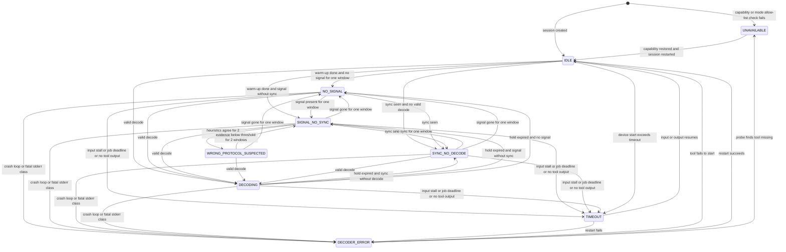

#### Transition rules

1. **Evaluation**: each tick (1 s), the evaluator computes the **candidate state** from the signals of the current window, using this precedence (first match wins):

   `UNAVAILABLE` > `DECODER_ERROR` > `TIMEOUT` > `DECODING` > `WRONG_PROTOCOL_SUSPECTED` > `SYNC_NO_DECODE` > `SIGNAL_NO_SYNC` > `NO_SIGNAL` > `IDLE`.

2. **Commit**: the candidate replaces the current state only if (a) the current state's dwell (3 s) has elapsed, or the candidate is `UNAVAILABLE`, `DECODER_ERROR` or `DECODING`; and (b) for any downgrade out of `DECODING`, the family hold has expired since the last valid decode.
3. **Reset events** move the session to `IDLE`, with reason `retuned`, `preset_changed`, `device_restarting` or `mode_changed`. They restart the warm-up and clear the windows: a preset switch, a centre-frequency change, a listener retune by more than half the decoder bandwidth, a device `retuning`/`starting`/`retry_wait` state, or a gap marker longer than the window.
4. **Terminal states**: `UNAVAILABLE` is left only through a session restart after the cause is removed (capability re-probe, settings change). `DECODER_ERROR` is left automatically when a supervised restart produces output again.
5. **Rate limits**: at most one transition per second per session is pushed to clients. Persisted transitions are coalesced (see "Persistence, aggregation and retention").
6. **Burst-aware absence**: for bursty families, `NO_SIGNAL` is entered only after `absence_window` without any burst. The reason is then `quiet_channel`, with `confidence ≤ 0.5`. The UI wording says "no activity yet", not "no signal".

#### Timing profiles per family

| Family | Modes | Window | Warm-up | Hold (`DECODING`) | Absence window (`NO_SIGNAL`) | Notes |
|---|---|---|---|---|---|---|
| `wsjt` | FT8, FT4, JT65, JT9, FST4, Q65, MSK144 | 1 slot (FT8 15 s, FT4 7.5 s, JT65/JT9 60 s, FST4/Q65 = interval; MSK144 15 s rolling) | until the first full slot | 3 slots | 2 slots | Evaluated at slot end, after the job result. |
| `wspr` | WSPR, FST4W | 1 slot (120 s or interval) | first full slot | 3 slots | 3 slots | Beacons are sparse. |
| `js8` | JS8 (normal, fast, turbo, slow) | 1 slot of the submode | first full slot | 3 slots | 3 slots | |
| `packet` | APRS 1200, 9600, AX.25 | 30 s | 5 s | 300 s | 300 s | Bursty. |
| `ais` | AIS | 30 s | 5 s | 300 s | 300 s | Bursty. Two channels per session. |
| `paging` | POCSAG, FLEX, selcall (ZVEI, CCIR, EEA, EIA, DTMF), EAS | 30 s | 5 s | 300 s | 600 s | Bursty. |
| `ism` | ISM / rtl_433, wM-Bus | 30 s | 5 s | 300 s | 600 s | Bursty. |
| `aircraft` | ADS-B, UAT | 10 s | 5 s | 60 s | 120 s | |
| `aircraft` | HFDL, VDL2, ACARS | 60 s | 10 s | 300 s | 600 s | HFDL ground-station squitters arrive about every 32 s and count as sync. |
| `drm` | DRM | 5 s | 10 s | 10 s | 10 s | Continuous. |
| `dab` | DAB / DAB+ | 5 s | 10 s | 10 s | 10 s | Continuous. |
| `hdr` | HD Radio | 5 s | 10 s | 10 s | 10 s | Continuous. |
| `rds` | RDS / RBDS (WFM side-decoder) | 5 s | 3 s | 15 s | 10 s | |
| `dv` | DMR, YSF, D-Star, NXDN, P25 | 2 s | 2 s | 5 s after the last frame | 30 s | Intermittent voice. A quiet channel is normal. |
| `m17`, `freedv`, `tetra` | M17, FreeDV and RADE, TETRA | 2 s | 3 s | 5 s | 30 s | TETRA control channels are continuous. Traffic channels are intermittent. |
| `lora` | LoRa APRS, Meshtastic, MeshCore, MeshCom, LoRaWAN, FANET | 60 s | 5 s | 600 s | 900 s | Very bursty. |
| `sonde` | RS41, DFM, M10, M20, MTS01 | 10 s | 5 s | 30 s | 60 s | Frames about 1/s while a sonde is in range. |
| `skimmer` | CW and RTTY skimmers | 10 s | 5 s | 60 s | 60 s | Many signals per session. Per-signal states are aggregated. |
| `textmodes` | PSK31/63, RTTY (45/50/75), SITOR-B, NAVTEX, CW decoder | 10 s | 3 s | 30 s | 30 s | Native decoders. |
| `dsc` | DSC | 30 s | 5 s | 300 s | 600 s | Bursty. |
| `image` | SSTV, FAX | 10 s | 3 s | until image end + 30 s | 120 s | |
| `satellite` | Meteor LRPT, Elektro LRIT (service only) | 10 s | 30 s | 30 s | 120 s | |
| `speech`, `recorder` | Speech-to-text, audio recording (service only) | 5 s | 1 s | while active + hang time | 30 s | No sync concept. `DECODING` = active transcription or recording. Only `IDLE`, `NO_SIGNAL`, `DECODING`, `DECODER_ERROR`, `TIMEOUT` and `UNAVAILABLE` apply. |


### 9.5 Signals

The evaluator combines **DSP-native signals** (computed by the node for every session, whatever the tool) with **tool signals** (extracted by the adapter from tool output). Every signal is optional: a missing signal lowers the confidence, but never causes an error.

#### DSP-native signals (every session)

| Signal | Unit | Computation | Cadence |
|---|---|---|---|
| `power_dbfs` | dBFS | Mean in-band power at the decoder tap (selector output). The same estimator as the S-meter. | 4 Hz |
| `noise_dbfs` | dBFS | Noise floor: the 20th percentile of the shared-FFT bins in the decoder passband plus guard bands, smoothed over 10 s. It reuses the device's shared FFT, so it costs nothing extra. | 1 Hz |
| `snr_db` | dB | `power_dbfs − noise_dbfs` in the decoder bandwidth. For weak-signal modes (WSJT family), the tool's SNR (2.5 kHz reference bandwidth) is used instead when available. | 1 Hz |
| `burst_count`, `burst_snr_db_max` | count, dB | Energy-detector bursts (≥ 8 dB above the noise for ≥ 5 ms) in the window. | per window |
| `squelch_open_ratio` | 0..1 | Fraction of the window with squelch open (only when squelch is in use). | per window |
| `clip_ratio` | 0..1 | Fraction of device IQ samples at or near ADC full scale (device-wide). | 1 Hz |
| `occupied_bw_hz` | Hz | Width of the −20 dB-from-peak region of the averaged in-band spectrum (shared FFT, or the secondary FFT when subscribed). | per window |
| `freq_offset_hz` | Hz | Offset of the occupied-bandwidth centroid from the decoder centre. | per window |
| `baud_estimate` | Bd | Optional (see "WRONG_PROTOCOL_SUSPECTED heuristics"). Computed only in `SIGNAL_NO_SYNC`. | ≤ 0.1 Hz |
| `modulation_class` | enum | Optional classifier output (same condition). | ≤ 0.1 Hz |
| `input_overruns`, `gap_ms` | count, ms | From the DSP overflow policy (Node internals). | per window |
| `partial_slot` | bool | A batch slot contained gaps above 10 %. | per slot |

#### Tool signals (normalised names)

| Signal | Meaning |
|---|---|
| `sync_count` | Sync events: preambles, frame syncs, Costas or VIS detections, squitters, `SYNC` events. |
| `crc_fail_count` | Frames rejected by CRC, checksum or MIC. |
| `fec_corrected` | Corrected bits or octets, or FEC iterations (quality indicator). |
| `fec_uncorrectable` | Frames that FEC could not repair. |
| `decode_count` | Valid records produced (after parser validation). |
| `parse_errors` | Tool lines or records the parser rejected. |
| `tool_snr_db`, `tool_level_db`, `tool_noise_db` | Quality values reported by the tool. |
| `mer_db`, `ber` | Modulation error ratio and bit error rate (HD Radio, digital voice debug). |
| `exit_code`, `exit_signal`, `stderr_class_counts` | Process outcome and stderr classes (Node internals). |
| `job_duration_ms`, `slot_lateness_ms`, `jobs_skipped`, `job_timeouts` | Batch timing. |
| `last_output_age_ms` | Time since the last tool output (for tools with periodic output). |
| `encrypted` | The tool reports that the payload is encrypted (TETRA, some DV). |

#### Per-family evidence

"Verify" marks a field or flag that the contract tests (Node internals) MUST confirm against the pinned tool version before the adapter relies on it. Adapters MUST degrade to the fallback column when a verified signal is absent.

| Family / tool | Required flags | Sync evidence | CRC/FEC evidence | Quality / SNR | Decode evidence | Fallback heuristics when evidence is missing |
|---|---|---|---|---|---|---|
| `wsjt` / `jt9` (`--ft8`, `--ft4`, `--jt65`, `--jt9`, `--fst4`, `--fst4w`, `--q65`) | none | Final `<DecodeFinished>` line counters (sync candidates, decodes; verify the field order). Q65 lines with an empty message are "candidate without decode". | The tool does not expose rejected CRC-14/LDPC candidates. Proxy: sync candidates minus decodes. | Per decode: `db` (SNR in 2.5 kHz), `dt` (time offset; \|dt\| > 1 s across decodes → clock-skew hint), audio offset. | Lines `HHMMSS db dt freq ~ msg`. | Slot energy in 200–3000 Hz versus the noise. The node's clock offset (from the hub) for skew hints. The activity baseline (see "False-positive control"). |
| `wspr` / `wsprd` | `-d` per settings; workdir kept per session | `<DecodeFinished>` line. Side files in the workdir (`ALL_WSPR.TXT`) list candidates (verify the format). | Not exposed. Proxy: candidates minus decodes. | `snr`, `dt`, `drift` per decode. | Decode lines. | As `wsjt`. |
| `js8` / `js8` | none | `<DecodeStarted>`, `<DecodeDebug>`, `<DecodeFinished>` markers (verify the debug content). | Not exposed. | `db`, `dt` per frame. | Frame lines (parsed by the ported js8py logic). | As `wsjt`. |
| `wsjt` (MSK144) / `msk144decoder` | none | Lines not starting with `*** ` are candidates or debug output (verify). | Not exposed. | Per decode `db`, `dt`. | Lines starting with `*** `. | Burst detector (meteor pings: short, strong bursts). |
| `packet`, `ais` / `direwolf` | drop `-q h`, so that per-frame audio-level lines reach stdout | HDLC flags are not reported. Proxy: audio-level lines (one per received frame, verify). | Frames repaired by bit-fixing are flagged in the received-frame lines (verify). CRC-failed frames are not counted by default. | `audio level = N(mark/space)`: direwolf recommends about 50. Too low or too high is a hint. | KISS frames read from the socket. | AFSK tone detection (1200/2200 Hz energy) for 1200 Bd. `baud_estimate` for 9600 Bd and AIS (GMSK 9600). |
| `paging` / `multimon-ng` (`-a POCSAG512/1200/2400`, `-a FLEX`, `-a ZVEI1`, `-a EAS`, …) | `-v1` or higher, with stderr classified (verify which verbosity reports sync or bit errors per demodulator) | POCSAG preamble or sync and FLEX sync, when the verbosity shows them. | POCSAG BCH-corrected or uncorrectable codewords, when shown (verify). | none | `POCSAG…:`, `FLEX…`, `ZVEI…`, `EAS:` lines. | FSK `baud_estimate` (512/1200/2400 for POCSAG, 1600/3200/6400 for FLEX). Deviation from `occupied_bw_hz`. |
| `ism` / `rtl_433` | `-M level`, `-M stats:<window>` (verify the field names) | Stats: frame or pulse counts per window. | Stats per protocol: `fail_mic` (checksum/CRC), `fail_sanity`, `abort_length`, `abort_early`. | Per message: `rssi`, `snr`, `noise`. | JSON messages. | Burst detector. OOK versus FSK from envelope variance. |
| `aircraft` (ADS-B) / `dump1090` (FlightAware) | `--write-json <workdir>/adsb` (private per-session working directory). Read `stats.json` too (verify the keys). | `stats.json` local: preambles or Mode S messages seen. | `stats.json` local: bad (CRC failures), unknown ICAO, accepted counts by corrected bits. | `stats.json`: signal, noise, peak signal, strong signals. `aircraft.json`: per-aircraft `rssi`. | Aircraft with messages in the window. | 1 µs pulse bursts (burst detector at 2.4 MS/s). |
| `aircraft` (UAT) / `dump978` | `--json-stdout` | Frames with metadata. | `metadata.errors` (Reed-Solomon corrected; verify), or `rs=` in raw mode. | `metadata.rssi`. | JSON messages. | Burst detector. |
| `aircraft` (HFDL) / `dumphfdl` | `--output decoded:json:file:path=-`; optionally statsd counters (verify) | Ground-station squitters (SPDU) and LPDU headers. | `lpdu.err` or the CRC flag per frame (verify). | `sig_level`, `noise_level`, `freq_skew`. | PDUs that parse correctly. | Energy on the HFDL channel grid (1800 Bd PSK, about 2.4 kHz occupied). |
| `aircraft` (VDL2) / `dumpvdl2` | default flags; statsd optional (verify) | AVLC frames. | `hdr_bits_fixed`, `octets_corrected_by_fec`, and frames with CRC errors when `--decode-fragments` reports them (verify). | `sig_level`, `noise_level`, `freq_skew`. | Parsed AVLC frames. | Burst detector (D8PSK 10.5 kBd, 25 kHz channel). |
| `aircraft` (ACARS) / `acarsdec` | `--output json:file` | Messages only. | `error` (corrected bit errors per message; verify). | `level` (dB). | JSON messages. | MSK 2400 Bd burst detector. |
| `drm` / `dream` (≥ 2.2) | `--status-socket <workdir>/status` | `status.io`, `status.time`, `status.frame` (value > 0 = OK, 0 = off, < 0 = error). | `status.fac`, `status.sdc`, `status.msc` (CRC per channel). | `signal.snr_db`, `signal.if_level_db`. Mode robustness and bandwidth. | MSC OK with audio. | Dream < 2.2: OFDM detector (cyclic-prefix autocorrelation) and audio output presence only. |
| `dab` / csdr-eti + `dablin` | `dablin` stderr classified (verify the messages: superframe sync, Reed-Solomon and AU CRC errors). The ETI decoder MUST expose sync, FIC CRC and SNR (adapter requirement on the reused library or CLI). | ETI frame sync (null symbol and phase reference). | FIC CRC failures. Superframe RS uncorrectable. AU CRC failures. | ETI SNR, if exposed. | Programme audio and labels. | OFDM detector (1.536 MHz occupied, null symbol every 96 ms). |
| `hdr` / libnrsc5 | none (events) | `SYNC` and `LOST_SYNC` events. | `BER` event (`cber`). | `MER` event (lower and upper sideband dB). | Audio packets, ID3. | Sidebands detected beside an analog FM carrier (occupied about ±200 kHz). |
| `rds` / `redsea` | block-error-rate output option (verify the flag name and field) | PI code present = group sync. | Block error rate. | none | JSON groups with PS, RT and other content. | 57 kHz subcarrier energy in the MPX. |
| `dv` / digiham (+ codecserver) | Adapter requirement: expose a sync type per frame (`voice`/`data`), the slot, and the FEC-corrected and uncorrectable counts from the decoders (verify what libdigiham provides) | Frame sync (DMR, YSF, D-Star, NXDN, P25 sync patterns). | Golay, BPTC or Hamming results when exposed. | none | Voice superframes, data and talker metadata. | 4FSK/GMSK classifier, `baud_estimate` (4800/2400), multi-protocol sync search (see the heuristics). |
| `freedv` / `freedv_rx` (codec2) | verbose statistics option (verify per codec2 version: sync, SNR estimate, bit errors) | Modem sync. | Bit errors, LDPC iterations (mode-dependent). | SNR estimate. | Decoded speech frames. | OFDM or FDMDV carrier detection. |
| `freedv` (RADE) / `webrx_rade_decode` | unknown (verify) | unknown | unknown | unknown | Non-silent audio output. | OFDM detector, audio energy at the output. |
| `m17` / `m17-demod` | `-l`, plus the debug option (verify: DCD, EVM, deviation, frequency offset, clock, Viterbi cost) | LSF lines `SRC: …, DEST: …`, DCD. | Viterbi cost (BER proxy). | EVM, deviation, offset. | LSF and stream frames, `EOS`. | 4FSK `baud_estimate` 4800. |
| `tetra` / `tetrarx` | `-j <workdir>/status` FIFO | `TN`, `FN`, `MN` (time slot, frame, multiframe) present = sync. `CC` (MCC, MNC, BCC). | not exposed (verify) | `dB` (RF level), `AFC`, `EYE` (eye opening). | `AUDIO = 1` frames, or signalling with SSI. `ENC = 1` → encrypted (still "decoding", hint `encrypted`). | π/4-DQPSK at 18 kBd, 25 kHz channel. |
| `lora` / `lorarx` | `-v`, JSON on stdout (verify the field names for SNR, level, CRC and SF/CR/BW) | Header or preamble detections. | CRC-failed frames, when verbose output reports them. | SNR, level, AFC. | Frames with a valid CRC and a parsed payload. | Chirp detector (spread-spectrum, occupied bandwidth 125/250/500 kHz). SF mismatch hint. |
| `sonde` / `rs41mod`, `dfm09mod`, `m10mod`, `m20mod`, `mts01mod` | `--json`; plus a CRC/ECC reporting option (verify per decoder: `[OK]`/`[NO]` markers, corrected-error counts) | Frame headers. | CRC OK/NO, RS-corrected count (RS41). | none | Frames with an id, position and time. | `baud_estimate` to tell the types apart (RS41 4800 GFSK, DFM 2500 Manchester, M10 9600). Strong candidate for type suggestions. |
| `skimmer` / `csdr-cwskimmer`, `csdr-rttyskimmer` | none | Per-signal text start. | none | Per-signal `db`. | Recognised call signs. | Number of tone peaks in the passband. |
| `textmodes` / native PSK31/63, RTTY, SITOR-B/NAVTEX, CW | Native decoders MUST expose, as engine requirements: PSK carrier lock and Varicode error rate; RTTY mark/space detection and Baudot framing errors; CCIR476 (SITOR-B/NAVTEX) invalid-character and FEC-repair counts; CW tone lock and WPM | as stated | as stated | Tone SNR. | Printable characters (validated). | Printable-character ratio over the window. A text decoder that produces mostly non-printable or random characters is `SYNC_NO_DECODE` or `SIGNAL_NO_SYNC`, not `DECODING`. |
| `dsc` / native DSC | Expose the ECC (check character) and parity failures | Dot pattern and phasing sequence. | ECC and parity failures. | Tone SNR. | Valid DSC calls. | 100 Bd FSK (170 Hz shift) detection. |
| `image` / native SSTV, FAX | Expose VIS detection (SSTV), start tone and phasing detection (FAX), and line-sync quality | VIS code and line syncs. Start tone 300/675 Hz and phasing. | Line-sync slips. | Tone SNR. | Image lines received. Image completed. | Tone detection at 1200 Hz (SSTV sync) and 1500–2300 Hz. |
| `satellite` / `satdump` | stdout parsed; verify the log lines for Viterbi/deframer state and BER | Deframer `SYNCED`. | Viterbi BER, Reed-Solomon errors. | SNR, if logged. | Products written to the workdir. | QPSK/OQPSK carrier detection (about 120 kHz occupied for Meteor LRPT). |
| `speech` / whisper HTTP (hub-side) | 30 s timeout | – | – | – | Non-empty transcripts. | HTTP status and timeouts give `DECODER_ERROR` or `TIMEOUT`. An SNR-squelch-closed state gives `NO_SIGNAL`. |
| `recorder` / `lame` or encoder | – | – | – | – | Bytes written. | SNR-squelch state. |

#### Mapping evidence to states

| Candidate state | Required evidence (any family) |
|---|---|
| `UNAVAILABLE` | Capability `missing`, `too_old` or `tool_misconfigured`. Mode–rate mismatch. Service-only mode requested interactively. `codec:ambe` missing for a DV session that requests audio (decoding metadata without audio is then reported as `DECODING` with hint `ambe_missing`). |
| `DECODER_ERROR` | `crash_loop`. `input_format`. `resource` error. `parse_errors` / (`parse_errors` + `decode_count`) > 0.5 over ≥ 20 records. Process start failure. |
| `TIMEOUT` | `job_timeouts` > 0 in the last slot. `jobs_skipped` > 0 in 2 consecutive slots. `last_output_age_ms` above the adapter's `idle_output`. Input stalled ≥ 5 s with the device `running`. Device start exceeding its timeout while the session waits. |
| `DECODING` | `decode_count` > 0 within the hold. For `textmodes`: a printable ratio ≥ 0.8 over ≥ 20 characters. |
| `WRONG_PROTOCOL_SUSPECTED` | See the next section. Never while `decode_count` > 0 within the hold. |
| `SYNC_NO_DECODE` | `sync_count` > 0 and `decode_count` = 0 over the window. Or (`crc_fail_count` + `fec_uncorrectable`) / (that sum + `decode_count`) ≥ 0.9 with ≥ 5 frames. |
| `SIGNAL_NO_SYNC` | Signal evidence (`snr_db` ≥ the family threshold for ≥ 50 % of the window, or ≥ 3 bursts with `burst_snr_db_max` ≥ 8 dB), and `sync_count` = 0. If the tool exposes no sync signal at all, also `decode_count` = 0, with `confidence` capped at 0.5 and reason `no_decode_sync_unknown`. |
| `NO_SIGNAL` | None of the above, and no signal evidence over the absence window. For weak-signal families (`wsjt`, `wspr`, `js8`), energy cannot separate noise from decodable signals (they decode below the noise floor), so `NO_SIGNAL` there means "no candidates and no decodes", with reason `no_candidates` and `confidence ≤ 0.6`. |
| `IDLE` | The session is inside its warm-up, or the device is not delivering samples, for an expected reason (`starting`, `retuning`, `deferred`, `waiting_for_slot`). |

Family SNR thresholds (`snr_db` in the decoder bandwidth) for "signal evidence": `packet`/`ais` 6 dB, `paging` 8 dB, `dv`/`m17`/`tetra` 8 dB, `drm` 6 dB, `dab`/`hdr` 6 dB, `aircraft` 6 dB (burst), `sonde` 6 dB, `lora` −5 dB (chirp detector, since LoRa decodes below the noise), `textmodes` 6 dB, `image` 10 dB, `rds` 10 dB (MPX pilot and subcarrier). These are defaults. They are tunable per family in `settings.diagnostics.thresholds.<family>`.


### 9.6 WRONG_PROTOCOL_SUSPECTED heuristics

The evaluator runs the heuristics **only** when the session has been in `SIGNAL_NO_SYNC` for ≥ 1 full window, `snr_db` ≥ 10 dB (or bursts ≥ 12 dB), and there are no decodes. The heuristics are best-effort: the node skips them while its measured CPU load is above 80 %. They run at most once per 10 s per session.

| # | Heuristic | Method | Produces |
|---|---|---|---|
| H1 | Bandwidth mismatch | Compare `occupied_bw_hz` with the family's expected range (table below). A ratio outside 0.5–2.0 is a mismatch. | `+0.3`, plus candidates whose expected bandwidth fits |
| H2 | Symbol-rate estimate | Estimate `baud_estimate` from the spectral line of the squared envelope (PSK/QAM) or of the instantaneous-frequency derivative (FSK). Match it against the expected rates of every installed family (±3 %). | `+0.4` if the expected rate is absent **and** another family's rate matches; that family becomes a candidate |
| H3 | Modulation classifier | Lightweight features: envelope variance (constant envelope or not), the number of instantaneous-frequency clusters (2FSK, 4FSK), phase cluster count (BPSK, QPSK, 8PSK), cyclic-prefix autocorrelation (OFDM), chirp-slope detection (LoRa), on-off keying ratio (OOK, CW). Output: `modulation_class` with a score. | `+0.3` if the class differs from the expected class with a score ≥ 0.7; the candidates of that class |
| H4 | Known-signature search | Correlate the session's demodulated bits (or symbols) against the sync words of **other** installed protocols that share the same modulation class: DMR / P25 / NXDN / YSF / D-Star frame syncs; POCSAG sync `0x7CD215D8` versus FLEX sync; AX.25 HDLC flag runs `0x7E`; Mode S preamble; FT8 versus FT4 Costas arrays; DAB null symbol versus DVB-T. | `+0.6` for a hit with ≥ 3 occurrences in the window (strong evidence on its own) |
| H5 | Sideband or offset mismatch | Mirror test: the spectrum is mirror-symmetric to the expected tone set (USB/LSB swap for WSJT, PSK and RTTY). `freq_offset_hz` larger than the decoder's capture range (for example more than ±1 kHz for NFM data modes, more than ±200 Hz for PSK31). FM deviation far outside the expected range (WFM content in an NFM session). | `+0.4`. The suggestion is the same mode with a corrected sideband or offset (`suggested_modes[].adjust`). |
| H6 | Variant mismatch within a family | Run the tool's own variants when they are cheap: POCSAG 512/1200/2400; JS8 submodes; FST4 intervals; sonde types; LoRa spreading factors (from the chirp slope). | `+0.5` for the variant that produces sync |

Expected parameters (used by H1–H3; the per-family defaults ship with the adapter descriptors):

| Family / mode | Occupied bandwidth | Symbol rate | Modulation class |
|---|---|---|---|
| FT8 / FT4 (per signal) | 50 Hz / 90 Hz | 6.25 / 20.8 Bd | 8-GFSK / 4-GFSK |
| WSPR | 6 Hz | 1.46 Bd | 4-FSK |
| APRS 1200 | ≈ 12 kHz (FM) | 1200 Bd | AFSK in FM |
| APRS 9600 / AIS | ≈ 12–15 kHz | 9600 Bd | GMSK / G3RUH |
| POCSAG | ≈ 12.5 kHz | 512 / 1200 / 2400 Bd | 2FSK (±4.5 kHz) |
| FLEX | ≈ 12.5 kHz | 1600 / 3200 / 6400 sym/s | 2FSK / 4FSK |
| DMR / YSF / P25 Ph1 | ≈ 7–8.5 kHz | 4800 sym/s | 4FSK (C4FM) |
| NXDN | ≈ 4–7 kHz | 2400 / 4800 sym/s | 4FSK |
| D-Star | ≈ 6 kHz | 4800 Bd | GMSK |
| M17 | ≈ 9 kHz | 4800 sym/s | 4FSK |
| TETRA | ≈ 21 kHz | 18 000 sym/s | π/4-DQPSK |
| DRM | 4.5–20 kHz | OFDM | OFDM |
| DAB | 1.536 MHz | OFDM | OFDM |
| HD Radio (FM hybrid) | sidebands ±(129–199) kHz | OFDM | OFDM |
| ADS-B (Mode S) | ≈ 2 MHz | 1 Mbit/s | PPM pulses |
| UAT | ≈ 1.3 MHz | 1.041667 Mbit/s | CPFSK |
| HFDL | ≈ 2.4 kHz | 1800 sym/s | PSK |
| VDL2 | ≈ 14 kHz | 10 500 sym/s | D8PSK |
| ACARS | ≈ 6 kHz (AM) | 2400 Bd | MSK in AM |
| RS41 / DFM / M10 | ≈ 10–15 kHz | 4800 / 2500 / 9600 Bd | GFSK / Manchester FSK / FSK |
| LoRa | 125 / 250 / 500 kHz | 2^SF chirps | chirp |
| RTTY | 170 / 450 / 850 Hz shift | 45.45 / 50 / 75 Bd | 2FSK |
| PSK31 / PSK63 | 60 / 120 Hz | 31.25 / 62.5 Bd | BPSK |
| SITOR-B / NAVTEX | 170 Hz shift | 100 Bd | 2FSK |
| DSC | 170 Hz shift | 100 Bd | 2FSK |

Decision:

1. `score` = the sum of the heuristic contributions, capped at 1. The state is entered when `score` ≥ 0.7 for **2 consecutive evaluations**, and **either** at least two independent heuristics (H1–H3, H5, H6) contributed, **or** H4 produced a hit.
2. `suggested_modes` lists at most 3 candidates. Each is `{mode, confidence, adjust?}`. Only modes whose capability is present on the node, and that are on the interactive mode allow-list (service-only modes excluded), are suggested. Otherwise the hint names the protocol without an action button.
3. After the user dismisses a suggestion, or the session switches mode and the suggestion does not decode within one window, the same suggestion is suppressed for that session (cooldown 15 min).
4. Every entry into this state is persisted with the scores of each heuristic, for false-positive analysis.


### 9.7 Hint catalogue

Each persisted or pushed state carries a `hint_code`. Clients render the localised message from the code and its `params`. The English texts below are normative defaults. Placeholders are in braces. Messages are plain text. Hints are selected by (state, reason, family). The most specific row wins.

| `hint_code` | State | Families | Condition | User message (en) |
|---|---|---|---|---|
| `tool_missing` | `UNAVAILABLE` | any | capability `missing` | "{mode} decoding is not installed on this receiver." (admins also see: "Install {tool} ≥ {min_version} on node {node}.") |
| `tool_too_old` | `UNAVAILABLE` | any | capability `too_old` | "The {mode} decoder on this receiver is too old." (admins: "{tool} {version} found, {min_version} required.") |
| `tool_misconfigured` | `UNAVAILABLE` | any | `fatal_config` stderr class | "{mode} decoding is misconfigured on this receiver." (admins: last stderr lines) |
| `rate_mismatch` | `UNAVAILABLE` | any | the preset sample rate is below the mode requirement | "{mode} needs {required_bw} of bandwidth. This preset only offers {bw}." |
| `mode_service_only` | `UNAVAILABLE` | any | service-only mode requested by an interactive client | "{mode} runs only as a background service on this receiver." |
| `ambe_missing` | `DECODING` or `UNAVAILABLE` | `dv` | no AMBE codec | "Digital voice frames are decoded, but voice audio needs an AMBE codec that is not available here." |
| `warming_up` | `IDLE` | any | warm-up | "Starting the {mode} decoder…" |
| `waiting_for_slot` | `IDLE` | `wsjt`, `wspr`, `js8` | before the first slot | "Waiting for the next {mode} period ({seconds} s)." |
| `device_starting` | `IDLE` | any | device `starting` or `retuning` | "The receiver is starting or retuning." |
| `quiet_channel` | `NO_SIGNAL` | bursty families | no bursts in the absence window | "No {mode} activity heard yet on {freq}. Transmissions are occasional, so keep listening." |
| `no_signal` | `NO_SIGNAL` | continuous families | no in-band energy | "No signal on {freq}. Check the frequency, or try another preset or antenna." |
| `no_candidates_weak_mode` | `NO_SIGNAL` | `wsjt`, `wspr`, `js8` | no candidates and no decodes | "No {mode} signals found in the last {n} periods. Check that you are on a {mode} frequency (for example {dial_hint}) in {sideband}." |
| `adsb_no_bursts` | `NO_SIGNAL` | `aircraft` (ADS-B, UAT) | no bursts | "No aircraft transmissions received. Reception at {freq} needs line of sight and a suitable antenna." |
| `check_sideband` | `SIGNAL_NO_SYNC` | `wsjt`, `wspr`, `js8`, `textmodes` | H5 mirror evidence, or a generic case | "A signal is present but the decoder cannot lock. Check the sideband ({sideband} expected) and the tuning." |
| `clock_skew` | `SIGNAL_NO_SYNC` or `DECODING` (marginal) | `wsjt`, `wspr`, `js8` | node clock offset > 0.5 s, or median \|dt\| > 1 s | "The receiver clock is off by about {offset} s. {mode} needs accurate time. The administrator has been notified." |
| `offset_too_large` | `SIGNAL_NO_SYNC` | narrowband families | `freq_offset_hz` above the capture range | "The signal is {offset} Hz off-centre. Tune closer to it." |
| `wrong_deviation` | `SIGNAL_NO_SYNC` | FM-based families | deviation out of range | "The signal looks wider or narrower than {mode} expects." |
| `no_sync_generic` | `SIGNAL_NO_SYNC` | any | default | "A signal is present, but it does not look like {mode}." |
| `dv_no_sync` | `SIGNAL_NO_SYNC` | `dv`, `m17`, `tetra` | default | "A carrier is present, but no {mode} frames are found. It may be another digital voice mode or analog FM." |
| `drm_no_sync` | `SIGNAL_NO_SYNC` | `drm` | Dream time or frame sync missing | "No DRM synchronisation. Tune to the centre of the DRM signal. This may be an AM broadcast." |
| `crc_failures` | `SYNC_NO_DECODE` | any | default | "{mode} frames are detected but fail error checks ({fail_pct} %). The signal is too weak or distorted." |
| `overload` | `SYNC_NO_DECODE` or `SIGNAL_NO_SYNC` | any | `clip_ratio` > 0.01 | "The receiver input is overloaded. The administrator has been notified." (admins: "Reduce the RF gain of {device} in the node config file.") |
| `multipath_weak` | `SYNC_NO_DECODE` | `dab`, `drm`, `hdr` | sync OK, audio CRC failures | "The station is found but the audio cannot be decoded reliably (weak signal or multipath)." |
| `dab_service_missing` | `SYNC_NO_DECODE` | `dab` | ensemble decoded, selected service absent | "The ensemble is received, but the selected programme is not in it." |
| `encrypted` | `DECODING` | `tetra`, `dv` | `encrypted` flag | "This transmission is encrypted. Signalling is shown. Audio is not available." |
| `decoding_marginal` | `DECODING` | any | quality `marginal` | "Decoding, but the signal is marginal ({snr} dB)." |
| `suggest_mode` | `WRONG_PROTOCOL_SUSPECTED` | any | candidates exist | "This looks like {suggested} rather than {mode}." Action: "Switch to {suggested}". |
| `suggest_variant` | `WRONG_PROTOCOL_SUSPECTED` | `paging`, `js8`, `sonde`, `lora`, `wsjt` | H6 | "This looks like {mode} {variant}." Action: "Use {variant}". |
| `suggest_adjust` | `WRONG_PROTOCOL_SUSPECTED` | any | H5 | "Try {adjust} (for example the other sideband or a {offset} Hz offset)." |
| `unknown_protocol` | `WRONG_PROTOCOL_SUSPECTED` | any | evidence without an installed candidate | "This signal does not match {mode}. It may use a protocol that this receiver cannot decode." |
| `tool_crashed` | `DECODER_ERROR` | any | crash, restart pending | "The {mode} decoder stopped unexpectedly and is restarting (attempt {n})." |
| `crash_loop` | `DECODER_ERROR` | any | crash loop | "The {mode} decoder keeps failing. The administrator has been notified." |
| `codec_unavailable` | `DECODER_ERROR` | `dv` | codecserver unreachable | "The voice codec service is unreachable." |
| `input_format` | `DECODER_ERROR` | any | `input_format` class | "The decoder rejected its input. This is a configuration error." |
| `job_timeout` | `TIMEOUT` | `wsjt`, `wspr`, `js8` | job deadline | "Decoding took too long. The receiver is overloaded, and some periods are skipped." |
| `input_stalled` | `TIMEOUT` | any | no samples | "No data from the receiver for {seconds} s." |
| `no_tool_output` | `TIMEOUT` | `drm`, `aircraft` (ADS-B), `ism` | `idle_output` exceeded | "The decoder stopped reporting. It will be restarted." |
| `input_overrun` | `TIMEOUT` (or a reason on any state) | any | `input_overruns` or skipped jobs | "The receiver is too busy, and parts of the signal were skipped." |

Visibility: admin-only details (tool names, versions, stderr, node names) MUST be sent only to admins, and to operators scoped to the device. Listeners and anonymous users get the user message without admin details.


### 9.8 Event payload schema

Two message kinds exist:

- `decoder.diag` is sent on every committed transition, and as a keep-alive every 60 s. It is persisted, and pushed to session owners and authorised viewers.
- `decoder.diag.sample` is sent at 1 Hz with signals only. It goes on the media WS to the session owner, and to admins with the live view open. It is **never persisted**.

```json
{
  "$schema": "https://json-schema.org/draft/2020-12/schema",
  "$id": "urn:product:schema:decoder.diag:1",
  "type": "object",
  "required": ["type", "schema_version", "session_id", "seq", "node_id", "device_id", "origin",
               "mode", "family", "frequency_hz", "state", "reason", "confidence", "since", "t"],
  "properties": {
    "type": { "const": "decoder.diag" },
    "schema_version": { "const": 1 },
    "session_id": { "type": "string", "format": "uuid" },
    "seq": { "type": "integer", "minimum": 0 },
    "t": { "type": "string", "format": "date-time" },
    "node_id": { "type": "string" },
    "device_id": { "type": "string" },
    "preset_id": { "type": ["string", "null"], "format": "uuid" },
    "connection_id": { "type": ["string", "null"], "format": "uuid" },
    "origin": { "enum": ["listener", "service"] },
    "mode": { "type": "string" },
    "family": { "type": "string" },
    "tool": {
      "type": ["object", "null"],
      "properties": { "id": { "type": "string" }, "version": { "type": ["string", "null"] },
                      "status": { "enum": ["ok", "untested", "too_old", "missing", "error"] } }
    },
    "frequency_hz": { "type": "integer" },
    "bandwidth_hz": { "type": ["integer", "null"] },
    "state": { "enum": ["UNAVAILABLE", "IDLE", "NO_SIGNAL", "SIGNAL_NO_SYNC", "SYNC_NO_DECODE",
                        "DECODING", "WRONG_PROTOCOL_SUSPECTED", "DECODER_ERROR", "TIMEOUT"] },
    "previous_state": { "type": ["string", "null"] },
    "since": { "type": "string", "format": "date-time" },
    "quality": { "enum": ["good", "marginal", null] },
    "reason": {
      "type": "object", "required": ["code"],
      "properties": { "code": { "type": "string" }, "params": { "type": "object" } }
    },
    "hint": {
      "type": ["object", "null"],
      "properties": {
        "code": { "type": "string" },
        "params": { "type": "object" },
        "action": { "type": ["object", "null"],
                    "properties": { "kind": { "enum": ["switch_mode", "adjust", "none"] },
                                    "mode": { "type": "string" }, "adjust": { "type": "object" } } }
      }
    },
    "confidence": { "type": "number", "minimum": 0, "maximum": 1 },
    "suggested_modes": {
      "type": "array", "maxItems": 3,
      "items": { "type": "object", "required": ["mode", "confidence"],
                 "properties": { "mode": { "type": "string" }, "variant": { "type": "string" },
                                 "confidence": { "type": "number" }, "adjust": { "type": "object" } } }
    },
    "heuristics": { "type": "object", "description": "Per-heuristic scores (H1..H6), present only for WRONG_PROTOCOL_SUSPECTED" },
    "window_s": { "type": "number" },
    "signals": {
      "type": "object",
      "properties": {
        "power_dbfs": { "type": "number" }, "noise_dbfs": { "type": "number" }, "snr_db": { "type": "number" },
        "burst_count": { "type": "integer" }, "squelch_open_ratio": { "type": "number" },
        "clip_ratio": { "type": "number" }, "occupied_bw_hz": { "type": "number" },
        "freq_offset_hz": { "type": "number" }, "baud_estimate": { "type": "number" },
        "modulation_class": { "type": "string" },
        "sync_count": { "type": "integer" }, "crc_fail_count": { "type": "integer" },
        "fec_corrected": { "type": "integer" }, "fec_uncorrectable": { "type": "integer" },
        "decode_count": { "type": "integer" }, "parse_errors": { "type": "integer" },
        "decode_rate_per_min": { "type": "number" }, "last_decode_at": { "type": ["string", "null"] },
        "tool_snr_db": { "type": "number" }, "tool_level_db": { "type": "number" },
        "mer_db": { "type": "number" }, "ber": { "type": "number" }, "encrypted": { "type": "boolean" },
        "exit_code": { "type": ["integer", "null"] }, "exit_signal": { "type": ["string", "null"] },
        "stderr_class_counts": { "type": "object", "additionalProperties": { "type": "integer" } },
        "stderr_tail": { "type": "array", "items": { "type": "string" }, "maxItems": 20,
                         "description": "Admin and scoped-operator recipients only" },
        "job_duration_ms": { "type": "integer" }, "slot_lateness_ms": { "type": "integer" },
        "jobs_skipped": { "type": "integer" }, "job_timeouts": { "type": "integer" },
        "input_overruns": { "type": "integer" }, "gap_ms": { "type": "integer" },
        "partial_slot": { "type": "boolean" }, "restart_count": { "type": "integer" }
      }
    }
  }
}
```

Counters in `signals` are **per window** for `decoder.diag.sample`, and **cumulative since `since`** for `decoder.diag`. The schema of a transition carries the window values at the commit time in `signals`. Session-end summaries (`state` unchanged, `reason.code = "session_end"`) carry cumulative totals.

Example:

```json
{
  "type": "decoder.diag", "schema_version": 1,
  "session_id": "01928f3e-7c1a-7d2b-9a51-3f0c2e8b1d44", "seq": 7,
  "t": "2026-10-06T14:03:45.120Z", "node_id": "attic", "device_id": "vhf-rtl",
  "preset_id": "6f1d0c9e-0f0a-4a43-9a1e-0a5b7c2d9e11", "connection_id": null,
  "origin": "service", "mode": "pocsag1200", "family": "paging",
  "tool": { "id": "multimon-ng", "version": "1.3.1", "status": "ok" },
  "frequency_hz": 466075000, "bandwidth_hz": 12500,
  "state": "WRONG_PROTOCOL_SUSPECTED", "previous_state": "SIGNAL_NO_SYNC",
  "since": "2026-10-06T14:03:44.900Z", "quality": null,
  "reason": { "code": "variant_mismatch", "params": { "expected_baud": 1200, "estimated_baud": 512 } },
  "hint": { "code": "suggest_variant", "params": { "mode": "POCSAG", "variant": "512" },
            "action": { "kind": "switch_mode", "mode": "pocsag512" } },
  "confidence": 0.82,
  "suggested_modes": [ { "mode": "pocsag512", "confidence": 0.82 } ],
  "heuristics": { "H2": 0.4, "H6": 0.5 },
  "window_s": 30,
  "signals": { "snr_db": 21.5, "burst_count": 6, "sync_count": 0, "decode_count": 0, "baud_estimate": 511.8 }
}
```


### 9.9 Persistence, aggregation and retention

1. **What is persisted**: every committed transition (`decoder_diagnostics` row) and every session-end summary. Sample messages are never persisted.
2. **Coalescing**: if a session re-enters the state it left less than 30 s ago (A → B → A), and B lasted less than 30 s, the hub extends the earlier row instead of inserting new ones. It keeps a `flaps` counter in `exit_signals`. A session therefore produces at most about 2 rows per minute, whatever the evaluator does.
3. **Listener sessions** are persisted only once they have lasted ≥ 30 s. Their rows reference `connection_id`, never an IP address or user name. Service sessions are always persisted.
4. **Keep-alive**: the 60 s keep-alive updates `left_at`-less rows in RAM on the hub, for the live view. It is written to the DB only on transition or session end, plus a checkpoint every 10 min for open rows. Long sessions therefore survive hub crashes with ≤ 10 min of state duration lost.
5. **Rollup**: the `diag.rollup` job (every 5 min) aggregates closed rows into `decoder_diagnostics_hourly` (time in state, transitions, sessions, decodes, CRC failures, sync count, average and 90th-percentile SNR), per (`hour`, `device_id`, `mode`, `origin`, `state`). Open rows are counted up to the current time and re-aggregated later.
6. **Retention**: raw rows `retention.decoder_diagnostics` (default 14 days, purged daily by the retention job), rollups `retention.decoder_diagnostics_hourly` (default 180 days).
7. **Alerts** (persisted in `audit_log` as `diag.alert`, and pushed to admins on `/api/ws`): `crash_loop`, `UNAVAILABLE` for a configured service, a service with zero minutes in `DECODING` over 24 h while its 7-day baseline is above 0, a node clock skew above 0.5 s, and `job_timeout` rates above 10 % per hour.


### 9.10 Admin diagnostics views

All views are under **Admin › Diagnostics**. Operators see the views restricted to the devices in their scope. Listeners see only the live status of their own sessions, in the receiver page's Decoders tab.

| View | Content | Data source |
|---|---|---|
| Live board | A grid of nodes → devices → active decoder sessions (listener and service), each with its state colour, hint, SNR and decode rate. Filters: state, family, origin. | `/api/ws` topic `diag.live` (transitions + samples for subscribed sessions) |
| Session timeline | For one session: a state band over time, sparklines of SNR, sync count, CRC failures and decodes, the transitions table with reasons, and (admins) the stderr tail fetched on demand from the node. | `decoder_diagnostics` + node ring buffer |
| Service health | Per device and mode: % of time in `DECODING` per day (heatmap by hour of day), decodes per hour against the 7-day baseline, CRC failure ratio, restarts. | `decoder_diagnostics_hourly` |
| Errors | Recent `DECODER_ERROR`, `TIMEOUT` and `UNAVAILABLE` rows, grouped by tool and reason, with counts and first and last occurrence. | `decoder_diagnostics` |
| Capability matrix | Nodes × capabilities: status, version, tested range, probe time. A "re-probe" action. | `node_capabilities` |
| Wrong-protocol log | Every `WRONG_PROTOCOL_SUSPECTED` entry with its heuristic scores, and the outcome: user switched and decoded, dismissed, or expired. Used to tune thresholds. | `decoder_diagnostics` |

API (hub REST, read-only; full definitions in the API spec):

- `GET /api/v1/diagnostics/sessions?device_id=&mode=&state=&origin=&from=&to=`
- `GET /api/v1/diagnostics/sessions/{session_id}/transitions`
- `GET /api/v1/diagnostics/rollups?device_id=&mode=&from=&to=&granularity=hour|day`
- `POST /api/v1/nodes/{node_id}/capabilities/refresh` (admin)
- `GET /api/v1/diagnostics/sessions/{session_id}/stderr` (admin or scoped operator; proxied live from the node; not persisted)


### 9.11 Metrics

Exposed on the hub metrics endpoint (and on the node's own endpoint for node-local metrics). Labels are bounded: `mode` and `family` come from fixed enums, `device` from configured ids. No label carries a user, an IP or a frequency.

| Metric | Type | Labels |
|---|---|---|
| `decoder_sessions` | gauge | `node`, `device`, `family`, `origin`, `state` |
| `decoder_state_transitions_total` | counter | `family`, `from`, `to` |
| `decoder_decodes_total` | counter | `family`, `mode`, `origin` |
| `decoder_sync_total` | counter | `family` |
| `decoder_crc_failures_total` | counter | `family` |
| `decoder_parse_errors_total` | counter | `tool` |
| `decoder_process_restarts_total` | counter | `tool`, `reason` (`crash`, `timeout`, `planned`) |
| `decoder_job_duration_seconds` | histogram | `tool` |
| `decoder_job_timeouts_total`, `decoder_jobs_skipped_total` | counter | `tool` |
| `decoder_input_overruns_total` | counter | `node`, `family` |
| `decoder_wrong_protocol_total` | counter | `family`, `suggested_family`, `outcome` (`switched_decoded`, `dismissed`, `expired`) |
| `decoder_hint_feedback_total` | counter | `hint_code`, `vote` (`helpful`, `wrong`) |
| `diag_events_dropped_total` | counter | `node` |
| `diag_classifier_seconds_total` | counter | `node` (CPU spent on the heuristics) |


### 9.12 False-positive control

1. **Hysteresis**: the dwell (3 s), the family holds, and the 2-window confirmation for `WRONG_PROTOCOL_SUSPECTED` prevent flapping. Downgrades out of `DECODING` always wait for the hold.
2. **Reset on change**: retune, preset switch, mode switch and device restarts reset the windows to `IDLE`. A transient is never reported as a problem.
3. **Burst awareness**: bursty families report `quiet_channel` (low confidence, neutral wording) instead of an error-like `NO_SIGNAL`.
4. **Weak-signal awareness**: for `wsjt`, `wspr` and `js8`, energy is never used to claim `SIGNAL_NO_SYNC`. Only tool candidates or mirror evidence count.
5. **Activity baseline**: the hub computes, per (device, preset, mode, hour of day), the 7-day median decode rate from `decoder_diagnostics_hourly`. It sends it to the node with the service list or session start. A `NO_SIGNAL` with a baseline near zero keeps neutral wording ("this frequency is usually quiet at this hour"). A `NO_SIGNAL` with a high baseline raises the confidence, and can trigger the admin alert.
6. **Thresholds and gates**: `WRONG_PROTOCOL_SUSPECTED` requires SNR ≥ 10 dB, two independent heuristics or one signature hit, no decodes within the hold, and an installed and permitted candidate before an action is offered.
7. **Cooldown and feedback**: dismissed suggestions are suppressed for 15 min per session. The UI offers "Was this hint helpful? yes / no" on warnings. Votes increment `decoder_hint_feedback_total`, and are stored in the session's next `decoder_diagnostics` row (`exit_signals.feedback`). No free text is stored.
8. **Validation corpus**: the project MUST maintain a labelled corpus of recordings (true mode, noise-only, wrong-mode, wrong-sideband, overload, weak) used by the contract tests. Acceptance targets on the corpus:
   - `WRONG_PROTOCOL_SUSPECTED` false-positive rate ≤ 2 % of evaluation windows on correctly tuned, decodable recordings;
   - recall ≥ 60 % on wrong-mode recordings with SNR ≥ 15 dB;
   - `DECODING` reached within one hold period on every decodable recording;
   - noise-only recordings never leave `IDLE`/`NO_SIGNAL`.
9. **Kill switch**: `settings.diagnostics.wrong_protocol.enabled` (default true) and `settings.diagnostics.classifier.enabled` (default true) disable the heuristics globally without affecting the other states.


---

## 10. Security requirements

This section states the normative security requirements of the Product. It starts with a threat model of the target architecture (gateway, hub, nodes, the hub ↔ node channel, enrollment, access tokens, the SQLite database, accounts and invitations, privacy), then lists the requirements `SR-01`…`SR-73`, grouped by area. A requirement is written to remove a class of flaw, not a single instance. Each requirement has a verification method that MUST be automated in CI unless it says otherwise.

### 10.1 Threat model

#### Assets

| # | Asset | Where it lives | Why it matters |
|---|---|---|---|
| A1 | User accounts and credentials | `users` (Argon2id hashes), `user_identities`, `user_roles`, `invitations` | Account takeover gives that role's powers. An admin account controls every node, device and setting. |
| A2 | Browser sessions and node access tokens | `sessions`, session cookie, short-lived signed access tokens | A stolen session or token impersonates the user on the hub or on a node. |
| A3 | Hub token-signing key (Ed25519 private key) | Hub secret store | Whoever holds it can mint access tokens accepted by every node. |
| A4 | Grid identity material | Hub CA key, hub client certificate, node server certificates and keys, enrollment tokens | Lets an attacker pose as the hub to a node (and control its SDRs) or pose as a node to the hub (and feed it data). |
| A5 | **SQLite database file** | The DB file and its `-wal` and `-shm` companion files in the hub state directory | It holds every piece of non-stream state: PII (e-mail addresses, IP addresses), password hashes, session and token hashes, decoded traffic, files and their blobs, audit log, settings and encrypted secrets. Whoever can read or copy the file reads all of it offline. Whoever can write it controls the Product. |
| A6 | DB backups | Backup copies of the SQLite file, wherever the operator stores them | Same content as A5, often kept longer and in less protected places. |
| A7 | Operational secrets | Config files and encrypted DB settings: SMTP credentials (`smtp.*`), APRS-IS passcode, MQTT credentials, map/tile API keys, RepeaterBook key, reporting credentials | Third-party account takeover, mail abuse under the site's identity, spots and positions under the operator's callsign. |
| A8 | Radio hardware and shared receiver state | Node hosts: SDRs, the active preset and centre frequency of each device | Retuning or switching a preset affects every listener on that device. |
| A9 | Listener browsers | Every Product page | Stored XSS reaches every connected listener at once. |
| A10 | Availability | Gateway bandwidth, hub CPU and DB, node DSP CPU | Public receivers are frequent abuse and DoS targets. Every media byte goes through the gateway (P2). |
| A11 | Integrity of published reports | `reporting_outbox` and external services | Spoofed spots under the operator's identity. |
| A12 | Audit trail | `audit_log` | Needed to attribute admin and operator actions. |
| A13 | Recordings and decoded files | `files`, `file_blobs` | May contain private communications. Their publication can have legal consequences. |

#### Actors

| Actor | Trust | Capabilities and notes |
|---|---|---|
| Anonymous visitor | Untrusted | HTTPS and WSS to the gateway. Listens when `listen_policy` allows it. Can reach the login, password reset and invitation acceptance pages. |
| Listener (registered) | Low | As anonymous, plus an identity. Tunes only its own demodulator (P3). |
| Operator | Medium | Switches shared presets and the centre frequency where `operator_can_retune` is true. Manages the hub-wide bookmarks. |
| Admin | High | Everything in the Product, including invitations and role assignment. Cannot bypass immutable config files (P4). |
| Hub operator | Full on the hub host | Owns the hub host, the SQLite file and its backups, the gateway, the signing and CA keys and the hub config files. Usually also an admin. |
| Node operator | Full on its node host, **not trusted by the hub beyond that node** | Runs a node, owns its SDRs and its config files. May be a different person from the hub admin (a club member lending a receiver). Can read and alter anything its node sends, and can see every stream that passes through its node. |
| Compromised node | Hostile, within its enrollment | Sends forged events, decodes, diagnostics and capabilities. Tries to reach the DB, other nodes or the hub's internal services. |
| Network attacker, browser ↔ gateway | Hostile | Eavesdrops and tampers on the public network. |
| Network attacker, hub ↔ node | Hostile | Sits on the LAN, VPN or Internet path between hub and node. Tries to impersonate either end, read streams or replay control messages. |
| Network attacker, hub ↔ SMTP relay | Hostile | Reads or alters password reset and invitation e-mails in transit. |
| RF transmitter | Hostile, unauthenticated | Controls decoded content (APRS, Meshtastic, ACARS, AIS, pagers, broadcast metadata…), which flows into the DB, the map and every browser. |
| Third-party data publisher | Untrusted | Controls entries in EIBi, RepeaterBook, receiver directories and MQTT peers' data. |
| Credential attacker | Hostile | Automates password guessing and credential stuffing on the login form, floods password reset requests, probes for existing accounts, and tries to reuse or guess reset and invitation tokens. |
| Local OS user | Untrusted | Another account on the hub or node host. Targets the SQLite file, backups, shared temp directories, sockets and file permissions. |
| Supply chain | Untrusted until verified | Package registries, container base images, external decoder binaries and their download sources. |

#### Trust boundaries

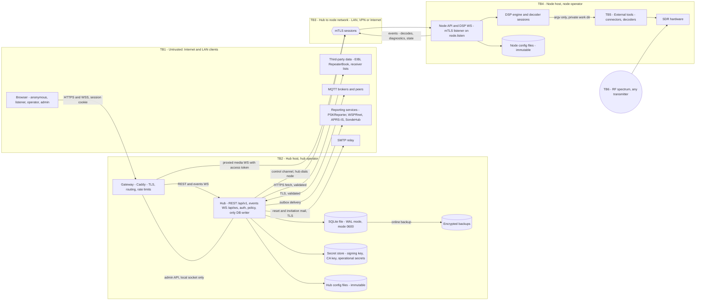

| Boundary | Crossing | Main threats | Key requirements |
|---|---|---|---|
| TB1 → gateway | All browser traffic | XSS, CSRF, session theft, credential stuffing, account enumeration, DoS, header spoofing | SR-01, SR-02, SR-05, SR-06, SR-13, SR-21, SR-28, SR-36, SR-40, SR-41 |
| Gateway → hub | REST, events WS, gateway admin API | Admin API exposure, header trust | SR-38, SR-40 |
| Gateway → node (TB3) | Proxied media WS | Open proxy and SSRF, unauthorised listening, token replay | SR-39, SR-43, SR-44 |
| Hub ↔ node (TB3) | Control channel and events | Impersonation, MitM, replay, forged events, version downgrade | SR-42, SR-46, SR-47, SR-48, SR-50 |
| Node → external tools (TB5) | Process spawn, IPC, files | Command and argument injection, shared temp paths | SR-51, SR-52, SR-53 |
| RF (TB6) → DB → browsers | Decoded content | Stored XSS at scale, parser crashes | SR-22, SR-55, SR-70 |
| Third parties and MQTT → hub | Fetched and federated data | XSS, data poisoning, MitM | SR-23, SR-33, SR-66 |
| Hub → SMTP relay | Reset and invitation e-mails | Token disclosure, link poisoning through the `Host` header | SR-07, SR-08, SR-09 |
| Hub → SQLite file and backups | All persistent state | SQL injection, file theft by local users, backup leaks | SR-60, SR-61, SR-62 |

Assumptions:

- The hub host is fully trusted. Protecting the SQLite file against the hub operator is out of scope.
- A node is trusted to operate its own hardware and to report what it decodes. It is **not** trusted to write arbitrary data, to speak for another node, or to read anything outside the streams of its own devices.
- Streams proxied through a node are visible to that node's operator. The privacy notice MUST say so.
- Physical access to hosts is out of scope.

#### Threat summary (STRIDE)

| Category | Threats | Requirements |
|---|---|---|
| Spoofing | Forged node to hub or hub to node; stolen enrollment token; forged access token; account takeover through password guessing, a leaked reset link or a reused invitation; spoofed client IP through the gateway | SR-03, SR-05, SR-07, SR-08, SR-40, SR-42, SR-44, SR-46 |
| Tampering | Forged node events (decodes, diagnostics, capabilities); gateway route injection through its admin API; SQL injection; direct edits of the SQLite file | SR-38, SR-47, SR-60, SR-61 |
| Repudiation | Unattributed retune, preset switch, bookmark change, invitation or setting change | SR-15, SR-69 |
| Information disclosure | Token in URLs or logs; account existence revealed by login or reset responses; copied SQLite file or backup; streams readable on the hub ↔ node path; PII retention | SR-06, SR-44, SR-61, SR-62, SR-63, SR-68 |
| Denial of service | Gateway bandwidth exhaustion, event floods from a node, login and reset floods, DB write storms | SR-05, SR-36, SR-41, SR-47 |
| Elevation of privilege | Token scope abuse (listener token used to retune a shared device), invitation granting a higher role, operator reaching admin APIs, CSRF on an admin's session | SR-02, SR-08, SR-16, SR-18, SR-43 |


### 10.2 Web sessions and authentication

| Req | Requirement | Verification |
|---|---|---|
| SR-01 | Browser sessions MUST be server-side records in `sessions`, keyed by a CSPRNG ID of at least 128 bits and stored hashed. The session cookie MUST be `HttpOnly`, `Secure`, `SameSite=Lax`, `Path=/` and use the `__Host-` prefix. A new session ID MUST be issued on login (the pre-login ID, if any, is discarded) and on any privilege change. Sessions MUST have an idle timeout and an absolute lifetime (`session.idle_timeout`, `session.absolute_timeout`), MUST be deleted by logout, and MUST all be revoked on password change, password reset, role removal or account disable. Sessions and access tokens MUST NOT depend on the login method, so that a future identity provider issues the same session type. | Integration tests for cookie attributes, ID rotation on login (session fixation test), logout, idle and absolute expiry, revocation on password change and reset; test that a revoked session can no longer obtain node access tokens. |
| SR-02 | Every state-changing request authenticated by cookie MUST carry a CSRF token (synchroniser or double-submit, bound to the session) **and** pass an `Origin` check against the configured public origin. This includes the login, logout, password reset, invitation acceptance and password change forms. Safe methods (GET, HEAD, OPTIONS) MUST NOT change state. JSON endpoints MUST require `Content-Type: application/json`. | Route inventory test: every non-safe route rejects a missing or wrong token, a wrong `Origin` and a `text/plain` body; every GET route is checked for side effects. |
| SR-03 | Local passwords MUST be hashed with **Argon2id**, with a per-user random salt and the parameters encoded in the stored hash string. The parameters are cfg keys (`auth.argon2.memory_kib`, `auth.argon2.iterations`, `auth.argon2.parallelism`) with defaults of at least 64 MiB memory, 3 iterations and parallelism 1, and the hub MUST refuse to start with values below a built-in floor (19 MiB, 2 iterations). A hash whose parameters are weaker than the current configuration MUST be re-hashed on the next successful login. Verification MUST be constant-time. No cleartext or reversible password format MAY be accepted or stored. | Unit tests for the hash format and parameter floor; test that a hash with old parameters is replaced after login; start-up test with parameters below the floor. |
| SR-04 | Passwords MUST be at least `auth.password_min_length` characters long (default 10, never below 8), accept at least 128 characters and any Unicode character, and MUST be checked against a bundled list of common and breached passwords (offline). Changing the password or the e-mail address MUST require the current password (recent re-authentication), and MUST notify the account's e-mail address. | Policy tests with short, common and long passwords; re-authentication and notification tests. |
| SR-05 | Login, password reset requests, reset submissions and invitation acceptance MUST be rate-limited **per client IP and per target account** (identifier as typed, normalised), with progressive delays and a temporary lock-out of the account for password login (default: 10 failures in 15 minutes lock password login for 15 minutes). A lock-out MUST NOT block a password reset, and MUST NOT reveal whether the account exists. Limits are `(db)` settings (`auth.login_rate_limit`) and are enforced by the hub, in addition to the gateway rate limits (SR-41). Failures and lock-outs MUST be audited (SR-69). | Throttling tests per IP and per account; lock-out and recovery test; test that throttling responses are identical for existing and unknown accounts. |
| SR-06 | Account flows MUST NOT reveal whether an account or e-mail address exists. Login MUST return one generic error for an unknown identifier, a wrong password and a disabled account, and MUST run a dummy Argon2id verification for unknown identifiers so that the response time does not differ. Password reset requests MUST always answer "If an account exists, an e-mail has been sent" with the same status code, body and timing (mail is sent asynchronously). Invitation acceptance MUST NOT reveal whether the invited e-mail already has an account. | Response-equality tests on each flow; timing test comparing known and unknown identifiers (difference within noise over many samples). |
| SR-07 | A password reset token MUST be generated with a CSPRNG (at least 128 bits), stored only as a hash, bound to one user, **single-use**, and expire after a short TTL (`password_reset.ttl_minutes`, default 30 minutes, maximum 24 h). Issuing a new token MUST invalidate earlier unused tokens of that user. A successful reset MUST consume the token, revoke every session of the user and be audited. The token MUST be delivered only in the e-mail link (never in an API response or a log), and the reset page MUST send `Referrer-Policy: no-referrer` and remove the token from the address bar after reading it. | Tests for token reuse, expiry, superseded tokens, session revocation after reset; log scan for token values; header test on the reset page. |
| SR-08 | Accounts are created by invitation only. An invitation token MUST be generated with a CSPRNG (at least 128 bits), stored only as a hash, **single-use**, expire (`invitations.ttl_hours`, default 7 days), carry the pre-set role, and be revocable by an admin. Only admins MAY create invitations. The role is taken from the stored invitation, never from the acceptance request. When the invitation is bound to an e-mail address, the account is created with that address and it is treated as verified. Creation, revocation and acceptance MUST be audited. A copyable invitation link MUST be shown only once, to the admin who created it. | Tests for reuse, expiry, revocation, role tampering in the acceptance request, non-admin creation attempts; audit entries present. |
| SR-09 | Outgoing e-mail (password reset, invitations, security notifications) MUST be sent through the SMTP relay configured in the hub config file (`smtp.*`, cfg) using TLS (implicit TLS or STARTTLS required, certificate validated). SMTP credentials are secrets (SR-59). Links in e-mails MUST be built from the configured public base URL (`hub.url`), never from the request `Host` header. E-mails MUST be plain text or escaped HTML and MUST NOT include the password or other secrets. | Test that a spoofed `Host` header does not change the link; test that a relay without TLS is refused; template escaping test. |
| SR-10 | Authentication MUST go through an auth-provider interface. Each login identity is a `user_identities` row (`user_id`, `provider`, `subject`, `created_at`); today only `provider = 'local'` exists. Password login MUST be accepted only for users with a local identity and a non-null `password_hash`. A future external provider MUST NOT link to an existing account except through an explicit, verified-e-mail linking flow specified at that time. MFA, API tokens and SSO are not offered in v1, and no route MAY accept a credential other than the session cookie and the access token. | Unit tests that password login fails for a user without a local identity; route inventory test that no other credential type is accepted. |
| SR-11 | The Product MUST NOT use any shared static secret to grant privileges (no magic key). Privileged actions MUST be granted by role and device flags only (P3). No credential, key or passphrase MAY ship with a default value. At first hub start, the bootstrap admin is created through a one-time setup token or CLI command, generated with a CSPRNG, shown once and consumed on use. | Code and default-config review; test that no request parameter, fragment or header named `key` changes authorisation; install test checking that no two installs share credentials. |
| SR-12 | Post-login and post-action redirects MUST accept only same-origin relative paths that match `^/(?![/\\])` and a known route, or a route name. Anything else MUST fall back to the home page. | Unit tests with `//host`, `/\host`, absolute URLs, encoded variants and `javascript:`. |
| SR-13 | The client IP MUST be derived only from forwarding headers set by a configured trusted proxy (the gateway is always one; others are listed in `gateway.trusted_proxies`), taking the right-most untrusted hop and validating it as an IP address. Network location MUST NOT, on its own, grant authentication or a role. The admin network restriction (`admin.allowed_networks`) MUST be applied on every admin request and admin WS topic, not only at login, and evaluated on the resolved client IP. | Integration tests with forged `X-Forwarded-For` and `Forwarded` headers from untrusted peers, behind 0, 1 and 2 proxies; test that an admin session used from a disallowed network is rejected on every admin route. |
| SR-14 | Every decision that depends on a network address MUST first canonicalise the address (IPv4-mapped IPv6 → IPv4, zone IDs removed) and MUST compare it against explicit, configured CIDR lists. Generic "is private" or "is local" classifications MUST NOT be used for any security decision. | Unit tests with `::ffff:a.b.c.d`, ULA, link-local, loopback and public addresses on dual-stack listeners; code review rule banning library "is private" calls in security paths. |


### 10.3 Authorisation

| Req | Requirement | Verification |
|---|---|---|
| SR-15 | The Product MUST implement the P3 roles (`anonymous`, `listener`, `operator`, `admin`) with one server-side policy table that maps every REST route, WS message and node command to the roles and device flags allowed. Every security-relevant action MUST be written to `audit_log` (SR-69). | Policy-table coverage test (no unmapped route or message); audit coverage test. |
| SR-16 | Shared-state actions (preset switch, centre-frequency change, device start) MUST be authorised against the policy table and the device flags declared in the node config file (`operator_can_retune`, `listen_policy`; both `(cfg)`), and MUST have per-device cooldowns. Hub-wide bookmarks MAY be created, changed or deleted only by operators and admins. The server-side mode allow-list is derived from the mode catalogue plus `node_capabilities`, with service-only modes excluded for interactive clients; only modes on that list MAY be started by a client. A preset applied to a device MUST be validated against that device's capabilities (frequency range, supported sample rates) and refused when incompatible. | Authorisation-matrix test generated from the policy table for every WS command and REST route × role × device flags; tests that service-only and hidden modes and incompatible presets are refused; bookmark write tests per role. |
| SR-17 | Every policy that limits users MUST be enforced server-side: listening time limits disconnect the session at the node and the hub; listen policy, mode permissions, recording on the server and bookmark validation are checked by the server. A control that the server cannot enforce (for example the user recording the audio they receive) MUST be presented as a convenience, not as a permission, and documented as such. | Authorisation-matrix tests (SR-16) including time limits; documentation review. |
| SR-18 | Every REST route MUST declare its required role and scope in the policy table (SR-15), and object-level access MUST be checked (a user can read and revoke only its own sessions, and change only its own account). The API MUST NOT enable cross-origin access (no permissive CORS). | Authorisation-matrix tests including object-level (IDOR) cases; CORS header test. |
| SR-19 | Subscriptions on `/api/ws` MUST be filtered server-side by role and visibility settings (for example decodes from devices the user may not listen to, admin-only diagnostics details, the connected-listeners view). The client MUST NOT be able to subscribe to a topic it cannot read through REST. | Tests subscribing to restricted topics with each role. |
| SR-20 | Every client message (REST and WS) MUST be validated against a schema with types, ranges and enumerations, and unknown fields MUST be rejected. Frequencies, offsets, passband edges and rates MUST be checked against the current device capabilities, the applied preset and the mode's allowed passband. Non-finite numbers and wrong types MUST be rejected. | Schema-based fuzzing of every message type; tests with `NaN`, `Infinity`, booleans, huge and negative values. |


### 10.4 Browser and content safety

| Req | Requirement | Verification |
|---|---|---|
| SR-21 | Every server-rendered or client-rendered view MUST escape by default. Client IPs, user agents and display names MUST be stored as typed values (IP as an address type) and rendered as text. | Automated test that injects HTML and attribute-breaking payloads into display name, user agent and forwarded IP and checks that the admin Connections and Users pages render them inert. |
| SR-22 | All decoded data MUST be treated as untrusted on every path (node → hub → DB → REST/WS → browser). The UI MUST render it with text-only APIs or an auto-escaping view layer. Links built from decoded values MUST pass a URL-scheme allow-list (`https:`, and `http:` only if the admin allows it) and MUST URL-encode substituted IDs. A strict CSP (SR-27) MUST be in force so that a missed sink cannot execute script. | Per-decoder fuzz corpus containing HTML, attribute, URL and control-character payloads, replayed through the node event path into the UI, with an end-to-end browser test asserting no script execution and no CSP violation; static analysis rule banning raw-HTML sinks. |
| SR-23 | Data from EIBi, RepeaterBook, receiver directories and similar sources MUST be fetched over HTTPS with certificate validation, validated against a schema (types, lengths, URL schemes) and normalised before it is stored in `web_caches`, `bookmarks` or `map_features`. Invalid records MUST be dropped and counted. | Schema-validation unit tests with malicious records; check that no fetch URL in the code or defaults uses `http:`; UI test with poisoned cache rows. |
| SR-24 | Messages pushed to clients (system and log messages, toasts, error and diagnostic texts) MUST be typed as plain text (with an optional message ID and parameters for translation) and rendered as text. No channel to the browser MAY carry server-authored HTML. | Test that a message with markup is displayed literally; protocol schema review. |
| SR-25 | Device, node and tool log lines shown in the UI MUST be rendered as text. Logs coming from nodes MUST be length-capped and stripped of terminal control sequences. | UI test with markup and ANSI sequences in log lines. |
| SR-26 | Display names MUST be length-limited, normalised (Unicode NFKC) and checked for confusable impersonation of staff names; operators and admins get a visible role badge that users cannot copy. | Tests for name normalisation and confusable names. |
| SR-27 | The UI MUST be served with a CSP that at least sets `default-src 'self'`, `script-src 'self'` (no `unsafe-inline`, no `unsafe-eval`), `object-src 'none'`, `base-uri 'none'`, `form-action 'self'`, `img-src 'self'` plus the configured tile origins, `connect-src 'self'` (WS to the same origin), and `frame-ancestors` per SR-28. Any asset that is nevertheless loaded from another origin MUST use Subresource Integrity. CSP violation reports SHOULD be collected by the hub with rate limiting. | Header test; end-to-end tests run with CSP enforced and fail on any violation. |
| SR-28 | The gateway or hub MUST send on every response: CSP (SR-27), `Strict-Transport-Security` (when HTTPS), `X-Content-Type-Options: nosniff`, `Referrer-Policy: strict-origin-when-cross-origin` or stricter (`no-referrer` on the reset and invitation pages), `frame-ancestors 'none'` for the admin area and the account pages and `'self'` elsewhere unless embedding is enabled, `Cache-Control: no-store` on authenticated and account pages, and a restrictive `Permissions-Policy`. | Automated header check on a sample of every route class. |
| SR-29 | All front-end code MUST be built from a locked dependency manifest and served from the Product's own origin. The UI MUST NOT load scripts or styles from third-party origins at runtime. Map tiles are images and MAY come from configured tile origins listed in the CSP. Unpinned or mutable remote assets MUST NOT be used. There is no runtime plugin loading in v1. | CSP report-only monitoring in CI end-to-end tests; build check that the bundle references no external script origin. |
| SR-30 | Files from `file_blobs` MUST be served with a content type taken from the stored, validated type (never sniffed from the request), `X-Content-Type-Options: nosniff`, and `Content-Disposition: attachment` for any type that a browser could render as active content. Images and audio MAY be served inline. Uploaded images (site avatar and photos) MUST be validated by magic bytes, re-encoded or stripped of metadata, and size-limited. Files from decoders MUST have size and count quotas per device and per day. | Tests uploading polyglot files and HTML disguised as images; header checks on file responses; quota tests. |
| SR-31 | Files and uploads MUST be addressed only by server-generated IDs (`files`, `file_blobs`). No request parameter MAY be concatenated into a filesystem path on the hub or on a node. | Static analysis for path joins with request data; tests with traversal payloads on every file route. |
| SR-32 | Each public information surface (status endpoint, metrics, capability report, Map, Decodes, Files, receiver location) MUST have its own visibility setting with a privacy-preserving default (metrics and capability details: admin only; receiver location: coarse, for example a 4-character locator). Secrets MUST NOT be sent to browsers. Tile or map API keys MAY be sent only if inherently public and restricted by referrer at the provider; otherwise the hub MUST proxy the requests. The admin's e-mail address MUST NOT appear in outbound user agents or public endpoints. | Anonymous crawl of all routes with default settings, checking against an allow-list of exposed fields; review of outbound request headers. |


### 10.5 Transport, gateway and WebSockets

| Req | Requirement | Verification |
|---|---|---|
| SR-33 | The gateway MUST serve HTTPS by default (automatic certificates where possible, otherwise an operator-provided or self-signed bootstrap certificate) and redirect HTTP to HTTPS. Outbound HTTP requests MUST use HTTPS with certificate validation, connect and read timeouts, and response size caps. Outbound protocols that are plain text by design (for example APRS-IS on its plain port) MUST be documented and SHOULD use their TLS variant where the service offers one. MQTT MUST default to TLS. | Default-config test (HTTPS on, HTTP redirects); review of outbound clients for timeouts and size caps; test that plain-HTTP upstreams are refused. |
| SR-34 | The gateway MUST support TLS 1.2 and 1.3 only, with modern cipher suites, OCSP stapling where available and certificate renewal without downtime. HSTS MUST be enabled once HTTPS is configured. | TLS scanner in CI against a test deployment. |
| SR-35 | TLS MUST be terminated by the gateway (Caddy) or by a TLS stack that performs handshakes concurrently with timeouts. The same applies to the node's mTLS listener. A stalled handshake MUST NOT delay other connections. | Test with stalled TLS clients while measuring new-connection latency on the gateway and on a node. |
| SR-36 | The hub events WS (`/api/ws`) and the node media WS (`/nodes/{nodeId}/ws`) MUST: use a maintained, RFC 6455-compliant implementation; check `Origin` against the configured public origin; require the `rx.v1` subprotocol; authenticate within a short handshake window (default 5 s) or close; and enforce a maximum message size, a message rate per connection and send-queue limits with a defined overflow policy. | Conformance test suite (for example Autobahn); tests for cross-origin rejection, oversize frames, message floods and idle pre-auth sockets on each socket type. |
| SR-37 | The gateway and the hub MUST enforce request body size limits per route class, MUST check authentication and authorisation before reading a body (other than the login, reset and invitation forms, which have their own small limits), and MUST apply read and header timeouts. Missing or malformed fields MUST produce a 4xx response, never an unhandled exception. | Tests with oversize bodies, slow bodies (slowloris) and malformed JSON on every route class. |
| SR-38 | The gateway's admin API (Caddy admin endpoint, `:2019` by default) MUST NOT be reachable from any network: it MUST listen on a Unix socket or loopback only, and SHOULD require an origin check or credential. Only the hub MAY change the gateway configuration. When the gateway runs as a sidecar, the hub MUST push the full configuration idempotently at start-up and after each node enrollment or removal, and MUST verify the applied configuration. The gateway configuration MUST NOT be built by string concatenation of untrusted values. | Port scan of the hub host; test that a config push from another local user fails; review of config generation. |
| SR-39 | The gateway MUST proxy `/nodes/{nodeId}/ws` only for `nodeId` values present in the node registry with an enrolled, non-revoked identity. Upstream addresses MUST come from the registry, never from the request. The gateway MUST NOT act as an open or forward proxy. Unknown node IDs MUST get 404. | Tests with unknown, revoked and malformed node IDs; test that no request field can change the upstream. |
| SR-40 | The gateway MUST remove client-supplied `Forwarded`, `X-Forwarded-*`, `X-Real-IP` and any internal auth headers before proxying, and MUST set its own. Internal headers that carry identity to the hub or a node (for example an injected access token) MUST only be accepted by the hub and nodes from the gateway's identity. | Tests sending spoofed forwarding and internal headers through the gateway. |
| SR-41 | The gateway MUST enforce request rate limits per client IP on the authentication routes (login, password reset, invitation acceptance), on WS upgrades and on the API, WS idle and handshake timeouts, and a per-connection bandwidth cap on proxied media streams sized to the maximum legitimate stream. Limits are `gateway.*` config. They protect availability; they are not listener quotas. | Load tests exceeding each limit; check of 429 responses and closed sockets. |


### 10.6 Grid: hub and nodes

| Req | Requirement | Verification |
|---|---|---|
| SR-42 | A node MUST expose its API and media WS only over mTLS on `node.listen`. It MUST accept only client certificates issued by the hub CA for the hub identity (gateway and hub control client), and MUST refuse plain TCP and other clients. A node MUST NOT expose any unauthenticated endpoint, including health and metrics. | Connection tests with no certificate, a self-signed certificate, another node's certificate and a revoked certificate. |
| SR-43 | For every media WS, the node MUST verify the access token offline: Ed25519 signature against the hub's current published keys, `exp`/`nbf` with at most 60 s clock skew, audience equal to its `node.id`, device scope covering the requested device, and the action scopes (listen, retune shared state). The node MUST re-check scopes for each privileged command, MUST require a refreshed token before the old one expires on long-lived sockets (closing the socket otherwise), and MUST apply hub-pushed revocations (session revoked, account disabled, role removed) within 5 s. | Tests with expired, future, wrong-audience, wrong-device, wrong-scope and wrongly signed tokens; revocation latency test. |
| SR-44 | Access tokens MUST be short-lived (TTL ≈ 5 min, max 10 min), carry a key ID, user ID, roles, device scopes and a unique token ID, and be signed with Ed25519. Tokens MUST NOT appear in URLs, query strings, logs or browser storage. The gateway obtains the token from the hub through forward auth at WS upgrade and injects it as a request header to the node (`X-Rx-Access-Token`), after deleting any client-supplied copy (SR-40). Refreshes travel in-band on the established socket. | Log scan for token patterns; browser storage inspection; tests that a token in the query string is refused. |
| SR-45 | The token-signing key and the CA key MUST be separate keys, stored with mode 0600 (or in a hardware or OS key store) and never in the DB or in logs. The signing key MUST be rotatable without downtime: the hub publishes the current and next public keys to nodes, signs with the current one, and retires the old one after the maximum token TTL. CA compromise recovery (re-issue all node certificates) MUST be documented and scripted. | Key rotation drill in CI (rotate while streams are open, no disconnection); file permission checks. |
| SR-46 | Enrollment MUST use a one-time enrollment token generated by an admin, bound to the intended `node.id`, valid for a short time (default 24 h), stored only as a hash, and consumed on first use. The node MUST generate its key pair locally and send only a certificate signing request. The hub MUST record the issued certificate, MUST support revocation (which closes all connections to that node and removes it from gateway routing), and SHOULD rotate node certificates automatically before expiry (default lifetime 90 days). The node MUST pin the hub CA obtained during enrollment (fingerprint shown to the admin for out-of-band confirmation). | Tests for token reuse, expired token, token used for another node ID, revocation effect on routing and channels, automatic rotation. |
| SR-47 | The hub MUST validate every node event against the `rx.v1` node-event schema and MUST accept events only for devices registered to that node. A node MUST NOT be able to write to the DB directly or to name another node's resources. The hub MUST rate-limit and size-limit node events per node and per type, with back-pressure and drop accounting, so that a compromised or broken node cannot exhaust the DB or the events WS. Control messages MUST carry sequence numbers or IDs so that replays within a connection are detected. | Tests with events for foreign devices, malformed events, event floods and replayed messages; check that drop counters and diagnostics are raised. |
| SR-48 | The hub MUST dial only node addresses registered by an admin, MUST NOT follow redirects, and MUST complete mTLS with the expected node identity before sending anything. Admin-entered node addresses MUST be validated, and the hub SHOULD support an egress allow-list (`gateway.*` / `tls.*` config) so that a registered address cannot be used to probe internal services. | Tests registering addresses that point at internal non-node services; certificate-identity mismatch test. |
| SR-49 | Hub and nodes MUST run with synchronised clocks (NTP or equivalent). A node MUST report its clock offset to the hub, and the hub MUST mark a node `degraded` and alert admins when the offset exceeds 2 s, because token validation (SR-43) and timestamped audit and decode data depend on it. | Test with an artificially skewed node: degraded status and alert, token validation still within the allowed skew. |
| SR-50 | The hub and nodes MUST negotiate the protocol version at connection time (`rx.v1` and successors) and MUST refuse versions outside their supported window. A peer MUST NOT fall back to an older, weaker protocol or to a non-mTLS channel. The browser WS MUST require the `rx.v1` subprotocol. | Tests with unsupported versions and downgrade attempts. |


### 10.7 Node execution environment

| Req | Requirement | Verification |
|---|---|---|
| SR-51 | The Product MUST NOT invoke a shell to run external programs. Commands MUST be built as argument vectors from typed, validated parameters, and pipelines MUST be connected by the Product, not by a shell. Parameter validators MUST reject control characters and option-like values where the tool would treat them as options. | Static analysis rule banning shell execution; integration tests feeding shell metacharacters and leading dashes into every device parameter. |
| SR-52 | IPC with external tools MUST use channels that only the node process can reach (Unix sockets with mode 0600 in a private runtime directory, or loopback with a per-process token), and MUST encode values so that a value cannot inject protocol commands (reject or escape newlines and separators). | Tests with newline payloads in control values; test that another local user cannot connect to the IPC endpoints. |
| SR-53 | Every runtime, work and socket path MUST live under a directory owned by the service account with mode 0700, unique per instance. The node MUST use a private working directory per decoder instance where tools write files. Fixed paths in world-writable directories MUST NOT be used. | Review of all paths used by nodes and external tool adapters; test running two node instances and two decoders of the same mode on one host without interference. |
| SR-54 | Where a filesystem is used (node work directories, temporary decoder output before upload to the hub), names MUST be generated by the Product, validated with full-string matches, opened with exclusive-create and no-follow semantics, and checked for containment in the expected directory after resolution. | Unit tests with symlinks, pre-created files and names with separators. |
| SR-55 | No native-object deserialisation format MAY be used on any data path (DSP stages, node ↔ hub, IPC with tools). Internal messages MUST use a typed, length-delimited framing with an explicit message-type field and schema validation at each trust boundary. | Static analysis for native deserialisation calls; protocol schema tests; fuzzing of each decoder output parser. |
| SR-56 | Official packages and container images MUST run as an unprivileged account with least privilege: no new privileges, read-only system directories, private temp, explicit state and runtime directories, device access limited to the needed SDR devices, and resource limits (memory, tasks). Container images MUST run as non-root with a read-only root filesystem where possible. | Packaging review checklist in CI (unit file lint, image scan for root user). |


### 10.8 Data, secrets and privacy

| Req | Requirement | Verification |
|---|---|---|
| SR-57 | Configuration MUST be data only (a declarative format validated against a schema). No configuration file MAY be executed. | Review: no interpreter call on config input; schema validation tests with invalid files. |
| SR-58 | Operational secrets MUST be stored either in config files with restrictive permissions (SR-59) or in the DB encrypted with a key held outside the DB. Writes MUST be atomic. Secret fields MUST be write-only in the UI and the API: values are never returned, only "set / not set". Secrets MUST NOT be written to temporary files readable by other users (for example external tool config files MUST be created 0600 in a private directory). | API test that no endpoint returns a secret value; DB inspection that secret columns are ciphertext; file permission checks on generated tool configs. |
| SR-59 | Config files that contain secrets (including `smtp.*` credentials) MUST be readable only by the service account. The hub and node MUST refuse to start (or MUST start with secret-bearing features disabled and a clear error) when a secret-bearing config file is group- or world-readable. Config files MAY reference secrets indirectly (file path or environment variable) instead of holding them. Locked settings (P4) that are secrets MUST show only "set by configuration" in the UI. Secrets MUST be redacted from logs, diagnostics, crash reports and the settings provenance view. | Start-up test with permissive file modes; log scan for known secret values in integration tests. |
| SR-60 | All DB access MUST go through the repository interfaces and the per-dialect adapter. All queries MUST be parameterised; SQL MUST NOT be built by concatenating values. Schema migrations MUST run as an explicit, versioned step per dialect, never implicitly from request handling. Only the hub process MAY open the database for writing. When the future PostgreSQL adapter is used, the hub MUST connect with a dedicated account limited to the Product's schema (no superuser), over TLS when the DB is not on the same host, and the `db.dsn` secret follows SR-59. | Static analysis for string-built SQL; adapter contract tests; review of migration entry points. |
| SR-61 | The SQLite database file and its `-wal` and `-shm` companion files MUST live in the hub state directory, owned by the service account, with mode 0600 for the files and 0700 for the directory, outside any directory served over HTTP. The hub MUST refuse to start when the DB file or its directory is group- or world-accessible or owned by another account. The hub MUST open the DB in WAL mode with foreign keys enforced and a busy timeout, and MUST NOT place it on a network filesystem (detected where possible and documented). Integrity checks (`PRAGMA quick_check` or equivalent) MUST run at start-up and on a schedule, with a failure raised to the admin. | Start-up tests with permissive modes and a foreign owner; check of journal mode and foreign keys at runtime; integrity-failure test with a corrupted copy. |
| SR-62 | The Product MUST provide a backup command (`<product> db backup`) and a scheduled backup option that produce a consistent copy through the SQLite online backup mechanism (never a plain file copy of a live WAL database). Backups MUST be written with mode 0600, SHOULD be encrypted with an operator-provided key or recipient, MUST follow the retention cycle of the data they contain (SR-64), and MUST be restorable with `<product> db restore`, which verifies integrity and schema version before replacing the live DB. Backups MUST NOT be downloadable through the web UI. | Backup under concurrent write load followed by restore and integrity check; file mode check; test that no route serves backup files. |
| SR-63 | The Product MUST collect only data needed for a stated purpose: e-mail only for accounts, IP addresses only for abuse control and the admin view of connected listeners. IP addresses in `connections`, `audit_log` and logs MUST be truncated or keyed-hashed after a configurable period (default 7 days). Anonymous visitors MUST NOT get a persistent identifier beyond the session. Only strictly necessary cookies MAY be set without consent. A privacy notice page MUST be available and MUST state what is stored, for how long, and that node operators can see streams passing through their node. | Data inventory review; DB inspection after the retention period; cookie audit. |
| SR-64 | Every DB table with personal or decoded data MUST have a retention policy (`(db)` setting with a default) enforced by a scheduled job, including in backups within their own cycle. Users MUST be able to export their account data (machine-readable) and ask for deletion. Deletion MUST remove or anonymise personal data in `users`, `user_identities`, `sessions`, `invitations` and `connections`, while keeping `audit_log` entries with a pseudonymised actor where the audit purpose requires it. | Retention job tests; export content test; deletion test checking all tables. |
| SR-65 | Client IPs and connection events MUST NOT be published to reporting or MQTT unless the admin opts in. When published, IPs MUST be truncated or keyed-hashed. Retention rules (SR-64) apply to `connections` and `audit_log`. Links to external geo-IP services MUST be opt-in. | Default-config test that the outbox carries no client data; review of published payloads. |
| SR-66 | Federated input (MQTT subscriptions, peer instances) MUST be validated against a schema, rate-limited per source, attributed to its source and treated as untrusted content everywhere (SR-22). Broker connections MUST use TLS and authentication by default. | Fuzz tests on MQTT ingestion; test that invalid messages are dropped and counted without crashing. |
| SR-67 | If receiver-directory verification is offered, its endpoint MUST be rate-limited, MUST bind the signed response to a timestamp and the requesting directory's challenge format, MUST reject malformed headers with 4xx, and the verification secret MUST be stored as a secret (SR-58). | Tests for malformed headers, rate limit and replay of an old response. |
| SR-68 | Logs MUST be structured, MUST NOT contain secrets, passwords, session IDs, access tokens, reset or invitation tokens, enrollment tokens or full message payloads containing personal data, and MUST apply the IP handling of SR-63. Log injection MUST be prevented by encoding control characters in logged values. Nodes MUST forward security-relevant events (failed token checks, mTLS failures) to the hub. | Log scan in integration tests for token and secret patterns; injection test with newline payloads. |
| SR-69 | `audit_log` MUST be append-only for the Product (no update or delete path except retention), and SHOULD be tamper-evident (for example a hash chain over entries). It MUST record at least: logins, failed logins and lock-outs, password changes, reset requests and completed resets, invitation creation, revocation and acceptance, role changes, account disable and deletion, setting changes (with before/after values, secrets redacted), preset switches and centre-frequency changes on shared devices, bookmark changes, node enrollment, revocation and certificate rotation, signing-key rotation, backups and restores, file deletion and data exports. Each entry records actor, role, time, source IP (per SR-63), target and outcome. | Audit coverage test that performs each action and checks for its entry; chain verification test. |


### 10.9 Assurance and migration

| Req | Requirement | Verification |
|---|---|---|
| SR-70 | Errors MUST be handled at each boundary and returned as generic 4xx/5xx responses (problem details) without stack traces; unknown IDs MUST return 404. Code MUST pass static analysis and type checks in CI, and parsers at trust boundaries MUST be fuzzed. | CI gates: static analysis, type checks, fuzzing jobs; error-response tests on every route. |
| SR-71 | Builds MUST use locked dependency manifests and pinned container base images, produce an SBOM, run dependency and image vulnerability scanning in CI, and publish signed release artefacts and images. External tools that nodes run (decoders, connectors) MUST be pinned to known versions in official images, with checksums verified at build time. | CI pipeline review; signature verification step in the install docs; SBOM present in each release. |
| SR-72 | The one-shot migration tool from OpenWebRX+ installations MUST parse `settings.json`, `users.json` and `bookmarks.json` as data, MUST NOT execute `config_webrx.py` (it MAY extract literal assignments with a non-executing parser or tell the admin to transcribe them), MUST import OpenWebRX+ password hashes only to be verified once and re-hashed with Argon2id on the next successful login (SR-03), MUST flag every imported account as needing role review, and MUST NOT import the magic key or session data. | Import test with crafted OpenWebRX+ files containing code and markup; test that an imported hash is replaced after login. |
| SR-73 | CI MUST run: the authorisation-matrix tests, escaping and CSP end-to-end tests, the account-flow tests (enumeration, throttling, token reuse and expiry, CSRF), schema fuzzing of all WS and REST inputs and of node events, parser fuzzing for each decoder adapter, static analysis, and dependency scanning. A third-party penetration test of the hub, gateway and node API SHOULD be done before the first public release, and a security contact and disclosure policy MUST be published. | CI configuration review; published `SECURITY` policy; pentest report tracked to closure. |


---

## 11. Risks and milestone sequencing

This section lists the main risks of the target design (P2…P6) and how to reduce them. Likelihood and impact use **High / Medium / Low**. Figures are planning estimates to be confirmed by the benchmarks named in the mitigations.

### 11.1 Risk register

| ID | Risk | Impact | Likelihood | Mitigation |
|---|---|---|---|---|
| RK-01 | **WebSocket proxy latency through the gateway.** Every FFT and audio frame goes browser ↔ gateway ↔ node (P2). Proxy buffering, TLS on both legs and a long hub ↔ node path add latency that users feel when tuning CW and SSB. | High: sluggish tuning and audio lag are the first thing listeners notice. | Medium | Configure the gateway for streaming (immediate flush, no response buffering, `TCP_NODELAY`, WS compression off for binary media). Set a latency budget: the gateway adds < 5 ms at p95 on the same host, and tune-to-audio stays within the UI budget (< 250 ms on LAN). Measure end to end in CI with a synthetic node. Keep frames small and timestamped (protocol spec) so that the client can measure and display latency. Recommend co-locating the hub/gateway with the largest node or on a well-connected host. |
| RK-02 | **Gateway and hub bandwidth load.** All media leaves through the gateway, and enters it from the nodes. One listener uses roughly 200–700 kbit/s (FFT plus audio, more with HD audio and the secondary FFT). 100 listeners mean about 20–70 Mbit/s out of the hub plus the same from nodes into the hub. | High: the hub's uplink becomes the cap for the whole grid, and one busy node can starve the others. | High for public multi-node sites, Low for single-host installs | Per-connection bandwidth cap and fair queuing at the gateway (SR-41). Publish a capacity-planning table (listeners × FFT size × fps × audio rate). Keep the shared FFT computed once per device on the node, and send the secondary FFT only on subscription. Let admins lower FFT fps or size per preset (preset data, P4). Record "direct node exposure" as a possible later option (it would require a P2 change). |
| RK-03 | **Hub is a single point of failure.** The hub issues tokens, proxies all streams, owns the DB and dials the nodes. If it stops, every listener on every node disconnects. If the gateway is embedded in the hub process, a hub restart or upgrade also drops every stream. | High | Medium | v1: make restarts cheap: graceful drain, fast start, clients reconnect with back-off and restore their state from the URL and the browser's non-authoritative local storage (per-session runtime state, never synced to the account). With a sidecar gateway, hub restarts do not drop already-proxied streams; tokens are refreshed when the hub is back (nodes accept tokens until expiry, SR-43). Hub HA (two instances active/passive, a shared DB, a shared signing key set and CA, the gateway configuration rebuilt from the DB on take-over) is possible only with the future PostgreSQL adapter (RK-20) and is documented as future work, not built in v1. Design the hub to be stateless apart from the DB and in-flight streams (P4) so that HA stays possible. |
| RK-04 | **Hub ↔ node reachability: the hub dials the nodes (P1).** A node behind NAT, CGNAT, a mobile link or a firewall is unreachable unless the operator forwards a port or sets up a VPN. Many hobby receivers sit on home connections. | High: volunteers lending a receiver may not be able to join. | High | Document the supported set-ups: same LAN, a site-to-site VPN or overlay network (WireGuard-style mesh), or a port-forward with mTLS. Ship a connectivity self-test in the node CLI (`<product> node check --hub …`) and show the reachability state and the failure reason in Admin › Nodes. Make the node port configurable (`node.listen`) and IPv6-capable. Track "node-initiated reverse tunnel" as a candidate for a later version. It would change P1 and the security model (SR-42, SR-48), so it needs a separate decision. |
| RK-05 | **DB write load from decodes, map updates and connection heartbeats.** Rough peaks per busy site: FT8/FT4 on several bands ≈ 30 decodes/s in bursts at slot ends; ADS-B ≈ 100–300 position updates/s near an airport; AIS and APRS tens per second; connection heartbeats ≈ connections / 30 s. The hub is the only writer (P1). | High: write amplification and storage growth slow the REST API and the live views. | High for sites running ADS-B or many WSJT bands | Batch inserts (flush every ≤ 1 s or every N rows) in one transaction per batch. Coalesce position streams: upsert the latest state per entity in `map_features` and keep a down-sampled track (for example one point per 30 s or per 1 km). Retention jobs delete old rows of `decoded_messages`, `decoder_diagnostics`, `connections` and `audit_log` in small time-bounded batches, indexed on the timestamp, so that a purge never holds the writer for long. Heartbeats update a timestamp column only, coalesced per batch, and presence expiry is a query condition, not a row deletion per tick. Index only what the UI filters on. Load-test with a recorded busy-site event trace before each release. See RK-20 for the SQLite-specific limits. |
| RK-06 | **"No RAM" state (P4) versus real-time behaviour.** Making the DB the only home of non-stream state means presence, map state and diagnostics must be written before or while they are pushed. A DB round-trip on every event adds latency, and reading back from the DB for fan-out does not scale. | Medium | High | Treat the DB as the system of record and the hub event bus as the delivery path: persist in batches (RK-05) and publish to `/api/ws` subscribers from the same in-flight batch, so that live views do not wait on DB reads. Initial views (map, decodes, connected listeners) load from the DB through REST. Define per-type durability: accounts, sessions, invitations, bookmarks, audit and settings are committed before acknowledgement; decodes, positions, presence and diagnostics are at-least-once with batching (loss window ≤ 1 s on a hub crash, documented). In-flight batches and caches of DB data are permitted as transient buffers and MUST be rebuildable from the DB. Write this boundary explicitly in the runtime spec to avoid hidden RAM state creeping back. |
| RK-07 | **Clock synchronisation across hub and nodes.** WSJT, JS8, FST4 and WSPR need slot alignment within about 1 s on the node. Access tokens (TTL ≈ 5 min, skew ≤ 60 s) need hub and node clocks to agree. Decode and audit timestamps are compared across nodes. | High for digital-mode decoding; Medium for tokens | Medium (hobby hosts and single-board computers often run without good NTP, some without an RTC) | NTP is a documented hard requirement for nodes and the hub. Nodes report their clock offset; the hub marks a node `degraded` above 2 s and shows it in diagnostics (SR-49). WSJT-family decoders report `TIMEOUT` or `SIGNAL_NO_SYNC` with the hint "check clock" when the measured DT is consistently large (P5). Store both the node event time and the hub receive time on decodes. |
| RK-08 | **Gateway embedding is native only in Go.** Caddy can be embedded as a library only if the hub is written in Go. Any other hub language needs a sidecar driven through Caddy's admin API (P2). | Medium: extra process, extra failure mode, configuration drift. | Certain if the hub is not in Go | Specify the gateway contract independently of the embedding: routes, limits, header rules and dynamic upstreams. The hub owns the full gateway configuration and pushes it idempotently at start-up and on node enrollment or removal only, then verifies it (SR-38, RK-19). The admin API listens on a Unix socket or loopback only. Pin and test the Caddy version shipped in packages. Supervise the sidecar (restart, health check) and surface its state in Admin › Overview. A sidecar has one upside: it survives hub restarts (RK-03). |
| RK-09 | **Licensing: GPL/AGPL dependencies and AMBE.** Several DSP and decoder dependencies are GPL-licensed (csdr partly BSD-3, FFTW GPLv2+). Linking them in-process forces a GPL-compatible licence. AGPL requires offering the source to network users. AMBE vocoders are patent- and licence-encumbered. | High: legal exposure and redistribution limits. | Medium | Decide the Product licence before the first line of DSP code. If permissive, keep GPL components behind process boundaries and do not link them, or clean-room the DSP. If AGPL, show a "Source code" link in the UI (UI specification › App shell). Never ship AMBE: keep the codecserver-style boundary with operator-supplied hardware or software. Run licence scanning in CI (SR-71) and keep a third-party notices page. |
| RK-10 | **External tool drift.** About 40 external programs (connectors, decoders, converters) each have their own CLI, version quirks and output format. Upstream changes break parsers silently. Several are single-maintainer forks. | High: decoders stop decoding with no error. | High over a multi-year life | One adapter per tool with a declared capability probe that records the tool version in `node_capabilities`. Contract tests against pinned versions using recorded input samples. Official images pin tool versions with checksums (SR-71). Decoder diagnostics (P5) catch silent failures in production: a decoder in `SIGNAL_NO_SYNC` or `SYNC_NO_DECODE` for a long time on a known-good signal raises an admin alert. Budget maintenance time per release for tool upgrades. |
| RK-11 | **Multi-node version skew.** Hub and nodes are upgraded at different times, sometimes by different people (node operators). Protocol, capability and event-schema changes can break a grid partially. | Medium | High once more than one node exists | Version the hub ↔ node protocol and node-event schema (`rx.v1`, SR-50). The hub supports nodes from the current and previous minor version. Node and hub exchange versions at connect, and the hub refuses an unsupported node with a clear reason shown in Admin › Nodes. Upgrade order: hub first, then nodes. New capabilities are additive and feature-flagged by `node_capabilities`. Run a compatibility test matrix (hub N with nodes N and N−1) in CI. |
| RK-12 | **Migration tool from OpenWebRX+ installations.** Operators moving from OpenWebRX+ have `settings.json`, `users.json`, `bookmarks.json` and often an executable `config_webrx.py`. Some of their settings have no equivalent in the Product, device settings move to node config files, and third-party clients built on the OpenWebRX+ protocol do not work with `rx.v1`. | High: adoption depends on a painless move. | High | Provide the one-shot migration tool (M5, SR-72) with a dry-run report: what was imported, what goes to which config file, what needs a manual decision (roles for imported accounts, settings with no equivalent). Imported password hashes are verified once and re-hashed with Argon2id on the next login. Keep the `#freq=…,mod=…` deep-link format working (UI specification › Receiver URL). Publish a migration guide. Document the `rx.v1` protocol publicly so that third-party client authors can port their apps. |
| RK-13 | **UI scope.** The Product covers hundreds of features, including more than a dozen decoder message views, metadata blocks, a map and a large admin area. A UI that hand-codes each view will be late. | High | High | Drive decoder views from server-sent field descriptors (UI specification › Decodes page) so that one table, console, image-strip and "Now playing" component serves all families. Use one map engine. Deliver the UI with the milestones (below). Keep design tokens and a component library from the start so that accessibility (WCAG 2.1 AA) is built in, not retrofitted. Usability-test the receiver page on mobile with real listeners before freezing it. |
| RK-14 | **Per-listener DSP cost on nodes.** Each listener runs its own demodulation chain at the device rate. Hobby nodes (single-board computers) saturate quickly, and the gateway can deliver more listeners than a node can serve. There is no client limit or admission control in the Product (KISS), so an overloaded node degrades for everyone on it. | High | High | Native DSP with a bounded worker pool, not a thread per module. Share decoders where the output is the same for everyone (ADS-B, background services) and compute the shared FFT once per device. Node CPU and load are reported to the hub and shown in the picker as a busy indicator, so that listeners can choose another device. Publish per-hardware capacity figures (listeners per core at given device rates) so that admins size nodes. Keep `listen_policy` = `registered` as the documented lever for a site that attracts more listeners than its nodes can serve. |
| RK-15 | **Browser audio and mobile platform limits.** Autoplay rules, background-tab throttling, iOS audio-session behaviour and screen locks stop or glitch audio on mobile. | Medium | High | User-gesture start, audio worklet only, wake-lock toggle and background-audio handling (UI specification › Mobile patterns). Test matrix on real iOS and Android devices per release. Show the audio state clearly when the platform suspends it. |
| RK-16 | **Privacy and legal exposure of stored decodes.** P4 puts decoded messages (pagers, ACARS, Meshtastic text) in the DB with retention. In several jurisdictions, storing or publishing intercepted non-amateur traffic is restricted. | High | Medium | Per-mode "store decodes" and "publish decodes" settings with conservative defaults for non-amateur services (pagers, aviation data, Meshtastic text). Short default retention. Role-gated Decodes and Files visibility (SR-32). Privacy notice and data subject rights (SR-63, SR-64). Legal note in the operator documentation. |
| RK-17 | **Accounts add attack surface.** Form login, password reset by e-mail and invitations bring password guessing, credential stuffing, reset-link abuse and personal data (e-mail addresses). A misconfigured SMTP relay breaks resets and invitations. | Medium | Medium | Invitation-only accounts, no self-registration. Argon2id, rate limiting and lock-out, enumeration-resistant responses, single-use short-lived reset and invitation tokens, CSRF and session rotation (SR-01…SR-09). Audit of every account event (SR-69). An SMTP test button in Admin and a CLI fallback (`<product> user reset-password`) when mail is not configured. MFA is out of scope for v1; keep the auth-provider interface (SR-10) so that MFA or OIDC can be added later. |
| RK-18 | **Scope creep across hub, node, gateway and UI at once.** Four new components (hub, node, gateway integration, UI) plus a DB schema and a new protocol are a large first delivery for a hobby-scale project. | High | High | Strict milestones with an all-in-one (`<product> all`) MVP first, on one host, with the multi-node grid used beyond loopback only after the single-node path is stable (below). Each milestone has exit criteria and a frozen catalogue subset. |
| RK-19 | **Gateway reload drops proxied WebSockets.** When the hub pushes a new gateway configuration, Caddy may close WebSocket connections that were proxied by the previous configuration. Reloads happen only on node enrollment or removal (P1), which is rare. | Low: affected listeners reconnect with back-off and restore their tuning (RK-03). | Low | Accepted risk, no further engineering. Keep the current mitigation: stable per-node routes (`/nodes/{nodeId}/ws`) that never change while the node is enrolled; a node going offline keeps its route and the hub answers 503 instead of removing it, so offline/online transitions trigger no reload; set `stream_close_delay` so that existing streams survive a reload for a grace period. |
| RK-20 | **SQLite scaling limits.** SQLite allows one writer at a time, lives on the hub's local disk, and cannot be shared between hub instances. Large `file_blobs`, long retention of decodes and positions, or a slow disk (SD card on a single-board computer) can make writes queue up, checkpoints stall and the file grow beyond what the host handles. It also rules out hub HA. | Medium: degraded live views and REST latency on very busy sites; no HA. | Medium for busy multi-node sites, Low for typical installs | The hub is already the single writer (P1), so writes go through one batched writer (RK-05) and readers use separate WAL read connections. Blobs are size-capped and covered by retention. Monitor DB size, WAL size, checkpoint duration and write-queue depth in Admin › Overview, with thresholds. Document storage guidance (SSD rather than SD card for busy hubs). Keep every query behind the repository interfaces and the per-dialect adapter with generic SQL types (no SQLite-specific features in core logic), so that the **PostgreSQL adapter** can be added later (M5 readiness) without changing the domain; HA hub replicas come with it. |


### 11.2 Milestone sequencing

The milestones are defined in FEATURE_SPEC §5, which lists the features in each one. This section explains the technical order and the critical path.

| Milestone | Why it sits here | Needs | Exit criteria |
|---|---|---|---|
| **M0 Foundations** | Every later feature reads config, writes the DB, passes the gateway, checks a session and renders in the app shell. Building these once, first, avoids rework in every group. | — | All-in-one install runs on one host with the hub, a loopback node and the gateway; config precedence (file > DB > default) proven by tests; SQLite adapter with WAL, migrations and backup/restore; form login, password reset and invitations pass the account-flow tests (SR-01…SR-09); authorisation-matrix and CSP tests green in CI; signed build artefacts. |
| **M1 MVP Receiver** | The receiver path (node source → DSP → media WS through the gateway → browser audio and waterfall) is the core value and carries the hardest latency constraints (RK-01, RK-02). It must be proven before decoders add load to it. | M0 | Analog listening works on connector-type SDRs with presets, operator bookmarks and listen policy; latency and frame-rate budgets met on reference clients; basic diagnostics states shown; device picker works across two nodes; WCAG 2.1 AA audit of the receiver page passes. |
| **M2 Digital modes** | Decoders reuse the M1 DSP chain and add the decoder adapter contract, full diagnostics (P5), decoded-message persistence and Files. The adapter contract is the template for every later decoder family. | M1 | DB load test with a busy-site trace passes (RK-05); per-decoder fuzz corpus wired into CI (SR-73); diagnostics shown for every shipped decoder; contract tests against pinned tool versions (RK-10). |
| **M3 Map & tracking** | The map consumes positions from decoders (M2) and from the tracking families it adds (aviation, marine, sondes, LoRa). It needs the decoded-message history and the position coalescing of RK-05. | M2 | Map and list view meet the performance budget with 1,000+ features; position coalescing and retention verified under the busy-site trace. |
| **M4 Background & reporting** | Background services and the scheduler run M2/M3 decoders without a listener. Reporting and web data feed external services from the stored decodes, through the outbox. | M2, M3 for positions | Scheduler drives devices and presets correctly across nodes; outbox delivery retries and back-off verified; no client data in outbound payloads by default (SR-65). |
| **M5 Hardening & scale** | Widens hardware support, adds the migration tool from OpenWebRX+ installations, and prepares the PostgreSQL adapter and HA notes once real-world load is known (RK-03, RK-20). | M1 (SDR types, migration), M4 (performance work on the full feature set) | Full SDR matrix contract-tested; migration tool imports reference installations with a clean dry-run report; adapter contract tests pass against a PostgreSQL test instance; external penetration test findings closed. |
| **M6 Low priority** | Broadcast and digital voice are self-contained decoder families on top of the M2 contract, with heavy external dependencies and licensing constraints (RK-09). They do not block anything else. | M2 | Each family ships with contract tests, diagnostics mapping, field descriptors and a privacy default (RK-16). |

**Critical path:** M0 (config, SQLite adapter, gateway, auth) → M1 (node DSP and media WS through the gateway) → M2 (decoder adapter contract and diagnostics) → M3 (map) → M4 (background services and reporting). M5 and M6 are off the critical path: the extra SDR types and the migration tool can start once M1 is stable, and each M6 family can start once the M2 adapter contract is frozen.

Ordering rules:

- A milestone MAY start before the previous one ends, but it MUST NOT ship before the exit criteria of the milestones it needs pass.
- Within M2, M3 and M6, decoder families are delivered one adapter at a time, in dependency order and by user demand.
- The multi-node grid is part of M0 and M1 from the start (loopback node, then a second node), so that the hub ↔ node contract is never retrofitted.


---

## 12. Attribution

The Product is **inspired by OpenWebRX+** (luarvique fork of jketterl/openwebrx, AGPLv3), which first explored a multi-user web SDR with many decoders. The specification is independent and makes no functional reference to it. The one exception is the optional migration tool for existing OpenWebRX+ installations (M5).

An analysis of OpenWebRX+, made as background research, is archived in `docs/archive/` and is not part of this specification. External libraries and tools (csdr, owrx_connector, SoapySDR, digiham, WSJT-X, Dire Wolf, multimon-ng, dump1090 and others) are dependencies, listed in §8 with their licences.
